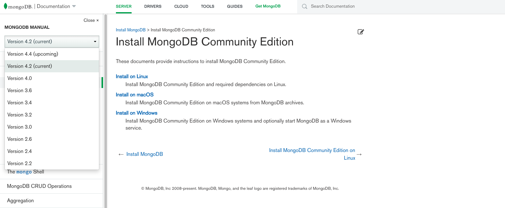

# 数据库和集合基本操作
[[TOC]]

## 1 MongoDB 简介

如果你之前只接触过关系型数据库如 Oracle、Mysql 或 SQL Server，在学习 MongoDB 时可能会感到不安，突然有一款数据库不支持外键，不支持事务，不支持数据类型约定，会给人一种没法用的感觉。

MongoDB 就是这样一款非关系型的数据库，什么叫非关系型？就是把数据直接放进一个大仓库，不标号、不连线、单纯的堆起来。传统数据库由于受到各种关系的累赘，各种数据形式的束缚，难以处理海量数据以及超高并发的业务场景。

为了解决上述问题，必须有一款自废武功，以求在更高层次上突破瓶颈的数据库系统。就像张无忌忘记招式从而学习太极一样，摈弃了固有模式的 MongoDB 才能应对 Facebook 上亿比特的海量数据。

### 1.1 简介

MongoDB 是一个介于关系数据库和非关系数据库之间的产品，是非关系数据库当中功能最丰富、最像关系数据库的。

#### 关系型数据库

关系型数据库模型是把复杂的数据结构归结为简单的二元关系，即二维表格形式：有行和列的概念。在关系数据库中，对数据的操作几乎全部建立在一个或多个关系表格上，通过对这些关联表的表格分类、合并、连接或选取等运算来实现数据的管理。

其中的典型代表就是 MySQL 和 Oracle ，后者所属的美国甲骨文软件系统公司每年凭借该产品可创造数百亿美元的市场价值。

#### 非关系型数据库

非关系型数据库也被称为 NoSQL 数据库。NoSQL 的本意是 Not Only SQL ，意为 “不仅仅是 SQL” ，并非 “不是 SQL” 。因此，NoSQL 的产生并不是要与关系型数据库对立，而是作为传统关系型数据库的一个补充。NoSQL 数据库在特定的场景下可以发挥出难以想象的高效率和高性能。

相比关系型数据库，NoSQL 存储数据时不支持太多约束，且各个文档集合之间没有紧密联系，尤其擅长超大规模数据的存储。

随着互联网 Web2.0 动态网站的兴起，传统的关系型数据库在应付规模日益扩大的海量数据时会显得力不从心，暴露了很多难以克服的问题，传统的关系型数据库 IO 瓶颈、性能瓶颈都难以有效突破。于是开始出现了大批针对特定场景、以高性能和使用便利为目的的功能特异化的数据库产品。NoSQL 数据库就是在这样的情景中诞生并得到了非常迅速的发展。NoSQL 不将数据的一致性作为重点，或者是作为次重点。

由于关系型数据库存储对数据之间存在高度的关联，在数据量达到上万亿比特时，关系型数据库所特有的约束和关联就会成为性能瓶颈。非关系型数据库采用了另一种思维方式，即不考虑数据之间千丝万缕的联系，存储也不需要固定的模式，这样无需多余的操作就能成倍地扩展数据量。

MongoDB 是由 C++ 语言编写的，是一个基于分布式文件存储的开源数据库系统。在高负载的情况下，添加更多的节点可以保证服务器性能。MongoDB 旨在为 Web 应用提供可扩展的高性能数据存储解决方案。

MongoDB 支持的数据结构非常松散,由 Key-Value 键值对组成，是类似 json 的 bson 格式，因此可以存储比较复杂的数据类型，字段值可以包含其它文档、数组，比如：

```text
{
   title: '上周实验学习报告',
   body: '上周我们学习了 MongoDB 的知识',
   by: 'shiyanlou',
}
```

如上是一个基本的文档形式，它存储了一封邮件的简易信息，从这里也可以看出 MongoDB 的‘松散’，它和关系型数据库不同，一个集合里面可以有不同格式的文档，而关系型数据库的每一条记录都拥有相同的字段。

MongoDB 最大的特点是支持的查询语言非常强大，其语法有点类似于面向对象的查询语言，几乎可以实现类似关系数据库单表查询的绝大部分功能，而且还支持对数据建立索引。MongoDB 是一个面向文档集合的、模式自由的非关系型数据库。


### 1.2 面向集合的存储

在 MongoDB 中，一个数据库包含多个集合，类似于 MySQL 中一个数据库包含多个表；一个集合包含多个文档，类似于 MySQL 中一个表包含多条数据。

可以把集合记为表，文档记为一条记录。

这样命名是有原因的，因为 MongoDB 没有行列统一的表格式排列，而是采用一个大仓库的形式将所有数据包纳其中。文档也一样，它是一段自由独立的数据，受外部限制少，所以区别于关系型数据库的记录。

### 1.3 虚拟机开机配置

启动 MongoDB 服务，因为 MongoDB 并不随系统一起启动，可能以下命令运行后会等一小段的时间才会启动完毕。

```bash
$ sudo service mongodb status     # 查看服务状态
$ sudo service mongodb start    # 启动服务
```

进入 MongoDB 命令行操作界面(可能会出现 connect failed，多试几次就行)，在命令行中敲 `exit` 可以退出。

```bash
mongo
```

实验中的布尔类型的 ture 用 1 代替，false 用 0 代替。

### 1.4特点和适用场景

MongoDB 的主要特点如下：

- 是一个面向文档存储的数据库，操作起来比较简单和容易。
- 支持设置任何属性的索引以实现更快的排序和查询操作。
- 可以通过本地或者网络创建数据镜像，这使得 MongoDB 有更强的扩展性。
- 分布式设计，支持增加节点以提升存储空间。
- 支持丰富的查询表达式，查询指令使用 JSON 形式的标记，可轻易查询文档中内嵌的对象及数组。
- Map/Reduce 用来对数据进行批量处理和聚合操作。
- GridFS 用于存放大量小文件。
- 允许在服务端执行脚本，可以用 Javascript 编写某个函数，直接在服务端执行，也可以把函数的定义存储在服务端，下次直接调用即可。
- 支持 Ruby 、Python 、Java 、C++ 、PHP 、C# 等多种编程语言。

MongoDB 的使用场景：

- 网站数据：MongoDB 非常适合实时的插入、更新与查询数据，并具备网站实时数据存储所需的复制及高度伸缩性。
- 缓存：由于性能很高，MongoDB 也适合作为信息基础设施的缓存层。在系统重启之前，由 MongoDB 搭建的持久化缓存层可以避免下层的数据源过载。
- 大尺寸，低价值的数据：使用传统的关系型数据库存储一些数据时可能会比较昂贵，在此之前，很多时候程序员往往会选择传统的文件进行存储。
- 高伸缩性的场景：MongoDB 非常适合由数十或数百台服务器组成的数据库。MongoDB 的路线图中已经包含对 MapReduce 引擎的内置支持。
- 用于对象及 JSON 数据的存储：MongoDB 的 BSON 数据格式非常适合文档化格式的存储及查询。

## 2 基本概念

### 2.1 数据库

- 一个 MongoDB 可以创建多个数据库
- 使用 `show dbs` 可以查看所有数据库的列表
- 执行 `db` 命令则可以查看当前数据库对象或者集合
- 运行 `use` 命令可以连接到指定的数据库

```bash
$ mongo    # 进入到mongo命令行
> use test    # 连接到test数据库
```

注意：数据库名可以是任何字符，但是不能有空格、点号和 $ 字符。

#### 结构

不管我们学习什么数据库，首先都要了解其中的基础概念。在 MongoDB 中基本的概念是文档、集合、数据库，这也是该数据库的基本结构。

MongoDB 分四级存储：

- 数据库 db
- 文档集合 collection（相当于 MySQL 的数据表）
- 文档 document（相当于 MySQL 数据表里的一条数据）
- 字段

下表清楚地展示了各级关系及描述：

| MongoDB 术语 | MySQL 术语 | 说明          |
| ------------ | ---------- | ------------- |
| database     | database   | 数据库        |
| collection   | table      | 集合 / 数据表 |
| document     | row        | 文档 / 数据行 |
| field        | field      | 字段          |

对于熟悉 MySQL 数据库的同学来说，MongoDB 的数据库结构是可以很容易理解的。

### 2.2 文档

文档是 MongoDB 的核心，类似于 SQLite 数据库（关系数据库）中的每一行数据。多个键及其关联的值放在一起就是文档。在 Mongodb 中使用一种类 json 的 bson 存储数据，bson 数据可以理解为在 json 的基础上添加了一些 json 中没有的数据类型。

例如：

```text
{"company":"Chenshi keji"}
```

### 2.3 文档的逻辑联系

假设有两个文档：

```text
# user文档
{
   "name": "Tom Hanks",
   "contact": "987654321",
   "dob": "01-01-1991"
}

# address文档
{
   "building": "22 A, Indiana Apt",
   "pincode": 123456,
   "city": "chengdu",
   "state": "sichuan"
}
```

关系 1：嵌入式关系：把 address 文档嵌入到 user 文档中

```text
# 这就是嵌入式的关系
{
   "name": "Tom Hanks",
   "contact": "987654321",
   "dob": "01-01-1991",
   "address":
   [{
   "building": "22 A, Indiana Apt",
   "pincode": 123456,
   "city": "chengdu",
   "state": "sichuan"
   },
   {
   "building": "170 A, Acropolis Apt",
   "pincode": 456789,
   "city": "beijing",
   "state": "beijing"
   }]
}
```

关系 2：引用式关系：将两个文档分开，通过引用文档的_id 字段来建立关系

```text
# 这就是引用式关系
{
   "name": "Tom Benzamin",
   "contact": "987654321",
   "dob": "01-01-1991",
   "address_ids": [
      ObjectId("52ffc4a5d85242602e000000")    #对应address文档的id字段
   ]
}
```

在实际应用的时候，嵌入式关系比较适合一对一的关系，引用式关系比较适合一对多或者多对多的情况。

### 2.4 集合

集合就是一组文档的组合，就相当于是**关系数据库中的表**，在 MongoDB 中可以存储不同的文档结构的文档。

例如：

```text
{"company":"Chenshi keji"} {"people":"man","name":"peter"}
```

上面两个文档就可以存储在同一个集合中，在关系型数据库中是很难实现上述数据结构的，要么需要定义大量的字段，对于一些字段名不确定的属性，关系型数据库会更加力不从心。

MongoDB 的做法也不是完美的。比如在存储用户信息的时候，用户名和密码分别用 username 和 password 字段表示。 关系型数据库只需要把字段名作为表结构的一部分保存起来就可以了，而 MongoDB 需要将这两个字段名存储多次，每一条记录都会存储一次字段名，在一些原本就比较碎片化的字段上，用于存储字段名所耗费的空间甚至会超过存储数值的空间，比较好的解决办法是采用尽可能短的字段名，不过这又涉及到了可读性的问题，需要大家在二者之间进行权衡。

### 2.5 元数据

数据库的信息存储在集合中，他们统一使用系统的命名空间：`DBNAME.system.*`。

DBNAME 可用 db 或数据库名替代：

- DBNAME.system.namespaces ：列出所有名字空间
- DBNAME.system.indexs ：列出所有索引
- DBNAME.system.profile ：列出数据库概要信息
- DBNAME.system.users ：列出访问数据库的用户
- DBNAME.system.sources ：列出服务器信息

## 3 安装

[教程](https://www.mongodb.com/docs/manual/tutorial/install-mongodb-on-ubuntu/)

MongoDB 数据库在 2007 年 10 月由 10gen 团队所创建，在 2009 年 2 月首度推出。其中 10gen 是专门创建和维护 MongoDB 数据库的著名团队。

截止 2020 年 2 月，最新的版本是 MongoDB4.2 ，可以根据自己所使用的操作系统在官网上安装最新版本。官方下载地址：https://docs.mongodb.com/manual/administration/install-community/ 。



在我们的实验环境中已经安装了比较领先的 MongoDB4.0 版本，无需升级即可学习本课程。

打开实验环境，在终端命令行执行 `which mongo` 命令可以找到它的可执行文件的绝对路径，这也证明了实验环境中已经安装 MongoDB ：

```bash
shiyanlou:project/ $ cd
shiyanlou:~/ $ which mongo
/usr/bin/mongo
shiyanlou:~/ $
```

执行 `mongo --version` 命令查看版本：

```bash
shiyanlou:~/ $ mongo --version
MongoDB shell version v4.0.12
git version: 5776e3cbf9e7afe86e6b29e22520ffb6766e95d4
OpenSSL version: OpenSSL 1.0.2g  1 Mar 2016
allocator: tcmalloc
modules: none
build environment:
    distmod: ubuntu1604
    distarch: x86_64
    target_arch: x86_64
shiyanlou:~/ $
```

## 4 数据库的创建和销毁

### 4.1 创建数据库

启动服务后，进入 MongoDB 命令行操作界面：

```bash
mongo
```

使用 use 命令创建数据库：

```bash
use mydb
```

查看当前连接的数据库：

```bash
db
```

查看所有的数据库：

```bash
show dbs
```

列出的所有数据库中看不到 mydb 或者显示 mydb(empty) ，因为 mydb 为空，里面没有任何东西，MongoDB 不显示或显示 mydb(empty)。

### 4.2 销毁数据库

使用 db.dropDatabase() 销毁数据库：

```bash
> use local
switched to db local
> db.dropDatabase()
```

查看所有的数据库：

```bash
> show dbs
```

可以发现 local 数据库已经被删除了。

## 5 集合的创建和删除

### 5.1 创建集合

在数据库 mydb 中创建一个集合

```bash
> use mydb
switched to db mydb
> db.createCollection("users")
```

查看创建的集合：

```bash
> show collections
```

### 5.2 删除集合

删除集合的方法如下：（删除 users 集合）

```bash
> show collections
> db.users.drop()
```

查看是否删除成功：

```bash
> show collections
```

## 6 向集合中插入数据

### 6.1 使用 insert()

插入数据时，如果 users 集合没有创建会自动创建。

```bash
> use mydb
switched to db mydb
> db.users.insert([
... { name : "jam",
... email : "jam@qq.com"
... },
... { name : "tom",
... email : "tom@qq.com"
... }
... ])
```

### 6.2 使用 save()

插入数据时，如果 users 集合没有创建会自动创建。

```bash
> use mydb2
switched to db mydb2
> db.users.save([
... { name : "jam",
... email : "jam@qq.com"
... },
... { name : "tom",
... email : "tom@qq.com"
... }
... ])
```

insert 和 save 的区别：为了方便记忆，可以先从字面上进行理解，insert 是插入，侧重于新增一个记录的含义；save 是保存，可以保存一个新的记录，也可以保存对一个记录的修改。因此，insert 不能插入一条已经存在的记录，如果已经有了一条记录(以主键为准)，insert 操作会报错，而使用 save 指令则会更新原记录。