# 数据库的安装与使用
[[TOC]]

## 如何下载mariaDB
1 百度一下,去到官网下载(mariadb.org ) (org一般用于组织,即免费)


2 点击隐藏的菜单


3 点击下载(download)


4 下载

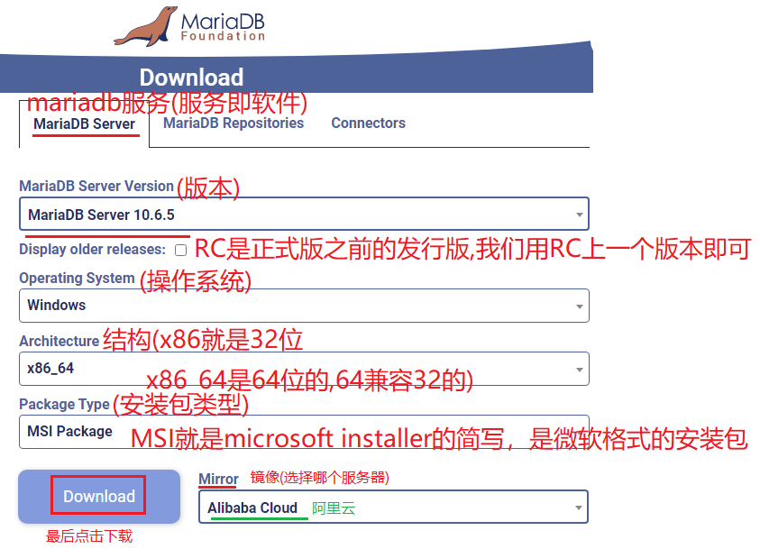


5 下载管理器中查看


##  mariaDB的安装流程
**1.安装**

1 打开文件


2 运行

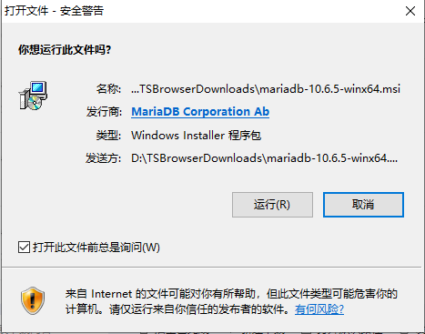


3 next(下一步)

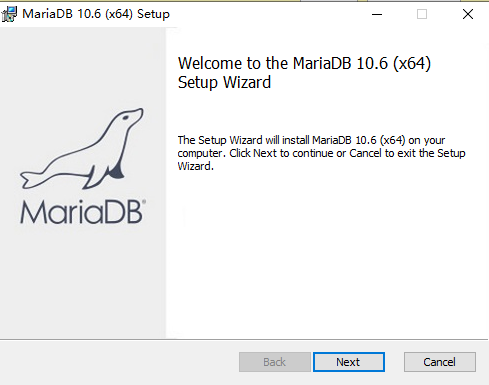


4 同意条款(勾选),并下一步(next)

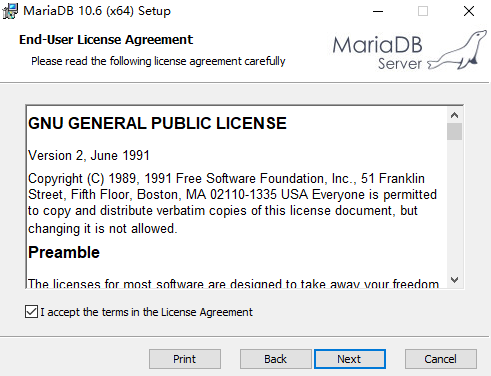


5 自定义安装(选下一步即可,默认安装在C盘)

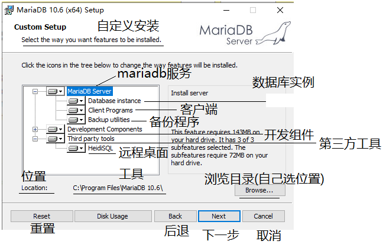


6 输入数据库系统的密码(默认用户名也是root)

​	用户名是root ,密码也是root (实际密码由老板决定)

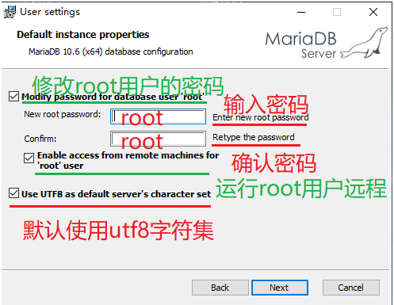


7 数据库系统配置

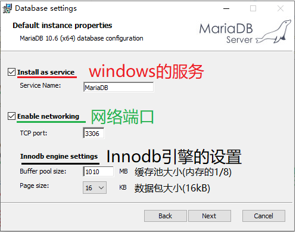


8 安装

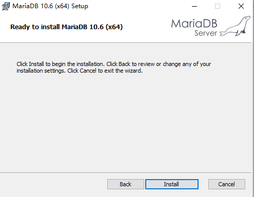


9 安装完成

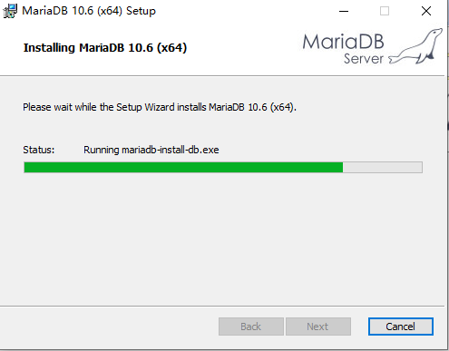


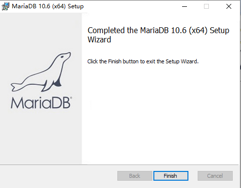

**2 测试MySQL是否安装成功**

1. 从开始菜单中找到MariaDB里面的MySQL Client 运行,输入密码root后回车 提示以下信息说明连接成功！

   登录指令:`mysql -uroot -p`

   退出指令:`exit`

   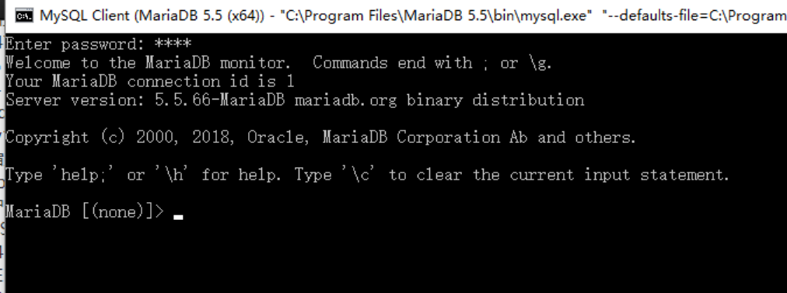

2. 再次执行测试的SQL 命令 select 'HelloWorld';

   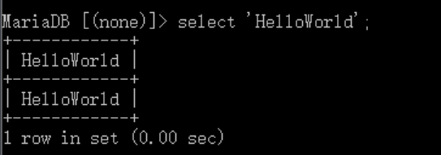

3. 显示以上内容说明安装成功！

**3 启停MySQL服务**

1. 按Win+R组合键打开运行窗口，如下图所示，输入services.msc命令

   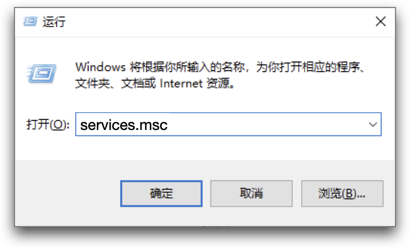

2. 找到MySQL服务，利用右键停止服务或者开启服务。

   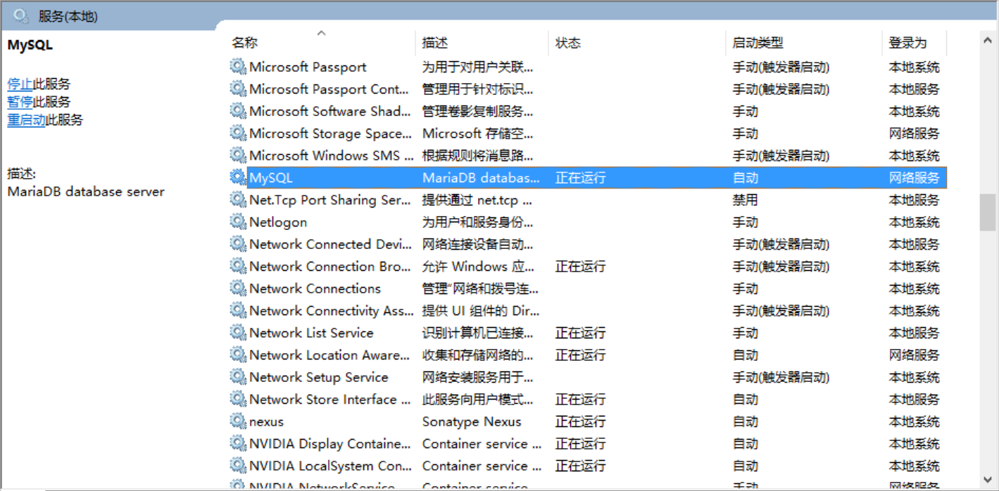

## 报错

### 中文问题:              

- 错误原因是客户端和MySQL之间编解码字符集不一致导致的

- 解决方案:  修改MySQL的解码字符集为gbk

```sql
set names gbk;
```

## 数据库的配置

步骤1:  拿到 C:\Program Files\MariaDB 10.6\bin

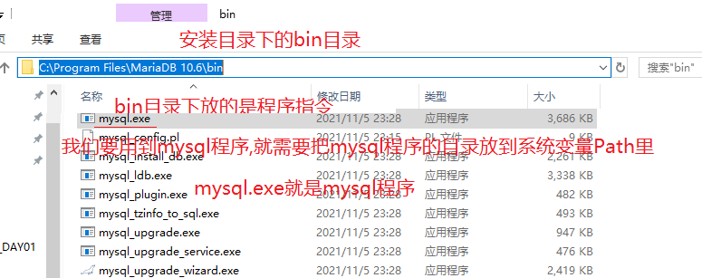


步骤2: 把  C:\Program Files\MariaDB 10.6\bin 放到系统变量Path里

此电脑-->右键-->属性-->高级系统设置-->环境变量-->Path

-->编辑-->新建-->粘贴(C:\Program Files\MariaDB 10.6\bin)

-->确定-->确定-->确定

步骤3: win+r(打开运行)-->输入 cmd(命令提示符软件)

 -->回车-->输入 mysql -uroot -proot -->回车

-->如果弹出  "MariaDB [(none)]> " 表示登陆成功,即配置成功

##  数据库的卸载

#### 1 停止MySQL的所有服务

就像一个正在使用中的文件是无法删除的一样
我们想要卸载MySQL,首先就需要把计算机中MySQL相关的所有服务都停止。
给大家提供两种方式:

##### 方式1：

右键“我的电脑”，选择“管理”


选择“服务和应用程序”，继续选择"服务"


将页面中所有MySQL相关的服务逐一的全部关闭。

##### 方式2：

win+R键打开运行窗口，输入“cmd”，点击“确定”或直接回车


在打开的窗口输入命令 net stop mysql 回车
这个命令的作用也是关闭MySQL的所有服务


#### 2 卸载MySQL程序

右键“此电脑”，选择“属性”，点击“控制面板主页”，在打开的页面中选择“卸载程序”


#### 3 删除电脑上的MySQL文件

删除MySQL安装目录文件夹。
如果安装位置是默认位置，一般为 C:\ProgramData\MySQL

#### 4 删除电脑上MySQL注册表的相关信息

1. 用“Win+R”快捷键打开运行窗口，输入“regedit”
   
   

2. 在打开的注册表编辑器页面，用“Ctrl+F”查找所有关于“MySQL”的注册表，全部删掉
   
   

3. 删除MySQL相关注册表（这是方法2，还是推荐使用上面的方法1哦）具体要删除的，一般为以下几个路径：

1）HKEY_LOCAL_MACHINE\SYSTEM\ControlSet001\Services\Eventlog\Application\MySQL
2）HKEY_LOCAL_MACHINE\SYSTEM\ControlSet002\Services\Eventlog\Application\MySQL3.HKEY_LOCAL_MACHINE\SYSTEM\CurrentControlSet\Services\Eventlog\Application\MySQL

#### 5 删除电脑C盘MySQL相关文件夹

如果有的话就删除，没有此步骤跳过
将C:\Documents and Settings\All Users\Application Data\MySQL下的文件夹删除，该文件夹有可能是隐藏的，需设为可见后才能删除。

以上MySQL就卸载完成啦，可以重启电脑后再安装MySQL.

## SQl介绍
### 数据库和SQL概念
数据库（`Database`）是按照数据结构来组织、存储和管理数据的仓库，它的产生距今已有六十多年。随着信息技术和市场的发展，数据库变得无处不在：它在电子商务、银行系统等众多领域都被广泛使用，且成为其系统的重要组成部分。

数据库用于记录数据，使用数据库记录数据可以表现出各种数据间的联系，也可以很方便地对所记录的数据进行增、删、改、查等操作。

结构化查询语言(`Structured Query Language`)简称 SQL，是上世纪 70 年代由 IBM 公司开发，用于对数据库进行操作的语言。更详细地说，SQL 是一种数据库查询和程序设计语言，用于存取数据以及查询、更新和管理关系数据库系统，同时也是数据库脚本文件的扩展名。

### 什么是数据库

简而言之，就是存储数据，管理数据的仓库。

常见的数据库分为：

- 关系型数据库， Oracle、MySQL、SQLServer、Access
- 非关系型数据库， MongoDB、Redis、Solr、ElasticSearch、Hive、HBase
  

### 关系型和非关系型

早期发展的数据库建立在数据的紧密关系基础之上（如：父子关系、师生关系），我们称其为关系型数据库，也称为传统数据库；现今数据库建立在数据的松散关系基础之上（如：中国人和美国人、中国人和印度人、视频、音频），我们称其为非关系型数据库nosql（not only sql）。业界总在争论nosql能否干掉传统数据库，很多初学者也有这个困惑。以我来看，两者没有矛盾，它们各有特点，根据业务情况互补才是真谛。但总的来说原来关系型数据库一统天下的格局早被打破，领土不断被蚕食，规模一再的缩小，虽然无法全面被替代，但却早已风光不在，沦落到一偶之地，Oracle的衰落就是最好的证明，早期只要是全球大企业无一例外都是部署Oracle，但现在都在去Oracle化，阿里就已经全面排斥Oracle。


既然干不掉，很多传统项目的还是围绕关系型数据库的居多，所以我们先来学习关系型数据库，目前最流行的关系型数据库是MySQL。

### 关系型数据库

关系型数据库有特定的组织方式，其以行和列的形式存储数据，以便于用户理解。关系型数据库这一系列的行和列被称为表，一组表组成了数据库。用户通过查询来检索数据库中的数据，而查询是一个用于限定数据库中某些区域的执行代码。关系模型可以简单理解为二维表格模型，而一个关系型数据库就是由二维表及其之间的关系组成的一个数据集合。


### MySQL介绍

MySQL 是一个 DBMS（数据库管理系统），由瑞典 MySQLAB 公司开发，目前属于 Oracle 公司，MySQL 是最流行的关系型数据库管理系统（关系数据库，是建立在关系数据库模型基础上的数据库，借助于集合代数等概念和方法来处理数据库中的数据）。由于其体积小、速度快、总体拥有成本低，尤其是开放源码这一特点，一般中小型网站的开发者都选择 MySQL 作为网站数据库。MySQL 使用 SQL 语言进行操作。

## DBMS

DataBaseManagementSystem:数据库管理系统(数据库软件)

常见的几种DBMS:

* MySOL:Oracle公司产品,08年被Sun公司收购,09年Sun公司被Oracle收购--------开源产品,市占率第一
* Oracle:闭源产品,性能最强,价格最贵,市占率第二
* SQLServer:微软公司产品,闭源产品,市占率第三
* SQLite:轻量级数据库,安装包几十k,只具备最基础的增删改查功能.

## Mysql数据库

1. mysql服务端，它来处理具体数据维护，保存磁盘
2. mysql客户端，CRUD新增，修改，删除，查询

### MySQL数据存放在哪里？

在MySQL的配置文件my.ini中会进行默认配置


### MySQL服务端

mysql-5.5.27-winx64.msi


Mysql数据库默认的编码是latin1等价于iso-8859-1，修改为utf-8


注意：配置完，mysql开始执行，最后一步出错有时仍可以使用，使用SQLyog工具测试，如不行，再执行安装程序，选择remove，删除，然后重新安装。同时注意必须是管理员权限。


### MySQL客户端1：DOS窗口

**mysql -uroot -proot**

语法：mysql.exe执行文件

代表参数

-u 用户名，紧接着写的

-p 密码，紧接着写的

### MySQL客户端2：可视化工具


## MySQL安装
### 安装之前的检查
先要检查 Linux 系统中是否已经安装了 MySQL，输入命令尝试打开 MySQL 服务：

```bash
sudo service mysql start
```
如果提示是这样的，则说明系统中没有 MySQL，需要继续安装：

```bash
mysql: unrecognized service

```
### Ubuntu Linux安装配置MySQL
在 Ubuntu 上安装 MySQL，最简单的方式是在线安装。只需要几行简单的命令（  `#`  号后面是注释）：

```bash
#安装 MySQL 服务端、核心程序
sudo apt-get install mysql-server

#安装 MySQL 客户端
sudo apt-get install mysql-client

```

在安装过程中会提示确认输入 YES，设置 root 用户密码（之后也可以修改）等，稍等片刻便可安装成功。

安装结束后，用命令验证是否安装并启动成功：

```bash
sudo netstat -tap | grep mysql
```
此时，可以根据自己的需求，用 gedit 修改 MySQL 的配置文件（my.cnf）,使用以下命令:

```bash
sudo gedit /etc/mysql/my.cnf

```

至此，MySQL 已经安装、配置完成，可以正常使用了。
### 尝试MySQL
**1). 打开 MySQL：**

使用如下两条命令，打开 MySQL 服务并使用 root 用户登录：

```bash
# 启动 MySQL 服务
sudo service mysql start

# 使用 root 用户登录，实验楼环境的密码为空，直接回车就可以登录
mysql -u root

```
**2). 查看数据库：**

使用命令  `show databases;`，查看有哪些数据库（注意不要漏掉分号  `;`）
**3). 连接数据库：**

选择连接其中一个数据库，语句格式为  `use <数据库名>`，这里可以不用加分号.
**4). 查看表：**

使用命令  `show tables;`  查看数据库中有哪些表（**注意不要漏掉“;”**）
**5). 退出：**

使用命令  `quit`  或者  `exit`  退出 MySQL。

## Windows中MySQL的安装

2018 年，MySQL8 正式版 8.0.11 已发布，官方表示 MySQL8 要比 MySQL5.7 快 2 倍，还带来了大量的改进和更快的性能！

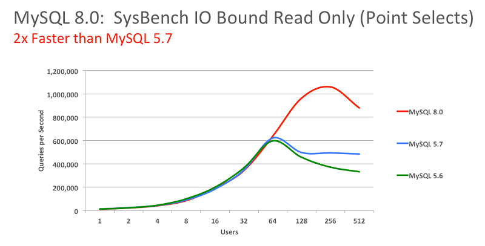

本教程使用的 MySQL 数据库版本是 8.0.11，如果你已经安装了其他版本的 MySQL 则可以忽略这一节，如果你想掌握 MySql8 的安装使用则可以跟着十三的教程体验一把。

#### 下载安装包

首先到 MySql8 Installer 的下载页面：https://dev.mysql.com/downloads/mysql/8.0.html

选择对应的版本然后点击"Dowanload"按钮，之后会跳转到下载页面，点击页面下方的`No thanks, just start my download.`即可进行下载。

#### 安装

#### 解压至安装目录

首先是确定 MySql8 的安装目录，可以自行决定，十三是将其安装在`F:\mysql-8.0.11-winx64`目录下，解压安装包至安装目录下即可。

#### 配置文件

在安装目录下新建配置文件`my.ini`，配置文件中写入：

```
[mysqld]
port=3306
basedir =F:\mysql-8.0.11-winx64
datadir =F:\mysqlData\
max_allowed_packet = 20M
```

保存即可，其中`datadir`为数据存储目录，十三将其放在了`F:\mysqlData\`目录下，你可以对应的进行修改。

#### 初始化 MySql8

打开命令行，进入 MySQL 的 bin 目录下，之后进行初始化，命令为：

```
mysqld --initialize --console
```

初始化成功后，命令行会打印出 root 用户的初始密码(**记得保存**，如果没有保存或者忘记的话，删掉初始化的 datadir 目录再次进行初始化即可)，过程如下图：


#### 启动 MySQL 服务

在启动服务前，首先要将 MySQL 安装为 Windows 的系统服务，在 MySQL 的 bin 目录执行命令如下：

```
mysqld --install mysql8
```

其中 MySql8 为服务名称，你可以自行修改成想要的名字。

服务注册成功后，就可以启动 MySQL 服务了，执行命令： `net start mysql8`

#### 登录 MySql8


服务启动成功后，则可以登录 Mysql 服务器了，在 bin 目录下执行`mysql -uroot -p`，输入刚刚保存的密码即可，不过首次登录 Mysql 时需要修改 root 用户密码，不然是无法进行操作的，因此需要执行修改 root 用户密码操作：

```sql
ALTER USER 'root'@'localhost' IDENTIFIED WITH mysql_native_password BY '131313';
FLUSH PRIVILEGES;
```

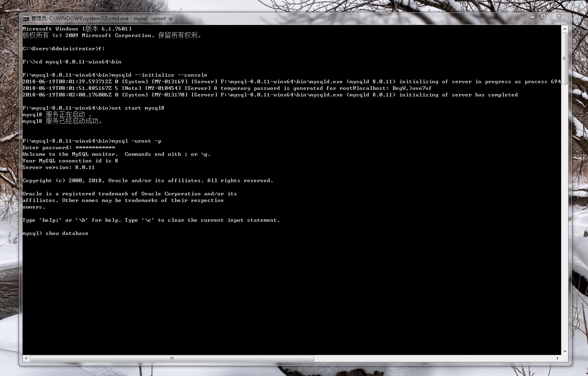

修改密码为`131313`，你可以按照你的要求进行设置，之后就可以进行操作了。

#### 验证

通过客户端连接 MySql8，输入用户名密码无报错即为登录成功，如下图：


安装成功！
