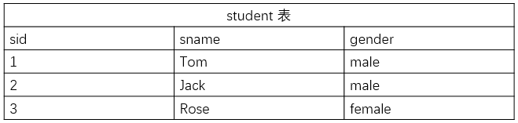
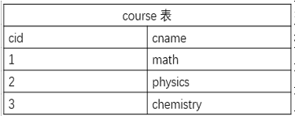
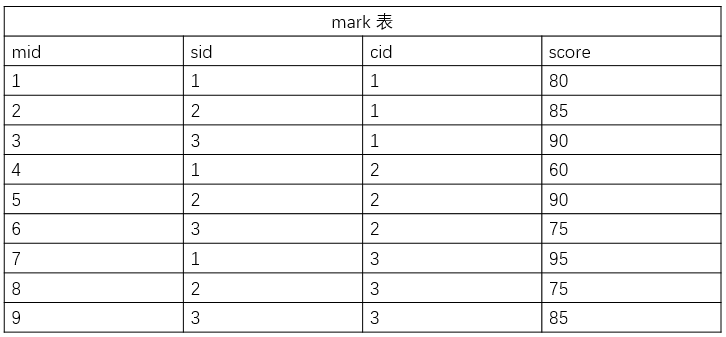

# 约束
[[TOC]]

约束是一种限制，它通过**对表的行或列的数据做出限制，来确保表的数据的完整性、唯一性。**

## 约束分类

比如，规定一个用户的用户名不能为空值且没有重复的记录，这就是一种约束规则。

在 MySQL 中，通常有这几种约束：

| 约束类型： | 主键        | 默认值  | 唯一   | 外键        | 非空     |
| ---------- | ----------- | ------- | ------ | ----------- | -------- |
| 关键字：   | PRIMARY KEY | DEFAULT | UNIQUE | FOREIGN KEY | NOT NULL |

## 建立含约束的表

下载完成后，输入命令开启 MySQL 服务并使用 root 用户登录：

```sql
#打开 MySQL 服务
sudo service mysql start

#使用 root 用户登录
mysql -u root

show tables;
```


## 主键

在数据库中，如果有两行记录数据完全一样，那么如何来区分呢？ 答案是无法区分，如果有两行记录完全相同，那么对于 Mysql 就会认定它们是同一个实体，这与现实生活是存在差别的。

假如我们要存储一个学生的信息，信息包含姓名，身高，性别，年龄。

不幸的是有两个女孩都叫小梦，且她们的身高和年龄相同，数据库将无法区分这两个实体，这时就需要用到主键了。

主键（**PRIMARY KEY**）作为数据表中一行数据的**唯一标识符**，在一张表中通过主键就能准确定位到某一行数据，因此主键十分重要，它不能有重复记录且不能为空。

```sql
id  INT(10)PRIMARY KEY,//定义主键的方法
CONSTRAINT dpt_pk PRIMARY KEY(dpt_name)//定义一个dpt_pk的主键
CONSTRAINT dpt_pk PRIMARY KEY(proj_num,proj_name)//定义一个dpt_pk的复合主键,主键不仅可以是表中的一列，也可以由表中的两列或多列来共同标识.
```

## 主键约束primary key


主键约束：如果为一个列添加了主键约束，那么这个列就是主键，主键的特点是唯一且不能为空。通常情况下，每张表都会有主键。--------限制主键的值,唯一且非空

添加主键约束，例如将id设置为主键：

```sql
 create table t1 (id int primary key,name varchar(50));
 insert into t1 values(1,"aaa");
```


**主键自增策略**:当主键为数值类型时，为了方便维护，可以设置主键自增策略（auto_increment），设置了主键自增策略后，数据库会在表中保存一个AUTO_INCREMENT变量值，初始值为1，当需要id值，不需要我们指定值，由数据库负责从AUTO_INCREMENT获取一个id值，作为主键值插入到表中。而且每次用完AUTO_INCREMENT值，都会自增1. AUTO_INCREMENT=1

```java
create table abc(
id int primary key auto_increment
);
insert into abc values(null);
insert into abc values(null);
insert into abc values(null);
select * from abc;
```

**自增规则--从历史最大值基础上+1**

## 默认值约束default

默认值约束 (DEFAULT) 规定，当有 DEFAULT 约束的列，插入数据为空时，将使用默认值。

默认值常用于一些可有可无的字段，比如用户的个性签名，如果用户没有设置，系统给他应该设定一个默认的文本，比如空文本或 ‘这个人太懒了，没有留下任何信息’

```sql
people_num INT(10) DEFAULT 10,
```

DEFAULT 约束只会在使用 INSERT 语句（上一实验介绍过）时体现出来， INSERT 语句中，如果被 DEFAULT 约束的位置没有值，那么这个位置将会被 DEFAULT 的值填充，如语句：

```sql
# 正常插入数据
INSERT INTO department(dpt_name,people_num) VALUES('dpt1',11);

#插入新的数据，people_num 为空，使用默认值
INSERT INTO department(dpt_name) VALUES('dpt2');

#查看department
SELECT * FROM department;
```


## 唯一约束unique

唯一约束 (UNIQUE) 比较简单，它规定一张表中指定的一列的值必须不能有重复值，即这一列每个值都是唯一的（即不能重复），但可以为空。

添加唯一约束，例如为username添加唯一约束及非空约束：

```java
create table test(
id int primary key auto_increment,
username varchar(50) unique--唯一约束
);
show tables;
insert into test values(null,'lisi');
insert into test values(null,'lisi');--username的值要唯一,重复会报错的
select * from test;
```

```sql
#这里有UNIQUE约束,phone的值唯一
UNIQUE (phone),
```


当 INSERT 语句新插入的数据和已有数据重复的时候，如果有 UNIQUE 约束，则 INSERT 失败，比如：

```sql
INSERT INTO employee VALUES(01,'Tom',25,3000,110110,'dpt1');
INSERT INTO employee VALUES(02,'Jack',30,3500,110110,'dpt2');
```


## 外键约束foreign key

外键 (FOREIGN KEY) 既能确保数据完整性，也能表现表之间的关系。

比如，现在有用户表和文章表，给文章表中添加一个指向用户 id 的外键，表示这篇文章所属的用户 id，外键将确保这个外键指向的记录是存在的，如果你尝试删除一个用户，而这个用户还有文章存在于数据库中，那么操作将无法完成并报错。因为你删除了该用户过后，他发布的文章都没有所属用户了，而这样的情况是不被允许的。同理，你在创建一篇文章的时候也不能为它指定一个不存在的用户 id。

一个表可以有多个外键，每个外键必须 REFERENCES (参考) 另一个表的主键，被外键约束的列，取值必须在它参考的列中有对应值。

```sql
CONSTRAINT emp_fk FOREIGN KEY(in_dpt) REFERENCES department(dpt_name
```

在 INSERT 时，如果被外键约束的值没有在参考列中有对应，比如以下命令，参考列 (department 表的 dpt_name) 中没有 dpt3，则 INSERT 失败：

```sql
INSERT INTO employee VALUES(02,'Jack',30,3500,114114,'dpt3');
```

可见之后将 dpt3 改为 dpt2（department 表中有 dpt2），则插入成功.

## 非空约束not null

非空约束 (NOT NULL),听名字就能理解，被非空约束的列，在插入值时必须非空，但可以重复。

添加非空约束，例如为password添加非空约束：

```java
create table user(
id int primary key auto_increment,
password varchar(50) not null
);
show tables;
insert into user values(null,null);//不符合非空约束
insert into user values(null,123;);//OK
```

```sql
age INT(10),//没有非空约束
salary INT(10) NOT NULL,//有非空约束
```

在 MySQL 中违反非空约束，会报错，比如以下语句：

```sql
#INSERT 成功 age 为空，因为没有非空约束，表中显示 NULL
INSERT INTO employee(id,name,salary,phone,in_dpt) VALUES(03,'Jim',3400,119119,'dpt2');

#报错 salary 被非空约束，插入数据失败
INSERT INTO employee(id,name,age,phone,in_dpt) VALUES(04,'Bob',23,123456,'dpt1');
```

## 检查约束 check

很少使用，了解即可，录入age超过200将报错

```sql
DROP TABLE IF EXISTS tb_user; #如果表存在则删除，慎用会丢失数据
CREATE TABLE tb_user (
id INT PRIMARY KEY NOT NULL AUTO_INCREMENT, #自增主键
NAME VARCHAR(50) NOT NULL UNIQUE, #非空，唯一索引
sex CHAR(2) DEFAULT '男', #默认值
phone CHAR(18),
age INT,
CHECK (age>0 AND age<=200),
createdTime DATE DEFAULT NOW()
);
DESC tb_user;
```

## 示例代码

现需要构建一个简易的成绩管理系统的数据库，来记录几门课程的学生成绩。数据库中有三张表分别用于记录学生信息、课程信息和成绩信息。

数据表结构如下：

学生表(student)：学生 id 、学生姓名和性别



课程表：课程 id 和课程名



成绩表：成绩 id 、学生 id 、课程 id 和分数



- 建立表时注意 id 自增和键约束
- 每个表插入语句可通过一条语句完成

```sql
CREATE DATABASE gradesystem;

use gradesystem

CREATE TABLE student(
    sid int NOT NULL AUTO_INCREMENT,
    sname varchar(20) NOT NULL,
    gender varchar(10) NOT NULL,
    PRIMARY KEY(sid)
    );

CREATE TABLE course(
    cid int NOT NULL AUTO_INCREMENT,
    cname varchar(20) NOT NULL,
    PRIMARY KEY(cid)
    );
   
# sid和cid与其他两个表有关系
CREATE TABLE mark(
    mid int NOT NULL AUTO_INCREMENT,
    sid int NOT NULL,
    cid int NOT NULL,
    score int NOT NULL,
    PRIMARY KEY(mid),
    FOREIGN KEY(sid) REFERENCES student(sid),
    FOREIGN KEY(cid) REFERENCES course(cid)
    );

INSERT INTO student VALUES(1,'Tom','male'),(2,'Jack','male'),(3,'Rose','female');

INSERT INTO course VALUES(1,'math'),(2,'physics'),(3,'chemistry');

INSERT INTO mark VALUES(1,1,1,80),(2,2,1,85),(3,3,1,90),(4,1,2,60),(5,2,2,90),(6,3,2,75),(7,1,3,95),(8,2,3,75),(9,3,3,85);
```
