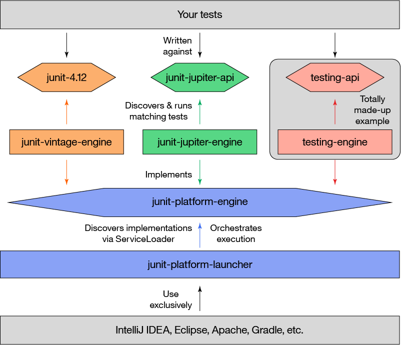

# 第一个单元测试
[[TOC]]

## Junit5的架构

与以前版本的JUnit不同，JUnit 5由三个不同子项目中的几个不同模块组成。

> JUnit 5 = JUnit Platform + JUnit Jupiter + JUnit Vintage

- **JUnit Platform**是基于JVM的运行测试的基础框架在，它定义了开发运行在这个测试框架上的TestEngine API。此外该平台提供了一个控制台启动器，可以从命令行启动平台，可以为Gradle和 Maven构建插件，同时提供基于JUnit 4的Runner。
- **JUnit Jupiter**是在JUnit 5中编写测试和扩展的新编程模型和扩展模型的组合.Jupiter子项目提供了一个TestEngine在平台上运行基于Jupiter的测试。
- **JUnit Vintage**提供了一个TestEngine在平台上运行基于JUnit 3和JUnit 4的测试。

架构图如下:



### 常用注解

**@Test** 表示方法是一种测试方法。 与JUnit 4的@Test注解不同，此注释不会声明任何属性。

**@ParameterizedTest** 表示方法是参数化测试

**@RepeatedTest** 表示方法是重复测试模板

**@TestFactory** 表示方法是动态测试的测试工程

**@DisplayName** 为测试类或者测试方法自定义一个名称

**@BeforeEach** 表示方法在每个测试方法运行前都会运行 ，**@AfterEach** 表示方法在每个测试方法运行之后都会运行

**@BeforeAll** 表示方法在所有测试方法之前运行 ，**@AfterAll** 表示方法在所有测试方法之后运行

**@Nested** 表示带注解的类是嵌套的非静态测试类，**@BeforeAll**和 **@AfterAll**方法不能直接在@Nested测试类中使用，除非修改测试实例生命周期。

**@Tag** 用于在类或方法级别声明用于过滤测试的标记

**@Disabled** 用于禁用测试类或测试方法

**@ExtendWith** 用于注册自定义扩展，该注解可以继承

**@FixMethodOrder(MethodSorters.NAME_ASCENDING)**，控制测试类中方法执行的顺序，这种测试方式将按方法名称的进行排序，由于是按字符的字典顺序，所以以这种方式指定执行顺序会始终保持一致；不过这种方式需要对测试方法有一定的命名规则，如 测试方法均以testNNN开头（NNN表示测试方法序列号 001-999）

## 编写单元测试

### Maven包引入

```xml
<?xml version="1.0" encoding="UTF-8"?>
<project xmlns="http://maven.apache.org/POM/4.0.0"
         xmlns:xsi="http://www.w3.org/2001/XMLSchema-instance"
         xsi:schemaLocation="http://maven.apache.org/POM/4.0.0 http://maven.apache.org/xsd/maven-4.0.0.xsd">
    <modelVersion>4.0.0</modelVersion>

    <groupId>pdai.tech</groupId>
    <artifactId>java-junit5</artifactId>
    <version>1.0-SNAPSHOT</version>

    <dependencies>
        <!-- Only needed to run tests in a version of IntelliJ IDEA that bundles older versions -->
        <dependency>
            <groupId>org.junit.platform</groupId>
            <artifactId>junit-platform-launcher</artifactId>
            <version>1.7.0</version>
            <scope>test</scope>
        </dependency>
        <dependency>
            <groupId>org.junit.jupiter</groupId>
            <artifactId>junit-jupiter-engine</artifactId>
            <version>5.7.0</version>
            <scope>test</scope>
        </dependency>
        <dependency>
            <groupId>org.junit.vintage</groupId>
            <artifactId>junit-vintage-engine</artifactId>
            <version>5.7.0</version>
            <scope>test</scope>
        </dependency>
        <dependency>
            <groupId>org.junit.jupiter</groupId>
            <artifactId>junit-jupiter-api</artifactId>
            <version>5.7.0</version>
        </dependency>

        <!-- lombok -->
        <dependency>
            <groupId>org.projectlombok</groupId>
            <artifactId>lombok</artifactId>
            <version>1.18.16</version>
        </dependency>
    </dependencies>

</project>

```
### 测试:HelloWorld
```java
package tech.pdai.junit5;

import org.junit.jupiter.api.Test;

import static org.junit.jupiter.api.Assertions.assertEquals;

/**
 * Hello world test.
 *
 * @author pdai
 */
public class HelloWorldTest {

    @Test
    void firstTest() {
        assertEquals(2, 1 + 1);
    }
}

```
@Test注解在方法上标记方法为测试方法，以便构建工具和 IDE 能够识别并执行它们。JUnit 5不再需要手动将测试类与测试方法为public，包可见的访问级别就足够了。


### 测试:生命周期

首先，需要对比下Junit5和Junit4注解:

| Junit4       | Junit5          | 注释                                                         |
| ------------ | --------------- | ------------------------------------------------------------ |
| @Test        | @Test           | 表示该方法是一个测试方法                                     |
| @BeforeClass | **@BeforeAll**  | 表示使用了该注解的方法应该在当前类中所有测试方法之前执行（只执行一次），并且它必须是 static方法（除非@TestInstance指定生命周期为Lifecycle.PER_CLASS） |
| @AfterClass  | **@AfterAll**   | 表示使用了该注解的方法应该在当前类中所有测试方法之后执行（只执行一次），并且它必须是 static方法（除非@TestInstance指定生命周期为Lifecycle.PER_CLASS） |
| @Before      | **@BeforeEach** | 表示使用了该注解的方法应该在当前类中每一个测试方法之前执行   |
| @After       | **@AfterEach**  | 表示使用了该注解的方法应该在当前类中每一个测试方法之后执行   |
| @Ignore      | @Disabled       | 用于禁用（或者说忽略）一个测试类或测试方法                   |
| @Category    | @Tag            | 用于声明过滤测试的tag标签，该注解可以用在方法或类上          |

测试用例:

```java
package tech.pdai.junit5;

import static org.junit.jupiter.api.Assertions.fail;
import static org.junit.jupiter.api.Assumptions.assumeTrue;

import lombok.extern.slf4j.Slf4j;
import org.junit.jupiter.api.AfterAll;
import org.junit.jupiter.api.AfterEach;
import org.junit.jupiter.api.BeforeAll;
import org.junit.jupiter.api.BeforeEach;
import org.junit.jupiter.api.Disabled;
import org.junit.jupiter.api.Test;

/**
 * Standard Test.
 *
 * @author pdai
 */
public class StandardTest {

    @BeforeAll
    static void initAll() {
        System.out.println("BeforeAll");
    }

    @BeforeEach
    void init() {
        System.out.println("BeforeEach");
    }

    @Test
    void succeedingTest() {
        System.out.println("succeedingTest");
    }

    @Test
    void failingTest() {
        System.out.println("failingTest");
        fail("a failing test");
    }

    @Test
    @Disabled("for demonstration purposes")
    void skippedTest() {
        // not executed
    }

    @Test
    void abortedTest() {
        System.out.println("abortedTest");
        assumeTrue("abc".contains("Z"));
        fail("test should have been aborted");
    }

    @AfterEach
    void tearDown() {
        System.out.println("AfterEach");
    }

    @AfterAll
    static void tearDownAll() {
        System.out.println("AfterEach");
    }

}

```
## 关于测试中的断言


准备好测试实例、执行了被测类的方法以后，断言能确保你得到了想要的结果。一般的断言，无非是检查一个实例的属性（比如，判空与判非空等），或者对两个实例进行比较（比如，检查两个实例对象是否相等）等。无论哪种检查，断言方法都可以接受一个字符串作为最后一个可选参数，它会在断言失败时提供必要的描述信息。如果提供出错信息的过程比较复杂，它也可以被包装在一个 lambda 表达式中，这样，只有到真正失败的时候，消息才会真正被构造出来。

在执行测试时，应该使用**断言**对测试结果进行预判，而不是使用输出语句结合肉眼观察结果，这样才更符合自动化测试的标准（在自动化测试中，可以一键执行项目中的所有测试方法，并将测试结果汇总到专门的测试报告文件中）。

通过调用`Assertions`类中的静态方法可以对结果进行断言，常用方法有：

- `assertEquals()`：断言匹配（相等）
- `assertNotEquals()`：断言不匹配（不相等）
- `assertTrue()`：断言为“真”
- `assertFalse()`：断言为“假”
- `assertNull()`：断言为`null`
- `assertNotNull()`：断言不为`null`
- `assertThrows()`：断言将抛出异常
- `assertDoesNotThrow()`：断言不会抛出异常
- 其它

定义一个Person实体类
```java
package tech.pdai.junit5.entity;

import lombok.AllArgsConstructor;
import lombok.Data;

/**
 * Person.
 *
 * @author pdai
 */
@Data
@AllArgsConstructor
public class Person {

    private String firstName;

    private String lastName;
}
```
测试代码:
```java
package tech.pdai.junit5;

import org.junit.jupiter.api.Test;
import tech.pdai.junit5.entity.Person;

import static java.time.Duration.ofMillis;
import static java.time.Duration.ofMinutes;
import static org.junit.jupiter.api.Assertions.*;

/**
 * Assertions Test.
 *
 */
public class AssertionsTest {

    Person person = new Person("John", "Doe");

    @Test
    void standardAssertions() {
        assertEquals(2, 2);
        assertEquals(4, 4, "The optional assertion message is now the last parameter.");
        assertTrue(2 == 2, () -> "Assertion messages can be lazily evaluated -- "
                + "to avoid constructing complex messages unnecessarily.");
    }

    @Test
    void groupedAssertions() {
        // In a grouped assertion all assertions are executed, and any
        // failures will be reported together.
        assertAll("person",
                () -> assertEquals("John", person.getFirstName()),
                () -> assertEquals("Doe", person.getLastName())
        );
    }

    @Test
    void dependentAssertions() {
        // Within a code block, if an assertion fails the
        // subsequent code in the same block will be skipped.
        assertAll("properties",
                () -> {
                    String firstName = person.getFirstName();
                    assertNotNull(firstName);

                    // Executed only if the previous assertion is valid.
                    assertAll("first name",
                            () -> assertTrue(firstName.startsWith("J")),
                            () -> assertTrue(firstName.endsWith("n"))
                    );
                },
                () -> {
                    // Grouped assertion, so processed independently
                    // of results of first name assertions.
                    String lastName = person.getLastName();
                    assertNotNull(lastName);

                    // Executed only if the previous assertion is valid.
                    assertAll("last name",
                            () -> assertTrue(lastName.startsWith("D")),
                            () -> assertTrue(lastName.endsWith("e"))
                    );
                }
        );
    }

    @Test
    void exceptionTesting() {
        Throwable exception = assertThrows(IllegalArgumentException.class, () -> {
            throw new IllegalArgumentException("a message");
        });
        assertEquals("a message", exception.getMessage());
    }

    @Test
    void timeoutNotExceeded() {
        // The following assertion succeeds.
        assertTimeout(ofMinutes(2), () -> {
            // Perform task that takes less than 2 minutes.
        });
    }

    @Test
    void timeoutNotExceededWithResult() {
        // The following assertion succeeds, and returns the supplied object.
        String actualResult = assertTimeout(ofMinutes(2), () -> {
            return "a result";
        });
        assertEquals("a result", actualResult);
    }

    @Test
    void timeoutNotExceededWithMethod() {
        // The following assertion invokes a method reference and returns an object.
        String actualGreeting = assertTimeout(ofMinutes(2), AssertionsTest::greeting);
        assertEquals("hello world!", actualGreeting);
    }

    @Test
    void timeoutExceeded() {
        // The following assertion fails with an error message similar to:
        // execution exceeded timeout of 10 ms by 91 ms
        assertTimeout(ofMillis(10), () -> {
            // Simulate task that takes more than 10 ms.
            Thread.sleep(100);
        });
    }

    @Test
    void timeoutExceededWithPreemptiveTermination() {
        // The following assertion fails with an error message similar to:
        // execution timed out after 10 ms
        assertTimeoutPreemptively(ofMillis(10), () -> {
            // Simulate task that takes more than 10 ms.
            Thread.sleep(100);
        });
    }

    private static String greeting() {
        return "hello world!";
    }
}

```


这里注意下:assertTimeoutPreemptively() 和 assertTimeout() 的区别为: 两者都是断言超时，前者在指定时间没有完成任务就会立即返回断言失败；后者会在任务执行完毕之后才返回。

### 测试:异常测试

我们代码中对于带有异常的方法通常都是使用 try-catch 方式捕获处理，针对测试这样带有异常抛出的代码，而 JUnit 5 提供方法 `Assertions#assertThrows(Class<T>, Executable) `来进行测试，第一个参数为异常类型，第二个为函数式接口参数，跟 Runnable 接口相似，不需要参数，也没有返回，并且支持 Lambda表达式方式使用，具体使用方式可参考下方代码:
```java
package tech.pdai.junit5;

import org.junit.jupiter.api.DisplayName;
import org.junit.jupiter.api.Test;

import static org.junit.jupiter.api.Assertions.assertThrows;

/**
 * Exception Test.
 */
public class ExceptionTest {

    // 标准的测试例子
    @Test
    @DisplayName("Exception Test Demo")
    void assertThrowsException() {
        String str = null;
        assertThrows(IllegalArgumentException.class, () -> {
            Integer.valueOf(str);
        });
    }

    // 注:异常失败例子，当Lambda表达式中代码出现的异常会跟首个参数的异常类型进行比较，如果不属于同一类异常，则失败
    @Test
    @DisplayName("Exception Test Demo2")
    void assertThrowsException2() {
        String str = null;
        assertThrows(NullPointerException.class, () -> {
            Integer.valueOf(str);
        });
    }
}


```
### 测试:动态测试

除了这些标准测试外，JUnit Jupiter还引入了一种全新的测试编程模型。这种新的测试是动态测试，它是由 **@TestFactory** 注解的工厂方法在运行时生成的。

与@Test方法相比，@TestFactory方法本身不是测试用例，而是测试用例的工厂。因此，动态测试是工厂的产物。从技术上讲，@TestFactory方法必须返回DynamicNode实例的Stream，Collection，Iterable或Iterator。 DynamicNode的可实例化的子类是DynamicContainer和DynamicTest。 DynamicContainer实例由一个显示名称和一个动态子节点列表组成，可以创建任意嵌套的动态节点层次结构。然后，DynamicTest实例将被延迟执行，从而实现测试用例的动态甚至非确定性生成。

任何由@TestFactory返回的Stream都要通过调用stream.close()来正确关闭，使得使用诸如Files.lines()之类的资源变得安全。

与@Test方法一样，@TestFactory方法不能是private或static，并且可以选择声明参数，以便通过ParameterResolvers解析。

DynamicTest是运行时生成的测试用例。它由显示名称和Executable组成。 Executable是@FunctionalInterface，这意味着动态测试的实现可以作为lambda表达式或方法引用来提供。
```java
package tech.pdai.junit5;

import org.junit.jupiter.api.DynamicNode;
import org.junit.jupiter.api.DynamicTest;
import org.junit.jupiter.api.TestFactory;
import org.junit.jupiter.api.function.ThrowingConsumer;

import java.util.*;
import java.util.function.Function;
import java.util.stream.IntStream;
import java.util.stream.Stream;

import static org.junit.jupiter.api.Assertions.*;
import static org.junit.jupiter.api.DynamicContainer.dynamicContainer;
import static org.junit.jupiter.api.DynamicTest.dynamicTest;

/**
 * Dynamic Test.
 */
public class DynamicsTest {

    // This will result in a JUnitException!
    @TestFactory
    List<String> dynamicTestsWithInvalidReturnType() {
        return Arrays.asList("Hello");
    }

    @TestFactory
    Collection<DynamicTest> dynamicTestsFromCollection() {
        return Arrays.asList(
                dynamicTest("1st dynamic test", () -> assertTrue(true)),
                dynamicTest("2nd dynamic test", () -> assertEquals(4, 2 * 2))
        );
    }

    @TestFactory
    Iterable<DynamicTest> dynamicTestsFromIterable() {
        return Arrays.asList(
                dynamicTest("3rd dynamic test", () -> assertTrue(true)),
                dynamicTest("4th dynamic test", () -> assertEquals(4, 2 * 2))
        );
    }

    @TestFactory
    Iterator<DynamicTest> dynamicTestsFromIterator() {
        return Arrays.asList(
                dynamicTest("5th dynamic test", () -> assertTrue(true)),
                dynamicTest("6th dynamic test", () -> assertEquals(4, 2 * 2))
        ).iterator();
    }

    @TestFactory
    Stream<DynamicTest> dynamicTestsFromStream() {
        return Stream.of("A", "B", "C")
                .map(str -> dynamicTest("test" + str, () -> { /* ... */ }));
    }

    @TestFactory
    Stream<DynamicTest> dynamicTestsFromIntStream() {
        // Generates tests for the first 10 even integers.
        return IntStream.iterate(0, n -> n + 2).limit(10)
                .mapToObj(n -> dynamicTest("test" + n, () -> assertTrue(n % 2 == 0)));
    }

    @TestFactory
    Stream<DynamicTest> generateRandomNumberOfTests() {
        // Generates random positive integers between 0 and 100 until
        // a number evenly divisible by 7 is encountered.
        Iterator<Integer> inputGenerator = new Iterator<Integer>() {
            Random random = new Random();
            int current;

            @Override
            public boolean hasNext() {
                current = random.nextInt(100);
                return current % 7 != 0;
            }

            @Override
            public Integer next() {
                return current;
            }
        };
        // Generates display names like: input:5, input:37, input:85, etc.
        Function<Integer, String> displayNameGenerator = (input) -> "input:" + input;
        // Executes tests based on the current input value.
        ThrowingConsumer<Integer> testExecutor = (input) -> assertTrue(input % 7 != 0);
        // Returns a stream of dynamic tests.
        return DynamicTest.stream(inputGenerator, displayNameGenerator, testExecutor);
    }

    @TestFactory
    Stream<DynamicNode> dynamicTestsWithContainers() {
        return Stream.of("A", "B", "C")
                .map(input -> dynamicContainer("Container " + input, Stream.of(
                        dynamicTest("not null", () -> assertNotNull(input)),
                        dynamicContainer("properties", Stream.of(
                                dynamicTest("length > 0", () -> assertTrue(input.length() > 0)),
                                dynamicTest("not empty", () -> assertFalse(input.isEmpty()))
                        ))
                )));
    }
}

```

##  IDEA插件

JunitGeneratorV2.0

## 为何H2会被用来做单元测试

一个 Junit单元测试的流程包括

- 初始化数据
- 执行测试
- 销毁数据

在真实的测试代码开发中，有几类问题会造成困扰：

- 数据库环境的搭建
- 搭建一套完整的数据库往往比较耗时，然而一旦将数据库配置加入测试范围，就必须长期维护其稳定性；
- 这同时也会带来代码库同步的困扰。
- 保证数据库的"干净"

大多数情况下，每个测试用例在启动前(初始化数据)都期望数据库是"干净"的状态；然而使用真实的数据库却很难保证这点，原因是：

- 多个应用可能会共享一个物理数据库；
- 测试用例在销毁数据时很难保证完全清除，可能一次意外的调试也会产生垃圾数据；

**H2内存数据库很好的解决了上述问题，本身作为嵌入式数据库并不需要额外的看护成本；在程序退出时，所有数据都能保证完全清除**。

## SpringBoot单元测试的差异

SpringBoot 2.2.2.RELEASE之前默认是使用 JUnit4，之后版本默认使用Junit5。

Springboot+junit4:
```java
@RunWith(SpringRunner.class)
@SpringBootTest
public class SpringBootQuickStartApplicationTests {

    private MockMvc mvc;

    @Before
    public void setUp() throws Exception {
        mvc = MockMvcBuilders.standaloneSetup(new UserController()).build();
    }

    @Test
    public void contextLoads() throws Exception {
        RequestBuilder request = null;
       
        request = MockMvcRequestBuilders.get("/")
                .contentType(MediaType.APPLICATION_JSON);
        mvc.perform(request)
                .andExpect(MockMvcResultMatchers.status().isOk())
                .andDo(MockMvcResultHandlers.print())
                .andReturn();
   }
}

```
Springboot+junit5:
```java
@SpringBootTest
// 使用spring的测试框架
@ExtendWith(SpringExtension.class)
class SpringbootQuickStartApplicationTests {

    private MockMvc mockMvc;

    @BeforeEach // 类似于junit4的@Before
    public void setUp() throws Exception {
        mockMvc = MockMvcBuilders.standaloneSetup(new UserController()).build();
    }

    @Test
    void contextLoads() throws Exception {
        RequestBuilder request = null;

        request = MockMvcRequestBuilders.get("/")
                .contentType(MediaType.APPLICATION_JSON);
        mockMvc.perform(request)
                .andExpect(MockMvcResultMatchers.status().isOk())
                .andDo(MockMvcResultHandlers.print())
                .andReturn();
    }
}

```

## 项目实践
Spring Boot 2.4.2 + H2 + Lombok + Spring Boot Test (默认包含了 Junit5 + Mockito)。
### Demo程序准备
#### pom.xml
```xml
<?xml version="1.0" encoding="UTF-8"?>
<project xmlns="http://maven.apache.org/POM/4.0.0" xmlns:xsi="http://www.w3.org/2001/XMLSchema-instance"
         xsi:schemaLocation="http://maven.apache.org/POM/4.0.0 https://maven.apache.org/xsd/maven-4.0.0.xsd">
    <modelVersion>4.0.0</modelVersion>
    <parent>
        <groupId>org.springframework.boot</groupId>
        <artifactId>spring-boot-starter-parent</artifactId>
        <version>2.4.2</version>
        <relativePath/> <!-- lookup parent from repository -->
    </parent>
    <groupId>tech.pdai</groupId>
    <artifactId>java-springboot-unit5</artifactId>
    <version>0.0.1-SNAPSHOT</version>
    <name>java-springboot-unit5</name>
    <description>java-springboot-unit5</description>
    <properties>
        <java.version>1.8</java.version>
    </properties>
    <dependencies>
        <dependency>
            <groupId>org.springframework.boot</groupId>
            <artifactId>spring-boot-starter-data-jpa</artifactId>
        </dependency>
        <dependency>
            <groupId>org.springframework.boot</groupId>
            <artifactId>spring-boot-starter-web</artifactId>
        </dependency>

        <dependency>
            <groupId>com.h2database</groupId>
            <artifactId>h2</artifactId>
            <scope>runtime</scope>
        </dependency>
        <dependency>
            <groupId>org.springframework.boot</groupId>
            <artifactId>spring-boot-configuration-processor</artifactId>
            <optional>true</optional>
        </dependency>
        <dependency>
            <groupId>org.projectlombok</groupId>
            <artifactId>lombok</artifactId>
            <optional>true</optional>
        </dependency>
        <dependency>
            <groupId>org.springframework.boot</groupId>
            <artifactId>spring-boot-starter-test</artifactId>
            <scope>test</scope>
        </dependency>
    </dependencies>

    <build>
        <plugins>
            <plugin>
                <groupId>org.springframework.boot</groupId>
                <artifactId>spring-boot-maven-plugin</artifactId>
                <configuration>
                    <excludes>
                        <exclude>
                            <groupId>org.projectlombok</groupId>
                            <artifactId>lombok</artifactId>
                        </exclude>
                    </excludes>
                </configuration>
            </plugin>
        </plugins>
    </build>

</project>


```
#### application.yml
```yml
spring:
  datasource:
    platform: h2
    driverClassName: org.h2.Driver
    url: jdbc:h2:mem:testdb;MODE=MYSQL;DB_CLOSE_DELAY=-1;DATABASE_TO_UPPER=false
    username: pdai
    password: pdai
    schema: classpath:db/schema/user-schema.sql
    data: classpath:db/data/user-data.sql
    initialization-mode: always
  h2:
    console:
      settings:
        trace: true
        web-allow-others: true
      enabled: true
      path: /h2-console
  jpa:
    show-sql: true
    hibernate:
      ddl-auto: update
    generate-ddl: false
    open-in-view: false

```
#### 数据库文件准备
schema
```sql
DROP TABLE IF EXISTS user;
CREATE TABLE user (
    id INT NOT NULL AUTO_INCREMENT PRIMARY KEY,
    name varchar(35),
    phone varchar(35)
);

```
data
```sql
insert into user(id,name,phone) values(1,'pdai','123456');
insert into user(id,name,phone) values(2,'zhangsan','123456');

```
#### entity
```java
package tech.pdai.springboot2unit5.entity;

import lombok.AllArgsConstructor;
import lombok.Getter;
import lombok.NoArgsConstructor;
import lombok.Setter;

import javax.persistence.*;

/**
 * User.
 */
@Entity
@Getter
@Setter
@NoArgsConstructor
@AllArgsConstructor
@Table(name = "user")
public class User {

    @Id
    @GeneratedValue(strategy = GenerationType.IDENTITY)
    private Integer id;

    @Column
    private String name;

    @Column
    private String phone;
}

```
#### dao
```java
package tech.pdai.springboot2unit5.dao;

import org.springframework.data.jpa.repository.JpaRepository;
import org.springframework.stereotype.Repository;
import tech.pdai.springboot2unit5.entity.User;

/**
 * user dao.
 */
@Repository
public interface UserRepository extends JpaRepository<User, Integer> {
}

```
#### service
```java
package tech.pdai.springboot2unit5.service;

import tech.pdai.springboot2unit5.entity.User;

import java.util.List;

/**
 * user service.
 */
public interface IUserService {

    /**
     * find all user.
     *
     * @return list
     */
    List<User> findAll();
}

```
```java
package tech.pdai.springboot2unit5.service.impl;

import org.springframework.stereotype.Service;
import tech.pdai.springboot2unit5.dao.UserRepository;
import tech.pdai.springboot2unit5.entity.User;
import tech.pdai.springboot2unit5.service.IUserService;

import java.util.List;

/**
 * User service impl.
 */
@Service
public class UserServiceImpl implements IUserService {

    /**
     * user dao.
     */
    private final UserRepository userRepository;

    /**
     * init.
     *
     * @param userRepository2 user dao
     */
    public UserServiceImpl(final UserRepository userRepository2) {
        this.userRepository = userRepository2;
    }

    /**
     * find all user.
     *
     * @return list
     */
    @Override
    public List<User> findAll() {
        return userRepository.findAll();
    }
}

```
#### Controller
```java
package tech.pdai.springboot2unit5.controller;

import org.springframework.http.ResponseEntity;
import org.springframework.web.bind.annotation.GetMapping;
import org.springframework.web.bind.annotation.RestController;
import tech.pdai.springboot2unit5.entity.User;
import tech.pdai.springboot2unit5.service.IUserService;

import java.util.List;

/**
 * User controller.
 */
@RestController
public class UserController {

    /**
     * user service.
     */
    private final IUserService userService;

    /**
     * init.
     *
     * @param userService2 user service
     */
    public UserController(final IUserService userService2) {
        this.userService = userService2;
    }

    /**
     * find user list.
     *
     * @return list
     */
    @GetMapping("user/list")
    public ResponseEntity<List<User>> list() {
        return ResponseEntity.ok(userService.findAll());
    }
}

```
### 测试类
在实际的项目中可以使用profile来区分测试ut，使用test profile(包含H2内存库)，真实环境使用MySQL或其它。
#### main
```java
package tech.pdai.springboot2unit5;

import org.junit.jupiter.api.DisplayName;
import org.junit.jupiter.api.Test;
import org.junit.jupiter.api.extension.ExtendWith;
import org.springframework.beans.factory.annotation.Autowired;
import org.springframework.boot.test.context.SpringBootTest;
import org.springframework.context.annotation.Profile;
import org.springframework.test.context.junit.jupiter.SpringExtension;
import tech.pdai.springboot2unit5.service.IUserService;

import static org.junit.jupiter.api.Assertions.assertEquals;
import static org.junit.jupiter.api.Assertions.assertFalse;

/**
 * A way to test from H2.
 * <p>
 * Just a demo, and change profile to 'test' for H2, and 'product' for MySQL.
 */
@Profile("default")
@ExtendWith(SpringExtension.class)
@SpringBootTest
class JavaSpringbootUnit5ApplicationTests {

    @Autowired
    IUserService userService;

    @Test
    @DisplayName("Integration test")
    void contextLoads() {
        assertFalse(userService.findAll().isEmpty());
        assertEquals("pdai", userService.findAll().get(0).getName());
    }

}

```
#### Controller
mockMvc
```java
package tech.pdai.springboot2unit5.controller;

import org.junit.jupiter.api.DisplayName;
import org.junit.jupiter.api.Test;
import org.junit.jupiter.api.extension.ExtendWith;
import org.mockito.Mockito;
import org.springframework.beans.factory.annotation.Autowired;
import org.springframework.boot.test.autoconfigure.web.servlet.WebMvcTest;
import org.springframework.boot.test.mock.mockito.MockBean;
import org.springframework.http.MediaType;
import org.springframework.test.context.junit.jupiter.SpringExtension;
import org.springframework.test.web.servlet.MockMvc;
import org.springframework.test.web.servlet.request.MockMvcRequestBuilders;
import tech.pdai.springboot2unit5.entity.User;
import tech.pdai.springboot2unit5.service.IUserService;

import java.util.Collections;

import static org.mockito.Mockito.times;
import static org.mockito.Mockito.verify;
import static org.springframework.test.web.servlet.result.MockMvcResultMatchers.status;

/**
 * user controller test - use mockito.
 */
@ExtendWith(SpringExtension.class)
@WebMvcTest(value = UserController.class)
class UserControllerTest {

    @Autowired
    private MockMvc mockMvc;

    @MockBean
    private IUserService userService;

    /**
     * test find all user.
     *
     * @throws Exception exception
     */
    @Test
    @DisplayName("Test findAll()")
    public void list() throws Exception {
        Mockito.when(userService.findAll()).thenReturn(
                Collections.singletonList(new User(1, "pdai.tech", "1221111")));

        mockMvc.perform(MockMvcRequestBuilders.get("/user/list")
                .accept(MediaType.APPLICATION_JSON))
                .andExpect(status().isOk());

        verify(userService, times(1)).findAll();
    }
}

```
#### service
```java

package tech.pdai.springboot2unit5.service.impl;

import org.junit.jupiter.api.Test;
import org.junit.jupiter.api.extension.ExtendWith;
import org.mockito.Mock;
import org.mockito.Mockito;
import org.springframework.test.context.junit.jupiter.SpringExtension;
import tech.pdai.springboot2unit5.entity.User;

import java.util.Collections;
import java.util.List;

import static org.junit.jupiter.api.Assertions.assertFalse;
import static org.mockito.Mockito.times;
import static org.mockito.Mockito.verify;

@ExtendWith(SpringExtension.class)
class UserServiceImplTest {

    @Mock
    private UserServiceImpl userService;

    @Test
    public void findAll() {
        //Given
        Mockito.when(userService.findAll()).thenReturn(
                Collections.singletonList(new User(1, "pdai.tech", "1221111")));

        //When
        List<User> userDtoList = userService.findAll();

        //Then
        assertFalse(userDtoList.isEmpty());
        verify(userService, times(1)).findAll();
    }
}

```
#### 参考链接

- [JUnit5 官方文档](https://junit.org/junit5/docs/current/user-guide/)
- [官网地址](https://junit.org/junit5/)
- [官方例子](https://github.com/junit-team/junit5-samples)
- [官方GitHub](https://github.com/junit-team)


