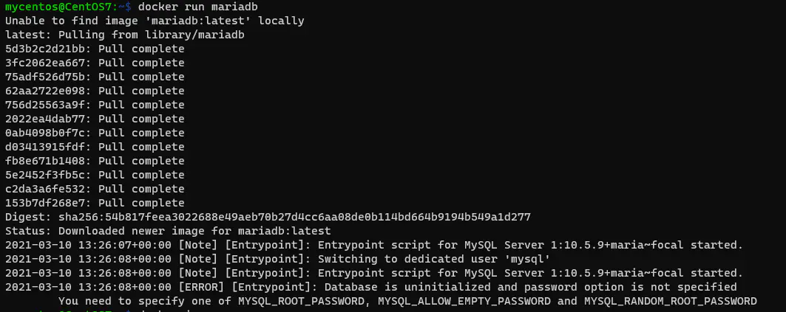
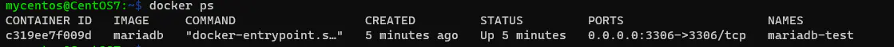
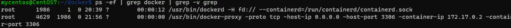
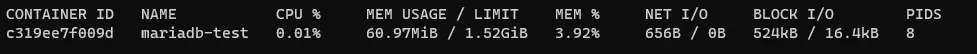
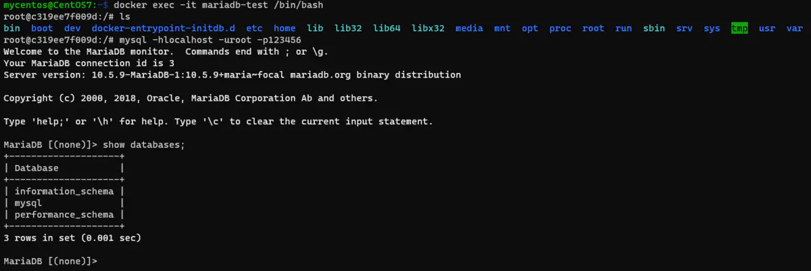
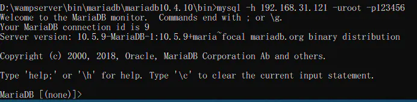
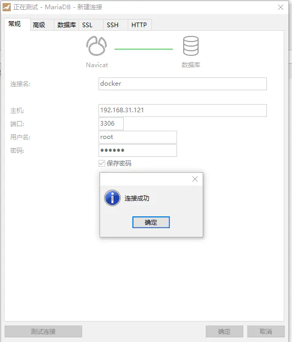
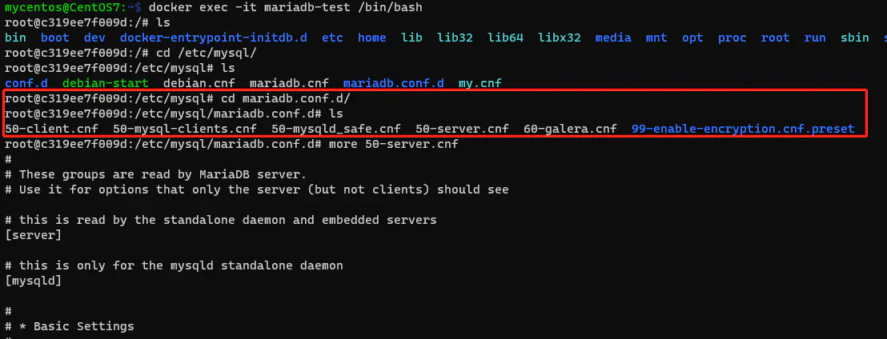

# Docker镜像安装实践
[[TOC]]

## 端口映射

Docker允许通过外部访问容器或者容器之间互联的方式来提供网络服务。 容器启动之后，容器中可以运行一些网络应用，通过-p或-P参数来指定端口映射。 

注意： 宿主机的一个端口只能映射到容器内部的某一个端口上，比如：8080->80之后，就不能8080->81 容器内部的某个端口可以被宿主机的多个端口映射,比如：8080->80，8090->80,8099->80

**1）启动容器时，选择一个端口映射到容器内部开放端口上** **-p** 小写p表示docker会选择一个具体的宿主机端口映射到容器内部开放的网络端口上。 **-P** 大写P表示docker会随机选择一个宿主机端口映射到容器内部开放的网络端口上。

```javascript
[root@docker-test ~]# docker run -ti -d --name my-nginx -p 8088:80 docker.io/nginx
2218c7d88ccc917fd0aa0ec24e6d81667eb588f491d3730deb09289dcf6b8125
[root@docker-test ~]# docker run -ti -d --name my-nginx2 -P docker.io/nginx
589237ceec9d5d1de045a5395c0d4b519acf54e8c09afb07af49de1b06d71059
[root@docker-test ~]# docker ps
CONTAINER ID        IMAGE               COMMAND                  CREATED              STATUS              PORTS                   NAMES
589237ceec9d        docker.io/nginx     "nginx -g 'daemon ..."   6 seconds ago        Up 5 seconds        0.0.0.0:32770->80/tcp   my-nginx2
2218c7d88ccc        docker.io/nginx     "nginx -g 'daemon ..."   About a minute ago   Up About a minute   0.0.0.0:8088->80/tcp    my-nginx
```
由上面可知：
容器my-nginx启动时使用了-p，选择宿主机具体的8088端口映射到容器内部的80端口上了，访问http://localhost/8088即可
容器my-nginx2启动时使用了-P，选择宿主机的一个随机端口映射到容器内部的80端口上了，这里随机端口是32770，访问http://localhost/32770即可


**2）启动创建时，绑定外部的ip和端口（宿主机ip是192.168.10.214）**

```javascript
[root@docker-test ~]# docker run -ti -d --name my-nginx3 -p 127.0.0.1:8888:80 docker.io/nginx  
debca5ec7dbb770ca307b06309b0e24b81b6bf689cb11474ec1ba187f4d7802c
[root@docker-test ~]# docker run -ti -d --name my-nginx4 -p 192.168.10.214:9999:80 docker.io/nginx               
ba72a93196f7e55020105b90a51d2203f9cc4d09882e7848ff72f9c43d81852a
[root@docker-test ~]# docker ps
CONTAINER ID        IMAGE               COMMAND                  CREATED             STATUS              PORTS                         NAMES
ba72a93196f7        docker.io/nginx     "nginx -g 'daemon ..."   2 seconds ago       Up 1 second         192.168.10.214:9999->80/tcp   my-nginx4
debca5ec7dbb        docker.io/nginx     "nginx -g 'daemon ..."   3 minutes ago       Up 3 minutes        127.0.0.1:8888->80/tcp        my-nginx3
```
由上面可知：
容器my-nginx3绑定的宿主机外部ip是127.0.0.1，端口是8888，则访问http://127.0.0.1:8888或http://localhost:8888都可以，访问http://192.168.10.214:8888就会拒绝！
容器my-nginx4绑定的宿主机外部ip是192.168.10.214，端口是9999，则访问http://192.168.10.214:9

## 安装Mariadb数据库

1、pull镜像

```
docker search mariadb
docker pull mariadb

```

2、查看下载的镜像

```
docker images

```

3、运行容器

```
docker run -itd --name mariadb-test -p 3306:3306 -e MYSQL_ROOT_PASSWORD=123456  mariadb

```

**-p 3306:3306*** ：映射容器服务的 3306 端口到宿主机的 3306 端口，外部可以直接通过宿主机ip:3306 访问到 mariadb 的服务。

**MYSQL_ROOT_PASSWORD=123456**：设置 MySQL 服务 root 用户的密码。

如果不先pull而直接run的话也会提示你设置密码，不然运行不了！




4、查看你运行的容器

```
docker ps

```



`ps -ef | grep docker | grep -v grep `也可以看到运行的容器，172.17.0.2为容器的ip地址，可以通过`docker network inspect bridge`来具体查看。



`docker stats`查看容器占用资源



5、进入容器连接数据库



6、因虚拟机没有mysql工具，于是在物理机192.168.31.40上远程连接数据库成功。



7、Navicat上连接数据库成功。

 容器服务的 3306 端口到宿主机的 3306 端口，使用在虚拟机上的3306端口可以访问mariadb数据库服务。IP即为虚拟机的IP地址。



8、配置文件50-server.cnf

 配置文件在目录下/etc/mysql/mariadb.conf.d，和真实安装的路径一样。



数据文件：/var/lib/mysql/

mysql客户端工具目录：/usr/bin/mysql

## 安装MySql数据库

### 安装步骤

第一步：在hub.docker.com上搜索mysql镜像


第二步：拉取指定版本的mysql，也可以指定拉取版本，例如：

```
 docker pull mysql:8.0.23
```

第三步：检查mysql镜像

```
 docker images
```

第四步：启动运行mysql镜像 (docker run 用于启动一个容器)

```
sudo docker run -p 3306:3306 --name mysql \
-v /usr/local/docker/mysql/mysql-files:/var/lib/mysql-files \
-v /usr/local/docker/mysql/conf:/etc/mysql \
-v /usr/local/docker/mysql/logs:/var/log/mysql \
-v /usr/local/docker/mysql/data:/var/lib/mysql \
-e MYSQL_ROOT_PASSWORD=root \
-d mysql:8.0.23
```

假如安装过程中失败了，则可通过docker ps -a 查看以前的容器，假如已存在，则通过docker rm 镜像id 删除再重新安装即可。

### 登陆mysql服务

第一步：进入容器 (退出容器用exit)

```
sudo docker exec -it mysql bash
```

第二步：登陆(默认密码root)，一定要先进入mysql容器。

```
mysql -uroot -proot
```

### 停止和启动mysql服务

停止mysql服务（可选）

```
docker stop mysql
```

启动mysql服务

```
docker start mysql
```

假如希望查看mysql启动时的日志，可以执行 docker container logs mysql 这个指令。

设置mysql开机自启动（可选）

```
docker update mysql --restart=always
```

## 安装Redis数据库

### 安装步骤

第一步：下载镜像文件

```
docker pull redis
```

第二步：准备配置文件

创建redis配置文件目录

```
mkdir -p /usr/local/docker/redis01/conf
```

在配置文件录下创建redis.conf配置文件(这个文件一定要创建，否在我们进行目录挂载时默认生成的是一个目录)

```
touch /usr/local/docker/redis01/conf/redis.conf
```

第三步：创建redis实例并启动

```
sudo docker run -p 6379:6379 --name redis01 \
-v /usr/local/docker/redis01/data:/data \
-v /usr/local/docker/redis01/conf/redis.conf:/etc/redis/redis.conf \
-d redis redis-server /etc/redis/redis.conf 
```

第四步：查看正在运行的进程

```
docker ps
```

### 访问redis服务器

第一步：控制台直接连接redis测试

```
docker exec -it redis01 bash
```

第二步：检测redis 版本

```
redis-server  -v
```

或者

```
redis-cli -v
```

第三步：登录redis(默认不需要密码)

```
redis-cli
```

或者直接将上面的两个步骤合为一个步骤执行也可以，指令如下：

```
docker exec -it redis01 redis-cli
```

### 停止和启动redis服务

> 停止redis服务？

```
docker stop redis01
```

> 启动redis服务？

```
docker start redis01
```

> 重启 redis 服务？

```
docker restart redis01
```

## 安装Nginx代理

### 安装步骤

第一步：拉取nginx镜像 （从这里hub.docker.com去查找）

```
docker pull nginx
```

第二步：查看images镜像

```
docker images
```

第三步:创建数据卷(这个对象会在宿主机直接创建一个目录)

```bash
docker volume create nginx-vol
```

说明:查看数据卷对应的宿主机目录,可以通过如下指令:

```bash
docker inspect nginx-vol
```

第四步：启动nginx服务

```
docker run --name nginx  -p 80:80 -v nginx-vol:/etc/nginx -d nginx
```

其中:/etc/nginx 为nginx容器启动时,nginx镜像文件默认的解压目录

说明:假如以后想修改nginx配置,可以直接去nginx-vol数据卷对应的目录去修改.

### 访问nginx服务

进行访问检测，如图所示：


### 停止和nginx服务

> 停止nginx服务

```
docker stop nginx
```

> 启动nginx服务

```
docker start nginx
```

> 重启nginx服务

```
docker restart nginx
```

## 安装Nacos组件

### 安装步骤

第一步：拉取nacos（hub.docker.com）

```
docker pull nacos/nacos-server:1.4.1
```

第二步： mysql中执行nacos的sql脚本文件

1)将此文件nacos-mysql.sql(这个文件可从code服务器下载)拷贝到mysql容器的宿主机对应的挂载目录(可通过docker inspect mysql查看你mysql的挂载目录)

2)在linux环境下启动并登录mysql

进入mysql容器(前提是mysql已启动)

```bash
docker exec -it mysql bash
```

登录mysql

```bash
mysql -uroot -p
```

3)通过source指令运行容器目录下的sql文件

```bash
source  /etc/mysql/nacos-mysql.sql  #这里的/etc/mysql为容器中的一个目录(要选择你自己挂载的目录)
```

例如:

第三步：创建并启动nacos容器(拷贝下面内容时,账号和密码要用自己宿主机ip,自己数据库的账号密码)

```
docker run  \
-e TZ="Asia/Shanghai" \
-e MODE=standalone \
-e SPRING_DATASOURCE_PLATFORM=mysql \
-e MYSQL_DATABASE_NUM=1 \
-e MYSQL_SERVICE_HOST=192.168.126.129 \
-e MYSQL_SERVICE_PORT=3306 \
-e MYSQL_SERVICE_USER=root \
-e MYSQL_SERVICE_PASSWORD=root \
-e MYSQL_SERVICE_DB_NAME=nacos_config \
-p 8848:8848 \
--name nacos \
--restart=always \
-d nacos/nacos-server:1.4.1
```

参数说明

- 单节点模式
  MODE=standalone
- 数据库地址
  MYSQL_SERVICE_HOST
- 数据库用户名
  MYSQL_SERVICE_USER
- 数据库密码
  MYSQL_SERVICE_PASSWORD
- 需连接的数据库名称
  MYSQL_SERVICE_DB_NAME
- 端口映射
  -p 8848:8848
- 任意时候重启容器，开机就能自动启动容器（需设置docker为开机自启）

```
--restart=always
```

第四步：检查nacos服务

```bash
docker ps
```

假如启动失败，检查启动日志，例如：

```
docker container logs nacos
```

其中，nacos的启动日志在/home/nacos/logs/start.out文件中。

### 访问nacos服务

启动nacos，然后在windows中输入http://ip:port/nacos方式进行访问测试


说明,nacos登录时,默认用户名和密码都是nacos.

### Nacos 与 MySQL 通讯分析


### 停止和启动nacos服务

> 停止nacos服务

```bash
docker stop nacos
```

> 启动nacos服务

```bash
docker start nacos
```

> 重启nacos服务

```bash
docker restart nacos
```


## 使用Maven插件SpringBoot项目制作Docker镜像与部署

[地址](https://mp.weixin.qq.com/s/q2KDzHbPkf3Q0EY8qYjYgw)

## 使用Dockerfile文件SpringBoot项目制作Docker镜像与部署
通过docker-maven-plugin来构建docker镜像的方式，此种方式需要依赖自建的Registry镜像仓库。本文将讲述另一种方式，使用Dockerfile来构建docker镜像，此种方式不需要依赖自建的镜像仓库，只需要应用的jar包和一个Dockerfile文件即可。

### Dockerfile常用指令

#### ADD

用于复制文件，格式：

```text
ADD <src> <dest>
```

示例：

```text
# 将当前目录下的mall-tiny-docker-file.jar包复制到docker容器的/目录下
ADD mall-tiny-docker-file.jar /mall-tiny-docker-file.jar
```

#### ENTRYPOINT

指定docker容器启动时执行的命令，格式：

```text
ENTRYPOINT ["executable", "param1","param2"...]
```

示例：

```text
# 指定docker容器启动时运行jar包
ENTRYPOINT ["java", "-jar","/mall-tiny-docker-file.jar"]
```

#### ENV

用于设置环境变量，格式：

```text
ENV <key> <value>
```

示例：

```text
# mysql运行时设置root密码
ENV MYSQL_ROOT_PASSWORD root
```

#### EXPOSE

声明需要暴露的端口(只声明不会打开端口)，格式：

```text
EXPOSE <port1> <port2> ...
```

示例：

```text
# 声明服务运行在8080端口
EXPOSE 8080
```

#### FROM

指定所需依赖的基础镜像，格式：

```text
FROM <image>:<tag>
```

示例：

```text
# 该镜像需要依赖的java8的镜像
FROM java:8
```

#### MAINTAINER

指定维护者的名字，格式：

```text
MAINTAINER <name>
```

示例：

```text
MAINTAINER macrozheng
```

#### RUN

在容器构建过程中执行的命令，我们可以用该命令自定义容器的行为，比如安装一些软件，创建一些文件等，格式：

```text
RUN <command>
RUN ["executable", "param1","param2"...]
```

示例：

```text
# 在容器构建过程中需要在/目录下创建一个mall-tiny-docker-file.jar文件
RUN bash -c 'touch /mall-tiny-docker-file.jar'
```

### 使用Dockerfile构建SpringBoot应用镜像

#### 编写Dockerfile文件

```text
# 该镜像需要依赖的基础镜像
FROM java:8
# 将当前目录下的jar包复制到docker容器的/目录下
ADD mall-tiny-docker-file-0.0.1-SNAPSHOT.jar /mall-tiny-docker-file.jar
# 运行过程中创建一个mall-tiny-docker-file.jar文件
RUN bash -c 'touch /mall-tiny-docker-file.jar'
# 声明服务运行在8080端口
EXPOSE 8080
# 指定docker容器启动时运行jar包
ENTRYPOINT ["java", "-jar","/mall-tiny-docker-file.jar"]
# 指定维护者的名字
MAINTAINER macrozheng
```

#### 使用maven打包应用

在IDEA中双击package命令进行打包:


打包成功后展示：

```text
[INFO] --- spring-boot-maven-plugin:2.1.3.RELEASE:repackage (repackage) @ mall-tiny-docker-file ---
[INFO] Replacing main artifact with repackaged archive
[INFO] ------------------------------------------------------------------------
[INFO] BUILD SUCCESS
[INFO] ------------------------------------------------------------------------
[INFO] Total time: 30.749 s
[INFO] Finished at: 2019-06-16T14:11:07+08:00
[INFO] Final Memory: 43M/306M
[INFO] ------------------------------------------------------------------------
```

将应用jar包及Dockerfile文件上传到linux服务器：


#### 在Linux上构建docker镜像

在Dockerfile所在目录执行以下命令：

```text
# -t 表示指定镜像仓库名称/镜像名称:镜像标签 .表示使用当前目录下的Dockerfile
docker build -t mall-tiny/mall-tiny-docker-file:0.0.1-SNAPSHOT .
```

输出如下信息：

```text
Sending build context to Docker daemon  36.37MB
Step 1/5 : FROM java:8
 ---> d23bdf5b1b1b
Step 2/5 : ADD mall-tiny-docker-file-0.0.1-SNAPSHOT.jar /mall-tiny-docker-file.jar
 ---> c920c9e9d045
Step 3/5 : RUN bash -c 'touch /mall-tiny-docker-file.jar'
 ---> Running in 55506f517f19
Removing intermediate container 55506f517f19
 ---> 0727eded66dc
Step 4/5 : EXPOSE 8080
 ---> Running in d67a5f50aa7d
Removing intermediate container d67a5f50aa7d
 ---> 1b8b4506eb2d
Step 5/5 : ENTRYPOINT ["java", "-jar","/mall-tiny-docker-file.jar"]
 ---> Running in 0c5bf61a0032
Removing intermediate container 0c5bf61a0032
 ---> c3614dad21b7
Successfully built c3614dad21b7
Successfully tagged mall-tiny/mall-tiny-docker-file:0.0.1-SNAPSHOT
```

查看docker镜像：


#### 运行mysql服务并设置

#### 1.使用docker命令启动：

```text
docker run -p 3306:3306 --name mysql \
-v /mydata/mysql/log:/var/log/mysql \
-v /mydata/mysql/data:/var/lib/mysql \
-v /mydata/mysql/conf:/etc/mysql \
-e MYSQL_ROOT_PASSWORD=root  \
-d mysql:5.7
```

#### 2.进入运行mysql的docker容器：

```text
docker exec -it mysql /bin/bash
```

#### 3.使用mysql命令打开客户端：

```text
mysql -uroot -proot --default-character-set=utf8
```

#### 4.修改root帐号的权限，使得任何ip都能访问：

```sql
grant all privileges on *.* to 'root'@'%'
```

#### 5.创建mall数据库：

```sql
create database mall character set utf8
```

#### 6.将mall.sql文件拷贝到mysql容器的/目录下：

```text
docker cp /mydata/mall.sql mysql:/
```

#### 7.将sql文件导入到数据库：

```text
use mall;
source /mall.sql;
```

#### 运行mall-tiny-docker-file应用

```text
docker run -p 8080:8080 --name mall-tiny-docker-file \
--link mysql:db \
-v /etc/localtime:/etc/localtime \
-v /mydata/app/mall-tiny-docker-file/logs:/var/logs \
-d mall-tiny/mall-tiny-docker-file:0.0.1-SNAPSHOT
```

访问接口文档地址[http://192.168.3.101:8080/swagger-ui.html](https://link.zhihu.com/?target=http%3A//192.168.3.101%3A8080/swagger-ui.html)：


## 总结（Summary）

本章节重点讲解了常用镜像服务的安装和基础配置，需要掌握镜像操作的基本过程和问题的解决方案。