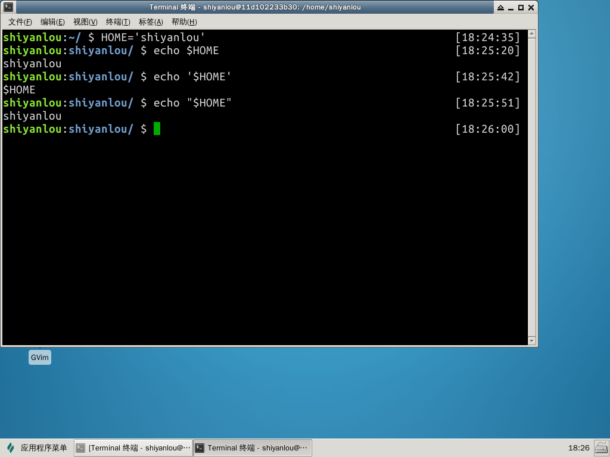

# Bash特殊字符
[[TOC]]

## 注释（#）

行首以 `#` 开头(除#!之外)的是注释。`#!` 是用于指定当前脚本的解释器，我们这里为 bash，且应该指明完整路径，所以为 `/bin/bash`。

当然，在 echo 中转义的 `#` 是不能作为注释的：

```bash
vim test.sh
```

输入如下代码，并保存。（中文为注释，不需要输入）

```bash
#!/bin/bash

echo "The # here does not begin a comment."
echo 'The # here does not begin a comment.'
echo The \# here does not begin a comment.
echo The # 这里开始一个注释
echo $(( 2#101011 ))     # 数制转换（使用二进制表示），不是一个注释，双括号表示对于数字的处理

# 欢迎来到实验楼参观学习
```

执行脚本，查看输出：

```bash
bash test.sh
```

上面的脚本说明了如何使用 `echo` 打印出一段字符串和变量内容，这里采用了几种不同的方式，希望你可以理解这几种不同方式的异同。

## 分号（;）

#### 命令分隔符

使用分号 `;` 可以在同一行上写两个或两个以上的命令。

```bash
vim test2.sh
```

输入如下代码，并保存：

```bash
#!/bin/bash
echo hello; echo there
filename=ttt.sh
if [ -e "$filename" ]; then    # 注意: "if"和"then"需要分隔，-e用于判断文件是否存在
    echo "File $filename exists."; cp $filename $filename.bak
else
    echo "File $filename not found."; touch $filename
fi; echo "File test complete."
```

执行脚本：

```bash
bash test2.sh
```

查看结果：

```bash
ls
```

上面脚本使用了一个 if 分支判断一个文件是否存在，如果文件存在打印相关信息并将该文件备份；如果不存在打印相关信息并创建一个新的文件。最后将输出"测试完成"。

#### 终止 case 选项（双分号）

使用双分号 `;;` 可以终止 case 选项。

```bash
vim test3.sh
```

输入如下代码，并保存。

```bash
#!/bin/bash

varname=b

case "$varname" in
    [a-z]) echo "abc";;
    [0-9]) echo "123";;
esac
```

执行脚本，查看输出

```bash
bash test3.sh
abc
```

上面脚本使用 case 语句，首先创建了一个变量初始化为 b,然后使用 case 语句判断该变量的范围，并打印相关信息。如果你有其它编程语言的经验，这将很容易理解。

## 点号（.）

#### 等价于 source 命令

bash 中的 `source` 命令用于在当前 bash 环境下读取并执行 FileName.sh 中的命令。

```bash
source test.sh

. test.sh
```

## 引号

#### 双引号（")

"STRING" 将会阻止（解释）STRING 中大部分特殊的字符。后面的实验会详细说明。

#### 单引号（'）

'STRING' 将会阻止 STRING 中所有特殊字符的解释，这是一种比使用"更强烈的形式。后面的实验会详细说明。

#### 区别

这里举一个例子，能够更加生动的说明：



同样是 `$HOME`，单引号会直接认为是字符，而双引号认为是一个变量。

## 斜线和反斜线

#### 斜线（`/`）

文件名路径分隔符。分隔文件名不同的部分（如 `/home/bozo/projects/Makefile`）。也可以用来作为除法算术操作符。注意在 linux 中表示路径的时候，许多个 `/` 跟一个 `/` 是一样的。`/home/shiyanlou` 等同于 `////home///shiyanlou`。

#### 反斜线（`\`）

一种对单字符的引用机制。`\X` 将会“转义”字符 X。这等价于"X"，也等价于'X'。`\` 通常用来转义双引号（`"`）和单引号（`'`），这样双引号和单引号就不会被解释成特殊含义了。

- 符号 说明
- `\n` 表示新的一行
- `\r` 表示回车
- `\t` 表示水平制表符
- `\v` 表示垂直制表符
- `\b` 表示后退符
- `\a` 表示"alert"(蜂鸣或者闪烁)
- `\0xx` 转换为八进制的 ASCII 码, 等价于 0xx
- `\"` 表示引号字面的意思

转义符也提供续行功能，也就是编写多行命令的功能。

每一个单独行都包含一个不同的命令，但是每行结尾的转义符都会转义换行符，这样下一行会与上一行一起形成一个命令序列。

## 反引号（`）

#### 命令替换

反引号中的命令会优先执行，如：

```bash
cp `mkdir back` test.sh back
ls
```

先创建了 back 目录，然后复制 test.sh 到 back 目录。

## 冒号（:）

#### 空命令

等价于“NOP”（no op，一个什么也不干的命令）。也可以被认为与 shell 的内建命令 true 作用相同。“:”命令是一个 bash 的内建命令，它的退出码（exit status）是（0）。

如：

```bash
#!/bin/bash

while :
do
    echo "endless loop"
done
```

等价于

```bash
#!/bin/bash

while true
do
    echo "endless loop"
done
```

可以在 if/then 中作占位符：

```bash
#!/bin/bash

condition=5

if [ $condition -gt 0 ] #gt表示greater than，也就是大于，同样有-lt（小于），-eq（等于）
then :   # 什么都不做，退出分支
else
    echo "$condition"
fi
```

#### 变量扩展/子串替换

在与 `>` 重定向操作符结合使用时，将会把一个文件清空，但是并不会修改这个文件的权限。如果之前这个文件并不存在，那么就创建这个文件。

```bash
: > test.sh   # 文件“test.sh”现在被清空了
# 与 cat /dev/null > test.sh 的作用相同
# 然而,这并不会产生一个新的进程, 因为“:”是一个内建命令
```

在与 `>>` 重定向操作符结合使用时，将不会对预先存在的目标文件 `: >> target_file` 产生任何影响。如果这个文件之前并不存在，那么就创建它。

也可能用来作为注释行，但不推荐这么做。使用 # 来注释的话，将关闭剩余行的错误检查，所以可以在注释行中写任何东西。然而，使用 : 的话将不会这样。如：

```bash
: This is a comment that generates an error,( if [ $x -eq 3] )
```

`:` 还用来在 `/etc/passwd` 和 `$PATH` 变量中做分隔符，如：

```bash
echo $PATH
/usr/local/bin:/bin:/usr/bin:/usr/X11R6/bin:/sbin:/usr/sbin:/usr/games
```

## 问号（?）

#### 测试操作符

在一个双括号结构中，`?` 就是 C 语言的三元操作符，如：

```bash
vim test.sh
```

输入如下代码，并保存：

```bash
 #!/bin/bash

 a=10
 (( t=a<50?8:9 ))
 echo $t
```

运行测试

```bash
bash test.sh
8
```

## 美元符号（`$`）

#### 变量替换

前面已经用到了

```bash
vim test.sh
#!/bin/bash

var1=5
var2=23skidoo

echo $var1     # 5
echo $var2     # 23skidoo
```

运行测试

```bash
bash test.sh
5
23skidoo
```


##  小括号（( )）

#### 命令组

在括号中的命令列表，将会作为一个子 shell 来运行。

在括号中的变量，由于是在子 shell 中，所以对于脚本剩下的部分是不可用的。父进程，也就是脚本本身，将不能够读取在子进程中创建的变量，也就是在子 shell 中创建的变量。如：

```bash
vim test20.sh
```

输入代码：

```bash
#!/bin/bash

a=123
( a=321; )

echo "$a" #a的值为123而不是321，因为括号将判断为局部变量
```

运行代码：

```bash
bash test20.sh
a = 123
```

在圆括号中 a 变量，更像是一个局部变量。

#### 2.初始化数组

创建数组

```bash
vim test21.sh
```

输入代码：

```bash
#!/bin/bash

arr=(1 4 5 7 9 21)
echo ${arr[3]} # get a value of arr
```

运行代码：

```bash
bash test21.sh
7
```

##  大括号（{ }）

#### 文件名扩展

复制 t.txt 的内容到 t.back 中

```bash
vim test22.sh
```

输入代码：

```bash
#!/bin/bash

if [ ! -w 't.txt' ];
then
    touch t.txt
fi
echo 'test text' >> t.txt
cp t.{txt,back}
```

运行代码：

```bash
bash test22.sh
```

查看运行结果：

```bash
ls
cat t.txt
cat t.back
```

注意： 在大括号中，不允许有空白，除非这个空白被引用或转义。

#### 代码块

代码块，又被称为内部组，这个结构事实上创建了一个匿名函数（一个没有名字的函数）。然而，与“标准”函数不同的是，在其中声明的变量，对于脚本其他部分的代码来说还是可见的。

```bash
vim test23.sh
```

输入代码：

```bash
#!/bin/bash

a=123
{ a=321; }
echo "a = $a"
```

运行代码：

```bash
bash test23.sh
a = 321
```

变量 a 的值被更改了。

##  中括号（[ ]）

#### 条件测试

条件测试表达式放在 `[ ]` 中。下列练习中的 `-lt` (less than)表示小于号。

```bash
vim test24.sh
```

输入代码：

```bash
#!/bin/bash

a=5
if [ $a -lt 10 ]
then
    echo "a: $a"
else
    echo 'a>=10'
fi
```

运行代码：

```bash
bash test24.sh
a: 5
```

双中括号（`[[ ]]`）也用作条件测试（判断），后面的实验会详细讲解。

#### 数组元素

在一个 array 结构的上下文中，中括号用来引用数组中每个元素的编号。

```bash
vim test25.sh
```

输入代码：

```bash
#!/bin/bash

arr=(12 22 32)
arr[0]=10
echo ${arr[0]}
```

运行代码：

```bash
bash test25.sh
10
```

## 尖括号（< 和 >）

#### 重定向

`test.sh > filename`：重定向 test.sh 的输出到文件 filename 中。如果 filename 存在的话，那么将会被覆盖。

`test.sh &> filename`：重定向 test.sh 的 stdout（标准输出）和 stderr（标准错误）到 filename 中。

`test.sh >&2`：重定向 test.sh 的 stdout 到 stderr 中。

`test.sh >> filename`：把 test.sh 的输出追加到文件 filename 中。如果 filename 不存在的话，将会被创建。

##  竖线（|）

#### 管道

分析前边命令的输出，并将输出作为后边命令的输入。这是一种产生命令链的好方法。

```bash
vim test26.sh
```

输入代码：

```bash
#!/bin/bash

tr 'a-z' 'A-Z'
exit 0
```

现在让我们输送 `ls -l` 的输出到一个脚本中：

```bash
chmod 755 test26.sh
ls -l | ./test26.sh
```

输出的内容均变为了大写字母。

##  破折号（-）

#### 选项，前缀

在所有的命令内如果想使用选项参数的话,前边都要加上“-”。

```bash
vim test27.sh
```

输入代码：

```bash
#!/bin/bash

a=5
b=5
if [ "$a" -eq "$b" ]
then
    echo "a is equal to b."
fi
```

运行代码：

```bash
bash test27.sh

a is equal to b.
```

#### 用于重定向 stdin 或 stdout

下面脚本用于备份最后 24 小时当前目录下所有修改的文件.

```bash
vim test28.sh
```

输入代码：

```bash
#!/bin/bash

BACKUPFILE=backup-$(date +%m-%d-%Y)
# 在备份文件中嵌入时间.
archive=${1:-$BACKUPFILE}
#  如果在命令行中没有指定备份文件的文件名,
#  那么将默认使用"backup-MM-DD-YYYY.tar.gz".

tar cvf - `find . -mtime -1 -type f -print` > $archive.tar
gzip $archive.tar
echo "Directory $PWD backed up in archive file \"$archive.tar.gz\"."

exit 0
```

运行代码：

```bash
bash test28.sh
ls
```

## 波浪号（~）

#### 目录

`~` 表示 home 目录。