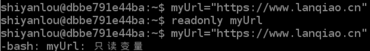

# 变量与参数
[[TOC]]

## 变量定义

#### 概念

变量的名字就是变量保存值的地方。引用变量的值就叫做变量替换。

如果 variable 是一个变量的名字，那么 `$variable` 就是引用这个变量的值，即这变量所包含的数据。

`$variable` 事实上只是 `${variable}` 的简写形式。在某些上下文中 `$variable` 可能会引起错误，这时候你就需要用 `${variable}` 了。

**Shell编程中一般分为三种变量：**

1. **我们自己定义的变量（自定义变量）:** 仅在当前 Shell 实例中有效，其他 Shell 启动的程序不能访问局部变量。
2. **Linux已定义的环境变量**（环境变量， 例如：$PATH, $HOME 等..., 这类变量我们可以直接使用），使用 `env` 命令可以查看所有的环境变量，而set命令既可以查看环境变量也可以查看自定义变量。
3. **Shell变量** ：Shell变量是由 Shell 程序设置的特殊变量。Shell 变量中有一部分是环境变量，有一部分是局部变量，这些变量保证了 Shell 的正常运行

**常用的环境变量:**

> PATH 决定了shell将到哪些目录中寻找命令或程序 
> HOME 当前用户主目录 
> HISTSIZE　历史记录数 
> LOGNAME 当前用户的登录名 
> HOSTNAME　指主机的名称 
> SHELL 当前用户Shell类型 
> LANGUGE 　语言相关的环境变量，多语言可以修改此环境变量 
> MAIL　当前用户的邮件存放目录 
> PS1　基本提示符，对于root用户是#，对于普通用户是$

**使用 Linux 已定义的环境变量：**

比如我们要看当前用户目录可以使用：`echo $HOME`命令；如果我们要看当前用户Shell类型 可以使用`echo $SHELL`命令。可以看出，使用方法非常简单。

**使用自己定义的变量：**

```shell
#!/bin/bash
#自定义变量hello
hello="hello world"
echo $hello
echo  "helloworld!"
```


#### 定义变量

定义变量时，变量名不加美元符号（`$`，PHP 语言中变量需要），如：

```bash
myname="shiyanlou"
```

**注意**

**变量名和等号之间不能有空格**。同时，变量名的命名须遵循如下规则：

- 命名只能使用英文字母，数字和下划线，首个字符不能以数字开头，但是可以使用下划线（_）开头。
- 中间不能有空格，可以使用下划线（`_`）。
- 不能使用标点符号。
- 不能使用 bash 里的关键字（可用 help 命令查看保留关键字）。

除了直接赋值，还可以用语句给变量赋值，如：

```bash
for file in `ls /etc`
```

## 使用变量

变量名前加**美元符号**，如：

```bash
myname="shiyanlou"
echo $myname
echo ${myname}
echo ${myname}Good
echo $mynameGood

myname="miao"
echo ${myname}
```

> 加**花括号**帮助解释器识别变量的**边界**，若不加，解释器会把 mynameGood 当成一个变量（值为空）
>
> 推荐给所有变量加花括号
>
> 已定义的变量可以重新被定义

## 只读变量

使用 `readonly` 命令可以将变量定义为只读变量，只读变量的值不能被改变。 下面的例子尝试更改只读变量，结果报错：

```bash
#!/bin/bash
myUrl="http://www.shiyanlou.com"
readonly myUrl
myUrl="http://www.shiyanlou.com"
```

运行脚本，结果如下：



##  特殊变量

#### 局部变量

这种变量只有在代码块或者函数中才可见。后面的实验会详细讲解。

#### 环境变量

这种变量将影响用户接口和 shell 的行为。

在通常情况下，每个进程都有自己的“环境”，这个环境是由一组变量组成的，这些变量中存有进程可能需要引用的信息。在这种情况下，shell 与一个一般的进程没什么区别。

#### 位置参数

从命令行传递到脚本的参数：`$0`，`$1`，`$2`，`$3`...

`$0` 就是脚本文件自身的名字，`$1` 是第一个参数，`$2` 是第二个参数，`$3` 是第三个参数，然后是第四个。`$9` 之后的位置参数就必须用大括号括起来了，比如，`${10}`，`${11}`，`${12}`。

- `$#` ： 传递到脚本的参数个数
- `$*` ： 以一个单字符串显示所有向脚本传递的参数。与位置变量不同,此选项参数可超过 9 个
- `$$` ： 脚本运行的当前进程 ID 号
- `$!` ： 后台运行的最后一个进程的进程 ID 号
- `$@` ： 与 `$*` 相同,但是使用时加引号,并在引号中返回每个参数
- `$`： 显示 shell 使用的当前选项,与 set 命令功能相同
- `$?` ： 显示最后命令的退出状态。 0 表示没有错误,其他任何值表明有错误。

#### 位置参数实例

这个十分重要，在我们运行一套脚本的时候，有时候是需要参数的，这里我们教大家如何获取参数。

```bash
vim test30.sh
```

输入代码（中文皆为注释，不用输入）：

```bash
#!/bin/bash

# 作为用例, 调用这个脚本至少需要10个参数, 比如：
# bash test.sh 1 2 3 4 5 6 7 8 9 10
MINPARAMS=10

echo

echo "The name of this script is \"$0\"."

echo "The name of this script is \"`basename $0`\"."


echo

if [ -n "$1" ]              # 测试变量被引用.
then
echo "Parameter #1 is $1"  # 需要引用才能够转义"#"
fi

if [ -n "$2" ]
then
echo "Parameter #2 is $2"
fi

if [ -n "${10}" ]  # 大于$9的参数必须用{}括起来.
then
echo "Parameter #10 is ${10}"
fi

echo "-----------------------------------"
echo "All the command-line parameters are: "$*""

if [ $# -lt "$MINPARAMS" ]
then
 echo
 echo "This script needs at least $MINPARAMS command-line arguments!"
fi

echo

exit 0
```

运行代码：

```bash
bash test30.sh 1 2 10


The name of this script is "test.sh".
The name of this script is "test.sh".

Parameter #1 is 1
Parameter #2 is 2
-----------------------------------
All the command-line parameters are: 1 2 10

This script needs at least 10 command-line arguments!
```

## Shell 字符串
### 入门

字符串是shell编程中最常用最有用的数据类型（除了数字和字符串，也没啥其它类型好用了），字符串可以用单引号，也可以用双引号。这点和Java中有所不同。

**单引号字符串：**

```shell
#!/bin/bash
name='SnailClimb'
hello='Hello, I  am '$name'!'
echo $hello
```

输出内容：

```
Hello, I am SnailClimb!
```

**双引号字符串：**

```shell
#!/bin/bash
name='SnailClimb'
hello="Hello, I  am "$name"!"
echo $hello
```

输出内容：

```
Hello, I am SnailClimb!
```

### Shell 字符串常见操作

**拼接字符串：**

```shell
#!/bin/bash
name="SnailClimb"
# 使用双引号拼接
greeting="hello, "$name" !"
greeting_1="hello, ${name} !"
echo $greeting  $greeting_1
# 使用单引号拼接
greeting_2='hello, '$name' !'
greeting_3='hello, ${name} !'
echo $greeting_2  $greeting_3
```

**获取字符串长度：**

```shell
#!/bin/bash
#获取字符串长度
name="SnailClimb"
# 第一种方式
echo ${#name} #输出 10
# 第二种方式
expr length "$name";
```

输出结果:

```
10
10
```

使用 expr 命令时，表达式中的运算符左右必须包含空格，如果不包含空格，将会输出表达式本身:

```shell
expr 5+6    // 直接输出 5+6
expr 5 + 6       // 输出 11
```

对于某些运算符，还需要我们使用符号`\`进行转义，否则就会提示语法错误。

```shell
expr 5 * 6       // 输出错误
expr 5 \* 6      // 输出30
```

**截取子字符串:**

简单的字符串截取：


```shell
#从字符串第 1 个字符开始往后截取 10 个字符
str="SnailClimb is a great man"
echo ${str:0:10} #输出:SnailClimb
```

根据表达式截取：

```shell
#!bin/bash
#author:amau

var="http://www.runoob.com/linux/linux-shell-variable.html"

s1=${var%%t*}#h
s2=${var%t*}#http://www.runoob.com/linux/linux-shell-variable.h
s3=${var%%.*}#http://www
s4=${var#*/}#/www.runoob.com/linux/linux-shell-variable.html
s5=${var##*/}#linux-shell-variable.html
```

## Shell 数组

bash支持一维数组（不支持多维数组），并且没有限定数组的大小。我下面给了大家一个关于数组操作的 Shell 代码示例，通过该示例大家可以知道如何创建数组、获取数组长度、获取/删除特定位置的数组元素、删除整个数组以及遍历数组。


```shell
#!/bin/bash
array=(1 2 3 4 5);
# 获取数组长度
length=${#array[@]}
# 或者
length2=${#array[*]}
#输出数组长度
echo $length #输出：5
echo $length2 #输出：5
# 输出数组第三个元素
echo ${array[2]} #输出：3
unset array[1]# 删除下表为1的元素也就是删除第二个元素
for i in ${array[@]};do echo $i ;done # 遍历数组，输出： 1 3 4 5 
unset arr_number; # 删除数组中的所有元素
for i in ${array[@]};do echo $i ;done # 遍历数组，数组元素为空，没有任何输出内容
```


