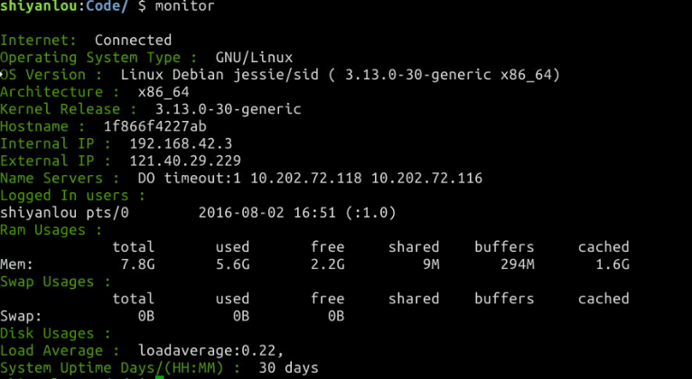
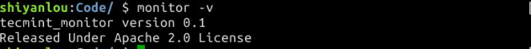
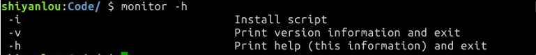

# Shell脚本实现Linux系统监控
[[TOC]]

## 一、实验介绍

#### 1.1 实验内容

本课程实现 shell 脚本监控系统的各项参数，并可以将脚本加入系统环境中，可以直接在终端里执行。还添加了几个参数，一个脚本可以执行不同的操作。

#### 1.2 知识点

本实验涵盖以下知识点：

1. Bash 脚本编程
2. 如何获取 Linux 系统信息
3. 如何实时获取 Linux 资源使用率

#### 1.3 实验环节

- vim编辑器
- shell解释器(linux自带)

#### 1.4 适合人群

适合人群：本课程适合有shell语法基础，想学习shell脚本的实际使用的同学，可以加深对于shell脚本的认识

#### 1.5 代码获取

```
#获取
wget http://labfile.oss.aliyuncs.com/courses/597/monitor.sh
#运行
bash monitor.sh
#备注
如果执行monitor -i安装提示输入密码。可以执行passwd root为root设置密码
如果安装之后不能运行，修改/usr/bin/monitor.sh的权限
```

#### 1.6 效果截图

在实验中，我们将逐步实现下面的功能需求：

- 通过脚本查看系统的使用情况，实现对linux的系统监控。
- 将写好的脚本加入系统环境，开启终端即可使用
- 给脚本添加参数，可以实现不同的操作。

最终实现的脚本运行效果：



## 二、实验原理

这一章节我们将正式开始讲解实验原理，分步骤进行。 

### 2.1 主要命令介绍

- 查看内存(`free`)
- 查看磁盘(`df`)
- 查看cpu占用率(`top`)
- 查看内核版本(`uname`)

这些命令是linux管理员必须耳熟能详的基本命令，本课程的监控脚本，也是根据这些命令的返回值做处理，然后打印在终端的，同学们可以敲一敲这些命令，看看他们的基本用法。 命令详解请查看
http://man.linuxde.net/

### 2.2 shell编程注意

- \```` 用法 这个符号可以保存命令的返回值，如

```
 PATH=`pwd` #也可以写成 PAHT=$(pwd)
 echo $PATH
 #输出pwd命令的值，也就是当前路径
```

- 参数说明
  `$1`表示第一个参数，`$2` 表示第二个参数，`$#`表示参数个数

## 三、实验步骤

打开终端，进入`Code`目录，创建文件`tecmint_monitor.sh`。 `getopts`：可以获取用户在命令下的参数，然后根据不同的参数进行不同的操作。它的使用方法是getopts option_string variable，option_string 是指字符串，会逐个匹配，variable 每次匹配成功的选项。

```
#! /bin/bash
while getopts ivh name # getopts 有三个参数，分别执行安装，查看版本，帮助说明
do
        case $name in
          i)iopt=1;;
          v)vopt=1;;
          h)hopt=1;;
         *)echo "Invalid arg";;
        esac
done
```

这个脚本主要有 `-ivh` 三个参数，分别执行安装脚本，查看版本，帮助说明，你也可以添加自己想要的参数。如果不加参数，默认执行系统的监控命令并打印到屏幕上。

### 3.1 有关参数 `i` 的模块

这个部分主要是将脚本添加到环境的目录里，通过终端就可以执行命令。

```
if [[ ! -z $iopt ]] #如果iopt非空则执行
then
{
wd=$(pwd)
basename "$(test -L "$0" && readlink "$0" || echo "$0")" > /tmp/scriptname
#basename命令会删掉所有的前缀包括最后一个slash（‘/’）字符，然后将字符串显示出来
scriptname=$(echo -e -n $wd/ && cat /tmp/scriptname)
#scriptname就是tecmint_monitor.sh的地址
su -c "cp $scriptname /usr/bin/monitor" root && echo "Congratulations! Script Installed, now run monitor Command" || echo "Installation failed"
}
fi
```


### 3.2 有关参数 `v` 的模块

这个部分是查看脚本的版本，版权等信息。

```
if [[ ! -z $vopt ]]
then
{
echo -e "tecmint_monitor version 0.1\nReleased Under Apache 2.0 License"
}
fi
```



### 3.3 有关参数 `h` 的模块

这个部分是添加帮助信息，方便其他人使用

```
if [[ ! -z $hopt ]]
then
{
echo -e " -i                                Install script"
echo -e " -v                                Print version information and exit"
echo -e " -h                                Print help (this information) and exit"
}
fi
```



### 3.4 提取信息设置变量

先设置一些好记的变量名，这样方便阅读，比直接看代码要更容易一点。

```
clear

unset tecreset os architecture kernelrelease internalip externalip nameserver loadaverage
# unset命令用于删除已定义的shell变量（包括环境变量）和shell函数。
# 关于unset更多的信息可以查看http://www.runoob.com/linux/linux-comm-unset.html
# 定义变量 tecreset
tecreset=$(tput sgr0)

# 查看是否可以连网
ping -c 1 www.baidu.com &> /dev/null && echo -e '\E[32m'"Internet: $tecreset Connected" || echo -e '\E[32m'"Internet: $tecreset Disconnected"
# '\E[32m' 将打印的信息设置为绿色
# 查看系统的类型
os=$(uname -o)
echo -e '\E[32m'"Operating System Type :" $tecreset $os

# 查看系统的版本和名称
###################################
OS=`uname -s`
REV=`uname -r`
MACH=`uname -m`

GetVersionFromFile()
{
    VERSION=`cat $1 | tr "\n" ' ' | sed s/.*VERSION.*=\ // `
}
```

查看操作系统的类型，不同的操作系统指令是不一样的。看到大段的代码不要紧张，其实逻辑很简单。

```
if [ "${OS}" = "SunOS" ] ; then
    OS=Solaris
    ARCH=`uname -p`
    OSSTR="${OS} ${REV}(${ARCH} `uname -v`)"
# uname命令用于打印当前系统相关信息（内核版本号、硬件架构、主机名称和操作系统类型等）。
elif [ "${OS}" = "AIX" ] ; then
    OSSTR="${OS} `oslevel` (`oslevel -r`)"
#AIX是IBM开发的一套类UNIX操作系统，关于它更多的指令可以查看http://www.cnblogs.com/sbaicl/articles/2947795.html
elif [ "${OS}" = "Linux" ] ; then
    KERNEL=`uname -r`
    if [ -f /etc/redhat-release ] ; then
        DIST='RedHat'
        PSUEDONAME=`cat /etc/redhat-release | sed s/.*\(// | sed s/\)//`
        REV=`cat /etc/redhat-release | sed s/.*release\ // | sed s/\ .*//`
#sed通常用来匹配一个或多个正则表达式的文本进行处理,可以查看http://coolshell.cn/articles/9104.html
    elif [ -f /etc/SuSE-release ] ; then
        DIST=`cat /etc/SuSE-release | tr "\n" ' '| sed s/VERSION.*//`
        REV=`cat /etc/SuSE-release | tr "\n" ' ' | sed s/.*=\ //`
    elif [ -f /etc/mandrake-release ] ; then
        DIST='Mandrake'
        PSUEDONAME=`cat /etc/mandrake-release | sed s/.*\(// | sed s/\)//`
        REV=`cat /etc/mandrake-release | sed s/.*release\ // | sed s/\ .*//`
    elif [ -f /etc/debian_version ] ; then
        DIST="Debian `cat /etc/debian_version`"
        REV=""

    fi
    if ${OSSTR} [ -f /etc/UnitedLinux-release ] ; then
        DIST="${DIST}[`cat /etc/UnitedLinux-release | tr "\n" ' ' | sed s/VERSION.*//`]"
    fi

    OSSTR="${OS} ${DIST} ${REV}(${PSUEDONAME} ${KERNEL} ${MACH})"

fi
```

最后就是监控系统的各种信息，并打印到屏幕

```
查看操作系统版本
echo -e '\E[32m'"OS Version :" $tecreset $OSSTR 
# 查看系统的类型
architecture=$(uname -m)
echo -e '\E[32m'"Architecture :" $tecreset $architecture

# 查看内核的版本
kernelrelease=$(uname -r)
echo -e '\E[32m'"Kernel Release :" $tecreset $kernelrelease

# 查看主机名
echo -e '\E[32m'"Hostname :" $tecreset $HOSTNAME

# 查看内网地址
internalip=$(hostname -I)
echo -e '\E[32m'"Internal IP :" $tecreset $internalip

# 查看外网地址
externalip=$(curl -s ipecho.net/plain;echo)
echo -e '\E[32m'"External IP : $tecreset "$externalip

# 查看DNS
nameservers=$(cat /etc/resolv.conf | sed '1 d' | awk '{print $2}')
echo -e '\E[32m'"Name Servers :" $tecreset $nameservers 

# 查看登陆的用户
who>/tmp/who
echo -e '\E[32m'"Logged In users :" $tecreset && cat /tmp/who 

# 查看系统内存使用情况
free -h | grep -v + > /tmp/ramcache
echo -e '\E[32m'"Ram Usages :" $tecreset
cat /tmp/ramcache | grep -v "Swap"
echo -e '\E[32m'"Swap Usages :" $tecreset
cat /tmp/ramcache | grep -v "Mem"

# 查看磁盘使用情况
df -h| grep 'Filesystem\|/dev/sda*' > /tmp/diskusage
echo -e '\E[32m'"Disk Usages :" $tecreset 
cat /tmp/diskusage

# 查看系统的负载情况
loadaverage=$(top -n 1 -b | grep "load average:" | awk '{print $10 $11 $12}')
echo -e '\E[32m'"Load Average :" $tecreset $loadaverage

# 查看系统的运行时间
tecuptime=$(uptime | awk '{print $3,$4}' | cut -f1 -d,)
echo -e '\E[32m'"System Uptime Days/(HH:MM) :" $tecreset $tecuptime

# 删除上面使用的变量，释放资源
unset tecreset os architecture kernelrelease internalip externalip nameserver loadaverage

# 删除临时文件
rm /tmp/who /tmp/ramcache /tmp/diskusage
}
fi
```

## 四、实验总结

通过这个小项目，加强了对shell编程的理解，不仅可以执行脚本，还可以将脚本安装到系统环境中，直接执行命令。从实践中学习，把代码敲一遍，就能体会编程的乐趣了:-)

最后附上源代码

```
#! /bin/bash
# unset any variable which system may be using
# clear the screen


while getopts ivh name
do
        case $name in
          i)iopt=1;;
          v)vopt=1;;
          h)hopt=1;;
         *)echo "Invalid arg";;
        esac
done
# 
if [[ ! -z $iopt ]]
then
{
wd=$(pwd)
basename "$(test -L "$0" && readlink "$0" || echo "$0")" > /tmp/scriptname
scriptname=$(echo -e -n $wd/ && cat /tmp/scriptname)
su -c "cp $scriptname /usr/bin/monitor" root && echo "Congratulations! Script Installed, now run monitor Command" || echo "Installation failed"
}
fi

if [[ ! -z $vopt ]]
then
{
echo -e "tecmint_monitor version 0.1\nDesigned by Tecmint.com\nReleased Under Apache 2.0 License"
}
fi
if [[ ! -z $hopt ]]
then
{
echo -e " -i                                Install script"
echo -e " -v                                Print version information and exit"
echo -e " -h                                Print help (this information) and exit"
}
fi

if [[ $# -eq 0 ]]
then
{
clear

unset tecreset os architecture kernelrelease internalip externalip nameserver loadaverage

# Define Variable tecreset
tecreset=$(tput sgr0)

# Check if connected to Internet or not
ping -c 1 www.baidu.com &> /dev/null && echo -e '\E[32m'"Internet: $tecreset Connected" || echo -e '\E[32m'"Internet: $tecreset Disconnected"

# Check OS Type
os=$(uname -o)
echo -e '\E[32m'"Operating System Type :" $tecreset $os

# Check OS Release Version and Name
###################################
OS=`uname -s`
REV=`uname -r`
MACH=`uname -m`

GetVersionFromFile()
{
    VERSION=`cat $1 | tr "\n" ' ' | sed s/.*VERSION.*=\ // `
}

if [ "${OS}" = "SunOS" ] ; then
    OS=Solaris
    ARCH=`uname -p`
    OSSTR="${OS} ${REV}(${ARCH} `uname -v`)"
elif [ "${OS}" = "AIX" ] ; then
    OSSTR="${OS} `oslevel` (`oslevel -r`)"
elif [ "${OS}" = "Linux" ] ; then
    KERNEL=`uname -r`
    if [ -f /etc/redhat-release ] ; then
        DIST='RedHat'
        PSUEDONAME=`cat /etc/redhat-release | sed s/.*\(// | sed s/\)//`
        REV=`cat /etc/redhat-release | sed s/.*release\ // | sed s/\ .*//`
    elif [ -f /etc/SuSE-release ] ; then
        DIST=`cat /etc/SuSE-release | tr "\n" ' '| sed s/VERSION.*//`
        REV=`cat /etc/SuSE-release | tr "\n" ' ' | sed s/.*=\ //`
    elif [ -f /etc/mandrake-release ] ; then
        DIST='Mandrake'
        PSUEDONAME=`cat /etc/mandrake-release | sed s/.*\(// | sed s/\)//`
        REV=`cat /etc/mandrake-release | sed s/.*release\ // | sed s/\ .*//`
    elif [ -f /etc/debian_version ] ; then
        DIST="Debian `cat /etc/debian_version`"
        REV=""

    fi
    if ${OSSTR} [ -f /etc/UnitedLinux-release ] ; then
        DIST="${DIST}[`cat /etc/UnitedLinux-release | tr "\n" ' ' | sed s/VERSION.*//`]"
    fi

    OSSTR="${OS} ${DIST} ${REV}(${PSUEDONAME} ${KERNEL} ${MACH})"

fi

##################################
#cat /etc/os-release | grep 'NAME\|VERSION' | grep -v 'VERSION_ID' | grep -v 'PRETTY_NAME' > /tmp/osrelease
#echo -n -e '\E[32m'"OS Name :" $tecreset  && cat /tmp/osrelease | grep -v "VERSION" | grep -v CPE_NAME | cut -f2 -d\"
#echo -n -e '\E[32m'"OS Version :" $tecreset && cat /tmp/osrelease | grep -v "NAME" | grep -v CT_VERSION | cut -f2 -d\"
echo -e '\E[32m'"OS Version :" $tecreset $OSSTR 

architecture=$(uname -m)
echo -e '\E[32m'"Architecture :" $tecreset $architecture


kernelrelease=$(uname -r)
echo -e '\E[32m'"Kernel Release :" $tecreset $kernelrelease


echo -e '\E[32m'"Hostname :" $tecreset $HOSTNAME


internalip=$(hostname -I)
echo -e '\E[32m'"Internal IP :" $tecreset $internalip


externalip=$(curl -s ipecho.net/plain;echo)
echo -e '\E[32m'"External IP : $tecreset "$externalip


nameservers=$(cat /etc/resolv.conf | sed '1 d' | awk '{print $2}')
echo -e '\E[32m'"Name Servers :" $tecreset $nameservers 


who>/tmp/who
echo -e '\E[32m'"Logged In users :" $tecreset && cat /tmp/who 


free -h | grep -v + > /tmp/ramcache
echo -e '\E[32m'"Ram Usages :" $tecreset
cat /tmp/ramcache | grep -v "Swap"
echo -e '\E[32m'"Swap Usages :" $tecreset
cat /tmp/ramcache | grep -v "Mem"


df -h| grep 'Filesystem\|/dev/sda*' > /tmp/diskusage
echo -e '\E[32m'"Disk Usages :" $tecreset 
cat /tmp/diskusage


loadaverage=$(top -n 1 -b | grep "load average:" | awk '{print $10 $11 $12}')
echo -e '\E[32m'"Load Average :" $tecreset $loadaverage


tecuptime=$(uptime | awk '{print $3,$4}' | cut -f1 -d,)
echo -e '\E[32m'"System Uptime Days/(HH:MM) :" $tecreset $tecuptime


unset tecreset os architecture kernelrelease internalip externalip nameserver loadaverage

rm /tmp/who /tmp/ramcache /tmp/diskusage
}
fi
shift $(($OPTIND -1))
# shift命令用于对参数的移动(左移)。可以查看http://blog.csdn.net/zhu_xun/article/details/24796235
# 
```

#### 版权声明

本课程主要修改自 atarallo 的 [《TECMINT_MONITOR》 ](https://github.com/atarallo/TECMINT_MONITOR)项目 , 代码使用[ APACHE 协议](http://www.apache.org/licenses/)。