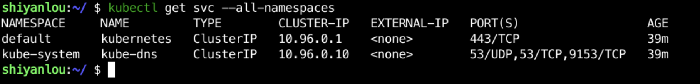
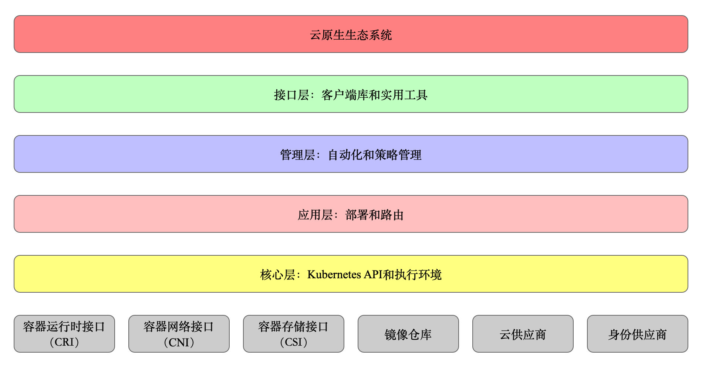
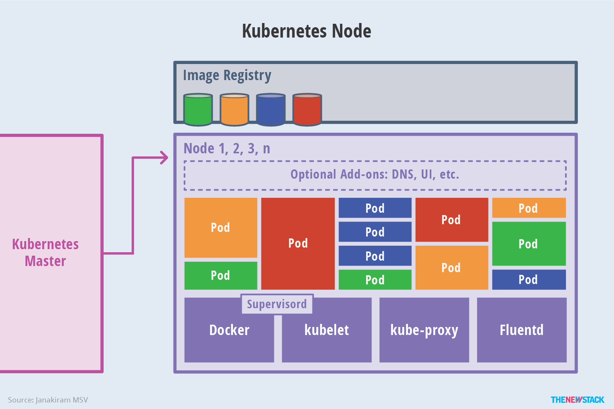

## K8s介绍与使用
[[TOC]]

## 实验介绍

Kubernetes 是一个可移植的、可扩展的开源平台，用于管理容器化的工作负载和服务，可促进声明式配置和自动化部署。它是目前主流的容器编排工具。

因为实验环境的特殊性，首先介绍下本实验在使用上需要特殊注意的地方：

- 因为经常需要粘贴 yaml 格式的文件，用 vi 等工具容易有排版问题，因此本课程尽量推荐用 echo 的方式进行保存。具体方式为 `echo '<copy-text>' > filename`。
- 本实验环境使用的 [kind 工具](https://kind.sigs.k8s.io/)，使用 Docker 模拟多个节点启动，非真实集群环境，在章节开始时如果重新启动了云主机环境都要重新执行。

#### 推荐阅读

- [kubernetes 官网](https://kubernetes.io/)
- [kubernetes github](https://github.com/kubernetes)
- [Borg: Google 内部的大型集群管理系统](https://zhuanlan.zhihu.com/p/30355957)
- [Kubernetes 五周年回顾与展望](https://www.infoq.cn/article/U2a_7ekuvhmb7dSNp27V)
- [kubeadm-dind-cluster](https://github.com/kubernetes-retired/kubeadm-dind-cluster)


## Kubernetes 发展简介

Kubernetes 是一个跨主机集群的、开源的容器调度平台，它可以自动化应用容器的部署、扩展和操作，提供以容器为中心的基础架构。它的名字源于希腊语，意为 “舵手” 或 “飞行员”，k8s 是通过将 8 个字母 “ubernete” 替换为 8 然后改成的缩写，在中文中，k8s 的发音和 Kubernetes 的发音也比较接近。Linux 基金会常务董事 Jim Zemlin 说：“Kubernetes is the Linux of the Cloud（Kubernetes 已经成为云计算时代的 Linux 操作系统）”。

Kubernetes 是 Google Borg 项目的开源版本，Borg 是 Google 内部使用了十几年的非常有名的大规模集群管理系统，它基于容器技术实现了资源管理的自动化以及跨多个数据中心的资源利用率的最大化，Borg 的原型图片如下所示：


因此，Kubernetes 构建于 Google 数十年经验，一大半来源于 Google 生产环境规模的经验，并结合了社区最佳的想法和实践。Kubernetes 的目标是管理跨多个主机的容器，提供基本的部署，维护以及运用伸缩，主要实现语言为 Go 语言。

Kubernetes 的主要成长历程：

- 2014 年 6 月，Kubernetes 正式由 Google 开源
- 2015 年，Google 将 Kubernetes 捐赠给 Linux 基金会下属的 CNCF（Cloud Native Computing Foundation，云原生计算基金会）
- 2017 年，Kubernetes 战胜 Docker Swarm 和 Apache Mesos，成为容器管理与调度编排领域的首选平台和事实标准

## Kubernetes 的特点

#### 强大的容器编排能力

作为容器编排管理平台，拥有强大的容器编排能力。Kubernetes 与 Docker 共同发展并且深度集成了 Docker，因此适应容器的特点，比如容器组合、标签选择和服务发现等，可以满足企业级的需求，具体表现如下：

- 以 Pod（容器组）为基本的编排和调度单元以及声明式的对象配置模型（控制器、configmap、secret 等）
- 资源配额与分配管理
- 健康检查、自愈、伸缩与滚动升级

#### 轻量级

轻量级，对微服务架构有很好的支撑。微服务架构的核心是将一个巨大的单体应用分解为很多小的互相连接的微服务，一个微服务可能由多个实例副本支撑，副本的数量可以随着系统的负荷变化进行调整。整个系统划分出各个功能独立的组件，组件之间边界清晰、部署简单，以及很多功能实现了插件化，可以非常方便地进行扩展和替换：

- 服务发现、服务编排与内部路由支持
- 服务快速部署和自动负载均衡
- 提供对“有状态”服务的支持

#### 便携性

无论公有云、私有云、混合云还是多云架构都全面支持，可以随时随地地将系统整体进行“搬迁”。Kubernetes 架构方案中屏蔽了底层网络的细节，基于服务的虚拟 IP 地址的设计方式让架构和底层硬件无关，无需改变配置文件就可以将系统从物理机迁移到公有云上，并且谷歌云（GCE）、华为云（CCE）、阿里云（ACK）和腾讯云（TKE）都支持 Kubernetes 集群。

## 为什么要使用 Kubernetes

在研究 Kubernetes 具体是什么之前，让我们考虑一下一个应用运行所依赖的环境。

我们在程序开发完毕之后，肯定是要运行它的。运行它就依赖一些系统资源，比如 CPU 用来执行具体的指令；内存用来保存应用需要执行的代码或者临时产生的变量；磁盘用来保存应用需要读取或者写入的文件；网卡用来传输应用访问外部资源或者外部资源访问应用的网络数据，当然还有许多其他的资源等等。

但是对于一个应用来讲，相关的最主要的系统资源就是这几个。对于传统的单体应用单个实例的场景，比如说传统的桌面应用，一般就是启动一个进程运行在一台机器上。但是对于现代的网络应用，比如大数据的应用 Hadoop，至少需要运行在三台机器上面；还有一些电商的后台系统，同一个应用部署好多个实例来均摊请求流量，避免单个实例因为资源不足导致服务不可用。

云计算的诞生解决了单台机器资源不足的问题。当我们觉得单台机器的 CPU 或者内存可能不足时，通过前端的一些负载均衡将流量导向到不同的机器上面，这些机器各自部署了应用的实例来均摊压力。当我们觉得单台机器的磁盘空间不足时，我们开发出了对象存储或者块存储系统，将很多机器的磁盘进行了整体的规划和使用，对于用户而言只需要通过各个系统暴露出来的 API 将文件存入然后再通过 API 把文件读取出来就可以了，完全不再需要利用文件处理相关的系统调用来完成这个工作。所以单台机器的资源不足问题就可以通过云计算的平台解决了。

当资源的问题不再是一个显著问题的时候，资源的调度问题就暴露出来了。即使资源本身是充足的但是不是无限的。我们在设计系统架构和应用运行环境的时候仍然需要考虑什么是最合适的方案。

比如对于一个应用，到底是部署在这一群机器里面的哪些机器上，哪些机器的 CPU 和内存比较充裕，另外每个应用的访问规则是什么，通过哪些域名来访问，这些域名的转发规则是什么等等？

为了能够感性地认识一下这个问题，我们假设一个基于 Java 的应用，所需要的内存大小为 2G，需要部署 3 个实例，然后目前有 4 台机器，这些机器的可用内存分别为 A=2G， B=1G， C=3G， D=10G， 那么很显然，我们需要在 A，C，D 这三台机器上部署这个应用，因为 B 机器上面已经没有足够的内存了。这里你或许会问为什么这几台机器的可用内存不一致呢？答案就是即使这几台机器的最大内存大小是一致的，但是它们上面运行的应用所消耗的内存可能不同，在实际的生产环境中，在一台机器上运行不同的应用是很正常的，比如对于最简单的一台生产环境下的机器，内存至少有 32G，如果只部署一个应用，最多消耗 10G，那么剩下的 20G 不就是浪费了么？

归纳一下我们上面所讲述的内容，核心就是如何有效利用环境运行应用的问题。

从生态圈的角度来看：

- Google 的业内最成熟的容器编排管理经验的输出
- 2017 年战胜 Docker Swarm 和 Apache Mesos，成为云原生应用唯一值得绑定的容器编排管理平台
- 传统云平台提供商的全面支持：Google k8s engine、Red Hat 的 OpenShift、Microsoft 的 Azure container service、IBM 的 cloud container service 等

从云应用角度来看：

- 容器管理、调度和编排的事实标准：摆脱锁定，支持跨云
- 先进的 Workload 管理之经验模型：Pod 和 Controllers
- 原生支持微服务抽象：服务注册、服务发现和自动负载均衡

在生产环境中使用 Kubernetes 的主要优势在于它提供了在物理机或虚拟机集群上调度和运行容器的平台。更宽泛地说，它能帮你在生产环境中实现可以依赖的基于容器的基础设施。而且，由于 Kubernetes 本质上就是运维任务的自动化平台，你可以执行一些其它应用程序平台或管理系统支持的操作，只不过操作对象变成了容器。

有了 Kubernetes，你可以：

- 跨主机编排容器
- 更充分地利用硬件资源来最大化地满足企业应用的需求
- 控制与自动化应用的部署与升级
- 为有状态的应用程序挂载和添加存储器
- 线上扩展或裁剪容器化应用程序与它们的资源
- 声明式的容器管理，保证所部署的应用按照我们部署的方式运作
- 通过自动布局、自动重启、自动复制、自动伸缩实现应用的状态检查与自我修复

然而 Kubernetes 依赖其它项目来提供完整的编排服务。结合其它开源项目作为其组件，你才能充分感受到 Kubernetes 的能力。这些必要组件包括：

- 仓库：Atomic Registry、Docker Registry 等
- 网络：OpenvSwitch 和智能边缘路由等
- 监控：Heapster、Kibana、Hawkular 和 Elastic
- 安全：LDAP、SELinux、 RBAC 与 支持多租户的 OAUTH
- 自动化：通过 Ansible 的 playbook 进行集群的安装和生命周期管理
- 服务：大量事先创建好的常用应用模板

## 核心定义

对于 Kubernetes 是什么的问题，我们首先看下官网对于 Kubernetes 的定义：

> Kubernetes 是一个用来管理跨机器的容器化的应用，提供应用部署、运维、扩展等功能的开源系统。

对于这个定义，我们上面唯一没有提到的就是容器化的应用。对于容器化的应用，这里可以简单介绍下。由于目前最流行的容器化技术就是 Docker，所以我们主要讲解的就是 Docker。

对于应用的多实例部署，显然是要让这个应用的所有可运行的文件打包在一起，然后在不同的机器之间都拷贝一个副本。这里问题就来了，在实际情况下应用可能是用不同语言开发的，也有可能需要依赖不同系统库。

比如 Python 开发的应用和 Go 开发的应用运行方式完全不同。对于 Python 开发的应用，我们需要安装所有的依赖才能执行，而对于 Go 开发的应用可以直接运行编译好的二进制文件就好了。如果读者不能理解因为依赖导致的痛苦的话，就以 Python 为例，Python 3.x 版本和 Python2.x 版本是有语法不兼容的，所以假设存在两个应用分别是基于 Python 3.x 版本和 Python 2.x 版本的，那么可以想象对于运维来讲，提前部署好这个环境有多么痛苦。

在所有需要依赖才能运行的应用中，每当需要增加一台机器的时候，这些初始化依赖的工作都需要做一遍。这个时候我们就在想，为什么不能够让这些依赖跟随着应用本身走呢？容器化技术的诞生解决了这个问题。

容器化的技术提供了一种机制可以将所有的环境依赖和应用打包在一起形成一个新的整体，称之为镜像，然后当我们需要运行这个应用的时候，只需要根据这个新的镜像启动一个可运行的容器即可。在容器化的技术中，镜像本身就类似于可执行的应用程序，而容器就是根据这个可执行应用程序创建的系统进程。通过容器化的技术，我们可以让应用程序的依赖和应用程序绑定在一起，当需要跨机器部署的时候，机器本身不再需要安装应用相关的依赖，从而可以实现应用的随机分布式部署。这里更多的技术细节和使用方案可以通过学习 Docker 相关的知识。这里我们主要让读者意识到，确实存在一种方案解决这个问题，而 Kubernetes 也是从这个方案里面获益匪浅。

从上面对于 Kubernetes 的定义中，可以得知 Kubernetes 本身最核心的内容就是实现应用的跨机器、多实例部署。然后提供一些有效的运维手段，比如：对应用进行扩容，也就是增加实例的个数；或者对应用进行缩容，就是减少实例的个数。这个其实很好理解，比如快到双 11，电商系统就需要扩容；过了双 11，电商系统就需要缩容。另外对于运维来讲经常存在的一个问题就是如果机器意外宕机或者死机的情况下，部署在上面的应用怎么办？这个时候 Kubernetes 也是能够提供应用自动迁移的功能，实现故障的自愈。

## 学习建议

- 多动手实践：Kubernetes 的底层更多的还是选择使用 containerd（工业标准的容器运行时，2016 年从 Docker Engine 中剥离出并捐献给社区）。所以对于我们学习和使用者而言，在学习 Kubernetes 之前必须要先深入了解 Docker，Docker 的重点是运行容器，而 Kubernetes 的重点是管理容器，Kubernetes 在容器运行时的基础之上实现了容器的集群化和高可用，学习 Docker 和 Kubernetes 不能只看文档和教程，一定要动手实践，越多越好。
- 首选官方文档：无论任何时候，官方文档都是最靠谱、最全面的参考资料
- Google 而不是百度：大家有条件使用 google 的话，尽量不要用百度，因为 google 对于技术文档的获取能力要比百度要精确很多。如果大家确实因为网络的原因用不了谷歌搜索，可以使用 bing，这些相对来说也要比百度的结果更加精确一些，这也是我们对于查找资料过程中需要注意的一点
- 一个解答技术问题的神奇网站 [stackoverflow](https://stackoverflow.com/)：我们非常推荐大家尽可能多在 stackoverflow 上进行搜索。搜索你遇到的问题，需要把自己的问题尽可能准确的翻译成英文的内容才能够去搜索
- 逐步提升英文文档阅读能力：希望大家尽可能多的去学习一下英文。如果你完全不懂英文的话，实际上在 IT 这个行业来说是非常痛苦的，不管是做运维还是开发，所以大家尽可能去提升自己英文文档的阅读能力、英文的写作能力，对自己的技术能力的提升是非常有帮助的。

## Kubernetes 架构

Kubernetes 采用微服务架构设计，整个系统被划分为各个功能独立的组件，这些组件之间边界清晰，部署简单，可以运行在多种系统和环境中。

### 基本架构


Kubernetes 架构的核心元素如上图所示。

首先，我们了解下什么是 Master 和 Nodes。 在 Kubernetes 的系统架构中，Master 所在的机器是整个系统的大脑，而 Nodes 所在的机器是用来运行具体应用的。所以在 Master 中有三个核心的服务，分别为 `Kube-APIServer`，`Kube-Scheduler`，`Kube-Controller-Manager`。而在 Nodes 上主要有两个核心服务，即 `Kubelet` 和 `Kube-Proxy`。

#### `Kube-APIServer`

APIServer 服务主要提供了 Kubernetes 系统对外的接口，接口的形式是基于 HTTP 协议的。由于大部分情况下，我们会在部署 Kubernetes 的时候采用 HTTPS 的部署方式，所以这个接口真正使用的时候所采用的就是 HTTPS 协议。我们整个课程的大部分内容都是直接和这个服务进行交互。通过 Kubernetes 的 Go SDK 向这个服务发送请求进行资源的操作。

另外，当我们熟悉了 Kubernetes 之后，会发现这个服务也对 Kubernetes 自身提供接口服务。比如我们待会儿介绍到的 Kubelet 服务，这个服务是运行在 Nodes 所对应的机器上面用来搜集机器相关数据的，搜集到的数据也是要发送到 Kube-APIServer 服务，然后再写入到系统的配置中。

所以这个服务的主要工作就是对内和对外提供资源操作的接口。

#### `Kube-Scheduler`

如果说 Master 所在的机器是从外部看 Kubernetes 时的大脑，那么 Scheduler 服务就是从内部看 Kubernetes 时的大脑。我们刚刚说到的关于应用部署相关的细节都是由 Scheduler 服务来考虑的。

例如：对于应用 CPU 和内存资源的需求来说，Scheduler 需要综合考量整体可用 CPU 和内存资源的情况以决定将应用部署到哪些 Nodes 上面；或者是对于软件或者硬件层面的策略限制的考量（比如某些应用需要 GPU 资源）；另外还有一些诸如 CPU 亲和性相关的考量等等。

#### `Kube-Controller-Manager`

刚刚说过，当我们深入到 Kubernetes 架构内部看时，Scheduler 服务是整个 Kubernetes 的大脑，那么 Controller-Manager 就是具体的执行者。这个 Controller-Manager 是一组 Controller 的集合。这些 Controller 的主要任务是让 Kubernetes 的系统状态达到期望的系统状态。

所谓期望的系统状态，举个例子如期望的应用所需的 CPU 配额和限额或者是实例部署的数量等等。当你发送 API 请求去创建、修改、删除应用资源的时候，所做的操作就是设置一个应用部署的期望值。而这些 Controller 就是不断地检查这些部署的实时状态让系统达到应用所期望的状态。

在目前的 Kubernetes 的版本中，这组 Controller 分别为 `Replication Controller`，`Endpoints Controller`，`Namespace Controller` 和 `ServiceAccount Controller`。分别负责：应用数量的扩容和伸缩；集群服务和后端应用所在 Pod 之间的动态关系的维护；命名空间的管理和 ServiceAccount 的管理。

#### `Kubelet`

Kubelet 服务运行在 Nodes 上面。主要工作是确保部署在上面的应用正常运行。这个正常运行也就是上面所说的让系统达到期望的状态。为了能够让系统达到这个状态，那肯定得从 Master 获取期望的状态，然后再定时上报当前自己的状态，这样系统才能了解全局的情况。Kubelet 和 Master 的交互也是通过 APIServer 进行的。Kubelet 通过一个称为 cAdvisor 的容器资源分析工具来获取 Node 和容器的数据进行上报。

#### `Kube-Proxy`

Kube-Proxy 服务从名称来看就是某种代理。实际上它也确实是为运行在 Nodes 上面的应用提供访问的透明代理服务以及负载均衡服务。从原理上来讲，应用是运行在我们下面会介绍到的 Pod 里面的。一个应用如果有多个实例，其实就是会有多个 Pod。Kubernetes 系统提供了一个称之为 Service 的对象来为这组应用的 Pod 提供集群层面的访问入口。那么当一个请求到达 Service 的时候，如何决定将请求转发给哪个 Pod 里面的服务去处理呢？当扩容或者缩容的时候，这种转发的策略如何随之发生变化呢？这些都是通过 Kube-Proxy 来实现的，Kube-Proxy 为 Service 提供了请求转发和负载均衡。

### 基本资源

所谓的资源就是 Kubernetes 中参与到这个平台工作中的各个具体的业务单元。


Kubernetes 中的资源有很多，我们这里主要介绍下和本节课程相关的部分，其他相关的资源可以在后续课程或者在学习本节课程之后，有了良好的基础，然后自行探索。

#### 安装 Kubernetes 集群

通常情况下，我们可以使用 kubeadm 或者 minikube 等工具启动一个 Kubernetes 集群，但是在环境里，我们无法获取多个主机用于模拟多节点集群的情况。因此我们使用了 [kind](https://kind.sigs.k8s.io/) 来安装集群。

[kind 工具](https://kind.sigs.k8s.io/) 是由 Go 编写的，提供了一种非常简单的，在没有多个主机的情况下使用 Docker 模拟运行 Kubernetes 集群的方式。我们可以使用该工具直接运行一个多节点的 Kubernetes 集群。实验环境所安装的 Kubernetes 版本为 1.15。

环境里已经设置好了命令别名，终端输入 `k8sup` 即可启动集群，输入 `k8sdown` 即可关闭集群。

```bash
# 启动集群
k8sup
```

因为版本问题，我们启动后还需要进行一些操作，**注意，每次启动集群都需要进行如下操作，后续章节不再提示**。

```bash
# 修改 coredns 配置，删除其中的 loop 参数
kubectl -n kube-system edit configmap coredns
# 等待 coredns Pod 启动完成
kubectl get node
```


从输出的结果来看，kubernetes 集群也是一个典型的 master-slave 架构。这样的结构中 master 节点上会部署很多控制组件， slave 上只需运行一些 agent 即可。

#### Kubectl 工具

在介绍相关资源的概念之前，我们首先介绍一个 Kubernetes 里面进行资源管理的工具叫做 Kubectl。

Kubectl 是一个命令行的工具，可以通过和 APIServer 的交互来获取集群信息或者操作集群中各个资源。在下面介绍各个资源的概念的时候，同时会提供一些简单的查看系统资源的命令来供读者亲自运行一下，以对 Kubernetes 里面的资源有个最直接的感受，这样印象会更加深刻一点。

#### Namespace

Namespace 一般称之为命名空间，主要用来为应用层面的资源提供一个分组。比如我们可以把不同产品线的应用相关资源放到一个命名空间或者是公有云的情况下，提供多租户的资源隔离功能。在 Kubernetes 启动的时候，系统会默认创建一个名为 default 的命名空间。

我们可以通过下面的指令查看下当前系统中存在的命名空间：

```bash
kubectl get ns
```

> 这里的 ns 就是 namespace 的缩写，其他一些资源也可以使用缩写。


通过上面的命令会发现，和 default 相同的命名空间还有 kube-public，kube-system 和 kube-node-lease，这三个命名空间也是系统自动创建的。其中 kube-public 中提供的资源不需要任何鉴权即可访问，而 kube-system 中的资源则是和 Kubernetes 系统相关的部分；kube-node-lease 中是集群的心跳机制，负责检查并提高集群节点的可用性，在早期的版本里可能没有这个。

上面的命令可以用来查看命名空间的列表，如果只是想单独查看一个命名空间，我们可以把这个空间的名字指定在后面：

```bash
kubectl get ns default
```

另外，如果你想进一步了解这个命名空间的定义，还可以指定输出的内容，比如通过选项 -o 来指定输出为 yaml 或者 json，那么就可以用来查看命名空间的定义用 yaml 或者 json 格式的定义和当前状态。

首先尝试下 YAML 格式的输出：

```bash
kubectl get ns default -o yaml
```

尝试换成 JSON 格式的输出：

```
kubectl get ns default -o json
```


通过选项 -o 指定 yaml 或者 json 的方式对其它类型的资源都是有效的，这就意味着我们可以随时查看一个资源的具体定义和它的当前状态。

另外这里我们再顺便介绍一种对用户更加友好的输出方式，即可以利用 describe 指令。

```bash
kubectl describe ns default
```


这个指令同样适用于所有的资源，而且它的输出阅读起来更加方便。

#### Pod

我们在之前简单说明了下镜像和容器的问题。所谓镜像就是一种将应用的可执行文件和依赖环境打包为一个整体的机制，而容器就是根据镜像创建的进程。这个关系就像程序和进程的关系一样。程序本身是静态的，而运行之后就是动态的、有生命周期的进程。

Pod 简单来讲，可以认为是一组容器的集合。这组容器之间一般是关联性比较强的。因为 Kubernetes 对应用调度的核心是 Pod，所以当 Kubernetes 在一个 Node 上面创建 Pod 的时候，就意味着这个 Pod 里面的容器都会运行起来。

在实际使用中，为了简化我们的应用复杂度还有降低故障诊断的难度，一般一个 Pod 里面只有一个容器。但是实际上 Kubernetes 是支持在一个 Pod 中运行多个容器的。

我们可以使用下面的命令来查看 Pod 的列表和单个 Pod 的定义：

- `--all-namespaces` 即查看所有命名空间里的 Pod

```bash
kubectl get pod --all-namespaces
```


对于 Pod 而言，大家同样可以使用上面介绍过的利用选项 -o 或者是利用命名 describe 来获得不同的输出格式。

#### Service

上面介绍过的 Pod 代表了 Kubernetes 资源调度的核心，这个核心里面就是我们需要运行的应用。当应用运行起来之后，如果这个应用对外提供诸如 UDP，TCP 协议的服务的话，我们就需要为这组 Pod 创建一个 Service 对象，来定义这个 Pod 所提供的访问端口，很多时候这个端口也叫做 Endpoint，可以写成 `IP:Port` 的模式。为了能够直观了解这个 Service 的功能，我们先看下一些例子。

首先看一下命名空间下的 Service 资源：

```bash
kubectl get svc --all-namespaces
```



我们再查看一个具体的 Service 的定义：

```bash
kubectl get svc -o yaml
```


我们最主要的看下 spec 节点里面的 ports 部分的内容，这个 ports 里面定义了 Service 中暴露的端口 port 和转发到 Pod 里面的端口 targetPort，以及转发的协议 protocol。

另外，Service 是通过 spec 节点里面的 selector 所定义的 Label 来决定转发到哪些 Pod 里面。换句话说，这些 Label 也定义在了 Pod 的定义中。所以从这里我们可以看到 Service 提供了请求转发给 Pod 的能力，而其它的参数则是对这种转发提供了更多的配置条件。

#### Deployment

我们已经了解了应用是通过 Pod 来调度及运行的，然后通过 Service 来提供对外的访问端口。那么还剩下一些关于 Pod 调度自身相关的问题。比如 Pod 是如何进行扩容和缩容的，在 Node 宕机的情况下，原来运行在 Node 上面的 Pod 是如何迁移的，而这些都是由 Deployment 资源所提供的功能来完成的：

- `-n` 指定命名空间

```bash
kubectl get deployment coredns -n kube-system -o yaml
```

当我们要查看一个资源的配置时，主要是去看 spec 的节点所定义的内容。在上面的这个 Deployment 对象中，可以看到如何去定义一个 Deployment，以及一个 Deployment 的主要组成部分。

Deployment 的主要工作是设置一个部署的期望，然后让 Kubernetes 系统完成这个期望。

在上面的输出中，我们选择几个配置加以简要说明：


其中 replicas 定义了需要进行部署的 Pod 的数量；而 selector 则是通过 Label 来匹配对哪些 template 进行这个操作。另外还在 strategy 里面定义了扩容相关的细节，比如是滚动升级模式是 RollingUpdate 还是将 Pod 全部销毁重建的 RecreateDeploymentStrategyType。

### Secret

Secret 是用来存储敏感信息的资源，目前已可以支持丰富的信息，如：用户名密码，Token，SSH Keys，HTTPS 证书等。

例如：我们在执行 Deployment 的时候，需要从镜像中心拉取镜像，而如果这个镜像中心是需要授权才能访问的，那么这个镜像中心的用户名和密码就可以存储在 Secret 的对象中，然后在 Deployment 的配置中通过名称引用这个 Secret 的对象，就可以成功拉取镜像了。

另外，对于 HTTPS 的应用来讲，我们也需要将 HTTPS 的证书和密钥保存到 Secret 中，然后在 Ingress 的对象中通过名称来引用，就可以对外提供 HTTPS 的服务了。

还有就是 Kubernetes 自身的 ServiceAccount 对象，即 Kubernetes 自身的权限控制中的访问对象的相关信息也是存储在 Secret 中的。

我们在本课程里面会介绍到如何部署 HTTPS 的应用，到时候就可以看到如何使用 Secret 对象来存储 HTTPS 的证书和密钥了：

```bash
kubectl get secret
```


#### Ingress

我们在上面介绍 Service 的时候，或许你会注意到我们说的是如果一个应用对外提供的是 UDP 或者 TCP 协议的服务，我们就需要为这个 Pod 创建一个 Service 对象。 这里面之所以说 UDP 或者 TCP 等等，是因为 Service 层面提供的请求转发是传输层的请求转发，一般也称之为四层转发（因为传输层在 OSI 七层协议模型的第四层）。

在实际的场景中，我们面对的更多的是应用层的协议，比如比较多的 Web 应用是基于 HTTP 协议的，而 HTTP 协议是应用层协议。我们更多的时候要提供对于多域名、多服务路径的转发能力，这些转发能力一般称之为七层转发（因为应用层在 OSI 七层协议模型的第七层）。

Kubernetes 通过提供一种新的资源对象 Ingress 来提供七层转发的功能，转发的流量当然是转发到 Service 去了，然后再由 Service 转发给 Pod 中的服务进行处理：

> 下面的运行结果仅为示例，当前环境中还没有相关的 ingress 资源。

```bash
kubectl get ingress -n devops -o yaml
apiVersion: v1
items:
  - apiVersion: extensions/v1beta1
    kind: Ingress
    metadata:
      creationTimestamp: 2020-11-23T07:28:50Z
      generation: 4
      labels:
        app: echo-go
      name: local-echo-go
      namespace: devops
      resourceVersion: '15329614'
      selfLink: /apis/extensions/v1beta1/namespaces/devops/ingresses/local-echo-go
      uid: 6c5d6eeb-eef1-11e8-8809-963ed1dff9ee
    spec:
      rules:
        - host: echo-go.dooioo.work
          http:
            paths:
              - backend:
                  serviceName: echo-go-exp
                  servicePort: 8080
                path: /
    status:
      loadBalancer: {}
kind: List
metadata:
  resourceVersion: ''
  selfLink: ''
```

从上面的一个具体的 Ingress 对象的定义中可以看出其中最核心的部分就是转发规则的定义，即 rules 节点。在这些规则里面定义了针对每个请求的域名如何将请求转发给后端的 Service。

Ingress 对象支持 HTTP 和 HTTPS 协议，在后面的课程中会具体介绍。

### 架构图


Kubernetes 采用主从分布式架构，节点在角色上分为 Master 和 Node，下图为 Kubernetes 的架构图：


下面这张图表示的也是 Kubernetes 的架构设计以及组件之间的通信协议：


如果大家依然觉得上面的图示看上去比较抽象复杂的话，下面还有一个最简化的架构版本可以供大家目前作为参考理解：


最后，Kubernetes 的设计理念和功能类似于 Linux 分层架构，示意图如下：



### Master 节点中的组件

Kubernetes Master 是控制节点，用于调度管理整个系统。它的架构图示如下：


有如下组件：

- `Kubernetes API Server`: 这是 Kubernetes 系统资源操作的唯一入口，并提供认证、授权、访问控制、API 注册和发现等机制，其中封装了核心对象的增删改查操作，外部的客户端和内部的组件可以通过调用 REST API 接口的方式获取数据信息，这些数据信息都存储到了 Etcd 中。
- `Kubernetes Scheduler`: 负责集群中的资源调度，比如：为新建的 Pod 分配机器。后续也可以根据需要替换为其它的调度器。
- `Kubernetes Controller Manager`: 负责执行各种控制器，用于保证 Kubernetes 的正常运行和维护集群的状态。
- `Etcd`: 存储中间件，用于保存集群所有的网络配置和对象的状态信息。Etcd 是高可用的键值存储系统，通过 Raft 一致性算法处理日志复制来保证强一致性。Kubernetes 中的重要数据都持久化到 Etcd 中，所有架构中的各个组件都是无状态的。

Kubernetes 中的控制器列表如下所示：

| 控制器                       | 作用                                                         |
| ---------------------------- | ------------------------------------------------------------ |
| Replication Controller       | 保证 Replication Controller 定义的副本数量与实际运行 Pod 的数量一致 |
| Node Controller              | 定期检查 Node 的健康状态，标识出失效的 Node                  |
| Namespace Controller         | 定期清理无效的 Namespace，以及 Namespace 下的 API 对象，比如：Pod、Service、Secrte 等 |
| Endpoints Controller         | 创建 Endpoints 作为 Service 的后端，当 Pod 发生变化时，定期刷新 Endpoints |
| Service Account Controller   | 为每个 Namespace 创建默认的 Service Account，并为 Service Account 创建 Service Account Secret |
| Persistent Volume Controller | 使用 Persistent Volume 绑定新的 Persistent Volume Claim，清理回收已经释放的 Volume Claim |
| Daemon Set Controller        | 创建 Daemon Pod，保证指定的 Node 上正常运行 Daemon Pod       |
| Deployment Controller        | 保证运行指定数目的 Pod，当 Deployment 更新时，控制实现 Replication Controller 和 Pod 的更新 |
| Job Controller               | 为 Job 创建一次性任务 Pod，确保完成 Job 指定完成的任务数目   |
| Pod Autoscaler Controller    | 实现 Pod 的自动伸缩，定时获取监控数据，进行策略匹配，当满足条件时执行 Pod 的伸缩动作 |

### Node 节点中的组件

Kubernetes Node 是运行节点，主要用于运行管理业务的容器。它的架构图示如下：



有如下组件：

- `Kubelet`：主要负责维护容器的生命周期，Kubelet 可以从 Master 节点中的 Kubernetes REST API Server 中接收创建 Pod 的请求，启动和停止容器，监控容器运行状态并汇报给 Kubernetes API Server，也负责 Volume（CSI） 和网络（CNI）的管理。
- `Kubernetes Proxy`：负责为 Pod 创建代理服务，Kubernetes Proxy 会从 Master 节点中的 Kubernetes REST API Server 中获取所有的 Service，根据 Service 信息创建代理服务，实现 Service 到 Pod 的请求路由转发，实现 Kubernetes 层级的虚拟转发网络，换句话说也就是集群内部的服务发现和负载均衡。
- `Kubernetes Container Runtime`：容器运行时，Node 是使用容器运行的节点，可以使用多种容器，其中最常使用的就是 Docker 服务（CRI）。

### 推荐的插件

除了前面提到的核心组件外，还有一些推荐的插件：

- `CoreDNS`：为整个集群提供 DNS 服务。
- `Ingress Controller`：为服务提供外网入口。
- `Dashboard`：提供 GUI（图形用户界面）。
- `Federation`：提供跨可用区的集群。
- `Fluentd`：日志收集。

### 开放接口

Kubernetes 作为云原生应用的基础调度平台，等同于云原生的操作系统，考虑到系统的可扩展性开放了以下的接口，我们可以按照自己业务的需求对接不同的后端进行定制化，下面的三种资源类型是一个分布式操作系统最基础的资源类型，Kubernetes 将它们整合在了一起：

- `CRI`(Container Runtime Interface)：容器运行时接口，提供计算资源。其中定义了容器和镜像的服务接口，容器运行时和镜像的生命周期是彼此隔离的。Kubernetes 默认使用 Docker 作为容器运行时，也可以通过 CRI 接口指定其它容器运行时作为 Pod 的后端。
- `CNI`(Container Network Interface)：容器网络接口，提供网络资源。它由一组配置 Linux 容器的网络接口的规范和库组成，同时还包含了一些插件。
- `CSI`(Container Storage Interface)：容器存储接口，提供存储资源。

## Kubernetes API 对象和核心概念

本节我们主要介绍 Kubernetes API 对象和其中的核心概念，只有理解了这些核心概念才能理解 Kubernetes 的运行原理。

#### API 对象

Kubernetes 中大部分的概念都可以被看做是一种资源对象，通过 `kubectl` 命令行工具就可以实现对这些资源对象执行增、删、改、查等操作并且保存在 Etcd 中进行持久化存储。Kubernetes 通过对比存储在 Etcd 库里面的“资源期望状态”和当前环境中的“实际资源状态”的差异来实现自动控制和自动纠错，努力使“实际资源状态”和“资源期望状态”保持一致。

API 对象是 Kubernetes 集群中的管理操作单元。一旦创建对象 Kubernetes 会持续工作来保证对象的存在。

在 Kubernetes 中，一个 API 对象在 Etcd 中的完整资源路径是由：Group(API 组)、Version(API 版本) 和 Resource(API 资源类型) 构成。如果想要查找更多关于 API 信息可以参考 [kubernetes-api/v1.15](https://kubernetes.io/docs/reference/generated/kubernetes-api/v1.15/#-strong-api-overview-strong-)。

在声明一个 Kubernetes 资源对象时需要注意一个关键属性：apiVersion。

每个 API 对象有 3 大类属性：

- `metadata`：元数据。用来标识 API 对象，每个对象都至少有 3 个元数据：`namespace`、`name` 和 `uid`，还可以使用标签 `labels` 标识和匹配不同的对象。
- `spec`：规范。描述用户期望集群中的分布式系统达到的理想状态。
- `status`：状态。描述系统当前达到的状态。在任何时候，Kubernetes 会管理对象使它的实际状态和期望状态相一致。

#### Pod

Pod 是 Kubernetes 中最重要的核心概念，Kubernetes 中其它的对象都是在管理、暴露 Pod 或是被 Pod 使用。一个 Pod 是 Kubernetes 最基本的构建单元，也是最小、最简单的构建单元。Pod 也是扩缩容的基本单位，Kubernetes 的扩容和缩容都是直接对 Pod 进行操作的，直接增加 Pod 或是减少 Pod。

#### Label

Label(标签)，一个 Label 是一个 key=value 的键值对，用户可以自定义 key 和 value。标签可以添加到各种资源对象上，标签和资源对象是多对多的关系。通过标签可以对资源对象进行多维度的管理，这样可以方便灵活的进行资源分配、调度、配置和部署等工作。

#### ReplicationController

ReplicationController(副本控制器，简写：RC)，RC 是 Kubernetes 最开始用来保证集群中 Pod 高可用的资源对象。它通过启动或删除 Pod 来保证运行中的 Pod 数量跟要求一致。RC 只适用于长期运行的服务型应用，它已经被更加强大的 RS 取代。

#### ReplicaSet

ReplicaSet(副本集，简写：RS)，RS 是 RC 的替代者，相比于 RC，它支持更多种的应用类型。RS 一般不单独使用，而是作为 Deployment 的期望状态来使用。

#### Deployment

Deployment(部署)，用来描述应用的运行状态，包括运行多少个 Pod 副本，每个 Pod 里包含哪些容器，每个容器运行哪个镜像等。Deployment 创建完成之后，可以对其进行更新，比如修改镜像版本，扩容或缩减副本数量等。如果更新出现问题，还可以回滚到以前的版本。

#### Service

Service(服务)，通过 Deployment 我们能够完成应用部署，但如何访问应用提供的服务呢？因为 Deployment 的 Pod 可能有多个，并且这些 Pod 所在的 Node 并不固定，因此没法使用固定的 IP 和端口去访问。Kubernetes 使用 Service 来解决此问题，一个 Service 对应一个应用，代表该应用提供的服务。每个 Service 有一个集群内部的虚拟 IP，客户端通过该 IP 来请求应用服务时，kube-proxy 会将请求转发给 Deployment 中的某个 Pod。当 Pod 位置发生变化时，kube-proxy 能够及时感知到。通过 kube-proxy 就解决了单个 Pod 服务的注册和发现问题，同时也实现了负载均衡。

#### Horizontal Pode Autoscaler

Horizontal Pode Autoscaler(Pod 横向自动扩容，简写：HPA)，通过追逐分析指定 RS 控制的所有目标 Pod 的负载变化情况，来确定是否需要有针对性地调整目标 Pod 的副本数量，目前有两种方式来作为 Pod 负载的度量指标：CPUUtilizationPercentage(目标 Pod 所有副本自身的 CPU 利用率的平均值)，和应用程序自定义的度量指标。

#### StatefulSet

StatefulSet(有状态服务集)，有时候希望在所有 Node 上都运行某个 Pod，比如网络路由、存储、日志、监控等服务，这个时候就可以使用 DaemonSet。

#### Job

Job(任务)，Deployment 代表的是长期运行的应用服务，而短暂运行的应用（比如定时任务）就要用 Job 来表示。Job 有开始和结束，可以使用一个或多个 Pod 来执行。在多个 Pod 上运行时，运行成功可以配置为是其中一个完成还是全部都完成。

#### Volume

Volume(存储卷)，Volume 是存储的抽象，Kubernetes 中的存储卷跟 Docker 中的类似，只不过 Docker 中存储卷的作用范围是单个容器，而 Kubernetes 中是单个 Pod，被 Pod 中的多个容器共享。

#### Persistent Volume 和 Persistent Volume Claim

Persistent Volume(持久存储卷，简写：PV)，Persistent Volume Claim(持久存储卷声明，简写：PVC)，就像 Node 提供计算资源，PV 提供了存储资源。PV 是对底层存储服务的抽象，其实现方式可以是本地磁盘，也可以是网络磁盘。PVC 用来描述 Pod 对存储资源的需求，它需要绑定到某个 PV。PV 和 PVC 是一对一关系，而 PV 和 Pod 是多对多关系，单个 PV 可以被多个 Pod 共享，且单个 Pod 可以绑定多个 PV。

#### Namespace

Namespace(命名空间)，命名空间为同一个 Kubernetes 集群里的资源对象提供了虚拟的隔离空间，避免了命名冲突，比如在同一个集群里同时部署测试环境和生产环境服务。Kubernetes 里默认提供了两个命名空间，分别是 default 和 kube-system，前者是资源对象默认所属的空间，后者是 Kubernetes 自身资源对象所属的空间。只有集群管理员能够创建新的命名空间。

#### Secret

Secret(密钥对象)，Secret 对象用来存放密码、CA 证书等敏感信息，这些信息不适合直接用明文写在 Kubernetes 的对象配置文件里。Secret 对象可以由管理员预先创建好，然后在对象配置文件里通过名称来引用。这样可以降低敏感信息暴露的风险，也便于统一管理。

#### User Account 和 Service Account

User Account(用户帐号)和 Service Account(服务帐号)，用户帐号为人提供身份标识，而服务帐号为 Kubernetes 集群中的 Pod 提供身份标识。用户帐号与命名空间无关，是跨命名空间的，而服务帐号属于某一个命名空间。

#### Role-based Access Control

Role-based Access Control(访问授权，简写：RBAC)，使用 RBAC，用户不再直接跟权限进行关联，而是通过角色。角色代表的一组权限，用户可以具备一种或多种角色，从而具有这些角色所包含的权限。如果角色权限有调整，那么所有具有该角色的用户权限自然而然就随之改变。

#### Annotation

Annotation(注解)，与 Label 类似，使用 Key/Value 键值对的形式进行定义，相较于 Label，它可以用来保存更大的键值对，并且可能包含可读性低的数据，目的是用来保存非辨认性目的的数据，特别是那些由工具和系统扩展操作的数据。主要是用于用户任意定义的附加信息，方便外部工具的查找。Annotation 的值无法用来进行有效地过滤。

## 部署 Kubernetes 集群

通常情况下，我们可以使用 kubeadm 或者 minikube 等工具启动一个 Kubernetes 集群，但是在环境里，我们无法获取多个主机用于模拟多节点集群的情况。因此我们使用了 [kind](https://kind.sigs.k8s.io/) 来安装集群。

[kind 工具](https://kind.sigs.k8s.io/) 是由 Go 编写的，提供了一种非常简单的，在没有多个主机的情况下使用 Docker 模拟运行 Kubernetes 集群的方式。我们可以使用该工具直接运行一个多节点的 Kubernetes 集群。实验环境所安装的 Kubernetes 版本为 1.20。

### 启动集群

打开终端运行如下命令：

```bash
k8sup
```

> 已经设置命令别名：`k8sup` 为启动集群，`k8sdown` 为删除集群。

务必确保 K8s 处于运行状态，后续实验不再提醒。


集群启动需要一点时间，我们可以输入 `kubectl get pod --all-namespaces` 命令查看 Pod 的启动情况，等待所有 Pod 的状态变为 Running，READY 状态都成功时，集群就启动成功了。


从输出的结果来看，Kubernetes 集群也是一个典型的 master-slave 架构。这样的结构中 master 节点上会部署很多控制组件，slave 上只需运行一些 agent 即可。

实验环境默认启动了一个 master 节点和两个 work 节点，可以输入 `kubectl get node` 查看。


如果想要查看详细的输出，可以在命令里添加 `--output=wide`，这个参数在查看 pod，service 等其他内容时也可以使用。


## kubectl 的基本使用

kubectl 是与 Kubernetes 集群交互的一个命令行工具。我们可以用它来查看和管理 Kubernetes 集群。Kubernetes 对外通过 http 端口暴露服务，kubectl 正是通过与 kubernets api server 的 http 端口交互来操作集群。

### 查看集群版本和信息

可以通过如下命令查看 Kubernetes 集群的版本和基本信息。

```bash
kubectl version
kubectl cluster-info
```

结果如图所示：


版本信息里面显示了 client (kubectl) 以及 server( api server) 组件的版本等详细信息，可以看到 kubectl 的客户端和服务器版本均为 1.20.7。

一般我们建议 kubectl 版本客户端和 Kubernetes 版本一致，但是它也可以兼容上下一个大版本的 Kubernetes。例如这里的 kubectl 除了可以管理 1.20.x 版本，还可以管理 1.19.x 和 1.21.x 版本的 Kubernetes。

这里环境启动的 Kubernetes 监听了本地的 39613 端口， kubectl 正是通过此端口与 Kubernetes api server （master）交互。

### 配置文件

kubectl 默认会在当前用户的 `~/.kube` 目录中查找一个名为 config 的配置文件，然后通过配置文件中描述的配置与 Kubernetes 集群进行交互的。当然你也可以使用 `--kubeconfig` 参数来指定其它 kubeconfig 文件。

集群启动时候会默认生成配置文件，我们可以查看 kubectl 的配置文件的内容：

```bash
cat ~/.kube/config
```

因为截图大小有限所以无法完全展示，config 文件内容如图所示：


kubectl 是一个相对独立的工具。它可以配置用来访问本地的集群，也可以用来访问远端的集群。这些都可以保存在配置文件里并通过 context 进行切换。

- `kind` 和 `apiVersion` 都是默认的配置，无需关心

- ```
  clusters
  ```

   

  描述 K8S 集群的信息

  - `name`：我们启动的 K8S 集群的名称
  - `server`：定义 K8S 集群的访问方式，一般为 [https://ip:port](https://ip:port/)
  - `certificate-authority-data`：用户证书数据，当集群的连接方式是 https 时则需要使用证书连接

- ```
  contexts
  ```

   

  集群上下文信息，包括 K8S 集群和访问集群的用户等信息

  - `name`：上下文的名称代号
  - `cluster`：指定 K8S 集群的名称
  - `user`： 访问 K8S 集群的用户

- `current-context` 指定 kubectl 默认使用的上下文信息，可以设置多个集群

- `preferences` 指定配置文件的其他设置信息，一般不需要设置

- ```
  users
  ```

   

  记录访问 K8S 集群的用户信息

  - `name`：用户名称
  - `client-certificate-data` 和 `client-key-data` 用户连接证书，证书不是用户认证的唯一方式，还可以修改配置，使用账号密码连接

另外再给大家介绍一个参数 `insecure-skip-tls-verify: true`，表示这个端口可以跳过安全验证。一般用在不需要严格安全连接的情况。

## 基本概念

本节主要介绍 Resource、Namespace 以及如何操作 Resource。

### Resource

Resource 是 Kubernetes 的一个基础概念，kubernets 用 Resource 来表示集群中的各个资源。比如 `Pod` 节点（主机）、`Container` 容器、`Proxy` 路由、`Config` 配置文件等等。这些概念听起来差别很大，但是却有很多共同的基本属性。比如名称、创建时间、标签、uuid 等。Kubernetes 对这些信息进行抽象，提供了一个通用的 metadata 结构，再加上各个 resource 自己的其它信息，构成了一个形式类似的数据结构。我们可以拿一个节点的信息和一个配置文件的信息看下。

查看一个配置文件的信息：

```bash
kubectl get cm cluster-info -n kube-public -o yaml
```

> 不需要查看完整信息可以删除 `-o yaml` 参数。

结果如下(信息较长已经截断）：


查看一个节点的信息：

```bash
kubectl get node kubernetes-control-plane -o yaml
```

结果如下(信息较长已经截断）：


命令解释：

- `get`：查看某个资源。
- `-o yaml`：输出格式为 yaml，也可以选择 json。
- `node/cm`：想要查看的资源的类型，node 表示节点，cm(configmap) 表示配置文件。
- `-n <namespace>`：查看某个命名空间下的资源，后续会详细介绍。

对比二者，我们可以发现有很多的共同字段：

- `kind`：表示类型，比如节点是 Node，配置文件是 ConfigMap。

- `apiVersion`：api 版本，可能会随着 K8S 的升级会有不同的版本，不同版本的 resource 所包含的字段可能不一样。

- `spec`：一般都是这个 resource 自己的特定信息，比如如果是节点的话会记录自己的 ip、内存等等信息，配置文件的话会记录具体的配置信息。

- ```
  metadata
  ```

  ：基本信息，所有的 resource 都会有这个字段，且结构一样。

  - `name`：这个 resource 的名称
  - `resourceVersion`：资源版本，修改此 resource 后会向上增加
  - `selfLink`：通过 http api 访问此 resource 的路径
  - `uid`：uuid，唯一标示
  - `creationTimestamp`：创建时间
  - `labels`：这个 resource 的标签，我们可以用这些标签来做过滤匹配等等
  - `annotations`：类似于 labels，记录一些附加信息。但 annotaitons 记录的信息不能用来做过滤匹配等等。
  - `namespace`：资源所属的命名空间。有的资源有，有的资源没有，后面会详细介绍。

在后面的实验中，我们会频繁地使用 resource 这个概念。这里只做初步的介绍以及展示。

### Namespace

上面的示例中，我们可以看到在 ConfigMap 的 metadata 中有 namespace（命名空间）这个字段，但在 Node 中却没有。Kubernetes 里的资源分为两类，一种是属于 Namespace 的，一种不属于。

Namespace 的作用主要是用于名称隔离。Kubernetes 的场景是面向多用户的。想象一下这样的场景，用户 A 想创建一个服务叫 service，用户 B 也想创建一个叫 service 的服务，这时候我们怎么去区分谁是谁的呢？所以就需要有一个类似于工作空间的东西将大家隔离起来，让大家不受名称冲突的困扰。这个东西就是 Namespace。

在 Kubernetes 中，Namespace 也是一种 Resource，它有着类似于上节所介绍的结构。我们可以查看集群提前创建好的 kube-system 这个 namespace:

```bash
kubectl get ns kube-system -o yaml
```

结果如下：


> 注：ns 即 namespace 的简写。有很多资源都有命令行里的简写形式，比如 ConfigMap 可以简写为 cm，Service 可以简写为 sc 等。

yaml 格式的输出结果里展示这个 ns 的一些具体信息。比如它的 status 是活跃中的(Active)。如果我们将这个 ns 删除， 它会有一段时间处于删除中。

一般的集群创建完之后，会默认创建三个 namespace：

- default：默认的 namespace。在命令行里面查看 K8S 的资源时，如果不使用 `-n` 参数指定，缺省 namespace 就是 default。
- kube-system：系统的 namespace，系统的一些组件都运行在这个 namespace 下面。
- kube-public：存放系统相关信息的 namespace，一般不需要关注。

我们通过下列命令查看到这些 namespaces：

```bash
kubectl get ns
```

> 因为我们使用的 kind 工具初始化集群，其他 namespace 是 kind 工具创建的。


可以看到输出结果展示了所有的 namespace 的名称、状态以及创建时间等，非常简单明了。

前面使用的 `kubectl get` 命令都是获取单个 resource 的信息。这里涉及到了另外一种操作，即列出某种资源，这时候会以表格形式输出各个资源的基本信息。

因为 namespace 本身不属于 namespace（有点绕，不用纠结），所以只用指定类型即可（ns）。其他属于不同的 namespace 的资源在查看时，还是需要指定 `-n` 参数来指明要查看哪个 namespace 下的资源。例如只查看 local-path-storage 里的 pod：

```bash
kubectl get pod -n local-path-storage
```


## 操作 Resource

刚才我们介绍的主要是 kubectl 的查看功能。 kubectl 还有对资源进行增删改等其他操作。因为 namespace 和 ConfigMap 都属于结构比较简单的资源，我们就分别以它们为例来介绍下如何使用 kubectl 操作 resource。

#### 操作 namespace

创建 namespace 的操作很简单，因为 namespace 最重要的信息是它的名字，我们可以直接通过以下命令创建一个 namespace：

```bash
kubectl create ns test
```


返回结果告诉我们已经创建成功。然后我们就可以通过 kubectl 来查看这个 namespace 了：

```bash
kubectl get ns test -o yaml
```


kubectl 与 Kubernetes api 是通过 rest api 进行交互，我们使用的 kubectl 命令也是通过命令行里传入的参数生成合适的 body 发送给 api server。这个过程我们可以通过给 kubectl 的命令加上一个 `-v` 参数来看到详细步骤：

```bash
kubectl create ns test2 -v=9
```

9 表示日志的级别，一般数字越大信息越详细。

屏幕会输出 kubectl 与 api server 交互时详细的参数：


其执行的过程如下：

- 读取 kubectl 的配置文件，判断需要与哪个 api server 交互。
- 生成了 request body，可以看到跟我们创建完成之后看到的 yaml（json) 数据很类似。
- 调用 API，终端里打印了详细的参数以及结果。
- 输出结果。

对于 kubectl 来说，它大多数的操作最终都是类似的形式。生成 body，调用 apiserver，返回结果。只是在很多地方，它做了简化处理，让用户不用填写具体的参数细节。除了像 `create ns` 这样特定的命令之外，我们还可以通过 yaml 文件来创建资源。

比如，将以下内容写入到 `/home/shiyanlou/test3.yaml` 文件中：

```yaml
apiVersion: v1
kind: Namespace
metadata:
  name: test3
```

然后执行：

```bash
kubectl create -f test3.yaml
```


与 test 以及 test2 的创建进行对比，他们的结果除了名字都是类似的。不同的是，创建 test3 我们用的是一种更为通用的方式，将需要创建资源的信息保存到 yaml 中，并使用 create 命令去创建。yaml 是比较常用的格式，也可以用 json。内容上可以包含任何资源，比如 Namespace、ConfigMap 等，不局限于 namespace。因为它是通用的，在后面我们也会经常用到这个命令。

需要注意的是，我们创建时使用的 yaml 和创建好的 yaml 的字段有一些不同。创建用的 yaml 字段较少，是因为多的那些字段，是 api server 自动添加上去的，我们不能自己提供，或者即使自己提供了 api server 也会覆盖。这些字段常见的有：

- uid
- creationTimestamp
- selfLink
- resourceVersion
- status

> status 也是很多资源常见的一个字段，表示资源的状态。这个字段也只有在资源创建成功之后才有意义。

### 操作 ConfigMap

上面介绍了如何创建 namespace，有了 ns，我们可以熟悉一下如何操作 ConfigMap。 ConfigMap 是属于 namespace 的资源，可以用之前创建的 test namespace。

首先简单介绍下 ConfigMap 的基本概念，它与环境变量的概念类似，也像是软件的配置文件，存储了一些 key-value 对。类似于 namespace，kubectl 也提供了一些简便的命令来直接创建 ConfigMap：

```bash
kubectl create cm config --from-literal=a=a --from-literal=b=b -n test -v=9
```

命令解释：

- cm：ConfigMap 的简写
- config：要创建的 ConfigMap 的名称，可以自己定义
- --from-literal=a=a：表示直接从命令行指定 key-value 值，a=a 的格式是`<key>=<value>`，这个参数也可以指定多次用来创建多个配置。
- -n test：指定在 test 这个 namespace 下面创建 ConfigMap
- -v=9：显示创建过程的详细信息


我们在结果里看到了与创建 namespace 时类似的输出，只是 body 和 response 的区别。对于 kubectl 来说，不管是创建什么资源，都是 rest api 调用，所以我们能一直看到这种相似性。

查看我们已经创建好的 ConfigMap:

```bash
kubectl get cm config -n test -o yaml
```


metadata 部分与 namespace 的类似，除了 namespace 字段。data 就是 ConfigMap 的数据部分，也就是刚才我们从命令行里面指定的参数。

### 删除资源

删除一个资源也很简单，因为我们并不需要知道具体的资源内容，只需要知道类型以及名字即可。

删除刚才创建的 ConfigMap：

```bash
kubectl delete cm config -n test
```

删除刚才创建的 Namespace：

```bash
kubectl delete ns test test2 test3
```

> 同类型的资源删除时可以一次指定多个名字然后删除多个资源


使用 yaml 文件创建的资源，我们可以直接使用 delete 删除：

```bash
# 这里因为已经删除了 test3，所以执行会报错
kubectl delete -f test3.yaml
```

推荐后续的使用中都是用这个方法删除资源，避免在定义多个复杂资源的时候手动删除有遗漏的情况。

需要注意的是，因为 namespace 下的资源和 namespace 本身有一种从属关系。namespace 不存在时其下面的资源也没有多大意义，所以删除 namespace 时会将 namespace 下的资源一并删除。所以上面的删除 ConfigMap 即使不写最终的效果也是相同的。

## 查看集群结构

Kubernetes 自身的组件也是通过上面所说的 Resource 结构来呈现的。之前说过，集群有一个已经创建的 namespace 叫 kube-system，我们可以通过研究下它里面的内容来查看下集群结构：

```bash
kubectl get pods -n kube-system
```


`pods` 是类似于 docker 中 container 的概念，是 Kubernetes 最基本的单元之一。因为我们使用的是 kind 启动集群，所以 Kubernetes 本身的组件也是通过容器化的方式运行在集群中，并且都存在于 kube-system 这个 namespace 下。

这些组件有：

- `etcd`： Kubernetes 的存储组件。Kubernetes 中的数据主要都存在于其中，比如我们之前提到的 ConfigMap、Namespace 等各种 Resource。
- `kube-apiserver`：Kubernetes 对外提供 API 服务的组件，它也主要负责与 etcd 交互。
- `kube-scheduler`：负责调度 pod 的组件。当我们想在一众节点中运行 pod 时，它负责决定将 pod 运行在哪个节点上。
- `kube-controller-manager`：当 pod 调度到节点上之后，其它服务将 pod 运行起来。controller manager 相当于一个具体执行任务的组件。
- `kube-proxy`：负责 pod 和 Service 访问的组件，每个节点上都会有一个，所以上面会有三个（三个节点）。
- `coredns`：负责集群内的 DNS 解析功能。
- `kindnet`：kind 启动的集群特有的组件，负责各个节点（这里是 Docker 容器）之间的通信，使用别的方法创建的标准集群没有这个，可以忽略。

可以将上面的 Pods 列表与下面的 Kubernetes 集群的架构图对比观察：


其中 kubelet 是一个在集群中每个节点上都会运行的代理，它保证容器（containers）都运行在 Pod 中，且是处于健康的状态。当然，kubelet 不会管理不是由 Kubernetes 创建的容器，所以不用担心运行 Kubernetes 会打乱已有的 Docker 容器的运行。