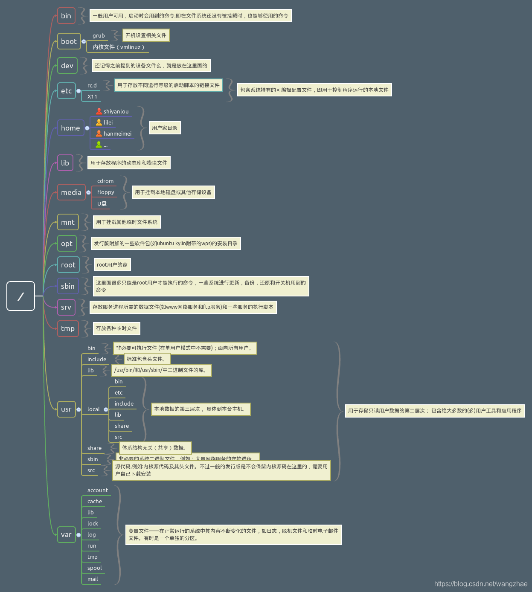

# Ubuntu
[[TOC]]
## 0.Linux学习路径


## 1. 终端

使用 Linux 时，并不是直接与系统打交道，而是通过一个叫做 Shell 的中间程序来完成的，在图形界面下为了实现让我们在一个窗口中完成用户输入和显示输出，Linux 系统还提供了一个叫做终端模拟器的程序（Terminal），实验楼环境中的终端程序是 xfce 桌面环境自带的 xfce-terminal，它与 Windows 中的控制台 (Console) 是有区别的。

终端本质上是对应着 Linux 上的 /dev/tty 设备，Linux 的多用户登陆就是通过不同的 /dev/tty 设备完成的，Linux 默认提供了 6 个纯命令行界面的 `terminal`（准确的说这里应该是 6 个 virtual consoles）来让用户登录。在物理机系统上你可以通过使用 `[Ctrl]+[Alt]+[F1]～[F6]` 进行切换，不过在我们的在线实验环境中可能无法切换，因为特殊功能按键会被你的主机系统劫持。当你切换到其中一个终端后想要切换回图形界面，你可以按下 `[Ctrl]+[Alt]+[F7] `来完成。

## 2. 软件安装

常用的一种安装方式：
```
sudo apt-get install 软件名
```
这种方法会自动下载软件包到 `/var/cache/apt/archives `目录下并安装。

## 3. 常用快捷键

### Ubuntu 全局的常用快捷键：

|按键 | 作用|
|----|-----|
|ctrl+alt+D|显示桌面 / 还原显示|
|ctrl+alt+T|启动终端|
|ctrl+alt+L|锁屏 / 显示登录对话框|
|ctrl+alt+F1-F6|进入 1-6 命令行环境|
|ctrl+alt+F7|进入图形界面环境|
|alt+Tab|在当前桌面的窗口间顺序切换|
|printscreen|截图-全屏|
|alt+F10|最大化/取消最大化窗口|
|alt+F9|最小化窗口|
|alt+F1|下拉应用程序菜单|
|alt+F2|打开运行应用程序的窗口|
|ctrl+Q|关闭应用程序窗口|

### 命令行的一些常用快捷键：

|按键 | 作用|
|----|-----|
|**Tab**|**命令补全**|
|**Ctrl+c**|**强行终止当前程序（不会退出终端）**|
|Ctrl+d|键盘输入结束或退出终端|
|Ctrl+s|暂停当前程序，暂停后按下任意键恢复运行|
|Ctrl+z|将当前程序放到后台运行，恢复到前台为命令fg|
|Ctrl+a|将光标移至输入行头，相当于Home键|
|Ctrl+e|将光标移至输入行末，相当于End键|
|Ctrl+k|删除从光标所在位置到行末|
|Alt+Backspace|向前删除一个单词|
|Shift+PgUp|将终端显示向上滚动|
|Shift+PgDn|将终端显示向下滚动|
|向上键|恢复你之前输入过的命令|

### 学会使用通配符

通配符是一种特殊语句，主要有星号（*）和问号（?），用来对字符串进行模糊匹配（比如文件名、参数名）。当查找文件夹时，可以使用它来代替一个或多个真正字符；当不知道真正字符或者懒得输入完整名字时，常常使用通配符代替一个或多个真正字符。

终端里面输入的通配符是由 Shell 处理的，不是由所涉及的命令语句处理的，它只会出现在命令的“参数值”里（它不能出现在命令名称里， 命令不记得，那就用`Tab`补全）。当 Shell 在“参数值”中遇到了通配符时，Shell 会将其当作路径或文件名在磁盘上搜寻可能的匹配：若符合要求的匹配存在，则进行代换（路径扩展）；否则就将该通配符作为一个普通字符传递给“命令”，然后再由命令进行处理。总之，通配符实际上就是一种 Shell 实现的路径扩展功能。在通配符被处理后， Shell 会先完成该命令的重组，然后继续处理重组后的命令，直至执行该命令。

在创建文件的时候，如果需要一次性创建多个文件，比如：**“love_1_linux.txt，love_2_linux.txt，... love_10_linux.txt”**。在 Linux 中十分方便：

```
touch love_{1..10}_shiyanlou.txt
```
## 4. 用户管理

### 4.1 查看用户

在终端中输入下面的命令可以查看当前登录用户的用户名。
```
$ who am i
```
### 4.2 创建用户

在 Linux 系统里， root 账户拥有整个系统至高无上的权利，比如`新建/添加`用户，在本环境中，已经具有root权限了，因为不用再加上sudo

新建一个叫 `lilei `的用户：
```
$ adduser lilei
```
该命令会默认为新用户创建 home 目录，创建好用户后，可以使用该用户登录，使用如下命令切换用户：
```
$ su -l lilei
```
## 5. 文件目录

### 5.1 目录

Linux 目录定义为四种交互作用的形态，如下表所示：



### 5.2 ls 命令

ls 命令是 list 的缩写。ls 用来打印出当前目录的清单，可以查看文件权限(包括目录、文件夹、文件权限)查看目录信息等。

命令格式:
```
ls [选项] [目录名]
```
常用参数：

`-a`：列出所有文件，包括以 . 开头的隐含文件
`-l`：列出文件的权限、所有者、文件大小等信息
`-d`：将目录象文件一样显示
`-h`：列出文件大小
`-t`：以文件修改时间排序
操作实例：

列出 /home 文件夹下的所有文件和目录的详细资料，可以使用如下命令：
```
ls -a -l /home 
ls -al /home
```
### 5.3 cd 命令

cd 命令是 change directory 的缩写,切换当前目录至指定的目录。

命令格式:
```
cd [目录名]
```
常用范例：

（1）从当前目录进入系统根目录
```
cd /
```
（2）从当前目录进入父目录
```
cd ..
```
（3）从当前目录进入当前用户主目录
```
cd ~
```
（4）从当前目录进入上次所在目录
```
cd -
```
### 5.4 pwd 命令

pwd 命令是 Print Working Directory 的缩写，判定当前目录在文件系统内的确切位置。

命令格式:
```
pwd [选项]
```
常用参数：

`-P`：显示实际物理路径
`-L`：当目录为连接路径时，显示连接路径
## 6. 文件基本操作

### 6.1 新建文件

使用 `touch`或` vi` 命令创建空白文件。

操作实例：

创建名为 test 的空白文件
```
$ touch test
$ vi test
```
### 6.2 新建目录

使用 `mkdir`（make directories）命令可以创建一个空目录，也可同时指定创建目录的权限属性。

操作实例：

创建名为 mydir 的空目录，如：
```
$ mkdir mydir
```
使用 `-p `参数，创建一个多级目录，如：
```
$ mkdir -p father/son/grandson
```
### 6.3 删除文件

使用 `rm`（remove files or directories）命令删除一个文件 ，使用 `-f` 参数表示强制删除。

操作实例：

删除 test 文件
```
$ rm test
```
强制删除 test 文件
```
$ rm -f test
```
### 6.4 删除目录

使用 `rm `删除目录，需加上 `-r` 或 `-R` 参数，如：
```
$ rm -r father
```
### 6.5 复制文件

使用 `cp `（copy）命令复制一个文件到指定目录。

操作实例：

将 test 文件 复制到 /home/shiyanlou/father/son/grandson 目录中，先进入 test 所在的目录。
```
$ cp test /home/shiyanlou/father/son/grandson
```
### 6.6 复制目录

复制文件也使用 `cp `命令，只不过要加 `-r `或 `-R `参数。

操作实例：

将 father 目录复制到 family 目录
```
$ cp -r father family
```
### 6.7 移动和重命名文件

（1）移动文件

使用 `mv`（move or rename files）命令移动文件（剪切）。

命令格式：
```
mv 源目录文件 目的目录
```
操作实例：

将文件 file1 移动到 filetest 目录
```
mv file1 filetest
```
（2）重命名文件

也使用 `mv`，命令格式：
```
mv 旧的文件名 新的文件名
```
操作实例：

将文件 file1 重命名为 file2
```
mv file1 file2
```
### 6.8 查看文件

（1）`cat`,`tac` 和 `nl` 命令

`cat` 和 `tac` 用来打印文件内容到标准输出（终端），其中 `cat` 为正序显示，`tac` 为倒序显示。

注意：这里的正序和倒序是行数，而不是内容。

操作实例：

查看 `/etc `目录下的 `passwd `文件
```
$ cat /etc/passwd
```
如果要显示行号可以加上 `-n` 参数
```
$ cat -n /etc/passwd
```
`nl` 命令是添加行号并打印。

（2）`more` 和 `less` 命令

`cat` 用来快速查看一个文件的内容，而 `more` 和 `less` 用来"阅读"一个文件的内容。可以使用` Enter` 向下滚动， `Space` 向上滚动，`q` 退出。

操作实例：

使用 more 命令打开 `passwd `文件：
```
$ more passwd
```
（3）`head `和 `tail `命令

这两个命令都是查看文件的头几行，只不过 `head` 是文件开头，`tail` 是文件末尾。`- n` 参数用来表示要查看的行数。

操作实例：

显示 `/etc/passwd` 文件中的前5行内容
```
head -n 5 /etc/passwd
```
### 6.9 grep 命令

`grep `是个很强大的命令，用来找到文件中的匹配文本，并且能够接受`正则表达式`和`通配符`，同时可以用多个 grep 命令选项来生成各种格式的输出。

grep 可用于 shell 脚本，因为 grep 通过返回一个状态值来说明搜索的状态，如果模板搜索成功，则返回 0，如果搜索不成功，则返回 1，如果搜索的文件不存在，则返回 2。我们利用这些返回值就可进行一些自动化的文本处理工作。

命令格式：
```
grep [选项] pattern [file]
```
操作实例：

将 `/etc/passwd `文件中出现` root` 的行取出来，关键词部分加上颜色显示，可以使用如下命令
```
grep "root" /etc/passwd --color=auto
cat /etc/passwd | grep "root" --color=auto
```
用` -v `参数进行反向选择，打印不匹配的行

将 /etc/passwd 文件中没有出现` root` 和 `nologin` 的行取出来，可以使用如下命令：
```
grep -v "root" /etc/passwd | grep -v "nologin"
```
### 7. 文件打包和压缩

Linux 常见的压缩包格式包括： `*.zip`,`*.rar`,`*.7z`,`*.gz`,`*.xz`,`*.bz2`,`*.tar`,`*.tar.gz`,`*.tar.xz`,`*tar.bz2`。

常见的 `.zip` 和 `tar` 压缩和解压命令：

zip：
打包 ：zip something.zip something （目录请加 -r 参数）
解包：unzip something.zip
指定路径：-d 参数
tar：
打包：tar -zcvf something.tar something
解包：tar -zxvf something.tar
指定路径：-C 参数
## 8. vim

### 8.1 vim 模式

`vim` 是由 `vi` 衍生出来得到，vim 可以不用进行菜单或者鼠标操作，并且最小化组合键的操作，仅仅通过键盘来在这些模式之中切换。对文字录入员或者程序员可以大大增强速度和效率。

Vim 具有 6 种基本模式。

#### 普通模式(Normal mode)
在普通模式中，用的编辑器命令，比如移动光标，删除文本等等。这也是Vim 启动后的默认模式。

在普通模式中，有很多方法可以进入插入模式。比较普通的方式是按 `a`（append／追加）键或者 `i`（insert／插入）键。
#### 插入模式(Insert mode)
在这个模式中，大多数按键都会向文本缓冲中插入文本。
在插入模式中，可以按 `ESC` 键回到普通模式。
#### 可视模式(Visual mode)
这个模式与普通模式比较相似。但是移动命令会扩大高亮的文本区域。
#### 选择模式(Select mode)
这个模式中，可以用鼠标或者光标键高亮选择文本，不过输入任何字符的话，Vim 会用这个字符替换选择的高亮文本块，并且自动进入插入模式。
#### 命令行模式(Command line mode)
在命令行模式中可以输入会被解释成并执行的文本。
#### Ex 模式(Ex mode)
这和命令行模式比较相似，在使用 `:visual `命令离开 Ex 模式前，可以一次执行多条命令。
### 8.2 常用模式的切换

vim 启动进入普通模式，处于插入模式或命令行模式时只需要按` Esc` 或者 `Ctrl+[`即可进入普通模式。

普通模式中按 `i`（插入）或` a`（附加）键都可以进入插入模式。

普通模式中按` :` 进入命令行模式。

命令行模式中输入` wq `回车后保存并退出 vim。

### 8.3 进入 vim

vim 后面加上你要打开的已存在的文件名或者不存在（则作为新建文件）的文件名。

打开 Xfce 终端，输入以下命令
```
$ vim practice_1.txt
```
直接使用 vim 也可以打开 vim 编辑器，但是不会打开任何文件。
```
$ vim
```
在普通模式下移动光标：

|按键 | 说明|
|-----|----|
|h | 左|
|l| 右（小写L）|
|j |下|
|k|上|
|w|移动到下一个单词|
|b|移动到上一个单词|

### 8.4 删除文本

在普通模式下删除文本：

|命令 | 说明|
|-----|----|
|x | 删除游标所在的字符|
|X | 删除游标所在前一个字符|
|Delete|同x|
|dd |删除整行|
|dw | 删除一个单词（不适用中文）|
|d$或D | 删除至行尾|
|d^ | 删除至行首|
|dG | 删除到文档结尾处|
|d1G| 删至文档首部|

### 8.5 退出 vim

从普通模式输入`:` 进入命令行模式，输入 `wq `回车，保存并退出编辑。

以下为其它几种退出方式：

|命令|说明|
|----|----|
|:q! | 强制退出，不保存|
|:q | 退出|
|:wq! |强制保存并退出|
|:w <文件路径> |另存为|
|:saveas 文件路径 |另存为|
|:x |保存并退出|
|:wq |保存并退出|
普通模式下也可以输入 `Shift+zz `保存退出 vim。


