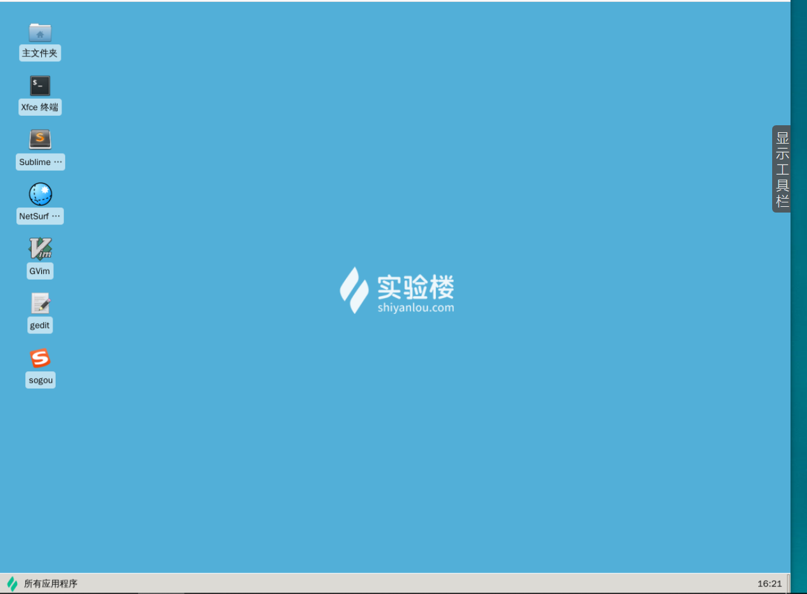

# 基本概念及操作
[[TOC]]

## Terminal
通常我们在使用 Linux 时，并不是直接与系统打交道，而是通过一个叫做 Shell 的中间程序来完成的，在图形界面下为了实现让我们在一个窗口中完成用户输入和显示输出，Linux 系统还提供了一个叫做终端模拟器的程序（Terminal）。 下面是几个比较常见的终端模拟器： gnome-terminal，Konsole，xterm，rxvt，kvt，nxterm 和 eterm 。目前我们的实验中的终端程序是 xfce 桌面环境自带的 xfce-terminal 。不过要注意的是这里所说的终端（Terminal）和控制台（Console）是有区别的。



终端本质上是对应着 Linux 上的 /dev/tty 设备，Linux 的多用户登录就是通过不同的 /dev/tty 设备完成的，Linux 默认提供了 6 个纯命令行界面的 “terminal”（准确的说这里应该是 6 个 virtual consoles）来让用户登录。在物理机系统上你可以通过使用`[Ctrl]`+`[Alt]`+`[F1]～[F6]`进行切换，不过在我们的在线实验环境中可能无法切换，因为特殊功能按键会被你的主机系统劫持。当你切换到其中一个终端后想要切换回图形界面，你可以按下`[Ctrl]`+`[Alt]`+`[F7]`来完成。

## Shell
通常在图形界面中对实际体验带来差异的不是上述的不同发行版的各种终端模拟器，而是这个 Shell（壳）。有壳就有核，这里的核就是指 UNIX/Linux 内核，Shell 是指“提供给使用者使用界面”的软件（命令解析器），类似于 DOS 下的 command（命令行）和后来的 cmd.exe 。普通意义上的 Shell 就是可以接受用户输入命令的程序。它之所以被称作 Shell 是因为它隐藏了操作系统底层的细节。同样的 UNIX/Linux 下的图形用户界面 GNOME 和 KDE，有时也被叫做“虚拟 shell”或“图形 shell”。

UNIX/Linux 操作系统下的 Shell 既是用户交互的界面，也是控制系统的脚本语言。当然这一点也有别于 Windows 下的命令行，虽然该命令行也提供了很简单的控制语句。在 Windows 操作系统下，有些用户从来都不会直接使用 Shell，然而在 UNIX 系列操作系统下，Shell 仍然是控制系统启动、X11 启动和很多其它实用工具的脚本解释程序。

在 UNIX/Linux 中比较流行的常见的 Shell 有 bash、zsh、ksh、csh 等等，Ubuntu 终端默认使用的是 bash，默认的桌面环境是 GNOME 或者 Unity（基于 GNOME），但我们的环境中使用的分别是 zsh 和 xfce。

## 命令行操作

在 linux 中，最最重要的就是命令，这就包含了 2 个过程，输入和输出

- 输入：输入当然就是打开终端，然后按键盘输入，然后按回车，输入格式一般就是这类的

```bash
#创建一个名为 file 的文件，touch是一个命令
touch file

#进入一个目录，cd是一个命令
cd /etc/

#查看当前所在目录
pwd
```

- 输出：输出会返回你想要的结果，比如你要看什么文件，就会返回文件的内容。如果只是执行，执行失败会告诉你哪里错了，如果执行成功那么会没有输出，因为 linux 的哲学就是：没有结果就是最好的结果

### 快捷键
1. [Tab]使用Tab键来进行命令补全，Tab键一般键盘是在字母Q旁边，这个技巧给你带来的最大的好处就是当你忘记某个命令的全称时你可以只输入它的开头的一部分然后按下Tab键就可以得到提示或者帮助完成，当然不止补全命令，补全目录，补全命令参数都是没问题的。
2. [Ctrl+c]想想你有没有遇到这种情况，当你在Linux命令行中无意输入了一个不知道的命令，或者错误的使用了一个命令，导致在终端里出现了你无法预料的情况，比如，只有光标在闪烁无法继续输入命令，或者不停地在输出一大堆你不想要的结果。你想要立即停止并恢复到你可控的状态，那该怎么办呢。这时候你就可以使用Ctrl+c键来强行终止当前程序（你可以放心它并不会使终端退出）。
3. 其他一些常用快捷键

|按键|	作用|
|----|---|
|Ctrl+d	|键盘输入结束或退出终端|
|Ctrl+s	|暂定当前程序，暂停后按下任意键恢复运行|
|Ctrl+z	|将当前程序放到后台运行，恢复到前台为命令fg|
|Ctrl+a	|将光标移至输入行头，相当于Home键|
|Ctrl+e	|将光标移至输入行末，相当于End键|
|Ctrl+k|	删除从光标所在位置到行末|
|Alt+Backspace	|向前删除一个单词|
|Shift+PgUp|	将终端显示向上滚动|
|Shift+PgDn	|将终端显示向下滚动|


### 学会利用历史输入命令
很简单，你可以使用键盘上的方向上键，恢复你之前输入过的命令，你一试便知。
### 学会使用通配符
通配符是一种特殊语句，主要有星号（*）和问号（?），用来对对字符串进行模糊匹配（比如文件名，参数名）。当查找文件夹时，可以使用它来代替一个或多个真正字符；当不知道真正字符或者懒得输入完整名字时，常常使用通配符代替一个或多个真正的字符。
**创建和寻找文件**
```
$ touch adsfasd.txt wergjlkas.txt 
$ ls *.txt
```

***Shell 常用通配符：***

|字符|	含义|
|---|---|
|*|	匹配 0 或多个字符|
|?	|匹配任意一个字符|
|[list]	|匹配 list 中的任意单一字符|
|[!list]|	匹配 除list 中的任意单一字符以外的字符|
|[c1-c2]|	匹配 c1-c2 中的任意单一字符 如：[0-9] [a-z]|
|{string1,string2,...}|	匹配 sring1 或 string2 (或更多)其一字符串|
|{c2..c2}|	匹配 c1-c2 中全部字符 如{1..10}|
### 学会在命令行中获取帮助
在 Linux 环境中，如果你遇到困难，可以使用`man `命令，它是`Manual page`的缩写。
```
$ man <command_name>
```
在Research UNIX、BSD、OS X 和 Linux 中，手册通常被分为8个区段，安排如下：
|区段|	说明|
|---|---|
|1|	一般命令|
|2	|系统调用|
|3	|库函数，涵盖了C标准函数库|
|4	|特殊文件（通常是/dev中的设备）和驱动程序|
|5	|文件格式和约定|
|6	|游戏和屏保|
|7	|杂项|
|8	|系统管理命令和守护进程|


要查看相应区段的内容，就在 man 后面加上相应区段的数字即可，如：

```
$ man 1 ls
```
会显示第一区段中的 `ls`命令man页面。

所有的手册页遵循一个常见的布局，其为通过简单的ASCII文本展示而优化，而这种情况下可能没有任何形式的高亮或字体控制。一般包括以下部分内容：

NAME（名称）
> 该命令或函数的名称，接着是一行简介。

SYNOPSIS（概要）
> 对于命令，正式的描述它如何运行，以及需要什么样的命令行参数。对于函数，介绍函数所需的参数，以及哪个头文件包含该函数的定义。

DESCRIPTION（说明）
> 命令或函数功能的文本描述。

EXAMPLES（示例）
> 常用的一些示例。

SEE ALSO（参见）
>相关命令或函数的列表。

也可能存在其他部分内容，但这些部分没有得到跨手册页的标准化。常见的例子包括：OPTIONS（选项），EXIT STATUS（退出状态），ENVIRONMENT（环境），BUGS（程序漏洞），FILES（文件），AUTHOR（作者），REPORTING BUGS（已知漏洞），HISTORY（历史）和COPYRIGHT（版权）。
通常 man 手册中的内容很多，你可能不太容易找到你想要的结果，不过幸运的是你可以在 man 中使用搜索`/<你要搜索的关键字>`，查找到后你可以使用`n`键切换到下一个关键字所在处，`shift+n`为上一个关键字所在处。使用`Space`(空格键)翻页，`Enter`(回车键)向下滚动一行，或者使用`j`,`k`（vim编辑器的移动键）进行向前向后滚动一行。按下`h`键为显示使用帮助(因为man使用`less`作为阅读器，实为less工具的帮助)，按下`q`退出。

想要获得更详细的帮助，你还可以使用`info`命令，不过通常使用`man`就足够了。如果你知道某个命令的作用，只是想快速查看一些它的某个具体参数的作用，那么你可以使用`--help`参数，大部分命令都会带有这个参数，如：
```
$ ls --help
```


