# 用户及文件权限管理
[[TOC]]
文件权限就是文件的访问控制权限，即哪些用户和组群可以访问文件以及可以执行什么样的操作。

Unix/Linux 系统是一个典型的多用户系统，不同的用户处于不同的地位，对文件和目录有不同的访问权限。为了保护系统的安全性，Unix/Linux 系统除了对用户权限作了严格的界定外，还在用户身份认证、访问控制、传输安全、文件读写权限等方面作了周密的控制。

在 Unix/Linux 中的每一个文件或目录都包含有访问权限，这些访问权限决定了谁能访问和如何访问这些文件和目录。

## linux用户管理

### 1.查看用户
请打开终端，输入命令：

```bash
who am i

# 或者

who mom likes
```

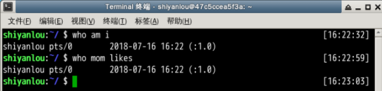

输出的第一列表示打开当前伪终端的用户的用户名（要查看当前登录用户的用户名，去掉空格直接使用 `whoami` 即可），第二列的 `pts/0` 中 `pts` 表示伪终端，所谓伪是相对于 `/dev/tty` 设备而言的，还记得上一节讲终端时的那七个使用 `[Ctrl]`+`[Alt]`+`[F1]～[F7]` 进行切换的 `/dev/tty` 设备么，这是“真终端”，伪终端就是当你在图形用户界面使用 `/dev/tty7` 时每打开一个终端就会产生一个伪终端，`pts/0` 后面那个数字就表示打开的伪终端序号，你可以尝试再打开一个终端，然后在里面输入 `who am i`，看第二列是不是就变成 `pts/1` 了，第三列则表示当前伪终端的启动时间。

还有一点需要注意的是，在某些环境中 `who am i` 和 `who mom likes` 命令不会输出任何内容，这是因为当前使用的 SHELL 不是登录时的 SHELL，没有用户与 who 的 stdin 相关联，因此不会输出任何内容。例如我在本地的 Ubuntu 系统上输入这个命令就不会有提示。

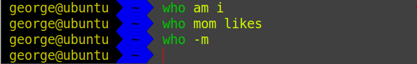

此时我们只需要打开一个登录 SHELL 的终端例如 Tmux，或者通过 ssh 登录到本机，再在新的终端里执行命令即可。

```bash
tmux
```

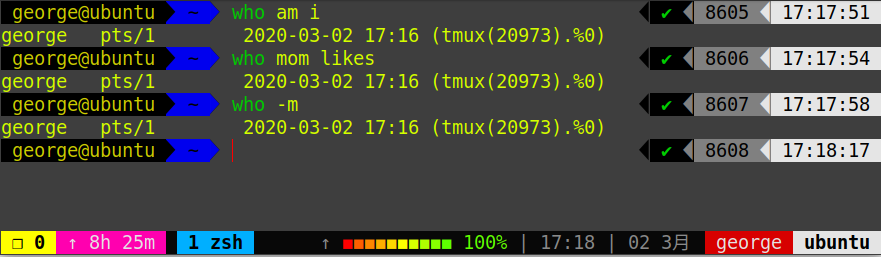

`who` 命令其它常用参数

| 参数 | 说明                       |
| ---- | -------------------------- |
| `-a` | 打印能打印的全部           |
| `-d` | 打印死掉的进程             |
| `-m` | 同`am i`，`mom likes`      |
| `-q` | 打印当前登录用户数及用户名 |
| `-u` | 打印当前登录用户登录信息   |
| `-r` | 打印运行等级               |

### 2.创建用户
在 Linux 系统里， `root` 账户拥有整个系统至高无上的权限，比如新建和添加用户。

> root 权限，系统权限的一种，与 SYSTEM 权限可以理解成一个概念，但高于 Administrator 权限，root 是 Linux 和 UNIX 系统中的超级管理员用户帐户，该帐户拥有整个系统至高无上的权力，所有对象他都可以操作，所以很多黑客在入侵系统的时候，都要把权限提升到 root 权限，这个操作等同于在 Windows 下就是将新建的非法帐户添加到 Administrators 用户组。更比如安卓操作系统中（基于 Linux 内核）获得 root 权限之后就意味着已经获得了手机的最高权限，这时候你可以对手机中的任何文件（包括系统文件）执行所有增、删、改、查的操作。

大部分 Linux 系统在安装时都会建议用户新建一个用户而不是直接使用 root 用户进行登录，当然也有直接使用 root 登录的例如 Kali（基于 Debian 的 Linux 发行版，集成大量工具软件，主要用于数字取证的操作系统）。一般我们登录系统时都是以普通账户的身份登录的，要创建用户需要 root 权限，这里就要用到 `sudo` 这个命令了。不过使用这个命令有两个大前提，一是你要知道当前登录用户的密码，二是当前用户必须在 `sudo` 用户组。shiyanlou 用户也属于 sudo 用户组（稍后会介绍如何查看和添加用户组）。

#### su，su- 与 sudo

**需要注意 Linux 环境下输入密码是不会显示的。**

`su <user>` 可以切换到用户 user，执行时需要输入目标用户的密码，`sudo <cmd>` 可以以特权级别运行 cmd 命令，需要当前用户属于 sudo 组，且需要输入当前用户的密码。`su - <user>` 命令也是切换用户，但是同时用户的环境变量和工作目录也会跟着改变成目标用户所对应的。

现在我们新建一个叫 `lilei` 的用户：

```bash
sudo adduser lilei
```

实验楼的环境目前设置为 shiyanlou 用户执行 sudo 不需要输入密码，通常此处需要按照提示输入 shiyanlou 密码（**Linux 下密码输入是不显示任何内容的，shiyanlou 用户密码可以在右侧环境信息里查看，请勿自行设置密码**）。然后是给 lilei 用户设置密码，后面的选项的一些内容你可以选择直接回车使用默认值。

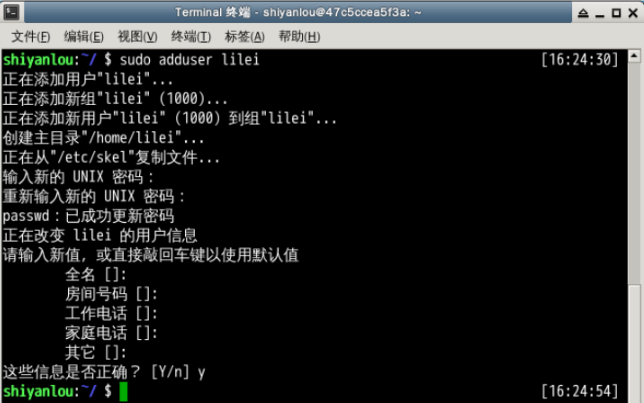

这个命令不但可以添加用户到系统，同时也会默认为新用户在 /home 目录下创建一个工作目录：

```bash
ls /home
```

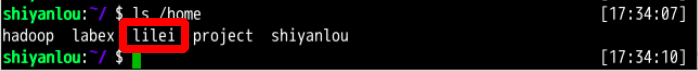

现在你已经创建好一个用户，并且你可以使用你创建的用户登录了，使用如下命令切换登录用户：

```bash
su -l lilei
```

输入刚刚设置的 lilei 的密码，然后输入如下命令并查看输出：

```bash
who am i
whoami
pwd
```

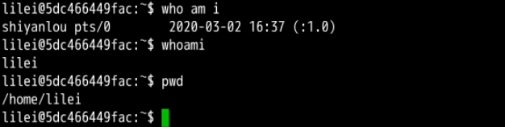

你发现了区别了吗？这就是上一小节我们讲到的 `who am i` 和 `whoami` 命令的区别。

退出当前用户跟退出终端一样，可以使用 `exit` 命令或者使用快捷键 `Ctrl+D`。

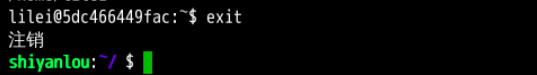


### 3.用户组
在 Linux 里面每个用户都有一个归属（用户组），用户组简单地理解就是一组用户的集合，它们共享一些资源和权限，同时拥有私有资源，就跟家的形式差不多，你的兄弟姐妹（不同的用户）属于同一个家（用户组），你们可以共同拥有这个家（共享资源），爸妈对待你们都一样（共享权限），你偶尔写写日记，其他人未经允许不能查看（私有资源和权限）。当然一个用户是可以属于多个用户组的，正如你既属于家庭，又属于学校或公司。

在 Linux 里面如何知道自己属于哪些用户组呢？

#### 方法一：使用 groups 命令

```bash
groups shiyanlou
```

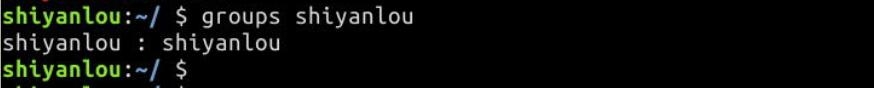

其中冒号之前表示用户，后面表示该用户所属的用户组。这里可以看到 shiyanlou 用户属于 shiyanlou 用户组，每次新建用户如果不指定用户组的话，默认会自动创建一个与用户名相同的用户组（差不多就相当于家长的意思）。

默认情况下在 sudo 用户组里的可以使用 sudo 命令获得 root 权限。shiyanlou 用户也可以使用 sudo 命令，为什么这里没有显示在 sudo 用户组里呢？可以查看下 `/etc/sudoers.d/shiyanlou` 文件，我们在 `/etc/sudoers.d` 目录下创建了这个文件，从而给 shiyanlou 用户赋予了 sudo 权限：

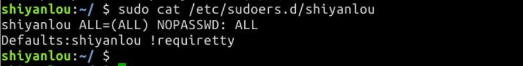

用户组的管理涉及用户组的添加、删除和修改。组的增加、删除和修改实际上就是对/etc/group文件的更新。

- `groupadd 选项 用户组` :增加一个新的用户组
- `groupdel 用户组`:要删除一个已有的用户组
- `groupmod 选项 用户组` : 修改用户组的属性

#### 方法二：查看 `/etc/group` 文件

```bash
cat /etc/group | sort
```

这里 `cat` 命令用于读取指定文件的内容并打印到终端输出，后面会详细讲它的使用。 `| sort` 表示将读取的文本进行一个字典排序再输出，然后你将看到如下一堆输出，你可以在最下面看到 shiyanlou 的用户组信息：

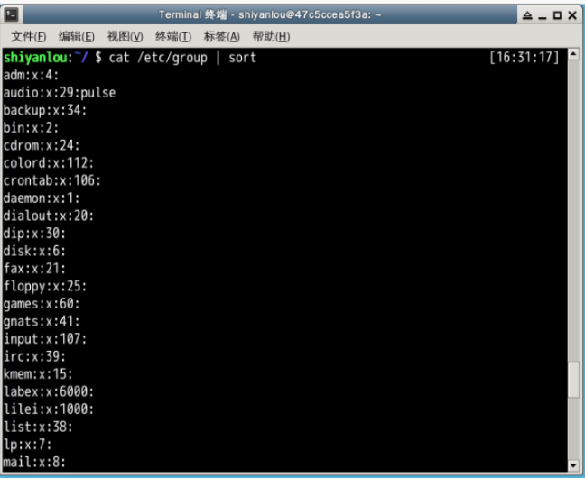

没找到？没关系，你可以使用 `grep` 命令过滤掉一些你不想看到的结果：

```bash
cat /etc/group | grep -E "shiyanlou"
```


##### `/etc/group` 文件格式说明

/etc/group 的内容包括用户组（Group）、用户组口令、GID（组 ID） 及该用户组所包含的用户（User），每个用户组一条记录。格式如下：

> group_name:password:GID:user_list

你看到上面的 password 字段为一个 `x`，并不是说密码就是它，只是表示密码不可见而已。

这里需要注意，如果用户的 GID 等于用户组的 GID，那么最后一个字段 `user_list` 就是空的，这里的 GID 是指用户默认所在组的 GID，可以使用 `id` 命令查看。比如 shiyanlou 用户，在 `/etc/group` 中的 shiyanlou 用户组后面是不会显示的。lilei 用户，在 `/etc/group` 中的 lilei 用户组后面是不会显示的。

#### 将其它用户加入 sudo 用户组

默认情况下新创建的用户是不具有 root 权限的，也不在 sudo 用户组，可以让其加入 sudo 用户组从而获取 root 权限：

```bash
# 注意 Linux 上输入密码是不会显示的
su -l lilei
sudo ls
```

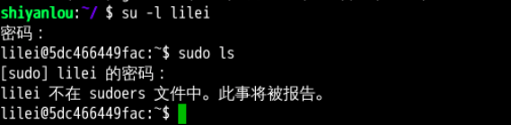

会提示 lilei 不在 sudoers 文件中，意思就是 lilei 不在 sudo 用户组中，至于 sudoers 文件（/etc/sudoers）你现在最好不要动它，操作不慎会导致比较麻烦的后果。

使用 `usermod` 命令可以为用户添加用户组，同样使用该命令你必需有 root 权限，你可以直接使用 root 用户为其它用户添加用户组，或者用其它已经在 sudo 用户组的用户使用 sudo 命令获取权限来执行该命令。

这里我用 shiyanlou 用户执行 sudo 命令将 lilei 添加到 sudo 用户组，让它也可以使用 sudo 命令获得 root 权限，首先我们切换回 shiyanlou 用户。

```bash
su - shiyanlou
```

此处需要输入 shiyanlou 用户密码，shiyanlou 的密码可以在右侧工具栏的环境信息里看到。

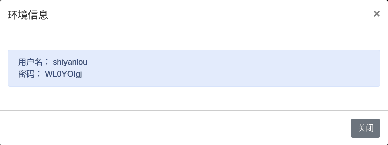

当然也可以通过 `sudo passwd shiyanlou` 进行设置，或者你直接关闭当前终端打开一个新的终端。

```bash
groups lilei
sudo usermod -G sudo lilei
groups lilei
```

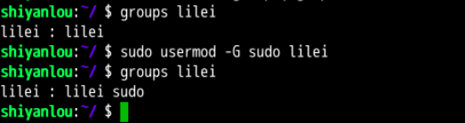

然后你再切换回 lilei 用户，现在就可以使用 sudo 获取 root 权限了。

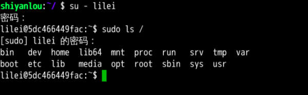


### 4.删除用户

删除用户是很简单的事：

```bash
sudo deluser lilei --remove-home
```

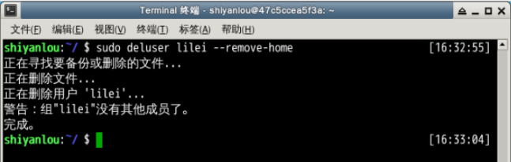

使用 `--remove-home` 参数在删除用户时候会一并将该用户的工作目录一并删除。如果不使用那么系统会自动在 /home 目录为该用户保留工作目录。

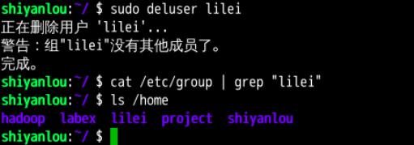

删除用户组可以使用 `groupdel` 命令，倘若该群组中仍包括某些用户，则必须先删除这些用户后，才能删除群组。

## Linux 文件权限

文件权限就是文件的访问控制权限，即哪些用户和组群可以访问文件以及可以执行什么样的操作。

Unix/Linux 系统是一个典型的多用户系统，不同的用户处于不同的地位，对文件和目录有不同的访问权限。为了保护系统的安全性，Unix/Linux 系统除了对用户权限作了严格的界定外，还在用户身份认证、访问控制、传输安全、文件读写权限等方面作了周密的控制。

操作系统中每个文件都拥有特定的权限、所属用户和所属组。权限是操作系统用来限制资源访问的机制，在Linux中权限一般分为读(readable)、写(writable)和执行(excutable)，分为三组。分别对应文件的属主(owner)，属组(group)和其他用户(other)，通过这样的机制来限制哪些用户、哪些组可以对特定的文件进行什么样的操作。通过 **`ls -l`** 命令我们可以查看某个目录下的文件或目录的权限.

在 Unix/Linux 中的每一个文件或目录都包含有访问权限，这些访问权限决定了谁能访问和如何访问这些文件和目录。

### 1.查看文件权限
使用较长格式列出文件：

```
$ ls -l
```
你可能除了知道最后面那一项是文件名之外，其它项就不太清楚了，那么到底是什么意思呢：

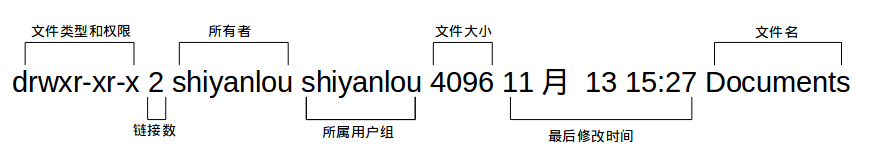

可能你还是不太明白，比如第一项文件类型和权限那一堆东西具体指什么，链接又是什么，何为最后修改时间，下面一一道来：

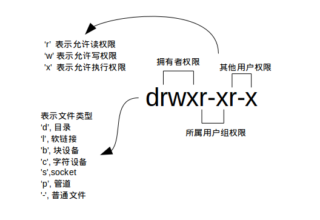


* 文件类型
  - d： 代表目录
  - -： 代表文件
  - l： 代表软链接（可以认为是window中的快捷方式）
  
  关于文件类型，这里有一点你必需时刻牢记 **Linux 里面一切皆文件**，正因为这一点才有了设备文件（ `/dev` 目录下有各种设备文件，大都跟具体的硬件设备相关）这一说。 `socket`：网络套接字，具体是什么，感兴趣的用户可以去学习实验楼的后续相关课程。`pipe` 管道，这个东西很重要，我们以后将会讨论到，这里你先知道有它的存在即可。`软链接文件`：链接文件是分为两种的，另一种当然是“硬链接”（硬链接不常用，具体内容不作为本课程讨论重点，而软链接等同于 Windows 上的快捷方式，你记住这一点就够了）。

* 文件权限
  - r：代表权限是可读，r也可以用数字4表示
  - w：代表权限是可写，w也可以用数字2表示
  - x：代表权限是可执行，x也可以用数字1表示

* 读权限，表示你可以使用 `cat <file name>` 之类的命令来读取某个文件的内容；写权限，表示你可以编辑和修改某个文件的内容；

  执行权限，通常指可以运行的二进制程序文件或者脚本文件，如同 Windows 上的 `exe` 后缀的文件，不过 Linux 上不是通过文件后缀名来区分文件的类型。你需要注意的一点是，**一个目录同时具有读权限和执行权限才可以打开并查看内部文件，而一个目录要有写权限才允许在其中创建其它文件**，这是因为目录文件实际保存着该目录里面的文件的列表等信息。

  所有者权限，这一点相信你应该明白了，至于所属用户组权限，是指你所在的用户组中的所有其它用户对于该文件的权限，比如，你有一个 iPad，那么这个用户组权限就决定了你的兄弟姐妹有没有权限使用它破坏它和占有它。

* 链接数
  链接到该文件所在的 inode 结点的文件名数目（关于这个概念涉及到 Linux 文件系统的相关概念知识，不在本课程的讨论范围，感兴趣的用户可以查看 [硬链接和软链接的联系与区别](https://www.ibm.com/developerworks/cn/linux/l-cn-hardandsymb-links/index.html#major2)）。

* 文件大小
  以 inode 结点大小为单位来表示的文件大小，你可以给 `ls `加上 `-lh` 参数来更直观的查看文件的大小。
  ***关于 ls 命令的一些其它常用的用法：***

* 显示除了 `.`(当前目录)，`..`上一级目录之外的所有包含隐藏文件（Linux 下以 `.`'开头的文件为隐藏文件）
```
$ ls -A
```
当然，你可以同时使用 `-a` 和 `-l`参数：
```
$ ls -al
```
查看某一个目录的完整属性，而不是显示目录里面的文件属性：
```
$ ls -dl <目录名>
```
* 显示所有文件大小，并以普通人类能看懂的方式呈现：
```
$ ls -asSh
```
其中小 s 为显示文件大小，大 S 为按文件大小排序，若需要知道如何按其它方式排序，可以使用 `man ls` 命令查询。

**文件和目录权限的区别：**

 对文件和目录而言，读写执行表示不同的意义。

 对于文件：

| 权限名称 |                可执行操作 |
| :------- | ------------------------: |
| r        | 可以使用cat查看文件的内容 |
| w        |        可以修改文件的内容 |
| x        |  可以将其运行为二进制文件 |

 对于目录：

| 权限名称 |               可执行操作 |
| :------- | -----------------------: |
| r        |       可以查看目录下列表 |
| w        | 可以创建和删除目录下文件 |
| x        |       可以使用cd进入目录 |


**需要注意的是超级用户可以无视普通用户的权限，即使文件目录权限是000，依旧可以访问。**
**在linux中的每个用户必须属于一个组，不能独立于组外。在linux中每个文件有所有者、所在组、其它组的概念。**

- **所有者**

  一般为文件的创建者，谁创建了该文件，就天然的成为该文件的所有者，用ls ‐ahl命令可以看到文件的所有者 也可以使用chown 用户名  文件名来修改文件的所有者 。

- **文件所在组**

  当某个用户创建了一个文件后，这个文件的所在组就是该用户所在的组 用ls ‐ahl命令可以看到文件的所有组 也可以使用chgrp  组名  文件名来修改文件所在的组。 

- **其它组**

  除开文件的所有者和所在组的用户外，系统的其它用户都是文件的其它组 

### 2.变更文件所有者

切换到 lilei 用户，然后在 /home/lilei 目录新建一个文件，命名为 `iphone11`。

```bash
su - lilei
pwd
touch iphone11
ls -alh iphone11
```

可见文件所有者是 lilei ：

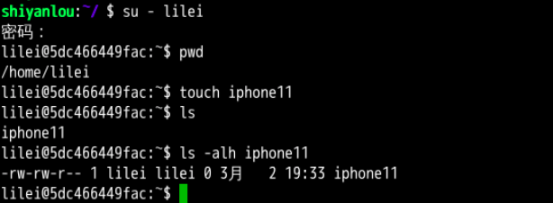

现在切换回到 shiyanlou 用户，使用以下命令变更文件所有者为 shiyanlou。

```bash
# 需要切换到 shiyanlou 用户执行以下操作
cd /home/lilei
ls iphone11
sudo chown shiyanlou iphone11
```

现在查看，发现文件所有者成功修改为 shiyanlou。

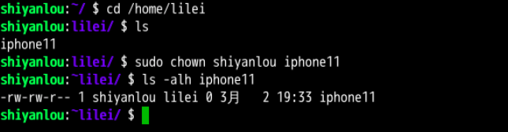

### 3.修改文件权限

如果你有一个自己的文件不想被其他用户读、写、执行，那么就需要对文件的权限做修改。文件的权限有两种表示方式：

- 方式一：二进制数字表示

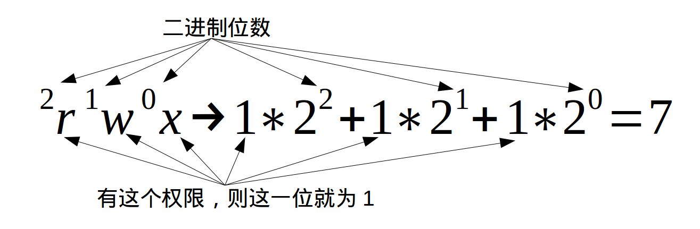

每个文件有三组固定的权限，分别对应拥有者，所属用户组，其他用户，**记住这个顺序是固定的**。文件的读写执行对应字母 `rwx`，以二进制表示就是 `111`，用十进制表示就是 `7`，对进制转换不熟悉的同学可以看看 [进制转换](https://baike.baidu.com/item/进制转换/3117222)。例如我们刚刚新建的文件 iphone11 的权限是 `rw-rw-rw-`，换成对应的十进制表示就是 666，这就表示这个文件的拥有者，所属用户组和其他用户具有读写权限，不具有执行权限。

如果我要将文件 `iphone11` 的权限改为只有我自己可以用那么就可以用这个方法更改它的权限。

为了演示，我先在文件里加点内容：

```bash
echo "echo \"hello shiyanlou\"" > iphone11
```

然后修改权限：

```bash
chmod 600 iphone11
ls -alh iphone11
```

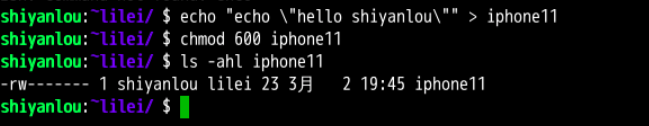

切换到 lilei 用户，尝试写入和读取操作，可以看到 lilei 用户已经不能读写这个 iphone11 文件了：

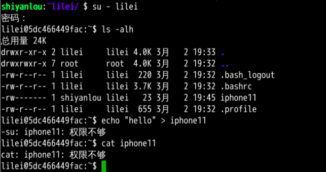

- 方式二：加减赋值操作

要完成上述实验相同的效果，你可以：

```bash
chmod go-rw iphone11
```

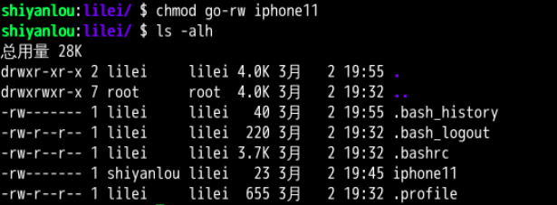

`g`、`o` 还有 `u` 分别表示 group（用户组）、others（其他用户） 和 user（用户），`+` 和 `-` 分别表示增加和去掉相应的权限。

**修改文件/目录的权限的命令：`chmod`**

示例：修改/test下的aaa.txt的权限为属主有全部权限，属主所在的组有读写权限，
其他用户只有读的权限

**`chmod u=rwx,g=rw,o=r aaa.txt`**

上述示例还可以使用数字表示：

chmod 764 aaa.txt

**补充一个比较常用的东西:**

假如我们装了一个zookeeper，我们每次开机到要求其自动启动该怎么办？

1. 新建一个脚本zookeeper
2. 为新建的脚本zookeeper添加可执行权限，命令是:`chmod +x zookeeper`
3. 把zookeeper这个脚本添加到开机启动项里面，命令是：` chkconfig --add  zookeeper`
4. 如果想看看是否添加成功，命令是：`chkconfig --list`

## `adduser` 和 `useradd` 的区别是什么

答：`useradd` 只创建用户，不会创建用户密码和工作目录，创建完了需要使用 `passwd <username>` 去设置新用户的密码。`adduser` 在创建用户的同时，会创建工作目录和密码（提示你设置），做这一系列的操作。其实 `useradd`、`userdel` 这类操作更像是一种命令，执行完了就返回。而 `adduser` 更像是一种程序，需要你输入、确定等一系列操作。

Linux 还有一些关于隐藏权限和特殊权限的内容，想全面了解 Linux 权限管理这部分内容的用户可以通过其它方式学习。
