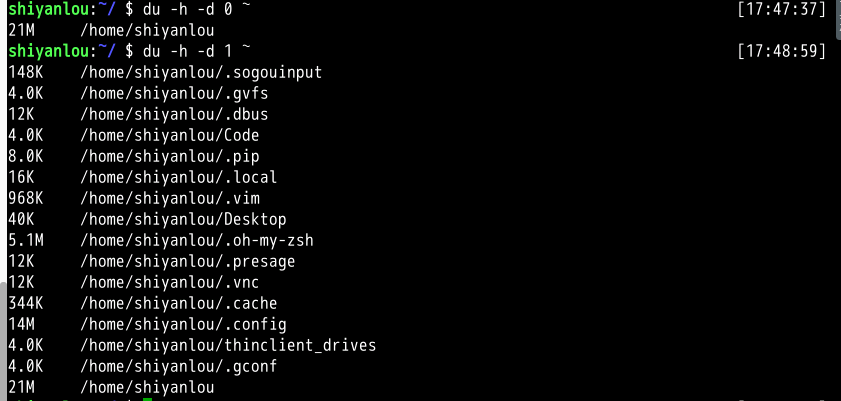
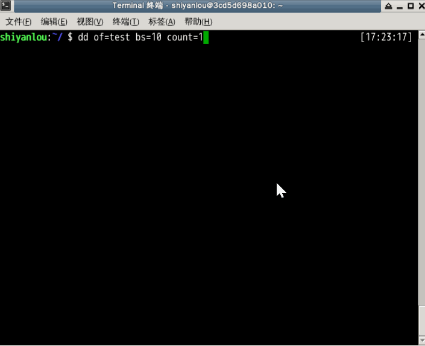
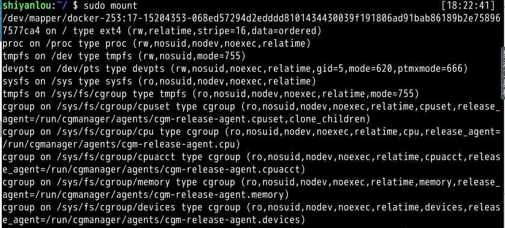
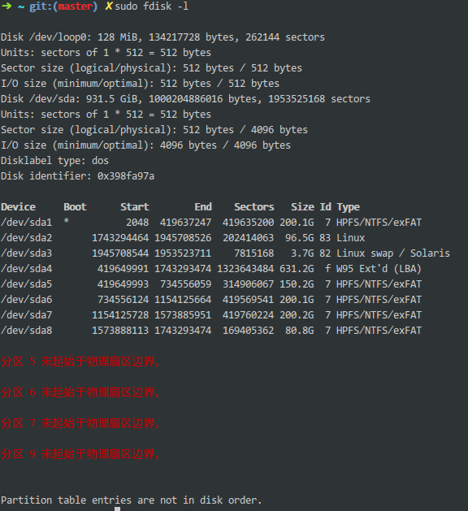
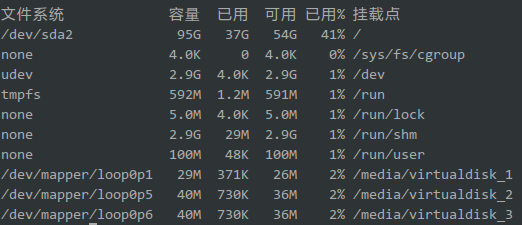

# 文件系统操作与磁盘管理
[[TOC]]
## 查看磁盘和目录的容量
- 使用 `df` 命令查看磁盘的容量

```bash
df
```

在实验楼的环境中你将看到如下的输出内容：


但在实际的物理主机上会更像这样：


物理主机上的 `/dev/sda2` 是对应着主机硬盘的分区，后面的数字表示分区号，数字前面的字母 a 表示第几块硬盘（也可能是可移动磁盘），你如果主机上有多块硬盘则可能还会出现 `/dev/sdb`，`/dev/sdc` 这些磁盘设备都会在 `/dev` 目录下以文件的存在形式。

接着你还会看到"1k-块"这个陌生的东西，它表示以磁盘块大小的方式显示容量，后面为相应的以块大小表示的已用和可用容量，在你了解 Linux 的文件系统之前这个就先不管吧，我们以一种你应该看得懂的方式展示：

```bash
df -h
```


现在你就可以使用命令查看你主机磁盘的使用情况了。至于挂载点如果你还记得前面第 4 节介绍 Linux 目录树结构的内容，那么你就应该能很好的理解挂载的概念，这里就不再赘述。

- 使用 `du` 命令查看目录的容量

这个命令前面其实已经用了很多次了：

```bash
# 默认同样以块的大小展示
du
# 加上 `-h` 参数，以更易读的方式展示
du -h
```

`-d` 参数指定查看目录的深度

```bash
# 只查看 1 级目录的信息
du -h -d 0 ~
# 查看 2 级
du -h -d 1 ~
```

常用参数

```bash
du -h # 同 --human-readable 以 K，M，G 为单位，提高信息的可读性。
du -a # 同 --all 显示目录中所有文件的大小。
du -s # 同 --summarize 仅显示总计，只列出最后加总的值。
```



`du`（estimate file space usage）命令与 `df`（report file system disk space usage）命令只有一字之差，希望大家注意不要弄混淆了，你可以像我这样从 man 手册中获取命令的完整描述，记全称就不会搞混了。

## 简单的磁盘管理

**下面涉及的命令具有一定的危险性，操作不当可能会丢失你的个人数据，初学者建议在虚拟环境中进行操作。**

通常情况下，这一小节应该直接讲如何挂载卸载磁盘，如何格式化磁盘，如何分区，但如你所见，由于实验环境的限制，环境中没有额外的磁盘可以挂载，也没有空闲空间测试分区命令，所以首先我们会先创建一个虚拟磁盘来进行后续的练习操作。

### 创建虚拟磁盘

#### dd 命令简介

`dd` 命令用于转换和复制文件，不过它的复制不同于 `cp`。之前提到过关于 Linux 的很重要的一点，**一切即文件**，在 Linux 上，硬件的设备驱动（如硬盘）和特殊设备文件（如 `/dev/zero` 和 `/dev/random`）都像普通文件一样，只是在各自的驱动程序中实现了对应的功能，`dd` 也可以读取文件或写入这些文件。这样，`dd` 也可以用在备份硬件的引导扇区、获取一定数量的随机数据或者空数据等任务中。`dd` 程序也可以在复制时处理数据，例如转换字节序、或在 ASCII 与 EBCDIC 编码间互换。

`dd` 的命令行语句与其他的 Linux 程序不同，因为它的命令行选项格式为 **选项=值**，而不是更标准的 **--选项 值** 或 **-选项=值**。`dd` 默认从标准输入中读取，并写入到标准输出中，但可以用选项 `if`（input file，输入文件）和 `of`（output file，输出文件）改变。

我们先来试试用 `dd` 命令从标准输入读入用户的输入到标准输出或者一个文件中：

```bash
# 输出到文件
dd of=test bs=10 count=1 # 或者 dd if=/dev/stdin of=test bs=10 count=1
# 输出到标准输出
dd if=/dev/stdin of=/dev/stdout bs=10 count=1
# 在打完了这个命令后，继续在终端打字，作为你的输入
```



上述命令从标准输入设备读入用户输入（缺省值，所以可省略）然后输出到 test 文件，`bs`（block size）用于指定块大小（缺省单位为 Byte，也可为其指定如 `K`，`M`，`G` 等单位），`count` 用于指定块数量。如上图所示，我指定只读取总共 10 个字节的数据，当我输入了 `hello shiyanlou` 之后加上空格回车总共 16 个字节（一个英文字符占一个字节）内容，显然超过了设定大小。使用 `du` 和 `cat` 10 个字节（那个黑底百分号表示这里没有换行符），而其他的多余输入将被截取并保留在标准输入。

前面说到 `dd` 在拷贝的同时还可以实现数据转换，那下面就举一个简单的例子：将输出的英文字符转换为大写再写入文件：

```bash
dd if=/dev/stdin of=test bs=10 count=1 conv=ucase
```


你可以在`man`文档中查看其他所有转换参数。

#### 使用 dd 命令创建虚拟镜像文件

通过上面一小节，你应该掌握了 `dd` 的基本使用，下面就来使用 `dd` 命令来完成创建虚拟磁盘的第一步。

从 `/dev/zero` 设备创建一个容量为 256M 的空文件：

```bash
dd if=/dev/zero of=virtual.img bs=1M count=256
du -h virtual.img
```


然后我们要将这个文件格式化（写入文件系统），这里我们要学到一个（准确的说是一组）新的命令来完成这个需求。

#### 使用 mkfs 命令格式化磁盘（我们这里是自己创建的虚拟磁盘镜像）

你可以在命令行输入 `sudo mkfs` 然后按下 `<Tab>` 键，你可以看到很多个以 mkfs 为前缀的命令，这些不同的后缀其实就是表示着不同的文件系统，可以用 mkfs 格式化成的文件系统。

我们可以简单的使用下面的命令来将我们的虚拟磁盘镜像格式化为 `ext4` 文件系统：

```bash
sudo mkfs.ext4 virtual.img
```


可以看到实际 `mkfs.ext4` 是使用 `mke2fs` 来完成格式化工作的。`mke2fs` 的参数很多，不过我们也不会经常格式化磁盘来玩，所以就掌握这基本用法吧，等你有特殊需求时，再查看 man 文档解决。

更多关于文件系统的知识，请查看 wiki： [文件系统](http://zh.wikipedia.org/wiki/文件系统#Linux_.E6.94.AF.E6.8F.B4.E7.9A.84.E6.AA.94.E6.A1.88.E7.B3.BB.E7.B5.B1) [ext3](http://zh.wikipedia.org/wiki/Ext3)，[ext4](http://zh.wikipedia.org/wiki/Ext4)

如果你想知道 Linux 支持哪些文件系统你可以输入 `ls -l /lib/modules/$(uname -r)/kernel/fs` 查看（我们的环境中无法查看）。

#### 使用 mount 命令挂载磁盘到目录树

用户在 Linux/UNIX 的机器上打开一个文件以前，包含该文件的文件系统必须先进行挂载的动作，此时用户要对该文件系统执行 `mount` 的指令以进行挂载。该指令通常是使用在 USB 或其他可移除存储设备上，而根目录则需要始终保持挂载的状态。又因为 Linux/UNIX 文件系统可以对应一个文件而不一定要是硬件设备，所以可以挂载一个包含文件系统的文件到目录树。

Linux/UNIX 命令行的 `mount` 指令是告诉操作系统，对应的文件系统已经准备好，可以使用了，而该文件系统会对应到一个特定的点（称为挂载点）。挂载好的文件、目录、设备以及特殊文件即可提供用户使用。

我们先来使用 `mount` 来查看下主机已经挂载的文件系统：

```bash
sudo mount
```



输出的结果中每一行表示一个设备或虚拟设备，每一行最前面是设备名，然后是 on 后面是挂载点，type 后面表示文件系统类型，再后面是挂载选项（比如可以在挂载时设定以只读方式挂载等等）。

那么我们如何挂载真正的磁盘到目录树呢，`mount` 命令的一般格式如下：

```bash
mount [options] [source] [directory]
```

一些常用操作：

```bash
mount [-o [操作选项]] [-t 文件系统类型] [-w|--rw|--ro] [文件系统源] [挂载点]
```

**注意：由于实验楼的环境限制，mount 命令挂载及 umount 卸载都无法进行操作，可以简单了解这些步骤。**

现在直接来挂载我们创建的虚拟磁盘镜像到 `/mnt` 目录：

```bash
mount -o loop -t ext4 virtual.img /mnt
# 也可以省略挂载类型，很多时候 mount 会自动识别

# 以只读方式挂载
mount -o loop --ro virtual.img /mnt
# 或者 mount -o loop,ro virtual.img /mnt
```

#### 使用 umount 命令卸载已挂载磁盘

**注意：由于实验楼的环境限制，mount 命令挂载及 umount 卸载都无法进行操作，可以简单了解这些步骤。**

```bash
# 命令格式 sudo umount 已挂载设备名或者挂载点，如：
sudo umount /mnt
```

不过遗憾的是，由于我们环境的问题（环境中使用的 Linux 内核在编译时没有添加对 Loop device 的支持），所以你将无法挂载成功：


另外关于 loop 设备，你可能会有诸多疑问，那么请看下面来自维基百科 [/dev/loop](http://zh.wikipedia.org/wiki//dev/loop)的说明：

> 在类 UNIX 系统中，/dev/loop（或称 vnd （vnode disk）、lofi（循环文件接口））是一种伪设备，这种设备使得文件可以如同块设备一般被访问。
>
> 在使用之前，循环设备必须与现存文件系统上的文件相关联。这种关联将提供给用户一个应用程序接口，接口将允许文件视为块特殊文件（参见设备文件系统）使用。因此，如果文件中包含一个完整的文件系统，那么这个文件就能如同磁盘设备一般被挂载。
>
> 这种设备文件经常被用于光盘或是磁盘镜像。通过循环挂载来挂载包含文件系统的文件，便使处在这个文件系统中的文件得以被访问。这些文件将出现在挂载点目录。如果挂载目录中本身有文件，这些文件在挂载后将被禁止使用。

#### 使用 fdisk 为磁盘分区

（关于分区的一些概念不清楚的用户请参看 [主引导记录](http://zh.wikipedia.org/wiki/主引导记录)）

**注意：由于实验楼的环境限制，fdisk 命令无法进行操作，可以简单了解这些步骤。**

同样因为环境中没有物理磁盘，也无法创建虚拟磁盘的原因我们就无法实验练习使用该命令了，下面我将以我的物理主机为例讲解如何为磁盘分区。

```bash
# 查看硬盘分区表信息
sudo fdisk -l
```



输出结果中开头显示了我主机上的磁盘的一些信息，包括容量扇区数，扇区大小，I/O 大小等信息。

我们重点看一下中间的分区信息，`/dev/sda1`，`/dev/sda2` 为主分区分别安装了 Windows 和 Linux 操作系统，`/dev/sda3` 为交换分区（可以理解为虚拟内存），`/dev/sda4` 为扩展分区其中包含 `/dev/sda5`，`/dev/sda6`，`/dev/sda7`，`/dev/sda8` 四个逻辑分区，因为主机上有几个分区之间有空隙，没有对齐边界扇区，所以分区之间不是完全连续的。

```bash
# 进入磁盘分区模式
sudo fdisk virtual.img
```


在进行操作前我们首先应先规划好我们的分区方案，这里我将在使用 128M（可用 127M 左右）的虚拟磁盘镜像创建一个 30M 的主分区剩余部分为扩展分区包含 2 个大约 45M 的逻辑分区。

操作完成后输入 `p` 查看结果如下:


最后不要忘记输入 `w` 写入分区表。

#### 使用 losetup 命令建立镜像与回环设备的关联

**注意：由于实验楼的环境限制，losetup 命令无法进行操作，可以简单了解这些步骤。**

同样因为环境原因中没有物理磁盘，也没有 loop device 的原因我们就无法实验练习使用该命令了，下面我将以我的物理主机为例讲解。

```bash
sudo losetup /dev/loop0 virtual.img
# 如果提示设备忙你也可以使用其它的回环设备，"ls /dev/loop*"参看所有回环设备

# 解除设备关联
sudo losetup -d /dev/loop0
```

然后再使用 `mkfs` 格式化各分区（前面我们是格式化整个虚拟磁盘镜像文件或磁盘），不过格式化之前，我们还要为各分区建立虚拟设备的映射，用到 `kpartx` 工具，需要先安装：

```bash
sudo apt-get install kpartx
sudo kpartx -av /dev/loop0

# 取消映射
sudo kpartx -dv /dev/loop0
```


接着再是格式化，我们将其全部格式化为 ext4：

```bash
sudo mkfs.ext4 -q /dev/mapper/loop0p1
sudo mkfs.ext4 -q /dev/mapper/loop0p5
sudo mkfs.ext4 -q /dev/mapper/loop0p6
```

格式化完成后在 `/media` 目录下新建四个空目录用于挂载虚拟磁盘：

```bash
mkdir -p /media/virtualdisk_{1..3}
# 挂载磁盘分区
sudo mount /dev/mapper/loop0p1 /media/virtualdisk_1
sudo mount /dev/mapper/loop0p5 /media/virtualdisk_2
sudo mount /dev/mapper/loop0p6 /media/virtualdisk_3

# 卸载磁盘分区
sudo umount /dev/mapper/loop0p1
sudo umount /dev/mapper/loop0p5
sudo umount /dev/mapper/loop0p6
```

然后：

```bash
df -h
```




