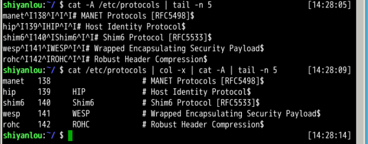
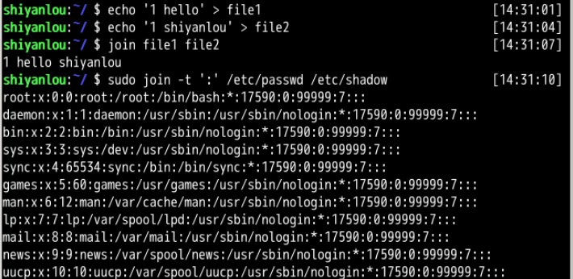
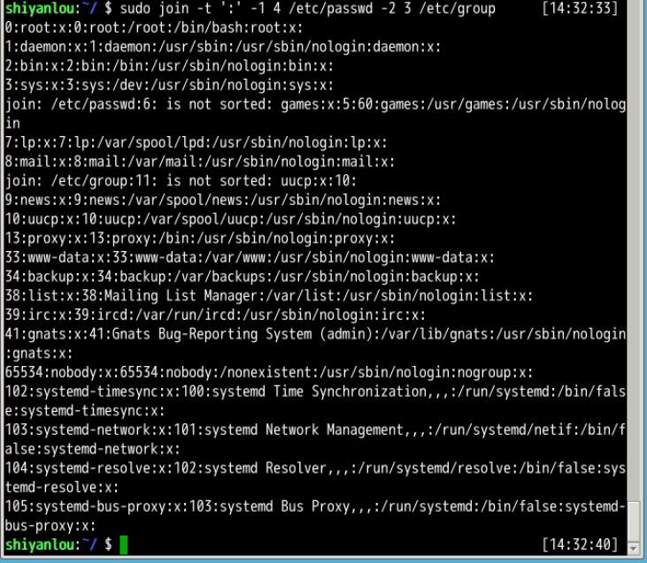

# 文本处理命令
[[TOC]]
##  tr 命令

tr 命令可以用来删除一段文本信息中的某些文字。或者将其进行转换。

### 使用方式

```bash
tr [option]...SET1 [SET2]
```

#### 常用的选项有

| 选项 | 说明                                                         |
| ---- | ------------------------------------------------------------ |
| `-d` | 删除和 set1 匹配的字符，注意不是全词匹配也不是按字符顺序匹配 |
| `-s` | 去除 set1 指定的在输入文本中连续并重复的字符                 |

#### 操作举例

```bash
# 删除 "hello shiyanlou" 中所有的'o'，'l'，'h'
$ echo 'hello shiyanlou' | tr -d 'olh'
# 将"hello" 中的ll，去重为一个l
$ echo 'hello' | tr -s 'l'
# 将输入文本，全部转换为大写或小写输出
$ echo 'input some text here' | tr '[:lower:]' '[:upper:]'
# 上面的'[:lower:]' '[:upper:]'你也可以简单的写作'[a-z]' '[A-Z]'，当然反过来将大写变小写也是可以的
```


更多 tr 的使用，你可以使用`--help`或者`man tr`获得。

##  col 命令

col 命令可以将`Tab`换成对等数量的空格键，或反转这个操作。

### 使用方式

```bash
col [option]
```

#### 常用的选项有

| 选项 | 说明                          |
| ---- | ----------------------------- |
| `-x` | 将`Tab`转换为空格             |
| `-h` | 将空格转换为`Tab`（默认选项） |

#### 操作举例

```bash
# 查看 /etc/protocols 中的不可见字符，可以看到很多 ^I ，这其实就是 Tab 转义成可见字符的符号
cat -A /etc/protocols
# 使用 col -x 将 /etc/protocols 中的 Tab 转换为空格，然后再使用 cat 查看，你发现 ^I 不见了
cat /etc/protocols | col -x | cat -A
```



##  join 命令

学过数据库的用户对这个应该不会陌生，这个命令就是用于将两个文件中包含相同内容的那一行合并在一起。

### 使用方式

```bash
join [option]... file1 file2
```

### 常用的选项有

| 选项 | 说明                                                 |
| ---- | ---------------------------------------------------- |
| `-t` | 指定分隔符，默认为空格                               |
| `-i` | 忽略大小写的差异                                     |
| `-1` | 指明第一个文件要用哪个字段来对比，默认对比第一个字段 |
| `-2` | 指明第二个文件要用哪个字段来对比，默认对比第一个字段 |

### 操作举例

```bash
cd /home/shiyanlou
# 创建两个文件
echo '1 hello' > file1
echo '1 shiyanlou' > file2
join file1 file2
# 将 /etc/passwd 与 /etc/shadow 两个文件合并，指定以':'作为分隔符
sudo join -t':' /etc/passwd /etc/shadow
# 将 /etc/passwd 与 /etc/group 两个文件合并，指定以':'作为分隔符，分别比对第4和第3个字段
sudo join -t':' -1 4 /etc/passwd -2 3 /etc/group
```

 



##   paste 命令

`paste`这个命令与`join` 命令类似，它是在不对比数据的情况下，简单地将多个文件合并一起，以`Tab`隔开。

### 使用方式

```bash
paste [option] file...
```

### 常用的选项有

| 选项 | 说明                         |
| ---- | ---------------------------- |
| `-d` | 指定合并的分隔符，默认为 Tab |
| `-s` | 不合并到一行，每个文件为一行 |

### 操作举例

```bash
echo hello > file1
echo shiyanlou > file2
echo www.shiyanlou.com > file3
paste -d ':' file1 file2 file3
paste -s file1 file2 file3
```

