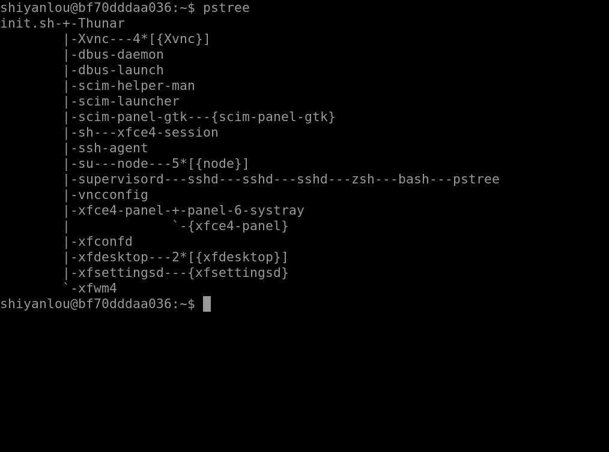
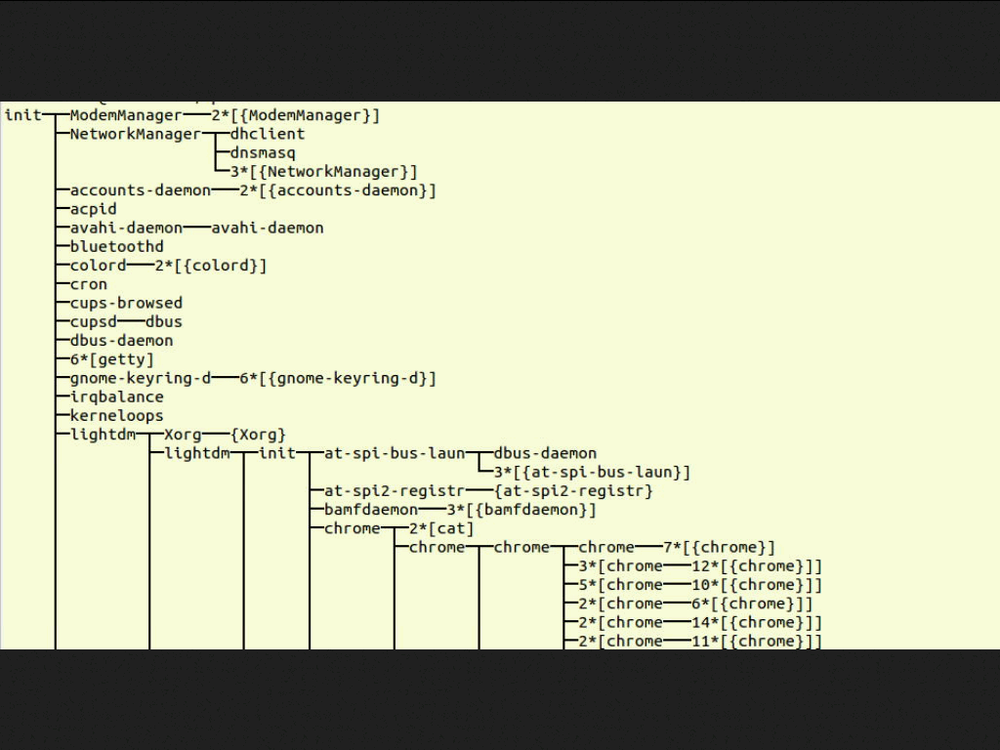
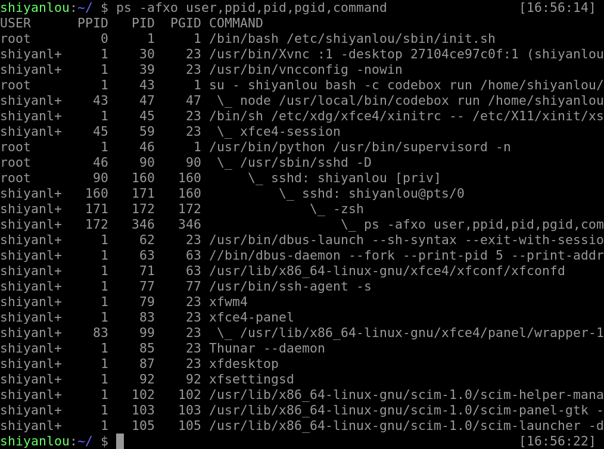
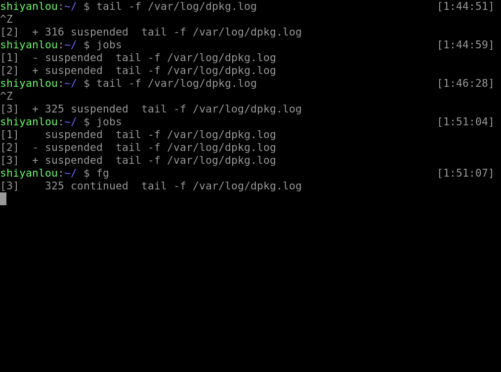

# Linux进程概念

[[TOC]]

## 概念的理解

首先程序与进程是什么？程序与进程又有什么区别？

> **程序**（procedure）：不太精确地说，程序就是执行一系列有逻辑、有顺序结构的指令，帮我们达成某个结果。就如我们去餐馆，给服务员说我要牛肉盖浇饭，她执行了做牛肉盖浇饭这么一个程序，最后我们得到了这么一盘牛肉盖浇饭。它需要去执行，不然它就像一本武功秘籍，放在那里等人翻看。

> **进程**（process）：进程是程序在一个数据集合上的一次执行过程，在早期的 UNIX、Linux 2.4 及更早的版本中，它是系统进行资源分配和调度的独立基本单位。同上一个例子，就如我们去了餐馆，给服务员说我要牛肉盖浇饭，她执行了做牛肉盖浇饭这么一个程序，而里面做饭的是一个进程，做牛肉汤汁的是一个进程，把牛肉汤汁与饭混合在一起的是一个进程，把饭端上桌的是一个进程。它就像是我们在看武功秘籍这么一个过程，然后一个篇章一个篇章地去练。

简单来说，程序是为了完成某种任务而设计的软件，比如 vim 是程序。什么是进程呢？进程就是运行中的程序。

程序只是一些列指令的集合，是一个静止的实体，而进程不同，进程有以下的特性：

- 动态性：进程的实质是一次程序执行的过程，有创建、撤销等状态的变化。而程序是一个静态的实体。
- 并发性：进程可以做到在一个时间段内，有多个程序在运行中。程序只是静态的实体，所以不存在并发性。
- 独立性：进程可以独立分配资源，独立接受调度，独立地运行。
- 异步性：进程以不可预知的速度向前推进。
- 结构性：进程拥有代码段、数据段、PCB（进程控制块，进程存在的唯一标志）。也正是因为有结构性，进程才可以做到独立地运行。

> **并发：**在一个时间段内，宏观来看有多个程序都在活动，有条不紊的执行（每一瞬间只有一个在执行，只是在一段时间有多个程序都执行过）

> **并行：**在每一个瞬间，都有多个程序都在同时执行，这个必须有多个 CPU 才行

引入进程是因为传统意义上的程序已经不足以描述 OS 中各种活动之间的动态性、并发性、独立性还有相互制约性。程序就像一个公司，只是一些证书，文件的堆积（静态实体）。而当公司运作起来就有各个部门的区分，财务部，技术部，销售部等等，就像各个进程，各个部门之间可以独立运作，也可以有交互（独立性、并发性）。

而随着程序的发展越做越大，又会继续细分，从而引入了线程的概念，当代多数操作系统、Linux 2.6 及更新的版本中，进程本身不是基本运行单位，而是线程的容器。就像上述所说的，每个部门又会细分为各个工作小组（线程），而工作小组需要的资源需要向上级（进程）申请。

> **线程**（thread）是操作系统能够进行运算调度的最小单位。它被包含在进程之中，是进程中的实际运作单位。一条线程指的是进程中一个单一顺序的控制流，一个进程中可以并发多个线程，每条线程并行执行不同的任务。因为线程中几乎不包含系统资源，所以执行更快、更有效率。

简而言之，一个程序至少有一个进程，一个进程至少有一个线程。线程的划分尺度小于进程，使得多线程程序的并发性高。另外，进程在执行过程中拥有独立的内存单元，而多个线程共享内存，从而极大地提高了程序的运行效率。就如下图所示：


## 进程的属性

### 进程的分类

大概明白进程是个什么样的存在后，我们需要进一步了解的就是进程分类。可以从两个角度来分：

- 以进程的功能与服务的对象来分；
- 以应用程序的服务类型来分；

第一个角度来看，我们可以分为用户进程与系统进程：

- 用户进程：通过执行用户程序、应用程序或称之为内核之外的系统程序而产生的进程，此类进程可以在用户的控制下运行或关闭。
- 系统进程：通过执行系统内核程序而产生的进程，比如可以执行内存资源分配和进程切换等相对底层的工作；而且该进程的运行不受用户的干预，即使是 root 用户也不能干预系统进程的运行。

第二角度来看，我们可以将进程分为交互进程、批处理进程、守护进程：

- 交互进程：由一个 shell 终端启动的进程，在执行过程中，需要与用户进行交互操作，可以运行于前台，也可以运行在后台。
- 批处理进程：该进程是一个进程集合，负责按顺序启动其他的进程。
- 守护进程：守护进程是一直运行的一种进程，在 Linux 系统启动时启动，在系统关闭时终止。它们独立于控制终端并且周期性的执行某种任务或等待处理某些发生的事件。例如 httpd 进程，一直处于运行状态，等待用户的访问。还有经常用的 cron（在 centOS 系列为 crond）进程，这个进程为 crontab 的守护进程，可以周期性的执行用户设定的某些任务。

###  进程的衍生

进程有这么多的种类，那么进程之间定是有相关性的，而这些有关联性的进程又是如何产生的，如何衍生的？

就比如我们启动了终端，就是启动了一个 bash 进程，我们可以在 bash 中再输入 bash 则会再启动一个 bash 的进程，此时第二个 bash 进程就是由第一个 bash 进程创建出来的，他们之间又是个什么关系？

我们一般称呼第一个 bash 进程是第二 bash 进程的父进程，第二 bash 进程是第一个 bash 进程的子进程，这层关系是如何得来的呢？

关于父进程与子进程便会提及这两个系统调用 `fork()` 与 `exec()`

> **fork-exec**是由 Dennis M. Ritchie 创造的

> **fork()** 是一个系统调用（system call），它的主要作用就是为当前的进程创建一个新的进程，这个新的进程就是它的子进程，这个子进程除了父进程的返回值和 PID 以外其他的都一模一样，如进程的执行代码段，内存信息，文件描述，寄存器状态等等

> **exec()** 也是系统调用，作用是切换子进程中的执行程序也就是替换其从父进程复制过来的代码段与数据段

子进程就是父进程通过系统调用 `fork()` 而产生的复制品，`fork()` 就是把父进程的 PCB 等进程的数据结构信息直接复制过来，只是修改了 PID，所以一模一样，只有在执行 `exec()` 之后才会不同，而早先的 `fork()` 比较消耗资源后来进化成 `vfork()`，效率高了不少，感兴趣的同学可以查查为什么。

这就是子进程产生的由来。简单的实现逻辑就如下方所示：

```c
pid_t p;

p = fork();
if (p == (pid_t) -1)
        /* ERROR */
else if (p == 0)
        /* CHILD */
else
        /* PARENT */
```

既然子进程是通过父进程而衍生出来的，那么子进程的退出与资源的回收定然与父进程有很大的相关性。当一个子进程要正常的终止运行时，或者该进程结束时它的主函数 `main()` 会执行 `exit(n);` 或者 `return n`，这里的返回值 n 是一个信号，系统会把这个 SIGCHLD 信号传给其父进程，当然若是异常终止也往往是因为这个信号。

在将要结束时的子进程代码执行部分已经结束执行了，系统的资源也基本归还给系统了，但若是其进程的进程控制块（PCB）仍驻留在内存中，而它的 PCB 还在，代表这个进程还存在（因为 PCB 就是进程存在的唯一标志，里面有 PID 等消息），并没有消亡，这样的进程称之为僵尸进程（Zombie）。

如图中第四列标题是 S，S 表示的是进程的状态，而在下属的第三行的 Z 表示的是 Zombie 的意思。（ ps 命令将在后续详解）


正常情况下，父进程会收到两个返回值：exit code（SIGCHLD 信号）与 `reason for termination` 。之后，父进程会使用 `wait(&status)` 系统调用以获取子进程的退出状态，然后内核就可以从内存中释放已结束的子进程的 PCB；而如若父进程没有这么做的话，子进程的 PCB 就会一直驻留在内存中，一直留在系统中成为僵尸进程（Zombie）。

虽然僵尸进程是已经放弃了几乎所有内存空间，没有任何可执行代码，也不能被调度，在进程列表中保留一个位置，记载该进程的退出状态等信息供其父进程收集，从而释放它。但是 Linux 系统中能使用的 PID 是有限的，如果系统中存在有大量的僵尸进程，系统将会因为没有可用的 PID 从而导致不能产生新的进程。

另外如果父进程结束（非正常的结束），未能及时收回子进程，子进程仍在运行，这样的子进程称之为孤儿进程。在 Linux 系统中，孤儿进程一般会被 init 进程所“收养”，成为 init 的子进程。由 init 来做善后处理，所以它并不至于像僵尸进程那样无人问津，不管不顾，大量存在会有危害。

进程 0 是系统引导时创建的一个特殊进程，也称之为内核初始化，其最后一个动作就是调用 `fork()` 创建出一个子进程运行 `/sbin/init` 可执行文件，而该进程就是 PID=1 的进程 1，而进程 0 就转为交换进程（也被称为空闲进程），进程 1 （init 进程）是第一个用户态的进程，再由它不断调用 fork() 来创建系统里其他的进程，所以它是所有进程的父进程或者祖先进程。同时它是一个守护程序，直到计算机关机才会停止。

通过以下的命令我们可以很明显的看到这样的结构

```bash
pstree
```



或者从此图我们可以更加形象的看清子父进程的关系



通过以上的显示结果我们可以看的很清楚，init 为所有进程的父进程或者说是祖先进程

我们还可以使用这样一个命令来看，其中 pid 就是该进程的一个唯一编号，ppid 就是该进程的父进程的 pid，command 表示的是该进程通过执行什么样的命令或者脚本而产生的

```bash
ps －fxo user,ppid,pid,pgid,command
```



可以在图中看见我们执行的 ps 就是由 zsh 通过 fork-exec 创建的子进程而执行的

使用这样的一个命令我们也能清楚的看见 init 如上文所说是由进程 0 这个初始化进程来创建出来的子进程，而其他的进程基本是由 init 创建的子进程，或者是由它的子进程创建出来的子进程。所以 init 是用户进程的第一个进程也是所有用户进程的父进程或者祖先进程。（ps 命令将在后续课程详解）

就像一个树状图，而 init 进程就是这棵树的根，其他进程由根不断的发散，开枝散叶

###  进程组与 Sessions

每一个进程都会是一个进程组的成员，而且这个进程组是唯一存在的，他们是依靠 PGID（process group ID）来区别的，而每当一个进程被创建的时候，它便会成为其父进程所在组中的一员。

一般情况，进程组的 PGID 等同于进程组的第一个成员的 PID，并且这样的进程称为该进程组的领导者，也就是领导进程，进程一般通过使用 `getpgrp()` 系统调用来寻找其所在组的 PGID，领导进程可以先终结，此时进程组依然存在，并持有相同的 PGID，直到进程组中最后一个进程终结。

与进程组类似，每当一个进程被创建的时候，它便会成为其父进程所在 Session 中的一员，每一个进程组都会在一个 Session 中，并且这个 Session 是唯一存在的，

Session 主要是针对一个 tty 建立，Session 中的每个进程都称为一个工作(job)。每个会话可以连接一个终端(control terminal)。当控制终端有输入输出时，都传递给该会话的前台进程组。Session 意义在于将多个 jobs 囊括在一个终端，并取其中的一个 job 作为前台，来直接接收该终端的输入输出以及终端信号。 其他 jobs 在后台运行。

> **前台**（foreground）就是在终端中运行，能与你有交互的

> **后台**（background）就是在终端中运行，但是你并不能与其任何的交互，也不会显示其执行的过程

###  工作管理

bash(Bourne-Again shell)支持工作控制（job control），而 sh（Bourne shell）并不支持。

并且每个终端或者说 bash 只能管理当前终端中的 job，不能管理其他终端中的 job。比如我当前存在两个 bash 分别为 bash1、bash2，bash1 只能管理其自己里面的 job 并不能管理 bash2 里面的 job

我们都知道当一个进程在前台运作时我们可以用 `ctrl + c` 来终止它，但是若是在后台的话就不行了。

我们可以通过 `&` 这个符号，让我们的命令在后台中运行：

```bash
ls &
```


图中所显示的 `[1] 236`分别是该 job 的 job number 与该进程的 PID，而最后一行的 Done 表示该命令已经在后台执行完毕。

我们还可以通过 `ctrl + z` 使我们的当前工作停止并丢到后台中去


被停止并放置在后台的工作我们可以使用这个命令来查看：

```bash
jobs
```


其中第一列显示的为被放置后台 job 的编号，而第二列的 `＋` 表示最近(刚刚、最后)被放置后台的 job，同时也表示预设的工作，也就是若是有什么针对后台 job 的操作，首先对预设的 job，`-` 表示倒数第二（也就是在预设之前的一个）被放置后台的工作，倒数第三个（再之前的）以后都不会有这样的符号修饰，第三列表示它们的状态，而最后一列表示该进程执行的命令。

我们可以通过这样的一个命令将后台的工作拿到前台来：

```bash
# 后面不加参数提取预设工作，加参数提取指定工作的编号
# ubuntu 在 zsh 中需要 %，在 bash 中不需要 %
fg [%jobnumber]
```




之前我们通过 `ctrl + z` 使得工作停止放置在后台，若是我们想让其在后台运作我们就使用这样一个命令：

```bash
#与fg类似，加参则指定，不加参则取预设
bg [%jobnumber]
```


既然有方法将被放置在后台的工作提至前台或者让它从停止变成继续运行在后台，当然也有方法删除一个工作，或者重启等等。

```bash
# kill的使用格式如下
kill -signal %jobnumber

# signal从1-64个信号值可以选择，可以这样查看
kill －l
```

其中常用的有这些信号值

| 信号值 | 作用                             |
| ------ | -------------------------------- |
| -1     | 重新读取参数运行，类似与 restart |
| -2     | 如同 ctrl+c 的操作退出           |
| -9     | 强制终止该任务                   |
| -15    | 正常的方式终止该任务             |


> 若是在使用 kill ＋信号值然后直接加 pid，你将会对 pid 对应的进程进行操作。

> 若是在使用 kill+信号值然后 `％jobnumber`，这时所操作的对象是 job，这个数字就是就当前 bash 中后台的运行的 job 的 ID。