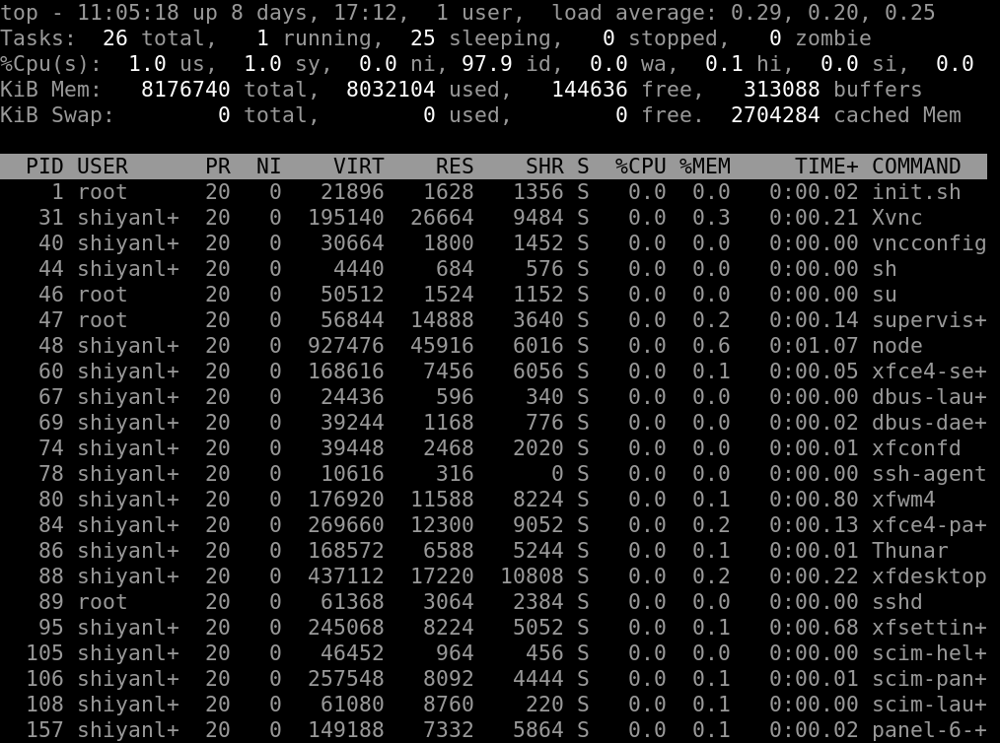
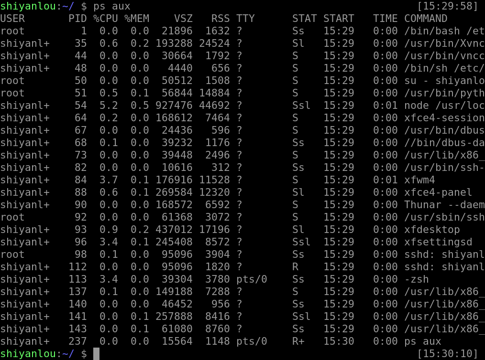
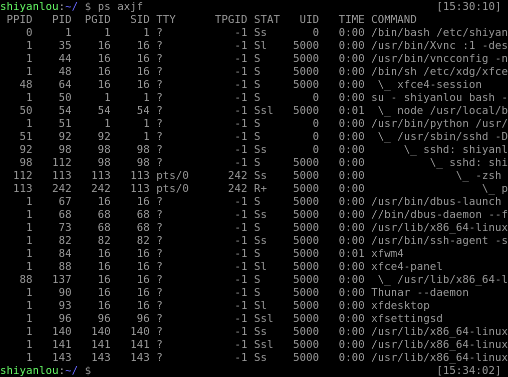
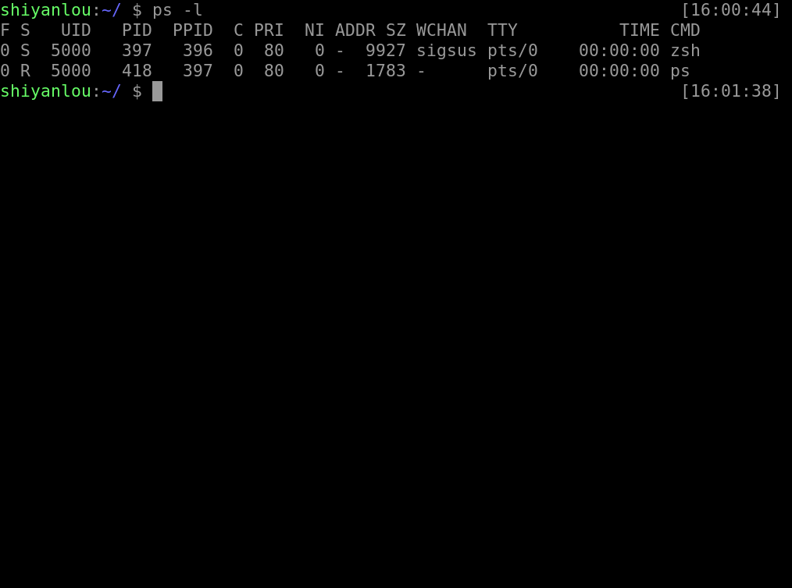
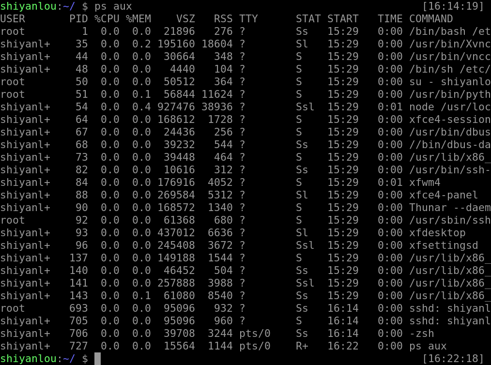
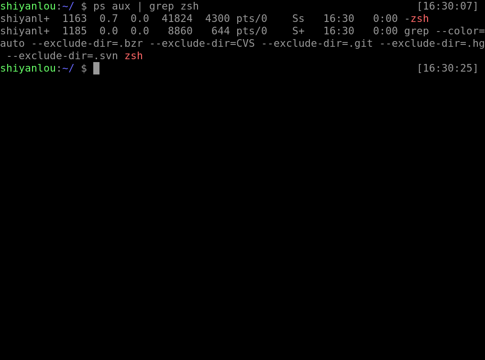
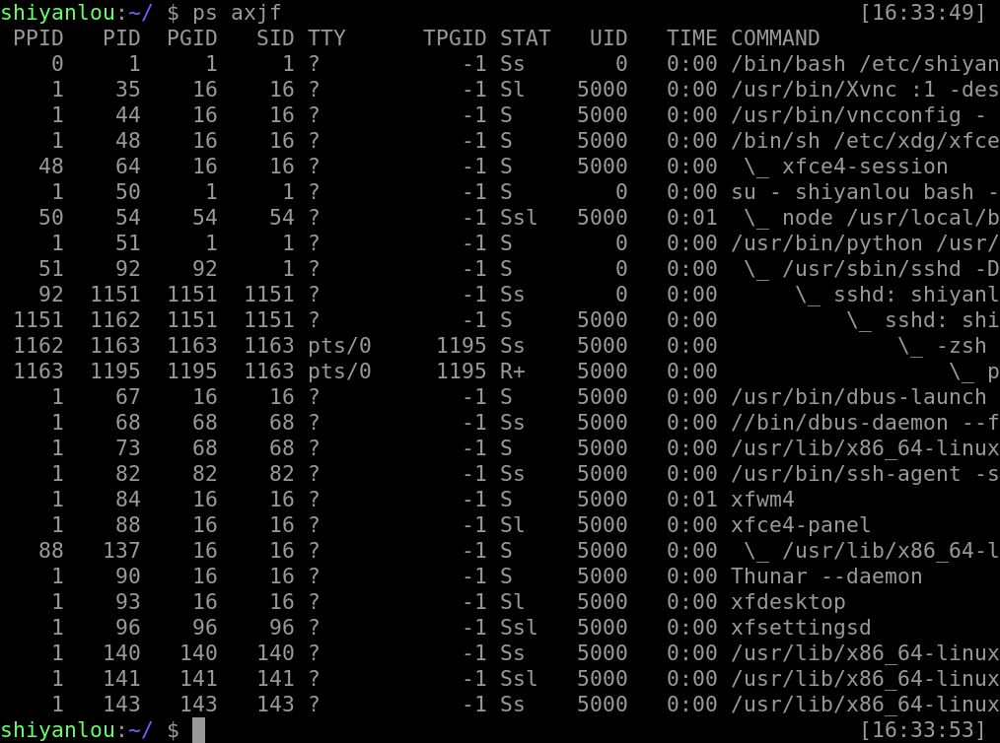
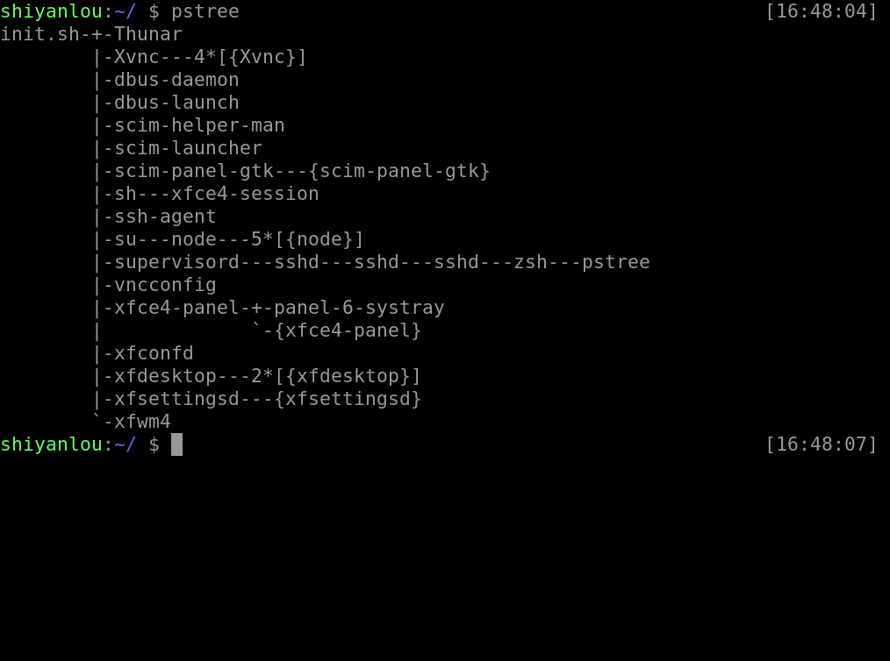
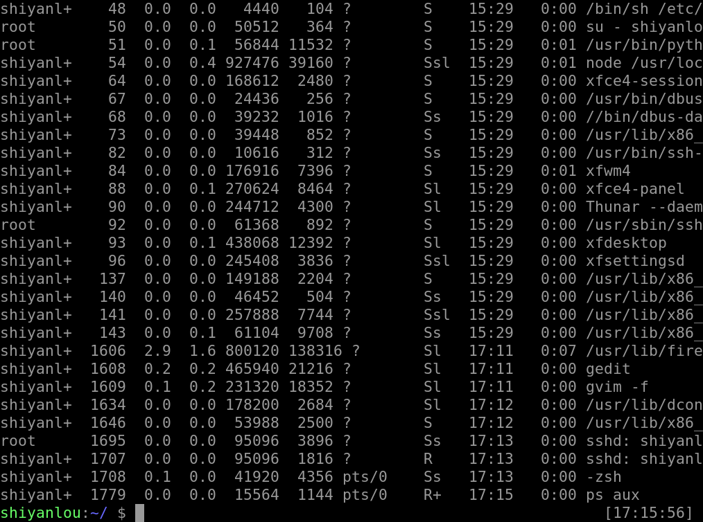

# Linux进程管理
[[TOC]]


## 进程的查看

不管在测试的时候、在实际的生产环境中，还是自己的使用过程中，难免会遇到一些进程异常的情况，所以 Linux 为我们提供了一些工具来查看进程的状态信息。我们可以通过 `top` 实时的查看进程的状态，以及系统的一些信息（如 CPU、内存信息等），我们还可以通过 `ps` 来静态查看当前的进程信息，同时我们还可以使用 `pstree` 来查看当前活跃进程的树形结构。

### top 工具的使用

`top` 工具是我们常用的一个查看工具，能实时的查看我们系统的一些关键信息的变化:

```bash
top
```



top 是一个在前台执行的程序，所以执行后便进入到这样的一个交互界面，正是因为交互界面我们才可以实时的获取到系统与进程的信息。在交互界面中我们可以通过一些指令来操作和筛选。在此之前我们先来了解显示了哪些信息。

我们看到 top 显示的第一排，

| 内容                         | 解释                                    |
| ---------------------------- | --------------------------------------- |
| top                          | 表示当前程序的名称                      |
| 11:05:18                     | 表示当前的系统的时间                    |
| up 8 days,17:12              | 表示该机器已经启动了多长时间            |
| 1 user                       | 表示当前系统中只有一个用户              |
| load average: 0.29,0.20,0.25 | 分别对应 1、5、15 分钟内 cpu 的平均负载 |

load average 在 wikipedia 中的解释是 the system load is a measure of the amount of work that a computer system is doing 也就是对当前 CPU 工作量的度量，具体来说也就是指运行队列的平均长度，也就是等待 CPU 的平均进程数相关的一个计算值。

我们该如何看待这个 load average 数据呢？

假设我们的系统是单 CPU、单内核的，把它比喻成是一条单向的桥，把 CPU 任务比作汽车。

- load = 0 的时候意味着这个桥上并没有车，cpu 没有任何任务；
- load < 1 的时候意味着桥上的车并不多，一切都还是很流畅的，cpu 的任务并不多，资源还很充足；
- load = 1 的时候就意味着桥已经被车给占满了，没有一点空隙，cpu 已经在全力工作了，所有的资源都被用完了，当然还好，这还在能力范围之内，只是有点慢而已；
- load > 1 的时候就意味着不仅仅是桥上已经被车占满了，就连桥外都被占满了，cpu 已经在全力工作，系统资源的用完了，但是还是有大量的进程在请求，在等待。若是这个值大于 2 表示进程请求超过 CPU 工作能力的 2 倍。而若是这个值大于 5 说明系统已经在超负荷运作了。

这是单个 CPU 单核的情况，而实际生活中我们需要将得到的这个值除以我们的核数来看。我们可以通过以下的命令来查看 CPU 的个数与核心数：

```bash
#查看物理 CPU 的个数
cat /proc/cpuinfo | grep "physical id" | sort | uniq |wc -l

#每个 cpu 的核心数
cat /proc/cpuinfo | grep "physical id" | grep "0" | wc -l
```

通过上面的指数我们可以得知 load 的临界值为 1 ，但是在实际生活中，比较有经验的运维或者系统管理员会将临界值定为 0.7。这里的指数都是除以核心数以后的值，不要混淆了

- 若是 load < 0.7 并不会去关注他；
- 若是 0.7< load < 1 的时候我们就需要稍微关注一下了，虽然还可以应付但是这个值已经离临界不远了；
- 若是 load = 1 的时候我们就需要警惕了，因为这个时候已经没有更多的资源的了，已经在全力以赴了；
- 若是 load > 5 的时候系统已经快不行了，这个时候你需要加班解决问题了

通常我们都会先看 15 分钟的值来看这个大体的趋势，然后再看 5 分钟的值对比来看是否有下降的趋势。

查看 busybox 的代码可以知道，数据是每 5 秒钟就检查一次活跃的进程数，然后计算出该值，然后 load 从 `/proc/loadavg` 中读取的。而这个 load 的值是如何计算的呢，这是 load 的计算的源码

```c
#define FSHIFT      11          /* nr of bits of precision */
#define FIXED_1     (1<<FSHIFT) /* 1.0 as fixed-point(定点) */
#define LOAD_FREQ   (5*HZ)      /* 5 sec intervals，每隔5秒计算一次平均负载值 */
#define CALC_LOAD(load, exp, n)     \
         load *= exp;               \
         load += n*(FIXED_1 - exp); \
         load >>= FSHIFT;

unsigned long avenrun[3];

EXPORT_SYMBOL(avenrun);

/*
* calc_load - given tick count, update the avenrun load estimates.
* This is called while holding a write_lock on xtime_lock.
*/
static inline void calc_load(unsigned long ticks)
{
        unsigned long active_tasks; /* fixed-point */
        static int count = LOAD_FREQ;
        count -= ticks;
        if (count < 0) {
                count += LOAD_FREQ;
                active_tasks = count_active_tasks();
                CALC_LOAD(avenrun[0], EXP_1, active_tasks);
                CALC_LOAD(avenrun[1], EXP_5, active_tasks);
                CALC_LOAD(avenrun[2], EXP_15, active_tasks);
        }
}
```

> 有兴趣的朋友可以研究一下，是如何计算的。代码中的后面这部分相当于它的计算公式。

我们回归正题，来看 top 的第二行数据，基本上第二行是进程的一个情况统计：

| 内容            | 解释                 |
| --------------- | -------------------- |
| Tasks: 26 total | 进程总数             |
| 1 running       | 1 个正在运行的进程数 |
| 25 sleeping     | 25 个睡眠的进程数    |
| 0 stopped       | 没有停止的进程数     |
| 0 zombie        | 没有僵尸进程数       |

来看 top 的第三行数据，这一行基本上是 CPU 的一个使用情况的统计了：

| 内容             | 解释                                                         |
| ---------------- | ------------------------------------------------------------ |
| `Cpu(s): 1.0%us` | 用户空间进程占用 CPU 百分比                                  |
| `1.0% sy`        | 内核空间运行占用 CPU 百分比                                  |
| `0.0%ni`         | 用户进程空间内改变过优先级的进程占用 CPU 百分比              |
| `97.9%id`        | 空闲 CPU 百分比                                              |
| `0.0%wa`         | 等待输入输出的 CPU 时间百分比                                |
| `0.1%hi`         | 硬中断(Hardware IRQ)占用 CPU 的百分比                        |
| `0.0%si`         | 软中断(Software IRQ)占用 CPU 的百分比                        |
| `0.0%st`         | (Steal time) 是 hypervisor 等虚拟服务中，虚拟 CPU 等待实际 CPU 的时间的百分比 |

CPU 利用率是对一个时间段内 CPU 使用状况的统计，通过这个指标可以看出在某一个时间段内 CPU 被占用的情况，而 Load Average 是 CPU 的 Load，它所包含的信息不是 CPU 的使用率状况，而是在一段时间内 CPU 正在处理以及等待 CPU 处理的进程数情况统计信息，这两个指标并不一样。

来看 top 的第四行数据，这一行基本上是内存的一个使用情况的统计了：

| 内容           | 解释                 |
| -------------- | -------------------- |
| 8176740 total  | 物理内存总量         |
| 8032104 used   | 使用的物理内存总量   |
| 144636 free    | 空闲内存总量         |
| 313088 buffers | 用作内核缓存的内存量 |

**注意：**

> 系统中可用的物理内存最大值并不是 free 这个单一的值，而是 free + buffers + swap 中的 cached 的和。

来看 top 的第五行数据，这一行基本上是交换区的一个使用情况的统计了：

| 内容   | 解释                                                         |
| ------ | ------------------------------------------------------------ |
| total  | 交换区总量                                                   |
| used   | 使用的交换区总量                                             |
| free   | 空闲交换区总量                                               |
| cached | 缓冲的交换区总量，内存中的内容被换出到交换区，而后又被换入到内存，但使用过的交换区尚未被覆盖 |

再下面就是进程的一个情况了

| 列名    | 解释                                         |
| ------- | -------------------------------------------- |
| PID     | 进程 id                                      |
| USER    | 该进程的所属用户                             |
| PR      | 该进程执行的优先级 priority 值               |
| NI      | 该进程的 nice 值                             |
| VIRT    | 该进程任务所使用的虚拟内存的总数             |
| RES     | 该进程所使用的物理内存数，也称之为驻留内存数 |
| SHR     | 该进程共享内存的大小                         |
| S       | 该进程进程的状态: S=sleep R=running Z=zombie |
| %CPU    | 该进程 CPU 的利用率                          |
| %MEM    | 该进程内存的利用率                           |
| TIME+   | 该进程活跃的总时间                           |
| COMMAND | 该进程运行的名字                             |

**注意:**

**NICE 值**叫做静态优先级，是用户空间的一个优先级值，其取值范围是 -20 至 19。这个值越小，表示进程”优先级”越高，而值越大“优先级”越低。nice 值中的 -20 到 19，中 -20 优先级最高， 0 是默认的值，而 19 优先级最低。

**PR 值**表示 Priority 值叫动态优先级，是进程在内核中实际的优先级值，进程优先级的取值范围是通过一个宏定义的，这个宏的名称是 `MAX_PRIO`，它的值为 140。Linux 实际上实现了 140 个优先级范围，取值范围是从 `0-139`，这个值越小，优先级越高。而这其中的 `0-99` 是实时进程的值，而 `100-139` 是给用户的。

其中 PR 中的 `100 to 139` 值部分有这么一个对应 `PR = 20 + (-20 to +19)`，这里的 `-20 to +19` 便是 nice 值，所以说两个虽然都是优先级，而且有千丝万缕的关系，但是他们的值，他们的作用范围并不相同。

**VIRT** 任务所使用的虚拟内存的总数，其中包含所有的代码，数据，共享库和被换出 swap 空间的页面等所占据空间的总数。

在上文我们曾经说过 top 是一个前台程序，所以是一个可以交互的：

| 常用交互命令 | 解释                                                         |
| ------------ | ------------------------------------------------------------ |
| q            | 退出程序                                                     |
| I            | 切换显示平均负载和启动时间的信息                             |
| P            | 根据 CPU 使用百分比大小进行排序                              |
| M            | 根据驻留内存大小进行排序                                     |
| i            | 忽略闲置和僵死的进程，这是一个开关式命令                     |
| k            | 终止一个进程，系统提示输入 PID 及发送的信号值。一般终止进程用 15 信号，不能正常结束则使用 9 信号。安全模式下该命令被屏蔽。 |

好好的利用 top 能够很有效的帮助我们观察到系统的瓶颈所在，或者是系统的问题所在。

###  ps 工具的使用

ps 也是我们最常用的查看进程的工具之一，我们通过这样的一个命令来了解一下，它能给我们带来哪些信息：

```bash
ps aux
```



```bash
ps axjf
```



我们来总体了解下会出现哪些信息给我们，这些信息又代表着什么（更多的 keywords 大家可以通过 `man ps` 了解）。

| 内容        | 解释                                                         |
| ----------- | ------------------------------------------------------------ |
| `F`         | 进程的标志（process flags），当 flags 值为 1 则表示此子程序只是 fork 但没有执行 exec，为 4 表示此程序使用超级管理员 root 权限 |
| `USER`      | 进程的拥有用户                                               |
| `PID`       | 进程的 ID                                                    |
| `PPID`      | 其父进程的 PID                                               |
| `SID`       | session 的 ID                                                |
| `TPGID`     | 前台进程组的 ID                                              |
| `%CPU`      | 进程占用的 CPU 百分比                                        |
| `%MEM`      | 占用内存的百分比                                             |
| `NI`        | 进程的 NICE 值                                               |
| `VSZ`       | 进程使用虚拟内存大小                                         |
| `RSS`       | 驻留内存中页的大小                                           |
| `TTY`       | 终端 ID                                                      |
| `S or STAT` | 进程状态                                                     |
| `WCHAN`     | 正在等待的进程资源                                           |
| `START`     | 启动进程的时间                                               |
| `TIME`      | 进程消耗 CPU 的时间                                          |
| `COMMAND`   | 命令的名称和参数                                             |

> **TPGID**栏写着-1 的都是没有控制终端的进程，也就是守护进程

> **STAT**表示进程的状态，而进程的状态有很多，如下表所示

| 状态 | 解释                               |
| ---- | ---------------------------------- |
| `R`  | Running.运行中                     |
| `S`  | Interruptible Sleep.等待调用       |
| `D`  | Uninterruptible Sleep.不可中断睡眠 |
| `T`  | Stoped.暂停或者跟踪状态            |
| `X`  | Dead.即将被撤销                    |
| `Z`  | Zombie.僵尸进程                    |
| `W`  | Paging.内存交换                    |
| `N`  | 优先级低的进程                     |
| `<`  | 优先级高的进程                     |
| `s`  | 进程的领导者                       |
| `L`  | 锁定状态                           |
| `l`  | 多线程状态                         |
| `+`  | 前台进程                           |

> 其中的 D 是不能被中断睡眠的状态，处在这种状态的进程不接受外来的任何 signal，所以无法使用 kill 命令杀掉处于 D 状态的进程，无论是 `kill`，`kill -9` 还是 `kill -15`，一般处于这种状态可能是进程 I/O 的时候出问题了。

ps 工具有许多的参数，下面给大家解释部分常用的参数。

使用 `-l` 参数可以显示自己这次登录的 bash 相关的进程信息罗列出来：

```bash
ps -l
```



相对来说我们更加常用下面这个命令，他将会罗列出所有的进程信息：

```bash
ps aux
```



若是查找其中的某个进程的话，我们还可以配合着 `grep` 和正则表达式一起使用：

```bash
ps aux | grep zsh
```



此外我们还可以查看时，将连同部分的进程呈树状显示出来：

```bash
ps axjf
```



当然如果你觉得使用这样的此时没有把你想要的信息放在一起，我们也可以是用这样的命令，来自定义我们所需要的参数显示：

```bash
ps -afxo user,ppid,pid,pgid,command
```


这是一个简单而又实用的工具，想要更灵活的使用，想要知道更多的参数我们可以使用 man 来获取更多相关的信息。

### pstree 工具的使用

通过 `pstree` 可以很直接的看到相同的进程数量，最主要的还是我们可以看到所有进程之间的相关性。

```bash
pstree
```



```bash
pstree -up
```

| 参数选择 | 解释                                |
| -------- | ----------------------------------- |
| -A       | 程序树之间以 ASCII 字符连接         |
| -p       | 同时列出每个 process 的 PID         |
| -u       | 同时列出每个 process 的所属账户名称 |


## 进程的管理

###  kill 命令的掌握

上个实验中我们讲诉了进程之间是如何衍生，之间又有什么相关性，我们来回顾一下，当一个进程结束的时候或者要异常结束的时候，会向其父进程返回一个或者接收一个 SIGHUP 信号而做出的结束进程或者其他的操作，这个 SIGHUP 信号不仅可以由系统发送，我们可以使用 `kill` 来发送这个信号来操作进程的结束或者重启等等。

上节课程我们使用 `kill` 命令来管理我们的一些 job，这节课我们将尝试用 `kill` 来操作下一些不属于 job 范畴的进程，直接对 pid 下手。

```bash
# 首先我们使用图形界面打开了 gedit、gvim，用 ps 可以查看到
ps aux

# 使用 9 这个信号强制结束 gedit 进程
kill -9 1608

# 我们再查找这个进程的时候就找不到了
ps aux | grep gedit
```




### 进程的执行顺序

我们在使用 ps 命令的时候可以看到大部分的进程都是处于休眠的状态，如果这些进程都被唤醒，那么该谁最先享受 CPU 的服务，后面的进程又该是一个什么样的顺序呢？进程调度的队列又该如何去排列呢？

当然就是靠该进程的优先级值来判定进程调度的优先级，而优先级的值就是上文所提到的 PR 与 nice 来控制与体现了

而 nice 的值我们是可以通过 nice 命令来修改的，而需要注意的是 nice 值可以调整的范围是 `-20 ~ 19`，其中 root 有着至高无上的权力，既可以调整自己的进程也可以调整其他用户的程序，并且是所有的值都可以用，而普通用户只可以调制属于自己的进程，并且其使用的范围只能是 `0 ~ 19`，因为系统为了避免一般用户抢占系统资源而设置的一个限制

```bash
# 这个实验在环境中无法做，因为权限不够，可以自己在本地尝试

# 打开一个程序放在后台，或者用图形界面打开
nice -n -5 vim &

# 用 ps 查看其优先级
ps -afxo user,ppid,pid,stat,pri,ni,time,command | grep vim
```

我们还可以用 renice 来修改已经存在的进程的优先级，同样因为权限的原因在实验环境中无法尝试。

```bash
renice -5 pid
```