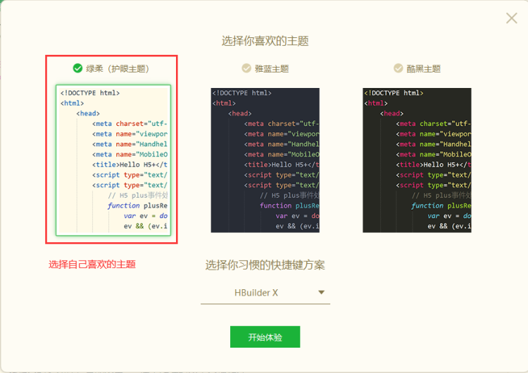
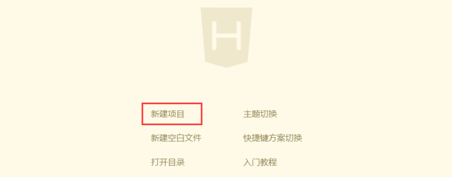
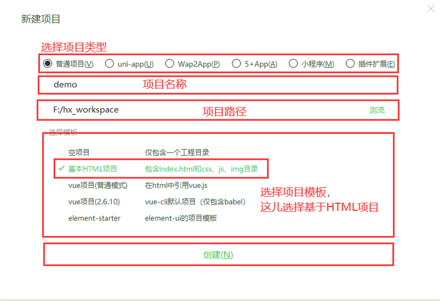
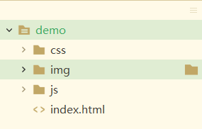
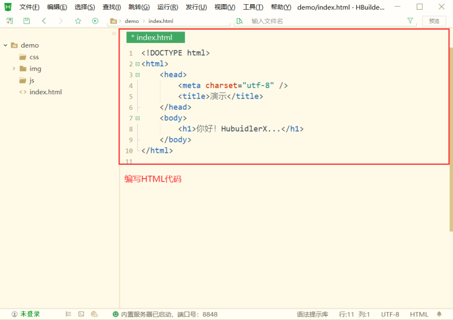
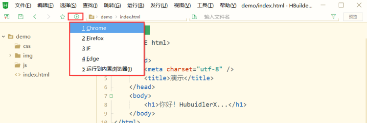

# HBuilderX
[[TOC]]

## HBuilderX简介
[官网](https://www.dcloud.io/hbuilderx.html)
解压后将exe文件发送桌面快捷方式,即可使用.
## HBuilderX使用
### 选择主题
HbuilderX打开之后，会出现一些很人性话的设置，根据自己的喜好，选择对应的主题视觉.



### 新建项目
视觉设置完成之后进入我们的项目建立阶段，点击“新建项目”，选择项目类型，创建项目名称，设置项目所在的位置确定即可，完成之后会在左边的项目栏管理器中出现。我这里创建的名称为demo。





### 文件结构目录
打开项目demo的文件夹，我们会看到里面有首页index.html，有JS文件夹，有CSS文件夹，还有图片的文件夹，基本齐全。



### 代码编写

### 代码运行
代码的运行以下图为例，点击对应的浏览器之后回跳转到一个对应的页面。


## HBuilderX自定义模板

### 自定义html模板


注意：模板是根据选择的文件类型独立的，我们现在是创建的html模板，只有创建html时，才能选择这个模板。


### vue模板.txt

创建vue模板.txt，文件名自定义。这样就无需每次敲这些重复的代码，高效

```html
<!DOCTYPE html>
<html>
	<head>
		<meta charset="utf-8">
		<title></title>
		<script src="js/vue.js"></script>
	</head>
	<body>
		<div id="app">
			{{msg}}
		</div>
	</body>
	<script>
		new Vue({
			el: "#app",
			data:{
				msg : "hello vue"
			}
		})
	</script>
</html>


```

### 创建新文件调用模板


### CDN

```html
<!DOCTYPE html>
<html>
	<head>
		<meta charset="UTF-8">

		<!-- 1.在一个简单的网页中,使用 element-ui的效果
			先导入vue.js+再导入element-ui的相关资源,下面导入的方式都是在线访问一个网址(cdn)
		-->
		<script src="https://cdnjs.cloudflare.com/ajax/libs/vue/2.1.8/vue.min.js"></script>
		<script src="https://unpkg.com/axios/dist/axios.min.js"></script>
		<script src="https://unpkg.com/element-ui/lib/index.js"></script>
		<link rel="stylesheet" href="https://unpkg.com/element-ui/lib/theme-chalk/index.css">
		  
	</head>
	<body>
		<div id="app">
			<!-- 2.使用element-ui的按钮元素 -->
			<el-button type="success" >Button</el-button>
		</div>
	</body>
		<script>
			new Vue({
			  el: '#app'
			})
		</script>
</html>

```

### 简化axios

```javascript
//简化axios里的then(获取后台的返回值),同时使用async和await
async function hello(){ //用async标识是函数
	//then可以省略,then里的返回值直接可以接收到,用await标识是ajax请求
	let res = await axios.get(url3);
	alert(res.data);
}
hello();
```
