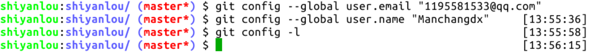
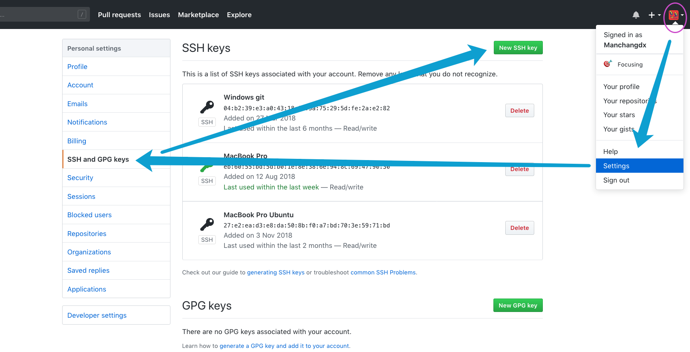
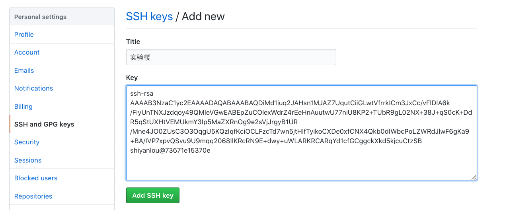

# GitHub快速上手
[[TOC]]

## 安装配置 Git 工具

介绍如何安装与简单的配置 Git 工具
### 安装

首先在终端下面敲入 `git --version`， 如果正确回显版本号，则说明已经安装好，如果没有则在终端敲入下面这条命令进行安装
```
$ sudo apt-get install git -y
```
打开`GitHub`注册个人账户并登录.登陆后,在个人主页的右上角点击`New repository`创建新的仓库.


打开页面如下图所示，填入相关信息。注意下图紫色框中有两个下拉按钮，左边的用来选择忽略文件，右边的用来选择所属协议，这两项可以不选，后面的课程会讲到。


点击绿色按钮创建新的仓库，成功后自动跳转到新建仓库的主页面，如下图所示：


### 配置用户名与邮箱

配置用户名
```
### 如果想设置为全局生效，添加 --global 参数
$ git config --global user.name "你的用户名"
$ git config --global user.email "你的邮箱"
```
这两个命令设置你的身份信息如下图。`git config -l` 可以查看配置信息（就不展示截图了）：



完成后，系统自动生成 Git 的配置文件，就是主目录中的隐藏文件 `.gitconfig` ：


上图所示的配置文件也是可以直接手动修改。

## SSH 公私钥的使用

讲解如何使用 `ssh-keygen `生成公私钥
### 创建密钥
在 2021 年 8 月 GitHub 更新后，已经不再允许使用账户密码操作 GitHub，必须使用 SSH 密钥登陆。所以我们可以在系统中创建 SSH 公私钥，并将公钥放到 GitHub 指定位置。如此操作即可生成 GitHub 账户对于当前系统中的 Git 授权。

终端执行 `ssh-keygen` 命令按几次回车生成公私钥，公私钥存放在主目录下的隐藏目录 `.ssh` 中的两个文件中,也就是 `~/.ssh/` 路径下，并且会创建一套空密码验证的密钥文件，反之则每一次匹对公私钥都需要再手动输入一次密码，所以这里为了方便使用，建议一路回车下去就行
```
$ ssh-keygen
```
到选择存放密钥文件的路径下查看，我这里使用的使默认路径，所以使 `~/.ssh/` 路径下，可以看到生成了两个密钥文件，后缀为 `.pub` 的就是公钥文件，另一个没有后缀的就是私钥文件，可以看到密钥文件创建完毕


### 关联公钥到 Github 账号下

首先复制公钥文件中的内容，也就是 `ssh-rsa` 开头到 `用户名@主机名` 这段字符串

然后回到 Github, 点击右上角头像的下拉按钮，选择 Settings



然后在 Settings 页面中选择左边菜单里的 `SSH and GPG keys`，然后点击右上角的 `New SSH key` 按钮，填写 `Title` 和 `Key`，然后点击 `Add SSH key` 按钮提交.



使用SSH的好处主要有两点:

-   免密码推送，执行  `git push`  时不再需要输入用户名和密码了；
-   提高数据传输速度。它不是必须的，比如在课程中挑战环境是不可保存的，一次性的，这种环境就没有必要创建 SSH 了，因为相较好处来说，还是太麻烦了。

## 克隆远程仓库到本地

### 克隆仓库到本地的个人PC

首先到远程仓库中，点击` Clone or download `按钮，选择使用` Use SSH`，然后点击复制链接按钮


因为之前已经关联过个人PC的 SSH 公钥，所以直接在命令行中使用以下命令就可以克隆仓库到本地

```
#命令用法：git clone "你复制的仓库链接"
$ git clone git@github.com:shiyanlou-001/shiyoulou-001.git
```
查看仓库内容，确定已经克隆到本地.

在实验环境里删除原仓库，使用此链接重新克隆仓库。克隆仓库是需要确认连接，输入 yes 即可：


进入仓库主目录，如下图所示，仓库主目录中有个 `.git` 隐藏目录，它里面包含了仓库的全部信息，删掉这个目录，仓库就变成普通的目录了。进入到仓库目录中，命令行前缀发生了一些变化，出现了红色的 master ，它就是当前所在的分支名：


当我们在 GitHub 上创建一个仓库时，同时生成了仓库的默认主机名 origin，并创建了默认分支 master。GitHub 可以看成是免费的 Git 服务器，在 GitHub 上创建仓库，会自动生成一个仓库地址，主机就是指代这个仓库，主机名就等于这个仓库地址。克隆一个 GitHub 仓库（也叫远程仓库）到本地，本地仓库则会自动关联到这个远程仓库，执行 `git remote -v` 命令可以查看本地仓库所关联的远程仓库信息：


Git 要求对本地仓库关联的每个远程主机都必须指定一个主机名（默认为 origin），用于本地仓库识别自己关联的主机，`git remote`  命令就用于管理本地仓库所关联的主机，一个本地仓库可以关联任意多个主机（即远程仓库)。

克隆远程仓库到本地时，还可以使用  `-o`  选项修改主机名，在地址后面加上一个字段作为本地仓库的主目录名，举例如下：


另一个在其它 Git 教程中常见的命令 `git init` ，它会把当前所在目录变成一个本地仓库，因为有 GitHub 的存在，这个命令在我们的生产生活中用到的次数应该是零，除非你想费时费力自己搭建服务器。操作截图如下：


### 克隆仓库到实验楼的在线环境

打开 Xfce 终端，输入以下命令克隆仓库到在线环境中，这里要注意下，因为在线环境环境的 SSH 公钥是没有关联 Github 账户的，所以这里克隆仓库到本地是需要对应上 Github 的用户名与密码的，具体操作如下

在实验环境中打开浏览器，输入远程仓库地址，Github 的URL地址构造是 `https://github.com/用户名/仓库名称`，而我的用户名和仓库名称都是 `shiyanlou-001` 所以这里我自己的项目地址为 `https://github.com/shiyanlou-001/shiyanlou-001`

进入仓库页面后，依旧是点击 Clone or download 按钮，由于我们没有登录 Github 所以这里能复制URL的只有 Use HTTPS 选项，与 Use ssh 选项的区别是每一次同步改动都需要手动输入 Github 的用户名和密码，加上因为是在线环境环境，为了安全性这里也应该就只用 HTTPS 来克隆仓库到本地

接下来打开终端，依旧用 git clone 命令克隆仓库到在线环境中，比如我的仓库地址是 `https://github.com/shiyanlou-001/shiyanlou-001.git`，那么命令就应该是下面这样子
```
#注意地址用的是你自己的仓库地址
$ git clone https://github.com/shiyanlou-001/shiyanlou-001.git
```
查看仓库内容，确定已经克隆到在线环境之中

## GitHub的三大区域
Git 本地仓库有三大区域：工作区、暂存区、版本区。这是一个概念，有这个了解即可，随着使用 Git 的时间增多，慢慢就会理解这三个区域的作用以及为何要这么设计，学习阶段只需按照文档逐步操作即可。接下来我们以命令为主线介绍 Git 的操作。


**注意，所有 Git 命令都以  `git`  开头。**

## 一次完整的修改,提交,推送操作
首先，进入仓库主目录，执行 `git status` 查看整个仓库的状态：


### 对工作区进行修改
创建一个文件并再次查看仓库状态，这步操作是在工作区中：


如上图所示，新建文件后，命令行前缀又发生了一些微小的变化，红色 master 后面出现了 `*` 星号，这表示工作区或暂存区有变化，对文件进行增删改操作都会出现这个星号，另外使用 `git status` 命令亦可查看详情。

### 添加修改到暂存区以及撤销修改
按照上图的提示，使用 `git add [文件名]` 命令跟踪此新建文件，即把新增文件添加到暂存区，以备提交：


如果对多个文件或目录进行了增删改，可以使用  `git add .`  命令全部添加到暂存区。

注意这里有个概念，当我们修改了工作区，`git add`  命令是将这些修改添加到暂存区，暂存区记录的只是修改。如果要撤销暂存区的修改怎么办？根据上图的提示，执行  `git reset -- [文件名]`  或者  `git rm --cached [文件名]`  命令即可：


上图的命令，如果省略最后的文件名，把命令写成  `git reset --`  即可把暂存区的全部修改撤销。好，现在暂存区的修改被撤销，又回到了工作区。

现在介绍另一个命令  `git diff`，它可以用来查看工作区被跟踪的文件的修改详情，此时新建文件 one.txt 并未被跟踪，而已被跟踪的文件 README.md 无修改，所以看不到。注意，只有在版本区中存在的文件才是被跟踪文件。

我们先修改 README.md 文件，然后执行此命令：


此时会跳到新的页面，即工作区修改详情页，按 `Q` 退出此页面：


现在，将工作区的两处修改（新增文件 one.txt，修改文件 README.md）全部添加到暂存区，并使用 `git diff --cached` 查看暂存区的全部修改：


同样，此命令也会跳到新的页面，即暂存区修改详情页：


### 删除

要把仓库里的文件删除掉，可以使用 `git rm` 命令，用法是 `git rm [-rf] <文件名|路径>`，具体步骤如下

这里我们可以用一开始就存在的 `README.md `文件来做实验，我们敲入 `git rm README.md`，然后可以发现文件已经删除了


### 查看提交历史
接下来，将执行  `git commit`  命令把暂存区的修改提交到版本区，生成一个新的版本。

在此之前，先介绍另一个命令  `git log`，它用来查看版本区的提交历史记录，当前只有一个提交，就是在 GitHub 上创建新仓库时的初始化提交。同样此命令也会跳到新页面，如下图所示：


关于查看提交历史记录的命令，有些常用的选项介绍一下：

-   `git log [分支名]`  查看某分支的提交历史，不写分支名查看当前所在分支
-   `git log --oneline`  一行显示提交历史
-   `git log -n`  其中 n 是数字，查看最近 n 个提交
-   `git log --author [贡献者名字]`  查看指定贡献者的提交记录
-   `git log --graph`  图示法显示提交历史


### 提交暂存区的修改
现在执行 `git commit` 命令生成一个新的提交，一个必须的选项 `-m` 用来提供该提交的备注：


提交后，暂存区的修改被清空，执行 `git log` 查看提交记录，紫色框中的十六进制序列号就是提交版本号，这是很重要的信息，每个提交都有自己单独的版本号，就像公民身份证号一样：


观察上图的提交信息，提交版本是按时间倒序排列的，也就是最近的提交排在最上面，你可能需要查看时间正序排列的信息，那么可以使用  `git log --reverse`  命令。

现在介绍一个超级实用、使用频率极高但几乎所有 Git 教程都不重视的命令  `git branch -avv`，它用来查看全部分支信息：


上图有三行信息，依次说明:

第一行，开头的星号表示当前所在分支，绿色的 master 是分支名，之所以是绿色，也是因为它是当前所在分支。后面第二项是版本号，第三项中括号里面蓝色的字，表示此分支跟踪的远程分支的名字，当然啦，这也是克隆远程仓库到本地时的默认设置 -- 创建 master 分支并自动跟踪远程同名分支；冒号后面黑色文字表示本地分支领先其跟踪的远程分支一个提交。最后一项是提交时填写的备注信息。

第二行，是 Git 指针信息，它指向远程仓库的 master 分支，这行信息暂不重要。

第三行，远程分支信息，详见第一行的解释。

在执行  `commit`  命令时，再介绍一个我并不推荐的选项  `-a`  ，它的作用是将未添加到暂存区的修改，也就是工作区的修改也一并提交，但会略过未被跟踪的文件，比如新建文件 one.txt，此命令的完整格式：`git commit -am xxxxx`  。谨慎的做法是按照前文的顺序，修改工作区 - 提交到暂存区 - 随时使用  `git status`  查看仓库状态 - 将暂存区的修改提交到版本区生成一次新的提交。

最后一个环节，将本地新增的提交推送到 GitHub 远程仓库中，命令是  `git push`，后面不需要任何选项和参数，此命令会把本地仓库 master 分支上的新增提交推送到远程仓库的同名分支上，因为当前所在的分支就是 master，而且上文提到，它已经跟踪了远程仓库的同名分支：


此命令需要再次输入你的 Github 用户名和密码，密码为隐藏数据，输入时看不到。推送成功后执行 `git branch -avv` 查看分支情况：


如上图所示，本地分支 master 与远程分支 origin/master 的版本号一致，通常看两个版本号是否一致，只需比对前四位。看一下网页上的情况：


完全符合预期。

一个小细节，在上图右侧有 “14 hours ago” 字样，因为这次提交操作是 14 小时前完成的，提交后我睡了一觉，与推送操作的时间无关。

以上就是一次完整的修改 - 提交 - 推送操作。一次推送中可以包含多个  `git commit`  操作，也就是多个提交可以一起推送。
## 版本回退
如果发现 one.txt 文件内容有误，怎么做？可以修改此文件然后再次添加到暂存区、提交、推送，也可以撤销最近一次提交，修改文件后重新提交推送。现在使用后一种方法来演示撤销提交的操作流程。

首先执行  `git reset --soft HEAD^`  撤销最近的一次提交，将修改还原到暂存区。`--soft`  表示软退回，对应的还有  `--hard`  硬退回，后面会讲到，`HEAD^`  表示撤销一次提交，`HEAD^^`  表示撤销两次提交，撤销 n 次可以简写为  `HEAD~n`。软退回一个提交后执行  `git branch -avv`  命令查看分支信息：


可以看到本地仓库的 master 分支的版本号已经发生了变化，变成了前一次提交的版本号，中括号里也有提示信息，本地分支 master 落后其跟踪的远程分支 origin/master 一个提交。

执行  `git status`  查看仓库状态，果然上一个提交中的修改全部扔回了暂存区：


再次修改 one.txt 文件，执行 `git add .` 命令将新的修改添加到暂存区，然后执行 `git commit` 命令生成新的提交：


## 处理commit时间线分叉
执行 `git status` 和 `git branch -avv` 查看仓库状态和分支状态：


可以看到本地仓库的 master 分支与远程仓库的 origin/master 分支在提交版本上有了冲突，又叫做提交时间线分叉。因为刚才的提交操作不是基于远程仓库 origin/master 分支的最新提交版本，而是撤回了一个版本。这种情况下也是可以将本地 master 分支推送到远程仓库的，需要加一个选项 `-f` ，它是 `--force` 的简写，这就是强制推送：


执行 `git branch -avv` 看一下分支信息，本地 master 与远程 master 的版本号一致，前四位都是 e290，在浏览器上刷新 GitHub 页面，结果如预期：


## 本地仓库commit变化记录
假设此时发现情况不对，之前的那次版本号为 5c04 的提交是正确的，刚才的版本回退操作全都是误操作，怎么办？再次执行一次版本回退吗？当然不需要啦，我们有 `git reflog` 命令，它会记录本地仓库所有分支的每一次版本变化。实际上只要本地仓库不被删除，随你怎么折腾，都能回退到任何地方。`reflog` 记录只存在于本地仓库中，本地仓库删除后，记录消失。执行此命令如下图所示：


怎么回退到 5c04 那个版本呢？可以直接执行命令 `git reset --hard [版本号]` ，如果记不清版本号，也可以根据上图第 3 行的信息，执行 `git reset --hard HEAD@{2}` 命令，其中 `HEAD@{2}` 就是上图第 3 行第 2 列所示，这个命令的意思是回到当前分支最近两次提交版本变化前：


还想反悔，刚才还是改对了，怎么办？再执行一次即可，这次大括号里就是 1 了：


重要的一点，本节全部命令中，只有 `push` 是需要联网执行的，它对远程仓库进行了修改。


