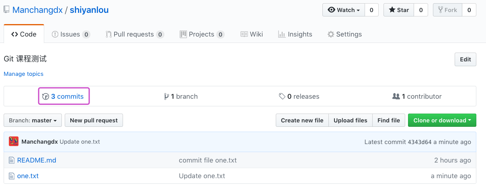
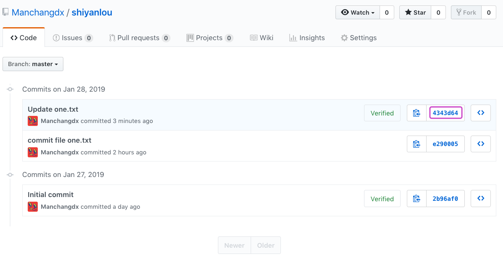
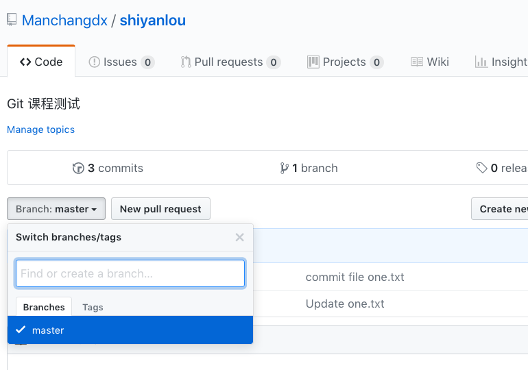

# Git分支操作
[[TOC]]

## 为Git命令设置别名
Git 可以对这些命令设置别名，以便简化对它们的使用，设置别名的命令是 `git config --global alias.[别名] [原命令]`，如果原命令中有选项，需要加引号。别名是自定义的，可以随意命名，设置后，原命令和别名具有同等作用。操作如下：

自己设置的别名要记住，也可以使用 `git config -l` 命令查看配置文件。下面文档中的命令将使用这些别名。

## Git分支管理
### git fetch 刷新本地分支信息
在介绍分支前，先讲解另一个命令  `git fetch`，它的作用是将远程仓库的分支信息拉取到本地仓库，注意，仅仅是更新了本地的远程分支信息，也就是执行  `git branch -avv`  命令时，查看到的  `remotes`  开头的行的分支信息。

举例说明一下，首先我们在 GitHub 页面上对 one.txt 文件进行修改并增加一次提交。

提交完成后，提交数变成 3 个，点下图紫色框中的链接可以看到提交记录：

在实验环境中执行 `git fetch` 命令，然后执行 `git branch -avv` 查看分支信息：

可以看到，本地分支 master 的版本号无变化，而远程分支已经更新。所以，`fetch` 命令的作用是刷新保存在本地仓库的远程分支信息，此命令需要联网。此时若想使本地 master 分支的提交版本为最新，可以执行 `git pull` 命令来拉取远程分支到本地，`pull` 是拉取远程仓库的数据到本地，需要联网，而由于前面执行过 `git fetch` 命令，所以也可以执行 `git rebase origin/master` 命令来实现 “使本地 master 分支基于远程仓库的 master 分支”，`rebase` 命令在后面还会经常用到，这里只需按部就班操作即可：

可以看到，远程仓库 master 分支、本地仓库的 origin/master 分支、本地仓库的 master 分支已经一致。

### 创建新的本地分支
分支在项目开发中作用重大，多人协作时尤其不可或缺。例如一个项目上线了 1.0 版本，研发部门需要开发 1.1、1.2 两个测试版，增加不同的新功能，测试版的代码显然不能在正式版所在的分支上，此时需要新的分支来存放不同版次的代码。再例如实验楼的课程团队在维护课程仓库时，每个人都有各自的分支，在自己的分支上进行修改，然后向 master 分支提 PR（pull request），最后从 master 分支推送到线上。

首先，克隆远程仓库到本地，进入仓库主目录，执行  `git br`  查看分支信息：

执行  `git branch [分支名]`  可以创建新的分支：

此命令创建新分支后并未切换到新分支，还是在 master 分支上，执行 `git checkout [分支名]` 切换分支，`checkout` 也是常用命令，先给它设置别名，然后切换分支：

创建新分支还要手动切换太麻烦，介绍另一个常用的命令 `git checkout -b [分支名]` 创建分支并切换到新分支：

如上图所示的分支信息，前两行是新建的本地分支信息，它们的版本号与主分支 master 一致，这是因为在哪个分支上创建新分支，新分支的提交记录就与哪个分支一致。新建分支并无跟踪任何远程分支，所以没有 master 分支中的中括号和括号内的蓝色远程分支名。

假设我们要在当前分支 dev1 上开发一个新的功能，需要增加一个文件 new_func1，然后生成一个新的提交：

### 将新分支中的提交推送至远程仓库

好，新功能已经写好并提交到了版本区，现在要推送了，推送到哪里呢？正常逻辑当然要推送到远程仓库的同名分支，不过现在远程仓库里只有一个分支：

上图紫色框中是一个下拉按钮，点击后显示仓库中的全部分支，按钮上显示的是当前所在分支。

执行 `git push [主机名] [本地分支名]:[远程分支名]` 即可将本地分支推送到远程仓库的分支中，通常冒号前后的分支名是相同的，如果是相同的，可以省略 `:[远程分支名]`，如果远程分支不存在，会自动创建：

上图命令可以简写为 `git push origin dev1` 。注意哦，这是我们创建 SSH 关联后第一次执行 `push` 命令，可以看到传输速度有明显的提高，更重要的是，不再需要重复输入用户名和密码了，另外打印信息的第一行是警告信息，因为是这个分支的第一次推送嘛，下次执行推送就不会再出现了。现在执行 `git br` 查看一下分支情况：

可以看到，远程分支 origin/dev1 的信息已经在本地存在，且与本地同名分支一致。再看下 GitHub 页面的情况：

很好，与预期毫无二致。

### 本地分支跟踪远程分支

现在有个问题，当我们再次在 dev1 分支上修改并提交，推送到远程仓库时还是要输入上面的那个长长的命令，好不方便。如果能和 master 分支一样跟踪远程同名分支，就可以直接使用 `git push` 命令推送了。有办法的，执行这个命令 `git branch -u [主机名/远程分支名] [本地分支名]` 将本地分支与远程分支关联，或者说使本地分支跟踪远程分支。如果是设置当前所在分支跟踪远程分支，最后一个参数本地分支名可以省略不写：

这个命令的 `-u` 选项是 `--set-upstream` 的缩写。可不可以让本地分支跟踪远程非同名分支呢？可以的，尽管几乎遇不到这种自找麻烦的需求。可不可以撤销本地分支对远程分支的跟踪呢？也是可以的，执行 `git branch --unset-upstream [分支名]` 即可撤销该分支对远程分支的跟踪，同样地，如果撤销当前所在的分支的跟踪，分支名可以省略不写：

问题又来了，前面的操作是先将本地分支推送到远程仓库，使远程仓库创建新分支，然后再执行命令使本地分支跟踪远程分支，有没有办法在推送时就自动跟踪远程分支呢？有的，在推送的时候，加个 `--set-upstream` 或其简写 `-u` 选项即可，现在切换到 dev 分支试一下这个命令：

### 删除远程分支

接下来，介绍一下删除分支的方法。

首先，删除远程分支，使用 `git push [主机名] :[远程分支名]` ，如果一次性删除多个，可以这样：`git push [主机名] :[远程分支名] :[远程分支名] :[远程分支名]` 。此命令的原理是将空分支推送到远程分支，结果自然就是远程分支被删除。另一个删除远程分支的命令：`git push [主机名] --delete [远程分支名]`。删除远程分支的命令可以在任意本地分支中执行。两个命令分别试一下：

可以看到本地仓库已经没有远程分支 dev 和 dev1 的分支信息。查看 GitHub 仓库页面：

也只剩 master 一个分支。操作成功。

### 本地分支的更名与删除

回到实验环境，使用 `git branch -D [分支名]` 删除本地分支，同样地，此命令也可以一次删除多个，将需要删除的分支名罗列在命令后面即可。在此之前，先介绍一个极少用到的命令：给本地分支改名 `git branch -m [原分支名] [新分支名]` ，若修改当前所在分支的名字，原分支名可以省略不写：

好，现在要一次性删除本地分支 ved 和 dev1。需要注意的一点：当前所在的分支不能被删除。切换到 master 分支，然后执行 `git branch -D ved dev1` 命令：

执行 `git branch -avv` 查看当前仓库分支状态：

很好，一切都回到了课程开始时的样子，就像什么都没有发生。本节课程就到这里。
