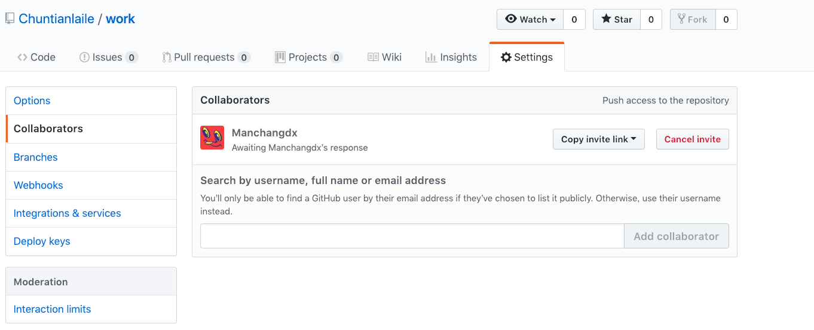
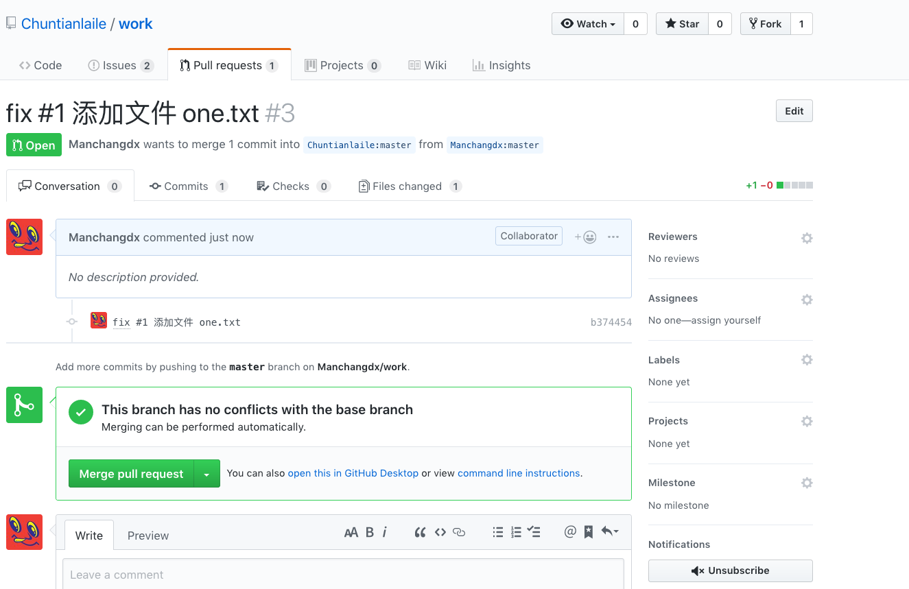

# 多人协作GitHub部分
[[TOC]]

# Gitee
## 创建仓库

首先，在组长账号中创建一个仓库，名为 work，在创建仓库时，需要说明第一节中提到的两个下拉框：

左边的忽略文件下拉框：我们在写代码时，总会出现一些不需要上传到仓库的垃圾文件、缓存文件、备份文件、环境文件等等，可以创建一个忽略文件将这些不需要被上传到远程仓库的文件忽略掉。忽略文件的名字是 `.gitignore`，它被放置在仓库主目录下，将不需上传的文件的名字写入其中，Git 就会自动忽略它们。比如这个仓库是用来 Windows 开发的，就在下拉框中选择 Windows，如果这是一个保存 Java 项目的仓库，就选择 Java。这样，在仓库创建成功后，忽略文件就自动出现了，这个忽略文件中有对应的语言或工具中绝大部分通用的忽略规则。当然了，你也可以自己手动增删改。

如果在创建仓库时忘记了选择忽略文件，几个提交后突然想起来，怎么办？GitHub 上有人把忽略文件都做好了，打开链接 [github / gitignore (opens new window)](https://github.com/github/gitignore)，这个仓库里有很多忽略文件，选择你需要的放到自己的仓库即可。

右边的开源许可下拉框：关于开源许可证，不属于本课程所述范围，如有需要大家可以自行搜索。我们的仓库不需要选择这一项。选择这个之后，仓库中会出现相对应的图标，比如上面提到的忽略文件仓库：

在组长账号中创建好新仓库，如下图：

对上图右上角三个按钮进行说明：

Watch：这是一个下拉按钮，可以选择对此仓库关注、不关注、忽略等。

Star：如果觉得这个仓库很好，就点击这个按钮送一颗星，在淘宝提供刷星业务之前，仓库获得的星越多表示该项目越优秀。

Fork：在别人的仓库中点此按钮会克隆一个完全一样的仓库到你自己的账号中，包括所有分支、提交等，但不会克隆 issue（本节后面会讲到），当此仓库发生版本变化，不会自动同步到你克隆的仓库里，反之亦然。

## 增加合作者

现在在组长账号中增加该仓库的合作者，也就是组员：

在浅蓝色输入框中写入组员 GitHub 账号的用户名，选择正确的用户，点击右侧按钮就会发送一封邀请邮件给组员：

现在使用另一个浏览器登录组员的 GitHub 账号和邮箱，打开邮件：

点击上图绿色按钮，跳转到下图：

再次点击绿色按钮接受邀请，会跳转到组员访问组长仓库的页面：

点击上图紫色框中的 Fork 按钮，克隆组长的仓库到组员的账号中，完成后自动跳转到下图页面，也就是组员的仓库页面：

## 添加issue

切换到组长的 GitHub 页面，在仓库中添加一些项目任务或待解决问题，这些任务就是 issue：

写好任务标题后，可以在右侧指派一位或多位项目参与者来完成，同样 GitHub 也会给被指派者发邮件的（可以在自己的 GitHub 账号上设置拒收哪类邮件）：

写好两个 issue，前面说过的，组长仓库里的 issue 不会出现在组员仓库中：

# 多人协作---Gitee

## Fork + PullRequest 模式

参与 Gitee 中的仓库开发，最常用和推荐的首选方式是“Fork + Pull”模式。在“Fork + Pull”模式下，仓库参与者不必向仓库创建者申请提交权限，而是在自己的托管空间下建立仓库的派生（Fork）。至于在派生仓库中创建的提交，可以非常方便地利用 Gitee 的 Pull Request 工具向原始仓库的维护者发送 Pull Request。

### 1、什么是 Pull Request？

Pull Request 是两个仓库提交变更的一种方式，通常用于 fork 仓库与被 fork 仓库的差异提交，同时也是一种非常好的团队协作方式，下面，就来讲解如何在 Gitee 平台提交 Pull Request：

PS：Gitee 平台限制 Pull Request 源仓库与目标仓库需存在 fork 与被 fork 关系，故如果你要提交 Pull Request，必须先 fork 一个仓库，然后才能对该仓库提交 Pull Request，同时，以该仓库为父仓库的所有仓库，您也均可以提交 Pull Request。

### 2、如何 fork 仓库

fork 仓库时非常简单的，进到仓库页面，然后找到右上角的 fork 按钮，点击后选择 fork 到的命名空间，再点击确认，等待系统在后台完成仓库克隆操作，就完成了 fork 操作，如图：

### 3、如何提交 Pull Request

首先，您的仓库与目标仓库必须存在差异，这样才能提交,比如这样：

如果不存在差异，或者目标分支比你提Pull Request的分支还要新，则会得到这样的提示：

然后，填入Pull Request的说明，点击提交Pull Request，就可以提交一个Pull Request了，就想下图所示的那样：

### 4、如何对已经存在的 Pull Request 的进行管理

首先，对于一个已经存在的 Pull Request，如果只是观察者，报告者等权限，那么访问将会受到限制，具体权限限制请参考 Gitee 平台关于角色权限的内容，下文涉及的部分，仅针对管理员权限，如果您发现不太一样的地方，请检查您的权限是不是管理员或该 Pull Request 的创建者。

### 5、如何修改一个已经存在的 Pull Request

点击 Pull Request 的详情界面右上角的编辑按钮，就会弹出编辑框，在编辑框中修改你需要修改的信息，然后点击保存即可修改该 Pull Request，如下图所示：

请注意，在该界面，可以对 Pull Request 进行指派负责人，指派测试者等等操作，每一个操作均会通知对应的人员

### 6、对 Pull Request 的 bug 修改如何提交到该 Pull Request 中

对于 Pull Request 中的 bug 修复或者任何更新动作，均不必要提交新的 Pull Request，仅仅只需要推送到您提交 Pull Request 的分支上，稍后我们后台会自动更新这些提交，将其加入到这个 Pull Request 中去

### 7、Pull Request 不能自动合并该如何处理

在提交完 Pull Request 的后，在这个 Pull Request 处理期间，由原本的能自动合并变成不能自动合并，这是一件非常正常的事情，那么，这时，我们有两种选择，一种，继续合并到目标，然后手动处理冲突部分，另一种则是先处理冲突，使得该 Pull Request 处于可以自动合并状态，然后采用自动合并，一般来讲，我们官方推荐第二种，即先处理冲突，然后再合并。具体操作为：

先在本地切换到提交 Pull Request 的分支，然后拉取目标分支到本地，这时，会发生冲突，参考如何处理代码冲突这一小节将冲突处理完毕，然后提交到 Pull Request 所在的分支，等待系统后台完成Pull Request的更新后，Pull Request 就变成了可自动合并状态

### 8、Pull Request 不小心合并了，可否回退

对于错误合并的 Pull Request，我们提供了回退功能，该功能会产生一个回退 XXX 的 Pull Request，接受该 Pull Request 即可完成回退动作，注意，回退本质上是提交一个完全相反的 Pull Request，所以，你仍然需要进行测试来保证完整性，另，为了不破坏其他 Pull Request，建议只有需回退的 Pull Request 处于最后一次合并操作且往上再无提交时执行回退动作，否则请手动处理。

## 使用Pull Request功能进行代码审查

如果你的团队采用了 Gitee 推荐的“Fork + Pull”协作模式，我们同时推荐通过Pull Request这个功能来进行团队中的代码审查，有如下步骤：

**1、仓库管理员 设置代码审查。**

> 设置指定人员为某仓库默认的代码审核/测试人员后，每当有新的Pull Request以此仓库内分支为目标分支时，系统会通知指定人员前去审查提交的Pull Request（也就是改动的代码内容），同时也可以设置合并Pull Request的门槛（例如是否需要全部指定人员同意才可以合并）。

**2、开发者 提交Pull Request。**

> 开发者通过 Fork仓库的分支向源仓库的分支 或 同仓库内的工作分支向源分支 提交Pull Request的方式来发起一个代码审查的请求，以达到更新源分支的代码的目的。

**3、审查者 进行代码审核/测试。**

> 指定人员查看开发者提交的Pull Request内容，并决定是否同意接受该开发者的改动。

**4、仓库管理员 合并 Pull Request。**

> 仓库的管理人员在审查者同意后，即可通过合并Pull Request的方式把开发者的文件改动内容同步到源分支。

图示如下： 

### 1、仓库管理员 设置代码审查

1. 代码审查以仓库为单位。仓库管理员以上的成员可以进入【仓库详情】- 【代码审查设置】页面

2. 根据需求设置相应的代码审核/测试人员。

设置完成后，每当有开发者向仓库内的分支提交 Pull Request，相关人员即可收到通知，开始代码审查流程。

### 2、开发者 提交 Pull Request

1. 开发者Fork目标仓库，在对应分支上修改后，推送到自己Fork的仓库里，从自己仓库中点击“+ Pull Request”。

2. 系统会默认对应源分支和要修改的目标分支

3. 填入Pull Request的说明，点击“创建”，就可以提交一个Pull Request：

### 3、审查者 进行代码审核/测试

1. 在指定审查者的企业视图【工作台】- 【Pull Request】中，【指派给我的】那个tab即是该审查者需要进行代码审查的Pull Request。

> 注：付费企业用户默认开启代码缺陷扫描，会自动扫描任何提交过来的Pull Request中的缺陷和规范问题。

2. 审查者可以查看Pull Request详情

3. 在“评论”中留下自己对这个Pull Request中改动的意见和建议

4. 同时支持“文件改动”中对代码行注释

5. 在“缺陷报告”和“规范报告”中查看报告内容

审查者的建议会通过站内信等方式通知提交Pull Request的开发者，开发者可以根据情况在“评论”中与审查者进行讨论。

### 4、仓库管理员 合并 Pull Request

Pull Request审查完成且满足仓库管理员设置的代码审查规则后，拥有合并Pull Request权限的成员（通常为仓库管理员，特殊情况请查看保护分支规则即可把这个Pull Request合并到目标分支。

合并完成后，开发者对目标分支的改动就生效了。

## Pull Request 关联 Issue

通过 Pull Request 关联 Issue，用户可以在关闭 Pull Request 的时候同时关闭 issue。关联功能具有以下特点：

1. 一个 PR 可以关联多个 issue，例如同时关联 issue1 , issue2 格式为：`#issue1ident, #issue2dent`
2. PR关联issue后，issue的状态会自动更改为进行中，当PR被合并后，issue会更改为关闭状态。
3. 个人版和企业版的区别：

> - 个人版，PR只能关联当前仓库的任务
> - 企业版，PP可以关联所有企业的任务。

## 具体通过Pull Request 关联 Issue操作如下：

#### 1. 在 PR 的内容里面指定需要关闭的 issue 的 ident ,例如：

#### 2. 在 issue 详情页可以看到关联关系

#### 3. 当 PR 合并之后其关联的 issue 被关闭

## 在线解决代码冲突

### 功能介绍

在使用 Pull Request 的过程中如果遇到代码冲突，往往需要将代码取回本地，通过 `git merge` 处理代码冲突，再推送回仓库。

Gitee 提供 WebIDE 在线解决冲突的解决办法，无需客户端操作即可在网页上完成冲突解决。

### 通过 WebIDE 在线解决冲突

1、在产生代码冲突的 PR 页面，点击「尝试通过 WebIDE 解决冲突」，进入 WebIDE。

2、选择相应冲突的代码文件，找到冲突的代码段，并选择合适的代码更改并接受。

3、「暂存」修改过的文件，随后点击「提交」将处理完冲突的代码提交到 PR 源分支，回到 PullRequest 页面，代码冲突解决。

### 更新后如何同步更新且不覆盖自己的代码

1、fork后创建分支如：dev
点击master分支【下三角】点击【管理】

点击【新建分支】

2、master强制拉取
点击刷新图标从源仓库强制拉取代码（会覆盖所有代码），拉取后自己的master就是最新的了。

3、master与dev两个分支进行pull request
然后点击 【pull request】目标分支选择自己的【dev】分支，这样就可以合并了。

4、合并完成
 合并完成后查看dev中的代码，代码更新了自己修改的也还在。

 # Github

## 克隆仓库到本地

  

打开实验环境，以组员的身份克隆自己的 work 仓库到实验环境，由于之前已经设置了实验环境的 SSH 公钥到 GitHub，所以我们使用 git 开头的地址来克隆：

  

  

链接的结尾 .git 是不需要的：

  

  

  

## 完成任务并推送到自己的仓库

  

现在我们要完成组长仓库的一个 issue，注意每个 issue 在创建后都会生成一个编号，我们首先完成 1 号 issue：

  

  

创建文件，添加到暂存区，提交，查看本地仓库分支状态：

  

  

  

注意在执行 commit 命令时，备注信息里有个 “fix #1”，这是必要的，当备注信息中含有此字样的 commit 出现在组长仓库，仓库中编号为 #1 的 issue 就会自动关闭。类似的字样还有 “fixes #xxx、fixed #xxx、closes #xxx、close #xxx、closed #xxx”，这些并不重要，选择字母最少的 fix 就可以了。当然偶尔忘记写这个字样也不要紧的，issue 可以手动关闭，甚至关掉的 issue 还能再开。

  

完成以上操作，组员的 GitHub 仓库会发生变化，新增一个版本号为 b374 的提交：

  

  

## 提PR&检查合并PR

  

接下来，怎么把修改从组员的仓库添加到组长的仓库呢？这就用到了 pull request 方法，简称 PR。这个词组比较费解，两个词都有动词属性，字面意思是 “拉，请求”，可以理解为这是一个名词性词组，意为 “允许被拉取的请求”，创建一个 PR 就是从甲分支向乙分支提一个请求，该请求中有一个或多个提交，对方觉得可以、没问题，就合并（merge) 这个请求，也就是把请求中所有提交的修改增加到乙分支上，整个过程简称 “提 PR”、“检查合并 PR”。提 PR 既可以在仓库内，也可以跨用户跨仓库。

  

好，现在我们从组员的 work 仓库 master 分支给组长的 work 仓库 master 分支提一个 PR：

  

  

如下图所示，仔细检查紫色框中的内容是否正确，再看绿色椭圆形框中的绿色字样 “Able to merge.”，说明这个 PR 中的修改跟目标分支没有冲突：

  

  

从上图还可得知一些信息：该 PR 里有 1 个提交，1 个文件改动，1 个贡献者。点击上图绿色按钮跳转到确认页面，再次点击下图绿色按钮即可完成本次 “提 PR” 工作：

  

  

完成后，页面自动跳转到组长的 work 仓库 PR 的合并页面：

  

  

该页面只有参与项目协作的成员有权限进入，当前 GitHub 的登录用户是组员，所以可见，且对这个仓库有完全的管理权限，除了删除仓库。当然了，检查合并 PR 的权限也是有的。重要的一点：提了 PR 之后，一定要求参与项目的其他成员来检查合并，不要自己来，尽管自己有权限。

  

上图中绿色按钮是个下拉按钮，合并 PR 的方法有三种，分别解释一下：

  

`Create a merge commit` ：这种方式会在组长仓库的 master 分支上生成一个新的提交，且保留 PR 中的所有提交信息。这是一种常规操作，用得最多。

  

`Squash and merge` ：压缩合并，它会把 PR 中的全部提交压缩成一个。此方法的优点就是让提交列表特别整洁。一个 PR 里有很多提交，每个提交都是很细小的改动，保留这些提交没什么意义，这种情况就使用此方法合并 PR。

  

`Rebase and merge` ：这种方法不会生成新的提交，例如 PR 中有 6 个提交，用此方法合并后，组长仓库也会新增 6 个提交。注意，这些提交的版本号与组员的提交不同，此外完全一样。

  

现在切换到另一个登录组长账号的浏览器，打开合并 PR 的页面，用第一种方法合并：

  

  

这就是第一种方式合并的结果，生成了一个新的提交，这个提交里没有修改。因为样子不太美观，这是我最不喜欢用的方式。仔细看上图的 issue，变成了 1 个，也就是说在合并 PR 后，#1 issue 被关闭了。

  

以上就是一次完整的修改、提交、推送、提 PR、合并 PR 的过程。

  

**需要注意的一点：从 A 向 B 提 PR 后，在 PR 合并或关闭前，A 上所有新增的提交都会出现在 PR 里。**

  

## 同步主仓库

  

因为组长的 master 分支新增了一个空提交，所以需要让组员的仓库同步组长的仓库，使它们的提交版本一致。作为组员，要时刻保持自己的 master 分支与组长的一致，以避免在下次提 PR 时出现冲突，该操作叫做 “同步主仓库”，组长的仓库就是主仓库。

  

提 PR、合并 PR 只能在 GitHub 页面上操作。同步主仓库是要用 Git 操作的。现在回到实验环境中操作。首先，使用 `remote` 系列命令来增加一个关联主机，执行 `git remote add [主机名] [主仓库的地址]`，注意，主仓库的地址使用 https 开头的：

  

  

如上图所示，主机名是随意定义的，只要不是 origin 就可以，因为自己的仓库地址对应的主机名是 origin，主仓库的主机名通常定义为 up 或 upstream，这个主机名其实就是一个变量，它的值就是仓库地址，例如 `git push origin master` 完全等于 `git push git@github.com:Manchangdx/work master` 。

  

如此说来，关联主仓库后也没什么变化嘛，确实如此，即使地址写错也不会报出来。现在可以使用前面课程介绍过的 `fetch` 命令来拉取主仓库的全部分支信息到本地仓库了，我有时使用这个命令看上一个命令是否有拼写错误：

  

  

  

如何同步主仓库哩？方法有二，一是执行 `git pull --rebase up master` ，此命令需联网，二是执行 `git rebase up/master`，此命令不联网，因为前面已经执行了 `git fetch up` 这个需要联网的命令，本地已经有了最新的主仓库 master 分支信息，所以可以这么操作。

  

总结一下：`git pull --rebase` = `git fetch` + `git rebase`。现在使用方法二来同步：

  

  

  

同步主仓库已完成。现在可以继续修改提交自己的 master 分支了。然后一并推送到自己的远程仓库。

  

以上是在自己 Fork 的仓库里进行修改的过程。还有一种常用的方式，就是不用 Fork，直接克隆组长的仓库到本地，然后各自创建自己的分支，在自己的分支上进行修改提交，最后从自己的分支向 master 分支提 PR。方式不同，原理一样。