# 多人协作Git部分

[[TOC]]


## 如何处理代码冲突

冲突合并一般是因为自己的本地做的提交和服务器上的提交有差异，并且这些差异中的文件改动，Git不能自动合并，那么就需要用户手动进行合并

  

如我这边执行`git pull origin master`

  

#### 如果Git能够自动合并，那么过程看起来是这样的

  

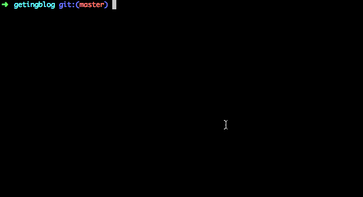

  

拉取的时候，Git自动合并，并产生了一次提交。

  

#### 如果Git不能够自动合并，那么会提示

  

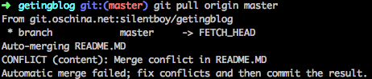

  

这个时候我们就可以知道`README.MD`有冲突，需要我们手动解决，修改`README.MD`解决冲突

  

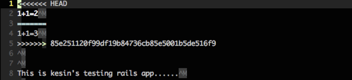

  

可以看出来，在1+1=几的这行代码上产生了冲突，解决冲突的目标是保留期望存在的代码，这里保留1+1=2，然后保存退出。

  

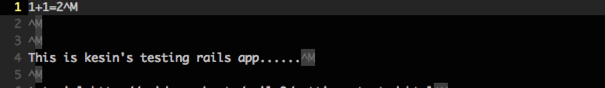

  

退出之后，确保所有的冲突都得以解决，然后就可以使用

  

```
git add .

git commit -m "fixed conflicts"

git push origin master`

```

  

即可完成一次冲突的合并。

  

整个过程看起来是这样的

  

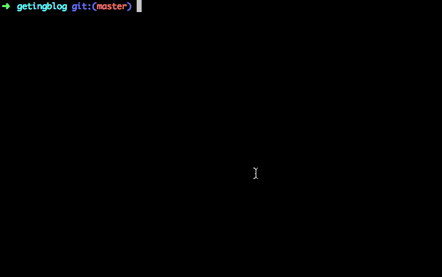

  

## 如何进行版本回退

  

### 回退到当前版本(放弃所有修改)

  

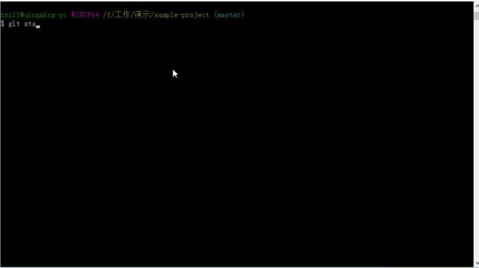

  

### 放弃某一个文件的修改

  

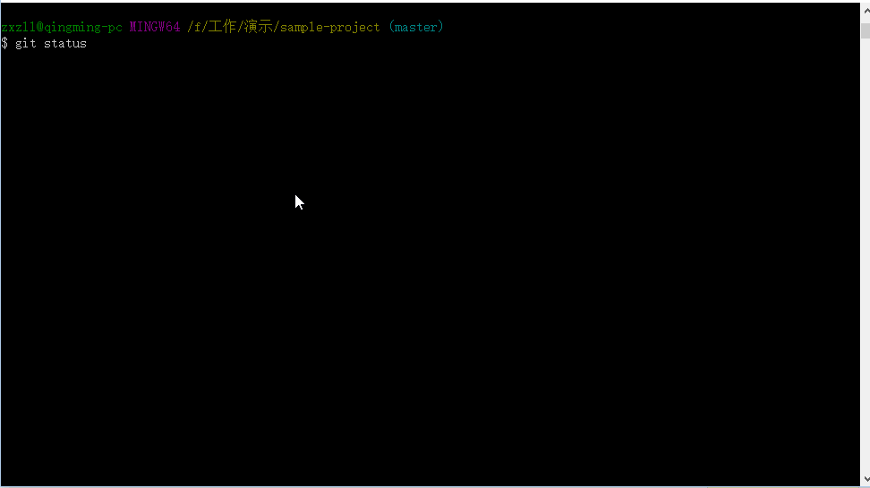

  

### 回退到某一版本但保存自该版本起的修改

  

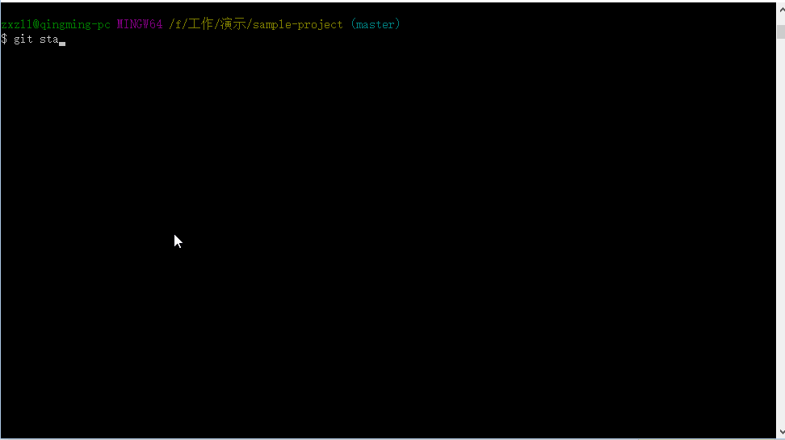

  

### 回退到某一版本并且放弃所有的修改

  

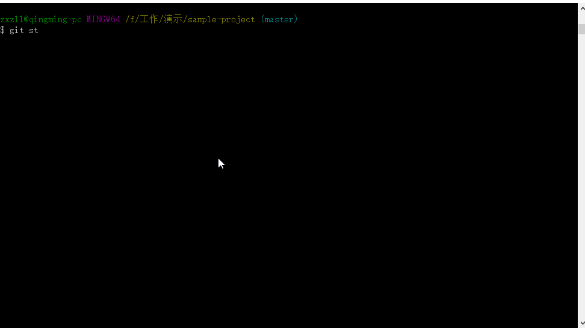

  

### 回退远程仓库的版本

  

先在本地切换到远程仓库要回退的分支对应的本地分支，然后本地回退至你需要的版本，然后执行：

  

```
git push <仓库名> <分支名> -f

```

  

### 如何以当前版本为基础，回退指定个commit

  

首先，确认你当前的版本需要回退多少个版本，然后计算出你要回退的版本数量，执行如下命令

  

```
git reset HEAD~X //X代表你要回退的版本数量，是数字！！！！

```

  

需要注意的是，如果你是合并过分支，那么背合并分支带过来的commit并不会被计入回退数量中，而是只计算一个，所以如果需要一次回退多个commit，不建议使用这种方法

  

### 如何回退到和远程版本一样

  

有时候，当发生错误修改需要放弃全部修改时，可以以远程分支作为回退点退回到与远程分支一样的地方，执行的命令如下

  

```
git reset --hard origin/master // origin代表你远程仓库的名字，master代表分支名

```

  

## 如何进行分支合并

  

**分支合并分为两种情况,一种是本地分支合并,一种是远程分支合并到本地分支,下面,分别用GIF动画演示**

  

### 本地合并分支:

  

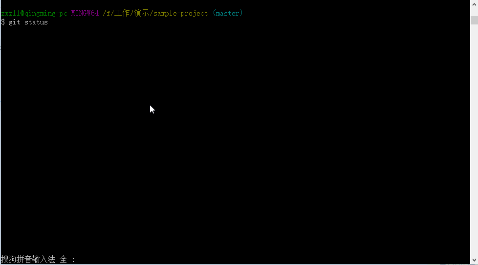

  

### 远程分支合并

  

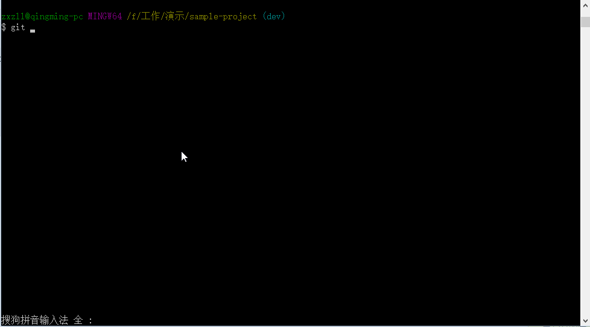

  

关于多人协作的 Git 操作就到这里了。