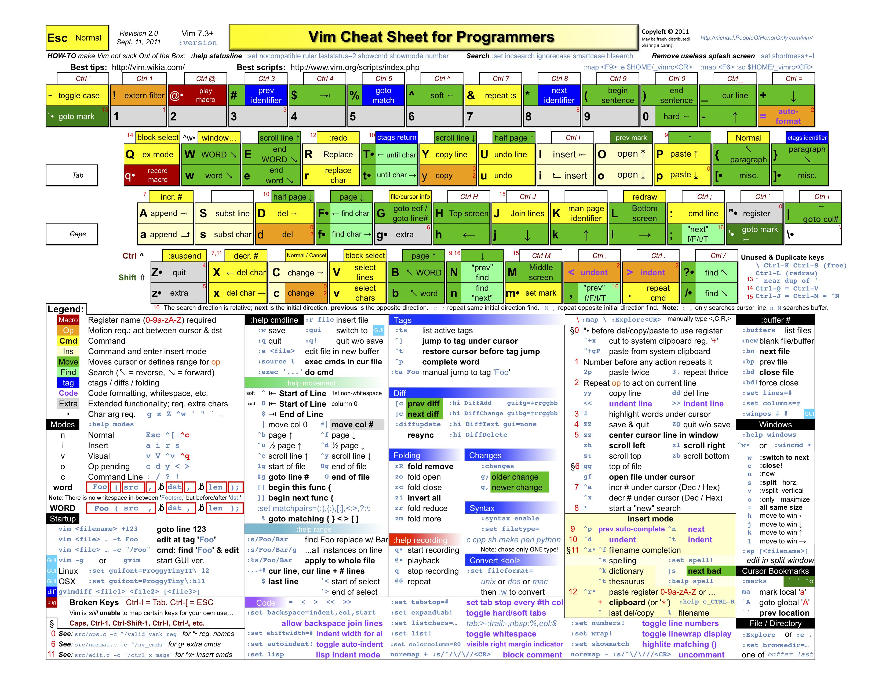

# Vim快速入门
[[TOC]]

[the book of vim][1]
[开源世界旅行手册][2]

## vim 模式介绍

以下介绍内容来自维基百科[Vim](http://zh.wikipedia.org/wiki/Vim)

从 vi 衍生出来的 Vim 具有多种模式，这种独特的设计容易使初学者产生混淆。几乎所有的编辑器都会有插入和执行命令两种模式，并且大多数的编辑器使用了与 Vim 截然不同的方式：命令目录（鼠标或者键盘驱动），组合键（通常通过 control 键（CTRL）和 alt 键（ALT）组成）或者鼠标输入。Vim 和 vi 一样，仅仅通过键盘来在这些模式之中切换。这就使得 Vim 可以不用进行菜单或者鼠标操作，并且最小化组合键的操作。对文字录入员或者程序员可以大大增强速度和效率。

Vim 具有 6 种基本模式和 5 种派生模式，我们这里只简单介绍下 6 种基本模式：

- 普通模式(Normal mode)

在普通模式中，用的编辑器命令，比如移动光标，删除文本等等。这也是 Vim 启动后的默认模式。这正好和许多新用户期待的操作方式相反（大多数编辑器默认模式为插入模式）。

> Vim 强大的编辑功能来自于其普通模式命令。普通模式命令往往需要一个操作符结尾。例如普通模式命令`dd`删除当前行，但是第一个"d"的后面可以跟另外的移动命令来代替第二个`d`，比如用移动到下一行的"j"键就可以删除当前行和下一行。另外还可以指定命令重复次数，`2dd`（重复`dd`两次），和`dj`的效果是一样的。用户学习了各种各样的文本间移动／跳转的命令和其他的普通模式的编辑命令，并且能够灵活组合使用的话，能够比那些没有模式的编辑器更加高效地进行文本编辑。

在普通模式中，有很多方法可以进入插入模式。比较普通的方式是按 `a`（append／追加）键或者 `i`（insert／插入）键。

- 插入模式(Insert mode)

在这个模式中，大多数按键都会向文本缓冲中插入文本。大多数新用户希望文本编辑器编辑过程中一直保持这个模式。

> 在插入模式中，可以按 `ESC` 键回到普通模式。

- 可视模式(Visual mode)

> 这个模式与普通模式比较相似。但是移动命令会扩大高亮的文本区域。高亮区域可以是字符、行或者是一块文本。当执行一个非移动命令时，命令会被执行到这块高亮的区域上。Vim 的"文本对象"也能和移动命令一样用在这个模式中。

- 选择模式(Select mode)

> 这个模式和无模式编辑器的行为比较相似（Windows 标准文本控件的方式）。这个模式中，可以用鼠标或者光标键高亮选择文本，不过输入任何字符的话，Vim 会用这个字符替换选择的高亮文本块，并且自动进入插入模式。

- 命令行模式(Command line mode)

> 在命令行模式中可以输入会被解释成并执行的文本。例如执行命令（`:`键），搜索（`/`和`?`键）或者过滤命令（`!`键）。在命令执行之后，Vim 返回到命令行模式之前的模式，通常是普通模式。

- Ex 模式(Ex mode)

这和命令行模式比较相似，在使用 `:visual` 命令离开 Ex 模式前，可以一次执行多条命令。

## 三种常用模式的切换

vim启动进入普通模式，处于插入模式或命令行模式时只需要按`Esc`或者`Ctrl+[`(这在vim课程环境中不管用)即可进入普通模式。普通模式中按`i`（插入）或`a`（附加）键都可以进入插入模式，普通模式中按`:`进入命令行模式。命令行模式中输入`wq`回车后保存并退出vim。


## 进入vim

进入命令行模式后输入 `:e <filepath>` 同样可以打开相应文件。

### 游标移动

在进入 vim 后，按下 `i` 键进入插入模式。在该模式下您可以输入文本信息,下面请输入如下三行信息：

```txt
12345678
abcdefghijk
shiyanlou.com
```

按`Esc`进入普通模式，在该模式下使用方向键或者 `h`，`j`，`k`，`l` 键可以移动游标。

| 按键 | 说明             |
| ---- | ---------------- |
| `h`  | 左               |
| `l`  | 右（小写 L）     |
| `j`  | 下               |
| `k`  | 上               |
| `w`  | 移动到下一个单词 |
| `b`  | 移动到上一个单词 |

请尝试在普通模式下使用方向键移动光标到 `shiyanlou` 这几个字母上面。

### 进入插入模式

在普通模式下使用下面的键将进入插入模式，并可以从相应的位置开始输入

| 命令 | 说明                                     |
| ---- | ---------------------------------------- |
| `i`  | 在当前光标处进行编辑                     |
| `I`  | 在行首插入                               |
| `A`  | 在行末插入                               |
| `a`  | 在光标后插入编辑                         |
| `o`  | 在当前行后插入一个新行                   |
| `O`  | 在当前行前插入一个新行                   |
| `cw` | 替换从光标所在位置后到一个单词结尾的字符 |

请尝试不同的从普通模式进入插入模式的方法，在最后一行 shiyanlou 前面加上 `www.`，**注意每次要先回到普通模式才能切换成以不同的方式进入插入模式。**

### 保存文档

#### 命令行模式下保存文档

从普通模式输入 `:` 进入命令行模式，输入 `w` 回车，保存文档。输入 `:w <filename>` 可以将文档另存为其他文件名或存到其它路径下。


## 退出vim

### 命令行模式下退出vim

从普通模式输入`:`进入命令行模式，输入`wq`回车，保存并退出编辑

以下为其它几种退出方式：

|命令|	说明|
|---|---|
|:q!|	强制退出，不保存|
|:q	|退出|
|:wq!|	强制保存并退出|
|:w <文件路径>|	另存为|
|:saveas 文件路径	|另存为|
|:x	|保存并退出|
|:wq	|保存并退出|
### 普通模式下退出vim
普通模式下输入`Shift+zz`即可保存退出vim


## 删除文本

#### 普通模式下删除 vim 文本信息

进入普通模式，使用下列命令可以进行文本快速删除：

| 命令      | 说明                       |
| --------- | -------------------------- |
| `x`       | 删除游标所在的字符         |
| `X`       | 删除游标所在前一个字符     |
| `Delete`  | 同 `x`                     |
| `dd`      | 删除整行                   |
| `dw`      | 删除一个单词（不适用中文） |
| `d$`或`D` | 删除至行尾                 |
| `d^`      | 删除至行首                 |
| `dG`      | 删除到文档结尾处           |
| `d1G`     | 删至文档首部               |

除此之外，你还可以在命令之前加上数字，表示一次删除多行，如：

`2dd` 表示一次删除 2 行。

我们来做如下练习：

```bash
cp /etc/protocols .
vim protocols
```


## 命令模式操作

`w`移动到下一个word
`b`光标移动到上一个word
`(`光标移动到上一个句子
`)`光标移动到下一个句子
`{`光标移动到上一个段落
`}`光标移动到下一个段落

---
|-|	Change|	Delete|	Yank（copy）|
|--|--|--|--|
|Line(一行)	|cc	|dd|	yy|
|Letter(字母)|	cl|	dl|	yl|
|Word(单词)	|cw	|dw	|yw|
### 一行

`cc`change某行，删除该行并进入插入模式
`dd`删除该行，不进入插入模式
`yy`复制该行
`p`粘贴(修改，删除的数据都会有一个隐形的复制操作) 
`p`粘贴在行的上面（小写）/字符在右/
`P`粘贴在行的上面（大写）/字符左侧/
>删除技巧 (普通模式）
>`dtc`删除光标到c之间的所有字符 
>`rc`（replace）将光标位置替换为c 
>`5dd`删除5行 
>`5yy`复制五行数据 
>`5x`删掉5个字符 
>`R`替换（覆盖书写）
>`x`	删除游标所在的字符
>`X`	删除游标所在前一个字符
>`Delete`	同x
>`d$`或`D`	删除至行尾
>`d^`	删除至行首
>`dG`	删除到文档结尾处
>`d1G`	删至文档首部

### 一个字母

`cl` ` dl` ` yl`
### 一个单词

`cw` ` dw` ` yw`

### 撤销与redo

`u`撤销
`ctrl+r` Redo
### 搜索

`/text`往后搜索text
`?text`往前搜索text
`n`搜索上一次同样的内容
`N`往前（相对）搜索相同的内容
### 文件内定位

`:set number`开启行号

`G`跳转到文件的最后一行
`1G` 跳转到第一行（`1为行号`），`gg`也是跳转到第一行
`ctrl+d`往下滚动半屏
`ctrl +u`往上滚动半屏
### 屏幕定位相关

`H `(head)跳转到本屏显示的第一行
`M` (middle)跳转到本屏显示的中间
`L `(last)跳转到本屏显示的最后一行
`z+Enter `当前行为显示第一行
`z-`当前行成为显示的最后一行
### 查找与批量替换


`:s/ `表示通过sed命令进行查找替换 
`:s/i/- `将本行的第一个`i`替换为`-`
`:s/i/-/g`最后的一个`g`表示替换该行的所有`i`
`:1,10s/i/-/g`替换1-10行所有的`i`为`-`
`:1,$s/i/-/g `末尾行用`$`表示到文件末尾
### 读取和保持

`:r filename`读入`filename`文件的内容到光标后
`:1,20 w filename `将本文件的1-20行文本 写入到新的filename文件中
`:1,$ w filename `全文本复制(另存编辑结果) 
`:3,$ w>>filename`管道追加
### 设置

`:set`可以查看设置项
`:set all`查看所有设置

###  速查卡
-   Green = 存活级
-   Yellow = 感觉良好
-   Orange /  Blue  = 高级
-   Red = 专家级


-   
### 简明vim练级攻略
[vim简明攻略](https://coolshell.cn/articles/5426.html)

一个在线游戏，当然我们主要目的是学习，这个游戏也是有寓教于乐的性质，让你快速学会 vim 的基础操作：

[vim 大冒险](http://vim-adventures.com/)


[1]: http://vimdoc.sourceforge.net/htmldoc/usr_toc.html
[2]: https://i.linuxtoy.org/docs/guide/index.html

## IDEA常用操作

`^$`移动到行首行末，

用`w`移动到单词结尾，

`yyp`复制粘贴当前行，

`gg`跳到文件开头，

`G`跳到文件结尾，

`gd`跳到定义，

`/def`跳到下个函数开始的地方。

用`cw`修改当前单词，用`cf.`直接修改到下个.号。
用`ci(`直接修改括号里的内容。
