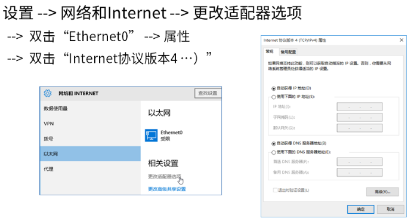
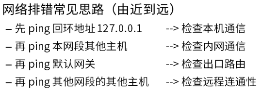
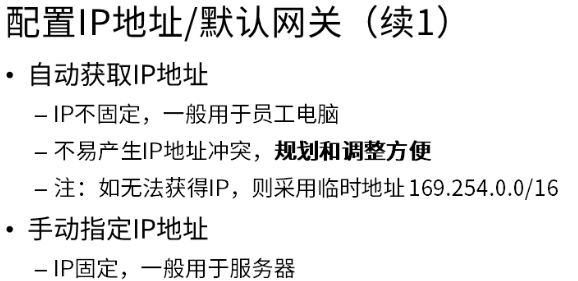

# 硬件设置
[[TOC]]
## 输入法设置
ctrl+shift调出输入法-->右键-->属性设置-->设置为简体 半角 中文 和中文时使用英文标点符号
nihao: 空格就是 "你好"
nihao: 回车就是 "nihao"
## 配置ip地址参数
控制面板\网络和 Internet\网络和共享中心\Ethernet0



### 验证配置结果





## win10基础快捷键
### ctrl快捷键
1)ctrl+x 剪切 (掌握)

2)ctrl+c 复制 (掌握)

3)ctrl+v 粘贴 (掌握)

4)ctrl+z 撤销操作 (掌握)

5)ctrl+y 恢复操作 (掌握)

6)ctrl+s 保存 (掌握)

7)ctrl+w 关闭标签

8)ctrl+shift 切换键盘布局(输入法) (掌握)

9)ctrl+a 选择文档或窗口中的所有项目 (掌握)
### win键
1)win+ a 打开操作中心

2)win+ d 显示桌面,重复按下会还原窗口 (掌握)

3)win+ e 打开资源管理器 (掌握)

4)win+ r 打开运行 (掌握)

5)win+ x 打开开始按钮右键菜单

6)win+ tab 显示所有已打开的应用和桌面 (掌握)

左上角新建视图

ctrl+win+左右方向键 切换视图 (掌握)

7)win+ i 打开设置

8)win+ u 查找设置

9)win+ L 锁定电脑 (掌握)

10)win+shift+s 屏幕截图

11)win+G 监控性能
## 文件夹共享
### 文件共享的基础设置
 **1.必须在网络互通的环境下(需要交换机)**
**2.文件共享设置的步骤流程**
1:在D盘创建文件夹--2201 (D:\2201)

2:选中 2201

3:右键-->属性-->共享

4:共享(s)-->下拉选项-->Everyone-->添加(A)-->共享(H)-->完成

(Everyone: 表示任何计算机)

5:高级共享(D)-->勾选 共享文件夹(S) -->共享名: **2201** -->确定

6:网络共享中心-->密码保护的共享-->关闭密码保护共享-->保存修改

7:关闭
### 隐藏的共享文件夹
1:在D盘创建文件夹--美男子 (D:\美男子)

2:选中 美男子

3:右键-->属性-->共享

4:共享(s)-->下拉选项-->Everyone-->添加(A)-->共享(H)-->完成

5:高级共享(D)-->取消勾选 共享文件夹(S) -->应用-->确定

6:高级共享(D)-->勾选 共享文件夹(S) -->共享名: **美男子$** -->确定

7:网络共享中心-->密码保护的共享-->关闭密码保护共享-->保存修改

8:关闭
### 关于共享文件夹的访问权限
1:选中 共享文件夹(例如:美男子)

2:右键-->属性-->共享

3:共享(s) -->Everyone-->读 或 读/写 -->共享(H)-->完成

(读:只允许读取

读/写: 读取 和 更改

)
## 基本Dos命令
### 什么是Dos
**Dos**: 纯DOS系统(MS-DOS微软的dos系统,是dos系统的代表)

和windows系统一样都是独立的操作系统;

但是目前我们提到的DOS主要是一种面向磁盘的系统软件,

被嵌入到windows系统当做一个组件(构成事物的一部分);

**Windows**: Windows采用了图形化模式--图形用户界面(GUI);

**当前的windows系统中包含的DOS系统，DOS系统只能算做是其中的一个组件而已;**
### Dos命令分内部命令和外部命令
**外部命令**是指在 计算机目录下看的见的命令,一般是**.exe**或**.com**为扩展名
**内部命令**是指集成在DOS系统中的命令,用DIR列表是看不见的,是无法删除的!

没有配置path的前提下,在任何目录下都可以运行执行的命令。

DOS 的命令分为内部命令和外部命令，内部命令是随 command.com 装入内存的，而外部命令是一条一条单独的可执行文件。 
内部命令都集中在根目录下的 command.com 文件里，电脑每次启动时都会将这个文件读入内存，也就是说在电脑运行时，这些内部命令都驻留在内存中，用 dir 是看不到这些内部命令的。而外部命令都是以一个个独立的文件存放在磁盘上的，它们都是以 com 和 exe 为后
缀的文件，它们并不常驻内存，只有在电脑需要时，才会被调入内存。
在文件目录下给出指令，就可以执行外部命令。

### 为什么学Dos
windows操作很多是基于dos的, 并且有些操作必须用dos去做,例如磁盘分区用等操作
```
--分区(磁盘共500G) 
		一个主分区  安装系统  c:  100G
		一个扩展分区
		  第一个逻辑分区 d: 200G
		  第二个逻辑分区 e: 500-100-200 G
	  一个主分区  ,一个扩展分区 ,多个逻辑分区
	使用diskpat命令进行分区:
	  --跳出命令窗口
	    笔记本:fn+shift+F10
	    台式机: shitf+F10(桌面空白处)
	  --打开diskpart分区工具
	    diskpart
	  --显示当前的硬盘
		list disk
	  --选中当前的硬盘
		select disk 0
	  --创建一个容量为100G的主分区
		create partition primary size=1000000
	  	partition分区 primary主分区
	  --创建一个扩展分区
		create partition extended(扩展分区)
	  --创建一个逻辑分区:D盘
		create partition logical(逻辑分区) size=2000000
	  --创建一个逻辑分区:E盘
		create partition logical
	  --退出
		exit exit
```
### Dos常见命令
dos命令操作在命令提示符中, 通过win+r-->cmd-->回车进入命令提示符;
```
命令 /? 命令的帮助
. 当前目录

.. 上一级目录

[ ] 表示可有可无

drive: 驱动(磁盘的分区)

path 路径 "D:\a\b\c"中的 \a\b\c

FileNmae 文件名

/A[[:]attributes] 参数A[:][属性]
```
#### dir
dir 是英文单词 directory(目录）的缩写，主要用来显示一个目录下的文件和子目录。
 
 #### cd
 cd 是英文 change directory(改变目录）的缩写，通过cd进入一个目录 。

 c:\>cd(切换目录) **去到驱动c: 的任何地方**
 c:\>cd(切换目录) /D  **去到其他驱动的任何地方**
 c:\Windows\System32> cd .. 去到c:\Windows\目录
 c:\Windows\System32>cd ..\.. 去到 c:\目录
 #### md和rd
 md(make directory--创建目录)和 rd(remove directory--删除目录)。
 ```
c:\>md 目录名 //在C盘的根目录下创建一个目录
c:\>rd 目录名 //在C盘的根目录下删除一个目录
```
使用rd命令注意:被移除的目录只能是空目录
#### copy
copy 在英文中是复制的意思
copy 命令的格式:
```
copy 源文件名 目标文件名
```
不指明驱动,则为当前驱动

不指明目录,则为当前目录

不指明文件名,则为当前文件名
```
不指明驱动,则为当前驱动 和 不指明目录,则为当前目录 
d:\a\b>copy b1.txt b2.txt
已复制         1 个文件。
发现d:\a\b\b1.txt 被拷贝了一份到d:\a\b\目录下,名字为b2.txt

不指明文件名,则为当前文件名
d:\a\b>copy d:\a\b\b1.txt d:\a
已复制         1 个文件。
发现在 d:\a目录下有个 b1.txt文件

建议使用全路径( diver: \path \FileNmae )
d:\a\b>copy  d:\a\b\b1.txt  d:\a\b\b3.txt
已复制         1 个文件。
```
#### del
del 即 delete（删除）的缩写， 作用是 删除文件;
copy 命令的格式:
```
del 文件名
```
```
删除 d:\a\b 目录下的 b1.txt
步骤1: 去到 d:\a\b 目录
步骤2: 输指令 del  文件名
步骤3: 回车(执行指令)

d:\a>cd d:\a\b
d:\a\b>del b1.txt
d:\a\b>

删除d:\a\b 目录下的所有txt格式的文件
步骤1: 去到 d:\a\b 目录
步骤2: 输指令 del  *.txt  //*.txt表示所有以txt为扩展名的文件
步骤3: 回车(执行指令)
d:\a>cd d:\a\b
d:\a\b>del *.txt
d:\a\b>

删除d:\a\b 目录下的所有文件
步骤1: 去到 d:\a\b 目录
步骤2: 输指令 del  *.* //*.txt表示所有文件
步骤3: 回车(执行指令)
d:\a>cd d:\a\b
d:\a\b>del *.*
d:\a\b\*.*, 是否确认(Y/N)? Y
 
```
#### help

