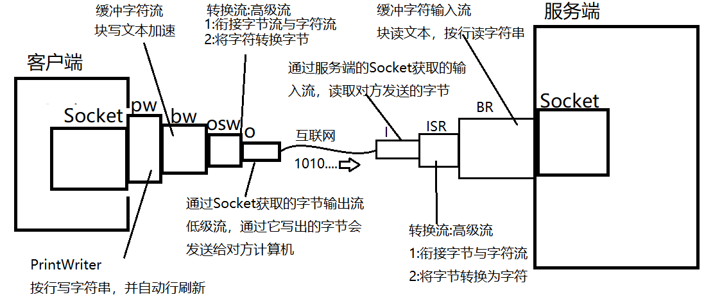
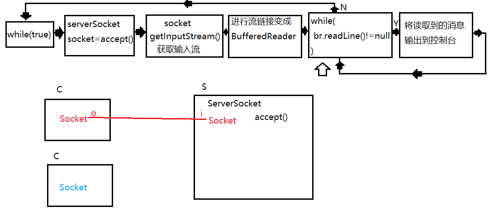
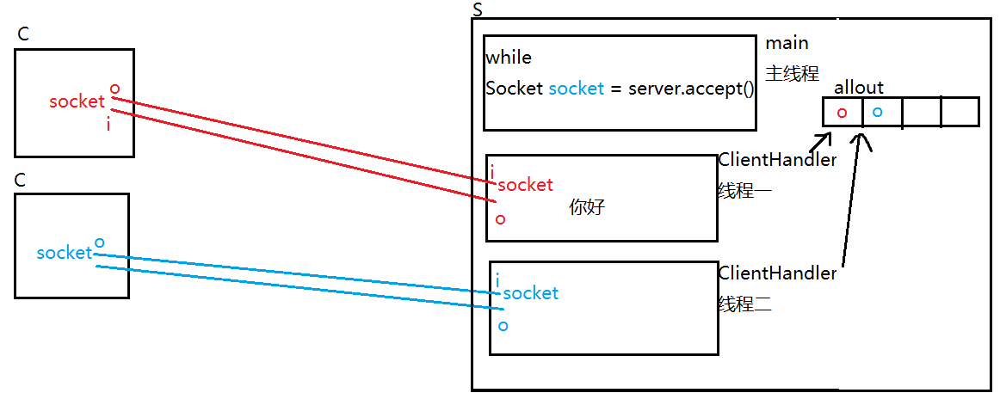
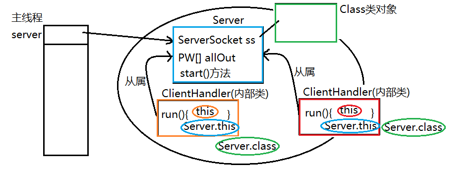

# 网络编程
[[TOC]]

网络编程是指编写运行在多个设备（计算机）的程序，这些设备都通过网络连接起来。`java.net` 包中 `J2SE` 的 `API` 包含有类和接口，它们提供低层次的通信细节。你可以直接使用这些类和接口，来专注于解决问题，而不用关注通信细节。

## Socket简介

网络上的两个程序通过一个双向的通信连接实现数据的交换，这个连接的一端称为一个 socket。

建立网络通信连接至少要一对端口号 (socket)。socket 本质是编程接口 (API)，**对 TCP/IP 的封装，TCP/IP 也要提供可供程序员做网络开发所用的接口，这就是 Socket 编程接口** ；HTTP 是轿车，提供了封装或者显示数据的具体形式；Socket 是发动机，提供了网络通信的能力。

Socket 的英文原义是“孔”或“插座”。作为 BSD UNIX 的进程通信机制，取后一种意思。通常也称作"套接字"，用于描述 IP 地址和端口，是一个通信链的句柄，可以用来实现不同虚拟机或不同计算机之间的通信。在 Internet 上的主机一般运行了多个服务软件，同时提供几种服务。**每种服务都打开一个 Socket，并绑定到一个端口上，不同的端口对应于不同的服务。**  Socket 正如其英文原义那样，像一个多孔插座。一台主机犹如布满各种插座的房间，每个插座有一个编号，有的插座提供 220 伏交流电， 有的提供 110 伏交流电，有的则提供有线电视节目。 客户软件将插头插到不同编号的插座，就可以得到不同的服务。

## TCP

**TCP（Transmission Control Protocol 传输控制协议）是一种面向连接的、可靠的、基于字节流的传输层通信协议** ，由 IETF 的 RFC 793 定义。在简化的计算机网络 OSI 模型中，它完成第四层传输层所指定的功能，用户数据报协议（UDP）是同一层内另一个重要的传输协议。在因特网协议族（Internet protocol suite）中，**TCP 层是位于 IP 层之上，应用层之下的中间层** 。不同主机的应用层之间经常需要可靠的、像管道一样的连接，**但是 IP 层不提供这样的流机制，而是提供不可靠的包交换。**

应用层向 TCP 层发送用于网间传输的、用 8 位字节表示的数据流，然后 TCP 把数据流分区成适当长度的报文段（通常受该计算机连接的网络的数据链路层的最大传输单元（MTU）的限制）。之后 TCP 把结果包传给 IP 层，由它来通过网络将包传送给接收端实体的 TCP 层。TCP 为了保证不发生丢包，就给每个包一个序号，同时序号也保证了传送到接收端实体的包的按序接收。然后接收端实体对已成功收到的包发回一个相应的确认（ACK）；如果发送端实体在合理的往返时延（RTT）内未收到确认，那么对应的数据包就被假设为已丢失将会被进行重传。**TCP 用一个校验和函数来检验数据是否有错误；在发送和接收时都要计算校验和。**

## UDP

UDP 是 User Datagram Protocol 的简称， 中文名是用户数据报协议，是 OSI（Open System Interconnection，开放式系统互联） 参考模型中 **一种无连接的传输层协议，提供面向事务的简单不可靠信息传送服务** ，IETF RFC 768 是 UDP 的正式规范。UDP 在 IP 报文的协议号是 17。

UDP 协议全称是用户数据报协议，在网络中它与 TCP 协议一样用于处理数据包，是一种无连接的协议。在 OSI 模型中，在第四层——传输层，**处于 IP 协议的上一层。** UDP 有不提供数据包分组、组装和不能对数据包进行排序的缺点，也就是说，**当报文发送之后，是无法得知其是否安全完整到达的。UDP 用来支持那些需要在计算机之间传输数据的网络应用。包括网络视频会议系统在内的众多的客户 / 服务器模式的网络应用都需要使用 UDP 协议。** UDP 协议从问世至今已经被使用了很多年，虽然其最初的光彩已经被一些类似协议所掩盖，但是即使是在今天 UDP 仍然不失为一项非常实用和可行的网络传输层协议。

与所熟知的 TCP（传输控制协议）协议一样，UDP 协议直接位于 IP（网际协议）协议的顶层。根据 OSI（开放系统互连）参考模型，**UDP 和 TCP 都属于传输层协议。UDP 协议的主要作用是将网络数据流量压缩成数据包的形式。** 一个典型的数据包就是一个二进制数据的传输单位。每一个数据包的前 8 个字节用来包含报头信息，剩余字节则用来包含具体的传输数据。

## HttpURLConnection

HttpURLConnection 位于 java.net 包中，支持 HTTP 特定功能。我们可以使用它来发起网络请求，获取服务器的相关资源。

HttpURLConnection 提供了很多方法用于使用 Http，这里只演示了使用 HttpURLConnection 类的基本流程，想要了解更多方法的同学可以查询[API 文档](https://docs.oracle.com/javase/8/docs/api/java/net/HttpURLConnection.html)。

```java
import java.io.BufferedReader;
import java.io.IOException;
import java.io.InputStream;
import java.io.InputStreamReader;
import java.net.HttpURLConnection;
import java.net.URL;

public class HttpUrlTest {
    public static void main(String[] args) {
        try {
            //设置url
            URL shiyanlou = new URL("https://www.lanqiao.cn");
            //打开连接
            HttpURLConnection urlConnection = (HttpURLConnection)shiyanlou.openConnection();
            //设置请求方法
            urlConnection.setRequestMethod("GET");
            //设置连接超时时间
            urlConnection.setConnectTimeout(1000);
            //获取输入流
            InputStream inputStream = urlConnection.getInputStream();
            BufferedReader bufferedReader = new BufferedReader(new InputStreamReader(inputStream));
            //打印结果
            bufferedReader.lines().forEach(System.out::println);
            //关闭连接
            inputStream.close();
            bufferedReader.close();
            urlConnection.disconnect();
        } catch (IOException e) {
            e.printStackTrace();
        }
    }
}
```


## InetAddress类

`InetAddress`类用于表示 IP 地址，比如在进行 Socket 编程时，就会使用到该类。

`InetAddress`没有公共构造方法，我们只能使用它提供的静态方法来构建一个 `InetAddress` 类实例

- `getLocalHost()`： 返回本地主机地址
- `getAllByName（String host）`：从指定的主机名返回 InetAddress 对象的数组，因为主机名可以与多个 IP 地址相关联。
- `getByAddress（byte [] addr）`：从原始 IP 地址的字节数组中返回一个 InetAddress 对象。
- `getByName（String host）`：根据提供的主机名创建一个 InetAddress 对象。
- `getHostAddress()`：返回文本表示的 IP 地址字符串。
- `getHostname()`：获取主机名。

```java
import java.net.InetAddress;
import java.net.UnknownHostException;

public class InetAddressDemo {
    public static void main(String[] args) {
        try {
            InetAddress shiyanlou = InetAddress.getByName("www.lanqiao.cn");
            //toString 方法将输出主机名和ip地址
            System.out.println(shiyanlou.toString());
            //获取ip地址
            String ip = shiyanlou.toString().split("/")[1];
            //根据IP地址获取主机名
            InetAddress byAddress = InetAddress.getByName(ip);
            System.out.println("get hostname by IP address:" + byAddress.getHostName());
            System.out.println("localhost: "+InetAddress.getLocalHost());
        } catch (UnknownHostException e) {
            e.printStackTrace();
        }
    }
}
```


## Socket

### java.net.Socket 

Socket(套接字)封装了TCP协议的通讯细节，是的我们使用它可以与服务端建立网络链接，并通过
它获取两个流(一个输入一个输出)，然后使用这两个流的读写操作完成与服务端的数据交互.


`Socket` 类代表一个客户端套接字，可以使用该类向服务器发送和接受数据。一般需要通过下面几个步骤：

1. 建立与服务器的连接；
2. 使用输出流将数据发送到服务器；
3. 使用输入流读取服务器返回的数据；
4. 关闭连接。

### 构造方法

Socket 常用构造方法：

- `Socket(InetAddress address, int port)`：创建一个套接字，连接到指定 IP 地址和端口的服务器
- `Socket(String host, int port)`：创建一个套接字，连接到指定的主机名和端口的服务器
- `Socket(InetAddress address, int port, InetAddress localAddr, int localPort)`：创建一个套接字连接到指定的 IP 地址和端口的服务器，并且显示的指定客户端地址和端口。

在创建 Socket 时，需要捕获异常。

### getOutputStream()

该方法可以获取输出流，在建立连接后，可以使用该方法获取输出流，发送数据到服务器。发送数据的方式和使用 IO 流是相同的，使用 write 方法发送指定的数据即可。

### getInputStream()

用户获取输入流，通过该方法获取输入流之后可以读取服务器发送来的数据。使用方法和 IO 流相同，使用 read 方法即可。

### close()

关闭 Socket，可能抛出 IO 异常，所以我们同样需要捕获异常。

## ServerSocket

### java.net.ServerSocket 

ServerSocket运行在服务端，作用有两个:

1:向系统申请服务端口，客户端的Socket就是通过这个端口与服务端建立连接的。

2:监听服务端口，一旦一个客户端通过该端口建立连接则会自动创建一个Socket，并通过该Socket与客户端进行数据交互。

**如果我们把Socket比喻为电话，那么ServerSocket相当于是某客服中心的总机。**


`ServerSocket`类用于实现服务器套接字，服务器套接字会等待客户端网络连接，与客户端连接之后，会进行一系列操作，然后将结果返回给客户端。

创建一个 `ServerSocket` 一般需要以下几个步骤：

1. 创建服务器套接字并将其绑定到特定的接口
2. 等待客户端连接
3. 通过客户端套接字获取输入流，从客户端读取数据
4. 通过客户端套接字获取输出流，发送数据到客户端
5. 关闭套接字

### 构造方法

常见构造方法：

- `ServerSocket()`：创建一个未绑定端口的服务器套接字。
- `ServerSocket(int port)`：创建绑定到指定端口号的服务器套接字。
- `ServerSocket(int port,int backlog)`：创建一个绑定到指定端口号的服务器套接字，并且`backlog` 参数指定了最大排队连接数。
- `ServerSocket(int port,int backlog,InetAddress bindAddr)`：创建服务器套接字并将其绑定到指定的端口号和本地 IP 地址。

示例：

```java
ServerSocket serverSocket = new ServerSocket(8888);
```

### accept()

用于监听客户端连接请求，当调用该方法时，会阻塞当前线程，直到有客户端发起请求与其建立连接，否则将一直等待。当连接成功后，将返回一个 `Socket` 对象。

### close()

用于关闭服务器套接字，服务器停止后，将断开所有连接。

### 其他方法

可以查阅[官方文档](https://docs.oracle.com/javase/8/docs/api/java/net/ServerSocket.html)。

## 实例

`java.net` 包提供了两个类 `Socket` 和 `ServerSocket`，分别实现 Socket 连接的客户端和服务器端。

我们编译一个简单的 Socket 应用，实现客户端发送信息给服务端，服务端再将信息发送回客户端的回显的功能。

```java
//EchoServer.java
import java.io.BufferedReader;
import java.io.IOException;
import java.io.InputStreamReader;
import java.io.PrintWriter;
import java.net.ServerSocket;
import java.net.Socket;


public class EchoServer {
    public static void main(String[] args) {
        try {
            //服务端需要使用ServerSocket类
            ServerSocket serverSocket = new ServerSocket(1080);
            //阻塞 等待客户端连接
            Socket client = serverSocket.accept();
            PrintWriter out = new PrintWriter(client.getOutputStream(), true);
            BufferedReader in = new BufferedReader(new InputStreamReader(client.getInputStream()));
            String userIn;
            while ((userIn = in.readLine()) != null) {
                System.out.println("收到客户端消息：" + userIn);
                //发回客户端
                out.println(userIn);
            }
        } catch (IOException e) {
            e.printStackTrace();
        }
    }
}

//EchoClient.java
import java.io.BufferedReader;
import java.io.IOException;
import java.io.InputStreamReader;
import java.io.PrintWriter;
import java.net.Socket;
import java.util.Scanner;

public class EchoClient {
    public static void main(String[] args) {
        String hostname = "127.0.0.1";
        //socket端口
        int port = 1080;
        Scanner userIn = new Scanner(System.in);
        try {
            //建立socket连接
            Socket socket = new Socket(hostname, port);
            //获取socket输出流
            PrintWriter out = new PrintWriter(socket.getOutputStream(), true);
            //获取输入流
            BufferedReader in = new BufferedReader(new InputStreamReader(socket.getInputStream()));
            String userInput;
            System.out.println("请输入信息：");
            //当用户输入exit时退出
            while (!"exit".equals(userInput = userIn.nextLine())) {
                out.println(userInput);
                System.out.println("收到服务端回应:" + in.readLine());
            }
            //关闭socket
            socket.close();
        } catch (IOException e) {
            e.printStackTrace();
        }
    }
}
```

打开两个 terminal，一个运行服务端，一个运行客户端。

首先启动服务端，不能先启动客户端，否则报错。

服务端启动命令：

```bash
$ javac EchoServer.java
$ java EchoServer
```

接着切换到客户端 terminal。客户端启动命令

```bash
$ javac EchoClient.java
$ java EchoClient
```

### 与服务端建立连接案例



客户端代码:

```java
package socket;

import java.io.*;
import java.net.Socket;

/**
 * 聊天室客户端
 */
public class Client {
    /*
        java.net.Socket 套接字
        Socket封装了TCP协议的通讯细节，是的我们使用它可以与服务端建立网络链接，并通过
        它获取两个流(一个输入一个输出)，然后使用这两个流的读写操作完成与服务端的数据交互
     */
    private Socket socket;

    /**
     * 构造方法，用来初始化客户端
     */
    public Client(){
        try {
            /*
                实例化Socket时通常需要传入两个参数:
                参数1:服务端的地址信息(IP地址，如果连接本机则可用:localhost)
                参数2:服务端打开的服务端口，即:服务端ServerSocket申请的端口

                实例化Socket的过程就是连接服务端的过程，如果指定的地址与端口对应的
                服务端没有启动，或者输入信息有误导致无法连接时，会抛出下面的异常:
                java.net.ConnectException: Connection refused: connect
                提示连接拒绝。注:导致这个问题还有一种情况，服务端机器没有关闭防火墙。
             */
            System.out.println("正在连接服务端...");
            socket = new Socket("localhost",8088);
            System.out.println("与服务端成功建立连接!");
        } catch (IOException e) {
            e.printStackTrace();
        }
    }

    /**
     * 客户端开始工作的方法
     */
    public void start(){
       
    }

    public static void main(String[] args) {
        Client client = new Client();//Client的构造方法被调用
        client.start();//start方法被调用，开始工作
    }
}

```


服务端代码:

```java
package socket;

import java.io.BufferedReader;
import java.io.IOException;
import java.io.InputStream;
import java.io.InputStreamReader;
import java.net.ServerSocket;
import java.net.Socket;

/**
 * 聊天室服务端
 */
public class Server {
    /*
        运行在服务端的ServerSocket主要有两个作用
        1:向系统申请服务端口，客户端的Socket就是通过这个端口与服务端建立连接的。
        2:监听服务端口，一旦一个客户端通过该端口建立连接会自动创建一个Socket，服务端
          就可以通过这个Socket与客户端交互了。

        如果我们把Socket比喻为电话，那么ServerSocket相当于是某客服中心的总机。
     */
    private ServerSocket serverSocket;

    public Server(){
        try {
            System.out.println("正在启动服务端...");
            /*
                实例化是要指定服务端口，如果该端口被当前系统其他应用程序占用时，会
                抛出异常:java.net.BindException:address already in use
             */
            serverSocket = new ServerSocket(8088);
            System.out.println("服务端启动完毕");
        } catch (IOException e) {
            e.printStackTrace();
        }
    }

    public void start(){
        try {
            /*
                ServerSocket提供的方法:
                Socket accept()
                该方法是一个阻塞方法，调用后程序进入阻塞状态("卡住"),直到一个客户端
                实例化Socket与当前客户端建立连接，此时accept方法会立即返回一个Socket
实例，服务端通过它就可以与客户端交互了。

                可以理解为这个动作相当于是总机的"接电话"操作。
             */
            System.out.println("等待客户端连接...");
            Socket socket = serverSocket.accept();
            System.out.println("一个客户端连接了!");

        } catch (IOException e) {
            e.printStackTrace();
        }
    }

    public static void main(String[] args) {
        Server server = new Server();
        server.start();
    }
}
```


### 客户端与服务端完成第一次通讯(发送一行字符串)

**Socket提供了两个重要的方法:**

OutputStream getOutputStream()

该方法会获取一个字节输出流，通过这个输出流写出的字节数据会通过网络发送给对方。


InputStream getInputStream()

通过该方法获取的字节输入流读取的是远端计算机发送过来的数据。

客户端代码:

```java
package socket;

import java.io.*;
import java.net.Socket;

/**
 * 聊天室客户端
 */
public class Client {
    /*
        java.net.Socket 套接字
        Socket封装了TCP协议的通讯细节，是的我们使用它可以与服务端建立网络链接，并通过
        它获取两个流(一个输入一个输出)，然后使用这两个流的读写操作完成与服务端的数据交互
     */
    private Socket socket;

    /**
     * 构造方法，用来初始化客户端
     */
    public Client(){
        try {
            /*
                实例化Socket时通常需要传入两个参数:
                参数1:服务端的地址信息(IP地址，如果连接本机则可用:localhost)
                参数2:服务端打开的服务端口，即:服务端ServerSocket申请的端口

                实例化Socket的过程就是连接服务端的过程，如果指定的地址与端口对应的
                服务端没有启动，或者输入信息有误导致无法连接时，会抛出下面的异常:
                java.net.ConnectException: Connection refused: connect
                提示连接拒绝。注:导致这个问题还有一种情况，服务端机器没有关闭防火墙。
             */
            System.out.println("正在连接服务端...");
            socket = new Socket("localhost",8088);
            System.out.println("与服务端成功建立连接!");
        } catch (IOException e) {
            e.printStackTrace();
        }
    }

    /**
     * 客户端开始工作的方法
     */
    public void start(){
        try {
            /*
                Socket提供的方法:
                OutputStream getOutputStream()
                该方法会获取一个字节输出流，通过这个输出流写出的字节数据会通过网络
                发送给对方。
             */
            OutputStream out = socket.getOutputStream();
            PrintWriter pw = new PrintWriter(//高级流，按行写，自动行刷新
                    new BufferedWriter(//高级流，块写文本，加速写
                            new OutputStreamWriter(//高级流，字符转字节，衔接字符与字节流
                                    out,"UTF-8"//低级流，将数据发送给对方计算机
                            )
                    ),true
            );

            pw.println("你好服务端!");

        } catch (IOException e) {
            e.printStackTrace();
        }

    }

    public static void main(String[] args) {
        Client client = new Client();//Client的构造方法被调用
        client.start();//start方法被调用，开始工作
    }
}
```

服务端代码:

```java
package socket;

import java.io.BufferedReader;
import java.io.IOException;
import java.io.InputStream;
import java.io.InputStreamReader;
import java.net.ServerSocket;
import java.net.Socket;

/**
 * 聊天室服务端
 */
public class Server {
    /*
        运行在服务端的ServerSocket主要有两个作用
        1:向系统申请服务端口，客户端的Socket就是通过这个端口与服务端建立连接的。
        2:监听服务端口，一旦一个客户端通过该端口建立连接会自动创建一个Socket，服务端
          就可以通过这个Socket与客户端交互了。

        如果我们把Socket比喻为电话，那么ServerSocket相当于是某客服中心的总机。
     */
    private ServerSocket serverSocket;

    public Server(){
        try {
            System.out.println("正在启动服务端...");
            /*
                实例化是要指定服务端口，如果该端口被当前系统其他应用程序占用时，会
                抛出异常:java.net.BindException:address already in use
             */
            serverSocket = new ServerSocket(8088);
            System.out.println("服务端启动完毕");
        } catch (IOException e) {
            e.printStackTrace();
        }
    }

    public void start(){
        try {
            /*
                ServerSocket提供的方法:
                Socket accept()
                该方法是一个阻塞方法，调用后程序进入阻塞状态("卡住"),直到一个客户端
                实例化Socket与当前客户端建立连接，此时accept方法会立即返回一个Socket
                实例，服务端通过它就可以与客户端交互了。

                可以理解为这个动作相当于是总机的"接电话"操作。
             */
            System.out.println("等待客户端连接...");
            Socket socket = serverSocket.accept();
            System.out.println("一个客户端连接了!");

            /*
                Socket提供的方法:
                InputStream getInputStream()
                通过该方法获取的字节输入流读取的是远端计算机发送过来的数据。

                这里相当于是读取当前服务端中这个Socket对应的远端(客户端)那边Socket获取
                的输出流写出的字节数据。
             */
            InputStream in = socket.getInputStream();
            InputStreamReader isr = new InputStreamReader(in,"UTF-8");
            BufferedReader br = new BufferedReader(isr);
            String line = br.readLine();
            System.out.println("服务端说:"+line);


        } catch (IOException e) {
            e.printStackTrace();
        }
    }

    public static void main(String[] args) {
        Server server = new Server();
        server.start();
    }
}
```

### 完成客户端可以一直与服务端发送消息的操作

客户端代码:

```java
package socket;

import java.io.*;
import java.net.Socket;
import java.util.Scanner;

/**
 * 聊天室客户端
 */
public class Client {
    /*
        java.net.Socket 套接字
        Socket封装了TCP协议的通讯细节，是的我们使用它可以与服务端建立网络链接，并通过
        它获取两个流(一个输入一个输出)，然后使用这两个流的读写操作完成与服务端的数据交互
     */
    private Socket socket;

    /**
     * 构造方法，用来初始化客户端
     */
    public Client(){
        try {
            /*
                实例化Socket时通常需要传入两个参数:
                参数1:服务端的地址信息(IP地址，如果连接本机则可用:localhost)
                参数2:服务端打开的服务端口，即:服务端ServerSocket申请的端口

                实例化Socket的过程就是连接服务端的过程，如果指定的地址与端口对应的
                服务端没有启动，或者输入信息有误导致无法连接时，会抛出下面的异常:
                java.net.ConnectException: Connection refused: connect
                提示连接拒绝。注:导致这个问题还有一种情况，服务端机器没有关闭防火墙。
             */
            System.out.println("正在连接服务端...");
            socket = new Socket("localhost",8088);
            System.out.println("与服务端成功建立连接!");
        } catch (IOException e) {
            e.printStackTrace();
        }
    }

    /**
     * 客户端开始工作的方法
     */
    public void start(){
        try(
            /*
                Socket提供的方法:
                OutputStream getOutputStream()
                该方法会获取一个字节输出流，通过这个输出流写出的字节数据会通过网络
                发送给对方。
             */
                OutputStream out = socket.getOutputStream();
                PrintWriter pw = new PrintWriter(//高级流，按行写，自动行刷新
                        new BufferedWriter(//高级流，块写文本，加速写
                                new OutputStreamWriter(//高级流，字符转字节，衔接字符与字节流
                                        out,"UTF-8"//低级流，将数据发送给对方计算机
                                )
                        ),true
                );
        ){
            Scanner scanner = new Scanner(System.in);
            System.out.println("开始聊天吧!单独输入exit时推出!");
            while(true) {
                String line = scanner.nextLine();
                if("exit".equals(line)){
                    break;
                }
                pw.println(line);
            }

        } catch (IOException e) {
            e.printStackTrace();
        }finally{
            try {
                socket.close();//最终和对方断开连接
            } catch (IOException e) {
                e.printStackTrace();
            }
        }

    }

    public static void main(String[] args) {
        Client client = new Client();//Client的构造方法被调用
        client.start();//start方法被调用，开始工作
    }
}

```

服务端代码:

```java
package socket;

import java.io.BufferedReader;
import java.io.IOException;
import java.io.InputStream;
import java.io.InputStreamReader;
import java.net.ServerSocket;
import java.net.Socket;

/**
 * 聊天室服务端
 */
public class Server {
    /*
        运行在服务端的ServerSocket主要有两个作用
        1:向系统申请服务端口，客户端的Socket就是通过这个端口与服务端建立连接的。
        2:监听服务端口，一旦一个客户端通过该端口建立连接会自动创建一个Socket，服务端
          就可以通过这个Socket与客户端交互了。

        如果我们把Socket比喻为电话，那么ServerSocket相当于是某客服中心的总机。
     */
    private ServerSocket serverSocket;

    public Server(){
        try {
            System.out.println("正在启动服务端...");
            /*
                实例化是要指定服务端口，如果该端口被当前系统其他应用程序占用时，会
                抛出异常:java.net.BindException:address already in use
             */
            serverSocket = new ServerSocket(8088);
            System.out.println("服务端启动完毕");
        } catch (IOException e) {
            e.printStackTrace();
        }
    }

    public void start(){
        try {
            /*
                ServerSocket提供的方法:
                Socket accept()
                该方法是一个阻塞方法，调用后程序进入阻塞状态("卡住"),直到一个客户端
                实例化Socket与当前客户端建立连接，此时accept方法会立即返回一个Socket
                实例，服务端通过它就可以与客户端交互了。

                可以理解为这个动作相当于是总机的"接电话"操作。
             */
            System.out.println("等待客户端连接...");
            Socket socket = serverSocket.accept();
            System.out.println("一个客户端连接了!");

            /*
                Socket提供的方法:
                InputStream getInputStream()
                通过该方法获取的字节输入流读取的是远端计算机发送过来的数据。

                这里相当于是读取当前服务端中这个Socket对应的远端(客户端)那边Socket获取
                的输出流写出的字节数据。
             */
            InputStream in = socket.getInputStream();
            InputStreamReader isr = new InputStreamReader(in,"UTF-8");
            BufferedReader br = new BufferedReader(isr);

            String line;
            while((line = br.readLine()) != null) {
                System.out.println("服务端说:"+line);
            }


        } catch (IOException e) {
            e.printStackTrace();
        }
    }

    public static void main(String[] args) {
        Server server = new Server();
        server.start();
    }
}

```

注意，当客户端输入exit退出时，要在finally中将socket关闭掉，否则服务端循环读取客户端发送消息的地方会抛出异常:

java.net.SocketException: Connection reset


### 多客户端连接服务端

现象:第一个客户端连接后发送消息，服务端可以正常接收。但是第二个客户端连接后发送消息服务端无法接收。

原因:服务端通过调用ServerSocket的accept来接受客户端的连接(相当于接电话)。现在服务端的实现只调用过一次accept,因此只接受了第一个客户端的连接。

解决:只有多次调用accept方法，才能接受所有客户端的连接。

测试:将服务端的代码改为下面情况，测试多客户端连接会显示每个客户端的连接服务端都可以正常接受了!

```java
package socket;

import java.io.BufferedReader;
import java.io.IOException;
import java.io.InputStream;
import java.io.InputStreamReader;
import java.net.ServerSocket;
import java.net.Socket;

/**
 * 聊天室服务端
 */
public class Server {
    /*
        运行在服务端的ServerSocket主要有两个作用
        1:向系统申请服务端口，客户端的Socket就是通过这个端口与服务端建立连接的。
        2:监听服务端口，一旦一个客户端通过该端口建立连接会自动创建一个Socket，服务端
          就可以通过这个Socket与客户端交互了。

        如果我们把Socket比喻为电话，那么ServerSocket相当于是某客服中心的总机。
     */
    private ServerSocket serverSocket;

    public Server(){
        try {
            System.out.println("正在启动服务端...");
            /*
                实例化是要指定服务端口，如果该端口被当前系统其他应用程序占用时，会
                抛出异常:java.net.BindException:address already in use
             */
            serverSocket = new ServerSocket(8088);
            System.out.println("服务端启动完毕");
        } catch (IOException e) {
            e.printStackTrace();
        }
    }

    public void start(){
        try {
            /*
                ServerSocket提供的方法:
                Socket accept()
                该方法是一个阻塞方法，调用后程序进入阻塞状态("卡住"),直到一个客户端
                实例化Socket与当前客户端建立连接，此时accept方法会立即返回一个Socket
                实例，服务端通过它就可以与客户端交互了。

                可以理解为这个动作相当于是总机的"接电话"操作。
             */
            while(true) {//循环调用accept方法
                System.out.println("等待客户端连接...");
                Socket socket = serverSocket.accept();
                System.out.println("一个客户端连接了!");
            }

            /*
                Socket提供的方法:
                InputStream getInputStream()
                通过该方法获取的字节输入流读取的是远端计算机发送过来的数据。

                这里相当于是读取当前服务端中这个Socket对应的远端(客户端)那边Socket获取
                的输出流写出的字节数据。
             */
//            InputStream in = socket.getInputStream();
//            InputStreamReader isr = new InputStreamReader(in,"UTF-8");
//            BufferedReader br = new BufferedReader(isr);
//
//            String line;
//            while((line = br.readLine()) != null) {
//                System.out.println("服务端说:"+line);
//            }


        } catch (IOException e) {
            e.printStackTrace();
        }
    }

    public static void main(String[] args) {
        Server server = new Server();
        server.start();
    }
}
```


新的问题:当我们希望同时接收多个客户端连接，又能同时收到它们发送的消息时，实现不了这样的效果。

```java
package socket;

import java.io.BufferedReader;
import java.io.IOException;
import java.io.InputStream;
import java.io.InputStreamReader;
import java.net.ServerSocket;
import java.net.Socket;

/**
 * 聊天室服务端
 */
public class Server {
    /*
        运行在服务端的ServerSocket主要有两个作用
        1:向系统申请服务端口，客户端的Socket就是通过这个端口与服务端建立连接的。
        2:监听服务端口，一旦一个客户端通过该端口建立连接会自动创建一个Socket，服务端
          就可以通过这个Socket与客户端交互了。

        如果我们把Socket比喻为电话，那么ServerSocket相当于是某客服中心的总机。
     */
    private ServerSocket serverSocket;

    public Server(){
        try {
            System.out.println("正在启动服务端...");
            /*
                实例化是要指定服务端口，如果该端口被当前系统其他应用程序占用时，会
                抛出异常:java.net.BindException:address already in use
             */
            serverSocket = new ServerSocket(8088);
            System.out.println("服务端启动完毕");
        } catch (IOException e) {
            e.printStackTrace();
        }
    }

    public void start(){
        try {
            /*
                ServerSocket提供的方法:
                Socket accept()
                该方法是一个阻塞方法，调用后程序进入阻塞状态("卡住"),直到一个客户端
                实例化Socket与当前客户端建立连接，此时accept方法会立即返回一个Socket
                实例，服务端通过它就可以与客户端交互了。

                可以理解为这个动作相当于是总机的"接电话"操作。
             */
            while(true) {
                System.out.println("等待客户端连接...");
                Socket socket = serverSocket.accept();
                System.out.println("一个客户端连接了!");
                /*
                    Socket提供的方法:
                    InputStream getInputStream()
                    通过该方法获取的字节输入流读取的是远端计算机发送过来的数据。

                    这里相当于是读取当前服务端中这个Socket对应的远端(客户端)那边Socket获取
                    的输出流写出的字节数据。
                 */
                InputStream in = socket.getInputStream();
                InputStreamReader isr = new InputStreamReader(in,"UTF-8");
                BufferedReader br = new BufferedReader(isr);

                String line;
                while((line = br.readLine()) != null) {
                    System.out.println("服务端说:"+line);
                }

            }

        } catch (IOException e) {
            e.printStackTrace();
        }
    }

    public static void main(String[] args) {
        Server server = new Server();
        server.start();
    }
}
```

读取客户端发送消息的while循环会卡住外层while循环。执行流程如下:



### 实现服务端发送消息给客户端

在服务端通过Socket获取输出流,客户端获取输入流,实现服务端将消息发送给客户端.

这里让服务端直接将客户端发送过来的消息再回复给客户端来进行测试.

客户端

```java
package socket;

import java.io.*;
import java.net.Socket;
import java.util.Scanner;

/**
 * 聊天室客户端
 */
public class Client {
    /*
        java.net.Socket 套接字
        Socket封装了TCP协议的通讯细节，是的我们使用它可以与服务端建立网络链接，并通过
        它获取两个流(一个输入一个输出)，然后使用这两个流的读写操作完成与服务端的数据交互
     */
    private Socket socket;

    /**
     * 构造方法，用来初始化客户端
     */
    public Client(){
        try {
            /*
                实例化Socket时通常需要传入两个参数:
                参数1:服务端的地址信息(IP地址，如果连接本机则可用:localhost)
                参数2:服务端打开的服务端口，即:服务端ServerSocket申请的端口

                实例化Socket的过程就是连接服务端的过程，如果指定的地址与端口对应的
                服务端没有启动，或者输入信息有误导致无法连接时，会抛出下面的异常:
                java.net.ConnectException: Connection refused: connect
                提示连接拒绝。注:导致这个问题还有一种情况，服务端机器没有关闭防火墙。
             */
            System.out.println("正在连接服务端...");
            socket = new Socket("localhost",8088);
            System.out.println("与服务端成功建立连接!");
        } catch (IOException e) {
            e.printStackTrace();
        }
    }

    /**
     * 客户端开始工作的方法
     */
    public void start(){
        try(
            /*
                Socket提供的方法:
                OutputStream getOutputStream()
                该方法会获取一个字节输出流，通过这个输出流写出的字节数据会通过网络
                发送给对方。
             */
                OutputStream out = socket.getOutputStream();
                PrintWriter pw = new PrintWriter(//高级流，按行写，自动行刷新
                        new BufferedWriter(//高级流，块写文本，加速写
                                new OutputStreamWriter(//高级流，字符转字节，衔接字符与字节流
                                        out,"UTF-8"//低级流，将数据发送给对方计算机
                                )
                        ),true
                );

                BufferedReader br = new BufferedReader(
                        new InputStreamReader(
                                socket.getInputStream(),"UTF-8"
                        )
                )

        ){
            Scanner scanner = new Scanner(System.in);
            System.out.println("开始聊天吧!单独输入exit时推出!");
            while(true) {
                String line = scanner.nextLine();
                if("exit".equals(line)){
                    break;
                }
                pw.println(line);
                //读取服务端发送过来的一句话
                line = br.readLine();
                System.out.println(line);
            }

        } catch (IOException e) {
            e.printStackTrace();
        }finally{
            try {
                socket.close();//最终和对方断开连接
            } catch (IOException e) {
                e.printStackTrace();
            }
        }

    }

    public static void main(String[] args) {
        Client client = new Client();//Client的构造方法被调用
        client.start();//start方法被调用，开始工作
    }
}
```

服务端

```java
package socket;

import java.io.*;
import java.net.ServerSocket;
import java.net.Socket;

/**
 * 聊天室服务端
 */
public class Server {
    /*
        运行在服务端的ServerSocket主要有两个作用
        1:向系统申请服务端口，客户端的Socket就是通过这个端口与服务端建立连接的。
        2:监听服务端口，一旦一个客户端通过该端口建立连接会自动创建一个Socket，服务端
          就可以通过这个Socket与客户端交互了。

        如果我们把Socket比喻为电话，那么ServerSocket相当于是某客服中心的总机。
     */
    private ServerSocket serverSocket;

    public Server(){
        try {
            System.out.println("正在启动服务端...");
            /*
                实例化是要指定服务端口，如果该端口被当前系统其他应用程序占用时，会
                抛出异常:java.net.BindException:address already in use
             */
            serverSocket = new ServerSocket(8088);
            System.out.println("服务端启动完毕");
        } catch (IOException e) {
            e.printStackTrace();
        }
    }

    public void start(){
        try {
            /*
                ServerSocket提供的方法:
                Socket accept()
                该方法是一个阻塞方法，调用后程序进入阻塞状态("卡住"),直到一个客户端
                实例化Socket与当前客户端建立连接，此时accept方法会立即返回一个Socket
                实例，服务端通过它就可以与客户端交互了。

                可以理解为这个动作相当于是总机的"接电话"操作。
             */
            while(true) {
                System.out.println("等待客户端连接...");
                Socket socket = serverSocket.accept();
                System.out.println("一个客户端连接了!");
                //启动一个线程来负责与该客户端交互
                //1创建线程任务
                ClientHandler handler = new ClientHandler(socket);
                //2创建一个线程并执行该任务
                Thread t = new Thread(handler);
                //3启动该线程
                t.start();
            }

        } catch (IOException e) {
            e.printStackTrace();
        }
    }

    public static void main(String[] args) {
        Server server = new Server();
        server.start();
    }

    /**
     * 该线程任务用于与指定的客户端进行交互。
     * 每个连接服务端的客户端都是通过该线程进行交互的。即:一个客户端靠一个该线程进行交互
     */
    private class ClientHandler implements Runnable{
        private Socket socket;
        private String host;//当前线程处理的客户端的地址信息

        public ClientHandler(Socket socket){
            this.socket = socket;
            //通过socket获取远端计算机地址信息(对于服务端而言，远端就是客户端)
            host = socket.getInetAddress().getHostAddress();
        }

        public void run(){
            try{
                /*
                    Socket提供的方法:
                    InputStream getInputStream()
                    通过该方法获取的字节输入流读取的是远端计算机发送过来的数据。

                    这里相当于是读取当前服务端中这个Socket对应的远端(客户端)那边Socket获取
                    的输出流写出的字节数据。
                 */
                InputStream in = socket.getInputStream();
                InputStreamReader isr = new InputStreamReader(in,"UTF-8");
                BufferedReader br = new BufferedReader(isr);

                PrintWriter pw = new PrintWriter(
                        new BufferedWriter(
                                new OutputStreamWriter(
                                        socket.getOutputStream(),
                                        "UTF-8"
                                )
                        ),true
                );

                String line;
                while((line = br.readLine()) != null) {
                    System.out.println(host+"说:"+line);
                    //将消息回复给当前客户端
                    pw.println(host+"说:"+line);
                }
            }catch(IOException e){
                e.printStackTrace();
            }
        }
    }
}
```


### 服务端转发消息给所有客户端

当一个客户端发送一个消息后,服务端收到后如何转发给所有客户端.

问题:例如红色的线程一收到客户端消息后如何获取到蓝色的线程二中的输出流?得不到就无法将消息转发给蓝色的客户端(进一步延伸就是无法转发给所有其他客户端)

解决:内部类可以访问外部类的成员,因此在Server类上定义一个数组allOut可以被所有内部类ClientHandler实例访问.从而将这些ClientHandler实例之间想互访的数据存放在这个数组中达到共享数据的目的.对此只需要将所有ClientHandler中的输出流都存入到数组allOut中就可以达到互访输出流转发消息的目的了.



服务端代码:

```java
package socket;

import java.io.*;
import java.net.ServerSocket;
import java.net.Socket;
import java.util.Arrays;

/**
 * 聊天室服务端
 */
public class Server {
    /*
        运行在服务端的ServerSocket主要有两个作用
        1:向系统申请服务端口，客户端的Socket就是通过这个端口与服务端建立连接的。
        2:监听服务端口，一旦一个客户端通过该端口建立连接会自动创建一个Socket，服务端
          就可以通过这个Socket与客户端交互了。

        如果我们把Socket比喻为电话，那么ServerSocket相当于是某客服中心的总机。
     */
    private ServerSocket serverSocket;
    /*
        内部类可以访问外部类的成员,因此在Server类上定义一个数组allOut可以被所有
        内部类ClientHandler实例访问.从而将这些ClientHandler实例之间想互访的数据
        存放在这个数组中达到共享数据的目的
     */
    private PrintWriter[] allOut = {};

    public Server(){
        try {
            System.out.println("正在启动服务端...");
            /*
                实例化是要指定服务端口，如果该端口被当前系统其他应用程序占用时，会
                抛出异常:java.net.BindException:address already in use
             */
            serverSocket = new ServerSocket(8088);
            System.out.println("服务端启动完毕");
        } catch (IOException e) {
            e.printStackTrace();
        }
    }

    public void start(){
        try {
            /*
                ServerSocket提供的方法:
                Socket accept()
                该方法是一个阻塞方法，调用后程序进入阻塞状态("卡住"),直到一个客户端
                实例化Socket与当前客户端建立连接，此时accept方法会立即返回一个Socket
                实例，服务端通过它就可以与客户端交互了。

                可以理解为这个动作相当于是总机的"接电话"操作。
             */
            while(true) {
                System.out.println("等待客户端连接...");
                Socket socket = serverSocket.accept();
                System.out.println("一个客户端连接了!");
                //启动一个线程来负责与该客户端交互
                //1创建线程任务
                ClientHandler handler = new ClientHandler(socket);
                //2创建一个线程并执行该任务
                Thread t = new Thread(handler);
                //3启动该线程
                t.start();
            }

        } catch (IOException e) {
            e.printStackTrace();
        }
    }

    public static void main(String[] args) {
        Server server = new Server();
        server.start();
    }

    /**
     * 该线程任务用于与指定的客户端进行交互。
     * 每个连接服务端的客户端都是通过该线程进行交互的。即:一个客户端靠一个该线程进行交互
     */
    private class ClientHandler implements Runnable{
        private Socket socket;
        private String host;//当前线程处理的客户端的地址信息

        public ClientHandler(Socket socket){
            this.socket = socket;
            //通过socket获取远端计算机地址信息(对于服务端而言，远端就是客户端)
            host = socket.getInetAddress().getHostAddress();
        }

        public void run(){
            try{
                /*
                    Socket提供的方法:
                    InputStream getInputStream()
                    通过该方法获取的字节输入流读取的是远端计算机发送过来的数据。

                    这里相当于是读取当前服务端中这个Socket对应的远端(客户端)那边Socket获取
                    的输出流写出的字节数据。
                 */
                InputStream in = socket.getInputStream();
                InputStreamReader isr = new InputStreamReader(in,"UTF-8");
                BufferedReader br = new BufferedReader(isr);

                PrintWriter pw = new PrintWriter(
                        new BufferedWriter(
                                new OutputStreamWriter(
                                        socket.getOutputStream(),
                                        "UTF-8"
                                )
                        ),true
                );
                /*
                    将该输出流存入共享数组allOut中,便于其他ClientHandler将消息
                    发送给当前客户端
                 */
                //1对allOut数组扩容
                allOut = Arrays.copyOf(allOut,allOut.length+1);
                //2将输出流存入数组最后一个位置
                allOut[allOut.length-1] = pw;

                System.out.println(host+"上线了,当前在线人数:"+allOut.length);

                String line;
                while((line = br.readLine()) != null) {
                    System.out.println(host+"说:"+line);
                    //将消息回复给所有客户端
                    for(int i=0;i<allOut.length;i++) {
                        allOut[i].println(host + "说:" + line);
                    }
                }
            }catch(IOException e){
                e.printStackTrace();
            }
        }
    }
}
```


### 客户端解决收发消息的冲突问题

由于客户端start方法中循环进行的操作顺序是先通过控制台输入一句话后将其发送给服务端,然后再读取服务端发送回来的一句话.这导致如果客户端不输入内容就无法收到服务端发送过来的其他信息(其他客户端的聊天内容).因此要将客户端中接收消息的工作移动到一个单独的线程上执行,才能保证收发消息互不打扰.

客户端代码:

```java
package socket;

import java.io.*;
import java.net.Socket;
import java.util.Scanner;

/**
 * 聊天室客户端
 */
public class Client {
    /*
        java.net.Socket 套接字
        Socket封装了TCP协议的通讯细节，是的我们使用它可以与服务端建立网络链接，并通过
        它获取两个流(一个输入一个输出)，然后使用这两个流的读写操作完成与服务端的数据交互
     */
    private Socket socket;

    /**
     * 构造方法，用来初始化客户端
     */
    public Client(){
        try {
            /*
                实例化Socket时通常需要传入两个参数:
                参数1:服务端的地址信息(IP地址，如果连接本机则可用:localhost)
                参数2:服务端打开的服务端口，即:服务端ServerSocket申请的端口

                实例化Socket的过程就是连接服务端的过程，如果指定的地址与端口对应的
                服务端没有启动，或者输入信息有误导致无法连接时，会抛出下面的异常:
                java.net.ConnectException: Connection refused: connect
                提示连接拒绝。注:导致这个问题还有一种情况，服务端机器没有关闭防火墙。
             */
            System.out.println("正在连接服务端...");
            socket = new Socket("localhost",8088);
            System.out.println("与服务端成功建立连接!");
        } catch (IOException e) {
            e.printStackTrace();
        }
    }

    /**
     * 客户端开始工作的方法
     */
    public void start(){
        //客户端启动后,先启动一个线程用来读取服务端发送过来的消息
        ServerHandler handler = new ServerHandler();
        Thread t = new Thread(handler);
        t.start();

        try(
            /*
                Socket提供的方法:
                OutputStream getOutputStream()
                该方法会获取一个字节输出流，通过这个输出流写出的字节数据会通过网络
                发送给对方。
             */
                OutputStream out = socket.getOutputStream();
                PrintWriter pw = new PrintWriter(//高级流，按行写，自动行刷新
                        new BufferedWriter(//高级流，块写文本，加速写
                                new OutputStreamWriter(//高级流，字符转字节，衔接字符与字节流
                                        out,"UTF-8"//低级流，将数据发送给对方计算机
                                )
                        ),true
                );
        ){
            Scanner scanner = new Scanner(System.in);
            System.out.println("开始聊天吧!单独输入exit时推出!");
            while(true) {
                String line = scanner.nextLine();
                if("exit".equals(line)){
                    break;
                }
                pw.println(line);
            }

        } catch (IOException e) {
            e.printStackTrace();
        }finally{
            try {
                socket.close();//最终和对方断开连接
            } catch (IOException e) {
                e.printStackTrace();
            }
        }

    }

    public static void main(String[] args) {
        Client client = new Client();//Client的构造方法被调用
        client.start();//start方法被调用，开始工作
    }

    /**
     * 该线程负责循环接收服务端发送过来的消息
     */
    private class ServerHandler implements Runnable{
        public void run(){
            try(
                    BufferedReader br = new BufferedReader(
                            new InputStreamReader(
                                    socket.getInputStream(),"UTF-8"
                            )
                    )
            ){
                String message;
                //读取服务端发送过来的一行字符串
                while((message = br.readLine())!=null){
                    System.out.println(message);
                }
            }catch(IOException e){
               e.printStackTrace();
            }
        }
    }

}
```


### 服务端完成处理客户端断开连接后的操作

当一个客户端断开连接后,服务端处理该客户端交互的线程ClientHandler应当将通过socket获取的输出流从共享数组allOut中删除,防止其他的ClientHandler再将消息通过这个输出流发送给当前客户端.   

服务端代码

```java
package socket;

import java.io.*;
import java.net.ServerSocket;
import java.net.Socket;
import java.util.Arrays;

/**
 * 聊天室服务端
 */
public class Server {
    /*
        运行在服务端的ServerSocket主要有两个作用
        1:向系统申请服务端口，客户端的Socket就是通过这个端口与服务端建立连接的。
        2:监听服务端口，一旦一个客户端通过该端口建立连接会自动创建一个Socket，服务端
          就可以通过这个Socket与客户端交互了。

        如果我们把Socket比喻为电话，那么ServerSocket相当于是某客服中心的总机。
     */
    private ServerSocket serverSocket;
    /*
        内部类可以访问外部类的成员,因此在Server类上定义一个数组allOut可以被所有
        内部类ClientHandler实例访问.从而将这些ClientHandler实例之间想互访的数据
        存放在这个数组中达到共享数据的目的
     */
    private PrintWriter[] allOut = {};

    public Server(){
        try {
            System.out.println("正在启动服务端...");
            /*
                实例化是要指定服务端口，如果该端口被当前系统其他应用程序占用时，会
                抛出异常:java.net.BindException:address already in use
             */
            serverSocket = new ServerSocket(8088);
            System.out.println("服务端启动完毕");
        } catch (IOException e) {
            e.printStackTrace();
        }
    }

    public void start(){
        try {
            /*
                ServerSocket提供的方法:
                Socket accept()
                该方法是一个阻塞方法，调用后程序进入阻塞状态("卡住"),直到一个客户端
                实例化Socket与当前客户端建立连接，此时accept方法会立即返回一个Socket
                实例，服务端通过它就可以与客户端交互了。

                可以理解为这个动作相当于是总机的"接电话"操作。
             */
            while(true) {
                System.out.println("等待客户端连接...");
                Socket socket = serverSocket.accept();
                System.out.println("一个客户端连接了!");
                //启动一个线程来负责与该客户端交互
                //1创建线程任务
                ClientHandler handler = new ClientHandler(socket);
                //2创建一个线程并执行该任务
                Thread t = new Thread(handler);
                //3启动该线程
                t.start();
            }

        } catch (IOException e) {
            e.printStackTrace();
        }
    }

    public static void main(String[] args) {
        Server server = new Server();
        server.start();
    }

    /**
     * 该线程任务用于与指定的客户端进行交互。
     * 每个连接服务端的客户端都是通过该线程进行交互的。即:一个客户端靠一个该线程进行交互
     */
    private class ClientHandler implements Runnable{
        private Socket socket;
        private String host;//当前线程处理的客户端的地址信息

        public ClientHandler(Socket socket){
            this.socket = socket;
            //通过socket获取远端计算机地址信息(对于服务端而言，远端就是客户端)
            host = socket.getInetAddress().getHostAddress();
        }

        public void run(){
            PrintWriter pw = null;//放在这里为了能在finally中看到并处理
            try{
                /*
                    Socket提供的方法:
                    InputStream getInputStream()
                    通过该方法获取的字节输入流读取的是远端计算机发送过来的数据。

                    这里相当于是读取当前服务端中这个Socket对应的远端(客户端)那边Socket获取
                    的输出流写出的字节数据。
                 */
                InputStream in = socket.getInputStream();
                InputStreamReader isr = new InputStreamReader(in,"UTF-8");
                BufferedReader br = new BufferedReader(isr);

                pw = new PrintWriter(
                        new BufferedWriter(
                                new OutputStreamWriter(
                                        socket.getOutputStream(),
                                        "UTF-8"
                                )
                        ),true
                );
                /*
                    将该输出流存入共享数组allOut中,便于其他ClientHandler将消息
                    发送给当前客户端
                 */
                //1对allOut数组扩容
                allOut = Arrays.copyOf(allOut,allOut.length+1);
                //2将输出流存入数组最后一个位置
                allOut[allOut.length-1] = pw;

                System.out.println(host+"上线了,当前在线人数:"+allOut.length);
                sendMessage(host+"上线了,当前在线人数:"+allOut.length);//广播上线通知

                String line;
                while((line = br.readLine()) != null) {
                    System.out.println(host+"说:"+line);
                    //将消息回复给所有客户端
                    sendMessage(host + "说:" + line);
                }
            }catch(IOException e){
                e.printStackTrace();
            }finally{
                //处理客户端断开连接后的操作

                //将当前客户端的输出流从allOut数组中删除掉
                for(int i=0;i<allOut.length;i++){
                    if(allOut[i]==pw){
                        allOut[i] = allOut[allOut.length-1];
                        allOut = Arrays.copyOf(allOut,allOut.length-1);
                        break;
                    }
                }
                sendMessage(host+"下线了,当前在线人数:"+allOut.length);
                try {
                    //关闭socket释放资源
                    socket.close();
                } catch (IOException e) {
                    e.printStackTrace();
                }
            }
        }//run()方法结束
        /**
         * 将消息转发给所有客户端
         * @param message
         */
        private void sendMessage(String message){
            for(int i=0;i<allOut.length;i++) {
                allOut[i].println(message);
            }
        }
    }
}
```


### 服务端解决多线程并发安全问题

为了让能叫消息转发给所有客户端，我们 在Server上添加了一个数组类型的属性allOut,并且共所有线程ClientHandler使用，这时对数组的操作要考虑并发安全问题

首先选择合适的锁对象

对于多个ClientHandler(内部类)而言，由于它们从属与同一个Server(外部类)的实例,因此锁定该Server的实例即可达到并发安全的目的(蓝色对象).当然锁定Server的类对象也可以,但是一般只有在静态方法中才会锁定类对象(绿色对象).


服务端代码

```java
package socket;

import java.io.*;
import java.net.ServerSocket;
import java.net.Socket;
import java.util.Arrays;

/**
 * 聊天室服务端
 */
public class Server {
    /*
        运行在服务端的ServerSocket主要有两个作用
        1:向系统申请服务端口，客户端的Socket就是通过这个端口与服务端建立连接的。
        2:监听服务端口，一旦一个客户端通过该端口建立连接会自动创建一个Socket，服务端
          就可以通过这个Socket与客户端交互了。

        如果我们把Socket比喻为电话，那么ServerSocket相当于是某客服中心的总机。
     */
    private ServerSocket serverSocket;
    /*
        内部类可以访问外部类的成员,因此在Server类上定义一个数组allOut可以被所有
        内部类ClientHandler实例访问.从而将这些ClientHandler实例之间想互访的数据
        存放在这个数组中达到共享数据的目的
     */
    private PrintWriter[] allOut = {};

    public Server(){
        try {
            System.out.println("正在启动服务端...");
            /*
                实例化是要指定服务端口，如果该端口被当前系统其他应用程序占用时，会
                抛出异常:java.net.BindException:address already in use
             */
            serverSocket = new ServerSocket(8088);
            System.out.println("服务端启动完毕");
        } catch (IOException e) {
            e.printStackTrace();
        }
    }

    public void start(){
        try {
            /*
                ServerSocket提供的方法:
                Socket accept()
                该方法是一个阻塞方法，调用后程序进入阻塞状态("卡住"),直到一个客户端
                实例化Socket与当前客户端建立连接，此时accept方法会立即返回一个Socket
                实例，服务端通过它就可以与客户端交互了。

                可以理解为这个动作相当于是总机的"接电话"操作。
             */
            while(true) {
                System.out.println("等待客户端连接...");
                Socket socket = serverSocket.accept();
                System.out.println("一个客户端连接了!");
                //启动一个线程来负责与该客户端交互
                //1创建线程任务
                ClientHandler handler = new ClientHandler(socket);
                //2创建一个线程并执行该任务
                Thread t = new Thread(handler);
                //3启动该线程
                t.start();
            }

        } catch (IOException e) {
            e.printStackTrace();
        }
    }

    public static void main(String[] args) {
        Server server = new Server();
        server.start();
    }

    /**
     * 该线程任务用于与指定的客户端进行交互。
     * 每个连接服务端的客户端都是通过该线程进行交互的。即:一个客户端靠一个该线程进行交互
     */
    private class ClientHandler implements Runnable{
        private Socket socket;
        private String host;//当前线程处理的客户端的地址信息

        public ClientHandler(Socket socket){
            this.socket = socket;
            //通过socket获取远端计算机地址信息(对于服务端而言，远端就是客户端)
            host = socket.getInetAddress().getHostAddress();
        }

        public void run(){
            PrintWriter pw = null;//放在这里为了能在finally中看到并处理
            try{
                /*
                    Socket提供的方法:
                    InputStream getInputStream()
                    通过该方法获取的字节输入流读取的是远端计算机发送过来的数据。

                    这里相当于是读取当前服务端中这个Socket对应的远端(客户端)那边Socket获取
                    的输出流写出的字节数据。
                 */
                InputStream in = socket.getInputStream();
                InputStreamReader isr = new InputStreamReader(in,"UTF-8");
                BufferedReader br = new BufferedReader(isr);

                pw = new PrintWriter(
                        new BufferedWriter(
                                new OutputStreamWriter(
                                        socket.getOutputStream(),
                                        "UTF-8"
                                )
                        ),true
                );
                /*
                    将该输出流存入共享数组allOut中,便于其他ClientHandler将消息
                    发送给当前客户端
                 */
                synchronized (Server.this) {
                    //1对allOut数组扩容
                    allOut = Arrays.copyOf(allOut, allOut.length + 1);
                    //2将输出流存入数组最后一个位置
                    allOut[allOut.length - 1] = pw;
                }
                System.out.println(host+"上线了,当前在线人数:"+allOut.length);
                sendMessage(host+"上线了,当前在线人数:"+allOut.length);//广播上线通知

                String line;
                while((line = br.readLine()) != null) {
                    System.out.println(host+"说:"+line);
                    //将消息回复给所有客户端
                    sendMessage(host + "说:" + line);
                }
            }catch(IOException e){
                e.printStackTrace();
            }finally{
                //处理客户端断开连接后的操作

                //将当前客户端的输出流从allOut数组中删除掉
                synchronized (Server.this){
                    for(int i=0;i<allOut.length;i++){
                        if(allOut[i]==pw){
                            allOut[i] = allOut[allOut.length-1];
                            allOut = Arrays.copyOf(allOut,allOut.length-1);
                            break;
                        }
                    }
                }
                sendMessage(host+"下线了,当前在线人数:"+allOut.length);
                try {
                    //关闭socket释放资源
                    socket.close();
                } catch (IOException e) {
                    e.printStackTrace();
                }
            }
        }//run()方法结束
        /**
         * 将消息转发给所有客户端
         * @param message
         */
        private void sendMessage(String message){
            synchronized (Server.this) {
                for (int i = 0; i < allOut.length; i++) {
                    allOut[i].println(message);
                }
            }
        }
    }
}
```