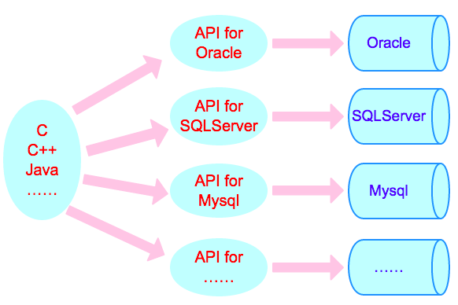
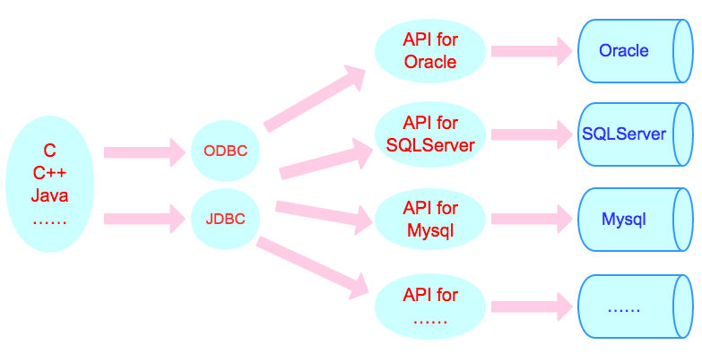
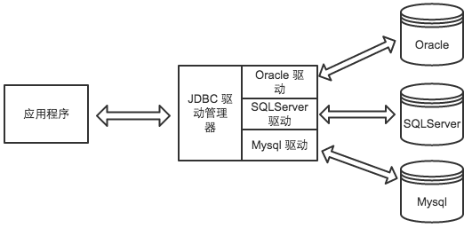
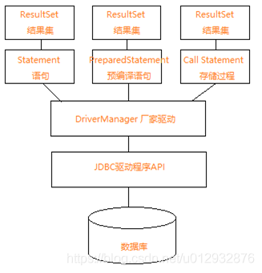
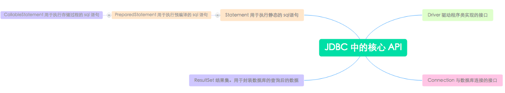
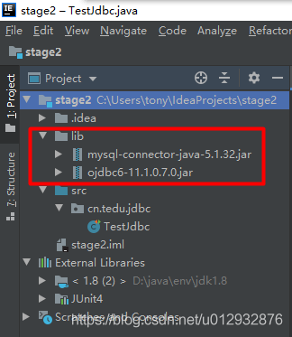

# JDBC
[[TOC]]

JDBC 是连接数据库和 Java 程序的桥梁，通过 JDBC API 可以方便地实现对各种主流数据库的操作。

## 数据库简介

数据库，简而言之可视为电子化的文件柜——存储电子文件的处所，用户可以对文件中的数据运行新增、截取、更新、删除等操作。

所谓“数据库”系以一定方式储存在一起、能予多个用户共享、具有尽可能小的冗余度、与应用程序彼此独立的数据集合。一个数据库由多个表空间（Tablespace）构成。

### 关系数据库

常见的关系型数据库有以下几种：

- MySQL
  - MariaDB
  - Percona Server
- PostgreSQL
- Microsoft Access
- Microsoft SQL Server
- Google Fusion Tables
- FileMaker
- Oracle 数据库
- Sybase
- dBASE
- Clipper
- FoxPro
- foshub

### 非关系数据库

常见非关系数据库：

- Redis
- BigTable
- Cassandra
- MongoDB
- CouchDB

## JDBC

JDBC 的全称是 Java Database Connectivity，叫做 Java 数据库连接。它包括了一组与数据库交互的 API，还有与数据库进行通信的驱动程序。

我们要写涉及到数据库的程序，是通过 C 语言或者 C++ 语言直接访问数据库的接口，如下图所示。



对于不同的数据库，我们需要知道不同数据库对外提供的系统 API，这就影响了我们程序的扩展和跨平台的实现。

那么有没有一种方法来对不同的数据库接口进行统一呢？当然有。我们只需要和最上层接口进行交互，剩下的部分就交给其他各层去处理，我们的任务就变的轻松简单许多。



JDBC 为数据库开发人员提供了一个标准的 API，据此可以构建更高级的工具和接口使数据库开发人员能够用纯 Java API 编写数据库应用程序。



### 概念

我们学习了数据库，数据库实现了数据的持久化，但我们最终要在程序里处理数据啊，那java代码中怎么去访问数据库读写数据呢？

这就要用到sun公司设定的一套数据库标准了，这套标准就是JDBC（Java Database Connectivity）。但它只是规范，不做具体实现。于是数据库厂商又根据JDBC标准，实现自家的驱动Driver。如：mysql驱动com.mysql.cj.jdbc.Driver，Oracle的驱动oracle.jdbc.OracleDriver。有了这套解决方案，java就可以访问数据库中的数据了。

```java
public interface Connection extends Wrapper, AutoCloseable {}

public interface Statement extends Wrapper, AutoCloseable {}

public interface PreparedStatement extends Statement {}

public interface CallableStatement extends PreparedStatement {}

public interface ResultSet extends Wrapper, AutoCloseable {}
```

Java中提倡面向接口开发，而最经典的接口设计莫过于JDBC数据库接口。

Connection链接、Statement语句、PreparedStatement预处理语句、CallableStatement存储过程、ResultSet结果集。

调用方式有三种：Statement语句、PreparedStatement预处理语句、CallableStatement存储过程，推荐使用第二种PreparedStatement，防止SQL注入，其也是预编译性能高。



### JDBC连接数据库(Linux)

涉及到建立一个 JDBC 连接的编程主要有四个步骤：

1. 导入 JDBC 驱动： 只有拥有了驱动程序我们才可以注册驱动程序完成连接的其他步骤。
2. 注册 JDBC 驱动程序：这一步会导致 JVM 加载所需的驱动类实现到内存中，然后才可以实现 JDBC 请求。
3. 数据库 URL 指定：创建具有正确格式的地址，指向到要连接的数据库。
4. 创建连接对象：最后，代码调用 DriverManager 对象的 `getConnection()` 方法来建立实际的数据库连接。

接下来我们便详细讲解这四步。

#### 导入 JDBC 驱动

需要下载对应数据库的 jdbc 驱动，将其导入到项目中，具体的导入方式根据个人的 IDE 确定，本节课程不使用 IDE，直接使用 `javac -cp` 命令导入包。

#### 注册 JDBC 驱动程序

我们在使用驱动程序之前，必须注册你的驱动程序。注册驱动程序的本质就是将我们将要使用的数据库的驱动类文件动态的加载到内存中，然后才能进行数据库。比如我们使用的 Mysql 数据库。我们可以通过以下两种方式来注册我们的驱动程序。

1、`Class.forName()`：

动态加载一个类最常用的方法是使用 Java 的 `Class.forName()` 方法，通过使用这个方法来将数据库的驱动类动态加载到内存中，然后我们就可以使用。

使用 `Class.forName()` 来注册 Mysql 驱动程序：

```java
try {
   Class.forName("com.mysql.jdbc.Driver");
}
catch(ClassNotFoundException ex) {
   System.out.println("Error: unable to load driver class!");
   System.exit(1);
}
```

2、`DriverManager.registerDriver()`：

```java
Driver driver = new com.mysql.jdbc.Driver();
DriverManager.registerDriver(driver);
```

#### 指定数据库连接 URL

当加载了驱动程序，便可以使用 `DriverManager.getConnection()` 方法连接到数据库了。

这里给出 `DriverManager.getConnection()` 三个重载方法：

```java
getConnection(String url)

getConnection(String url, Properties prop)

getConnection(String url, String user, String password)
```

数据库的 URL 是指向数据库地址。下表列出了下来流行的 JDBC 驱动程序名和数据库的 URL。

| RDBMS  | JDBC 驱动程序的名称             | URL                                                 |
| ------ | ------------------------------- | --------------------------------------------------- |
| Mysql  | com.mysql.jdbc.Driver           | jdbc:mysql://hostname/ databaseName                 |
| Oracle | oracle.jdbc.driver.OracleDriver | jdbc:oracle:thin:@hostname:port Number:databaseName |
| DB2    | COM.ibm.db2.jdbc.net.DB2Driver  | jdbc:db2:hostname:port Number/databaseName          |
| Sybase | com.sybase.jdbc.SybDriver       | jdbc:sybase:Tds:hostname: port Number/databaseName  |

#### 创建连接对象

下面三种形式 `DriverManager.getConnection()` 方法来创建一个连接对象，以 Mysql 为例。`getConnection()` 最常用形式要求传递一个数据库 URL，用户名 `username` 和密码 `password`。

1、使用数据库 URL 的用户名和密码

```java
String URL = "jdbc:mysql://localhost/EXAMPLE";
String USER = "username";
String PASS = "password"
Connection conn = DriverManager.getConnection(URL, USER, PASS);
```

2、只使用一个数据库 URL

然而，在这种情况下，数据库的 URL，包括用户名和密码。

```java
String URL = "jdbc:mysql://localhost/EXAMPLE?user=root&password=0909";
//Mysql URL的参数设置详细可以查阅相关资料
Connection conn = DriverManager.getConnection(URL);
```

3、使用数据库的 URL 和一个 Properties 对象

```java
import java.util.*;

String URL = "jdbc:mysql://localhost/EXAMPLE";
Properties pro = new Properties( );

//Properties对象，保存一组关键字-值对
pro.put( "user", "root" );
pro.put( "password", "" );

Connection conn = DriverManager.getConnection(URL, pro);
```

4、关闭 JDBC 连接

```java
conn.close();
```

## JDBC使用

### 创建数据库

在 `/home/project/` 目录下新建文件 `CreateDatabase.java`。

```java
import java.sql.*;

public class CreateDatabase {
    public static void main(String[] args){
        Connection connection = null;
        try {
            //加载数据库驱动
            Class.forName("com.mysql.jdbc.Driver");
            //打开数据库连接 第一个参数为数据库地址  后面2个参数分别为数据库用户名和密码
            // 实验楼中 MySQL 的用户名为: root, 密码为空。
            connection = DriverManager.getConnection("jdbc:mysql://localhost:3306/","root","");
            //创建Statement
            Statement statement = connection.createStatement();
            //执行sql
            statement.execute("create database EXAMPLE");
        } catch (ClassNotFoundException e) {
            e.printStackTrace();
        } catch (SQLException e) {
            e.printStackTrace();
        }finally {
            try {
                //关闭连接
                if (connection != null) {
                    connection.close();
                }
            } catch (SQLException e) {
                e.printStackTrace();
            }
        }
    }
}
```

启动 mysql：

```bash
$ sudo service mysql start
```

编译运行（需要带上 mysql-connector-java-5.1.45.jar）：

```bash
$ wget https://labfile.oss.aliyuncs.com/courses/1230/mysql-connector-java-5.1.47.jar
$ javac -cp mysql-connector-java-5.1.47.jar CreateDatabase.java
$ java -cp .:mysql-connector-java-5.1.47.jar CreateDatabase
```

### 数据库操作



当连接上了数据库后，就需要通过 sql 语句对数据库进行操作。随着 Java 语言应用面的逐步拓宽，Sun 公司开发了一个标准的 SQL 数据库访问接口———JDBC API。它可以使 Java 编程人员通过一个一致的接口，访问多种关系数据库。而今天我们就来学习一下，如何利用 JDBC 的一些核心 API 与数据库进行交互。

通过使用 JDBC Statement, CallableStatement 和 PreparedStatement 接口定义的方法和属性，使可以使用 SQL 或 PL/SQL 命令和从数据库接收数据。它们还定义了许多方法，帮助消除 Java 和数据库之间数据类型的差异。

| 接口                | 应用场景                                                     |
| ------------------- | ------------------------------------------------------------ |
| Statement           | 当在运行时使用静态 SQL 语句时（Statement 接口不能接收参数）  |
| `CallableStatement` | 当要访问数据库中的存储过程时（`CallableStatement `对象的接口还可以接收运行时输入参数） |
| PreparedStatement   | 当计划多次使用 SQL 语句时（PreparedStatement 接口接收在运行时输入参数） |

#### Statement------SQL语句对象

我们要使用 Statement 接口，第一步肯定是创建一个 Statement 对象了。我们需要使用 Connection 对象的 createStatement() 方法进行创建。

```java
Statement stmt = null;
try {
   stmt = conn.createStatement( );
   . . .
}
catch (SQLException e) {
   . . .
}
finally {
   . . .
}
```

一旦创建了一个 Statement 对象，我们就可以用它来执行 SQL 语句了，首先我们先来看看 Statement 里面有哪些方法吧！

| 方法                               | 说明                                                         |
| ---------------------------------- | ------------------------------------------------------------ |
| boolean execute(String SQL)        | 如果 ResultSet 对象可以被检索返回布尔值 true，否则返回 false。使用这个方法**来执行 SQL DDL 语句(数据库相关和表相关的SQL语句)**，或当需要使用真正的动态 SQL |
| int executeUpdate(String SQL)      | 用于**执行 INSERT、UPDATE 或 DELETE 语句以及 SQLDDL（数据定义语言）语句**。返回值是一个整数，指示**受影响的行数**（即更新计数） |
| ResultSet executeQuery(String SQL) | 返回 ResultSet 对象。用于**产生单个结果集的语句，例如 SELECT 语句** |

正如关闭一个 Connection 对象来释放数据库连接资源，出于同样的原因，也应该关闭 Statement 对象。

```java
Statement stmt = null;
try {
   stmt = conn.createStatement( );
   . . .
}
catch (SQLException e) {
   . . .
}
finally {
   stmt.close();
}
```

注：如果关闭了 Connection 对象首先它会关闭 Statement 对象，然而应该始终明确关闭 Statement 对象，以确保正确的清除。


#### PreparedStatement

PreparedStatement 接口扩展了 Statement 接口，有利于高效地执行多次使用的 SQL 语句。我们先来创建一个 PreparedStatement 对象。 Statement 为一条 SQL 语句生成执行计划。如果要执行两条 SQL 语句，会生成两个执行计划。一万个查询就生成一万个执行计划！

```java
select colume from table where colume=1;
select colume from table where colume=2;
```

PreparedStatement 用于使用绑定变量重用执行计划。

```java
select colume from table where colume=:x;
```

通过 set 不同数据，只需要生成一次执行计划，并且可以重用。

```java
PreparedStatement pstmt = null;
try {

/*
在JDBC中所有的参数都被代表？符号，这是已知的参数标记。在执行SQL语句之前，必须提供值的每一个参数。
*/
   String SQL = "Update Students SET age = ? WHERE id = ?";
   pstmt = conn.prepareStatement(SQL);
   . . .
}
/*

setXXX()方法将值绑定到参数，其中XXX表示希望绑定到输入参数值的 Java 数据类型。如果忘了提供值，将收到一个 SQLException。
*/
catch (SQLException e) {
   . . .
}
finally {
//同理，我们需要关闭 PreparedStatement 对象
   pstmt.close();
}
```

说了这么多，我们手动操作一下吧。

1、先创建数据库和相应的内容：

```bash
sudo service mysql start
# 实验楼中 MySQL 的用户名为: root, 密码为空。
mysql -u root
create database EXAMPLE;
use EXAMPLE
```

```java
create table Students
(
id int not null,
age int not null,
name varchar(255),
primary key(id)
);
insert into Students values(1,18,'Tom'),
(2,20,'Aby'),(4,20,'Tomson');
```

```java
import java.sql.*;

public class JdbcTest {
   // JDBC 驱动器的名称和数据库地址
   static final String JDBC_DRIVER = "com.mysql.jdbc.Driver";
   static final String DB_URL = "jdbc:mysql://localhost/EXAMPLE";


   static final String USER = "root";
   static final String PASS = "";

   public static void main(String[] args) {
       Connection conn = null;
       PreparedStatement stmt = null;
       try{
           //注册 JDBC 驱动器
           Class.forName("com.mysql.jdbc.Driver");

           //打开连接
           System.out.println("Connecting to database...");
           conn = DriverManager.getConnection(DB_URL,USER,PASS);

           //执行查询
           System.out.println("Creating statement...");
           //这里我们要更改一个同学的年龄，参数待定
           String sql = "UPDATE Students set age=? WHERE id=?";
           stmt = conn.prepareStatement(sql);

           //将值绑定到参数，参数从左至右序号为1，2...
           stmt.setInt(1, 22);  // 绑定 age 的值(序号为1)
           stmt.setInt(2, 1); // 绑定 ID 的值

           // 更新 ID 为1的同学的年龄
           int rows = stmt.executeUpdate();
           System.out.println("被影响的行数 : " + rows );

           // 查询所有记录，并显示.
           sql = "SELECT id, name, age FROM Students";
           ResultSet rs = stmt.executeQuery(sql);

           //处理结果集
           while(rs.next()){
               //检索
               int id  = rs.getInt("id");
               int age = rs.getInt("age");
               String name = rs.getString("name");


               //显示
               System.out.print("ID: " + id);
               System.out.print(", Age: " + age);
               System.out.print(", Name: " + name);
               System.out.println();
           }
           //清理
           rs.close();
           stmt.close();
           conn.close();
       }catch(SQLException se){
           se.printStackTrace();
       }catch(Exception e){
           e.printStackTrace();
       }finally{
           try{
               if(stmt!=null)
                   stmt.close();
           }catch(SQLException se2){
           }
    try{
         if(conn!=null)
                 conn.close();
      }catch(SQLException se){
              se.printStackTrace();
          }
       }
           System.out.println("Goodbye!");
   }
}
```


#### CallableStatement

CallableStatement 对象为所有的 DBMS 提供了一种以标准形式调用存储过程的方法。存储过程储存在数据库中。对储存过程的调用是 CallableStatement 对象所含的内容。三种类型的参数有：IN，OUT 和 INOUT。PreparedStatement 对象只使用 IN 参数。 CallableStatement 对象可以使用所有三个

| 参数  | 描述                                                         |
| ----- | ------------------------------------------------------------ |
| IN    | 它的值是在创建 SQL 语句时未知的参数，将 IN 参数传给 `CallableStatement` 对象是通过 setXXX() 方法完成的 |
| OUT   | 其值由它返回的 SQL 语句提供的参数。从 OUT 参数的 getXXX() 方法检索值 |
| INOUT | 同时提供输入和输出值的参数，绑定的 setXXX() 方法的变量，并使用 getXXX() 方法检索值 |

在 JDBC 中调用存储过程的语法如下所示。注意，方括号表示其间的内容是可选项；方括号本身并不是语法的组成部份。

```sql
{call 存储过程名[(?, ?, ...)]}
```

返回结果参数的过程的语法为：

```sql
{? = call 存储过程名[(?, ?, ...)]}
```

不带参数的存储过程的语法类似：

```sql
{call 存储过程名}
```

CallableStatement 对象是用 Connection 方法 prepareCall 创建的。

```java
CallableStatement cstmt = null;
try {
   String SQL = "{call getEXAMPLEName (?, ?)}";
   cstmt = conn.prepareCall (SQL);
   . . .
}
catch (SQLException e) {
   . . .
}
finally {
   cstmt.close();
}
```

好了，CallableStatement 接口就不再详细地讲解了，同学们可以自己查阅相关的资料，对 CallableStatement 进行深入学习。

### JDBC结果集

结果集通常是通过执行查询数据库的语句生成，表示数据库查询结果的数据表。

#### ResultSet介绍

ResultSet 对象**具有指向其当前数据行的光标**。最初，光标被置于第一行之前。next 方法将光标移动到下一行；因为该方法在 ResultSet 对象没有下一行时返回 false，所以可以在 while 循环中使用它来迭代结果集。光标可以方便我们对结果集进行遍历。默认的 ResultSet 对象不可更新，仅有一个向前移动的光标。因此，只能迭代它一次，并且只能按从第一行到最后一行的顺序进行。

ResultSet 接口的方法可分为三类：

- 导航方法：用于移动光标
- 获取方法：用于查看当前行的光标所指向的列中的数据
- 更新方法：用于更新当前行的列中的数据

JDBC 提供下列连接方法来创建所需的 ResultSet 语句：

```java
createStatement(int RSType, int RSConcurrency);

prepareStatement(String SQL, int RSType, int RSConcurrency);

prepareCall(String sql, int RSType, int RSConcurrency);
```

RSType 表示 ResultSet 对象的类型，RSConcurrency 是 ResultSet 常量，用于指定一个结果集是否为只读或可更新。

ResultSet 的类型，如果不指定 ResultSet 类型，将自动获得一个是 TYPE_FORWARD_ONLY：

| 类型                              | 描述                                                         |
| --------------------------------- | ------------------------------------------------------------ |
| ResultSet.TYPE_FORWARD_ONLY       | 游标只能向前移动的结果集                                     |
| ResultSet.TYPE_SCROLL_INSENSITIVE | 游标可以向前和向后滚动，但不及时更新，就是如果数据库里的数据修改过，并不在 ResultSet 中反应出来 |
| ResultSet.TYPE_SCROLL_SENSITIVE   | 游标可以向前和向后滚动，并及时跟踪数据库的更新，以便更改 ResultSet 中的数据 |

并发性的 ResultSet，如果不指定任何并发类型，将自动获得一个为 CONCUR_READ_ONLY

| 并发                       | 描述                       |
| -------------------------- | -------------------------- |
| ResultSet.CONCUR_READ_ONLY | 创建结果集只读。这是默认的 |
| ResultSet.CONCUR_UPDATABLE | 创建一个可更新的结果集     |

如初始化一个 Statement 对象来创建一个双向、可更新的 ResultSet 对象：

```java
try {
   Statement stmt = conn.createStatement(
                           ResultSet.TYPE_SCROLL_INSENSITIVE,
                           ResultSet.CONCUR_UPDATABLE);
}
catch(Exception ex) {
   ....
}
finally {
   ....
}
```

#### 1. 导航

我们在上面已经知道了，导航方法是用于移动光标的。我们先来看一看，在 ResultSet 接口中有哪些方法会涉及光标的移动。

| 方法                                                 | 说明                                                         |
| ---------------------------------------------------- | ------------------------------------------------------------ |
| public void beforeFirst() throws SQLException        | 将光标移动到正好位于第一行之前                               |
| public void afterLast() throws SQLException          | 将光标移动到刚刚结束的最后一行                               |
| public boolean first() throws SQLException           | 将光标移动到第一行                                           |
| public void last() throws SQLException               | 将光标移动到最后一行                                         |
| public boolean absolute(int row) throws SQLException | 将光标移动到指定的行                                         |
| public boolean relative(int row) throws SQLException | 从它目前所指向向前或向后移动光标行的给定数量                 |
| public boolean previous() throws SQLException        | 将光标移动到上一行。上一行关闭的结果集此方法返回 false       |
| public boolean next() throws SQLException            | 将光标移动到下一行。如果没有更多的行结果集中的此方法返回 false |
| public int getRow() throws SQLException              | 返回的行号，该光标指向的行                                   |
| public void moveToInsertRow() throws SQLException    | 将光标移动到一个特殊的行，可以用来插入新行插入到数据库中的结果集。当前光标位置被记住 |
| public void moveToCurrentRow() throws SQLException   | 移动光标返回到当前行，如果光标在当前插入行，否则，这个方法不执行任何操作 |

什么也不说了，我们还是看代码吧！

1、先创建数据库和相应的内容：

```bash
sudo service mysql start
mysql -u root
create database EXAMPLE;
use EXAMPLE
```

```java
create table Students
(
id int not null,
age int not null,
name varchar(255),
primary key(id)
);
insert into Students values(1,18,'Tom'),
(2,20,'Aby'),(4,20,'Tomson');
```

```java
import java.sql.*;

public class JdbcTest {
   // JDBC 驱动器名称 和数据库地址
   static final String JDBC_DRIVER = "com.mysql.jdbc.Driver";
   //数据库的名称为 EXAMPLE
   static final String DB_URL = "jdbc:mysql://localhost/EXAMPLE";

   // 数据库用户和密码
   static final String USER = "root";
   static final String PASS = "";

   public static void main(String[] args) {
       Connection conn = null;
       Statement stmt = null;
       try{
           //注册JDBC 驱动程序
           Class.forName("com.mysql.jdbc.Driver");

           //打开连接
           System.out.println("Connecting to database...");
           conn = DriverManager.getConnection(DB_URL,USER,PASS);


           System.out.println("Creating statement...");
           //创建所需的ResultSet，双向，只读
           stmt = conn.createStatement(
                           ResultSet.TYPE_SCROLL_INSENSITIVE,
                           ResultSet.CONCUR_READ_ONLY);
           String sql;
           sql = "SELECT id, name, age FROM Students";
           ResultSet rs = stmt.executeQuery(sql);

           // 将光标移到最后一行
           System.out.println("Moving cursor to the last...");
           rs.last();

           //处理结果集
           System.out.println("Displaying record...");
           int id  = rs.getInt("id");
           int age = rs.getInt("age");
           String name = rs.getString("name");


           //显示
           System.out.print("ID: " + id);
           System.out.print(", Age: " + age);
           System.out.print(", Name: " + name);
           System.out.println();

           // 将光标移到第一行
           System.out.println("Moving cursor to the first row...");
           rs.first();


           System.out.println("Displaying record...");
           id  = rs.getInt("id");
           age = rs.getInt("age");
           name = rs.getString("name");


           //显示
           System.out.print("ID: " + id);
           System.out.print(", Age: " + age);
           System.out.print(", Name: " + name);

           //将光标移至下一行
           System.out.println("Moving cursor to the next row...");
           rs.next();


           System.out.println("Displaying record...");
           id  = rs.getInt("id");
           age = rs.getInt("age");
           name = rs.getString("name");

           // 显示
           System.out.print("ID: " + id);
           System.out.print(", Age: " + age);
           System.out.print(", Name: " + name);

           rs.close();
           stmt.close();
           conn.close();
       }catch(SQLException se){
           se.printStackTrace();
       }catch(Exception e){
           e.printStackTrace();
       }finally{
           try{
               if(stmt!=null)
                   stmt.close();
           }catch(SQLException se2){
           }
           try{
               if(conn!=null)
                   conn.close();
           }catch(SQLException se){
               se.printStackTrace();
           }
       }
       System.out.println("Goodbye!");
   }
}
```


#### 2. 获取

ResultSet 接口中我们经常使用 get 方法来查看结果集。

| 方法                                                     | 说明                                                         |
| -------------------------------------------------------- | ------------------------------------------------------------ |
| public int getInt(String columnName) throws SQLException | 当前行中名为 `ColumnName` 列的值                             |
| public int getInt(int columnIndex) throws SQLException   | 当前行中指定列的索引的值。列索引从 1 开始，意味着一个行的第一列是 1，行的第二列是 2，依此类推 |

当然还有 `getString()` 等等。

代码示例:

```java
package cn.tedu;

import java.sql.*;

public class Demo03 {
    public static void main(String[] args) throws SQLException {
        Connection conn = DriverManager.getConnection(
                "jdbc:mysql://localhost:3306/empdb?characterEncoding=utf8&serverTimezone=Asia/Shanghai&useSSL=false",
                "root","root");
        Statement s = conn.createStatement();
        //执行插入数据SQL
//        s.executeUpdate("insert into emp(name) values('tom')");
        //执行修改的SQL
//        s.executeUpdate("update emp set name='jerry' where name='tom'");
        //执行删除的SQL
//        s.executeUpdate("delete from emp where name='jerry'");
        //执行查询的SQL
         ResultSet rs = s.executeQuery("select name,sal from emp");
         //遍历结果集中的数据
        while(rs.next()){
            //获取游标指向的这条数据的某个字段的值,通过字段名获取
//            String name = rs.getString("name");
//            double sal = rs.getDouble("sal");
            //通过查询回来数据的位置获取数据
            String name = rs.getString(1);
            double sal = rs.getDouble(2);
            System.out.println(name+":"+sal);
        }
        System.out.println("执行完成!");
        conn.close();
    }
}
```


#### 3. 更新

更新的方法如下：

| 方法                                                         | 说明                                                         |
| ------------------------------------------------------------ | ------------------------------------------------------------ |
| public void updateString(int columnIndex, String s) throws SQLException | 指定列中的字符串更改为 s 的值                                |
| public void updateString(String columnName, String s) throws SQLException | 类似于前面的方法，不同之处在于由它的名称，而不是它的索引指定的列 |

类似的还有 updateDouble() 等等。

我们在更新了结果集中的内容，当然需要更新一下数据库了。我们可以调用下面的方法更新数据库。

| 方法                           | 说明                                                 |
| ------------------------------ | ---------------------------------------------------- |
| public void updateRow()        | 通过更新数据库中相应的行更新当前行                   |
| public void deleteRow()        | 从数据库中删除当前行                                 |
| public void refreshRow()       | 刷新在结果集的数据，以反映最新变化在数据库中         |
| public void cancelRowUpdates() | 取消所做的当前行的任何更新                           |
| public void insertRow()        | 插入一行到数据库中。当光标指向插入行此方法只能被调用 |

我们这里对上面的方法做一个小小的举例：

```java
Statement stmt = conn.createStatement(
                           ResultSet.TYPE_SCROLL_INSENSITIVE,
                           ResultSet.CONCUR_UPDATABLE);

String sql = "SELECT id, name, age FROM Students";
ResultSet rs = stmt.executeQuery(sql);

//结果集中插入新行
rs.moveToInsertRow();
rs.updateInt("id",5);
rs.updateString("name","John");
rs.updateInt("age",21);
//更新数据库
rs.insertRow();
```


启动数据库

```bash
$ sudo service mysql start
```

创建一个数据库`test`，在数据库中创建一个数据表`user`，表内容如下：

```sql
create database test;
use test;
CREATE TABLE user
(
    id int PRIMARY KEY,
    name varchar(50),
    age int,
    sex varchar(50)
);
alter table user change sex sex varchar(50) character set utf8;
INSERT INTO `user`(`id`, `name`, `age`, `sex`) VALUES (1, 'shi', 20, '男');
INSERT INTO `user`(`id`, `name`, `age`, `sex`) VALUES (2, 'yan', 13, '女');
INSERT INTO `user`(`id`, `name`, `age`, `sex`) VALUES (3, 'lou', 22, '女');
INSERT INTO `user`(`id`, `name`, `age`, `sex`) VALUES (4, 'admin', 50, '男');
```

在 `/home/project` 目录下创建一个文件 `QueryDemo.java`，使用 jdbc 完成以下查询：

- 查询 Id 为 1 的用户。
- 查询年龄为 12 岁，名字为 yan 的用户。
- 查询年龄大于 20 岁的用户。

JDBC 驱动下载：

```bash
$ wget https://labfile.oss.aliyuncs.com/courses/1230/mysql-connector-java-5.1.47.jar
```

```java
import java.sql.*;

public class QueryDemo {

    // JDBC 驱动器的名称和数据库地址
    private static final String JDBC_DRIVER = "com.mysql.jdbc.Driver";
    private static final String DB_URL = "jdbc:mysql://localhost/test";
    private static final String USER = "root";
    private static final String PASS = "";

    public static void main(String[] args) {
        Connection conn = null;
        PreparedStatement stmt = null;
        try {
            Class.forName(JDBC_DRIVER);
            conn = DriverManager.getConnection(DB_URL, USER, PASS);

            //id为1的用户
            String sql = "select id,name,age,sex from user where id=?";
            stmt = conn.prepareStatement(sql);
            stmt.setInt(1, 1);
            ResultSet resultSet = stmt.executeQuery();
            printRS(resultSet);

            //年龄为12 名字为yan
            stmt = conn.prepareStatement("select id,name,age,sex from user where age=? and name=?");
            stmt.setInt(1, 12);
            stmt.setString(2, "yan");
            resultSet = stmt.executeQuery();
            printRS(resultSet);

            //年龄为12 名字为yan
            stmt = conn.prepareStatement("select id,name,age,sex from user where age>?");
            stmt.setInt(1, 20);
            resultSet = stmt.executeQuery();
            printRS(resultSet);
            //清理
            resultSet.close();
        } catch (Exception e) {
            e.printStackTrace();
        } finally {
            try {
                if (stmt != null) {
                    stmt.close();
                }
            } catch (SQLException e) {
                e.printStackTrace();
            }
            try {
                if (conn != null) {
                    conn.close();
                }
            } catch (SQLException se) {
                se.printStackTrace();
            }
        }
    }

    private static void printRS(ResultSet resultSet) throws SQLException {
        while (resultSet.next()) {
            int id = resultSet.getInt("id");
            String name = resultSet.getString("name");
            int age = resultSet.getInt("age");
            String sex = resultSet.getString("sex");
            System.out.println("id:" + id + " name:" + name + " age:" + age + " sex:" + sex);
        }
    }
}
```

#### JDBC 事务


我们在编写 java 程序的时候，在默认情况下，JDBC 连接是在自动提交模式下，即每个 SQL 语句都是在其完成时提交到数据库。但有时候我们为了提高程序运行的性能或者保持业务流程的完整性，以及使用了分布式事务管理方式，这个时候我们可能想关闭自动提交而自己管理和控制自己的事务。

让多条 SQL 在一个事务中执行，并且保证这些语句是在同一时间共同执行的时候，我们就应该为这多条语句定义一个事务。一个事务是把单个 SQL 语句或一组 SQL 语句作为一个逻辑单元，并且如果事务中任何语句失败，则整个事务失败。

如果我们要启动一个事务，而不是让 JDBC 驱动程序默认使用 auto-commit 模式支持。这个时候我们就要使用 Connection 对象的 `setAutoCommit()` 方法。我们传递一个布尔值 `false` 到 `setAutoCommit()` 中，就可以关闭自动提交。反之我们传入一个 true 便将其重新打开。

例如：

```java
Connection conn = null;
conn = DriverManager.getConnection(URL);
//关闭自动提交
conn.setAutoCommit(false);
```

我们关闭了自动提交后，如果我们要提交数据库更改怎么办呢？这时候就要用到我们的提交和回滚了。我们要提交更改，可以调用 commit() 方法：

```java
conn.commit();
```

尤其不要忘记，在 catch 块内添加回滚事务，表示操作出现异常，撤销事务：

```java
conn.rollback();
```

#### 插入数据

JDBC 插入数据使用的频率非常高，接下来说明如何使用 JDBC 插入数据。

##### 编程实战

创建数据库（若之前已经创建了 Students 表需提前删除再操作）

```bash
    sudo service mysql start
    mysql -u root
    create database EXAMPLE;
    use EXAMPLE;
    create table Students
    (
        id int not null,
        age int not null,
        name varchar(255),
        primary key(id)
    );
```

在 `/home/project` 目录下新建一个`JdbcInsertTest.java`。

```java
import java.sql.*;

public class JdbcInsertTest {
    public static Connection connection = null;
    public static void main(String[] args) {
        try {
            Class.forName("com.mysql.jdbc.Driver");
            connection = DriverManager.getConnection("jdbc:mysql://localhost:3306/EXAMPLE", "root", "");
            Statement statement = connection.createStatement();
            //单条插入
            boolean execute = statement.execute("insert into Students values (0,1,'shiyanlou')");
            if (execute) {
                System.out.println("插入失败");
            }else {
                System.out.println("单条插入成功");
            }
            // 批量插入  需要关闭自动提交
            connection.setAutoCommit(false);
            String sql = "insert into Students values (?,?,?)";
            PreparedStatement preparedStatement = connection.prepareStatement(sql);
            //设置插入的值
            for (int i = 1; i <= 10; i++) {
                preparedStatement.setInt(1, i);
                preparedStatement.setInt(2, i + 10);
                preparedStatement.setString(3, "shiyanlou");
                preparedStatement.addBatch();
            }
            //执行批量插入，使用executeBatch 方法
            preparedStatement.executeBatch();
            //提交到数据库
            connection.commit();
            System.out.println("提交批量插入完成");
        } catch (ClassNotFoundException | SQLException e) {
            e.printStackTrace();
        }

    }
}
```

编译运行：

```bash
$ wget https://labfile.oss.aliyuncs.com/courses/1230/mysql-connector-java-5.1.47.jar
$ javac -cp .:mysql-connector-java-5.1.47.jar JdbcInsertTest.java
$ java -cp .:mysql-connector-java-5.1.47.jar JdbcInsertTest
单条插入成功
提交批量插入完成
```

如果成功运行，进入数据库查看数据是否有增加

```bash
mysql -u root
use EXAMPLE;
select * from Students;
```

### 练习题:插入数据

启动数据库。

```bash
$ sudo service mysql start
```

创建一个数据库`test`，在数据库中创建一个数据表`user`，表内容如下：

```sql
create database test;
use test;
CREATE TABLE user
(
    id int PRIMARY KEY,
    name varchar(50),
    age int,
    sex varchar(10)
);
```

在 `/home/project` 目录下创建一个文件 `InsertDemo.java`，使用 jdbc 完成以下操作：

- 将用户 `id：10，name：shiyanlou，age：22，sex：男` 插入到数据库。

JDBC 驱动下载：

```bash
$ wget https://labfile.oss.aliyuncs.com/courses/1230/mysql-connector-java-5.1.47.jar
```

```java
import java.sql.*;

public class InsertDemo {
    public static Connection connection = null;
    public static void main(String[] args) {
        try {
            Class.forName("com.mysql.jdbc.Driver");
            connection = DriverManager.getConnection("jdbc:mysql://localhost:3306/test", "root", "");
            Statement statement = connection.createStatement();
            statement.execute("insert into user values (10,'shiyanlou',22,'男')");
            statement.close();
            connection.close();
        } catch (ClassNotFoundException | SQLException e) {
            e.printStackTrace();
        }finally {
            try {
                connection.close();
            } catch (SQLException e) {
                e.printStackTrace();
            }
        }

    }
}


```

### 练习题:注册登录完成

```java
//注册类
package cn.tedu;

import java.sql.Connection;
import java.sql.PreparedStatement;
import java.sql.ResultSet;
import java.sql.SQLException;
import java.util.Scanner;

public class Demo06 {
    public static void main(String[] args) {
        Scanner sc = new Scanner(System.in);
        System.out.println("请输入用户名");
        String username = sc.nextLine();
        System.out.println("请输入密码");
        String password = sc.nextLine();
        System.out.println("请输入昵称");
        String nick = sc.nextLine();
        //获取连接
        try (Connection conn = DBUtils.getConn()){
            //查询用户名是否存在
            String sql = "select id from user where username=?";
            PreparedStatement ps = conn.prepareStatement(sql);
            ps.setString(1,username);
            ResultSet rs = ps.executeQuery();
            if (rs.next()){
                System.out.println("用户名已存在!");
                return;//结束方法
            }
            //代码继续执行说明没有注册过
            String regSql = "insert into user values(null,?,?,?)";
            PreparedStatement regPs = conn.prepareStatement(regSql);
            regPs.setString(1,username);
            regPs.setString(2,password);
            regPs.setString(3,nick);
            regPs.executeUpdate();//执行注册
            System.out.println("注册完成!");


        } catch (SQLException throwables) {
            throwables.printStackTrace();
        }
    }
}
//登录类
package cn.tedu;

import java.sql.Connection;
import java.sql.PreparedStatement;
import java.sql.ResultSet;
import java.sql.SQLException;
import java.util.Scanner;

public class Demo05 {
    public static void main(String[] args) {
        Scanner sc = new Scanner(System.in);
        System.out.println("请输入用户名");
        String username = sc.nextLine();
        System.out.println("请输入密码");
        String password = sc.nextLine();
        try (Connection conn = DBUtils.getConn()){
            String sql = "select password from user where username=?";
            PreparedStatement ps = conn.prepareStatement(sql);
            //替换掉?
            ps.setString(1,username);
            //执行查询
            ResultSet rs = ps.executeQuery();
            //判断是否查询到了数据
            if (rs.next()){
                //得到查询回来的密码
                String pw = rs.getString(1);
                //pw代表正确密码   password代表用户输入的密码
                if (pw.equals(password)){
                    System.out.println("登录成功!");
                }else{
                    System.out.println("密码错误");
                }
            }else{
                System.out.println("用户名不存在!");
            }
        } catch (SQLException throwables) {
            throwables.printStackTrace();
        }
    }
}
//工具类
package cn.tedu;

import com.alibaba.druid.pool.DruidDataSource;

import java.sql.Connection;
import java.sql.SQLException;

public class DBUtils {
    private static DruidDataSource dds;
    static {
        //创建数据库连接池对象
        dds = new DruidDataSource();
        //设置数据库连接信息
        dds.setUrl("jdbc:mysql://localhost:3306/empdb?" +
                "characterEncoding=utf8&serverTimezone=Asia/Shanghai&useSSL=false");
        dds.setUsername("root");
        dds.setPassword("root");//写自己的密码
        dds.setInitialSize(3);//设置初始连接数量
        dds.setMaxActive(5);//设置最大连接数量
    }
    public static Connection getConn() throws SQLException {

        //从连接池对象中获取连接 异常抛出
        Connection conn = dds.getConnection();
        System.out.println("连接:"+conn);
        return conn;
    }
}


```


## JDBC使用(Windows)

### 使用步骤

1. 导入jar包(丰富的工具类)

2. 获取和数据库的连接(用户名、密码)

3. 通过程序执行SQL

4. 通过程序处理结果

### idea 创建项目并导入jar包

- 创建maven工程

- 在pom.xml文件中添加依赖并同步maven

  ```xml
  <!--添加依赖-->
      <dependencies>
          <dependency>
              <groupId>mysql</groupId>
              <artifactId>mysql-connector-java</artifactId>
              <version>8.0.15</version>
          </dependency>
      </dependencies>
  ```

- 创建lib目录，拷贝驱动objbc6-11.1.0.7.0到lib目录下

- 项目引用这个外部jar包




### 入门案例

```java
package cn.tedu.jdbc;

import java.sql.*;

//测试 jdbc
//需求：查询cgb2104库里的students表里的所有数据
public class Test1 {
    public static void main(String[] args) throws Exception {
        //1,注册驱动
        Class.forName("com.mysql.jdbc.Driver");
        //2,获取和数据库的连接
//String url= "jdbc:mysql://localhost:3306/empdb?characterEncoding=utf8&serverTimezone=Asia/Shanghai";//指定要连接哪个数据库
String url= "jdbc:mysql://localhost:3306/empdb?characterEncoding=utf8&serverTimezone=Asia/Shanghai";//指定要连接哪个数据库
        String user= "root" ; //使用的用户名
        String pwd= "root" ; //使用的密码
        Connection conn = DriverManager.getConnection(url, user, pwd);
        //3,获取传输器,执行SQL
        Statement st = conn.createStatement();
        //4,执行SQL
        ResultSet rs = st.executeQuery("select * from students");
        //5,解析结果集
        while( rs.next() ){//next()判断结果集中是否有数据
            for (int i = 1; i <= 5 ; i++) {
                //获取每列的值并打印
                System.out.println( rs.getString(i) );
            }
        }
        //6,释放资源
        rs.close(); //关闭结果集
        st.close();//关闭传输器
        conn.close();//关闭连接
    }
}

```

### SQL注入

```java
/*自己准备user2表(id/name/password),准备数据
    CREATE TABLE `user2` (
          `id` int(11)  PRIMARY KEY  auto_increment,
          `name` varchar(10) default NULL,
          `password` varchar(10) default NULL
    ) ;
 */
//需求：利用jdbc,根据用户名和密码查询cgb2104库里的user表
//SQL注入攻击问题
private static void login() {
    try{
        Class.forName("com.mysql.jdbc.Driver");
        String url="jdbc:mysql://localhost:3306/empdb?characterEncoding=utf8&serverTimezone=Asia/Shanghai";
        Connection conn = DriverManager.getConnection(url, "root", "root");
        Statement st = conn.createStatement();
// String sql ="select * from user2 where name='jack' and password='123456'";//写死了

        String user = new Scanner(System.in).nextLine();//用户输入jack'#
        String pwd = new Scanner(System.in).nextLine();
        //SQL注入攻击问题：本质上是因为SQL语句中出现了特殊符号#,改变了SQL语义
String sql ="select * from user2 where name='"+user+"' and password='"+pwd+"'";
        ResultSet rs = st.executeQuery(sql);//执行查询的SQL,返回结果集
        if(rs.next()){
            System.out.println("登录成功~");
        }else{
            System.out.println("登录失败~");
        }
        st.close();
        conn.close();
    }catch(Exception e){
        e.printStackTrace();//有异常,直接打印异常信息
        //System.out.println("执行失败。。。");//上线
    }

}
```

### SQL注入的解决方案

```java
//解决SQL注入攻击的方案
private static void login2() {
    try{
        Class.forName("com.mysql.jdbc.Driver");
        String url="jdbc:mysql:///cgb2104?characterEncoding=utf8";
        Connection conn = DriverManager.getConnection(url, "root", "root");
//            Statement st = conn.createStatement();不行,不安全,会被SQL攻击

        String user = new Scanner(System.in).nextLine();//用户输入jack'#
        String pwd = new Scanner(System.in).nextLine();
        //?叫占位符 ,SQL的骨架
String sql ="select * from user2 where name=? and password=?";
        //先把SQL骨架发给数据库执行
        PreparedStatement ps = conn.prepareStatement(sql);
        //给SQL里的? 设置参数
        ps.setString(1,user);//给第一个?设置值是user
        ps.setString(2,pwd);//给第二个?设置值是pwd
        
        ResultSet rs = ps.executeQuery();//执行拼接好的SQL,返回结果集

        if(rs.next()){
            System.out.println("登录成功~");
        }else{
            System.out.println("登录失败~");
        }
        ps.close();
        conn.close();
    }catch(Exception e){
        e.printStackTrace();//有异常,直接打印异常信息
        //System.out.println("执行失败。。。");//上线
    }
}

```

## JDBC常见问题

### Class.forName这句话有用没？

Class.forName可以指定class类路径进行动态创建对象实例，可JDBC这句话没有返回对象啊，那写这句有什么作用呢？看看java.sql.Driver.class的源码就找到真相了，原来它用了静态代码块创建对象。

```java
    static {
        try {
            DriverManager.registerDriver(new Driver());
        } catch (SQLException var1) {
            throw new RuntimeException("Can't register driver!");
        }
    }

```

写了创建了，那不写呢？怎么不写也能执行呢？

Java提供了SPI机制，用户可以自行配置类，JDBC高版本驱动就都引入了这个支持。如果用户使用了Class.forName方式就自己指定了驱动，如果未写这句话，则Java自动去META-INF/services/java.sql.Driver文件中找启动类。


### 驱动版本

不同版本的mysql需要不同版本的驱动

```java
Mysql5.0x mysql-connector-java-5.1.32.jar

Mysql8.0x mysql-connector-java-8.0.21.jar

```

- Driver变成了： com.mysql.cj.jdbc.Driver，中间多了cj
- url必须加时区参数： serverTimezone=Asia/Shanghai

### 中文乱码

url增加参数：characterEncoding=utf8防止中文乱码

```java
String url ="jdbc:mysql://localhost:3306/mydb?characterEncoding=utf8&serverTimezone=Asia/Shanghai&useSSL=false";

```

### SQL注入

```java
String condition = "陈强";
String condition = "陈强' or 1=1 or '";
String condition = "陈强' or true or '";

String sql = "select * from teachers where tname='" + condition+"'";

```

利用sql中'单撇是字符串的结束符，or只要一个条件成立其它就不用再判断，而恶意造成sql查询失效，本应该只展示一条数据，结果全部展现。

注入后形成的SQL：

```java
SELECT * FROM teachers WHERE tname='陈强' OR 1=1 OR ''

```

大家试想如果是一个财务表，本你只能看自己的信息，结果你看了所有人的信息。结果新员工比你工资高，你说气人不。

### PreparedStatement 语句

SQL注入解决方案：

Statement对象换为PreparedStatement对象

```sql
sql = "select * from teachers where tname=?";			#参数使用问号
PreparedStatement stat = cn.prepareStatement(sql); 		#对象换掉
stat.setString(1, condition);					#对应参数类型，第几个问号
ResultSet rs = stat.executeQuery();			#去掉sql参数

```

PS后的结果：

```sql
SELECT * FROM teachers WHERE tname='陈强\' or 1=1 or \''

```

利用转义字符，屏蔽了SQL中的恶意字符。不仅解决了sql注入问题，使系统变的安全，PreparedStatement还有个极大的好处，它是预编译的语句，其主干部分mysql进行预编译后缓存，下次这部分就无需在解析，只把条件拼入，这样执行效率远高于statement每次都要编译sql语句。

## 常见错误

### java.lang.ClassNotFoundException: com.mysql.jdbc.Driver

**错误原因：**

1）jar没有导入，没有builder path

2）Class.forName("com.mysql.jdbc.Driver"); 字符串拼写错误

### Unknown database mydb;

**错误原因：**

数据库名称拼写错误

### Access denied for user ‘root123’@‘localhost’ (using password: YES)

**错误原因：**

数据库用户名或者密码错误

### Table ‘py-school-db.mydb’ doesn’t exist

**错误原因：**

表不存在,也可能表名写错了


## 属性文件

什么是属性文件
properties文件一般用来作为程序的配置文件，例如,连接数据库时,需要知道数据库服务器的地址,用户名,密码等…
这些连接信息,可以存储在properties配置文件中,便于修改维护
java提供了专门的工具,来读写这种格式的数据
java.util.Properteis 类

### jdbc.properties

```sql
#数据库链接配置
#\u6570\u636E\u5E93\u94FE\u63A5\u914D\u7F6E

jdbc.driver=com.mysql.jdbc.Driver
jdbc.url=jdbc:mysql://127.0.0.1:3306/yhmisdb?useUnicode=true&characterEncoding=utf8&autoReconnect=true&allowMultiQueries=true
jdbc.username=root
jdbc.password=root
```

### 格式

- 属性文件是纯文本类型，本质就是txt文件
- #后面代表单行注释，尽量不要在属性文件中出现中文
- 每行都是kv结构，中间用=号分割
- key不能重复，文件不报错，读取后的集合中只有最后一个的值

### 测试

读取属性文件所有内容和某一个值

```java
@Test
public void rprop() throws Exception {
	//1,创建属性对象Properties
	Properties ps = new Properties();
	//2,读取当前类根目录(bin)下的属性文件
	InputStream in = B.class.getResourceAsStream("/a.properties");
	//3,读取文件
	ps.load(in);
	
	//4,关闭资源
	in.close();
	
	//5,获取内容
	System.out.println(ps.getProperty("b"));//2
	System.out.println(ps.getProperty("a"));//1
	System.out.println(ps);//{b=2, a=1}
}
```


## 连接池(DBCP)

- **D**ruid（德鲁伊）是阿里巴巴开发的号称为监控而生的数据库连接池，Druid是目前最好的数据库连接池。在功 能、性能、扩展性方面，都超过其他数据库连接池，同时加入了日志监控，可以很好的监控DB池连接和SQL的执行情况。

- 作用: 将连接重用,从而提高执行效率

### **连接池技术原理**

> 普通的JDBC方式

单个用户，每次操作都从数据库中获取连接

> 连接池技术——从连接池中获取连接，重复使用连接


### 编写工具类

- 连接数据库表的工具类, 采用DBCP连接池的方式来完成
- Java中提供了一个连接池的规则**接口 ： DataSource** , 它是**java中提供的连接池**
- 在**DBCP包**中提供了**DataSource接口的实现类**，我们要用的具体的连接池 **BasicDataSource 类**
- **代码**

```java
package com.lagou;

import org.apache.commons.dbcp.BasicDataSource;

import java.sql.Connection;
import java.sql.ResultSet;
import java.sql.SQLException;
import java.sql.Statement;

public class DBCPUtils {
    // 1. 定义数据库连接信息
    public static final String DRIVERNAME = "com.mysql.jdbc.Driver";
    public static final String URL = "jdbc:mysql://localhost:3306/db5?characterEncoding=UTF-8";
    public static final String USERNAME = "root";
    public static final String PASSWORD = "123456";

    //2.创建连接池对象 (有DBCP提供的实现类)
    public static BasicDataSource dataSource = new BasicDataSource();

    //3.使用静态代码块进行配置
    static {
        dataSource.setDriverClassName(DRIVERNAME);
        dataSource.setUrl(URL);
        dataSource.setUsername(USERNAME);
        dataSource.setPassword(PASSWORD);
    }

    //4.获取连接的方法
    public static Connection getConnection() throws SQLException { //alt+shift+enter
        //从连接池中获取连接
        Connection connection = dataSource.getConnection();
        return connection;
    }

    //5. 释放资源
    public static void close(Connection connection, Statement statement){
        if (connection != null && statement !=null){
            try {//ctrl+alt+T
                statement.close();
                connection.close();
            } catch (SQLException e) {
                e.printStackTrace();
            }
        }
    }
    //5. 释放资源(重载)
    public static void close(Connection connection, Statement statement, ResultSet resultSet){
        if (connection != null && statement !=null){
            try {//ctrl+alt+T
                resultSet.close();
                statement.close();
                connection.close();
            } catch (SQLException e) {
                e.printStackTrace();
            }
        }
    }


}
```

**测试工具类**

- 查询员工的所有姓名

```java
package com.lagou.testpool;

import com.lagou.utils.DBCPUtils;

import java.sql.Connection;
import java.sql.ResultSet;
import java.sql.SQLException;
import java.sql.Statement;

public class TestDBCP {
    /*
    测试DBCP连接池
     */
    public static void main(String[] args) throws SQLException {
        //1.从DBCP连接池中拿到连接
        Connection connection = DBCPUtils.getConnection();

        //2.获取statement对象
        Statement statement = connection.createStatement();

        //3.查询所有员工的姓名
        String sql = "select ename from employee";
        ResultSet resultSet = statement.executeQuery(sql);

        //4.处理结果集
        while (resultSet.next()){
            String ename = resultSet.getString("ename");
            System.out.println("员工姓名：" + ename);
        }

        //5. 释放资源
        DBCPUtils.close(connection,statement,resultSet);

    }
}
```

### 常见配置项

```java
driverClassName    数据库驱动名称
url                数据库地址
username            用户名
password           密码
maxActive         最大连接数量
maxIdle           最大空闲连接
minIdle           最小空闲连接
initialSize        初始化连接
```

### **C3P0连接池**

- C3P0是一个开源的JDBC连接池,支持JDBC3规范和JDBC2的标准扩展。目前使用它的开源项目有Hibernate、 Spring等。


### 编写Druid工具类

- 获取数据库连接池对象 通过工厂来来获取 **DruidDataSourceFactory**类的**createDataSource**方法
- **createDataSource(Properties p)** 方法参数可以是一个属性集对象

```java
 package com.lagou.utils;

import com.alibaba.druid.pool.DruidDataSourceFactory;

import javax.sql.DataSource;
import java.io.IOException;
import java.io.InputStream;
import java.sql.Connection;
import java.sql.ResultSet;
import java.sql.SQLException;
import java.sql.Statement;
import java.util.Properties;

public class DruidUtils {
    //1.定义成员变量
    public static DataSource dataSource;

public static DataSource getDataSource() {//增加获取连接池对象的方法，方便后面的QueryRunner调用
        return dataSource;
    }
    //2. 静态代码块
    static {
        try {
            //3.创建属性集对象
            Properties properties = new Properties();

            //4. 加载配置文件，Druid连接池不能主动加载配置文件，需要指定文件夹
            InputStream inputStream = DruidUtils.class.getClassLoader().getResourceAsStream("druid.properties");

            //5. Properties 对象的load方法 从字节流中读取配置信息
            properties.load(inputStream);

            //6. 通过工厂类获取连接池对象
            dataSource = DruidDataSourceFactory.createDataSource(properties);
        } catch (Exception e) {
            e.printStackTrace();
        }
    }

    //获取连接的方法
    public static Connection getConnection(){
        try {
            return dataSource.getConnection();
        } catch (SQLException e) {
            e.printStackTrace();
            return null;
        }
    }

    // 释放资源
    public static void close(Connection connection, Statement statement) {
        if (connection != null && statement != null) {
            try {//ctrl+alt+T
                statement.close();
                connection.close();
            } catch (SQLException e) {
                e.printStackTrace();
            }
        }
    }

    //释放资源(重载)
    public static void close(Connection connection, Statement statement, ResultSet resultSet) {
        if (connection != null && statement != null) {
            try {//ctrl+alt+T
                resultSet.close();
                statement.close();
                connection.close();
            } catch (SQLException e) {
                e.printStackTrace();
            }
        }
    }

}
```

### **测试**Druid**工具类**

- **查询薪资在3000 - 5000元之间的员工姓名**

```java
package com.lagou.testpool;

import com.lagou.utils.DruidUtils;

import java.sql.Connection;
import java.sql.ResultSet;
import java.sql.SQLException;
import java.sql.Statement;

public class TestDruid {
    //需求查询 薪资在3000到5000之间的员工的姓名
    public static void main(String[] args) throws SQLException {
        //1.获取连接
        Connection connection = DruidUtils.getConnection();

        //2.获取Statement对象
        Statement statement = connection.createStatement();

        //3.执行查询
        ResultSet resultSet = statement.executeQuery("select ename from employee where salary between 3000 and 5000");

        //4.处理结果集
        while (resultSet.next()){
            String ename = resultSet.getString("ename");
            System.out.println(ename);
        }

        //5.释放资源
        DruidUtils.close(connection,statement,resultSet);
    }
}
```

### 配置DBUtils

- 使用 DbUtils原因：**用JDBC发现冗余的代码太多了,为了简化开发**
- Commons DbUtils是Apache组织提供的一个对JDBC进行简单封装的开源工具类库，使用它能够简化JDBC应用程序的开发，同时也不会影响程序的性能。
- 使用方式: DBUtils就是JDBC的简化开发工具包。

> **Dbutils核心功能介绍**

1. **QueryRunne**r 中提供对sql语句操作的API.
2. **ResultSetHandler接口**，用于定义select操作后，怎样封装结果集.
3. DbUtils类,他就是一个工具类,定义了关闭资源与事务处理相关方法.

```java
package cn.tedu;

import com.alibaba.druid.pool.DruidDataSource;

import java.sql.Connection;
import java.sql.DriverManager;
import java.sql.SQLException;

public class DBUtils {

    public static DruidDataSource ds;
    static{
        //创建连接池对象
        ds = new DruidDataSource();
        //设置数据库连接信息 url 用户名 密码
        ds.setUrl("jdbc:mysql://localhost:3306/empdb?characterEncoding=utf8&serverTimezone=Asia/Shanghai");
        ds.setUsername("root");
        ds.setPassword("root");
        //设置初始连接数量
        ds.setInitialSize(3);
        //设置最大连接数列
        ds.setMaxActive(5);
    }
    public static Connection getConn() throws SQLException {

        //从连接池中获取连接 异常抛出
        Connection conn = ds.getConnection();
        System.out.println("connection project:" + conn);

        return conn;

    }
}

```

### JavaBean组件

1. **JavaBean 就是一个类, 开发中通常用于封装数据**
2. **特点**

- 需要实现 序列化接口, `Serializable` 
- **提供私有字段: private 类型 变量名;**
- **提供 getter 和 setter**
- 提供 空参构造

3.创建Employee类和数据库的employee表对应


> **代码实现**：

- 创建一个 entity包,专门用来存放 JavaBean类
- Employee类就是对应了数据库中的Employee表

```java
package com.lagou.entity;

import java.io.Serializable;
import java.util.Date;

//创建一个 entity包,专门用来存放 JavaBean类
/*
Employee类就是对应了数据库中的Employee表
	eid INT PRIMARY KEY AUTO_INCREMENT,
	ename VARCHAR(20),
	age INT,
	sex VARCHAR(6),
	salary DOUBLE,
	empdate DATE
 */
public class Employee implements Serializable {
    //成员变量的名称要与表中的列一样
    private int eid;
    private String ename;
    private int age;
    private String sex;
    private double salary;
    private Date empdate;

    public Employee() {
    }

    public Employee(int eid, String ename, int age, String sex, double salary, Date empdate) {
        this.eid = eid;
        this.ename = ename;
        this.age = age;
        this.sex = sex;
        this.salary = salary;
        this.empdate = empdate;
    }

    public int getEid() {
        return eid;
    }

    public void setEid(int eid) {
        this.eid = eid;
    }

    public String getEname() {
        return ename;
    }

    public void setEname(String ename) {
        this.ename = ename;
    }

    public int getAge() {
        return age;
    }

    public void setAge(int age) {
        this.age = age;
    }

    public String getSex() {
        return sex;
    }

    public void setSex(String sex) {
        this.sex = sex;
    }

    public double getSalary() {
        return salary;
    }

    public void setSalary(double salary) {
        this.salary = salary;
    }

    public Date getEmpdate() {
        return empdate;
    }

    public void setEmpdate(Date empdate) {
        this.empdate = empdate;
    }

    @Override
    public String toString() {
        return "Employee{" +
                "eid=" + eid +
                ", ename='" + ename + '\'' +
                ", age=" + age +
                ", sex='" + sex + '\'' +
                ", salary=" + salary +
                ", empdate=" + empdate +
                '}';
    }
}
```

###  **DBUtils完成 CRUD**

> **QueryRunner核心类**

```java
** 构造方法
1. QueryRunner()
   -- 执行update等操作时需要传入connection对象
   -- 需要写关闭：如DbUtils.closeQuietly(connection);
2. QueryRunner(DataSource ds) 
    -- 提供数据源（连接池），DBUtils底层自动维护连接connection
    -- 自动模式执行update等操作时不需要传入connection对象，如qr.update()
    -- 不需要写关闭， DBUtils自动完成


** 常用方法
1. update(Connection conn, String sql, Object... params) 
-- 用来完成表数据的增加、删除、更新操作
-- 返回int类型表示受影响的行数 

2. query(Connection conn, String sql, ResultSetHandler rsh, Object... params) ，用来完成表 数据的查询操作
```

> **QueryRunner的创建**

- 手动模式：

```text
QueryRunner queryRunner =newQueryRunner();
```

- 自动模式

```text
QueryRunner queryRunner1 = new QueryRunner(DruidUtils.getDataSource());
```

- 自动模式提供数据库连接池对象 DBUtils会自动的维护连接

```java
package com.lagou.testDBUtils;

import com.lagou.utils.DruidUtils;
import org.apache.commons.dbutils.QueryRunner;

public class DBUtilsDemo01 {
    //QueryRunner 核心类的创建方式
    public static void main(String[] args) {
        //方式1 手动模式
        QueryRunner queryRunner = new QueryRunner();
        //方式2 自动模式 提供数据库连接池对象 DBUtils会自动的维护连接
        QueryRunner queryRunner1 = new QueryRunner(DruidUtils.getDataSource());

    }
}
```

- 增加DruidUtils中获取Druid连接池对象的方法

```text
    //获取Druid连接池对象的方法
    public static DataSource getDataSource(){
        return dataSource;
    }
```

### QueryRunner实现增、删、改操作

> **核心方法**

- **update(Connection conn, String sql, Object... params)**

| 参数                  | 说明                                                         |
| --------------------- | ------------------------------------------------------------ |
| Connection connection | 数据库连接对象, 自动模式创建QueryRun 可以不传 ,手动模式必须传递 |
| String sql            | 占位符形式的SQL ,使用 ? 号占位符                             |
| Object... param       | Object类型的 可变参,用来设置占位符上的参数                   |

- **步骤**

1. 创建QueryRunner(手动或自动)
2. 占位符方式 编写SQL
3. 设置占位符参数
4. 执行

> **添加**

```java
public class DBUtilsDemo02 {
    @Test
    public void testInsert() throws SQLException {//alt+enter
        //方式1 创建 QueryRunner 手动模式
        QueryRunner queryRunner = new QueryRunner();

        //2.编写占位符方式SQL
        String sql = "insert into employee values(?,?,?,?,?,?)";

        //3.设置占位符的参数:Object类型的数组
        Object[] param = {null,"张百万",20,"女",10000,"1990-12-26"};

        //4.执行update方法
        Connection connection = DruidUtils.getConnection();
        int update = queryRunner.update(connection, sql, param);//返回int类型表示受影响的行数 

        //5.释放资源
        //connection.close();
        DbUtils.closeQuietly(connection);//可以使用DbUtils提供的关闭方法
    }
}
```

> **修改操作**

- 修改姓名为张百万的员工，薪资为15000

```java
//修改操作 修改姓名为张百万的员工，薪资为15000
    @Test
    public void testUpdate() throws SQLException {
        //1创建 核心类 QueryRunner 自动模式 需要传递 数据库连接池对象
        QueryRunner queryRunner = new QueryRunner(DruidUtils.getDataSource());

        //2.编写SQL
        String sql = "update employee set salary = ? where ename = ?";
        //3.设置占位符的参数
        Object[] param = {15000,"张百万"};

        //4. 执行修改操作 自动模式不需要传入connection对象
        queryRunner.update(sql,param);

        //5.不需要手动释放资源了，DBUtils自动完成
    }
```

> **删除操作**

- 删除：删除id为1的记录

```java
//删除操作 删除id为1的记录
    @Test
    public void testDelete() throws SQLException {
        QueryRunner queryRunner = new QueryRunner(DruidUtils.getDataSource());
        String sql = "delete from employee where eid = ?";
        //如果只有一个参数 不需要创建数组
        queryRunner.update(sql,1);
    }
```


> 增删改完整代码

```java
package com.lagou.testDBUtils;

import com.lagou.utils.DruidUtils;
import jdk.jfr.StackTrace;
import org.apache.commons.dbutils.DbUtils;
import org.apache.commons.dbutils.QueryRunner;
import org.junit.Test;

import java.sql.Connection;
import java.sql.SQLException;

/*
    QueryRunner实现增、删、改操作
 */
public class DBUtilsDemo02 {
    @Test
    public void testInsert() throws SQLException {//alt+enter
        //方式1 创建 QueryRunner 手动模式
        QueryRunner queryRunner = new QueryRunner();

        //2.编写占位符方式SQL
        String sql = "insert into employee values(?,?,?,?,?,?)";

        //3.设置占位符的参数:Object类型的数组
        Object[] param = {null,"张百万",20,"女",10000,"1990-12-26"};

        //4.执行update方法
        Connection connection = DruidUtils.getConnection();
        int update = queryRunner.update(connection, sql, param);

        //5.释放资源
        //connection.close();
        DbUtils.closeQuietly(connection);
    }

    //修改操作 修改姓名为张百万的员工，薪资为15000
    @Test
    public void testUpdate() throws SQLException {
        //1创建 核心类 QueryRunner 自动模式 需要传递 数据库连接池对象
        QueryRunner queryRunner = new QueryRunner(DruidUtils.getDataSource());

        //2.编写SQL
        String sql = "update employee set salary = ? where ename = ?";
        //3.设置占位符的参数
        Object[] param = {15000,"张百万"};

        //4. 执行修改操作 自动模式不需要传入connection对象
        queryRunner.update(sql,param);

        //5.不需要手动释放资源了，DBUtils自动完成
    }
    //删除操作 删除id为1的记录
    @Test
    public void testDelete() throws SQLException {
        QueryRunner queryRunner = new QueryRunner(DruidUtils.getDataSource());
        String sql = "delete from employee where eid = ?";
        //如果只有一个参数 不需要创建数组
        queryRunner.update(sql,1);
    }
}
```

### **QueryRunner实现查询操作**

> **ResultSetHandler接口**

- ResultSetHandler可以对查询出来的ResultSet结果集进行处理，达到一些业务上的需求

> **ResultSetHandler 结果集处理类**

- 使用ResultSetHandler接口的几个常见实现类实现数据库的增删改查，可以大大减少代码量，优化程序。
- 每一种实现类都代表了对查询结果集的一种处理方式

| ResultSetHandler 实现类 | 说明                                                         |
| ----------------------- | ------------------------------------------------------------ |
| ArrayHandler            | 将结果集中的第一条记录封装到一个Object[]数组中，数组中的每一个元素就是这条记录中的每一个字段的值 |
| ArrayListHandler        | 将结果集中的每一条记录都封装到一个Object[]数组中，将这些数组在封装到List集 合中。 |
| BeanHandler             | 将结果集中第一条记录封装到一个指定的javaBean中.              |
| BeanListHandler         | 将结果集中每一条记录封装到指定的javaBean中，再将这些javaBean在封装到List 集合中 |
| ColumnListHandler       | 将结果集中指定的列的字段值，封装到一个List集合中             |
| KeyedHandler            | 将结果集中每一条记录封装到Map,在将这个map集合做为另一个 Map的value,另一个Map集合的key是指定的字段的值。 |
| MapHandler              | 将结果集中第一条记录封装到了Map集合中，key就是字段名称， value就是字段值 |
| MapListHandler          | 将结果集中每一条记录封装到了Map集合中，key就是字段名称， value就是字段值，在将这些Map封装到List集合中。 |
| ScalarHandler           | 它是用于封装单个数据。例如 select count(*) from 表操作。     |

> ResultSetHandler 常用实现类测试

- QueryRunner的查询方法
- query方法的返回值都是泛型,具体的返回值类型,会根据结果集的处理方式,发生变化

| 方法                                                    | 说明                              |
| ------------------------------------------------------- | --------------------------------- |
| query(String sql, handler ,Object[] param)              | 自动模式创建QueryRunner, 执行查询 |
| query(Connection con,String sql,handler,Object[] param) | 手动模式创建QueryRunner, 执行查询 |

- 参数说明

```text
1. sql语句
2. handler ： 结果集的处理方式，选择ResultSetHandler实现类传入，如 ArrayHandler
3. Object[] param ： 占位符
4. Connection con ： 数据库连接对象
```

> **创建一个测试类, 对ResultSetHandler接口的几个常见实现类进行测试**
>
> 查询id为5的记录,封装到数组中

- ArrayHandler 将结果集的第一条数据封装到数组中

```java
 /*
    查询id为5的记录,封装到数组中
    ArrayHandler 将结果集的第一条数据封装到数组中
     */
    @Test
    public void testFindById() throws SQLException {
        //1.创建QueryRunner
        QueryRunner queryRunner = new QueryRunner(DruidUtils.getDataSource());

        //2.编写SQL
        String sql = "select * from employee where eid = ?";

        //3.执行查询
        Object[] query = queryRunner.query(sql, new ArrayHandler(), 5);

        //4.获取数据
        System.out.println(Arrays.toString(query));
    }

//结果：[5, 张百万, 20, 女, 15000.0, 1990-12-26]
```

> 查询所有数据,封装到List集合中

- ArrayListHandler可以将每条数据先封装到数组中, 再将数组封装到集合中

```java
/*
    *查询所有数据,封装到List集合中
    *ArrayListHandler可以将每条数据先封装到数组中, 再将数组封装到集合中
    **/
    @Test
    public void testFindAll() throws SQLException {
        //1.创建QueryRunner
        QueryRunner queryRunner = new QueryRunner(DruidUtils.getDataSource());

        //2.编写SQL
        String sql = "select * from employee";

        //3.执行查询
        List<Object[]> query = queryRunner.query(sql, new ArrayListHandler());
        //4. 遍历集合获取数据
        for (Object[] objects : query) {//输入iter自动生成
            System.out.println(Arrays.toString(objects));
        }
    }
```