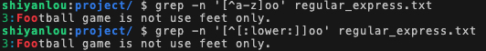

# 正则表达式
[[TOC]]

## 简介

> 正则表达式，又称规则表达式。（英语：Regular Expression，在代码中常简写为 regex、regexp 或 RE ），计算机科学的一个概念。正则表达式通常被用来检索、替换那些符合某个模式（规则）的文本。

Java 通过 `java.util.regex` 包支持正则表达式的的功能。

### 正则表达式概念

在做文字处理或编写程序时，若需要用到**查找、替换**等功能时，可以使用正则表达式来简单便捷地完成目标。

简单而言，正则表达式通过使用一些特殊符号，使得使用者可以方便轻松地实现查找、删除、替换等功能。

Vi 中经常会使用到正则表达式，为了充分发挥 shell 编程的威力，Linux 使用者需要精通正则表达式。

经常用于**检测字符串是否符合特定的规则**，在**网站上经常用于检测用户输入数据是否符合规范**：

- 检测 用户名 是否为 8~10 数字 英文（大小写）
- 检测 电话号码是否符合规则
- 检测 邮箱地址是否符合规则 
- 等

### 特殊符号

首先是正则表达式的特殊符号：

```txt
[:alnum:]代表英文大小写字母及数字
[:alpha:]代表英文大小写字母
[:blank:]代表空格和 tab 键
[:cntrl:]键盘上的控制按键，如 CR,LF,TAB,DEL
[:digit:]代表数字
[:graph:]代表空白字符以外的其他
[:lower:]小写字母
[:print:]可以被打印出来的任何字符
[:punct:]代表标点符号
[:upper:]代表大写字母
[:space:]任何会产生空白的字符如空格，tab,CR 等
[:xdigit:]代表 16 进位的数字类型
```

#### 特殊符号实例

在 WebIDE 中使用 touch 命令或图形界面新建一个 .txt 文件并将下文中的文本内容复制进去。

```bash
touch regular_express.txt
```

文本内容为：

```txt
"Open Source" is a good mechanism to develop programs.
apple is my favorite food.
Football game is not use feet only.
this dress doesn't fit me.
However, this dress is about \$ 3183 dollars.
GNU is free air not free beer.
Her hair is very beauty.
I can't finish the test.
Oh! The soup taste good.
motorcycle is cheap than car.
This window is clear.
the symbol '\*' is represented as start.
Oh!My god!
The gd software is a library for drafting programs.
You are the best is mean you are the no. 1.
The world <Happy> is the same with "glad".
I like dog.
google is the best tools for search keyword.
goooooogle yes!
go! go! Let's go.

# I am VBird
```

使用特殊符号查找小写字母：

```bash
grep -n '[[:lower:]]' regular_express.txt
```

**红色为匹配成功的字符。**

使用特殊符号查找数字：

```bash
grep -n '[[:digit:]]' regular_express.txt
```

### grep命令与正则表达式

#### 查找特定字符串

**参数说明：**

- -a ：以 text 档案的方式搜寻 binary 档案数据
- -c ：计算找到 '搜寻字符串' 的次数
- -i ：忽略大小写的不同，所以大小写视为相同
- -n ：顺便输出行号
- -v ：反向选择，亦即显示没有 '搜寻字符串' 内容的行

```bash
grep -n 'the' regular_express.txt

grep -in 'the' regular_express.txt
```

反向查找，当该行没有字符串'the'时才显示在屏幕上。

```bash
grep -vn 'the' regular_express.txt
```

#### 字符串匹配

`[ ]` 可以用来查找字符组。

值得注意的是，无论 `[ ]` 中包含多少个字符，它都只代表一个字符。比如说，我们想要查找 `tast` 或者 `test` 这两个字符串，注意到二者的拼写大部分相同，都是 `t?st` 的形式，故此时可以使用 `[ ]` 进行查找：

```bash
grep -n 't[ae]st' regular_express.txt
```

字符组支持使用连字符 `-` 来表示一个范围。当 `-` 前后构成范围时，要求前面字符的码位小于后面字符的码位。

`[^]` 为反向选择字符组，用于排除后面的字符，使用方式为 `[^...]`。

需要注意 `[^]` 与参数 `-v` 的区别，尽管二者都表示反向选择，但是如果包含有反向选择的字符的行含有其他字符的话，`[^]` 仍会输出该行，而 `-v` 则只会输出不含有反向选择的字符的行。

下面给出一些应用示例：

```txt
[abc]           ：表示 “a” 或 “b” 或 “c”
[0-9]           ：表示 0~9 中任意一个数字，等价于 [0123456789]
[\u4e00-\u9fa5] :表示任意一个汉字
[^a1<]          :表示除 “a”、“1”、“<” 外的其它任意一个字符
[^a-z]          :表示除小写字母外的任意一个字符
```

使用 `-` 和 `[^]` 查找 `Xoo` 形式的字符串，要求 `oo` 之前不能包含小写字母：

```bash
grep -n '[^a-z]oo' regular_express.txt
```

回忆前一节所提到的正则表达式特殊符号，`[:lower:]` 表示小写字母，因此也可以使用

```bash
grep -n '[^[:lower:]]oo' regular_express.txt
```



这两者是等价的，但是可以看出，使用[a-z]来表示小写字母明显更加便捷，也更加灵活。

查找字符 `oog`。

```bash
grep -n 'oog' regular_express.txt
```

如果我不想要 `oog` 字符前面有 g，则使用 `[^g]oog`。

```bash
grep -n '[^g]oog' regular_express.txt
```

同理，若不想让字符 `oog` 前面为 g 或者 o，则使用 `[^go]oog`。

```bash
grep -n '[^go]oog' regular_express.txt
```

其中

```bash
grep -n '[^go]oog' regular_express.txt
```

返回结果为空，表示没有匹配到符合要求的字符串。

#### 行首符^与行尾符$

在第一个实验中，我们使用

```bash
grep -n 'the' regular_express.txt
```

查找含有 `the` 的字符串，如果你只想查找行首为 `the` 的字符行，则使用以下命令：

```bash
grep -n '^the' regular_express.txt
```

查找行首为大写字母的所有行：

```bash
grep -n '^[A-Z]' regular_express.txt
```

注意行首符 `^` 和反向选择 `[^]` 的区别，`^[A-Z]` 表示以大写字母开头。`[^A-Z]` 表示除了大写字母 A-Z 的所有字符。

行尾符 `$` 的用法与行首符类似。

查找以字母 d 结尾的行：

```bash
grep -n 'd$' regular_express.txt
```

这里有一个小技巧，将行首符与行尾符连用，可以用来查找空行：

```bash
grep -n '^$' regular_express.txt
```

##### 应用实例

查看 `/etc/insserv.conf` 文档

`^$`： 过滤掉空白行

`^#`： 过滤掉注释行（以 `#` 号开头）

```bash
cat -n /etc/insserv.conf

grep -v '^$' /etc/insserv.conf | grep -v '^#'
```

#### 任意一个字符.与重复字符*

查找 `a?ou?` 类型的字符：

```bash
grep -n 'a.ou.' regular_express.txt
```

其中小数点表示任意一个字符，一个小数点只能表示一个未知字符。

```txt
*（星号）：代表重复前面 0 个或者多个字符。
e*： 表示具有空字符或者一个以上 e 字符。
ee*，表示前面的第一个 e 字符必须存在。第二个 e 则可以是 0 个或者多个 e 字符。
eee*，表示前面两个 e 字符必须存在。第三个 e 则可以是 0 个或者多个 e 字符。
ee*e ：表示前面的第一个与第三个 e 字符必须存在。第二个 e 则可以是 0 个或者多个 e 字符。
```

下面的第一条命令与第二条命令由于允许存在空字符，所以会打印所有文本。

```bash
grep -n 'e*' regular_express.txt

grep -n '@*' regular_express.txt

grep -n 'eee*' regular_express.txt
```

#### 限定连续字符范围

`{ }` 可限制一个范围区间内的重复字符数。如果现在要求找出存在连续的两个 o 字符的字符串，根据前面所学的知识，我们可以使用：

```bash
grep -n 'ooo*' regular_express.txt
```

另一种方式是使用 `{ }`。由于 `{` 与 `}` 在 shell 中有特殊意义，故在使用时需要用到转义字符 `\`。

查找连续的两个 o 字符：

```bash
grep -n 'o\{2\}' regular_express.txt
```

查找 g 后面接 2 到 5 个 o，然后再接 g 的字符串：

```bash
grep -n 'go\{2,5\}g' regular_express.txt
```

总结：

```txt
^word    表示待搜寻的字符串(word)在行首
word$    表示待搜寻的字符串(word)在行尾
.(小数点) 表示 1 个任意字符
\        表示转义字符，在特殊字符前加 \ 会将特殊字符意义去除
*        表示重复 0 到无穷多个前一个 RE(正则表达式)字符
[list]   表示搜索含有 l,i,s,t 任意字符的字符串
[n1-n2]  表示搜索指定的字符串范围,例如 [0-9] [a-z] [A-Z] 等
[^list]  表示反向字符串的范围,例如 [^0-9] 表示非数字字符，[^A-Z] 表示非大写字符范围
\{n,m\}  表示找出 n 到 m 个前一个 RE 字符
\{n,\}   表示 n 个以上的前一个 RE 字符
```

### sed命令与正则表达式

#### sed简介

sed 是非交互式的编辑器。它不会修改文件，除非使用 shell 重定向来保存结果。默认情况下，所有的输出行都会被打印到屏幕上。

sed 编辑器逐行处理文件（或输入），并将结果打印到屏幕上。

具体过程如下：首先 sed 把当前正在处理的行保存在一个临时缓存区中（也称为模式空间），然后处理临时缓冲区中的行，完成后把该行发送到屏幕上。

sed 每处理完一行就将其从临时缓冲区删除，然后将下一行读入，进行处理和显示。处理完输入文件的最后一行后，sed 便结束运行。sed 把每一行都存在临时缓冲区中，对这个副本进行编辑，所以**直接使用不会修改原文件内容。**

如果要修改原文件，需要添加 `-i` 选项。

#### 输出文件内容

将 regular_express.txt 的内容列出并打印行号，并将 2-5 行删除显示：

```bash
nl regular_express.txt | sed '2,5d'
```

`2,5d` 表示删除 2~5 行，d 即为 delete。

同理，删除第 2 行：

```bash
nl regular_express.txt | sed '2d'
```

删除第三行到最后一行, `$` 表示定位到最后一行：

```bash
nl regular_express.txt | sed '3,$d'
```

使用 `-i` 在原文件中删除第 1 行：（注意：该指令会修改原文件）

```bash
sed -i '1d' regular_express.txt
```

#### 使用a和i新增输出

在第二行后添加字符串 test：

```bash
nl regular_express.txt | sed '2a test'
```

在第二行前添加字符串 test：

```bash
nl regular_express.txt | sed '2i test'
```

在第二行后添加两行 test，`\n` 表示换行符：

```bash
nl regular_express.txt | sed '2a test\ntest'
```

#### 行内容替换

将 2-5 行的内容替换为 `No 2-5 number`，c 为替换内容选项：

```bash
nl regular_express.txt | sed '2,5c No 2-5 number'
```

#### 输出指定行

输出 regular_express.txt 的第 5-7 行，其中 `-n` 为安静模式选项，我们在前面的章节中已经介绍过。

执行以下两条命令可以明显看出区别：

```bash
nl regular_express.txt |sed -n '5,7p'

nl regular_express.txt |sed  '5,7p'
```

#### 字符串替换

格式为：`sed 's/lodstr/newstr/g'`

来看一个实例。首先查看本机 IP 地址：

```bash
ifconfig eth0
```

字段**inet 地址：192.168.x.x**即为本机的 IP 地址，这是经由 NAT 转换后分配的内网 IP 地址，在此不做展开。

之后使用 `grep` 指令在 `ifconfig eth0` 的结果中查找 `inet`，并打印至终端：

```bash
ifconfig eth0 | grep 'inet'
```

可以使用字符串替换功能将 IP 前面的部分予以删除，按照思路，也就是将 **inet 地址:** 替换为空字符串，可以简单写成：

```bash
ifconfig eth0 | grep 'inet '| sed 's/inet 地址://g'
```

（注意中文字符不能直接复制，需要自己在终端输入）

但正则表达式在实际应用中可以非常灵活，回想一下我们在前两节所学的关于正则表达式的知识（忘了也不要紧，可以随时返回查看）。

`.` 表示任意一个字符，`*` 表示重复字符，`{ }` 表示限定连续字符范围，所以正则表达式也可以写成：

```bash
ifconfig eth0 |grep 'inet '| sed 's/.inet...://g'
# 或者
ifconfig eth0 |grep 'inet '| sed 's/.\{0,9\}://'
```

表达式的写法并不唯一，在此也并未全部列出，大家亦可自行尝试使用其他写法，欢迎在评论区中讨论。

将 IP 后面的部分删除：

```bash
/sbin/ifconfig eth0 |grep 'inet '| sed 's/.inet...://g'| sed 's/..:.*$//g'

/sbin/ifconfig eth0 |grep 'inet '| sed 's/.inet...://g'| sed 's/.\{0,3\}:.*$//g'
```

上述指令是比较复杂的正则表达式运用，熟悉正则表达式后可以明显地简化指令，简单便捷地完成文件的查询、修改等任务。

### 正则表达式拓展应用

#### 使用拓展正则表达式egrep

首先来看一条前面章节学习过的用来去除空白行和注释行的指令：

```bash
grep -v '^$' regular_express.txt |grep -v '^#'
```

可见，通常的 `grep` 指令需要使用两次管线命令。那么如果使用扩展正则表达式，则可以简化为：

```bash
egrep -v '^$|^#' regular_express.txt
```

利用支持扩展正则表达式的 `egrep` 与特殊字符 `|` 的组合功能来间隔两组字符串，如此一来，可以极大地化简指令。

此外，也可以使用 `grep -E` 来使用扩展正则表达式，不过一般更建议直接使用 `egrep`，`grep -E` 与 `egrep` 之间类似命令别名的关系。

#### 拓展规则(一)

回忆一下，在非扩展正则表达式中，我们使用 `*` 来表示任意个重复字符（零至无穷多个）：

```bash
grep -n 'goo*d' regular_express.txt
```

在扩展正则表达式中，则可以进一步细分为*一个或一个以上*和*零个或一个*字符：

##### `+` 表示重复一个或一个以上的前一个字符

```bash
egrep -n 'go+d' regular_express.txt
```

##### `?` 表示重复零个或一个的前一个字符

```bash
egrep -n 'go?d' regular_express.txt
```

执行上述三条指令，比较三者的不同。

#### 拓展规则(二)

##### `|` 表示用或（or）的方式找出数个字符串

查找 gd 或 good：

```bash
egrep -n 'gd|good' regular_express.txt
```

##### `()` 表示找出组字符串

查找 glad 或 good，注意到由于二者存在重复字母，所以可以将其合并：

```bash
egrep -n 'g(la|oo)d' regular_express.txt
```

##### `()+` 多个重复群组判别

查找开头是 A 结尾是 C 中间有一个以上的 `xyz` 或 `xz` 字符串：

```bash
echo 'AxyzxyzxyzxyzC'|egrep 'A(xyz)+C'

echo 'AxyzxyzxyzxyzC'|egrep 'A(xz)+C'
```

结果显示 `A(xyz)+C` 可以匹配，`A(xz)+C` 没有匹配项。


## Java中的正则表达式


Java 使用正则表达式匹配非常简单，这里我们以匹配邮箱地址为例。

```java
import java.util.regex.Matcher;
import java.util.regex.Pattern;

public class RegexDemo {
    public static void main(String[] args) {
//       Pattern类 正则表达式的编译表示。
        Pattern pattern = Pattern.compile("^[a-zA-Z0-9_!#$%&'*+/=?`{|}~^.-]+@[a-zA-Z0-9.-]+$");
        String[] emails = {"shiyanlou@shiyanlou.com", "shiyanlou"};
        for (String email :
                emails) {
//Matcher 通过解释Pattern对字符序列执行匹配操作的引擎
            Matcher matcher = pattern.matcher(email);
            System.out.println(email + "匹配结果：" + matcher.matches());
        }
    }
}
```

### 正则HelloWorld

最简单的正则表达式："HelloWorld" 表示

- 一共有10个字符
- 出现的顺序必须是 HelloWorld

- Java 提供了正则API， 用于检测一个字符串是否符合，正则规则
  - boolean matchs(正则) 检测当前字符串是否符合正则规则 

```
正则规则 rule = "HelloWorld"
字符串： s1 = "HelloKitty"; 
字符串： s2 = "HelloWorld";
// s1 s2 中那个字符串符合 rule 约定的规则？
boolean b1 = s1.matches(rule); //false
boolean b2 = s2.matches(rule); //true
```

```java
package string;

public class RegDemo05 {
    public static void main(String[] args) {
        /*
         * 测试正则表达式
         */
        //定义正则表达式
        String rule = "HelloWorld";
        //定义被检测的字符串
        String s1 = "HelloKitty";
        String s2 = "HelloWorld";
        //检测 s1 是否符合规则
        boolean b1 = s1.matches(rule);
        //检测 s2 是否符合规则
        boolean b2 = s2.matches(rule);
        System.out.println(b1);
        System.out.println(b2);
    }
}
```

### 字符集

匹配一个有效字符范围。

语法:

```java
[123456]
```

意义：

- 匹配一个字符
- 其有效范围： 1 2 3 4 5 6 中的某一个

正则规则例子：

```java
Hello[123456]
```

- 匹配6个字符
- 前5个必须是Hello
- 第6个字符，必须 1 2 3 4 5 6 中的一个

如， 可以匹配的字符串：

- "Hello1"
- "Hello2"
- "Hello3"
- ...
- "Hello6"
- "Hello7" 不可以匹配！
- “HelloA” 不可以

正则例子： 我[草去艹]

### 字符范围

| 规则                       | 正则表达式                   | 范围     |
| -------------------------- | ---------------------------- | -------- |
| 匹配 0~9 一个字符          | [0123456789]                 | [0-9]    |
| 匹配A-Z一个字符            | [ABCDEFGHIJKLMNOPQRSTUVWXYZ] | [A-Z]    |
| 匹配a-z一个字符            | ...                          | [a-z]    |
| 匹配a-zA-Z一个字符         |                              | [a-zA-Z] |
| 匹配该字符只要不是a或b或c  | [^abc]                       |          |
| 匹配任意一个数字字母下划线 | [a-zA-Z0-9_]                 |          |

栗子： 

```
Hello[1-6]
```

### 预定义字符集

| 规则               | 正则         | 预定义字符集 | 栗子         |
| ------------------ | ------------ | ------------ | ------------ |
| 匹配一个数字       | [0-9]        | \d           | Hello\d      |
| 匹配一个单词字符   | [a-zA-Z0-9_] | \w           | A\w          |
| 匹配一个空白字符   |              | \s           | Hello\sWorld |
| 匹配任意一个字符   |              | .            | A.           |
| 匹配一个非数字     |              | \D           |              |
| 匹配一个非空白     |              | \S           |              |
| 匹配一个非单词字符 |              | \W           |              |

栗子, 网站上规则 用户名规则是6个单词字符：

正则规则： \w\w\w\w\w\w

java String: `"\\w\\w\\w\\w\\w\\w"`

测试案例：

```java
package string;

public class RegDemo07 {
    public static void main(String[] args) {
        /*
         * 测试 用户名规则：6个单词字符组成
         * - \ 在java字符串中需要进行转义为 \\
         */
        //正则表达式:  
        String reg = "\\w\\w\\w\\w\\w\\w";
        System.out.println(reg);
        //被检查的字符串
        String s1 = "Jerry1"; //可以通过检查
        String s2 = "Tom-12"; //不可以通过检查
        String s3 = "Andy";   //不可以通过检查
        System.out.println(s1.matches(reg));
        System.out.println(s2.matches(reg));
        System.out.println(s3.matches(reg));
    }
}
```

### 数量词

约定左侧元素出现的次数。

栗子:

```java
\w\w\w\w\w\w  等价  \w{6}  
```

语法：

```
X{n}  规定左侧X出现n次
X{n,m} 规定左侧X出现最少n次， 最多m次
X{0,n} 规定左侧X出现0到n次 
X{n,}  规定左侧X出现最少n次(含n次)
X?   和 X{0,1} 等价，X可以没有或者有一个
X+   和 X{1,} 等价，X至少有一个，多了随意，简称：一个以上
X*   和 X{0,} 等价，X至少有0个，多了随意 简称：0个以上
```

栗子：

- 网站的用户名是 8~16个单词字符： \w{8,16}
- 网站的密码是单词字符， 最少8个， 多了不限: \w{8,} 
- 匹配Hello World，中间至少有一个空白： Hello\s+World
  - 不能匹配 ：  "HelloWorld"
  - 不能匹配： "Hello World!"
  - 能匹配： "Hello World"
  - 能匹配： "Hello  World"
  - 能匹配： "Hello   World"

### 特殊字符转义

如何匹配字符 [ ] ? + * . , 使用 \特殊字符， 进行转义！

```
\. 匹配点 
\[ 匹配 [
\? 匹配 ?
\* 匹配 *
\+ 匹配 +
\\ 匹配 \
... 
```

如下正则的意义：匹配 `www.tedu.cn` 域名

-  www.tedu.cn  匹配：
   - www.tedu.cn  通过
   - wwwAteduAcn 通过
   - www-tedu-cn 通过

-  `www\.tedu\.cn` 匹配
   - www.tedu.cn 通过
   - wwwAteduAcn 不通过
   - www-tedu-cn 不通过

案例：如何检查一个字符串是否为正确的IPv4地址

正确IP：

"192.168.1.25" "192.168.199.1" "10.0.0.20" "8.8.8.8"

错误的IP：

"10-10-10-20" "192点168点5点25"

正则：`\d{1,3}\.\d{1,3}\.\d{1,3}\.\d{1,3}`

### 分组

将括号内的内容作为整体进行处理

栗子正则：

1. `\d{1,3}\.\d{1,3}\.\d{1,3}\.\d{1,3}`
2. `(\d{1,3}\.)(\d{1,3}\.)(\d{1,3}\.)\d{1,3}`

3. `(\d{1,3}\.){3}\d{1,3}`

```java
package string;

public class RegDemo11 {
    public static void main(String[] args) {
        /*
         * 检查IP地址是否符合规则
         */
        //定义正则规则
        //String reg = "\\d{1,3}\\.\\d{1,3}\\.\\d{1,3}\\.\\d{1,3}";
        String reg = "\\d{1,3}(\\.\\d{1,3})(\\.\\d{1,3})(\\.\\d{1,3})";
        //String reg = "(\\d{1,3}\\.){3}\\d{1,3}"; //测试分组
        //定义被检查的字符串
        String ip1 = "192.168.2.70";
        String ip2 = "10.0.0.20";
        String ip3 = "8.8.8.8";
        //定义错误的被检查字符串
        String ip4 = "192点168点2点70";
        String ip5 = "192-168-2-70";
        //检查
        System.out.println(ip1.matches(reg));
        System.out.println(ip2.matches(reg));
        System.out.println(ip3.matches(reg));
        System.out.println(ip4.matches(reg));
        System.out.println(ip5.matches(reg));
    }
}
```

栗子2：

1. `\d{1,3}\.\d{1,3}\.\d{1,3}\.\d{1,3}`
2. `\d{1,3}(\.\d{1,3})(\.\d{1,3})(\.\d{1,3})` 

3. `\d{1,3}(\.\d{1,3}){3}`

区别：

```
(\d{1,3}\.){3}\d{1,3}  (分组){3} 分组的整体出现3次
\d{1,3}\.{3}\d{1,3}   \.{3} .必须出现2次,可以匹配 “192...168”

(abc|def){3}表示abc或def可以匹配:abcabcabc 或 def,但不能匹配abcdef 或 abcdft
```

### java 正则API

- matches **(匹配)**检查字符串是否整体符合正则表达式规则
- split 劈开
- replaceAll 全部替换

#### matches 匹配

Java 使用正则表达式匹配非常简单，这里我们以匹配邮箱地址为例。

```java
import java.util.regex.Matcher;
import java.util.regex.Pattern;

public class RegexDemo {
    public static void main(String[] args) {
//       Pattern类 正则表达式的编译表示。
        Pattern pattern = Pattern.compile("^[a-zA-Z0-9_!#$%&'*+/=?`{|}~^.-]+@[a-zA-Z0-9.-]+$");
        String[] emails = {"shiyanlou@shiyanlou.com", "shiyanlou"};
        for (String email :
                emails) {
//Matcher 通过解释Pattern对字符序列执行匹配操作的引擎
            Matcher matcher = pattern.matcher(email);
            System.out.println(email + "匹配结果：" + matcher.matches());
        }
    }
}
```

```java
public class RegexDemo{
    public static void main(String[] args) {
        String email = "wangkj@tedu.cn";
        String regex = "[a-zA-Z0-9_]+@[a-zA-Z0-9]+(\\.[a-zA-Z]+)+";

        boolean match = email.matches(regex);
        if(match){
            System.out.println("是正确的邮箱");
        }else{
            System.out.println("不是正确的邮箱");
        }
    }
}
```


#### Split 劈开字符串(重要)

将一个字符串劈开为几个子字符串：

- "192.168.5.140" 劈开为 "192" "168" "5" "140"
- "1, Tom, 110, tom@tedu.cn" 劈开为 "1"  "Tom"  "110"  "tom@tedu.cn"

使用：

```
str 存储的是被劈开的字符串
正则 用于匹配劈开的位置点， 如： , 或者 \.
返回值 是劈开以后的数组，每个元素是 劈开的子字符串段落
      劈开以后，匹配的位置就没有了
String[] arr = str.split(正则);
```

案例：

```java
String str = "1, Tom, 110, tom@tedu.cn";
//             ,    ,    ,
//  arr=     "1" " Tom" " 110" " tom@tedu.cn"
String[] arr = str.split(",");
for(int i=0; i<arr.length; i++){
    System.out.println(arr[i]);
}

String line = "abc123def456ghi";
String[] data = line.split("[0-9]+");//按照数字部分拆分
System.out.println(data.length);
System.out.println(Arrays.toString(data));
```

#### replaceAll

replace:  替换

all：全部

将正则表达式匹配到的字符，都替换为新字符串

例子： 

我草疫情又严重了，我去，又要做核算了。

需要替换为 `***疫情又严重了，***，又要做核算了。`

代码：

```java
Scanner scanner = new Scanner(System.in);
System.out.print("请输入:");
String str = scanner.nextLine();
//String str = "我草疫情又严重了，我去，又要做核算了。";
// str.replaceAll("正则", 替换字符串);
String s = str.replaceAll("我[去草靠艹]", "***");
System.out.println(s);

String line = "abc123def456ghi";
line = line.replaceAll("[0-9]+","#NUMBER");
System.out.println(line);
```


## 常用正则表达式

### **一、校验数字的表达式**

```
 1 数字：^[0-9]*$
 2 n位的数字：^\d{n}$
 3 至少n位的数字：^\d{n,}$
 4 m-n位的数字：^\d{m,n}$
 5 零和非零开头的数字：^(0|[1-9][0-9]*)$
 6 非零开头的最多带两位小数的数字：^([1-9][0-9]*)+(.[0-9]{1,2})?$
 7 带1-2位小数的正数或负数：^(\-)?\d+(\.\d{1,2})?$
 8 正数、负数、和小数：^(\-|\+)?\d+(\.\d+)?$
 9 有两位小数的正实数：^[0-9]+(.[0-9]{2})?$
10 有1~3位小数的正实数：^[0-9]+(.[0-9]{1,3})?$
11 非零的正整数：^[1-9]\d*$ 或 ^([1-9][0-9]*){1,3}$ 或 ^\+?[1-9][0-9]*$
12 非零的负整数：^\-[1-9][]0-9"*$ 或 ^-[1-9]\d*$
13 非负整数：^\d+$ 或 ^[1-9]\d*|0$
14 非正整数：^-[1-9]\d*|0$ 或 ^((-\d+)|(0+))$
15 非负浮点数：^\d+(\.\d+)?$ 或 ^[1-9]\d*\.\d*|0\.\d*[1-9]\d*|0?\.0+|0$
16 非正浮点数：^((-\d+(\.\d+)?)|(0+(\.0+)?))$ 或 ^(-([1-9]\d*\.\d*|0\.\d*[1-9]\d*))|0?\.0+|0$
17 正浮点数：^[1-9]\d*\.\d*|0\.\d*[1-9]\d*$ 或 ^(([0-9]+\.[0-9]*[1-9][0-9]*)|([0-9]*[1-9][0-9]*\.[0-9]+)|([0-9]*[1-9][0-9]*))$
18 负浮点数：^-([1-9]\d*\.\d*|0\.\d*[1-9]\d*)$ 或 ^(-(([0-9]+\.[0-9]*[1-9][0-9]*)|([0-9]*[1-9][0-9]*\.[0-9]+)|([0-9]*[1-9][0-9]*)))$
19 浮点数：^(-?\d+)(\.\d+)?$ 或 ^-?([1-9]\d*\.\d*|0\.\d*[1-9]\d*|0?\.0+|0)$
```

### **二、校验字符的表达式**

```
 1 汉字：^[\u4e00-\u9fa5]{0,}$
 2 英文和数字：^[A-Za-z0-9]+$ 或 ^[A-Za-z0-9]{4,40}$
 3 长度为3-20的所有字符：^.{3,20}$
 4 由26个英文字母组成的字符串：^[A-Za-z]+$
 5 由26个大写英文字母组成的字符串：^[A-Z]+$
 6 由26个小写英文字母组成的字符串：^[a-z]+$
 7 由数字和26个英文字母组成的字符串：^[A-Za-z0-9]+$
 8 由数字、26个英文字母或者下划线组成的字符串：^\w+$ 或 ^\w{3,20}$
 9 中文、英文、数字包括下划线：^[\u4E00-\u9FA5A-Za-z0-9_]+$
10 中文、英文、数字但不包括下划线等符号：^[\u4E00-\u9FA5A-Za-z0-9]+$ 或 ^[\u4E00-\u9FA5A-Za-z0-9]{2,20}$
11 可以输入含有^%&',;=?$\"等字符：[^%&',;=?$\x22]+
12 禁止输入含有~的字符：[^~\x22]+
```

### **三、特殊需求表达式**

```
 1 Email地址：^\w+([-+.]\w+)*@\w+([-.]\w+)*\.\w+([-.]\w+)*$
 2 域名：[a-zA-Z0-9][-a-zA-Z0-9]{0,62}(/.[a-zA-Z0-9][-a-zA-Z0-9]{0,62})+/.?
 3 InternetURL：[a-zA-z]+://[^\s]* 或 ^http://([\w-]+\.)+[\w-]+(/[\w-./?%&=]*)?$
 4 手机号码：^(13[0-9]|14[0-9]|15[0-9]|16[0-9]|17[0-9]|18[0-9]|19[0-9])\d{8}$ (由于工信部放号段不定时，所以建议使用泛解析 ^([1][3,4,5,6,7,8,9])\d{9}$) 5 电话号码("XXX-XXXXXXX"、"XXXX-XXXXXXXX"、"XXX-XXXXXXX"、"XXX-XXXXXXXX"、"XXXXXXX"和"XXXXXXXX)：^(\(\d{3,4}-)|\d{3.4}-)?\d{7,8}$ 
 6 国内电话号码(0511-4405222、021-87888822)：\d{3}-\d{8}|\d{4}-\d{7}  7 18位身份证号码(数字、字母x结尾)：^((\d{18})|([0-9x]{18})|([0-9X]{18}))$ 8 帐号是否合法(字母开头，允许5-16字节，允许字母数字下划线)：^[a-zA-Z][a-zA-Z0-9_]{4,15}$
 9 密码(以字母开头，长度在6~18之间，只能包含字母、数字和下划线)：^[a-zA-Z]\w{5,17}$
10 强密码(必须包含大小写字母和数字的组合，不能使用特殊字符，长度在8-10之间)：^(?=.*\d)(?=.*[a-z])(?=.*[A-Z]).{8,10}$  
11 日期格式：^\d{4}-\d{1,2}-\d{1,2}
12 一年的12个月(01～09和1～12)：^(0?[1-9]|1[0-2])$
13 一个月的31天(01～09和1～31)：^((0?[1-9])|((1|2)[0-9])|30|31)$ 
14 钱的输入格式：
    1.有四种钱的表示形式我们可以接受:"10000.00" 和 "10,000.00", 和没有 "分" 的 "10000" 和 "10,000"：^[1-9][0-9]*$ 
    2.这表示任意一个不以0开头的数字,但是,这也意味着一个字符"0"不通过,所以我们采用下面的形式：^(0|[1-9][0-9]*)$ 
    3.一个0或者一个不以0开头的数字.我们还可以允许开头有一个负号：^(0|-?[1-9][0-9]*)$ 
    4.这表示一个0或者一个可能为负的开头不为0的数字.让用户以0开头好了.把负号的也去掉,因为钱总不能是负的吧.下面我们要加的是说明可能的小数部分：^[0-9]+(.[0-9]+)?$ 
    5.必须说明的是,小数点后面至少应该有1位数,所以"10."是不通过的,但是 "10" 和 "10.2" 是通过的：^[0-9]+(.[0-9]{2})?$ 
    6.这样我们规定小数点后面必须有两位,如果你认为太苛刻了,可以这样：^[0-9]+(.[0-9]{1,2})?$ 
    7.这样就允许用户只写一位小数.下面我们该考虑数字中的逗号了,我们可以这样：^[0-9]{1,3}(,[0-9]{3})*(.[0-9]{1,2})?$ 
    8.1到3个数字,后面跟着任意个 逗号+3个数字,逗号成为可选,而不是必须：^([0-9]+|[0-9]{1,3}(,[0-9]{3})*)(.[0-9]{1,2})?$ 
    备注：这就是最终结果了,别忘了"+"可以用"*"替代如果你觉得空字符串也可以接受的话(奇怪,为什么?)最后,别忘了在用函数时去掉去掉那个反斜杠,一般的错误都在这里
15 xml文件：^([a-zA-Z]+-?)+[a-zA-Z0-9]+\\.[x|X][m|M][l|L]$
16 中文字符的正则表达式：[\u4e00-\u9fa5]
17 双字节字符：[^\x00-\xff]    (包括汉字在内，可以用来计算字符串的长度(一个双字节字符长度计2，ASCII字符计1))27 空白行的正则表达式：\n\s*\r    (可以用来删除空白行)
18 HTML标记的正则表达式：<(\S*?)[^>]*>.*?</\1>|<.*? />    (网上流传的版本太糟糕，上面这个也仅仅能部分，对于复杂的嵌套标记依旧无能为力)29 首尾空白字符的正则表达式：^\s*|\s*$或(^\s*)|(\s*$)    (可以用来删除行首行尾的空白字符(包括空格、制表符、换页符等等)，非常有用的表达式)
19 腾讯QQ号：[1-9][0-9]{4,}    (腾讯QQ号从10000开始)
20 中国邮政编码：[1-9]\d{5}(?!\d)    (中国邮政编码为6位数字)
21 IP地址：\d+\.\d+\.\d+\.\d+    (提取IP地址时有用)
22 IP地址：((?:(?:25[0-5]|2[0-4]\\d|[01]?\\d?\\d)\\.){3}(?:25[0-5]|2[0-4]\\d|[01]?\\d?\\d))
```

## 练习题


你需要完成以下要求：

- 从控制台输入一串字符串，使用正则表达式判断其是不是 11 位手机号码。
- 如果是 11 位手机号码，输出 `true`，如果不是输出 `false`。

```java
import java.util.Scanner;
import java.util.regex.Matcher;
import java.util.regex.Pattern;

public class RegexTest {
    public static void main(String[] args) {
        Pattern pattern = Pattern.compile("^1([34578])\\d{9}$");
        Scanner in = new Scanner(System.in);
        String phone = in.nextLine();
        Matcher matcher = pattern.matcher(phone);
        System.out.println(matcher.matches());
    }
}
```

