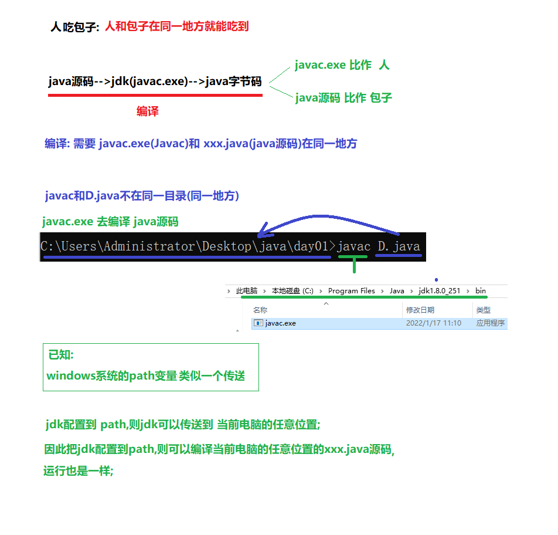
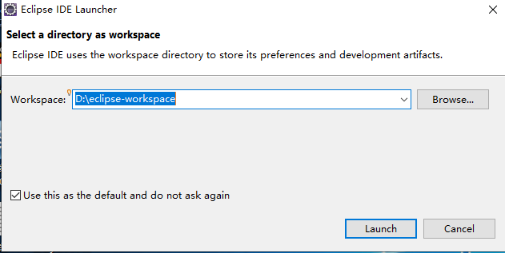
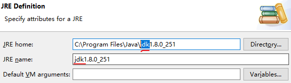
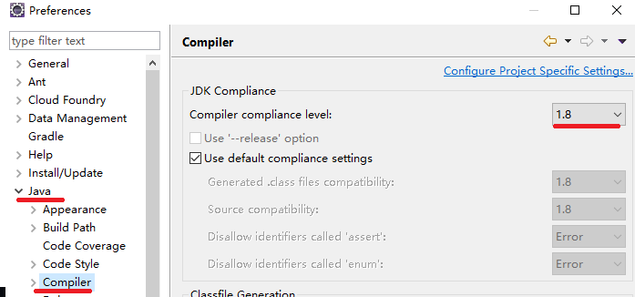
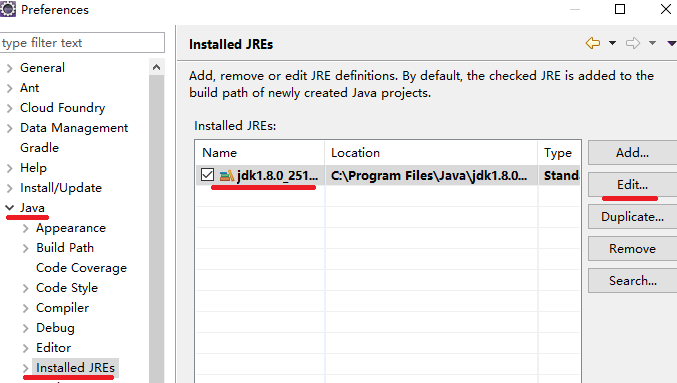
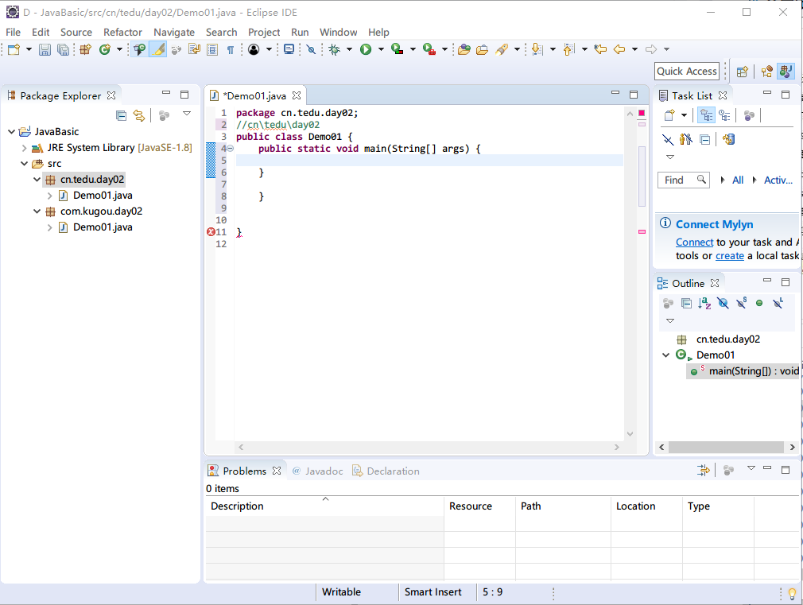

# Java开发环境配置
[[TOC]]
## JDK的安装
[JDK官网](https://www.oracle.com/index.html)
[文档服务器](http://doc.canglaoshi.org/)
## 为什么配置JDK


## JDK安装流程
**JDK版本:1.8**
[安装流程](https://www.yuque.com/docs/share/8fce8ee7-6884-4ceb-a3da-6a5fa8fa1602?#)

JAVA_HOME   //系统变量
C:\Program Files\Java\jdk1.8.0_321   //系统变量对应的值

JRE_HOME  //系统变量
C:\Program Files\Java\jre1.8.0_321  //系统变量对应的值

Path不要去频繁更改,容易删掉一些重要的东西:

Path:
  %JAVA_HOME%\bin (等于C:\Program Files\Java\jdk1.8.0_251\bin)
  %JRE_HOME%\bin (等于C:\Program Files\Java\jre1.8.0_321\bin)

问题: 配置jdk为什么要多出 JAVA_HOME 和 JRE_HOME 这两个系统变量呢?

原因1: 因为系统变量里的   %JAVA_HOME% 就是调用 系统变量  JAVA_HOME对应的值,
          我们更换版本的时候,只要更换 JAVA_HOME 变量的执行,从而达到
          更换  %JAVA_HOME%\bin 的目的,从而减少了Path的更改,
          降低了删除path里数据的风险;
原因2: 后期java用到的工具(tomcat服务器软件) 需要用到 JAVA_HOME系统变量和JRE_HOME系统变量
```
cmd//直接在文件目录后输入cmd即可打开命令行
javac XX.java //编译java文件
java XX //运行.class文件,执行的命令是 java XX，而不是 java XX.java。
```
## 测试是否配置成功
win+r--->管理员cmd--->java -version
## IDE安装
### 安装
解压我们下载好的eclipse-jee-2018-12-R-win32-x86_64.zip,解压的文件夹剪切到D盘根目录,把带图标的eclipse.exe发送桌面快捷方式.
设置工作空间(工作空间:放java项目的目录)
(勾选是为了把这个目录设置为默认放java项目的目录)



### 使用
#### 切换项目
file-->switch worksapce-->填写目录(这个目录就是工作空间,就是存Java项目的地方).
#### 创建Java项目
File-->new-->project...

-->java project -->next

-->project name(项目名): JavaBasic (基础)

-->选择: use default JRE(Java运行环境),如果不是jdk1.8xx就需要(_**配置**_ java运行环境

-->**_configure_** JREs(_**配置**_ java运行环境)

-->选择jre1.8xxx

-->Edit... (编辑)

-->把JRE home和 JRE name里的"jre"改成 "jdk" 即可(jre更少功能,tomcat用jre)



-->Finish(完成)

-->apply and close(应用并关闭)

#### 全局改jre为jdk
windows-->preferences(偏爱)
设置编译版本(1.8,java1.8版本)



设置java运行环境(JRE)为jdk1.8



#### 创建包

(src(放源码地方) -->右键-->new-->package-->填写包(包名全小写,并符合 域名反写.功能的格式 如:com.baidu.search)-->finish(完成)

src-->右键-->属性(ProPerties)-->Location-->点击弹窗-->目录地址

#### 创建类
包-->右键-->new-->class(类)-->填写类名(每个组成类名的单词首字母都大写) -->finish(完成)

#### eclipse视图



project explorer( 项目视图:看项目结构的地方)和package explorer(包视图:也是看项目结构的地方);
console(控制台视图: 看代码运行结果)

#### 运行
每一次敲完代码一定要保存: ctrl+s
Run Demo 就是去运行Demo01.java
( 代码-->空白处右键-->run as (通过什么运行) --> java application(java工具) -->得到结果)

Terminate :终端 (就是控制台)
终端是红的表示程序在运行
终端是灰色的表示程序已经结束

#### 快捷键
alt+/ : 代码提示
ctrl+a: 全选
ctrl+i: 调整代码格式
ctrl+s:保存

#### debug
可以让代码逐行执行,查看代码执行的过程,调试程序中出现的bug
**使用方式**:
在行号的右边,鼠标左键单击,添加断点(每个方法的第一行,哪里有bug添加到哪里)
右键,选择Debug执行程序
程序就会停留在添加的第一个断点处
**执行程序**:
f8:逐行执行程序
f7:进入到方法中
**shift+f8**:跳出方法
f9:跳到下一个断点,如果没有下一个断点,那么就结束程序
**ctrl+f2**:退出debug模式,停止程序
Console:切换到控制台


**1.** 在有效代码行，点击行号右边的空白区域，设置断点，程序执行到断点将停止，我们可以手动来运行程序


2. 点击Debug运行模式


3. 程序停止在断点上不再执行，而IDEA最下方打开了Debug调试窗口


4. Debug调试窗口介绍


5. 快捷键F8，代码向下执行一行,第九行执行完毕，执行到第10行（第10行还未执行）


6. 切换到控制台面板，控制台显示 请录入一个字符串： 并且等待键盘录入


7. 快捷键F8，程序继续向后执行，执行键盘录入操作，在控制台录入数据 ababcea


调试界面效果：


8. 此时到达findChar方法，快捷键F7，进入方法findChar


9. 快捷键F8 接续执行，创建了**map**对象，变量区域显示


10. 快捷键**F8** 接续执行，进入到循环中，循环变量i为 0,**F8**再继续执行，就获取到变量c赋值为字符‘a’ 字节值97


11. 快捷键F8 接续执行，进入到判断语句中，因为该字符 不在Map集合键集中，再按F8执行，进入该判断中


12. 快捷键F8 接续执行，循环结束，进入下次循环，此时**map**中已经添加一对儿元素


13. 快捷键F8 接续执行，进入下次循环，再继续上面的操作，我们就可以看到代码每次是如何执行的了


14. 如果不想继续debug,那么可以使用快捷键F9,程序正常执行到结束，程序结果在控制台显示


#### 字体大小
[字体大小](https://jingyan.baidu.com/article/f96699bb9442f3894e3c1b15.html)

windows-->preferences(偏爱)-->General(常规)-->appearance(样式)-->Color and fonts(颜色和字体)-->Basic(基础)-->Text Font(文本字体)-->Edit(编辑)-->大小改成14左右 -->确定-->apply and close(应用并关闭)
