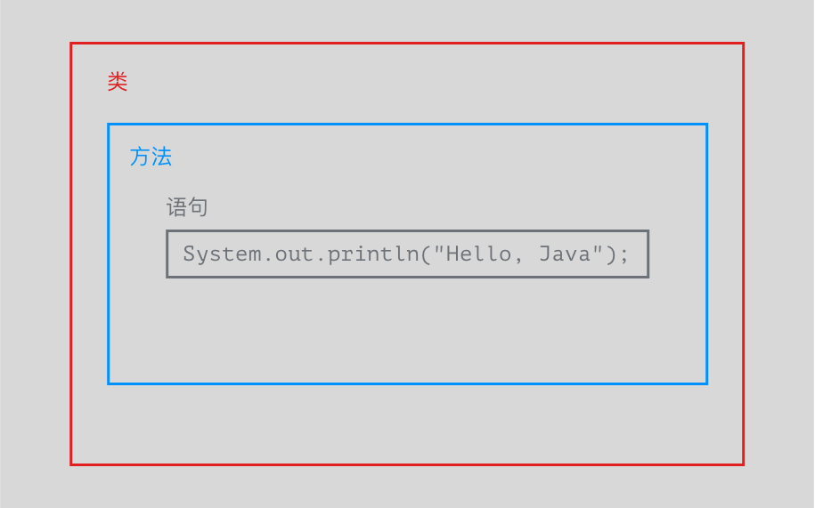
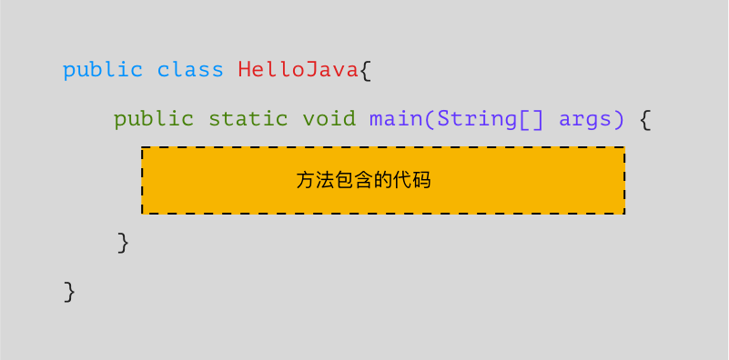
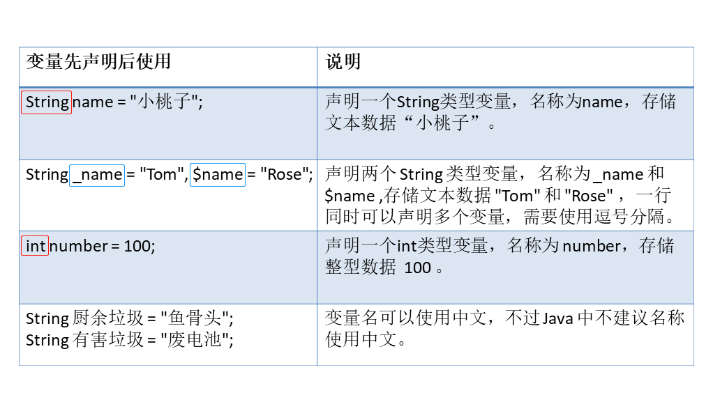
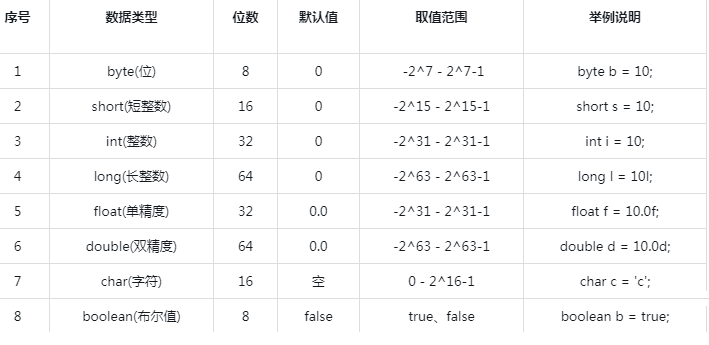
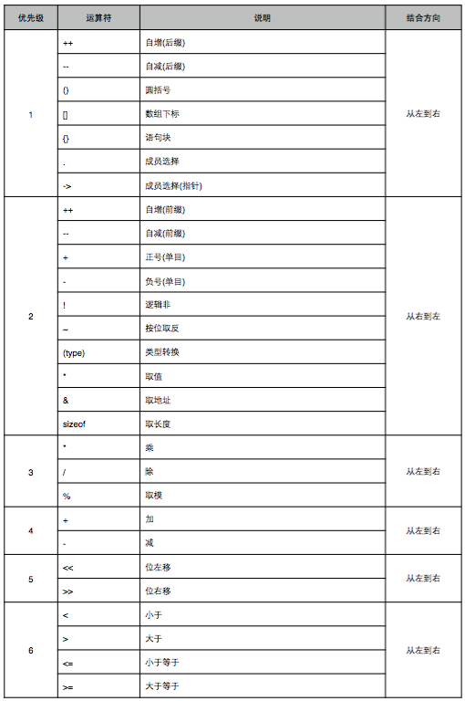
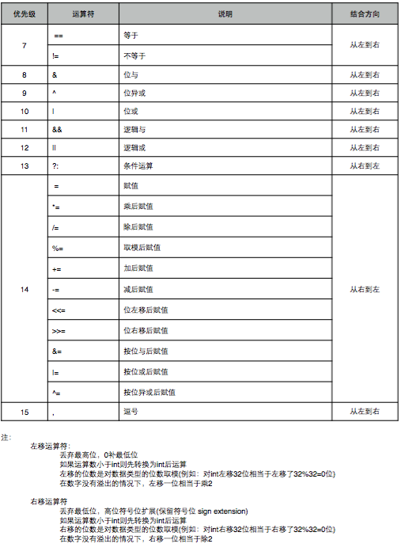
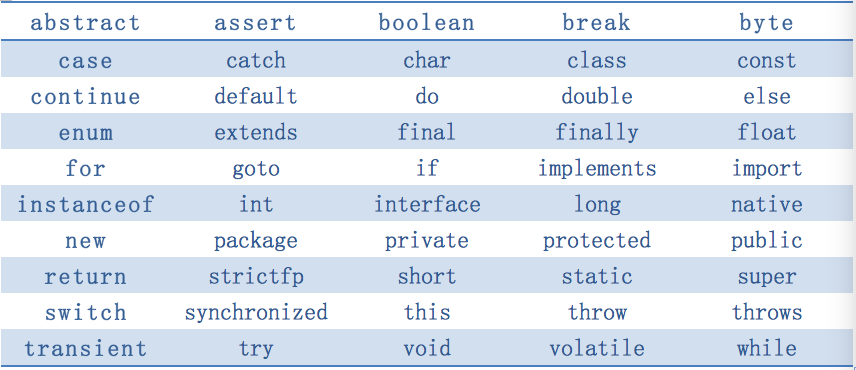

# 变量与常量
[[TOC]]
## 代码
一个最基础的 Java 程序是什么样子的呢？如下图所示，它至少包含：**类、方法和代码语句三个部分**。


首先，**让我们来了解什么是「类」**。最基础的 Java 程序由类组成，**至少包含 1 个类**，最多可以成千上万。对于每个类，都创建一个单独的 Java 文件存放，**文件的名称必须和类的名称相同**。单个类的结构如下：


-   一个类由包含声明类的规定写法  `public class`  开头。
-   然后紧接着是类的名称，这个由你自由取名，例如这里叫  `HelloJava`。
-   然后由一对花括号  `{}`  包裹类的主体。

类的里面是类主体，主要包裹着方法。方法，也就是函数，是程序的主要功能实现。但需要你记住的是，**类必须包含至少一个方法/函数才能使程序运行**，而这个方法必须命名为 `main`。

此外，`main` 方法是 Java 应用程序的入口方法，也就是说，程序在运行的时候，第一个执行的方法就是 `main` 方法，这个方法名字必须是 `main`，方法必须是 `public static void` 类型的，方法必须接收一个字符串数组的参数等。**这是规定！**



**特别需要注意的是**，代码文件必须以  `HelloJava.java`  命名。你还记得为什么吗？

> 答案上文说过：Java 文件的名称必须和类的名称相同。

```Java
package cn.tedu.day01;//包的声明--告诉我们当前类在哪个包下
public class Demo01{
	public static void main(String[] args) {
		
	}
}

/*
public class Demo01 {
	
}
分析:  public  公开(表示可以被其他用)
         class    类(跟我们人写的 信 是一个道理)
         Demo01 类名(即信的名字),类名可以变化
         { }  类体,里面放核心内容,类体的大括号要成对存在

public static void main(String[] args) {
		
}
分析: 这个叫main方法
	main方法是固定的,写在类里面
	main方法是程序的入口
	执行代码写在main方法里
	在eclipse里的快捷方式:
	    main-->alt+/-->回车
*/

```
**红色说明是编译错误**

## 注释

// : 单行注释

     两个连续的斜杠后的内容为注释内容
     
/* */: 多行注释

   第一个/*到第一个*/中间的内容就是多行注释内容,
   一行注释不够就用多行注释
  多行注释怎么打出来的:
	斜杠-->*-->回车

文档注释(了解即可):

  /**

  */


文档注释是功能级注释,只在三个地方使用,分别是类上,方法上和常量上文档注释可以通过javadoc命令生成手册.

```java
package apidoc;

/**
 * 文档注释是功能级注释,只在三个地方使用,分别是类上,方法上和常量上
 * 文档注释可以通过javadoc命令生成手册.
 *
 * 在类上使用时用来说明当前类的设计目的和整体功能介绍.
 *
 * @author 作者
 */
public class ApiDocDemo {
    /**
     * sayHello方法中使用的问候语
     */
    public static final String INFO = "你好!";

    /**
     * 为给定的用户添加问候语
     * @param name  给定的用户的名字
     * @return  含有问候语的字符串.
     */
    public String sayHello(String name){
        return INFO + name;
    }
}
```


  一般用在方法或属性上
## 变量
变量: 存储变化数据的空间  

不同的数据存储在不同类型的变量中;  
整数: 1,2,3 用int变量存;  
小数(浮点数) : 1.1,1.2,...一般用double存;  
对和错的表达用bolean类型存,true表示对,flase表示错;  
单个字符用char类型存储;
### 变量命名(标识符)
1、Java变量命名只能使用**字母**、**数字**、**下划线**、**美元符号**($)组成。

`a123` `$_12`  `$fd1`  `_34 ` 
	
2、变量名 不建议使用美元符和下划线开头,**数字不能开头**。

`1_` 是错的   `$aa`是不标准的    `_1$aa`是不标准的

3、变量的名字 第一个单词首字母小写,其他单词首字母大写。
`legLen`   `eaysSize`   `age` 

4、变量名可以是**中文,但不建议使用**。

5、变量名**不可以和java关键字冲突，但是可以包含关键字**。  
	eclipse中紫色加粗的是关键字(jdk自定义出来的标识)

#### 建议

1. "英文的见名知意"
2. "小驼峰命名法":第一个单词首字母小写,其余单词首字母大写,如方法,变量名

```java
score,myScore,myJavaScore
```


> 大驼峰命名法/帕斯卡命名法:所有单词首字母都大写,如类名
>
> ```java
> Score,MyScore
> ```
>
> 

### 变量的专业术语

####  变量的声明
```java
int a ; //类型  变量名;  不能被使用,只有初始化后才可以被使用
int b,c,d;//声明了三个整型的变量
```

####  变量的初始化
```
a = 3; //第一次给a一个值(第一次给a赋值),叫初始化
````
#### 变量的定义 
```
 int b =3; //定义就是声明+初始化
```

#### 变量的普通赋值
```
a = 4; //已经初始化过了,再次赋值就是普通赋值 
b = 4; 
```
#### 变量的赋值
=叫赋值号

 编译: 从上到下,从左到右
 运行: 先看=右边,再看左边
 什么是编译,什么是运行?
 	xxx.java -->经过jdk的javac.exe做了编译
	-->编译成xxx.class(字节码)
	-->jdk的java.exe做了运行(把字节码变成0101)
举例1:
   byte a = 200;  
   a存一个超过byte类型的值,所以错了,报编译错误;
   报错提醒在200上,因为编译是 从上到下,从左到右的,
   则byte和变量a先入为主, 跑到200时,发现200不能
  放到byte类型的a中,则报200的错;

举例2: 
   我们如果通过了编译, 实际数据是如何存储的呢?
   int b = 3;
   运行时,会抓取 = 右边的数值, 之间存入到 = 左边的变量中;
  (讲debug的时候会再次讲解)
### 变量类型

```java
1 G = 1024 M(兆)
1 M = 1024 KB(千字节)
1 KB = 1024 B(Byte,字节)
1B = 1 bit(位,比特)
直接量:直接写出来的数(5,10000000000,3.14,true,'你')
整数直接量:直接写出来的整数(100000)
```




|数据类型|	默认值	|存储格式	|数据范围	|包装类型|
|--|--|--|--|--|
|short|	0	|2 个字节|	-32,768 到 32,767|	Short|
|int|	0	|4 个字节	|-2,147,483,648 到 2,147,483,647;21个多亿	|Integer|
|byte|	0	|1 个字节|	-128 到 127	|Byte|
|char|	空|	2 个字节	|Unicode 的字符范围：\u0000（即为 0）到 \uffff（即为 65,535）	|Character|
|long	|`0L` 或 `0l`|	8 个字节	|-9,223,372,036,854,775,808 到 9,223,372,036,854,775,807|	Long|
|float	|`0.0F` 或 `0.0f`|	4 个字节|	32 位 IEEEE-754 单精度范围|	Float|
|double	|`0.0` 或 `0.0D`(d)	|8 个字节|	64 位 IEEE-754 双精度范围|	Double|
|boolean|	false	|1 位|	true 或 false	|Boolean|

####  1、整型(整数,没小数点的)
byte 、short 、int 、long 

最常用**int**

**注意**

1. 整数直接量默认为int类型,直接量超出范围编译报错;

2. 运算时若超范围,则发生溢出(溢出不是错误,但是需要避免)

> 最大值+1变成最小值----->2147483647+1---->-2147483647
>
> 1000000000000000000*10;//运算时超范围,编译不报错,溢出错误

需要注意的是 `long` 类型，使用 `long` 修饰的变量需要在数值后面加上 L 或者 l，比如 `long num = 1L;`，一般使用大写 `L`，为了避免小写 `l` 与数值 `1` 混淆。

```java
long b = 1000000000000L*3;
System.out.println(b);//输出正常,3被转换为long类型
long d = 1000000000*3*10L;
System.out.println(d);//输出溢出,进行1000000000*3运算时出现溢出
```


`long`型:900万万亿

`Integer`整型:无穷大

**在Java中,一般不用short,仅是为和C语言兼容.**

#### 2、浮点型(浮点型,浮点数类型或浮点数或小数,有小数点的)
float 、 double
默认用**double**
需要注意的是 `float` 类型的数值后面需要加上 `F` 或者 `f`，否则会被当成 `double` 类型处理。`double` 类型的数值可以加上 `D` 或 `d`，也可以不加。

double和float型数据参与运算时,有可能会产生小的舍入误差,精确场合不能使用.

**在Java中,一般不用float,仅是为和C语言兼容.**

#### 3、字符型
char:2个字符

* 采用Unicode字符集编码格式,一个字符对应一个码

  表现的形式是字符char,但本质上是码int(0到65535之间)

需要将字符用单引号括起来`char a = 'a'`,并且只能有一个，char 可以和整数互相转换，如果字符 `a` 也可以写成`char a = 97`。也可以用十六进制表示`char a = '\u0061'`。

> unicode:通用码,统一码,万国码.世界级通用的定长(固定16位)字符集.
>
> 因为符号太多了,所以Unicode又被划分为很多个子集
>
> Java中的char采用的是其中最常用的一个子集(65536个)

#### ACSII,UTF-8,GBK,unicode编码

> ASCII码:美国标准编码，是美国最早的字符集，也是计算机最底层的字符集，一个字节,属于Unicode的一部分,'a' ---97,'A' -----65,'0'---------48


> UTF-8:互联网上使用最多的一种Unicode使用方式,在Unicode基础之上做的二次编码，里面加入了一个长度信息来标记是按一个字符解析还是按两个字符算
>
> GBK：国标编码，中国自己的编码，总共6万多个

> 结论：互联网上真正使用的并不是unicode，真正传输出的是UTF这种带长度信息的编码，拿到UTF数据后再把长度去掉，还原成unicode编码。

**转义字符**

因为字符串使用双引号`"..."`表示开始和结束，那如果字符串本身恰好包含一个`"`字符怎么表示？例如，`"abc"xyz"`，编译器就无法判断中间的引号究竟是字符串的一部分还是表示字符串结束。这个时候，我们需要借助转义字符`\`：

常见的转义字符包括：

- `\"` 表示字符`"`
- `\'` 表示字符`'`
- `\\` 表示字符`\`
- `\n` 表示换行符
- `\r` 表示回车符
- `\t` 表示Tab,制表位,水平对齐,固定8位
- `\u####` 表示一个Unicode编码的字符

```java
char c9 = '\';
System.out.println(c9);//''
```


#### 4、布尔型(只能存true和false)

boolean ,1个字节.一般用在分支结构和循环结构中

8>9 这件事是错的,则 8>9 用 false表示
8>7 这件事是对的,则 8>7 用 true表示

```java
boolean b1 = true; 
boolean b2 = false; 
boolean b3 = "Y"; /*<-- "Y" 这是属于字符串，不是布尔值，布尔值只有
true或false，所以这行代码一定通不过编译，同样会告诉你不兼容类型。自己可以
在JavaDemo类文件中加入以上三行代码，看看编译结果。*/
```

**java数据类型分:
	基本数据类型和引用数据类型;
	引用数据类型(首字母大写)有:
		数组
		类:String(字符串)
		接口
		枚举**


**IDEA中的变量为灰色,意味着没有被使用**


### 类型间的转换

> 基本类型由小到大依次为:
>
> byte---
>
> short--int--long---float---double 
>
> char----

**两种方式**

* 自动/隐式类型转换:小类型到大类型

```java
int a = 5;
long b = a;//隐式类型转换
int c = (int)b;//强制类型转换

//特殊格式
long d = 5;//int自动类型转换为long
double e = 5;//自动类型转换

```


* 强制类型转换:大类型到小类型,有可能发生溢出,有可能丢失精度.

**两点规则**

* 整数直接量可以直接赋值给byte,short,char,但不能超出范围

```
byte b1 = 5;

int a = 5;
byte b2 = a;//编译错误
```

* byte,short,char型数据参与运算时,系统一律自动将其转换为int再运算.

  ```java
  byte b1 = 5;
  byte b2 = 6;
  //byte b3 = b1 + b2;//编译错误,b1 + b2是int类型
  byte b3 = (byte)(b1 + b2);//byte b3 = (byte)b1 +b2只转换b1
  
  System.out.println('2'+'2');//100,'2'的ACII码是50
  ```

  

### String
**String**  是最常用的一种存储文本的数据类型；

> 1. String：字符串类型
>
>    - java.lang.String使用的final修饰，不能被继承
>    - 字符串底层封装了字符数组以及针对字符数组的操作算法
>    - Java字符串在内存中采用Unicode编码方式，任何一个字符对应两个字节的编码
>    - 字符串一旦创建，对象内容永远无法改变，但字符串引用可以重新赋值
>
> 2. 常量池：
>
>    - java对字符串有一个优化措施：字符串常量池(堆中)
>    - java推荐我们使用字面量/直接量的方式来创建字符串，并且会缓存所有以字面量形式创建的字符串对象到常量池中，当使用相同字面量再次创建字符串时会重用对象以减少内存开销，避免内存中堆积大量内容相同的字符串对象
>
>    ```java
>    /*
>      使用字面量创建字符串时:
>      1.JVM会检查常量池中是否有该对象:
>        1)若没有，则创建该字符串对象并存入常量池
>        2)若有，则直接将该对象返回而不再创建一个新的字符串对象
>     */
>    /*
>    String s1 = "123abc"; //常量池还没有，因此创建该字符串对象，并存入常量池
>    String s2 = "123abc"; //常量池已有了，直接重用对象
>    String s3 = "123abc"; //常量池已有了，直接重用对象
>    //引用类型==，比较地址是否相同
>    System.out.println(s1==s2); //true
>    System.out.println(s1==s3); //true
>    System.out.println(s2==s3); //true
>    */
>    /*
>         常见面试题:
>           String s = new String("hello");
>           问:创建了几个对象?
>           答:2个
>             第一个:字面量"hello"
>                   ---java会创建一个String对象表示字面量"hello"，并将其存入常量池
>             第二个:new String()
>                   ---new String()时会再创建一个字符串，并引用hello字符串的内容
>        */
>       /*
>       String s1 = new String("hello"); //s1装的是new String()对象的地址
>       String s2 = "hello"; //s2装的是字面量"hello"的地址
>       System.out.println("s1:"+s1); //hello
>       System.out.println("s2:"+s2); //hello
>       System.out.println(s1==s2); //false，因为s1与s2的地址不同
>    
>    
>       //字符串实际开发中比较相等的需求都是比较字符串的内容
>       //因此我们应该使用字符串提供的equals()方法来比较两个字符串的内容
>       System.out.println(s1.equals(s2)); //true，因为s1与s2的内容相同
>       */
>    
>    
>    
>    
>       /*
>       String s1 = "123abc";
>       String s2 = "123abc";
>       System.out.println(s1==s2); //true，s1与s2地址相同
>    
>    
>       s1 = s1+"!"; //创建新对象并把地址赋值给s1
>       System.out.println(s1==s2); //false，s1为新的对象的地址，与s2不同了
>       */
>    
>    
>       //如下代码:常量池中会有3个存储，一个是123abc的地址，一个是123的地址，一个是abc的地址
>       //一个新的对象，它的值也是123abc
>       String s1 = "123abc";
>       //编译器在编译时，若发现一个计算表达式可以在编译期间确定结果，
>       //则直接运算好并将结果保存到表达式中 相当于String s2 = "123abc";
>       String s2 = "123"+"abc";
>       System.out.println(s1==s2); //true，s1与s2共用常量池中的
>    
>    
>       String s3 = "123";
>       //当字符串拼接产生的内容与常量池是某内容相同时，也不会重用常量池的对象
>       String s4 = s3+"abc"; //创建一个新的对象存储123abc
>       System.out.println(s4==s1); //false
>

而  **String**  类型存储的文本需要用**双引号括起来**，双引号中可以包含 0 到多个字符。

字符串是**常量**，它们的值在创建之后不能更改。字符串缓冲区支持可变的字符串。

`String`  对象的初始化格式有如下两种：

```java
String s0 = "abc";

String s1 = new String("abd");

```

String 类具有丰富的方法，比如计算字符串的长度、连接字符串、比较字符串、提取字符串等等。

- 计算字符串长度
`length()`  方法：

```java
//方法原型
public int length(){
}

```

调用方法：`字符串标识符.length();`  返回一个  `int`  类型的整数（字符串中字符数，中文字符也是一个字符）。例如：

```java
String s1 = "abc";
String s2 = "Java语言";
int len1 = s1.length();
int len2 = s2.length();

```

则变量  `len1`  的值是 3，变量  `len2`  的值是 6。

* trim()：去除当前字符串两边的空白字符

  ```java
  String str = "  hello world            ";
  System.out.println(str); //  hello world
  str = str.trim(); //去除当前字符串两边的空白字符
  System.out.println(str); //hello world
  
  ```

  

- indexOf(String str)：检索给定字符串在当前字符串的开始位置

  int lastIndexOf(String str):检索给定字符串在当前字符串中最后一次出现的位置

  ```java
  //            0123456789012345
  String str = "thinking in java";
  int index = str.indexOf("in"); //检索in在字符串str中出现的开始位置
  System.out.println(index); //2
  
  
  index = str.indexOf("IN"); //当前字符串不包含给定内容IN，所以返回-1
  System.out.println(index); //-1
  
  
  index = str.indexOf("in",3); //从第4个字符开始找in第一次出现的位置
  System.out.println(index); //5
  
  
  index = str.lastIndexOf("in"); //找in最后一次出现的位置
  System.out.println(index); //9
  
  ```

  

- substring(int start,int end)：截取当前字符串中指定范围内的字符串(**含头不含尾**--包含start，但不包含end)

  ```java
  public class SubstringDemo {
      public static void main(String[] args) {
          /*
          //            01234567890
          String str = "www.tedu.cn";
          String name = str.substring(4,8); //截取第4个到第7个----下标
          System.out.println(name); //tedu
          name = str.substring(4); //从第4个一直截取到字符串末尾----下标
          System.out.println(name); //tedu.cn
          */
          String name = getName("www.tedu.com.cn");
          System.out.println(name); //tedu
          String str = getName("http://www.google.com");
          System.out.println(str); //google
  
  
      }
  
  
      /**
       * 获取给定网址中的域名
       * @param line 网址
       * @return 返回域名
       */
      public static String getName(String line){
          //012345678901234
          //www.tedu.com.cn  第一个点到第二个点之间的字符串
          int start = line.indexOf(".")+1; //4，加1目的是为了找到点后的第一个字符的位置
          int end = line.indexOf(".",start); //8，从start往后找第一个.的位置
          return line.substring(start,end);
      }
  }
  
  ```

  

- startsWith(String str)和endsWith(String str)：判断当前字符串是否是以给定的字符串开始/结尾的

  ```java
  String str = "thinking in java";
  boolean starts = str.startsWith("think"); //判断str是否是以think开头的
  System.out.println("starts:"+starts); //true
  
  
  boolean ends = str.endsWith(".png"); //判断str是否是以.png结尾的
  System.out.println("ends:"+ends); //false
  
  ```

  

- toUpperCase()和toLowerCase()：将当前字符串中的英文部分转为全大写/全小写

  ```java
  String str = "我爱Java!";
  String upper = str.toUpperCase(); //将str中英文部分转为全大写
  System.out.println(upper); //我爱JAVA!
  
  
  String lower = str.toLowerCase(); //将str中英文部分转为全小写
  System.out.println(lower); //我爱java!
  
  ```

- valueOf()：String类中提供的静态方法，将其它数据类型转换为String

  ```java
  int a = 123;
  String s1 = String.valueOf(a); //将int型变量a转换为String类型并赋值给s1
  System.out.println("s1:"+s1); //123
  
  
  double dou = 123.456;
  String s2 = String.valueOf(dou); //将double型变量dou转换为String类型并赋值给s2
  System.out.println("s2:"+s2); //123.456
  
  
  String s3 = a + ""; //任何内容与字符串连接结果都是字符串，效率低(下周一才能体会)
  System.out.println(s3); //123
  
  ```

  

- 字符串比较
`equals()`  方法，该方法的作用是判断两个字符串对象的内容是否相同。如果相同则返回  `true`，否则返回  `false`。

`equals()`  方法比较是从第一字符开始，一个字符一个字符依次比较。

如果想忽略掉大小写关系，比如：java 和 Java 是一样的，那怎么办呢？可以调用 `equalsIgnoreCase()` 方法，其用法与 `equals()` 一致，不过它会忽视大小写。
而使用  `"=="`  比较的是两个对象在内存中存储的地址是否一样。例如：

```java
         String s1 = "abc";
         String s2 = new String("abc");
         boolean b = (s1 == s2);

```

则变量  `b`  的值是  `false`，因为  `s1`  对象对应的地址是  `"abc"`  的地址，而  `s2`  使用  `new`  关键字申请新的内存，所以内存地址和  `s1`  的  `"abc"`  的地址不一样，所以获得的值是  `false`。

- 字符串连接
字符串连接有两种方法：

1.  使用  `+`，比如  `String s = "Hello " + "World!"`。
    * 若两边为数字，则做加法运算
    * 若两边出现了字符串，则做字符串连接
    * 任何类型与字符串相连，结果都会变为字符串类型----同化作用
2.  使用  `String`  类的  `concat()`  方法。

代码示例：

```java
String s0 = new String("Hello ");
String s1 = "World" + "!";   //+号连接
String s2 = s0.concat(s1); //concat()方法连接,s1必须是字符串

System.out.println(s2);

```

而且使用  `+`  进行连接，不仅可以连接字符串，也可以连接其他类型。但是要求进行连接时至少有一个参与连接的内容是字符串类型。


- `charAt()`方法
`charAt()`  方法的作用是按照索引值（规定字符串中第一个字符的索引值是 0，第二个字符的索引值是 1，依次类推），获得字符串中的指定字符。例如：

```java
String s = "abc";
char c = s.charAt(1);

```

则变量  `c`  的值是  `b`。

- 字符串常用提取方法

|方法|	返回值|	功能描述|
|--|--|--|
|`indexOf(char ch)`|	`int`|	搜索字符`ch `第一次出现的索引|
|`indexOf(String value)`|	`int`|	搜索字符串 `value` 第一次出现的索引
|`lastIndexOf(char ch)`|	`int`|	搜索字符 `ch `最后一次出现的索引|
|`lastIndexOf(String value)`|	`int`|搜索字符串 `value` 最后一次出现的索引|
|`substring(int index)`|	`String`|	提取从位置索引开始到结束的字符串|
|`substring(int beginindex, int endindex)`|	`String`|	提取` beginindex` 和 `endindex` 之间的字符串部分|
|`trim()`	|`String`	|返回一个前后不含任何空格的调用字符串的副本|


说明：在字符串中，第一个字符的索引为 0，子字符串包含` beginindex` 的字符，但不包含 `endindex `的字符。
来写一些代码，验证一下上面的方法吧。

```java
public class StringTest {
    public static void main(String[] args) {
         String s = "abcdefabc";
         System.out.println("字符a第一次出现的位置为"+s.indexOf('a'));
         System.out.println("字符串bc第一次出现的位置为"+s.indexOf("bc"));
         System.out.println("字符a最后一次出现的位置为"+s.lastIndexOf('a'));
         System.out.println("从位置3开始到结束的字符串"+s.substring(3));
         System.out.println("从位置3开始到6之间的字符串"+s.substring(3,6));
    }
}
```
```java
public class LocalTest{
    public static void main(String[] args){
        String name1 = "www.tedu.cn";
        String name2 = "www.tarena.com.cn";
        String name3 = "http://www.google.com";
        
        String str1 = getName(name1);
        System.out.println(str1);
        String str2 = getName(name2);
        System.out.println(str2);
        String str3 = getName(name3);
        System.out.println(str3);
        
    }
    /** 获取给定网址中的域名的名字  line:网址  返回域名 */
    public static String getName(String line){
        //          1111111
        //01234567890123456
        //www.tarena.com.cn//第一个点和第二个点之间的就是---域名
        int start = line.indexOf(".") + 1;
        int end = line.indexOf(".",start);//从start往后找第一个点的位置
        return line.substring(start,end);//含头不含尾
        
        
    }
    
}
```


String 是无法被修改的，对 String 的修改，其实是新建了一个 String 对象。**如果需要修改字符串的内容，可以使用 StringBuilder。**它相当于一个存储字符的容器。

### `StringBuilder`

`StringBuilder `类是可变的。它是 String 的对等类，它可以增加和编写字符的可变序列，并且能够将字符插入到字符串中间或附加到字符串末尾（当然是不用创建其他对象的）。

StringBuilder 用于提升String字符串的连接性

- StringBuilder称为可变字符串
- StringBuilder内部也是字符数组， 其API可以直接修改其内部数组的内容
- 当数组容量不足时候， 会自动扩容
- 运算期间会尽力减少创建数组的数量。

字符串连接性能测试：

```java
String str = "";
long t1 = System.currentTimeMillis();
for(int i=0; i<50000; i++){
    str = str + "A";
}
long t2 = System.currentTimeMillis();
System.out.pritnln(t2 - t1);

package string;

public class StringBuilderDemo03 {
    public static void main(String[] args) {
        /*
         * 测试StringBuilder的连接性能
         */
        StringBuilder buf = new StringBuilder();
        long t1 = System.currentTimeMillis();
        for (int i =0; i<50000; i++){
            buf.append("A");
        }
        long t2 = System.currentTimeMillis();
        System.out.println(t2-t1);
    }
}
```


初始化格式有以下三种：

```java
# 构造一个不包含任何字符且初始容量为 16 的 StringBuilder
StringBuilder a = new StringBuilder();

# 构造一个不包含任何字符且容量为 cap 的 StringBuilder
StringBuilder b = new StringBuilder(int cap);
# 构造一个 StringBuilder，内容初始化为 str
StringBuilder  c = new StringBuilder(String str);
```


构造方法:

| 构造方法                          | 说明                                                         |
| --------------------------------- | ------------------------------------------------------------ |
| `StringBuilder()`                 | 构造一个其中不带字符的 StringBuilder，其初始容量为 16 个字符 |
| `StringBuilder(CharSequence seq)` | 构造一个 StringBuilder，它包含与指定的 CharSequence 相同的字符 |
| `StringBuilder(int capacity)`     | 构造一个具有指定初始容量的 StringBuilder                     |
| `StringBuilder(String str)`       | 并将其内容初始化为指定的字符串内容                           |

`StringBuilder `常用方法：

| 方法                                      | 返回值              | 功能描述                                                     |
| ----------------------------------------- | ------------------- | ------------------------------------------------------------ |
| `deleteCharAt(int index)`                 | `	StringBuilder` | 删除 `StringBuilder `中指定位置的 `char`                     |
| `indexOf()`                               | `int`               | 返回子字符串首次出现在该字符串中的索引                       |
| `capacity()`                              | `int`               | 返回当前容量                                                 |
| `charAt(int index)`                       | `char`              | 返回序列中指定索引的 `char` 值                               |
| `toString()`                              | `String`            | 返回序列数据的 `string` 格式                                 |
| `insert(int offsetm,Object obj)`          | `StringBuilder`     | 在 `offsetm` 的位置插入字符串 `obj`                          |
| `append(Object obj)`                      | `StringBuilder`     | 在字符串末尾追加字符串 `obj`                                 |
| `length()`                                | `int`               | 确定 `StringBuilder `对象的长度                              |
| `setCharAt(int index,char ch)`            | void                | 使用 `ch` 指定的新值设置 `index` 指定的位置上的字符          |
| `reverse()`                               | `StringBuilder`     | 反转字符串                                                   |
| `delete(int start, int end)`              | `StringBuilder`     | 删除调用对象中从 `start `位置开始直到 `end` 指定的索引`（end-1）`位置的字符序列 |
| `replace(int start, int end, String str)` | `StringBuilder`     | 使用一组字符替换另一组字符。将用替换字符串从 `start` 指定的位置开始替换，直到` end` 指定的位置结束 |

增删改查:

- append() 追加， 在StringBuilder的后面添加字符，当容量满了，会自动扩容， 扩容规则 1倍+2；
- insert(位置，字符) 插入字符;
- delete(开始位置， 结束位置)： 删除一定范围的字符，包括开始，不包括结束
- StringBuilder的API返回的大多是当前对象，可以连续使用.调用方法。
- toString() 方法可以讲StringBuilder转换为String 

```java
import java.util.Scanner;  
public class StringUtil1 {  
    public static void main(String[] args) {  
        Scanner in =new Scanner(System.in);  
        //获取String值  
        String a=in.nextLine();  //获取的String值赋给a
        StringBuilder stringBuilder = new StringBuilder(a);  
        for (int i = 0; i < stringBuilder.length(); i++) {  
            if (stringBuilder.charAt(i)==' ') {  
                stringBuilder.deleteCharAt(i);  
                i--;  
            }  
        }  
        System.out.println(stringBuilder.toString());  
    }  
}  
```

```java
public class StringBuilderTest {

    public static void main(String[] args){
        //定义和初始化一个StringBuilder类的字串s
        StringBuilder s = new StringBuilder("I");
        //在s后面添加字串" java"
        s.append(" java");
        //在s[1]的位置插入字串
        s.insert(1, " love");
        String t = s.toString(); //转为字符串
        System.out.println(t);
    }
}
```


## 常量

 常量去代表固定的数值,一旦常量初始化了,则值不能更改;
 ```java
 final double  pi = 3.14;  
 ```
 final是最终的意思,表示这个量到终点了;
## 运算符
### 算术运算符
即小学数学中的运算符，最常用的还是「加减乘除余」这五种：

|运算符|	名称	|描述|
|--|--|--|--|
|+	|加|	两个数值相加，例如 1 + 1|
|-	|减|	两个数值相减，例如 2 - 1|
|*	|乘	|两个数值相乘，例如 2 * 2|
|/	|除|	进行除法计算，返回整除部分，例如 5 / 2,整型相除小数位无条件舍弃(不会四舍五入)|
|%|	取模|	进行除法计算，返回余数部分，例如 5 % 2|

#### 在 Java 中又新增了两个算术运算符，那就是递增运算符 ++ 和递减运算符 --

* 单独使用时,`a++`和`++b`都是一样的

* 被使用时,在前在后不一样

  > - a++的值为a--------(a--的值为a)
  > - ++a的值为a+1------(--a的值为a-1)    

  ```java
  //++被使用:
  int a=5,b=5;
  int c = a++; //1)保存a++的值5  2)a自增1变为6  3)将第1步保存的值5赋值给c--底层运算过程
  //---粗暴记法:a++的值为5，c就是5
  int d = ++b; //1)保存++b的值6  2)b自增1变为6  3)将第1步保存的值6赋值给d--底层运算过程
  //---粗暴记法:++b的值为6，d就是6
  System.out.println(a); //6
  System.out.println(b); //6
  System.out.println(c); //5
  System.out.println(d); //6
  ```

  

递增递减运算符在变量 x 的右边时：  `x++ 、x--`，表示变量 x 应先计算后递增或递减；
```java
int a = 2; int b = (++a) * 5;
```
以上这两行语句执行时的顺序，++ 在变量 a 的左边需要先自增 `a = a + 1`，这时变量 `a = 2` ，就等于 `a = 2 + 1` ，结果 `a = 3`；然后自增完成后开始计算，`b = a * 5` ，而这时变量 `a = 3`，就等于 `b = 3 * 5` ，结果 `b = 15`；

递增递减运算符在变量 y 的左边时：  `++y 、--y`，表示变量 y 应先递增或递减后计算。

```
//--单独使用:
int a=5,b=5;
a--; //相当于a=a-1
--b; //相当于b=b-1
System.out.println(a); //4
System.out.println(b); //4

//--被使用:
int a=5,b=5;
int c = a--; //a--的值为5，所以c的值为5
int d = --b; //--b的值为4，所以d的值为4
System.out.println(a); //4
System.out.println(b); //4
System.out.println(c); //5
System.out.println(d); //4
```


```java
int c = 2; int d = (c++) * 5;
```
以上这两行语句执行时的顺序，++ 在变量 c 的右边需要先计算 `d = c * 5` ，这时变量 `c = 2`，就等于 `d = 2 * 5`，结果 `d = 10`；然后计算完成后，变量 c 需要做自增 `c = c + 1` ，而这时的变量 `c = 2`，就等于 `c = 2 + 1`，结果 `c = 3`。

**注意：**在使用递增递减的运算符时，**两个 +** 或**两个 -**之间**不能有空格**，该运算符**只能用在变量上**，不能直接用在数值上，例如 3++ 、--10 这种写法都是错误的。
### 关系运算符
关系运算符 就是小学课本中的「大于、小于、等于……」，通常用于程序执行循环和判断 中，其实关系运算符就是在做一些比较操作：

|运算符	|表达式	|描述|
|--|--|--|
|==|	x == y	|等于：比较值是否相等|
|!=|	x != y|	不等于：比较两个值是否不相等|
|>|	x > y|	大于：返回 x 是否大于 y|
|<|	x < y|	小于：返回 x 是否小于 y|
|>=|	x >= y|	大于等于：返回 x 是否大于等于 y|
|<=|	x <= y	|小于等于：返回 x 是否小于等于 y|

注意： 在高级编程语言中，一个 = 代表赋值符，两个 = 才代表数学意义上的“相等”。

#### 条件/三目运算符


Java 还有唯一的一个(条件运算符)三目运算符  `?:`  。

语法格式：

```txt
布尔表达式 ？表达式 1 : 表达式 2;
boolean? 数1:数2;
```

运算过程：如果布尔表达式的值为  `true`，则返回**表达式 1**的值，否则返回**表达式 2**的值。

```java
int num = 5;
int flag = num>0?1:-1;
System.out.println(flag); //1

int a=8,b=55;
int max = a>b?a:b;
System.out.println("max="+max);

int a=8,b=55,c=60;
int max = b>c?b:(a>c?a:c);
System.out.println("max="+max);//三目还可以嵌套
```


**强调**：

-   `==`  和  `!=`  适用于所有的基本数据类型，其他关系运算符不适用于  `boolean`，因为  `boolean`  值只有  `true`  和  `false`，比较没有任何意义。
-   `==`  和  `!=`  也适用于所有对象，可以比较对象的**引用**是否相同。

**引用：Java 中一切都是对象，但操作的标识符实际是对象的一个引用。**
### 逻辑运算符
**逻辑运算符**，可以对 boolean 类型数据进行"与"、"或"、"非"等逻辑运算，结果仍为 boolean 类型，通常用于程序的流程控制语句中,**逻辑运算是建立在关系运算基础之上的**。

Java 逻辑运算符，较为常用的有三个：`&&`  逻辑与，  `||`  逻辑或，  `!`  逻辑非。

- 与（  `&&`  ），所有的表达式都为真，结果才是真；

  >  当第1个条件为false时，发生短路(后面的不执行了) 

- 或（  `||`  ），有一个表达式为真，结果也为真；

  > 当第1个条件为true时，发生短路(后面的不执行了)

- 非（  `!`  ），取反 ，真为假，假为真。

  

```java
int a=5,b=10,c=5;
//&&的演示:
boolean b1 = b>=a && b<c;
System.out.println(b1);          //true&&false=false
System.out.println(b<=c && b>a); //false&&true=false
System.out.println(a==b && c>b); //false&&false=false
System.out.println(b!=c && a<b); //true&&true=true
int age = 25;
System.out.println(age>=18 && age<=50); //看age是否在18到50之间

//||的演示:
System.out.println(b>=a || b<c); //true||false=true
System.out.println(b<=c || b>a); //false||true=true
System.out.println(b!=c || a<b); //true||true=true
System.out.println(a==b || c>b); //false||false=false
int score = 89;
System.out.println(score<0 || score>100); //看score是否不合法

//!的演示
boolean b2 = !(a<b);
System.out.println(b2);     //!true=false
System.out.println(!(a>b)); //!false=true

//短路的演示
int a=5,b=10,c=5;
boolean b3 = a>b && c++>2;
System.out.println(b3); //false
System.out.println(c);  //5，发生短路了

boolean b4 = a<b || c++>2;
System.out.println(b4); //true
System.out.println(c);  //5，发生短路了
```


### 赋值运算符
|运算符|	描述|	实例|
|--|--|--|
|=|	赋值运算符	|c = a + b ：将 a + b 的运算结果赋值为 c|
|+=|	加法赋值运算符|	c += a ：等效于 c = c + a|
|-=|	减法赋值运算符|	c -= a ：等效于 c = c - a|
|/=	|除法赋值运算符|	c /= a ：等效于 c = c / a|
|*=|	乘法赋值运算符	|c *= a ：等效于 c = c * a|
|%=|	取模赋值运算符|	c %= a ：等效于 c = c % a|


```Java
//小面试题
short s = 5;//直接量可以直接赋值
s = s + 10;//s转为int型,int型无法自动转换,编译错误,需要强制转换,改为:s = (short)(s + 10);
s += 10;//扩展赋值(+=，-=，*=，/=，%=)自带强制转换功能,相当于s=(short)(s+10)
```


### 位运算符

Java 定义了位运算符，应用于整数类型 (`int`)，长整型 (`long`)，短整型 (`short`)，字符型 (`char`)，和字节型 (`byte`) 等类型。位运算时先转换为二进制，再按位运算。

表格中的例子中，变量  `a`  的值为 60（二进制：`00111100`），变量  `b`  的值为 13（二进制：`00001101`）：
|位运算符|	名称|	描述|	举例|
|--|--|--|--|
|&	|按位与|	如果相对应位都是 1，则结果为 1，否则为 0	|（a＆b），得到 12，即 0000 1100|
|丨|	按位或|	如果相对应位都是 0，则结果为 0，否则为 1|	（ a 丨 b ）得到 61，即 0011 1101|
|^	|按位异或	|如果相对应位值相同，则结果为 0，否则为 1|	（a^b）得到 49，即 0011 0001|
|~|	按位补|	翻转操作数的每一位，即 0 变成 1，1 变成 0|	（~a）得到 -61，即 1100 0011|
|<<|	按位左移|	左操作数按位左移右操作数指定的位数|	a<<2 得到 240，即 1111 0000|
|>>|	按位右移|	左操作数按位右移右操作数指定的位数|	a>>2 得到 15 即 1111|
|>>>|	按位右移补零|	左操作数的值按右操作数指定的位数右移，移动得到的空位以零填充|	a>>>2 得到 15 即 0000 1111|

### 运算符优先级

运算符的优先级是帮助我们在一个表达式中如何对于不同的运算符和相同的运算符，进行正确的运算顺序。

运算符的优先级不需要特别地去记忆它，比较复杂的表达式一般使用圆括号  `()`  分开，提高可读性。





## 关键字
Java 的关键字对 Java 的编译器有特殊的意义，他们用来表示一种数据类型，或者表示程序的结构等，关键字不能用作变量名、方法名、类名、包名。

Java 关键字有如下表所列，目前共有 50 个 Java 关键字，其中，"const" 和 "goto" 这两个关键字在 Java 语言中并没有具体含义。



## 方法(C语言叫函数)

Java 中的方法，可以将其看成一个功能的集合，它们是为了解决特定问题的代码组合。

1. 用于封装一段特定的业务逻辑功能,标志:小括号.
2. 尽可能独立,一个方法只干一件事
3. 方法可以被反复多次调用
4. 减少代码重复,有利于代码维护

#### 方法的定义:五要素

修饰词 返回值类型  方法名(参数列表){

​		方法体--------------具体业务逻辑功能实现

}

在上面的语法说明中：

1.  **访问修饰符**：代表方法允许被访问的权限范围， 可以是  `public`、`protected`、`private`  或者省略（`default`） ，其中  `public`  表示该方法可以被其他任何代码调用。

2.  **返回值类型**：方法返回值的类型，如果方法不返回任何值，则返回值类型指定为  `void`  （代表无类型）；如果方法具有返回值，则需要指定返回值的类型，并且在方法体中使用  `return`  语句返回值。

3.  **方法名**：是方法的名字，必须使用合法的标识符。

4.  **参数列表**：是传递给方法的参数列表，参数可以有多个，多个参数间以逗号隔开，每个参数由参数类型和参数名组成，以空格隔开。当方法被调用时，传递值给参数。这个值被称为实参或变量。参数列表是指方法的参数类型、顺序和参数的个数。参数是可选的，方法可以不包含任何参数。

5.  **方法体**：方法体包含具体的语句，定义该方法的功能。

根据方法是否带参、是否带返回值，可将方法分为四类：

-   无参无返回值方法
-   无参带返回值方法
-   带参无返回值方法
-   带参带返回值方法


**方法的签名:方法名+参数列表**

> 返回值:调用时有赋值的是有返回值的.直接调用的没有返回值.
>
> 1. 没有返回值-------------------返回值类型统一写成void
> 2. 有返回值-----------------返回值类型设计为特定的数据类型即可
>
> 
>
> 何时有返回值?何时没有返回值?
>
> -----方法操作完成后:
>
> 1. 若还需要用到方法中的某个数据-------------------有返回值
> 2. 若不需要用到方法中的某个数据---------------------没有返回值
>
> 
>
> 方法可以有参,有参可以让方法更灵活

```java
//无参无返回值
public static void say(){
    System.out.println("大家好，我叫WKJ，今年38岁了");
}
//有参无返回值
public static void sayHi(String name){ //---------形参
    System.out.println("大家好，我叫"+name+"，今年38岁了");
}
//有参无返回值
public static void sayHello(String name,int age){
    if(age>=35){ //在某种特定条件下，提前结束方法
        return; //结束方法
    }
    System.out.println("大家好，我叫"+name+"，今年"+age+"岁了");
}

//无参有返回值
public static double getNum(){
    //在有返回值的方法中:
    //--必须得通过return来返回一个值，并且这个值的类型必须与返回值类型匹配
    //return "abc"; //编译错误，返回的值必须与返回值类型匹配
    return 8.88; //1)结束方法的执行  2)返回一个结果给调用方
}

//有参有返回值
public static int plus(int num1,int num2){
    int num = num1+num2;
    return num; //返回的是num里面的那个数
    //return num1+num2; //返回的是num1与num2的和
}
//无参有返回值
public static int[] testArray(){
    int[] arr = new int[10];
    for(int i=0;i<arr.length;i++){
        arr[i] = (int)(Math.random()*100);
    }
    return arr;
}

public static void a(){
    System.out.println(111);
    b(); //嵌套调用
    System.out.println(222);
}
public static void b(){
    System.out.println(333);
}
```


#### 方法的调用

当方法定义好之后，需要调用才可以生效，我们可以通过  `main`  方法（`main`  方法是 Java 程序的入口，所以需要用它来调用）来调用它.

1. 无返回值----------方法名(有参传参);
2. 有返回值:数据类型 变量 = 方法名(有参传参);

```java
//say();

//sayHi(); //编译错误，有参则必须传参
//sayHi(250); //编译错误，参数类型必须匹配
sayHi("zhangsan"); //String name="zhangsan" //-------实参
sayHi("lisi"); //String name="lisi" //---------------实参
sayHi("wangwu"); //String name="wangwu" //-----------实参

sayHello("zhangsan",25); //实参
sayHello("WKJ",38); //实参

double a = getNum(); //getNum()的值就是8.88
System.out.println(a); //8.88----模拟对返回值的后续操作

int b = plus(5,6);
System.out.println(b); //11----模拟对返回值的后续操作

int m=5,n=6;
int c = plus(m,n); //传递的是m和n里面的那个数
System.out.println(c); //11----模拟对返回值的后续操作

int[] arr = testArray();
System.out.println(arr.length); //10---模拟对返回值的后续操作
Arrays.sort(arr); //---模拟对返回值的后续操作
for(int i=0;i<arr.length;i++){ //遍历输出---模拟对返回值的后续操作
    System.out.println(arr[i]);
}

a(); //111,333,222,444 方法的嵌套调用
System.out.println(444);

public class MethodDemo {
    public static void main(String[] args){
        method();
    }
    //这里要加上 static 关键字 因为静态方法只能调用静态方法
    public static void method(){
        System.out.println("方法被调用");
    }
}
```


#### return

- return 值;  1)结束方法的执行  2)返回结果给调用方-----用在有返回值的方法中
- return;       1)结束方法的执行-----------用在无返回值的方法中

>  形参：形式参数(定义方法时的参数)   
>
>  实参：实际参数(调用方法时的参数)


