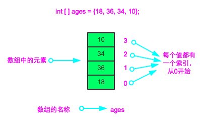

# 数组
[[TOC]]
## 定义
所谓数组，是有序的元素序列。
若将有限个类型相同的变量的集合命名，那么这个名称为数组名。
组成数组的各个变量称为数组的分量，也称为数组的元素，有时也称为下标变量。
用于区分数组的各个元素的数字编号称为下标。
数组是在程序设计中，为了处理方便，把具有相同类型的若干元素按无序的形式组织起来的一种形式。这些无序排列的同类数据元素的集合称为数组。数组是用于储存多个相同类型数据的集合。-- 来自百度百科
简单来说，数组就是相同数据类型的元素按一定顺序排列的集合。可以把它看成一个大的盒子，里面按顺序存放了多个数据类型相同的数据。


数组中的元素都可以通过下标来访问，**下标从 0 开始，到数组长度 -1 结束**。例如，可以通过 `ages[0]` 获取数组中的第一个元素 18 ，`ages[3]` 就可以取到第四个元素 10。
## 声明并初始化
**注意**：

使用数组前要声明数组。

语法：

```java
数据类型[ ] 数组名;   //或者: 数据类型 数组名[ ];  

```

数组名为任意合法的变量名，如：

```java
int ages[];      //存放年龄的数组，类型为整型  
char symbol[];   //存放符号的数组，类型为字符型  
String [] name;  //存放名称的数组，类型为字符串型  

```

声明数组后，需要为数组分配空间，也就是定义多大的数组。

语法：

```java
数组名 = new  数据类型 [ 数组长度 ];  

```

数组长度就是数组最多可存放元素的个数。可以在数组声明的时候初始化数组，或者在声明时就为它分配好空间，这样就不用再为数组分配空间。

语法：

```java
int [] ages = {12,18,9,33,45,60}; //声明并初始化了一个整型数组，它有6个元素  
char [] symbol = new char[10] //声明并分配了一个长度为10的char型数组  
//整型数组默认值为0,浮点型数组默认值为0.0,布尔型数组默认值为f
int][] arr = new int[]{2,5,8} //方括号中不允许有数组长度

int[] arr;
arr = {2,5,8};//编译错误,此方式只能声明同时初始化
int[] arr;
arr = new int[]{2,5,8};//正确


//四种声明并初始化的方法
int[] arr1 = new int[5];//1.
int [] arr2 = {2,6,8};//2.
int [] arr3 = new int[]{6,8,9,10,22};//3.

int [] arr4;
arr4 = new int[]{3,6,7,8,89};//4.
```

## 数组访问


分配空间后就可以向数组中放数据了，数组中元素都是通过下标/索引来访问的。  
如：

```java
int[] ages = new int[3];//从0开始,到数组长度-1
ages[0]=12;  
//通过(数组名.length)可以获取数组的长度(元素个数)
```

Java 中可以将一个数组赋值给另一个数组，如：

```java
int [] a1 = {1,2,3};  
int [] a2;  
a2 = a1;  

```

这里只是复制了一个引用，即 a2 和 a1 是相同数组的不同名称。

例子:
```java
import java.util.Scanner;  

public class InputTest {  
    public static void main(String[] args) {  
        String[] data = new String[100];  
        Scanner in = new Scanner(System.in);  
        for (int i = 0; i < 100; i++) {  
            if ((data[i] = in.nextLine()).equals("end")) {  
                break;  
            }  
        }  
        for (String a : data) {  
            if (a.equals("end")) {  
                break;  
            }  
            System.out.println(a);  
        }  
    }  
}  
```


## 数组遍历

数组遍历：

```java
int [] ages = {12, 18, 9, 33, 45, 60};  
for(int i = 0; i < ages.length; i++){ //ages.length是获取数组的长度  
    System.out.println("数组中第"+(i+1)+"个元素是 "+ages[i]); //数组下标是从零开始，一定要注意  
    //注意数组越界异常,ArrayIndexOutOfBoundsException
}  

```

**注意**：

1.  数组下标从 0 开始。所以数组的下标范围是 0 至 数组长度 -1。
2.  数组不能越界访问，否则会报错。

for 语句在数组内可以使用特殊简化版本，在遍历数组、集合时，`foreach` 更简单便捷。从英文字面意思理解 `foreach `也就是“ for 每一个”的意思。

语法：

```java
for(元素类型 元素变量:遍历对象){  
    执行的代码  
}  
```

```java
public class JudgePrime {  
    public static void main(String[] args){  
        int [] ages = {12, 18, 9, 33, 45, 60};  
        int i = 1;  
        for(int age:ages){  
            System.out.println("数组中第"+i+"个元素是"+age);  
            i++;  
        }  
    }  
}  
```

## 数组的复制

1. `System.arraycopy(a,1,b,0,4);`

```java
//7)数组的复制:
int[] a = {10,20,30,40,50};
int[] b = new int[6]; //0,0,0,0,0,0
//a:源数组
//1:源数组的起始下标
//b:目标数组
//0:目标数组的起始下标
//4:要复制的元素个数
System.arraycopy(a,1,b,0,4); //灵活性好
for(int i=0;i<b.length;i++){
    System.out.println(b[i]);
}
```

2. `int[] b = Arrays.copyOf(a,6);`

   `a = Arrays.copyOf(a,a.length+1); `//数组的扩容

   ```java
   //常规复制
   int[] a = {10,20,30,40,50};
   //a:源数组
   //b:目标数组
   //6:目标数组的长度(元素个数)
   //---若目标数组长度>源数组长度，则末尾补默认值
   //---若目标数组长度<源数组长度，则将末尾的截掉
   int[] b = Arrays.copyOf(a,6); //灵活性差
   for(int i=0;i<b.length;i++){
       System.out.println(b[i]);
   }
   
   //数组的扩容
   int[] a = {10,20,30,40,50};
   //数组扩容(创建了一个更大的新的数组，并将源数组数据复制进去了)
   a = Arrays.copyOf(a,a.length+1);
   for(int i=0;i<a.length;i++){
       System.out.println(a[i]);
   }
   ```


## 数组排序

排序：Arrays.sort(arr);  //升序排列(从小到大)

```java
package day07;
import java.util.Arrays;
//数组的演示
public class ArrayDemo {
    public static void main(String[] args) {
        //6)数组的排序:
        int[] arr = new int[10];
        for(int i=0;i<arr.length;i++){
            arr[i] = (int)(Math.random()*100);
            System.out.println(arr[i]);
        }

        Arrays.sort(arr); //对arr进行升序排序

        System.out.println("排序后数组中真实的数据:");
        for(int i=0;i<arr.length;i++){
            System.out.println(arr[i]);
        }
        System.out.println("倒序输出:");
        for(int i=arr.length-1;i>=0;i--){
            System.out.println(arr[i]);
        }

    }
}
```


## 二维数组

二维数组可以看成是一间有座位的教室，座位一般用第几排的第几个进行定位，每一个座位都有一个行和一个列的属性，一排的座位相当于一个一维数组，所以可以将二维数组简单的理解为是一种“特殊”的一维数组，它的每个数组空间中保存的是一个一维数组。

二维数组也需要声明和分配空间。

语法：

```java
数据类型 [][] 数组名 = new 数据类型[行的个数][列的个数];  

//或者  
数据类型 [][] 数组名;  
数组名 = new 数据类型[行的个数][列的个数];  

//也可以  
数据类型 [][] 数组名 = {  
{第一行值1,第一行值2,...}  
{第二行值1,第二行值2,...}  
...  
}  

//二维数组的赋值和访问，跟一维数组类似，可以通过下标来逐个赋值和访问，注意索引从 0 开始  
数组名[行的索引][列的索引] = 值;  
```

## 引用类型数组

```java
//Student.java
public class Student {
    String  name;
    int age;
    String address;
    Student(String name,int age, String address){
        this.name = name;
        this.age = age;
        this.address = address;

    }
    void study(){
        System.out.println(name + "在学习....");
    }

    void sayHi(){
        System.out.println("大家好,我叫" + name + ",今年" + age + "岁了,家住" + address);
    }
    
}
    
    
//RefArrayDemo.java
public class RefArrayDemo {
    public static void main(String[] args) {
        Student[] stus = new Student[3]; //创建Student数组对象,声明Student型数组stus,包含三个元素,每个元素都是Student型,默认值为null.
        stus[0] = new Student("zhangsan",25,"LF"); //创建Student对象,必须new,调用构造方法
        stus[1] = new Student("lisi",26,"JMS");
        stus[2] = new Student("wangwu",24,"SD");

        System.out.println(stus[0].name); //输出第1个学生的名字
        stus[1].age = 28; //给第2个学生的年龄赋值为28
        stus[2].sayHi(); //第3个学生跟大家问好
        for(int i=0;i<stus.length;i++){ //遍历所有学生
            System.out.println(stus[i].name);   //输出每个学生的名字,访问数据需要通过数组元素打点
            stus[i].sayHi(); //每个学生跟大家问好
        }

    }
}

/*
Student[] stus = new Student[]{      //---------了解即可
    new Student("zhangsan",25,"LF"),
    new Student("lisi",26,"JMS"),
    new Student("wangwu",24,"SD")
};
*/
```

## main中的String 数组

main方法上的参数String[] args的作用是:

在命令行上使用java命令指定当前类时,可以传递参数进来,此时会被main上的String[] args接收.

例如:

```bash
java ReflectDemo7 arg1 arg2 arg3
```

main方法执行后，args数组就有三个元素，对应的就是"arg1","arg2","arg3"
