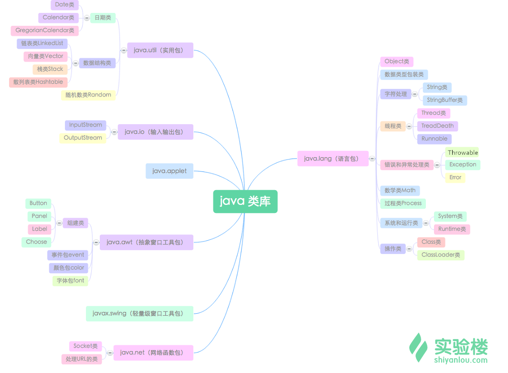
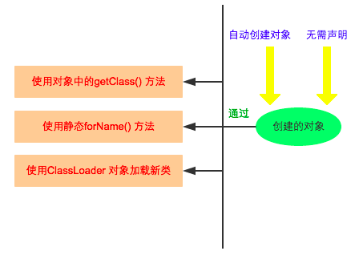
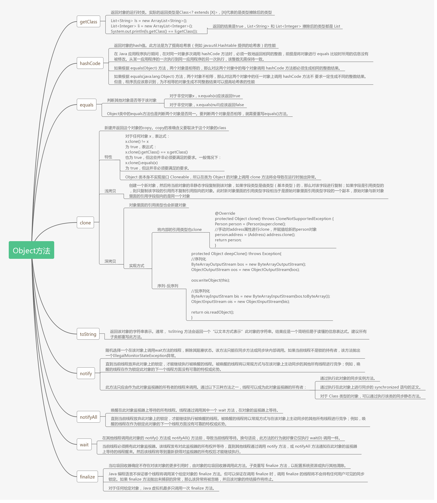
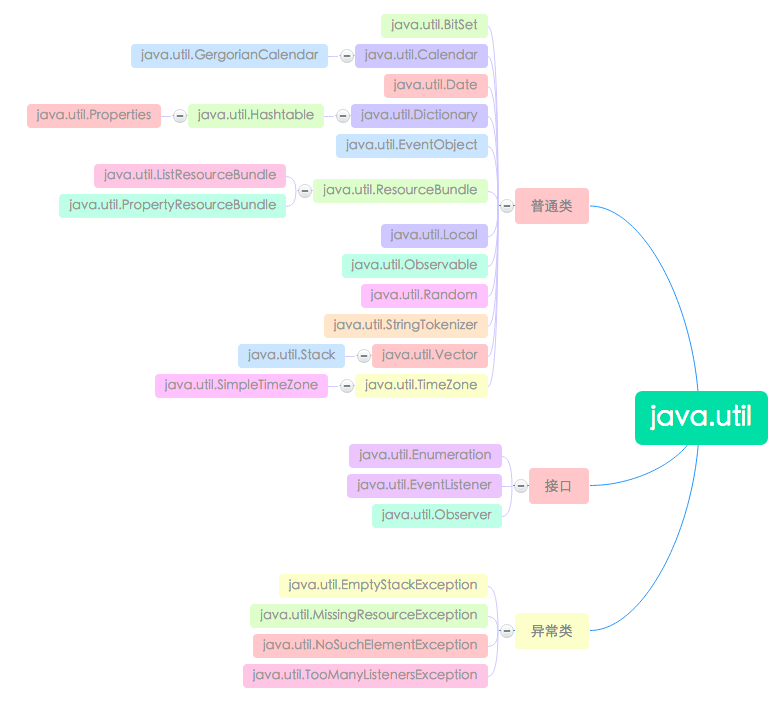

# API基础
[[TOC]]

Java 的核心 API 是非常庞大的，这给开发者来说带来了很大的方便。所谓的 API 就是一些已经写好、可直接调用的类库。Java 里有非常庞大的 API，其中有一些类库是我们必须得掌握的，只有熟练掌握了 Java 一些核心的 API，我们才能更好的使用 Java。



在程序中，java.lang 包并不需要像其他包一样需要 `import` 关键字进行引入。系统会自动加载，所以我们可以直接取用其中的所有类。下面我们就来详细地学习一下 java.lang 包吧。

## java.lang语言包

### 包装类

java定义了8个包装类,目的是为了解决基本类型不能直接参与面向对象开发的问题,使得基本类型可以通过包装类的实例以对象的形式存在.

* 其中数字类型的包装类都继承自java.lang.Number,而char和boolean的包装类直接继承自Object
* Number是一个抽象类,定义了一些方法,目的是让包装类可以将其表示的基本类型转换为其他数字类型.

其实 java 为每个基本类型都提供了包装类：

| 原始数据类型      | 包装类    |
| ----------------- | --------- |
| byte（字节）      | Byte      |
| char（字符）      | Character |
| int（整型）       | Integer   |
| long （长整型）   | Long      |
| float（浮点型）   | Float     |
| double （双精度） | Double    |
| boolean （布尔）  | Boolean   |
| short（短整型）   | Short     |

在这八个类名中，除了 Integer 和 Character 类以后，其它六个类的类名和基本数据类型一致，只是类名的第一个字母大写。

#### Integer 类

java.lang 包中的 Integer 类、Long 类和 Short 类都是 Number 的子类，他们的区别在于不同子类里面封装着不同的数据类型，比如 Integer 类包装了一个基本类型 int。其包含的方法基本相同。

我们以 Integer 类为例。 Integer 构造方法有两种：

1. Integer(int value)，以 int 型变量作为参数创建 Integer 对象。例如`Integer a = new Integer(10);`。
2. Integer(String s)，以 String 型变量作为参数创建 Integer 对象，例如`Integer a = new Integer("10")`。

下面列举一下 Integer 的常用方法：

| 方法                              | 返回值  | 功能描述                                                     |
| --------------------------------- | ------- | ------------------------------------------------------------ |
| byteValue()                       | byte    | 以 byte 类型返回该 Integer 的值                              |
| compareTo(Integer anotherInteger) | int     | 在数字上比较 Integer 对象。如果这两个值相等，则返回 0；如果调用对象的数值小于 anotherInteger 的数值，则返回负值；如果调用对象的数值大于 anotherInteger 的数值，则返回正值 |
| equals(Object IntegerObj)         | boolean | 比较此对象与指定对象是否相等                                 |
| intValue()                        | int     | 以 int 型返回此 Integer 对象                                 |
| shortValue()                      | short   | 以 short 型返回此 Integer 对象                               |
| longValue()                       | long    | 以 long 型返回此 Integer 对象                                |
| floatValue()                      | float   | 以 float 型返回此 Integer 对象                               |
| doubleValue()                     | double  | 以 double 型返回此 Integer 对象                              |
| toString()                        | String  | 返回一个表示该 Integer 值的 String 对象                      |
| valueOf(String str)               | Integer | 返回保存指定的 String 值的 Integer 对象                      |
| parseInt(String str)              | int     | **将字符串参数作为有符号的十进制整数进行解析**               |

```java
public class IntegerTest {
    public static void main(String[] args){
        //初始化一个 Integer 类实例
        Integer a = new Integer("10");
        //初始化一个 Integer 类实例
        Integer b = new Integer(11);
        //判断两个数的大小
        System.out.println(a.compareTo(b));
        // 判断两个实例是否相等
        System.out.println(a.equals(b));
        //将 a 转换成 float 型数
        float c = a.floatValue();
        System.out.println(c);

        String d = "10101110";
        //将字符串转换为数值
        //parseInt(String str) 和 parseInt(String str,int radix) 都是类方法，由类来调用。后一个方法则实现将字符串按照参数 radix 指定的进制转换为 int
        int e = Integer.parseInt(d, 2);
        System.out.println(e);
    }
}
```

#### Character 类

Character 类在对象中包装一个基本类型 char 的值。Character 类型的对象包含类型为 char 的单个字段。

Character 包装类的常用方法：

| 方法                              | 返回值  | 说明                                                |
| --------------------------------- | ------- | --------------------------------------------------- |
| isDigit(char ch)                  | boolean | 确定字符是否为数字                                  |
| isLetter(char ch)                 | boolean | 确定字符是否为字母                                  |
| isLowerCase(char ch)              | boolean | 确定字符是否为小写字母                              |
| isUpperCase(char ch)              | boolean | 确定字符是否为大写字母                              |
| isWhitespace(char ch)             | boolean | 确定字符是否为空白字符                              |
| isUnicodeIdentifierStart(char ch) | boolean | 确定是否允许将指定字符作为 Unicode 标识符中的首字符 |

```java
public class CharacterTest {
    public static void main(String[] args){
        int count;
        //定义了一个字符数组
        char[] values = {'*', '_', '%', '8', 'L', 'l'};
        //遍历字符数组
        for (count = 0; count < values.length; count++){
            if(Character.isDigit(values[count])){
                System.out.println(values[count]+"是一个数字");
            }
            if(Character.isLetter(values[count])){
                System.out.println(values[count]+ "是一个字母");
            }
            if(Character.isUpperCase(values[count])){
                System.out.println(values[count]+"是大写形式");
            }
            if(Character.isLowerCase(values[count])){
                System.out.println(values[count]+"是小写形式");
            }
            if(Character.isUnicodeIdentifierStart(values[count])){
                System.out.println(values[count]+"是 Unicode 标志符的第一个有效字符");
            }
        }
        //判断字符 c 是否是空白字符
        char c = ' ';
        System.out.println("字符 c 是空白字符吗？"+Character.isWhitespace(c));
    }
}
```

#### Boolean 类

Boolean 类将基本类型为 boolean 的值包装在一个对象中。一个 Boolean 类型的对象只包含一个类型为 boolean 的字段。

Boolean 类的构造方法也有两个：

1. Boolean(boolean value)，创建一个表示 value 参数的 Boolean 对象，如 `Boolean b = new Boolean(true)`。
2. Boolean(String s)，如果 String 参数不为 null 且在忽略大小写时等于 "true", 创建一个表示 true 值的 Boolean 对象，如 `Boolean b = new Boolean("ok")`，为 false。

Boolean 包装类的常用方法：

| 方法                   | 返回值  | 说明                                                         |
| ---------------------- | ------- | ------------------------------------------------------------ |
| booleanValue()         | boolean | 将 Boolean 对象的值以对应的 boolean 值返回                   |
| equals(Object obj)     | boolean | 判断调用该方法的对象与 obj 是否相等。当且仅当参数不是 null，而且与调用该方法的对象一样都表示同一个 boolean 值的 Boolean 对象时，才返回 true |
| parseBoolean(String s) | boolean | 将字符串参数解析为 boolean 值                                |
| toString()             | String  | 返回表示该 boolean 值的 String 对象                          |
| valueOf(String s)      | Boolean | 返回一个用指定得字符串表示值的 boolean 值                    |

```java
public class BooleanTest {
    public static void main(String[] args) {
        // Boolean(boolean value) 构造方法
        Boolean a = new Boolean(true);
        System.out.println("a 为"+a);
        // Boolean(String s) 构造方法
        Boolean b = new Boolean("true");
        Boolean c = new Boolean("OK");
        System.out.println("b 为"+b);
        System.out.println("c 为"+c);
        System.out.println("a 的 booleanValue() 为"+a.booleanValue());
        System.out.println("a 和 b 相等吗？"+a.equals(b));
    }
}
```

#### 包装类与基本类型的相互转换

```java
package integer;

public class IntegerDemo1 {
    public static void main(String[] args) {
        //基本类型转换为包装类
        //Integer是int的包装类,Character是char的包装类
        int i = 123;
        //java推荐我们使用包装类的静态方法valueOf将基本类型转换为包装类,而不是直接new
        Integer i1 = Integer.valueOf(i);//Integer会重用-128-127之间的整数对象
        Integer i2 = Integer.valueOf(i);
        System.out.println(i1==i2);//true
        System.out.println(i1.equals(i2));//true

        double dou = 123.123;
        Double dou1 = Double.valueOf(dou);//Double则是直接new
        Double dou2 = Double.valueOf(dou);
        System.out.println(dou1==dou2);//false
        System.out.println(dou1.equals(dou2));//true

        //包装类转换为基本类型
        int in = i1.intValue();//获取包装类对象中表示的基本类型值
        double doub = i1.doubleValue();
        System.out.println(in);//123
        System.out.println(doub);//123.0

        in = dou1.intValue();//大类型转小类型可能存在丢精度!
        doub = dou1.doubleValue();
        System.out.println(in);//123
        System.out.println(doub);//123.123
    }
}
```

#### 包装类常用功能

```java
package integer;

public class IntegerDemo2 {
    public static void main(String[] args) {
        //1可以通过包装类获取其表示的基本类型的取值范围
        //获取int的最大值和最小值?
        int imax = Integer.MAX_VALUE;
        System.out.println(imax);
        int imin = Integer.MIN_VALUE;
        System.out.println(imin);

        long lmax = Long.MAX_VALUE;
        System.out.println(lmax);
        long lmin = Long.MIN_VALUE;
        System.out.println(lmin);

        /*
            2字符串转换为基本类型的前提是该字符串正确描述了基本类型可以保存的值,否则
            会抛出异常:NumberFormatException
         */
        String str = "123";
//        String str = "123.123";//这个字符串不能解析为int值!
        int d = Integer.parseInt(str);
        System.out.println(d);//123
        double dou = Double.parseDouble(str);
        System.out.println(dou);//123.123
    }
}
```

#### 自动拆装箱特性

JDK1.5之后推出了一个新的特性:自动拆装箱

该特性是编译器认可的.当编译器编译源代码时发现有基本类型和引用类型相互赋值使用时会自动补充代码来完成他们的转换工作,这个过程称为自动拆装箱.

```java
package integer;

public class IntegerDemo3 {
    public static void main(String[] args) {
        /*
            触发自动拆箱特性,编译器会补充代码将包装类转换为基本类型,下面的代码会变为:
            int i = new Integer(123).intValue();
         */
        int i = new Integer(123);
        /*
            触发编译器自动装箱特性,代码会被编译器改为:
            Integer in = Integer.valueOf(123);
         */
        Integer in = 123;
    }
}

```

#### 

### class类

Class 类的实例表示正在运行的 Java 应用程序中的类或接口。在 Java 中，每个 Class 都有一个相应的 Class 对象，即每一个类，在生成的 `.class` 文件中，就会产生一个 Class 对象，用于表示这个类的类型信息。我们获取 Class 实例有三种方法：

1. 利用对象调用 `getClass()` 方法获取该对象的 Class 实例
2. 使用 Class 类的静态方法 `forName(String className)`，用类的名字获取一个 Class 实例
3. 运用`.class`的方式来获取 Class 实例，对于基本数据类型的封装类，还可以采用`.TYPE`来获取相对应的基本数据类型的 Class 实例



### Object类

Object 类是所有类的父类，所有对象（包括数组）都实现这个类的方法。所以在默认的情况下，我们定义的类扩展自 Object 类，那我们当然可以调用和重写 Object 类里的所有方法了。

我们看一下 Object 类里都定义了哪些方法。

| 方法                               | 返回值  | 功能描述                                                     |
| ---------------------------------- | ------- | ------------------------------------------------------------ |
| equals(Object obj)                 | boolean | **将当前对象实例与给定的对象进行比较，检查它们是否相等**     |
| finalize() throws Throwable        | void    | 当垃圾回收器确定不存在对象的更多引用时，由对象的垃圾回收器调用此方法。通常被子类重写 |
| getClass()                         | Class   | 返回当前对象的 Class 对象                                    |
| toString()                         | String  | **返回此对象的字符串表示**                                   |
| wait() throws InterruptedException | void    | 在其他线程调用此对象的 notify() 方法或 notifyAll() 方法前，使当前线程进入等待状态 |



Object是所有类的顶级超类,其中有两个经常被子类重写的方法:

toString()与equals().

```java
package object;

/**
 * Object是所有类的顶级超类.里面有几个经常被子类重写的方法,其中包括toString和equals
 */
public class Demo {
    public static void main(String[] args) {
        Point p = new Point(1,2);
        /*
            Object已经实现了toString方法.直接继承下来时返回的字符串内容为当前对象的地址信息.格式为:类名@地址,没有参考意义,所以常常重写toString()返回具体数据.
            toString方法实际开发中很少直接写代码去调用它,都是在不经意间被自动执行的.
            例如在使用System.out.println输出时.与字符串连接操作时.
         */
        //System.out.println(Object obj)输出给定对象toString返回的字符串到控制台
        System.out.println(p);

        //字符串连接操作时,会将非String类型的对象调用toString转换为字符串后拼接.
        String line = "这是一个Point:" + p;
        System.out.println(line);

        Point p2 = new Point(1,2);
        System.out.println("p2:"+p2);
        /*
            对于引用类型而言,变量保存的值是对象的地址.
            ==比较是比较两个变量的值是否相等,因此对于引用类型而言就是比较地址是否相等,那么意思就是比较是否为同一个对象.

            equals是Object定义的另一个方法,意图是比较两个对象的内容是否相同.但是如果子类不重写这个方法,则没有实际意义,因为Object实现时内部仍然是用==比较的!
            Java的类都重写equals()了-----------像String,StringBuilder都重写equal()来比较内容了,我们自己定义的类必须自己重写equals().
            派生类重写equal()的基本规则:
            1)两个对象必须是同一个类型,若类型不同则返回false
            2)若参数对象为null,则返回false
            3)原则上两个对象要比较对象的属性是否是相同的
         */
        System.out.println(p == p2);//false
        System.out.println(p.equals(p2));//true
    }
}
```

#### 常用方法

```java
boolean equals(Object obj) 
          指示其他某个对象是否与此对象“相等”。 
protected  void finalize() 
          当垃圾回收器确定不存在对该对象的更多引用时，由对象的垃圾回收器调用此方法。 
 int hashCode() 
          返回该对象的哈希码值。 
 String toString() 
          返回该对象的字符串表示。
```

#### toString()

默认返回 类名@地址 的格式，来展示对象的地址值，如：a00000.Student@a0834e7。
如果想看属性值我们可以重写这个方法，重写后返回的就是把属性值拼接成一个字符串。
如：Student [name=苏大强, age=20, id=10001]

```java
package cn.tedu.object;
//测试Object用法
public class Test1_Object {
	public static void main(String[] args) {
		//创建对象测试
		Person p = new Person("熊大",20,10,"森林");
		System.out.println(p);//要是不重写toString()就是使用的Object提供的默认方式只能打印对象在内存的地址
		System.out.println(p);//由于重写了toString()所以打印的是属性的值
	}
}
//定义类，提供属性
class  Person{
	//构造：source-generate constrctor using fileds
	public Person() {}
	public Person(String name, int age, double salary, String addr) {
		this.name = name;
		this.age = age;
		this.salary = salary;
		this.addr = addr;
	}
	//属性
	private String name;
	private int age;
	private double salary;
	private String addr;
	//set() get()
	public String getName() {
		return name;
	}
	public void setName(String name) {
		this.name = name;
	}
	public int getAge() {
		return age;
	}
	public void setAge(int age) {
		this.age = age;
	}
	public double getSalary() {
		return salary;
	}
	public void setSalary(double salary) {
		this.salary = salary;
	}
	public String getAddr() {
		return addr;
	}
	public void setAddr(String addr) {
		this.addr = addr;
	}
	
	//toString()：source - generate toString()-ok
	@Override//重写的是Object提供的toString()是为了查看属性值
	public String toString() {
		return "Person [name=" + name + ", age=" + age + ", salary=" + salary + ", addr=" + addr + "]";
	}
	
}
```

#### equals(Object obj)

当前对象和参数对象比较大小，默认是比较内存地址，如果要比较对象的属性，可以重写该方法。

```java
package javase.base;

import javase.base.extend.Tiger;

public class TestArea {
	public static void main(String[] args) {
		//基础类型是按值比较
		int i1 = 10;
		int i2 = 10;
		int i3 = 12;
		System.out.println(i1==i2);//true
		System.out.println(i1==i3); //false
		
		//对象为引用类型，引用类型按内存地址比较
		Tiger t1 = new Tiger();
		Tiger t2 = new Tiger();
		Tiger t3 = t1;
		
		System.out.println(t1);
		System.out.println(t2);
		System.out.println(t3);
		
		System.out.println(t1.equals(t2));//false
		System.out.println(t1 == t2);//false

		System.out.println(t1.equals(t3));//true
		System.out.println(t1 == t3);//true
	}
}
```

#### hashCode()

返回该对象的哈希码值。

```java
package cn.tedu.object;
//测试equals()  ==
public class Test2_Object2 {
	public static void main(String[] args) {
		//1，==比较八大基本类型时：判断的是值
		int a = 1;
		int b = 1;
		System.out.println(a==b);//true
		
		
		//2，==比较对象时，比较的是对象的地址值
		Integer x = 5;
		Integer y = 10;
		Integer z = x;//把x的地址赋值给了z
		
		System.out.println(x==y);//false
		System.out.println(x==z);//true
		
		//3，equals()用来比较对象存着的值
		System.out.println(x.equals(z));//true
		
		//4，测试hashCode()哈希值
		System.out.println(x.hashCode());//5
		System.out.println(y.hashCode());//10
		System.out.println(z.hashCode());//5
		
	}
}
```

### Math

`Math` 类在 `java.lang` 包中，包含用于执行基本数学运算的方法，如初等指数、对数、平方根和三角函数。

常见方法：

| 方法                      | 返回值                                         | 功能描述                                                     |
| ------------------------- | ---------------------------------------------- | ------------------------------------------------------------ |
| `sin(double numvalue)`    | double                                         | 计算角 numvalue 的正弦值                                     |
| `cos(double numvalue)`    | double                                         | 计算角 numvalue 的余弦值                                     |
| `acos(double numvalue)`   | double                                         | 计算 numvalue 的反余弦                                       |
| `asin(double numvalue)`   | double                                         | 计算 numvalue 的反正弦                                       |
| `atan(double numvalue)`   | double                                         | 计算 numvalue 的反正切                                       |
| `pow(double a, double b)` | double                                         | 计算 a 的 b 次方                                             |
| `sqrt(double numvalue)`   | double                                         | 计算给定值的正平方根                                         |
| `abs(int numvalue)`       | int                                            | 计算 int 类型值 numvalue 的绝对值，也接收 long、float 和 double 类型的参数 |
| `ceil(double numvalue)`   | double                                         | 返回大于等于 numvalue 的最小整数值                           |
| `floor(double numvalue)`  | double                                         | 返回小于等于 numvalue 的最大整数值                           |
| `max(int a, int b)`       | int                                            | 返回 int 型 a 和 b 中的较大值，也接收 long、float 和 double 类型的参数 |
| `min(int a, int b)`       | int                                            | 返回 a 和 b 中的较小值，也可接受 long、float 和 double 类型的参数 |
| `rint(double numvalue)`   | double                                         | 返回最接近 numvalue 的整数值                                 |
| `round(T arg)`            | arg 为 double 时返回 long，为 float 时返回 int | 返回最接近 arg 的整数值                                      |
| `random()`                | double                                         | 返回带正号的 double 值，该值大于等于 0.0 且小于 1.0          |

```java
public class MathDemo {
    public static void main(String[] args) {
        System.out.println(Math.abs(-12.7));
        System.out.println(Math.ceil(12.7));
        System.out.println(Math.rint(12.4));
        System.out.println(Math.random());
        System.out.println("sin30 = " + Math.sin(Math.PI / 6));
        // 计算30°的正弦值，参数是用弧度表示的角，即π的六分之一
        System.out.println("cos30 = " + Math.cos(Math.PI / 6));
        // 计算30°的余弦值，这些计算三角函数的方法，其参数和返回值的类型都为double
        System.out.println("tan30 = " + Math.tan(Math.PI / 6));
        // 计算30°的正切值
    }
}
```

#### 生成彩票号码

我们来做个更好玩的项目——彩票生成器。目前市面上彩票的种类很多，我们就以大乐透为例吧。大乐透的规则是：从 1-35 中随机选取 5 个不重复的数字，从 1-12 中随机选取 2 个不重复的数字，这些数字组成了一个七位数。如果你买的号码与摇出来的号码相同，那么你一夜之间可能就不会当程序员了。

因为彩票号码是随机生成的，所以这个项目中我们也会带大家认识随机数的使用方法。首先请在先创建一个 `Lottery` 类。

对于该项目所需要用到的 API，你需要引入下面一些包：

```java
import java.util.ArrayList;
import java.util.Collections;
import java.util.List;
import java.util.Random;
```

由于彩票号码的前半段和后半段的规则和个数略有不同，所以我们分别创建生成它们的方法。

首先来创建生成前段号码的方法 `getHeadNumber()`，该方法需要从 1 到 36 中随机选取一个数作为号码（即摇号的过程）。对于个位数，为了显示上更整齐，所以我们在其十位再放一个“0”。再者，为了结果更加易读，我们还需要调用 `Collections.sort()` 方法对结果进行排序。

代码片段如下：

```java
public List<String> getHeadNumber() {
        List<String> list = new ArrayList<String>();
        // 创建彩票的前半段号码集合
        String lotteryNumber = "";
        for (int i = 1; i < 36; i++) {
            // 这个循环是为了初始化彩票的前半段号码集合

            if (i < 10) {
                list.add("0" + i + "  ");
                // 在集合中添加 0~9 的号码，因为是个位数，为了显示上更加人性化，所以需要在十位的地方添加“0”
            } else {
                list.add("" + i + "  ");
                // 向集合添加大于 9 的号码，即添加双位数
            }
        }

        int roundIndex = 0;
        // 创建并初始化随机数

        List<String> lotteryList = new ArrayList<String>();
        // 保存前段号码的 List 集合

        for (int j = 0; j < 5; j++) {
            int amount = list.size(); // 获取前半段号码的个数
            Random r = new Random(); // 创建并实例化 Random 的对象
            roundIndex = r.nextInt(amount); // 获取一个 0 到 amount-1 的随机数
            lotteryNumber = list.get(roundIndex); // 获取彩票数字，即摇号的号码
            lotteryList.add(lotteryNumber); // 将彩票号码添加 lotteryList 中
            list.remove(roundIndex); // 移除刚刚产生的号码
        }
        Collections.sort(lotteryList);
        // 对前半段号码进行排序，排序的目的是为了让结果更具可读性
        return lotteryList;
        //返回前半段号码
    }
```

此处用到了 `Random()` 方法，在创建一个 Random 对象`r`后，你可以调用该对象的 `nextInt()` 方法得到一个随机数。`r.nextInt(amount);`中的 amount 是随机数的上限，产生的随机数为 0 到 100（不含 100）的整数。 你可以 [了解更多 Random 的用法](http://www.cnblogs.com/ningvsban/p/3590722.html)。

和前半段号码类似，我们接着来写生成后半段号码的方法 `getRearNum()`，代码片段如下：

```java
public List<String> getRearNumber() {
        List<String> list = new ArrayList<String>();
        // 创建后半段号码集合，也就是最后两个球的数字

        String lotteryNumber = "";
        for (int i = 1; i < 13; i++) {
            // 初始化后半段号码集合

            if (i < 10) {
                list.add("0" + i + "  ");
                // 添加 0~9 的号码，原理同前半段
            } else {
                list.add("" + i + "  ");
                // 添加大于 9 的号码
            }
        }
        int roundIndex = 0;
        //创建并初始化随机数

        List<String> lotteryList = new ArrayList<String>();
        // 保存后半段号码的 List 集合

        for (int j = 0; j < 2; j++) {
            int amount = list.size(); // 获取后半段号码的个数
            Random r = new Random(); // 创建并实例化 Random 的对象
            roundIndex = r.nextInt(amount); // 获取一个 0 到 amount-1 的随机数
            lotteryNumber = list.get(roundIndex); // 摇号
            lotteryList.add(lotteryNumber); // 将彩票号码添加 lotteryList 中
            list.remove(roundIndex); // 移除刚刚产生的号码
        }

        Collections.sort(lotteryList);
        // 对后半段号码进行排序
        return lotteryList;
    }
```

现在，根据规则我们已经能够产生对应的数字了。再接再厉，我们再做一个生成最终结果的方法，把这两个号段组装成整体的号码，并且按照用户的要求产生多少组号码，在控制台输出它们。

下面给出了这个方法的代码片段：

```java
public void generateLottery(String groupNum) {

        int groupNumber = 0;
        //为了避免不必要的错误，一般在创建变量时都要为其赋初始值

        groupNumber = Integer.parseInt(groupNum);
        StringBuilder sbuiler = new StringBuilder();
        // 创建字符串生成器对象，使用字符串生成器能够较为方便地在字符串中追加内容

        for (int i = 0; i < groupNumber; i++) {
            List<String> startList = getHeadNumber();
            // 获得彩票前半段号码的集合

            List<String> endList = getRearNumber();
            // 获得彩票后半段号码的集合

            for (int m = 0; m < startList.size(); m++) {
                sbuiler.append(startList.get(m));
                // append() 即为追加方法，用于添加彩票的前半段号码到字符串生成器中
            }
            sbuiler.append("    ");
            for (int n = 0; n < endList.size(); n++) {
                sbuiler.append(endList.get(n));
                // 添加彩票的后半段号码到字符串生成器中
            }
            sbuiler.append("\n");
        }

        System.out.println(sbuiler.toString());
        //将每组生成好的彩票号码即时输出
    }
```

为了验证我们的实现无误，在同一个目录中创建一个名为 `LotteryTest` 的测试类，编写其 `main()` 方法。在其中创建一个彩票对象并调用其产生号码的方法。

`LotteryTest.java` 中的内容为：

```java
import java.util.Scanner;

public class LotteryTest {

    public static void main(String[] args) {

        Lottery l = new Lottery();
        Scanner scan = new Scanner(System.in);// 创建扫描器
        System.out.println("Please input the number of lottery group(s) that you want to generate : ");
        // 获得用户输入的需要生成的中奖号码个数

        String groupNum = scan.nextLine();
        l.generateLottery(groupNum);

    }

}
```

检查一下代码，编译并运行

```bash
javac Lottery.java LotteryTest.java                             java LotteryTest
```

### System

System 类提供了以下功能：

- 标准输入，标准输出和错误输出流；
- 访问外部定义的属性和环境变量；
- 加载文件和库的方法；
- 以及用于快速复制数组的实用方法。

System 不可以被实例化，只可以使用其静态方法。

```java
//从指定的源数组中复制一个数组，从源数组指定的位置开始，到目标数组指定的位置
public static void arraycopy(Object src,int srcPos, Object dest,int desPos,int length)
//返回以毫秒为单位的当前时间(从1970年到现在的毫秒数)
public static long currentTimeMillis()
//终止当前正在运行的Java虚拟机，status为 0时退出
public static void exit(int status)
//  运行垃圾收集器
public static void gc()
// 取得当前系统的全部属性
public static Properties getProperties()
//获取指定键的系统属性
public static String  getProperty(String key)
```

#### 使用方法

```java
import java.util.Arrays;

public class SystemDemo {
    public static void main(String[] args) {
        int[] a = {7, 8, 9, 10, 11};
        int[] b = {1, 2, 3, 4, 5, 6};
        //从数组a的第二个元素开始，复制到b数组的第三个位置 复制的元素长度为3
        System.arraycopy(a, 1, b, 2, 3);
        //输出结果
        System.out.println(Arrays.toString(b));
        System.out.println("当前时间：" + System.currentTimeMillis());
        System.out.println("java版本信息：" + System.getProperty("java.version"));
        //运行垃圾收集器
        System.gc();
        //退出
        System.exit(0);
    }
}
```


### 参考链接

- [在线文档-jdk-zh](http://tool.oschina.net/apidocs/apidoc?api=jdk-zh)
- [JAVA 的包装类](http://blog.csdn.net/hjf19790118/article/details/7081925)
- [JAVA 的 String 类](http://www.cnblogs.com/springcsc/archive/2009/12/03/1616326.html)
- [类型信息之 Class 对象](http://blog.csdn.net/u010858605/article/details/53454830)
- [Java 6 API 中文版文档](http://doc.canglaoshi.org/jdk6-docs/index.html) 

## java.util 和 java.time 包介绍

java.util 包提供了一些实用的方法和数据结构。比如日期类 Date，日历类 Calendar 以及随机数类 Random，同时包里还提供了 collection 框架，像堆栈 Stack、向量 Vector、位集合 Bitset 以及哈希表 Hashtable 等表示数据结构的类。而 java.time 包是 java8 新提供的包，里面对时间和日期提供了新的 api，弥补了 java.util 包对日期和时间操作的不足。



### Arrays

包含用于关于操作数组的各种方法(例如排序和搜索),还包含一个静态工厂,允许将数组转化为`list`

| 方法                                       | 描述                             |
| ------------------------------------------ | -------------------------------- |
| `<T> List<T> asList(T... a)`               | 返回由指定数组构造的 `List`      |
| `void sort(Object[] a)`                    | 对数组进行排序                   |
| `void fill(Object[] a, Object val)`        | 为数组的所有元素都赋上相同的值   |
| `boolean equals(Object[] a, Object[] a2)`  | 检查两个数组是否相等             |
| `int binarySearch(Object[] a, Object key)` | 对排序后的数组使用二分法查找数据 |

```java
import java.util.Arrays;//调Arrays包
import java.util.Random;//调Random包

public class ArraysDemo {
    public static void main(String[] args) {
        int[] arr = new int[10];//定义10个元素的数组
        
        Arrays.fill(arr, 9);//将数组元素都设为9
        System.out.println("fill:" + Arrays.toString(arr));//数组转化为字符串输出
        Random random = new Random();
        for (int i = 0; i < arr.length; i++) {
            //使用100以内的随机数赋值数组
            arr[i] = random.nextInt(101);
        }
        //重新赋值后的数组
        System.out.println("重新赋值：" + Arrays.toString(arr));
        //将索引为5的元素设为50
        arr[5] = 50;
        //排序
        Arrays.sort(arr);
        //排序后的数组
        System.out.println("sort排序后：" + Arrays.toString(arr));
        //查找50的位置
        int i = Arrays.binarySearch(arr, 50);//对排序后的数组使用二分法查找数据
        System.out.println("值为50的元素索引："+i);
        //复制一份新数组
        int[] newArr = Arrays.copyOf(arr, arr.length);
        //比较
        System.out.println("equals:"+Arrays.equals(arr, newArr));//检查两个数组是否相等
    }
}
```


### Date类

Date 类表示日期和时间，里面封装了操作日期和时间的方法。Date 类经常用来获取系统当前时间。

```java
import java.text.SimpleDateFormat;
import java.util.Date;

public class DateDemo {
    public static void main(String[] args) {
        String strDate, strTime;
        Date objDate = new Date();
        System.out.println("今天的日期是：" + objDate);
        long time = objDate.getTime();
        System.out.println("自1970年1月1日起以毫秒为单位的时间（GMT）：" + time);
        strDate = objDate.toString();
        //提取 GMT 时间
        strTime = strDate.substring(11, (strDate.length() - 4));
        //按小时、分钟和秒提取时间
        strTime = "时间：" + strTime.substring(0, 8);
        System.out.println(strTime);
        //格式化时间
        SimpleDateFormat formatter = new SimpleDateFormat("yyyy-MM-dd HH:mm:ss");
        System.out.println(formatter.format(objDate));
    }
}
```

Date 类的很多方法自 JDK 1.1 开始就已经过时了。

来看看类 Date 中定义的未过时的构造方法：

| 构造方法          | 说明                                                         |
| ----------------- | ------------------------------------------------------------ |
| `Date()`          | 构造一个 Date 对象并对其进行初始化以反映当前时间             |
| `Date(long date)` | 构造一个 Date 对象，并根据相对于 GMT 1970 年 1 月 1 日 00:00:00 的毫秒数对其进行初始化 |

#### 时间原点概念:

所有的数据类型，无论是整数，布尔，浮点数还是字符串，最后都需要以数字的形式表现出来。

日期类型也不例外，换句话说，一个日期，比如2020年10月1日，在计算机里，会用一个数字来代替。

那么最特殊的一个数字，就是零. 零这个数字，就代表Java中的时间原点，其对应的日期是1970年1月1日 8点0分0秒 。 (为什么是8点，因为中国的太平洋时区是UTC-8，刚好和格林威治时间差8个小时)

为什么对应1970年呢？ 因为1969年发布了第一个 UNIX 版本：AT&T，综合考虑，当时就把1970年当做了时间原点。

所有的日期，都是以为这个0点为基准，每过一毫秒，就+1。

#### 创建日期对象

```java
package date;

//
import java.util.Date;

public class TestDate {

	public static void main(String[] args) {

		// 当前时间
		Date d1 = new Date();
		System.out.println("当前时间:");
		System.out.println(d1);
		System.out.println();
		// 从1970年1月1日 早上8点0分0秒 开始经历的毫秒数
		Date d2 = new Date(5000);
		System.out.println("从1970年1月1日 早上8点0分0秒 开始经历了5秒的时间");
		System.out.println(d2);

	}
}

```

#### `getTime`

`getTime() `得到一个`long`型的整数
这个整数代表 从`1970.1.1 08:00:00:000 `开始 每经历一毫秒，增加1
直接打印对象，会看到 `“Tue Jan 05 09:51:48 CST 2016”` 这样的格式，可读性比较差.

```java
package date;
 
//
import java.util.Date;
 
public class TestDate {
 
    public static void main(String[] args) {
        //注意：是java.util.Date;
        //而非 java.sql.Date，此类是给数据库访问的时候使用的
        Date now= new Date();
        //打印当前时间
        System.out.println("当前时间:"+now.toString());
        //getTime() 得到一个long型的整数
        //这个整数代表 1970.1.1 08:00:00:000，每经历一毫秒，增加1
        System.out.println("当前时间getTime()返回的值是："+now.getTime());
         
        Date zero = new Date(0);
        System.out.println("用0作为构造方法，得到的日期是:"+zero);
         
    }
}

```

#### `System.currentTimeMillis()`

当前日期的毫秒数
`new Date().getTime()` 和 `System.currentTimeMillis() `是一样的
不过由于机器性能的原因，可能会相差几十毫秒，毕竟每执行一行代码，都是需要时间的

```java
public class TestDate {
  
    public static void main(String[] args) {
        Date now= new Date();
 
        //当前日期的毫秒数
        System.out.println("Date.getTime() \t\t\t返回值: "+now.getTime());
        //通过System.currentTimeMillis()获取当前日期的毫秒数
        System.out.println("System.currentTimeMillis() \t返回值: "+System.currentTimeMillis());
          
    }
}

```


### Calender

在早期的 JDK 版本中，Date 类附有两大功能：

1. 允许用年、月、日、时、分、秒来解释日期。
2. 允许对表示日期的字符串进行格式化和句法分析。

在 JDK1.1 中提供了类 Calendar 来完成第一种功能，类 `DateFormat` 来完成第二项功能。`DateFormat` 是 `java.text` 包中的一个类。与 Date 类有所不同的是，`DateFormat `类可以接受用各种语言和不同习惯表示的日期字符串。

但是 Calendar 类是一个抽象类，它完成 Date 类与普通日期表示法之间的转换，而我们更多的是使用 Calendar 类的子类 `GregorianCalendar` 类。它实现了世界上普遍使用的公历系统。当然我们也可以继承 Calendar 类，然后自己定义实现日历方法。

`GregorianCalendar` 类的构造函数：

| 构造方法                                          | 说明                                                         |
| ------------------------------------------------- | ------------------------------------------------------------ |
| `GregorianCalendar()`                             | 创建的对象中的相关值被设置成指定时区，缺省地点的当前时间，即程序运行时所处的时区、地点的当前时间 |
| `GregorianCalendar(TimeZone zone)`                | 创建的对象中的相关值被设置成指定时区 zone，缺省地点的当前时间 |
| `GregorianCalendar(Locale aLocale)`               | 创建的对象中的相关值被设置成缺省时区，指定地点 `aLocale `的当前时间 |
| `GregorianCalendar(TimeZone zone,Locale aLocale)` | 创建的对象中的相关值被设置成指定时区，指定地点的当前时间     |

`TimeZone`是 `java.util` 包中的一个类，其中封装了有关时区的信息。每一个时区对应一组 ID。类` TimeZone` 提供了一些方法完成时区与对应 ID 两者之间的转换。

```java
//太平洋时区的 ID 为 PST
TimeZone tz0 = TimeZone.getTimeZone("PST")
//getDefault()可以获取主机所处时区的对象
TimeZone tz1 = TimeZone.getDefault()
```

Locale 只是一种机制，它用来标识一个特定的地理、政治或文化区域获取一个 Locale 对象的构造方法：

```java
//调用Locale类的构造方法
Locale l0 = new Locale(String language)
Locale l1 = new Locale(String language, String country)
Locale l2 = new Locale(String languge, String country, String variant)

//调用Locale类中定义的常量
Locale  l1 = Locale.CHINA
```

```java
import java.text.DateFormat;
import java.text.SimpleDateFormat;
import java.util.Calendar;
import java.util.Date;//Date类

public class CalendarDemo {
    public static void main(String[] args) {
        System.out.println("完整显示日期时间：");
        // 字符串转换日期格式
        DateFormat fdate = new SimpleDateFormat("yyyy-MM-dd HH:mm:ss");
        /**
        y表示年,M表示月,d表示日,H代表24进制的小时,h代表12进制的小时,m代表分钟,s代表秒,S代表毫秒
        */
        String str = fdate.format(new Date());
        System.out.println(str);

        // 创建 Calendar 对象
        Calendar calendar = Calendar.getInstance();//单例模式获取日历对象Calendar.getInstance();
        // 初始化 Calendar 对象，但并不必要，除非需要重置时间
        calendar.setTime(new Date());//将日历转化为日期

        // 显示年份
        System.out.println("年： " + calendar.get(Calendar.YEAR));

        // 显示月份 (从0开始, 实际显示要加一)
        System.out.println("月： " + calendar.get(Calendar.MONTH));


        // 当前分钟数
        System.out.println("分钟： " + calendar.get(Calendar.MINUTE));

        // 今年的第 N 天
        System.out.println("今年的第 " + calendar.get(Calendar.DAY_OF_YEAR) + "天");

        // 本月第 N 天
        System.out.println("本月的第 " + calendar.get(Calendar.DAY_OF_MONTH) + "天");

        // 3小时以后
        calendar.add(Calendar.HOUR_OF_DAY, 3);//add方法,在原日期上增加年/月/日
        System.out.println("三小时以后的时间： " + calendar.getTime());//通过日历对象得到日期对象
        // 格式化显示
        str = (new SimpleDateFormat("yyyy-MM-dd HH:mm:ss:SS")).format(calendar.getTime());
        System.out.println(str);

        // 重置 Calendar 显示当前时间
        calendar.setTime(new Date());
        str = (new SimpleDateFormat("yyyy-MM-dd HH:mm:ss:SS")).format(calendar.getTime());
        System.out.println(str);

        // 创建一个 Calendar 用于比较时间
        Calendar calendarNew = Calendar.getInstance();

        // 设定为 5 小时以前，后者大，显示 -1
        calendarNew.add(Calendar.HOUR, -5);
        System.out.println("时间比较：" + calendarNew.compareTo(calendar));

        // 设定7小时以后，前者大，显示 1
        calendarNew.add(Calendar.HOUR, +7);
        System.out.println("时间比较：" + calendarNew.compareTo(calendar));

        // 退回 2 小时，时间相同，显示0
        calendarNew.add(Calendar.HOUR, -2);
        System.out.println("时间比较：" + calendarNew.compareTo(calendar));

        // calendarNew创建时间点
        System.out.println((new SimpleDateFormat("yyyy-MM-dd HH:mm:ss:SS")).format(calendarNew.getTime()));
        // calendar创建时间点
        System.out.println((new SimpleDateFormat("yyyy-MM-dd HH:mm:ss:SS")).format(calendar.getTime()));
        System.out.println("时间比较：" + calendarNew.compareTo(calendar));
    }
}
```


其实 `month` 的含义与 Date 类相同，0 代表 1 月，11 代表 12 月。

有的同学可能不明白最后一个的输出为什么有时是 0 ，有时是 1，在这里会涉及到 `calendarNew` 与 `calendar` 的创建时间点，`calendarNew` 经过增加和减少时间后恢复到原来的时间点，也就是最终比较的是谁先创建好，时间点靠后的大一些，而 `calendarNew` 创建的时间点只有可能是大于等于 `calendar` 的，需要根据实际的创建时间点进行比较。

### Random

Random 类用于生成伪随机数流，在 `java.util`包下。

它可以产生 int、long、float、double 以及 Gaussian 等类型的随机数。这也是它与 java.lang.Math 中的方法 `random()` 最大的不同之处，后者只产生 double 型的随机数。

| 构造方法          | 说明                                            |
| ----------------- | ----------------------------------------------- |
| Random()          | 产生一个随机数需要基值，这里将系统时间作为 seed |
| Random(long seed) | 使用单个 long 种子创建一个新的随机数生成器      |

```java
import java.util.Random;

public class RandomDemo {
    public static void main(String[] args) {
        Random random = new Random();
        //随机生成一个整数 int范围
        System.out.println(random.nextInt());
        //生成 [0,n] 范围的整数  设n=100
        System.out.println(random.nextInt(100 + 1));
        //生成 [0,n) 范围的整数  设n=100
        System.out.println(random.nextInt(100));
        //生成 [m,n] 范围的整数  设n=100 m=40
        System.out.println((random.nextInt(100 - 40 + 1) + 40));
        //随机生成一个整数 long范围
        System.out.println(random.nextLong());
        //生成[0,1.0)范围的float型小数
        System.out.println(random.nextFloat());
        //生成[0,1.0)范围的double型小数
        System.out.println(random.nextDouble());
    }
}
```


## java.time包

因为 java8 之前的日期和时间 api 饱受诟病，比如线程安全问题，比如 Date 的月份是从 0 开始的！而 java.time 包中将月份封装成为了枚举类型。接下来来看看如何使用这个新的时间报。

首先了解一下 LocalTime 类，LocalTime 类是一个不可变类（也就是用 final 修饰的类），和 String 类一样，所以它是线程安全的。除了 LocalTime 还有 LocalDate（日期）、LocalDateTime（日期和时间）等，他们的使用方式都差不多。下面来实际编写一下。

```java
import java.time.*;
import java.time.temporal.ChronoUnit;

public class TimeDemo {
    public static void main(String[] args) {
        // 获得当前的日期和时间
        LocalDateTime currentTime = LocalDateTime.now();
        System.out.println("current date and time: " + currentTime);

        // 输出当前时间的本地值（本时区）
        LocalDate date1 = currentTime.toLocalDate();
        System.out.println("local date: " + date1);

        Month month = currentTime.getMonth();
        int day = currentTime.getDayOfMonth();
        int seconds = currentTime.getSecond();

        // 由当前时间对象获得各个字段，输出结果
        System.out.println("month: " + month +"day: " + day +"seconds: " + seconds);

        // 由当前时间附带月份和年再输出
        LocalDateTime date2 = currentTime.withDayOfMonth(10).withYear(2012);
        System.out.println("date 2: " + date2);

        // 输出 2016 年圣诞节的日期
        LocalDate date3 = LocalDate.of(2016, Month.DECEMBER, 25);
        System.out.println("date 3: " + date3);

        // 输出新闻联播的开始时间
        LocalTime date4 = LocalTime.of(19, 00);
        System.out.println("date 4: " + date4);

        // 转化为字符串，再输出
        LocalTime date5 = LocalTime.parse("20:15:30");
        System.out.println("date 5: " + date5);

        // 将字符串代表的时区信息转化
        ZonedDateTime date6 = ZonedDateTime.parse("2016-04-20T19:22:15+01:30[Europe/Paris]");
        System.out.println("date1: " + date6);

        // 设定地区 ID 为亚洲的加尔各答（位于印度），并输出
        ZoneId id = ZoneId.of("Asia/Kolkata");
        System.out.println("ZoneId: " + id);

        // 获得系统默认的当前地区并输出
        ZoneId currentZone = ZoneId.systemDefault();
        System.out.println("CurrentZone: " + currentZone);

        // 获得当前的日期并输出
        LocalDate today = LocalDate.now();
        System.out.println("Current date: " + today);

        // 在当前日期的基础上增加两周时间再输出
        LocalDate nextWeek = today.plus(2, ChronoUnit.WEEKS);
        System.out.println("two weeks after now: " + nextWeek);

        // 在当前日期的基础上增加 6 个月的时间再输出
        LocalDate nextMonth = today.plus(6, ChronoUnit.MONTHS);
        System.out.println("6 months after now: " + nextMonth);

        // 在当前日期的基础上增加 5 年的时间再输出
        LocalDate nextYear = today.plus(5, ChronoUnit.YEARS);
        System.out.println("5 years after now: " + nextYear);

        // 在当前日期的基础上增加 20 年的时间再输出（一个 Decade 为 10 年）
        LocalDate nextDecade = today.plus(2, ChronoUnit.DECADES);
        System.out.println("20 years after now: " + nextDecade);
    }
}
```