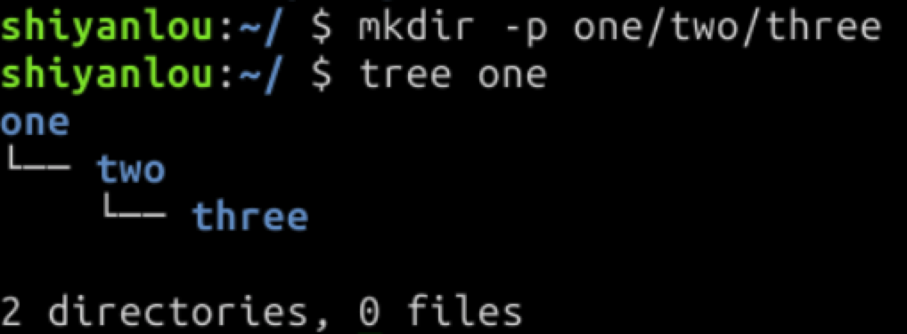

# 认识编程
[[TOC]]
## 编程怎么学
写代码-->思考-->总结
### 做实验--写代码
学习编程最好的方法就是:编程

人类一生中，99% 的技能都是靠实践学来的，编程更是如此。太多人看完几本书、几个 G 的视频后，仍然不会写程序，**就是因为代码写的太少了。**

### 完成挑战--思考

挑战的过程是真正 **培养编程思维** 的过程，你可能会陷入一种「心流」的状态 —— 走路、吃饭时，都在思考代码该怎么写。一旦想通，回到电脑前如行云流水般写出代码，你会发现自己的水平提高了一大节，编程能力也远远超越了同期只看书、看视频的同学。

### 做笔记,画脑图--总结
学习编程不可能一下子全部搞懂，也不可能一遍就全部记住。如果按照学校背书的那套方法来学习编程，你可能付出比别人多 10 倍的努力也学不好编程。

正确的做法是，**完成一个章节的学习后，及时用脑图或笔记软件，对知识点进行总结，下次忘记时再及时查阅。**

**这样做的结果是：**

-   **记得更牢**：用自己的语言记述后，知识变成了自己的。
-   **方便查阅**：过去学习 Ctrl + C、Ctrl + V 时， 你可能要百度很多次才能记住；有了一个可以随时翻阅、准确定位的备忘录后，你的搜索时间将大大减少。
-   **求职利器**：在面试求职中，一个善于总结、且有学习笔记证明的人，会脱颖而出，更有机会得到顶尖的工作。

## 认识Linux
### 学习前的心理建设
**不用硬记！**

**不用硬记！**

**不用硬记！**

学习 Linux 常用命令，有点像学习 Windows、Mac 或者 PS、Word 的  **快捷键**，死记硬背是没有用的，在使用中多操作几次，自然就记住了。
### Linux目录操作
**首先我们来学习 Linux 目录的常用操作命令。**

Linux 的目录类似于 Windows 系统中的文件夹。我们看一下刚刚打开的  `终端`  界面，它的第一行开头是：
```
shiyanlou:~/ $
```
这就代表着你当前所处的目录位置：打开终端后，会默认从当前的用户目录开始操作，这就好比你打开“我的电脑”，会默认显示所有磁盘的目录。

`shiyanlou`  代表你当前的用户名，如果你的用户名叫 tony，就会显示  `tony:~/ $`。后面的美元符号  `$`  是「命令提示符」，提示你：请在它后面输入命令。
##### 查看目录中的内容:`ls`
我们来输入第一个命令：在 `$` 后输入 `ls` ，可查看当前目录下的文件和目录。
##### 进入目录:`cd`

#### 快捷操作
**常用快捷键：**

按按键盘的  `上下键`  试试？ 可快速选择前面输过的命令。

输入  `cd ..`  可以回到上一级目录，类似 Windows 的「向上」。
```
cd ..
```
`cd -` 表示回到上一次所在的目录，类似 Windows 的「后退」。
```
cd -
```
`cd ~` 表示回到当前用户的主目录，类似 Windows 的「回到桌面」。
```
cd ~
```
`cd /` 表示进入根目录，它是一切目录的父目录
```
cd /
```
**注意**:上面的快捷操作，符号都必须是英文符号，否则会报错。
#### 查看目录结构:`tree`
使用 tree 命令，可以列出一个文件夹下的所有子文件夹和文件（以树形结构来进行列出）。
```
tree
```
**我们来点刺激的，输入：**

```bash
cd /

```

再输入：

```bash
tree

```

执行指令后，终端会像走马灯一样，遍历出系统里的所有目录和文件，这时按下  `ctrl + c`  键即可停止。
#### 绝对路径
Linux 进入目录的方式有`绝对路径`和`相对路径`两种。

之前我们都是用  `相对路径`  进入目录的，这相当于你在 Windows 系统下，在当前文件夹中点击下一个文件夹进入；

而  `绝对路径`  是一个以根目录 / 为起点的完整路径，如：  `/home/shiyanlou/Code`，可以类比 Windows 上的  `C:\Users\电脑用户名\Desktop`。

使用 pwd 命令可以获取当前目录的绝对路径.
有了绝对路径后，不管你当前在哪个目录下，都可以通过指令进入指定目录：

```bash
cd /home/shiyanlou/Code

```
**提示**:如果忘记了目录名、文件名或命令，可使用 Tab 键自动补全，还可避免输入错误；连续按两次 Tab 可以显示全部候选结果。
#### 新建目录
使用  `mkdir`  命令可创建目录，`mkdir mycode`  的意思就是新建一个名为  `mycode`  的目录。
还可以在 `mkdir` 后加入 `-p` 参数，一次性创建多级目录，如：



### Linux文件操作
下面是 Linux 中对文件的常用操作，包含新建、复制、删除等。

**新建空白文件**

使用  `touch`  命令可以新建文件，比如我想再新建一个名为 “hello” 的文件，可输入：

```bash
touch hello
```
（该命令不会覆盖已有同名文件）
**复制**
使用  `cp`  命令（Copy）复制文件到指定目录下，比如要把  `hello`  文件复制到  `one/two`  这个目录下：

```bash
cp hello one/two/
tree one

```

如果要复制目录，需要在  `cp`  后加上  `-r`  ，然后接上  `目录名 目标目录名`：

```bash
mkdir test
cp -r test one/two
tree one

```

上面的操作中，我们先新建了一个  `test`  目录，然后把它复制进了  `one/two`  这个目录中，再通过`tree one`  直接查看 one 的目录结构。

**删除**
使用  `rm`  命令删除文件：

```bash
ls
rm hello
ls

```

删除目录要加上  `-r`  选项，类似  `cp -r`  拷贝目录，会删除目录和目录下的所有内容：

```bash
mkdir test
ls
rm -r test
ls
```

**移动文件/目录与重命名**
使用  `mv`  命令可以移动文件或目录。

首先，我们进入到  `/home/shiyanlou`  目录，使用  `touch`  创建空文件  `test1`：

```bash
cd ~
touch test1

```

然后，我们创建一个新目录  `dir1`，`ls`  查看一下

```bash
mkdir dir1
ls

```

使用  `mv`  命令 将  `test1`  移动到  `dir1`  目录，代码如下：

```bash
mv test1 dir1

```

然后进入  `dir1`  目录查看一下

```bash
cd dir1
ls

```

`mv`  命令还可以用来重命名，如  `mv test1 test2`， 会把  `test1`  重命名为  `test2`：

```bash
ls
mv test1 test2
ls
```
#### 查看文件内容
使用  `cat`  命令，可以将文件中的内容打印到屏幕上，使用方法是  `cat 文件路径`。

现在还没有文件，我们先从其他地方复制过来一个：

```bash
cp /etc/passwd passwd
ls

```

这样就把  `passwd`  文件从  `/etc`  目录拷贝到了当前目录中，然后我们用  `cat passwd`  显示文件中的内容：

```bash
cat passwd

```

使用  `cat -n`  可以带行号地打印文件内容：

```bash
cat -n passwd
```
#### 编辑文档
Sublime Text 是一套跨平台的文本编辑器，支持语法高亮，具有轻量、入门简单等特点。

实验环境中内置了 Sublime Text 编辑器，双击实验环境桌面的图标即可打开。

启动 sublime 后，依次点击菜单栏的  `File`  -  `New File`  或 按下`ctrl + n`，可以新建文件，然后在 sublime 中写入以下内容：

```txt
hello shiyanlou

```

然后按  `ctrl + s`  保存文件到桌面，命名为  `hello`
#### 帮助命令
在 Linux 环境中，如果你遇到困难，可以使用  `man`  命令，它是  `Manual pages`  的缩写。例如输入  `man cat`  ，可以获取 cat 命令的详细的帮助文件。进入到 man 的页面后，按  `q`  可以退出 man。

有些命令可以使用  `--help`  选项查看帮助文档。


