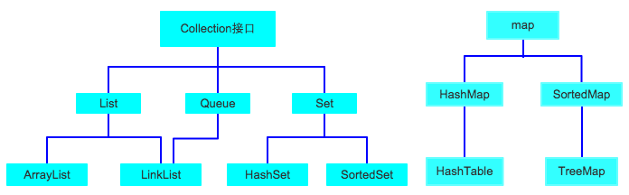
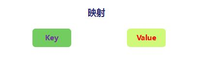

# 泛型和集合
[[TOC]]

## 泛型

泛型即参数化类型，也就是说数据类型变成了一个可变的参数，在不使用泛型的情况下，参数的数据类型都是写死了的，使用泛型之后，可以根据程序的需要进行改变。

定义泛型的规则：

- 只能是**引用类型**，不能是简单数据类型。
- 允许我们在**使用一个类时指定它当中属性,方法参数或返回值的类型**.
- 泛型参数可以有多个。
- 泛型在集合中被广泛使用,用来指定集合中的元素类型.
- 有泛型支持的类在使用时若不指定泛型的具体类型则默认为原型Object
- 可以用使用 `extends` 语句或者 `super` 语句 如 `<T extends superClass>` 表示类型的上界，`T` 只能是 `superClass` 或其子类， `<K super childClass>` 表示类型的下界，`K` 只能是 `childClass` 或其父类。
- 可以是通配符类型，比如常见的 `Class<?>`。单独使用 `?` 可以表示任意类型。也可以结合 `extends` 和 `super` 来进行限制。


```java
package collection;

import java.util.ArrayList;
import java.util.Collection;
import java.util.Iterator;

public class TypeDemo {
    public static void main(String[] args) {
        /*
            Collection<E>
            Collection接口声明时,声明了一个泛型类型E.那么在定义一个Collection类型
            变量时可以指定这个E的实际类型
         */
        Collection<String> c = new ArrayList<>();//指定E为String类型
        // add(E e),add方法中参数的类型就是E,这里就相当于是String类型了.
        c.add("one");
        c.add("two");
        c.add("three");
        c.add("four");
//        c.add(123);//编译不通过,编译器会检查实际参数是否符合泛型要求
        /*
            在使用新循环时,可以直接用集合指定的泛型类型接收元素了.
         */
        for(String s : c){
            System.out.println(s);
        }
        /*
            迭代器也支持泛型,指定的与其遍历的集合元素指定的泛型一致即可.
         */
        Iterator<String> it = c.iterator();
        while(it.hasNext()){
            String s = it.next();//E next().返回值为泛型类型,因此无需再造型.
            System.out.println(s);
        }
    }
}
```


### 定义泛型类

接下来我们来定义一个泛型类，它有一个成员，成员的类型待定。

```java
/*
使用T代表类型，无论何时都没有比这更具体的类型来区分它。如果有多个类型参数，我们可能使用字母表中T的临近的字母，比如S。
*/
class Test<T> {
    private T ob;

    /*
    定义泛型成员变量，定义完类型参数后，可以在定义位置之后的方法的任意地方使用类型参数，就像使用普通的类型一样。
    注意，父类定义的类型参数不能被子类继承。
    */

    //构造函数
    public Test(T ob) {
        this.ob = ob;
    }

    //getter 方法
    public T getOb() {
        return ob;
    }


    //setter 方法
    public void setOb(T ob) {
        this.ob = ob;
    }

    public void showType() {
        System.out.println("T的实际类型是: " + ob.getClass().getName());
    }
}

public class TestDemo {
    public static void main(String[] args) {
        // 定义泛型类 Test 的一个Integer版本
        Test<Integer> intOb = new Test<Integer>(88);
        intOb.showType();
        int i = intOb.getOb();
        System.out.println("value= " + i);
        System.out.println("----------------------------------");
        // 定义泛型类Test的一个String版本
        Test<String> strOb = new Test<String>("Hello Gen!");
        strOb.showType();
        String s = strOb.getOb();
        System.out.println("value= " + s);
    }
}
```

### 使用泛型方法

```java
// Test.java
public class Test {

  /*
  注意：定义带类型参数的方法，其主要目的是为了表达多个参数以及返回值之间的关系。例如本例子中T和S的继承关系， 返回值的类型和第一个类型参数的值相同。
  */
    public<T, S extends T> T testDemo(T t, S s){
        System.out.println("我是 T 类型，我的类型是" + t.getClass().getName());
        System.out.println("我是 S 类型，我的类型是" + s.getClass().getName());
        return t;
    }

    public static void main(String[] args) {
        // TODO Auto-generated method stub
        Test test = new Test();
        Dog d = new Dog();
        Animal a0 = new Animal();
        Animal a1  = test.testDemo(a0, d);
        System.out.println("我是对象 a1，我的类型是" + a1.getClass().getName());
    }

}
```

我们对类型参数赋予了具体的类型，当然我们有时候也无法确定类型参数的类型，这个时候我们便可以使用通配符。如果仅仅是想实现多态，请优先使用通配符解决。

```java
import java.util.List;
import java.util.ArrayList;

public class Test {

  // List<?> 表示接受一个元素为任意类型的列表 List。
    public void testDemo(List<?> s){
        for(Object obj:s){
            System.out.println("我的类型是" + obj.getClass().getName());
        }
    }

    public static void main(String[] args) {
        // TODO Auto-generated method stub
        Test test = new Test();
        Dog a0 = new Dog();
        Animal a1 = new Animal();
    // 声明一个接收元素类型是 Animal 的列表 List s。
    // 然后创建一个元素类型是 Animal 的 ArrayList 赋值给 s。
        List<Animal> s = new ArrayList<Animal>();
    // Dog a0 是 Animal 的子类，可以向上转型为 Animal 类型
        s.add(a0);
        s.add(a1);
        test.testDemo(s);
    }

}
```

### 概念

```java
public class LinkedList<E>
    extends AbstractSequentialList<E>
    implements List<E>, Deque<E>, Cloneable, java.io.Serializable{}
public interface Deque<E> extends Queue<E> {}
public interface Queue<E> extends Collection<E> {}
public interface Collection<E> extends Iterable<E> {}
```

我们上面的代码中出现的<?>是什么东西呢 它叫泛型，常用来和集合对象一同使用，所以我们在开始学习集合之前，必须先了解下什么是泛型。而且泛型概念非常重要，它是程序的增强器，它是目前主流的开发方式。
泛型是（Generics）是JDK1.5 的一个新特性，其实就是一个『语法糖』，本质上就是编译器为了提供更好的可读性而提供的一种小手段，小技巧，虚拟机层面是不存在所谓『泛型』的概念的。

### 作用

- 通过泛型的语法定义，约束集合元素的类型，进行安全检查，把错误显示在编译期
- 代码通用性更强，后面有案例
- 泛型可以提升程序代码的可读性，但它只是一个语法糖（编译后这样的东西就被删除，不出现在最终的源代码中），对于JVM运行时的性能是没有任何影响的。

### 泛型示例


我们创建一个ArrayList，上面看到eclipse提示有个黄线，什么意思呢？

```java
ArrayList is a raw type. References to generic type ArrayList<E> should be parameterized. 
```

ArrayList使用了泛型，在声明时需指定具体的类型。
那我们把这个<>里的方式就称为泛型。上面的泛型有什么作用呢？就是在编译阶段就检查我们传入的参数类型是否正确。


有了泛型，我们可以看到人家要求存放String，而我故意存放的整数100，所以eclipse提示我们错误：

```java
The method add(int, String) in the type List<String> is not applicable for the arguments (int)。
```

类型List的add方法要求增加的类型为String类型，不正确不能存入。

### 泛型声明

泛型可以在接口、方法、返回值上使用：
java.util.List泛型接口/类：

```java
public interface Collection<E> {}
```

泛型方法的声明：

```java
public <E> void print(E e) {}
```

在方法返回值前声明了一个表示后面出现的E是泛型，而不是普通的java变量。

### 常用名称

- E - Element (在集合中使用，因为集合中存放的是元素)
- T - Type（Java 类）
- K - Key（键）
- V - Value（值）
- N - Number（数值类型）
- ? - 表示不确定的java类型

### 用途：编译时类型检查

```java
package seday12new;

import java.util.ArrayList;
import java.util.Iterator;
import java.util.List;

public class Test1 {
	public static void main(String[] args) {
		int[] a = new int[3];
		a[0]=1;
		a[1]=2;
		//int类型的数组，规定了数组里的数据类型，类型不对就报错。
//		a[2]="hello";
		
		//1，泛型的标志<>
		//2，泛型的好处：规定了数据的类型，不能想放什么数据就放什么类型，要遵守泛型规定的类型
		//3，泛型的数据类型只能是引用类型，不能是基本类型
		List<Integer> list = new ArrayList<Integer>();
		list.add(1);
		list.add(2);
//4，如果类型不对，把运行时期才会 报的错ClassCastException直接在编译时期就报出来
//		list.add("a");
//		list.add('b');
		
		Iterator it = list.iterator();
		while(it.hasNext()) {
			Integer s = (Integer) it.next();
			System.out.println(s);
		}
		
	}
}
```

### 用途：代码通用性更强

**传统方式：**通过重载多态实现，方法同名，参数类型不同。

```java
package javase.base.gennarics;
 
public class TestOldStyle {
    public static void print(Integer[] dArray) {
       for( Integer d : dArray) {
           System.out.println(d);
       }
    }
   
    public static void print( String[] sArray) {
       for( String s : sArray) {
           System.out.println(s);
       }
    }
   
    public static void main(String[] args) {
       Integer[] scores = new Integer[]{100,98,80};
       String[] names = new String[]{"语文","数学","英语"};
      
       TestOldStyle.print(scores);
       TestOldStyle.print(names);
    }
}
```

**泛型方式**

```java
package javase.base.gennarics;
 
public class TestGenarics {
    public static <E> void print(E[] arr) {
       for(E e : arr) {
           System.out.println(e);
       }
    }
   
    public static void main(String[] args) {
       Integer[] scores = new Integer[]{ 100,98,80 };
       String[] names = new String[]{ "语文","数学","英语" };
       Double[] moneys = new Double[] { 10.1,20.2,30.3 };
      
       TestGenarics.print(scores);
       TestGenarics.print(names);
       TestGenarics.print(moneys);
    }
}
```


### 类型擦除

泛型只是在编译期间生存，编译后就被干掉了，真正运行时，大多情况下取而代之的是Object。
下面的代码利用了jdk提供的强大的反射功能，后续会专门详细讲解，今天先初体验下其强大的功能。

```java
package javase.generics;
 
import java.lang.reflect.Method;
import java.util.ArrayList;
import java.util.List;
 
//泛型类型擦除
public class TestGenerics {
    public static void main(String[] args) throws Exception {
       List<Integer> list = new ArrayList<Integer>();
      
       //1. 编译器按泛型检查，类型报错。这是在编译阶段
       //list.add("chenzs");
      
       //2. 但在实际运行时，泛型的地方就被替代为通用类型Object
       Class<?> clazz = list.getClass();
       Method m = clazz.getDeclaredMethod("add", Object.class);
      
       //3. 利用发射得到的对象是运行时对象，其就可以设置非整形的数据
       m.invoke(list, "chenzs");
      
      
       System.out.println(list.get(0));
    }
}
```

## Collection

集合框架是为**表示和操作集合**而规定的一种统一的标准的体系结构。任何集合框架都包含三大内容：**对外的接口、接口的实现和对集合运算的算法**。

集合与数组一样,可以保存一组元素,并且提供了操作元素的相关方法,使用更方便.

下图是简化的集合框架关系图：



因为集合框架中的很多类功能是相似的，所以我们用接口来规范类。Collection 接口是 Java 集合框架里的一个根接口。它也是 List、Set 和 Queue 接口的父接口。Collection 接口中定义了可用于操作 List、Set 和 Queue 的方法——增删改查。

### Collection下面有两个常见的子接口:

- java.util.List:线性表.是**可重复**集合,并且有序.
- java.util.Set:**不可重复**的集合,大部分实现类是无序的.

这里可重复指的是集合中的元素是否可以重复,而判定重复元素的标准是依靠元素自身equals比较的结果.为true就认为是重复元素.

```java
package collection;

import java.util.ArrayList;
import java.util.Collection;

public class CollectionDemo1 {
    public static void main(String[] args) {
        Collection c = new ArrayList();
        /*
            boolean add(E e)
            向当前集合中添加一个元素.当元素成功添加后返回true
         */
        c.add("one");
        c.add("two");
        c.add("three");
        c.add("four");
        c.add("five");
        System.out.println(c);
        /*
            int size()
            返回当前集合的元素个数
         */
        int size = c.size();
        System.out.println("size:"+size);
        /*
            boolean isEmpty()
            判断当前集合是否为空集(不含有任何元素)
         */
        boolean isEmpty = c.isEmpty();
        System.out.println("是否为空集:"+isEmpty);
        /*
           清空集合
         */
        c.clear();
        System.out.println(c);
        System.out.println("size:"+c.size());//0
        System.out.println("是否为空集:"+c.isEmpty());


    }
}
```


### 常用方法

| 方法                               | 返回值   | 说明                                                         |
| ---------------------------------- | -------- | ------------------------------------------------------------ |
| `add(E e)`                         | boolean  | 向 collection 的尾部追加指定的元素（可选操作）               |
| `addAll(Collection<? extend E> c)` | boolean  | 将指定 collection 中的所有元素都添加到此 collection 中（可选操作） |
| `clear()`                          | void     | 移除此 collection 中的所有元素（可选操作）                   |
| `contains(Object o)`               | boolean  | 如果此 collection 包含指定的元素，则返回 true                |
| `containsAll(Collection<?> c)`     | boolean  | 如果此 collection 包含指定 collection 的所有元素，则返回 true |
| `equals(Object o)`                 | boolean  | 比较此 collection 与指定对象是否相等                         |
| `hashCode()`                       | int      | 返回此 collection 的哈希码值                                 |
| `isEmpty()`                        | boolean  | 如果此 collection 不包含元素，则返回 true                    |
| `iterator()`                       | Iterator | 返回在此 collection 的元素上进行迭代的迭代器                 |
| `remove(Object o)`                 | boolean  | 移除此 collection 中出现的首个指定元素（可选操作）           |
| `removeAll(Collection<?> c)`       | boolean  | 移除此 collection 中那些也包含在指定 collection 中的所有元素（可选操作） |
| `retainAll(Collection<?> c)`       | boolean  | 仅保留此 collection 中那些也包含在指定 collection 的元素（可选操作） |
| `size()`                           | int      | 返回此 collection 中的元素数                                 |
| `toArray()`                        | Object[] | 返回包含此 collection 中所有元素的数组                       |
| `toArray(T[] a)`                   | T[]      | 返回包含此 collection 中所有元素的数组；返回数组的运行时类型与指定数组的运行时类型相同 |

#### 集合与元素equals方法相关的方法

```java
package collection;

import java.util.ArrayList;
import java.util.Collection;
import java.util.HashSet;

/**
 * 集合与元素equals相关的操作
 * 集合有些操作是依靠元素的equals方法进行的.因此要妥善的重写元素的equals方法.
 */
public class CollectionDemo2 {
    public static void main(String[] args) {
        Collection c = new ArrayList();
//        Collection c = new HashSet();//不可以存放重复元素
        c.add(new Point(1,2));
        c.add(new Point(3,4));
        c.add(new Point(5,6));
        c.add(new Point(7,8));
        c.add(new Point(9,0));
        System.out.println(c);

        Point p = new Point(1,2);
//        c.add(p);//将p对象存入集合c.对于Set集合而言,重复元素无法再次存入
//        System.out.println(c);

        /*
            boolean contains(Object o)
            判断集合是否包含给定元素.判断依据是看给定元素是否存在与集合元素存在equals
            比较为true的情况,存在则认为包含.
         */
        boolean contains = c.contains(p);
        System.out.println("是否包含p对象:"+contains);
        /*
            remove方法是从集合中删除给定元素.删除也是删除与给定元素equals比较为true
            的元素.如果集合中存在多个重复的元素,那么仅删除第一个
         */
        c.remove(p);
        System.out.println(c);

    }
}
```


### 集合存放的是元素的引用

集合只能存放引用类型元素,并且存放的是元素的引用

```java
package collection;

import java.util.ArrayList;
import java.util.Collection;

public class CollectionDemo3 {
    public static void main(String[] args) {
        Point p = new Point(1,2);
        Collection c = new ArrayList();
        c.add(p);
        System.out.println("p:"+p);//(1,2)
        System.out.println("c:"+c);//[(1,2)]
        p.setX(2);
        System.out.println("p:"+p);//(2,2)
        System.out.println("c:"+c);//[(2,2)]
    }
}
```

### 集合间的操作

集合提供了如取并集,删交集,判断包含子集等操作

```java
package collection;

import java.util.ArrayList;
import java.util.Collection;
import java.util.HashSet;

/**
 * 集合间的操作
 */
public class CollectionDemo4 {
    public static void main(String[] args) {
//        Collection c1 = new ArrayList();
        //HashSet是无序集,并且不可以存放重复元素.
        Collection c1 = new HashSet();
        c1.add("java");
        c1.add("c++");
        c1.add(".net");
        System.out.println("c1:"+c1);

        Collection c2 = new ArrayList();
        c2.add("android");
        c2.add("ios");
        c2.add("java");
        System.out.println("c2:"+c2);
        /*
            boolean addAll(Collection c)
            将给定集合中的所有元素添加到当前集合中.当前集合发生了改变就返回true.
         */
        c1.addAll(c2);
        System.out.println("c1:"+c1);
        System.out.println("c2:"+c2);

        Collection c3 = new ArrayList();
        c3.add("ios");
        c3.add("c++");
        c3.add("php");
        System.out.println("c3:"+c3);
        /*
            boolean containsAll(Collection c)
            判断当前集合是否包含给定集合中的所有元素
         */
        boolean containsAll = c1.containsAll(c3);
        System.out.println("包含所有:"+containsAll);
        /*
            删除当前集合中与给定集合的共有元素(删交集)
         */
        c1.removeAll(c3);
        System.out.println("c1:"+c1);
        System.out.println("c3:"+c3);
        
        c2.retainAll(c3);//取交集,仅保留当前集合中与给定集合的共有元素
        System.out.println("c2:"+c2);
        System,out.println("c3:"+c3);
    }
}
```


### 集合的遍历

#### Collection提供了统一的遍历集合方式:迭代器模式

`Iterator iterator()`

该方法会获取一个用于遍历当前集合元素的迭代器.


#### java.util.Iterator接口


迭代器接口,定义了迭代器遍历集合的相关操作.

不同的集合都实现了一个用于遍历自身元素的迭代器实现类,我们无需记住它们的名字,用多态的角度把他们看做为Iterator即可.

迭代器遍历集合遵循的步骤为:**问,取,删**.其中删除元素不是必要操作

```java
package collection;

import java.util.ArrayList;
import java.util.Collection;
import java.util.Iterator;

public class IteratorDemo {
    public static void main(String[] args) {
        Collection c = new ArrayList();
        c.add("one");
        c.add("two");
        c.add("three");
        c.add("four");
        c.add("five");
        System.out.println(c);
        //获取遍历该集合的迭代器
        Iterator it = c.iterator();
        //问
        while(it.hasNext()){
            //取
            String str = (String)it.next();
            System.out.println(str);
        }

    }
}
```

#### 迭代器遍历过程中不得通过集合的方法增删元素

```java
package collection;

import java.util.ArrayList;
import java.util.Collection;
import java.util.Iterator;

/**
 * 集合的遍历
 * Collection提供了统一的遍历集合方式:迭代器模式
 *
 * Iterator iterator()
 * 该方法会获取一个用于遍历当前集合元素的迭代器.
 *
 * java.util.Iterator接口,迭代器接口,定义了迭代器遍历集合的相关操作.
 * 不同的集合都实现了一个用于遍历自身元素的迭代器实现类,我们无需记住它们的名字,用多态的
 * 角度把他们看做为Iterator即可.
 * 迭代器遍历集合遵循的步骤为:问,取,删.其中删除元素不是必要操作
 */
public class IteratorDemo {
    public static void main(String[] args) {
        Collection c = new ArrayList();
        c.add("one");
        c.add("#");
        c.add("two");
        c.add("#");
        c.add("three");
        c.add("#");
        c.add("four");
        c.add("#");
        c.add("five");
        System.out.println(c);
        //获取遍历该集合的迭代器
        Iterator it = c.iterator();
        //问
        while(it.hasNext()){
            //取
            String str = (String)it.next();
            System.out.println(str);
            if("#".equals(str)){
                /*
                    迭代器要求遍历的过程中不得通过集合的方法增删元素,否则会
                    抛出异常:java.util.ConcurrentModificationException
                 */
//                c.remove(str);
                /*
                    迭代器提供了remove方法,将next方法得到的元素从集合中删除.
                 */
                it.remove();
            }
        }
        System.out.println(c);
    }
}
```

### 增强型for循环

JDK5之后推出了一个特性:增强型for循环


* 也称为新循环,使得我们可以**使用相同的语法遍历集合或数组.**
* 语法:

```java
for(元素类型 变量名 : 集合或数组){
    循环体
}
```

不过增强型for循环也有不足：

1. 无法用来进行ArrayList的初始化
2. 无法得知当前是第几个元素了，当需要只打印单数元素的时候，就做不到了。 必须再自定下标变量。

```java
package collection;

import java.util.ArrayList;
import java.util.Collection;

/**
 * JDK5之后推出了一个特性:增强型for循环
 * 也称为新循环,使得我们可以使用相同的语法遍历集合或数组.
 * 语法:
 * for(元素类型 变量名 : 集合或数组){
 *     循环体
 * }
 */
public class NewForDemo {
    public static void main(String[] args) {
        String[] array = {"one","two","three","four","five"};
        for(int i=0;i<array.length;i++){
            String str = array[i];
            System.out.println(str);
        }
        /*
            新循环的语法是编译器认可的,而不是虚拟机.编译器在编译代码时会把新循环遍历
            数组改为普通的for循环遍历.
         */
        for(String str : array){
            System.out.println(str);
        }

        Collection c = new ArrayList();
        c.add("one");
        c.add("two");
        c.add("three");
        c.add("four");
        c.add("five");
        System.out.println(c);
        /*
            新循环遍历集合就是迭代器遍历.编译器会改为迭代器.
            所以注意!不要在使用新循环遍历集合的过程中使用集合的方法增删元素,否则会
            抛出异常!
         */
        for(Object o : c){
            String s = (String)o;
            System.out.println(s);
        }
    }
}
```

### 集合与数组的转换

#### 集合转换为数组

Collection提供了一个方法:**toArray**,可以将当前集合转换为一个数组

需要注意的是，如果要转换为一个Hero数组，那么需要传递一个Hero数组类型的对象给toArray()，这样toArray方法才知道，你希望转换为哪种类型的数组，否则只能转换为Object数组

```java
package collection;

import java.util.ArrayList;
import java.util.Arrays;
import java.util.Collection;

/**
 * 集合转换为数组
 * Collection提供了一个方法:toArray,可以将当前集合转换为一个数组
 */
public class CollectionToArrayDemo {
    public static void main(String[] args) {
        Collection<String> c = new ArrayList<>();
        c.add("one");
        c.add("two");
        c.add("three");
        c.add("four");
        System.out.println(c);
//        Object[] array = c.toArray();//不常用
        /*
            该toArray方法要求传入一个数组.方法内部会将给定元素存入该数组并将其返回.
            如果给定的数组长度小于集合的size,则该方法会根据给定的数组类型自行创建一个
            与集合size一致的数组并将元素存入后返回.
         */
        String[] array = c.toArray(new String[c.size()]);
        System.out.println(array.length);
        System.out.println(Arrays.toString(array));
    }
}
```


#### 数组转换为List集合

数组的工具类Arrays提供了一个静态方法**asList()**,可以将一个数组转换为一个List集合

```java
package collection;

import java.util.ArrayList;
import java.util.Arrays;
import java.util.List;

/**
 * 数组转换为List集合
 * 数组的工具类Arrays提供了一个静态方法asList,可以将一个数组转换为一个List集合
 */
public class ArrayToListDemo {
    public static void main(String[] args) {
        String[] array = {"one","two","three","four"};
        List<String> list = Arrays.asList(array);
        System.out.println(list);
        //修改集合现有元素
        list.set(1,"six");
        System.out.println(list);
        //数组转换出来的集合,对其元素操作就是对原数组对应元素的操作
        System.out.println(Arrays.toString(array));

        //由于数组定长,所以集合会改变元素个数的操作都不支持:UnsupportedOperationException
//        list.add("five");

        /*
            若希望对元素做增删操作,则需要自行再创建一个集合,并包含数组转换的集合中的所有
            元素即可.
            所有的集合都支持一个参数为Collection类型的构造方法,该构造方法的作用是创建
            当前集合的同时包含给定集合中的所有元素
         */
        //创建一个ArrayList的同时包含给定的集合"list"中的所有元素
        List<String> list2 = new ArrayList<>(list);

        System.out.println(list2);
        list2.add("five");
        System.out.println(list2);
    }
}
```


## `List`

`List` 是一个接口，**不能实例化**，需要一个具体类来实现实例化。

`ArrayList`实现了接口List
常见的写法会把引用声明为接口List类型
注意：是**java.util.List**,而**不是**`java.awt.List`

List集合是可重复集,并且有序,提供了一套可以通过下标操作元素的方法

常用实现类:

* java.util.ArrayList:内部使用数组实现,查询性能更好.
* java.util.LinkedList:内部使用链表实现,首尾增删元素性能更好.

```java
package collection;
 
import java.util.ArrayList;
import java.util.List;

import charactor.Hero;
 
public class TestCollection {

    public static void main(String[] args) {
    	//ArrayList实现了接口List
    	
    	//常见的写法会把引用声明为接口List类型
    	//注意：是java.util.List,而不是java.awt.List
    	//接口引用指向子类对象（多态）
    	
        List heros = new ArrayList();
        heros.add( new Hero("盖伦"));
        System.out.println(heros.size());
        
    }
     
}

```


List 集合中的对象按照一定的顺序排放，里面的内容可以重复。 `List` 接口实现的类有：`ArrayList`（实现动态数组），`Vector`（实现动态数组），`LinkedList`（实现链表），`Stack`（实现堆栈）。

List 在 Collection 基础上增加的方法：

| 方法                                           | 返回值         | 说明                                                         |
| ---------------------------------------------- | -------------- | ------------------------------------------------------------ |
| `add(int index, E element)`                    | void           | 在列表的指定位置插入指定元素（可选操作）                     |
| `addAll(int index, Collection<? extends E> c)` | boolean        | 将指定 collection 中的所有元素都插入到列表中的指定位置（可选操作） |
| `get(int index)`                               | E              | 返回列表中指定位置的元素                                     |
| `indexOf(Object o)`                            | int            | 返回此列表中第一次出现的指定元素的索引；如果此列表不包含该元素，则返回 -1 |
| `lastIndexOf(Object o)`                        | int            | 返回此列表中最后出现的指定元素的索引；如果列表不包含此元素，则返回 -1 |
| `listIterator()`                               | `ListIterator` | 返回此列表元素的列表迭代器（按适当顺序）                     |
| `listIterator(int index)`                      | `ListIterator` | 返回此列表元素的列表迭代器（按适当顺序），从列表的指定位置开始 |
| `remove(int index)`                            | E              | 移除列表中指定位置的元素（可选操作）                         |
| `set(int index, E element)`                    | E              | 用指定元素替换列表中指定位置的元素（可选操作）               |
| `subList(int fromIndex, int toIndex)`          | List           | 返回列表中指定的 `fromIndex`（包括 ）和 `toIndex`（不包括）之间的部分视图 |

### List集合常见方法

#### get()与set()

```java
package collection;

import java.util.ArrayList;
import java.util.Collections;
import java.util.List;

/**
 * java.util.List接口
 * List继承自Collection.List集合是可重复集,并且有序,提供了一套可以通过下标操作元素的方法
 * 常用实现类:
 * java.util.ArrayList:内部使用数组实现,查询性能更好.
 * java.util.LinkedList:内部使用链表实现,首尾增删元素性能更好.
 */
public class ListDemo1 {
    public static void main(String[] args) {
        List<String> list = new ArrayList<>();
//        List<String> list = new LinkedList<>();
        list.add("one");
        list.add("two");
        list.add("three");
        list.add("four");
        list.add("five");
        System.out.println(list);
        /*
             get(int index)
            获取当前List集合中指定下标处对应的元素
         */
        //获取集合中第三个元素
        String str = list.get(2);//arr[2]
        System.out.println(str);
        //for循环遍历List集合
        for(int i=0;i<list.size();i++){
            str = list.get(i);
            System.out.println(str);
        }

        /*
             set(int index,E e)
            将给定元素设置到指定位置上,返回值为该位置原来对应的元素.
            替换操作
         */
        //     two
        //[one,six,three,four,five]
        String old = list.set(1,"six");
        System.out.println(list);
        System.out.println("被替换的元素是:"+old);


        /*
            将集合反转
         */
        for(int i=0;i<list.size()/2;i++){
            //获取正数位置上的元素
            String e = list.get(i);
            //将正数位置的元素放到倒数位置上
            e = list.set(list.size()-1-i,e);
            //再将原倒数位置上的元素设置到正数位置上
            list.set(i,e);
        }
        //[five,four,three,six,one]
        System.out.println(list);
        /*
            java.util.Collections是集合的工具类,里面提供很多静态方法,可以方便
            操作集合.
         */
        //反转List集合
        Collections.reverse(list);
        System.out.println(list);

    }
}
```


#### 重载的add()和remove()

```java
package collection;

import java.util.ArrayList;
import java.util.List;

/**
 * List集合提供了一对重载的add,remove方法
 */
public class ListDemo2 {
    public static void main(String[] args) {
        List<String> list = new ArrayList<>();
        list.add("one");
        list.add("two");
        list.add("three");
        list.add("four");
        list.add("five");
        System.out.println(list);

        /*
            void add(int index,E e)
            将给定元素插入到指定位置
         */
        //[one,two,six,three,four,five]
        list.add(2,"six");
        System.out.println(list);

        /*
            E remove(int index)
            删除并返回给定位置上的元素
         */
        //[one,two,six,four,five] 删除集合中第四个元素
        String old = list.remove(3);
        System.out.println(list);
        System.out.println("被删除的元素是:"+old);
    }
}
```


#### subList()方法

```java
package collection;

import java.util.ArrayList;
import java.util.List;

/**
 * List集合支持获取子集操作
 * List subList(int start,int end)
 * 获取当前集合中指定范围内的子集,两个数字表示下标范围,含头不含尾.
 */
public class ListDemo3 {
    public static void main(String[] args) {
        List<Integer> list = new ArrayList<>();
        for(int i=0;i<10;i++){
            list.add(i);
        }
        System.out.println(list);
        //获取[3-7]
        List<Integer> subList = list.subList(3,8);
        System.out.println(subList);
        //将子集元素扩大10倍
        for(int i=0;i<subList.size();i++){
            int n = subList.get(i);
            n = n * 10;
            subList.set(i,n);
        }
        //[30,40,50,60,70]
        System.out.println(subList);
        //对子集的操作就是对原集合对应元素的操作!!!
        System.out.println(list);
        //删除list集合中[2-8]
        list.subList(2,9).clear();
        System.out.println(list);
    }
}
```

#### List 集合的的初始化赋值方式

1、是新建一个集合，然后使用 add 方法来添加元素初始化集合

2、使用匿名内部类的方式来初始化操作

3、利用 stream 流的方式来初始化集合

```java
    public static void main(String[] args) {
        //方法 1
        List<Integer> list0 = new ArrayList<>();
        list0.add(1);
        list0.add(2);
        list0.forEach(System.out::println);
        //方法 2
        List<Integer> list1 = new ArrayList<Integer>() {{
            add(1);
            add(2);
        }};
        list1.forEach(System.out::println);
        //方法 3
        List<Integer> list2 = Stream.of(1, 2).collect(Collectors.toList());
        list2.forEach(System.out::println);
    }
```

### `ArrayList`

#### 数组的局限性

如果要存放多个对象，可以使用数组，但是数组有局限性,比如 声明长度是10的数组,不用的数组就浪费了,超过10的个数，又放不下.

为了解决数组的局限性,引入容器类的概念.最常见的容器类就是`ArrayList`.

容器的容量会随着对象的增加,自动增长.

```java
package collection;

import java.util.ArrayList;

import charactor.Hero;

public class TestCollection {
	@SuppressWarnings("rawtypes")
	public static void main(String[] args) {
		//容器类ArrayList，用于存放对象
		ArrayList heros = new ArrayList();
		heros.add( new Hero("盖伦"));
		System.out.println(heros.size());
		
		//容器的容量"capacity"会随着对象的增加，自动增长
		//只需要不断往容器里增加英雄即可，不用担心会出现数组的边界问题。
		heros.add( new Hero("提莫"));
		System.out.println(heros.size());
		
	}
	
}

```


#### 增加

**add** 有两种用法

1. 第一种是直接add对象，把对象加在最后面

```java
heros.add(new Hero("hero " + i));
```

2. 第二种是在指定位置加对象

```java
heros.add(3, specialHero);
```

```java
package collection;

import java.util.ArrayList;

import charactor.Hero;

public class TestCollection {
	public static void main(String[] args) {
		ArrayList heros = new ArrayList();

		// 把5个对象加入到ArrayList中
		for (int i = 0; i < 5; i++) {
			heros.add(new Hero("hero " + i));
		}
		System.out.println(heros);

		// 在指定位置增加对象
		Hero specialHero = new Hero("special hero");
		heros.add(3, specialHero);

		System.out.println(heros.toString());

	}

}

```

#### 获取对象所在的位置

**indexOf**用于判断一个对象在`ArrayList`中所处的位置
与`contains`一样，判断标准是对象是否相同，而非对象的name值是否相等

```java
package collection;

import java.util.ArrayList;

import charactor.Hero;

public class TestCollection {
	public static void main(String[] args) {
		ArrayList heros = new ArrayList();

		// 初始化5个对象
		for (int i = 0; i < 5; i++) {
			heros.add(new Hero("hero " + i));
		}
		Hero specialHero = new Hero("special hero");
		heros.add(specialHero);

		System.out.println(heros);
		System.out.println("specialHero所处的位置:"+heros.indexOf(specialHero));
		System.out.println("新的英雄，但是名字是\"hero 1\"所处的位置:"+heros.indexOf(new Hero("hero 1")));

	}
}
```

#### 删除

**remove**用于把对象从ArrayList中删除
remove可以根据下标删除ArrayList的元素

```java
heros.remove(2);
```

也可以根据对象删除

```java
heros.remove(specialHero);
```

```java
package collection;

import java.util.ArrayList;

import charactor.Hero;

public class TestCollection {
	public static void main(String[] args) {
		ArrayList heros = new ArrayList();

		// 初始化5个对象
		for (int i = 0; i < 5; i++) {
			heros.add(new Hero("hero " + i));
		}
		Hero specialHero = new Hero("special hero");
		heros.add(specialHero);
		
		System.out.println(heros);
		heros.remove(2);
		System.out.println("删除下标是2的对象");
		System.out.println(heros);
		System.out.println("删除special hero");
		heros.remove(specialHero);
		System.out.println(heros);
		
	}
}

```

#### 获取大小

**size** 用于获取ArrayList的大小

```java
package collection;

import java.util.ArrayList;

import charactor.Hero;

public class TestCollection {
	public static void main(String[] args) {
		ArrayList heros = new ArrayList();

		// 初始化5个对象
		for (int i = 0; i < 5; i++) {
			heros.add(new Hero("hero " + i));
		}
		Hero specialHero = new Hero("special hero");
		heros.add(specialHero);
		System.out.println(heros);
		System.out.println("获取ArrayList的大小：");
		System.out.println(heros.size());
	}
}

```


#### 可增长的数组


`ArrayList` 类实现一个可增长的动态数组，位于 `java.util.ArrayList`。实现了 List 接口，它可以存储不同类型的对象（包括 `null` 在内），而数组则只能存放特定数据类型的值。

```java
/**
 * 学生类
 */
public class Student {
    public String id;
    public String name;
    public Student(String id, String name){
        this.id = id;
        this.name = name;
    }

    @Override
    public String toString() {
        return "Student{" +
                "id='" + id + '\'' +
                ", name='" + name + '\'' +
                '}';
    }
}


import java.util.*;


public class ListTest {

    //集合后面的<>代表泛型的意思
    //泛型是规定了集合元素的类型
    /**
     * 用于存放学生的List
     */
    public List<Student> students;


    public ListTest() {
        this.students = new ArrayList<Student>();
    }

    /**
     * 用于往students中添加学生
     */
    public void testAdd() {
        // 创建一个学生对象，并通过调用add方法，添加到学生管理List中
        Student st1 = new Student("1", "张三");
        students.add(st1);

        // 取出 List中的Student对象 索引为0 也就是第一个
        Student temp = students.get(0);
        System.out.println("添加了学生：" + temp.id + ":" + temp.name);

        Student st2 = new Student("2", "李四");
        //添加到list中，插入到索引为0的位置，也就是第一个
        students.add(0, st2);
        Student temp2 = students.get(0);
        System.out.println("添加了学生：" + temp2.id + ":" + temp2.name);

        // 对象数组的形式添加
        Student[] student = {new Student("3", "王五"), new Student("4", "马六")};

        // Arrays类包含用来操作数组（比如排序和搜索）的各种方法，asList() 方法用来返回一个受指定数组支持的固定大小的列表
        students.addAll(Arrays.asList(student));
        Student temp3 = students.get(2);
        Student temp4 = students.get(3);
        System.out.println("添加了学生：" + temp3.id + ":" + temp3.name);
        System.out.println("添加了学生：" + temp4.id + ":" + temp4.name);
        Student[] student2 = {new Student("5", "周七"), new Student("6", "赵八")};
        students.addAll(2, Arrays.asList(student2));
        Student temp5 = students.get(2);
        Student temp6 = students.get(3);
        System.out.println("添加了学生：" + temp5.id + ":" + temp5.name);
        System.out.println("添加了学生：" + temp6.id + ":" + temp6.name);
    }


    /**
     * 取得List中的元素的方法
     */
    public void testGet() {
        int size = students.size();
        for (int i = 0; i < size; i++) {
            Student st = students.get(i);
            System.out.println("学生：" + st.id + ":" + st.name);

        }
    }


    /**
     * 通过迭代器来遍历
     * 迭代器的工作是遍历并选择序列中的对象，Java 中 Iterator 只能单向移动
     */
    public void testIterator() {
        // 通过集合的iterator方法，取得迭代器实例
        Iterator<Student> it = students.iterator();
        System.out.println("有如下学生（通过迭代器访问）：");
        while (it.hasNext()) {

            Student st = it.next();
            System.out.println("学生" + st.id + ":" + st.name);
        }
    }

    /**
     * 通过for each 方法访问集合元素
     *
     */
    public void testForEach() {
        System.out.println("有如下学生（通过for each）：");
        for (Student obj : students) {
            Student st = obj;
            System.out.println("学生：" + st.id + ":" + st.name);
        }
        //使用java8 Steam将学生排序后输出
        students.stream()//创建Stream
                //通过学生id排序
                .sorted(Comparator.comparing(x -> x.id))
                //输出
                .forEach(System.out::println);
    }

    /**
     * 修改List中的元素
     *
     */
    public void testModify() {
        students.set(4, new Student("3", "吴酒"));
    }

    /**
     * 删除List中的元素
     *
     */
    public void testRemove() {
        Student st = students.get(4);
        System.out.println("我是学生：" + st.id + ":" + st.name + "，我即将被删除");
        students.remove(st);
        System.out.println("成功删除学生！");
        testForEach();
    }


    public static void main(String[] args) {
        ListTest lt = new ListTest();
        lt.testAdd();
        lt.testGet();
        lt.testIterator();
        lt.testModify();
        lt.testForEach();
        lt.testRemove();

    }
}
```

在上面的代码中，用到了 Arrays 类， Arrays 包含用来操作数组（比如排序和搜索）的各种方法，`asList()` 方法用来返回一个受指定数组支持的固定大小的列表。

### `LinkedList`

**序列分先进先出FIFO,先进后出FILO
FIFO在Java中又叫Queue 队列
FILO在Java中又叫Stack 栈**

#### 双向链表--Deque

除了实现了List接口外，LinkedList还实现了**双向链表结构**Deque，可以很方便的在头尾插入删除数据

什么是链表结构: 与数组结构相比较，数组结构，就好像是电影院，每个位置都有标示，每个位置之间的间隔都是一样的。 而链表就相当于佛珠，每个珠子，只连接前一个和后一个，不用关心除此之外的其他佛珠在哪里。


```java
package collection;

import java.util.LinkedList;

import charactor.Hero;

public class TestCollection {

    public static void main(String[] args) {
    	
    	//LinkedList是一个双向链表结构的list
    	LinkedList<Hero> ll =new LinkedList<Hero>();
    	
    	//所以可以很方便的在头部和尾部插入数据
    	//在最后插入新的英雄
    	ll.addLast(new Hero("hero1"));
    	ll.addLast(new Hero("hero2"));
    	ll.addLast(new Hero("hero3"));
    	System.out.println(ll);
    	
    	//在最前面插入新的英雄
    	ll.addFirst(new Hero("heroX"));
    	System.out.println(ll);
    	
    	//查看最前面的英雄
    	System.out.println(ll.getFirst());
    	//查看最后面的英雄
    	System.out.println(ll.getLast());
    	
    	//查看不会导致英雄被删除
    	System.out.println(ll);
    	//取出最前面的英雄
    	System.out.println(ll.removeFirst());
    	
    	//取出最后面的英雄
    	System.out.println(ll.removeLast());
    	
    	//取出会导致英雄被删除
    	System.out.println(ll);
    	
    }
     
}

```

##### java.util.Deque接口,双端队列

Deque继承自Queue,双端队列的特点是队列的两端都可以做出入队操作.

常用实现类:LinkedList


```java
package collection;

import java.util.Deque;
import java.util.LinkedList;

/**
 * 双端队列 java.util.Deque接口
 * Deque继承自Queue,双端队列的特点是队列的两端都可以做出入队操作.
 * 常用实现类:LinkedList
 */
public class DequeDemo {
    public static void main(String[] args) {
        Deque<String> deque = new LinkedList<>();
        deque.offer("one");
        deque.offer("two");
        deque.offer("three");
        System.out.println(deque);//[one,two,three]
        deque.offerFirst("four");//从队首方向入队
        System.out.println(deque);//[four,one,two,three]
        deque.offerLast("five");//从队尾方向入队,与offer一致
        System.out.println(deque);//[four,one,two,three,five]

        String e = deque.poll();//队首出队
        System.out.println(e);
        System.out.println(deque);
        e = deque.pollLast();//队尾出队
        System.out.println(e);
        System.out.println(deque);
        e = deque.pollFirst();//队首出队
        System.out.println(e);
        System.out.println(deque);

    }
}
```

##### 栈结构

栈结构可以保存一组元素,存取元素必须遵循先进后出原则.

使用双端队列,并且仅从同一侧做出入队操作时,就形成了栈结构,对此Deque也为栈结构提供了对应的经典方法:push(入栈),pop(出栈)

通常使用栈用来完成如"后退","前进"这样的功能.


```java
package collection;

import java.util.Deque;
import java.util.LinkedList;

/**
 * 栈结构
 * 栈结构可以保存一组元素,存取元素必须遵循先进后出原则.
 * 使用双端队列,并且仅从同一侧做出入队操作时,就形成了栈结构,对此Deque也为栈结构提供了
 * 对应的经典方法:push(入栈),pop(出栈)
 *
 * 通常使用栈用来完成如"后退","前进"这样的功能.
 */
public class StackDemo {
    public static void main(String[] args) {
        Deque<String> stack = new LinkedList<>();
        stack.push("one");
        stack.push("two");
        stack.push("three");
        stack.push("four");
        stack.push("five");
        System.out.println(stack);
        String str = stack.pop();
        System.out.println(str);//five
        System.out.println(stack);
    }
}
```


#### 队列--Queue

LinkedList 除了实现了List和Deque外，还实现了**Queue**接口(队列)。

Queue是先进先出队列 **FIFO**，常用方法：

1. **offer** 在最后添加元素
2. **poll** 取出第一个元素
3. **peek** 查看第一个元素

```java
package collection;
 
import java.util.LinkedList;
import java.util.List;
import java.util.Queue;
 
import charactor.Hero;
 
public class TestCollection {
 
    public static void main(String[] args) {
        //和ArrayList一样，LinkedList也实现了List接口
        List ll =new LinkedList<Hero>();
         
        //所不同的是LinkedList还实现了Deque，进而又实现了Queue这个接口
        //Queue代表FIFO 先进先出的队列
        Queue<Hero> q= new LinkedList<Hero>();
         
        //加在队列的最后面
        System.out.print("初始化队列：\t");
        q.offer(new Hero("Hero1"));
        q.offer(new Hero("Hero2"));
        q.offer(new Hero("Hero3"));
        q.offer(new Hero("Hero4"));
         
        System.out.println(q);
        System.out.print("把第一个元素取poll()出来:\t");
        //取出第一个Hero，FIFO 先进先出
        Hero h = q.poll();
        System.out.println(h);
        System.out.print("取出第一个元素之后的队列:\t");
        System.out.println(q);
         
        //把第一个拿出来看一看，但是不取出来
        h=q.peek();
        System.out.print("查看peek()第一个元素:\t");
        System.out.println(h);
        System.out.print("查看并不会导致第一个元素被取出来:\t");
        System.out.println(q);
         
    }
      
}
```

##### java.util.Queue接口

Queue接口继承自Collection.队列可以保存一组元素,存取元素必须遵循先进先出原则.(FIFO first input first output)

常用实现类:java.util.LinkedList


```java
package collection;

import java.util.LinkedList;
import java.util.Queue;

/**
 * 队列
 */
public class QueueDemo {
    public static void main(String[] args) {
        Queue<String> queue = new LinkedList<>();
        /*
            boolean offer(E e)
            入队操作,将给定元素添加到队列末尾
         */
        queue.offer("one");
        queue.offer("two");
        queue.offer("three");
        queue.offer("four");
        queue.offer("five");
        System.out.println(queue);
        /*
            E poll()
            出队操作,获取并删除队列中的队首元素
         */
        String str = queue.poll();
        System.out.println(str);
        System.out.println(queue);
        /*
            E peek()
            引用队首元素,获取队首元素后元素还在队列中
         */
        str = queue.peek();
        System.out.println(str);
        System.out.println(queue);

        //队列的遍历
        for(String s : queue){//新循环(迭代器)遍历后,元素并不会出队.
            System.out.println(s);
        }
        System.out.println(queue);

        queue.forEach(e-> System.out.println(e));//foreach遍历

        System.out.println(queue);

        //使用poll方法
        while(queue.size()>0){
            str = queue.poll();
            System.out.println(str);
        }
        System.out.println(queue);
    }
}
```


#### 二叉树

概念:二叉树由各种**节点**组成

二叉树特点：

1. 每个节点都可以有**左子**节点，**右子**节点
2. 每一个节点都有一个**值**


```java
package collection;

public class Node {
	// 左子节点
	public Node leftNode;
	// 右子节点
	public Node rightNode;
	// 值
	public Object value;
}
```


**二叉树排序---插入数据**

假设通过二叉树对如下10个随机数进行排序
67,7,30,73,10,0,78,81,10,74
排序的第一个步骤是把数据插入到该二叉树中
插入基本逻辑是，**小、相同的放左边**，**大的放右边**

1. 67 放在根节点c
2. 7 比 67小，放在67的左节点
3. 30 比67 小，找到67的左节点7，30比7大，就放在7的右节点
4. 73 比67大， 放在67的右节点
5. 10 比 67小，找到67的左节点7，10比7大，找到7的右节点30，10比30小，放在30的左节点。
6. ...
7. 10比67小，找到67的左节点7，10比7大，找到7的右节点30，10比30小，找到30的左节点10，10和10一样大，放在左边


```java
package collection;
 
public class Node {
    // 左子节点
    public Node leftNode;
    // 右子节点
    public Node rightNode;
 
    // 值
    public Object value;
 
    // 插入 数据
    public void add(Object v) {
        // 如果当前节点没有值，就把数据放在当前节点上
        if (null == value)
            value = v;
 
        // 如果当前节点有值，就进行判断，新增的值与当前值的大小关系
        else {
            // 新增的值，比当前值小或者相同
        	
            if ((Integer) v -((Integer)value) <= 0) {
                if (null == leftNode)
                    leftNode = new Node();
                leftNode.add(v);
            }
            // 新增的值，比当前值大
            else {
                if (null == rightNode)
                    rightNode = new Node();
                rightNode.add(v);
            }
 
        }
 
    }
 
    public static void main(String[] args) {
 
        int randoms[] = new int[] { 67, 7, 30, 73, 10, 0, 78, 81, 10, 74 };
 
        Node roots = new Node();
        for (int number : randoms) {
            roots.add(number);
        }
 
    }
}

```

**二叉树排序--遍历**

通过上一个步骤的插入行为，实际上，数据就已经排好序了。 接下来要做的是看，把**这些已经排好序的数据**，遍历成我们常用的List或者数组的形式.

二叉树的遍历分左序，中序，右序

**左序**即： 中间的数遍历后放在**左边**

**中序**即： 中间的数遍历后放在**中间**

**右序**即： 中间的数遍历后放在**右边**

如图所见，我们希望遍历后的结果是从小到大的，所以应该采用**中序遍历**


```java
package collection;

import java.util.ArrayList;
import java.util.List;

public class Node {
    // 左子节点
    public Node leftNode;
    // 右子节点
    public Node rightNode;
 
    // 值
    public Object value;
 
    // 插入 数据
    public void add(Object v) {
        // 如果当前节点没有值，就把数据放在当前节点上
        if (null == value)
            value = v;
 
        // 如果当前节点有值，就进行判断，新增的值与当前值的大小关系
        else {
            // 新增的值，比当前值小或者相同
        	
            if ((Integer) v -((Integer)value) <= 0) {
                if (null == leftNode)
                    leftNode = new Node();
                leftNode.add(v);
            }
            // 新增的值，比当前值大
            else {
                if (null == rightNode)
                    rightNode = new Node();
                rightNode.add(v);
            }
 
        }
 
    }
 
 // 中序遍历所有的节点
    public List<Object> values() {
        List<Object> values = new ArrayList<>();
 
        // 左节点的遍历结果
        if (null != leftNode)
            values.addAll(leftNode.values());
 
        // 当前节点
        values.add(value);
 
        // 右节点的遍历结果
        if (null != rightNode)
 
            values.addAll(rightNode.values());
 
        return values;
    }
 
    public static void main(String[] args) {
 
        int randoms[] = new int[] { 67, 7, 30, 73, 10, 0, 78, 81, 10, 74 };
 
        Node roots = new Node();
        for (int number : randoms) {
            roots.add(number);
        }
 
        System.out.println(roots.values());
 
    }
}

```


## Map

Map 接口也是一个非常重要的集合接口，用于存储键 / 值对。Map 中的元素都是成对出现的，键值对就像数组的索引与数组的内容的关系一样，将一个键映射到一个值的对象。一个映射不能包含重复的键；每个键最多只能映射到一个值。我们可以通过键去找到相应的值。



`value` 可以存储任意类型的对象，我们可以根据 `key` 键快速查找 `value`。Map 中的键 / 值对以 Entry 类型的对象实例形式存在。

看一看 Map 中的方法吧：

| 方法                                      | 返回值                | 说明                                                         |
| ----------------------------------------- | --------------------- | ------------------------------------------------------------ |
| `clear()`                                 | void                  | 从此映射中移除所用映射关系（可选操作）                       |
| `containsKey(Object key)`                 | boolean               | 如果此映射包含指定键的映射关系，则返回 true                  |
| `containsValue(Object value)`             | boolean               | 如果此映射将一个或多个键映射到指定值，则返回 true            |
| `entrySet()`                              | `Set<Map.Entry<K,V>>` | 返回此映射中包含的映射关系的 Set 视图                        |
| `equals(Object o)`                        | boolean               | 比较指定的对象与此映射是否相等                               |
| `get(Object key)`                         | V                     | 返回指定键所映射的值；如果此映射不包含该键的映射关系，则返回 null |
| `hashCode()`                              | int                   | 返回此映射的哈希码值                                         |
| `isEmpty()`                               | boolean               | 如果此映射未包含键 - 值映射关系，则返回 true                 |
| `keySet()`                                | Set                   | 返回此映射中包含的键的 Set 视图                              |
| `put(K key, V value)`                     | V                     | 将指定的值与此映射中的指定键关联（可选操作）                 |
| `putAll(Map<? extends K, ? extends V> m)` | void                  | 从指定映射中将所有映射关系复制到此映射中（可选操作）         |
| `remove(Object key)`                      | V                     | 如果存在一个键的映射关系，则将其从此映射中移除（可选操作）   |
| `size`                                    | int                   | 返回此映射中的键 - 值映射关系数                              |
| `values()`                                | Collection            | 返回此映射中包含的值的 Collection 视图                       |

### Map 查找表

Map体现的结构是一个多行两列的表格,其中左列称为key,右列称为value.

* Map总是成对保存数据,并且总是根据key获取对应的value.因此我们可以将查询的条件作为key查询对应的结果作为value保存到Map中.
* Map有一个要求:key不允许重复(equals比较的结果)

### Map接口

java.util.Map接口,是所有Map的顶级接口,规定了Map的相关功能.

常用实现类:

* java.util.HashMap:称为散列表,使用散列算法实现的Map,当今查询速度最快的数据结构.
* java.util.TreeMap:使用二叉树实现的Map


```java
package map;

import java.util.HashMap;
import java.util.Map;

/**
 * Map 查找表
 */
public class MapDemo {
    public static void main(String[] args) {
        Map<String,Integer> map = new HashMap<>();
        /*
            V put(K k ,V v)
            将给定的键值对存入Map中.由于Map要求key不允许重复,若使用已有的key存入value时则为替换value操作.返回值为原value.否则返回值为null

            注:
            如果Map的value是包装类类型时,在接受value值的时候一定用包装类类型的变量
            接受,避免因为自动拆箱出现空指针.
         */
        Integer num = map.put("语文",99);
        System.out.println(num);
        map.put("数学",98);
        map.put("英语",97);
        map.put("物理",96);
        map.put("化学",99);
        System.out.println(map);
        num = map.put("数学",60);//替换了value
        System.out.println(map);
        System.out.println("被替换的value:"+num);

        /*
            V get(Object key)
            根据给定的key获取对应的value,如果给定的key不存在则返回值为null
         */
        num = map.get("语文");
        System.out.println("语文:"+num);
        num = map.get("体育");
        System.out.println("体育:"+num);

        /*
            V remove(Object key)
            删除给定的key所对应的键值对,返回值为该key对应的value
         */
        num = map.remove("英语");
        System.out.println(map);
        System.out.println("被删除的英语对应的value:"+num);

        //每组键值对算一个元素
        int size = map.size();
        System.out.println("size:"+size);
        /*
            boolean containsKey(Object key)
            判断当前Map是否包含给定的key

            boolean containsValue(Object value)
            判断当前Map是否包含给定的value
         */
        boolean ck = map.containsKey("语文");//判断Map是否包含key:"语文"
        boolean cv = map.containsValue(97);//判断Map是否包含value:97
        System.out.println("包含key:"+ck);
        System.out.println("包含value:"+cv);
    }
}
```


### Map的遍历

Map支持三种遍历方式:

 * 遍历所有的key
 * 遍历所有的键值对
 * 遍历所有的value(相对不常用)

```java
package map;

import java.util.Collection;
import java.util.HashMap;
import java.util.Map;
import java.util.Set;

/**
 * Map的遍历
 */
public class MapDemo2 {
    public static void main(String[] args) {
        Map<String,Integer> map = new HashMap<>();
        map.put("语文",99);
        map.put("数学",98);
        map.put("英语",97);
        map.put("物理",96);
        map.put("化学",99);
        System.out.println(map);
        /*
            遍历所有的key
            Set<K> keySet()
            将当前Map中所有的key以一个Set集合形式返回.遍历该集合等同于遍历所有的key
         */
        Set<String> keySet = map.keySet();
//        for(String key : keySet){
//            System.out.println("key:"+key);
//        }
        keySet.forEach(k-> System.out.println(k));

        /*
            遍历每一组键值对
            Set<Entry> entrySet()
            将当前Map中每一组键值对以一个Entry实例保存并最终存入Set集合后返回.
            java.util.Map.Entry
            Entry的每一个实例表示一组键值对.提供了两个常用方法:
            K getKey()    V getValue()
         */
        Set<Map.Entry<String,Integer>> entrySet = map.entrySet();
        for(Map.Entry<String,Integer> e : entrySet){
            String key = e.getKey();
            Integer value = e.getValue();
            System.out.println(key+":"+value);
        }
        /*
            JDK8之后,Map也提供了forEach方法,用lambda表达式遍历
         */
        map.forEach((k,v)-> System.out.println(k+":"+v));

        /*
            遍历所有的value
            Collection<V> values()
            将当前Map中所有的value以一个集合形式返回
         */
        Collection<Integer> values = map.values();
        values.forEach(v-> System.out.println("value:"+v));
    }
}
```

### 常用方法

```java
void clear() 
          从此映射中移除所有映射关系（可选操作）。 
 boolean containsKey(Object key) 
          如果此映射包含指定键的映射关系，则返回 true。 
 boolean containsValue(Object value) 
          如果此映射将一个或多个键映射到指定值，则返回 true。 
 V get(Object key) 
          返回指定键所映射的值；如果此映射不包含该键的映射关系，则返回 null。 
 boolean isEmpty() 
          如果此映射未包含键-值映射关系，则返回 true。 
 V put(K key, V value) 
          将指定的值与此映射中的指定键关联（可选操作）。 
 void putAll(Map<? extends K,? extends V> m) 
          从指定映射中将所有映射关系复制到此映射中（可选操作）。 
 V remove(Object key) 
          如果存在一个键的映射关系，则将其从此映射中移除（可选操作）。 
 int size() 
          返回此映射中的键-值映射关系数。 
Set<Map.Entry<K,V>> entrySet() 
          返回此映射所包含的映射关系的 Set 视图。
```

### `HashMap`

`HashMap` 是基于哈希表的 Map 接口的一个重要实现类。HashMap 中的 Entry 对象是 `无序` 排列的，Key 值和 `value` 值都可以为 `null`，但是一个 HashMap 只能有一个 `key` 值为 `null` 的映射（`key` 值不可重复）。此实现提供所有可选的映射操作，并允许使用 null 值和 null 键。
HashMap底层是一个Entry数组，当存放数据时会根据hash算法计算数据的存放位置。算法：hash(key)%n，n就是数组的长度。
当计算的位置没有数据时，就直接存放，当计算的位置有数据时也就是发生hash冲突的时候/hash碰撞时，采用链表的方式来解决的，在对应的数组位置存放链表的头结点。对链表而言，新加入的节点会从头结点加入。


HashMap的键要同时重写hashCode()和equals()

* hashCode()用来判断确定hash值是否相同
* equals()用来判断属性的值是否相同
* **– equals()判断数据如果相等，hashCode()必须相同**
* *– equals()判断数据如果不等，hashCode()尽量不同**

```java
// Course.java
public class Course {
    public String id;
    public String name;
    public Course(String id, String name){
        this.id = id;
        this.name = name;
    }
}

// MapTest.java
import java.util.HashMap;
import java.util.Map;
import java.util.Map.Entry;
import java.util.Scanner;
import java.util.Set;

public class MapTest {

    /**
     * 用来承装课程类型对象
     */
    public Map<String, Course> courses;

    /**
     * 在构造器中初始化 courses 属性
     * @param args
     */
    public MapTest() {
        this.courses = new HashMap<String, Course>();
    }

    /**
     * 测试添加：输入课程 ID，判断是否被占用
     * 若未被占用，输入课程名称，创建新课程对象
     * 并且添加到 courses 中
     * @param args
     */
    public void testPut() {
        //创建一个 Scanner 对象，用来获取输入的课程 ID 和名称
        Scanner console = new Scanner(System.in);

        for(int i = 0; i < 3; i++) {
            System.out.println("请输入课程 ID：");
            String ID = console.next();
            //判断该 ID 是否被占用
            Course cr = courses.get(ID);
            if(cr == null){
                //提示输入课程名称
                System.out.println("请输入课程名称：");
                String name = console.next();
                //创建新的课程对象
                Course newCourse = new Course(ID,name);
                //通过调用 courses 的 put 方法，添加 ID-课程映射
                courses.put(ID, newCourse);
                System.out.println("成功添加课程：" + courses.get(ID).name);
            }
            else {
                System.out.println("该课程 ID 已被占用");
                continue;
            }
        }
    }

    /**
     * 测试 Map 的 keySet 方法
     * @param args
     */

    public void testKeySet() {
        //通过 keySet 方法，返回 Map 中的所有键的 Set 集合
        Set<String> keySet = courses.keySet();
        //遍历 keySet，取得每一个键，在调用 get 方法取得每个键对应的 value
        for(String crID: keySet) {
            Course cr = courses.get(crID);
            if(cr != null){
                System.out.println("课程：" + cr.name);
            }
        }
    }

    /**
     * 测试删除 Map 中的映射
     * @param args
     */
    public void testRemove() {
        //获取从键盘输入的待删除课程 ID 字符串
        Scanner console = new Scanner(System.in);
        while(true){
            //提示输出待删除的课程 ID
            System.out.println("请输入要删除的课程 ID！");
            String ID = console.next();
            //判断该 ID 是否对应的课程对象
            Course cr = courses.get(ID);
            if(cr == null) {
                //提示输入的 ID 并不存在
                System.out.println("该 ID 不存在！");
                continue;
            }
            courses.remove(ID);
            System.out.println("成功删除课程" + cr.name);
            break;
        }
    }

    /**
     * 通过 entrySet 方法来遍历 Map
     * @param args
     */
    public void testEntrySet() {
        //通过 entrySet 方法，返回 Map 中的所有键值对
        Set<Entry<String,Course>> entrySet = courses.entrySet();
        for(Entry<String,Course> entry: entrySet) {
            System.out.println("取得键：" + entry.getKey());
            System.out.println("对应的值为：" + entry.getValue().name);
        }
    }

    /**
     * 利用 put 方法修改Map 中的已有映射
     * @param args
     */
    public void testModify(){
        //提示输入要修改的课程 ID
        System.out.println("请输入要修改的课程 ID：");
        //创建一个 Scanner 对象，去获取从键盘上输入的课程 ID 字符串
        Scanner console = new Scanner(System.in);
        while(true) {
            //取得从键盘输入的课程 ID
            String crID = console.next();
            //从 courses 中查找该课程 ID 对应的对象
            Course course = courses.get(crID);
            if(course == null) {
                System.out.println("该 ID 不存在！请重新输入！");
                continue;
            }
            //提示当前对应的课程对象的名称
            System.out.println("当前该课程 ID，所对应的课程为：" + course.name);
            //提示输入新的课程名称，来修改已有的映射
            System.out.println("请输入新的课程名称：");
            String name = console.next();
            Course newCourse = new Course(crID,name);
            courses.put(crID, newCourse);
            System.out.println("修改成功！");
            break;
        }
    }

    public static void main(String[] args) {
        MapTest mt = new MapTest();
        mt.testPut();
        mt.testKeySet();
        mt.testRemove();
        mt.testModify();
        mt.testEntrySet();

    }
}
```


## `Set`和`HashSet`

Set 接口也是 Collection 接口的子接口，它有一个很重要也是很常用的实现类——HashSet，Set 是元素无序并且不包含重复元素的 collection（List 可以重复），被称为集。

HashSet 由哈希表（实际上是一个 HashMap 实例）支持。它不保证 set 的迭代顺序；特别是它不保证该顺序恒久不变。

```java
// PD.java
import java.util.HashSet;
import java.util.Set;
/*
 * 项目组长类
 */
public class PD {

    public String id;
    public String name;
    //集合后面的<>代表泛型的意思
    //泛型是规定了集合元素的类型
    public Set<Student> students;
    public PD(String id, String name){
        this.id = id;
        this.name = name;
        this.students = new HashSet<Student>();
    }
}


/**
 * 学生类
 */
 // Student.java
public class Student {
    public String id;
    public String name;
    public Student(String id, String name){
        this.id = id;
        this.name = name;
    }

    @Override
    public String toString() {
        return "Student{" +
                "id='" + id + '\'' +
                ", name='" + name + '\'' +
                '}';
    }
}


// SetTest.java
import java.util.ArrayList;
import java.util.Arrays;
import java.util.List;
import java.util.Scanner;

public class SetTest {

    public List<Student> students;

    public SetTest() {
        students = new ArrayList<Student>();
    }

    /*
     * 用于往students中添加学生
     */
    public void testAdd() {
        //创建一个学生对象，并通过调用add方法，添加到学生管理List中
        Student st1 = new Student("1", "张三");
        students.add(st1);

        //添加到List中的类型均为Object，所以取出时还需要强转

        Student st2 = new Student("2","李四");
        students.add(st2);

        Student[] student = {new Student("3", "王五"),new Student("4", "马六")};
        students.addAll(Arrays.asList(student));

        Student[] student2 = {new Student("5", "周七"),new Student("6", "赵八")};
        students.addAll(Arrays.asList(student2));

    }

    /**
     * 通过for each 方法访问集合元素
     * @param args
     */
    public void testForEach() {
        System.out.println("有如下学生（通过for each）：");
        for(Object obj:students){
            Student st = (Student)obj;
            System.out.println("学生：" + st.id + ":" + st.name);
        }
    }

    public static void main(String[] args){
        SetTest st = new SetTest();
        st.testAdd();
        st.testForEach();
        PD pd = new PD("1","张老师");
        System.out.println("请：" + pd.name + "选择小组成员！");
        //创建一个 Scanner 对象，用来接收从键盘输入的学生 ID
        Scanner console = new Scanner(System.in);

        for(int i = 0;i < 3; i++){
            System.out.println("请输入学生 ID");
            String studentID = console.next();
            for(Student s:st.students){
                if(s.id.equals(studentID)){
                    pd.students.add(s);
                }
            }
        }
        st.testForEachForSer(pd);
        // 关闭 Scanner 对象
        console.close();
    }
    //打印输出，老师所选的学生！Set里遍历元素只能用foreach 和 iterator
    //不能使用 get() 方法，因为它是无序的，不能想 List 一样查询具体索引的元素
    public void testForEachForSer(PD pd){
        for(Student s: pd.students) {
        System.out.println("选择了学生：" + s.id + ":" + s.name);
        }
    }

}

```

### 概述

一个不包含重复元素的 collection。
数据无序(因为set集合没有下标)。
由于集合中的元素不可以重复。常用于给数据去重。

### 特点

- HashSet：底层是哈希表，包装了HashMap，相当于向HashSet中存入数据时，会把数据作为K，存入内部的HashMap中。当然K仍然不许重复。
- TreeSet：底层就是TreeMap，也是红黑树的形式，便于查找数据。
- HashMap实现中，当哈希值相同的对象，会在同一个hash值的位置存储不同属性的数据。


### 常用方法

```java
boolean add(E e)：添加元素。
boolean addAll(Collection  c)：把小集合添加到大集合中 。
boolean contains(Object o) ： 如果此 collection 包含指定的元素，则返回 true。 
boolean isEmpty() ：如果此 collection 没有元素，则返回 true。 
Iterator<E> iterator()：返回在此 collection 的元素上进行迭代的迭代器。 
boolean remove(Object o) ：从此 collection 中移除指定元素的单个实例。
int size() ：返回此 collection 中的元素数。
Objec[] toArray()：返回对象数组
```

### HashSet

#### 概述

此类实现 Set 接口，由哈希表（实际上是一个 HashMap 实例）支持。它不保证 set 的迭代顺序；特别是它不保证该顺序恒久不变。此类允许使用 null 元素。

#### 获取HashSet里的元素

```java
package seday12;

import java.util.HashMap;
import java.util.HashSet;
import java.util.Iterator;
import java.util.Map;
import java.util.Map.Entry;
import java.util.Set;

public class Test0_Map {
	public static void main(String[] args) {
		HashSet set = new HashSet();
		set.add("a");
		set.add("e");
		set.add("b");
		set.add("a");
		set.add("b");
		
		System.out.println(set);//无序，不重复
		
		Iterator it = set.iterator();
		while(it.hasNext()) {
			System.out.println(it.next());
		}
		
	}
}

```

#### Set存储属性值相同的对象

需求：我们仍然假设相同属性的两个人是同一个人

1、按照以前的经验，这种需求只需要重写equals()方法就可以实现。

2、但是我们提供以后，equals()根本就没有执行。问题出现在新增功能。

3、查找新增的源码发现，其实在添加时只是计算对象的hash值。

4、由于每次创建对象时hash值都不一样，所以每次都会当做新对象存起来。

5、所以，现在我们必须保证两个对象的hash值相同，重写hashCode()。

```java
package seday12;

import java.util.HashMap;
import java.util.HashSet;
import java.util.Iterator;
import java.util.Map;
import java.util.Map.Entry;
import java.util.Set;

public class Test0_Map {
	public static void main(String[] args) {
		HashSet set = new HashSet();
		//创建元素
		Student s1 = new Student("西门庆",20);
		Student s2 = new Student("武大郎",19);
		Student s3 = new Student("潘金莲",21);
		Student s4 = new Student("小龙女",23);
		Student s5 = new Student("武大郎",19);
		Student s6 = new Student("潘金莲",21);
		//添加时，新元素会和老元素比
		set.add(s1);
		set.add(s2);
		set.add(s3);
		set.add(s4);
		//默认：添加时查找对象的hash值，没有查到就存起来
		//所以必须让hash值一致才可以
		set.add(s5);
		set.add(s6);
		//问题1：属性相同时还是认为是两个对象...
		System.out.println(set);
		
//		遍历
		Iterator it = set.iterator();
		while(it.hasNext()) {
			System.out.println(it.next());
		}
		
	}
}

//创建Student类
package seday12;

public class Student {
	private String name;
	private int age;
	
	public Student(String name, int age) {
		this.name = name;
		this.age = age;
	}
	public Student() {
	}
	public String getName() {
		return name;
	}
	public void setName(String name) {
		this.name = name;
	}
	public int getAge() {
		return age;
	}
	public void setAge(int age) {
		this.age = age;
	}
	
	@Override
	public String toString() {
		return "Student [name=" + name + ", age=" + age + "]";
	}
	
	//需求：属性值都一样就看做是同一个对象
	@Override
	public boolean equals(Object obj) {
		if (this == obj)
			return true;
		if (obj == null)
			return false;
		if (getClass() != obj.getClass())
			return false;
		Student other = (Student) obj;
		if (age != other.age)
			return false;
		if (name == null) {
			if (other.name != null)
				return false;
		} else if (!name.equals(other.name))
			return false;
		return true;
	}
	
	//HashSet默认：添加时查找对象的hash值，没有查到就存起来
	//所以必须让hash值一致才可以
//必须用算法，不然的话，hash值相同时会挂一串
	public int hashCode() {
		//return 0;//效率低
//让基本类型*31，引用类型就用自己的hash值
	   final int prime = 31;
		int result = 1;
		result = prime * result + age;
		result = prime * result + ((name == null) ? 0 : name.hashCode());
		return result;
	}
	
}
```

## `Collections`

`java.util.Collections` 是一个工具类，就如同Arrays是数组的工具类,他包含了大量对集合进行操作的静态方法。

| 方法名                                                       | 描述                                           |
| ------------------------------------------------------------ | ---------------------------------------------- |
| `void sort(List list)`                                       | 按自然升序排序                                 |
| `void sort(List list, Comparator c)`                         | **自定义排序规则排序**                         |
| `void shuffle(List list)`                                    | 随机排序，用于**打乱**顺序                     |
| `void reverse(List list)`                                    | **反转，将列表元素顺序反转**                   |
| `void swap(List list, int i , int j)`                        | **交换**处于索引 i 和 j 位置的元素             |
| `int binarySearch(List list, Object key)`                    | 二分查找，列表必须有序，返回找到的元素索引位置 |
| `int max(Collection coll)`                                   | 查找最大值                                     |
| `int min(Collection coll)`                                   | 查找最小值                                     |
| `void fill(List list, Object obj)`                           | 使用 obj 填充 list 所有元素                    |
| `boolean replaceAll(List list, Object oldVal, Object newVal)` | 使用 newVal 替换所有的 oldVal。                |
| `<K,V> Map<K,V> synchronizedMap(Map<K,V> m)`                 | 将 m 包装为线程安全的 Map                      |
| `List synchronizedList(List list)`                           | 将 list 包装为线程安全的 List                  |

```java
import java.util.ArrayList;
import java.util.Collections;
import java.util.List;

public class CollectionsDemo {
    public static void main(String[] args) {
//        创建一个空List
        List<Integer> list = new ArrayList<Integer>();
        //赋值
        list.add(3);
        list.add(5);
        list.add(7);
        list.add(9);
        list.add(12);
        System.out.print("初始顺序：");
        list.forEach(v -> System.out.print(v + "\t"));


        //打乱顺序
        Collections.shuffle(list);
        System.out.print("\n打乱顺序：");
        list.forEach(v -> System.out.print(v + "\t"));

        //反转
        Collections.reverse(list);
        System.out.print("\n反转集合：");
        list.forEach(v -> System.out.print(v + "\t"));

        //第一个位和最后一位交换
        Collections.swap(list,0,list.size()-1);
        System.out.print("\n交换第一位和最后一位：");
        list.forEach(v -> System.out.print(v + "\t"));

        //按自然升序排序
        Collections.sort(list);
        System.out.print("\nSort排序后：");
        list.forEach(v -> System.out.print(v + "\t"));

        //二分查找 必须排序后
        System.out.print("\n二分查找数值7的位置："+Collections.binarySearch(list, 7));

        //返回线程安全的list
        List<Integer> synchronizedList = Collections.synchronizedList(list);
    }
}
```

### 集合的排序

#### Collections.sort(List list)方法

可以对List集合进行自然排序(从小到大)

```java
package collection;

import java.util.ArrayList;
import java.util.Collections;
import java.util.List;
import java.util.Random;

/**
 * Collections提供了一个静态方法sort,可以对List集合进行自然排序(从小到大)
 */
public class SortListDemo {
    public static void main(String[] args) {
        List<Integer> list = new ArrayList<>();
        Random random = new Random();
        for(int i=0;i<10;i++){
            list.add(random.nextInt(100));
        }
        System.out.println(list);
        //排序
        Collections.sort(list);
        System.out.println(list);
        //乱序
        Collections.shuffle(list);
        System.out.println(list);
    }
}
```

#### 排序自定义类型元素

```java
package collection;

import java.util.ArrayList;
import java.util.Collections;
import java.util.List;

/**
 * 排序自定义类型元素
 */
public class SortListDemo2 {
    public static void main(String[] args) {
        List<Point> list = new ArrayList<>();
        list.add(new Point(3,5));
        list.add(new Point(7,9));
        list.add(new Point(1,1));
        list.add(new Point(8,3));
        list.add(new Point(2,6));
        System.out.println(list);
        /*
            编译不通过的原因:
            Collections.sort(List list)该方法要求集合中的元素类型必须实现接口:
            Comparable,该接口中有一个抽象方法compareTo,这个方法用来定义元素之间比较
            大小的规则.所以只有实现了该接口的元素才能利用这个方法比较出大小进而实现排序
            操作.
         */
        Collections.sort(list);//编译不通过 compare比较  comparable可以比较的
        System.out.println(list);
    }
}
```

实际开发中,我们并不会让我们自己定义的类(如果该类作为集合元素使用)去实现Comparable接口,因为这对我们的程序有**侵入性**.

**侵入性:当我们调用某个API功能时,其要求我们为其修改其他额外的代码,这个现象就是侵入性.侵入性越强的API越不利于程序的后期可维护性.应当尽量避免.**

spring架构可以极大避免侵入性.


#### 重载的Collections.sort(List list,Comparator c)方法

```java
package collection;

import java.util.ArrayList;
import java.util.Collections;
import java.util.Comparator;
import java.util.List;

/**
 * 排序自定义类型元素
 */
public class SortListDemo2 {
    public static void main(String[] args) {
        List<Point> list = new ArrayList<>();
        list.add(new Point(3,5));
        list.add(new Point(7,9));
        list.add(new Point(1,1));
        list.add(new Point(8,3));
        list.add(new Point(2,6));
        System.out.println(list);
        /*
            编译不通过的原因:
            Collections.sort(List list)该方法要求集合中的元素类型必须实现接口:
            Comparable,该接口中有一个抽象方法compareTo,这个方法用来定义元素之间比较
            大小的规则.所以只有实现了该接口的元素才能利用这个方法比较出大小进而实现排序
            操作.

            当我们调用某个API时,它反过来要求我们为其修改其他额外的代码时就是侵入性.
            侵入性不利于程序后期的维护,应当在实际开发中尽量避免.
         */
//        Collections.sort(list);//编译不通过 compare比较  comparable可以比较的

        /*
            Collections.sort(List list,Comparator c)
            重载的sort方法要求我们再传入一个Comparator"比较器",该比较器用来为集合元素
            临时定义一种比较规则,从而将List集合中的元素通过该比较器比较大小后进行排序.
            Comparator是一个接口,实际应用中我们需要实现该接口为集合元素提供比较规则.
         */
        Comparator<Point> c = new Comparator<Point>() {
            /**
             * compare方法用来定义两个参数o1,o2的大小关系
             * 返回值用来表示o1与o2的大小关系
             * 当返回值>0时,应当表示的含义是o1>o2
             * 当返回值<0时,表示o1<o2
             * 当返回值=0时,表示o1与o2相等
             */
            public int compare(Point o1, Point o2) {
                int olen1 = o1.getX()*o1.getX()+o1.getY()*o1.getY();
                int olen2 = o2.getX()*o2.getX()+o2.getY()*o2.getY();
                return olen1-olen2;
            }
        };
        Collections.sort(list,c);
        System.out.println(list);
    }
}
```


#### 最终没有侵入性的写法

```java
package collection;

import java.util.ArrayList;
import java.util.Collections;
import java.util.Comparator;
import java.util.List;

/**
 * 排序自定义类型元素
 */
public class SortListDemo2 {
    public static void main(String[] args) {
        List<Point> list = new ArrayList<>();
        list.add(new Point(3,5));
        list.add(new Point(7,9));
        list.add(new Point(1,1));
        list.add(new Point(8,3));
        list.add(new Point(2,6));
        System.out.println(list);
        /*
            编译不通过的原因:
            Collections.sort(List list)该方法要求集合中的元素类型必须实现接口:
            Comparable,该接口中有一个抽象方法compareTo,这个方法用来定义元素之间比较
            大小的规则.所以只有实现了该接口的元素才能利用这个方法比较出大小进而实现排序
            操作.

            当我们调用某个API时,它反过来要求我们为其修改其他额外的代码时就是侵入性.
            侵入性不利于程序后期的维护,应当在实际开发中尽量避免.
         */
//        Collections.sort(list);//编译不通过 compare比较  comparable可以比较的

        /*
            Collections.sort(List list,Comparator c)
            重载的sort方法要求我们再传入一个Comparator"比较器",该比较器用来为集合元素
            临时定义一种比较规则,从而将List集合中的元素通过该比较器比较大小后进行排序.
            Comparator是一个接口,实际应用中我们需要实现该接口为集合元素提供比较规则.
         */
//        Comparator<Point> c = new Comparator<Point>() {
//            /**
//             * compare方法用来定义两个参数o1,o2的大小关系
//             * 返回值用来表示o1与o2的大小关系
//             * 当返回值>0时,应当表示的含义是o1>o2
//             * 当返回值<0时,表示o1<o2
//             * 当返回值=0时,表示o1与o2相等
//             */
//            public int compare(Point o1, Point o2) {
//                int olen1 = o1.getX()*o1.getX()+o1.getY()*o1.getY();
//                int olen2 = o2.getX()*o2.getX()+o2.getY()*o2.getY();
//                return olen1-olen2;
//            }
//        };
//        Collections.sort(list,c);
        
        Collections.sort(list,new Comparator<Point>() {
            public int compare(Point o1, Point o2) {
                int olen1 = o1.getX()*o1.getX()+o1.getY()*o1.getY();
                int olen2 = o2.getX()*o2.getX()+o2.getY()*o2.getY();
                return olen1-olen2;
            }
        });
        System.out.println(list);
    }
}
```


#### 排序字符串

java中提供的类,如:String,包装类都实现了Comparable接口,但有时候这些比较规则不能满足我们的排序需求时,同样可以临时提供一种比较规则来进行排序.

```java
package collection;

import java.util.ArrayList;
import java.util.Collections;
import java.util.Comparator;
import java.util.List;

public class SortListDemo3 {
    public static void main(String[] args) {
        List<String> list = new ArrayList<>();
//        list.add("Tom");
//        list.add("jackson");
//        list.add("rose");
//        list.add("jill");
//        list.add("ada");
//        list.add("hanmeimei");
//        list.add("lilei");
//        list.add("hongtaoliu");
//        list.add("Jerry");

        list.add("传奇");
        list.add("小泽老师");
        list.add("苍老师");
        System.out.println(list);
        
        //按照字符多少排序
//        Collections.sort(list);
//        Collections.sort(list, new Comparator<String>() {
//            public int compare(String o1, String o2) {
////                return o1.length()-o2.length();
//                return o2.length()-o1.length();//反过来减就是降序
//            }
//        });

        Collections.sort(list,(o1,o2)->o2.length()-o1.length());
        System.out.println(list);
    }
}
```