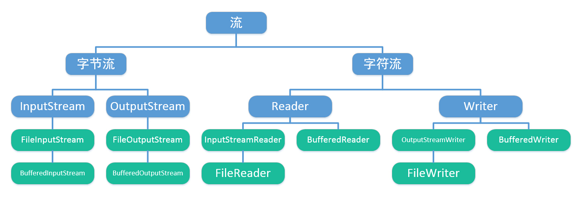
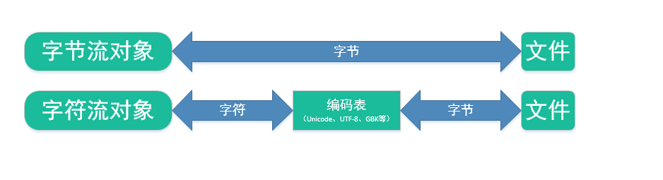
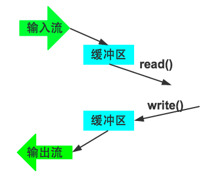
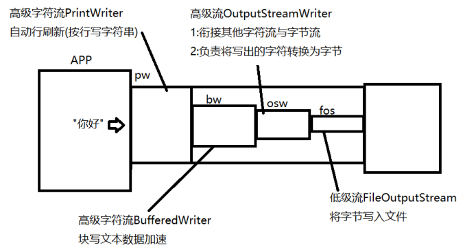

# IO
[[TOC]]

## 文件

Java 使用 File 类来直接处理文件和文件系统。File 类没有指定信息怎样从文件读取或向文件存储；它描述了文件本身的属性。File 对象用来获取或处理与磁盘文件相关的信息，例如权限，时间，日期和目录路径。此外，File 还浏览子目录层次结构。Java 中的目录当成 File 对待，它具有附加的属性——一个可以被 `list()` 方法检测的文件名列表。

File类的每一个实例可以表示硬盘(文件系统)中的一个文件或目录(实际上表示的是一个抽象路径)

使用File可以做到:

- 1:访问其表示的文件或目录的属性信息,例如:名字,大小,修改时间等等
- 2:创建和删除文件或目录
- 3:访问一个目录中的子项

但是File不能访问文件数据.

```Java
package file;

import java.io.File;

public class FileDemo {
    public static void main(String[] args) {
        File file = new File("./demo.txt");
        //获取名字
        String name = file.getName();
        System.out.println(name);
        //获取文件长度，单位是字节
        long len = file.length();
        System.out.println(len+"字符");
        //是否是隐藏的
        boolean isHidden = file.isHidden();
        System.out.println("是否隐藏:"+isHidden);
        //是否可读
        boolean cr = file.canRead();
        //是否可写
        boolean cw = file.canWrite();
        System.out.println("是否可读:"+cr);
        System.out.println("是否可写:"+cw);
    }
}
```


```java
public class FileDemo {
    public static void main(String[] args) {
        //使用File访问当前项目目录下的demo.txt文件
        /*
            创建File时要指定路径，而路径通常使用相对路径。
            相对路径的好处在于有良好的跨平台性。
            "./"是相对路径中使用最多的，表示"当前目录"，而当前目录是哪里
            取决于程序运行环境而定，在idea中运行java程序时，这里指定的
            当前目录就是当前程序所在的项目目录。
         */
//        File file = new File("c:/xxx/xxx/xx/xxx.txt");
        File file = new File("./demo.txt");
        //获取名字
        String name = file.getName();
        System.out.println(name);
        //获取文件大小(单位是字节)
        long len = file.length();
        System.out.println(len+"字节");
        //是否可读可写
        boolean cr = file.canRead();
        boolean cw = file.canWrite();
        System.out.println("是否可读:"+cr);
        System.out.println("是否可写:"+cw);
        //是否隐藏
        boolean ih = file.isHidden();
        System.out.println("是否隐藏:"+ih);

    }

}
```


### 构造方法

File 类提供了以下构造方法：

```java
//根据 parent 抽象路径名和 child 路径名字符串创建一个新 File 实例。
File(File parent, String child)

//通过将给定路径名字符串转换为抽象路径名来创建一个新 File 实例
File(String pathname)

// 根据 parent 路径名字符串和 child 路径名字符串创建一个新 File 实例
File(String parent, String child)

//通过将给定的 file: URI 转换为一个抽象路径名来创建一个新的 File 实例
File(URI uri)
```

### 使用示例

```java
//一个目录路径参数
File f1 = new File("/home/project/");

//对象有两个参数——路径和文件名
File f2 = new File("/home/project/","a.bat");

//指向f1文件的路径及文件名
File f3 = new File(f1,"a.bat");

//构造File对象时，既可以传入绝对路径，也可以传入相对路径。绝对路径(实际开发过程中用的很少,不利于跨平台)是以根目录开头的完整路径，注意Windows平台使用\作为路径分隔符，在Java字符串中需要用\\表示一个\。Linux平台使用/作为路径分隔符：
File f = new File("C:\\Windows\\notepad.exe");//Windows,y
File f = new File("/usr/bin/javac");//linux

//传入相对路径时，相对路径前面加上当前目录就是绝对路径,可以用.表示当前目录，..表示上级目录。
// 假设当前目录是C:\Docs
File f1 = new File("sub\\javac"); // 绝对路径是C:\Docs\sub\javac
File f3 = new File(".\\sub\\javac"); // 绝对路径是C:\Docs\sub\javac,对于IDEA而言,该目录是当前程序所在的项目目录Object
//"./"在相对路径中是可以忽略不写的,默认就是从"./"开始的
File f3 = new File("..\\sub\\javac"); // 绝对路径是C:\sub\javac
```

### 常用方法

来看看 File 的一些常用方法

| 方法                                                         | 说明                                                         |
| ------------------------------------------------------------ | ------------------------------------------------------------ |
| `boolean canExecute()`                                       | 测试应用程序是否可以执行此抽象路径名表示的文件               |
| `boolean canRead()`                                          | 测试应用程序是否可以读取此抽象路径名表示的文件               |
| `boolean canWrite()`                                         | 测试应用程序是否可以修改此抽象路径名表示的文件               |
| `int compareTo(File pathname)`                               | 按字母顺序比较两个抽象路径名                                 |
| `boolean createNewFile()`                                    | 当且仅当不存在具有此抽象路径名指定名称的文件时，不可分地创建一个新的空文件 |
| `static File createTempFile(String prefix, String suffix)`   | 在默认临时文件目录中创建一个空文件，使用给定前缀和后缀生成其名称 |
| `static File createTempFile(String prefix, String suffix, File directory)` | 在指定目录中创建一个新的空文件，使用给定的前缀和后缀字符串生成其名称 |
| `boolean delete()`                                           | 删除此抽象路径名表示的文件或目录                             |
| `void deleteOnExit()`                                        | 在虚拟机终止时，请求删除此抽象路径名表示的文件或目录         |
| `boolean equals(Object obj)`                                 | 测试此抽象路径名与给定对象是否相等                           |
| `boolean exists()`                                           | 测试此抽象路径名表示的文件或目录是否存在                     |
| `File getAbsoluteFile()`                                     | 返回此抽象路径名的绝对路径名形式                             |
| `String getAbsolutePath()`                                   | 返回此抽象路径名的绝对路径名字符串                           |
| `File getCanonicalFile()`                                    | 返回此抽象路径名的规范形式                                   |
| `String getCanonicalPath()`                                  | 返回此抽象路径名的规范路径名字符串                           |
| `long getFreeSpace()`                                        | 返回此抽象路径名指定的分区中未分配的字节数                   |
| `String getName()`                                           | **返回由此抽象路径名表示的文件或目录的名称**                 |
| `String getParent()`                                         | 返回此抽象路径名父目录的路径名字符串；如果此路径名没有指定父目录，则返回 null |
| `File getParentFile()`                                       | 返回此抽象路径名父目录的抽象路径名；如果此路径名没有指定父目录，则返回 null |
| `String getPath()`                                           | 将此抽象路径名转换为一个路径名字符串                         |
| `long getTotalSpace()`                                       | 返回此抽象路径名指定的分区大小                               |
| `long getUsableSpace()`                                      | 返回此抽象路径名指定的分区上可用于此虚拟机的字节数           |
| `int hashCode()`                                             | 计算此抽象路径名的哈希码                                     |
| `boolean isAbsolute()`                                       | 测试此抽象路径名是否为绝对路径名                             |
| `boolean isDirectory()`                                      | 测试此抽象路径名表示的文件是否是一个目录                     |
| `boolean isFile()`                                           | 测试此抽象路径名表示的文件是否是一个标准文件                 |
| `boolean isHidden()`                                         | **测试此抽象路径名指定的文件是否是一个隐藏文件**             |
| `long lastModified()`                                        | 返回此抽象路径名表示的文件最后一次被修改的时间               |
| `long length()`                                              | **返回由此抽象路径名表示的文件的长度**                       |
| `String[] list()`                                            | 返回一个字符串数组，这些字符串指定此抽象路径名表示的目录中的文件和目录 |
| `String[] list(FilenameFilter filter)`                       | 返回一个字符串数组，这些字符串指定此抽象路径名表示的目录中满足指定过滤器的文件和目录 |
| `File[] listFiles()`                                         | 返回一个抽象路径名数组，这些路径名表示此抽象路径名表示的目录中的文件 |
| `File[] listFiles(FileFilter filter)`                        | 返回抽象路径名数组，这些路径名表示此抽象路径名表示的目录中满足指定过滤器的文件和目录 |
| `File[] listFiles(FilenameFilter filter)`                    | 返回抽象路径名数组，这些路径名表示此抽象路径名表示的目录中满足指定过滤器的文件和目录 |
| `static File[] listRoots()`                                  | 列出可用的文件系统根                                         |
| `boolean mkdir()`                                            | 创建此抽象路径名指定的目录                                   |
| `boolean mkdirs()`                                           | 创建此抽象路径名指定的目录，包括所有必需但不存在的父目录     |
| `boolean renameTo(File dest)`                                | 重新命名此抽象路径名表示的文件                               |
| `boolean setExecutable(boolean executable)`                  | 设置此抽象路径名所有者执行权限的一个便捷方法                 |
| `boolean setExecutable(boolean executable, boolean ownerOnly)` | 设置此抽象路径名的所有者或所有用户的执行权限                 |
| `boolean setLastModified(long time)`                         | 设置此抽象路径名指定的文件或目录的最后一次修改时间           |
| `boolean setReadable(boolean readable)`                      | 设置此抽象路径名所有者读权限的一个便捷方法                   |
| `boolean setReadable(boolean readable, boolean ownerOnly)`   | 设置此抽象路径名的所有者或所有用户的读权限                   |
| `boolean setReadOnly()`                                      | 标记此抽象路径名指定的文件或目录，从而只能对其进行读操作     |
| `boolean setWritable(boolean writable)`                      | 设置此抽象路径名所有者写权限的一个便捷方法                   |
| `boolean setWritable(boolean writable, boolean ownerOnly)`   | 设置此抽象路径名的所有者或所有用户的写权限                   |
| `String toString()`                                          | 返回此抽象路径名的路径名字符串                               |
| `URI toURI()`                                                | 构造一个表示此抽象路径名的 file: URI                         |

### 编程实例

```java
import java.io.File;
import java.io.IOException;

public class  FileDemo {
    public static void main(String[] args){
        //同学们可以根据自己的路径进行更改
        File f1 =new
        File("/home/project/1.txt");
        //File(String parent,String child)
        File f2 =new File("/home/project","2.txt");
        //separator 跨平台分隔符
        File f3 =new File("/home"+File.separator+"project");
        File f4 =new File(f3,"3.txt");

        try {
             System.out.println(f1);
                //当文件存在时返回 false；不存在时返回 true
                System.out.println(f2.createNewFile());
                //当文件不存在时返回 false
                System.out.println(f3.delete());
        }catch(IOException e) {
                e.printStackTrace();
        }

        //列出磁盘下的文件和文件夹
        File[] files =File.listRoots();
        for(File file:files){
            System.out.println(file);
            if(file.length()>0){
                String[] filenames =file.list();
                for(String filename:filenames){
                    System.out.println(filename);
                }
            }
        }
    }

}
```


## 文件属性

Java 使用 File 类表示文件或者目录，可以通过 File 类获取文件或者目录的相关属性。

```java
import java.io.File;
import java.util.Arrays;

public class FileInfo {
    public static void main(String[] args) {
        File file = new File("/home/project");
        System.out.println("文件或者目录名：" + file.getName());
        System.out.println("绝对路径：" + file.getAbsolutePath());
        System.out.println("父目录：" + file.getParent());
        System.out.println("文件路径：" + file.getPath());
        //判断文件是否是目录
        if (file.isDirectory()) {
            //打印目录中的文件
            Arrays.stream(file.list()).forEach(System.out::println);
        }
        System.out.println("是否隐藏：" + file.isHidden());
        System.out.println("是否存在：" + file.exists());
    }
}
```


## 文件操作

### 创建


createNewFile方法，可以创建一个新文件

```java
package file;

import java.io.File;
import java.io.IOException;

/**
 * 使用File创建一个新文件
 */
public class CreateNewFileDemo {
    public static void main(String[] args) throws IOException {
        //在当前目录下新建一个文件:test.txt
        File file = new File("./test.txt");
        //boolean exists()判断当前File表示的位置是否已经实际存在该文件或目录
        if(file.exists()){
            System.out.println("该文件已存在!");
        }else{
            file.createNewFile();//将File表示的文件创建出来
            System.out.println("文件已创建!");
        }

    }
}
```

### 拷贝

可以使用 Files 工具类的 `copy(Path source,Path target,CopyOption... options)` 拷贝文件或者目录。如果目标文件存在，那么复制将失败，除非我们在 `options` 中指定了 `REPLACE_EXISTING` 属性。当该命令复制目录时，如果目录中已经有了文件，目录中的文件将不会被复制。`CopyOption` 参数支持以下 `StandardCopyOption` 和 `LinkOption` 枚举：

- `REPLACE_EXISTING`：即使目标文件已存在，也执行复制。如果目标是符号链接，则复制链接本身（而不是链接的目标）。如果目标是非空目录，则复制将失败并显示 `FileAlreadyExistsException` 异常。
- `COPY_ATTRIBUTES`：将与文件关联的文件属性复制到目标文件。支持的确切 - 文件属性是文件系统和平台相关的，但 last-modified-time 跨平台支持并复制到目标文件。
- `NOFOLLOW_LINKS`：表示不应遵循符号链接。如果要复制的文件是符号链接，则复制链接（而不是链接的目标）。

```java
import java.io.IOException;
import java.nio.file.Files;
import java.nio.file.Paths;
import java.nio.file.StandardCopyOption;

public class CopyDemo {
    public static void main(String[] args) {
        try {
            //被拷贝的文件一定要存在 否则会抛出异常  这里的1.txt一定要存在
            Files.copy(Paths.get("/home/project/1.txt"), Paths.get("/home/project/2.txt"), StandardCopyOption.REPLACE_EXISTING);
        } catch (IOException e) {
            e.printStackTrace();
        }
    }
}
```


### 移动和重名

Files 类的 `move(Path, Path, CopyOption... options)` 方法移动文件或者目录，同样目标目录存在，那么比如使用`REPLACE_EXISTING`。 `options` 参数支持 `StandardCopyOption` 的以下枚举：

- `REPLACE_EXISTING`：即使目标文件已存在，也执行移动。如果目标是符号链接，则替换符号链接，但它指向的内容不受影响。
- `ATOMIC_MOVE`：将移动作为原子文件操作执行。如果文件系统不支持原子移动，则抛出异常。使用，`ATOMIC_MOVE` 您可以将文件移动到目录中，并保证观察目录的任何进程都可以访问完整的文件。

move 方法除了可以移动之外，也可以用与重命名。

```java
import java.io.IOException;
import java.nio.file.Files;
import java.nio.file.Paths;
import java.nio.file.StandardCopyOption;

public class MoveDemo {
    public static void main(String[] args) {
        try {
            //将1.txt 重命名为3.txt 如果只需要移动到不同的目录，文件名不变即可
            Files.move(Paths.get("/home/project/1.txt"), Paths.get("/home/project/3.txt"), StandardCopyOption.REPLACE_EXISTING);
        //将2.txt 重命名为4.txt 如果只需要移动到不同的目录，文件名不变即可
        Files.move(Paths.get("/home/project/2.txt"), Paths.get("/home/project/4.txt"), StandardCopyOption.REPLACE_EXISTING);

        } catch (IOException e) {
            e.printStackTrace();
        }

    }
}
```


### 删除

可以通过 Files 的 `delete(Path path)` 方法或者 `deleteIfExists(Path path)` 方法删除文件。

```java
import java.io.File;
import java.io.IOException;
import java.nio.file.Files;
import java.nio.file.Paths;

public class DeleteDemo {
    public static void main(String[] args) {
        try {
            //删除文件，文件必须存在，否则抛出异常
            Files.delete(Paths.get("/home/project/3.txt"));
            //删除文件，返回是否删除成功 即使文件不存在，也不会保存，直接返回false
            System.out.println(Files.deleteIfExists(Paths.get("/home/project/3.txt")));
            //或者使用File类的delete方法
            File file = new File("/home/project/4.txt");
            System.out.println(file.delete());
        } catch (IOException e) {
            e.printStackTrace();
        }
    }
}
```

```Java
package file;

import java.io.File;

/**
 * 使用File删除一个文件
 */
public class DeleteFileDemo {
    public static void main(String[] args) {
        //将当前目录下的test.txt文件删除
        /*
            相对路径中"./"可以忽略不写，默认就是从当前目录开始的。
         */
        File file = new File("test.txt");
        if(file.exists()){
            file.delete();
            System.out.println("文件已删除!");//回收站里没有
        }else{
            System.out.println("文件不存在!");
        }
    }
}
```


## 目录

### 创建

mkDir():创建当前File表示的目录

mkDirs():创建当前File表示的目录，同时将所有不存在的父目录一同创建

注:mkDir是linux中的一条命令,就是make directory的简写,意思是创建目录

```java
package file;

import java.io.File;

/**
 * 使用File创建目录
 */
public class MkDirDemo {
    public static void main(String[] args) {
        //在当前目录下新建一个目录:demo
//        File dir = new File("demo");

        //在当前目录下新建目录:a/b/c/d/e/f
        File dir = new File("a/b/c/d/e/f");
        if(dir.exists()){
            System.out.println("该目录已存在！");
        }else{
//            dir.mkdir();//如果所在的父目录不存在则创建失败!
            dir.mkdirs();//会将所有不存在的父目录一同创建出来(推荐使用该方法)
            System.out.println("该目录已创建!");
        }
    }
}
```

### 删除

delete()方法可以删除一个目录，但是只能删除空目录。

```java
package file;

import java.io.File;

/**
 * 删除一个目录
 */
public class DeleteDirDemo {
    public static void main(String[] args) {
        //将当前目录下的demo目录删除
        File dir = new File("./demo");
        if(dir.exists()){
            dir.delete();//删除目录时只能删除空目录!
            System.out.println("目录已删除!");
        }else{
            System.out.println("目录不存在!");
        }
    }
}
```


### 读取

#### 访问一个目录中的所有子项


Java 中读取目录中的文件可以直接使用 `listFiles()` 方法读取，但是也只能读取当前目录中的文件，如果当前目录中还有二级目录如何解决呢？三级目录呢？接下来将使用 Java 读取当前目录和子目录中的所有文件。

```java
import java.io.File;
public class ReadDir {
    public static void main(String[] args) {
        readDir(new File("/home"));
    }

    static void readDir(File file) {
        if (file == null) {
            return;
        }
        //如果当前file是目录
        if (file.isDirectory()) {
            File[] files;
            //如果目录不为空
            if ((files = file.listFiles()) != null) {
                for (File file1 : files) {
                    //递归读取目录内容
                    readDir(file1);
                }
            }
        } else {
            //如果不是目录 直接输出文件名
            System.out.println(file.getName());
        }
    }
}
```

```java
package file;

import java.io.File;

/**
 * 访问一个目录中的所有子项
 */
public class ListFilesDemo1 {
    public static void main(String[] args) {
        //获取当前目录中的所有子项
        File dir = new File(".");
        /*
            boolean isFile()
            判断当前File表示的是否为一个文件
            boolean isDirectory()
            判断当前File表示的是否为一个目录
         */
        if(dir.isDirectory()){
            /*
                File[] listFiles()
                将当前目录中的所有子项返回。返回的数组中每个File实例表示其中的一个子项
             */
            File[] subs = dir.listFiles();
            System.out.println("当前目录包含"+subs.length+"个子项");
            for(int i=0;i<subs.length;i++){
                File sub = subs[i];
                System.out.println(sub.getName());
            }
        }


    }
}
```

#### 获取目录中符合特定条件的子项

重载的`listFiles`方法:`File[] listFiles(FileFilter)`

该方法要求传入一个文件过滤器，并仅将满足该过滤器要求的子项返回。

```java
package file;

import java.io.File;
import java.io.FileFilter;

/**
 * 重载的listFiles方法可以传入一个文件过滤器，然后只将该目录中符合过滤器要求的子项返回。
 */
public class ListFilesDemo2 {
    public static void main(String[] args) {
        //获取当前目录中所有名字以"."开始的子项
        File dir = new File(".");
        if(dir.isDirectory()){
            FileFilter filter = new FileFilter() {
                /*
                    实现文件过滤器接口时，必须重写方法accept。这个方法就是过滤方法
                    将参数file看作是要过滤的子项，当该子项符合过滤要求需要保留时则
                    accept方法应当返回true，否则返回false
                 */
                public boolean accept(File file) {
                    String name = file.getName();//获取要过滤的该项内容的名字
                    System.out.println("正在过滤子项:"+name);
                    return name.startsWith(".");//名字是否是以"."开始的
                    //return name.contains("o");//名字中是否包含o
                }
            };
            File[] subs = dir.listFiles(filter);
            System.out.println("当前目录中满足条件的子项有:"+subs.length+"个");
            for(int i=0;i<subs.length;i++){
                File sub = subs[i];
                System.out.println(sub.getName());
            }
        }
    }
}
```


### 练习题:目录树

在 `/home/project/` 目录下新建源代码文件 `PrintDirTree.java`，你需要完成以下需求：

- 任意建立一个至少三层的目录。
- 打印该目录以目录树的形式，就像这样：

```txt
src
   main
       java
           a.java
           b.java
           c.java
        resources
    test
        java
            d.java
            e.java
```

提示：

- 使用递归

```java
import java.io.File;
import java.io.IOException;

public class PrintDirTree {

    public static void main(String[] args) {
        printDirTree(new File("/home/"), "");
    }

    public static void printDirTree(File file, String s) {
        if (file.isDirectory()) {
            File[] files;
            System.out.println(s + file.getName());
            if ((files = file.listFiles()) != null) {
                s = s + "   ";
                for (File file1 : files) {
                    printDirTree(file1, s);
                }
            }
        } else {
            System.out.println(s + file.getName());
        }
    }
}
```


## 文件流

`java.io` 包中提供了文件操作类：

1. 用于读写本地文件系统中的文件：`FileInputStream` 和 `FileOutputStream`

   > 文件流是一对低级流,用于读写文件数据的流.用于连接程序与文件(硬盘)的"管道".负责读写文件数据.

2. 描述本地文件系统中的文件或目录：`File`、`FileDescriptor` 和 `FilenameFilter`

3. 提供对本地文件系统中文件的随机访问支持:`RandomAccessFile`

接下来将学习文件流的 `FileInputStream` 和 `FileOutputStream` 。

`FileInputStream` 类用于打开一个输入文件，若要打开的文件不存在，则会产生异常 `FileNotFoundException`，这是一个非运行时异常，必须捕获或声明抛弃；

在进行文件的读 / 写操作时，会产生非运行时异常 `IOException`，必须捕获或声明抛弃（其他的输入 / 输出流处理时也同样需要进行输入 / 输出异常处理）。

### 文件流的构造方法

```java
//打开一个以 f 描述的文件作为输入
FileInputStream(File f)

//打开一个文件路径名为 name 的文件作为输入
FileInputStream(String name)

//创建一个以 f 描述的文件作为输出
//如果文件存在，则其内容被清空
FileOutputStream(File f)

//创建一个文件路径名为 name 的文件作为输出
//文件如果已经存在，则其内容被清空
FileOutputStream(String name)

//创建一个文件路径名为 name 的文件作为输出
//文件如果已经存在，则在该输出上输出的内容被接到原有内容之后
FileOutputStream(String name, boolean append)
```

### 代码示例

```java
File f1 = new File("file1.txt");
File f2 = new File("file2.txt");
FileInputStream in = new FileInputStream(f1);
FileOutputStream out = new FileOutputStream(f2);
```

输入流的参数是用于指定输入的文件名，输出流的参数则是用于指定输出的文件名。

#### 文件输出流:java.io.FileOutputStream

```java
package io;

import java.io.*;

public class FOSDemo {
    public static void main(String[] args) throws IOException {
        /*
            构造方法:
            FileOutputStream(File file)
            FileOutputStream(String path)
            以上两种方式创建的文件流是覆盖模式,即:在创建文件流时若指定的文件已经存在
            则会将该文件原有的内容抹除.之后通过当前流写出的内容都会保留在文件中.

            FileOutputStream(File file,boolean append)
            FileOutputStream(String path,boolean append)
            文件流有重载的构造方法,允许我们传入一个boolean参数,该值如果为true,则
            文件流创建时是追加模式.即:创建文件流时若指定文件存在,则原内容全部保留,
            通过当前流写入的新内容都会被顺序追加到文件中.
         */
//        FileOutputStream fos = new FileOutputStream("fos.txt");
        FileOutputStream fos = new FileOutputStream("fos.txt",true);
//        String line = "和我在成都的街头走一走,哦哦哦哦~";
//        byte[] data = line.getBytes("UTF-8");
//        fos.write(data);
//        line = "直到所有的灯都熄灭了也不停留.";
//        fos.write(line.getBytes("UTF-8"));

        fos.write("我会把手揣进裤兜".getBytes("UTF-8"));
        System.out.println("写出完毕!");
        fos.close();
    }
}
```

#### 文件输入流:java.io.FileInputStream

```java
package io;

import java.io.FileInputStream;
import java.io.FileNotFoundException;
import java.io.IOException;

/**
 * 文件输入流,用于从文件中读取字节
 */
public class FISDemo {
    public static void main(String[] args) throws IOException {
        FileInputStream fis = new FileInputStream("fos.txt");
//        byte[] data = new byte[fis.available()];
        byte[] data = new byte[1024*10];//指定一个够大的字节数组10KB
        int len = fis.read(data);//一次性读1000字节,返回值为实际读取到的字节量
        System.out.println("实际读取到了:"+len+"个字节");
         /*
            String(byte[] data,int offset,int len,String csn)
            重载的String构造器,可以将给定的字节数组从offset指定的位置开始的连续len
            个字节按照指定的字符集转换为字符串
            csn:charset name 字符集名字
         */
        String line = new String(data,0,len,"UTF-8");//转成字符串
        System.out.println(line);
        System.out.println(line.length());
        fis.close();

    }
}
```

#### 使用文件流完成文件的复制操作

```java
public class Test1 {
    public static void main(String[] args) throws IOException {
        FileInputStream fis = new FileInputStream("image.gif");
        FileOutputStream fos = new FileOutputStream("image_cp3.gif");

        int len;//记录每次实际读取到的字节数
        byte[] data = new byte[1024*10];//10KB
        while((len = fis.read(data)) != -1){
            fos.write(data,0,len);
        }
        System.out.println("复制完毕!");
        fis.close();
        fos.close();


    }
}
```


#### 编程实战

使用输入流和输出将 `file1.txt` 的内容复制到 `file2.txt`。

```java
import java.io.File;
import java.io.FileInputStream;
import java.io.FileNotFoundException;
import java.io.FileOutputStream;
import java.io.IOException;

public class Test {

    public static void main(String[] args) {
        try {
            //inFile 作为输入流的数据文件必须存在，否则抛出异常
            File inFile = new File("/home/project/file1.txt");

            //file2.txt没有，系统可以创建
            File outFile = new File("file2.txt");
            FileInputStream fis = new FileInputStream(inFile);
            FileOutputStream fos = new FileOutputStream(outFile);
            int c;
            while((c = fis.read()) != -1){
                fos.write(c);
            }
            //打开了文件一定要记着关，释放系统资源
            fis.close();
            fos.close();
        }catch(FileNotFoundException e) {
            System.out.println("FileStreamsTest:" + e);
        }catch(IOException e){
            System.err.println("FileStreamTest:" + e);
        }
    }
}
```

### `FileReader`

如果文件内容保存的是字符信息，如 `txt` 文件等，还可以使用 `FileReader` 来读取文件内容。

**代码示例：**

```java
FileReader file = new FileReader("/home/project/shiyanlou.txt");
//声明一个文件输入流file，并指明该文件在系统中的路径以方便定位

int data = 0;
//声明一个整型变量用于存放读取的数据

while((data=file.read())!=-1){
    //在while循环中使用read()方法持续读取file，数据赋到data中
    //如果读取失败或者结束，则将返回-1，这个特殊的返回值可以作为读取结束的标识

    System.out.print((char)data);
    //输出读取到数据
}

file.close();
//一定要记得读取结束后要关闭文件
```


### 随机读写

对于 `FileInputStream`/`FileOutputStream`、`FileReader`/`FileWriter` 来说，它们的实例都是顺序访问流，即只能进行顺序读 / 写。而类 `RandomAccessFile` 则允许文件内容同时完成读和写操作，它直接继承 Object，并且同时实现了接口 `DataInput` 和 `DataOutput`。

随机访问文件的行为类似存储在文件系统中的一个大型 `byte` 数组。存在指向该隐含数组的光标或索引，称为文件指针；输入操作从文件指针开始读取字节，并随着对字节的读取而前移此文件指针。如果随机访问文件以读取 / 写入模式创建，则输出操作也可用；输出操作从文件指针开始写入字节，并随着对字节的写入而前移此文件指针。

`RandomAccessFile` 提供了支持随机文件操作的方法：

1. `readXXX()` 或者 `writeXXX()`: 如 `readInt()`, `readLine()`, `writeChar()`, `writeDouble()` 等。
2. `int skipBytes(int n)`: 将指针向下移动若干字节。
3. `int length()`: 返回文件长度。
4. `long getFilePointer()`: 返回指针当前位置。
5. `void seek(long pos)`: 将指针调用所需位置。

在生成一个随机文件对象时，除了要指明文件对象和文件名之外，还需要指明访问文件的模式。

来看看 `RandomAccessFile` 的构造方法：

```java
RandomAccessFile(File file,String mode)
RandomAccessFile(String name,String mode)
```

mode 的取值：

- `r`: 只读，任何写操作都将抛出 `IOException` 。
- `rw`: 读写，文件不存在时会创建该文件，文件存在是，原文件内容不变，通过写操作改变文件内容。
- `rws`: 打开以便读取和写入，对于 `"rw"`，还要求对文件的内容或元数据的每个更新都同步写入到底层存储设备。
- `rwd`: 打开以便读取和写入，对于 `"rw"`，还要求对文件内容的每个更新都同步写入到底层存储设备。

#### void write(int d)方法,向文件中写入1个字节

```java
package raf;

import java.io.File;
import java.io.FileNotFoundException;
import java.io.IOException;
import java.io.RandomAccessFile;

/**
 *         随机  访问   文件
 * java.io.RandomAccessFile
 * RAF是专门用来读写文件的API,其基于指针对文件任意位置进行读写操作,因此读写方式灵活.
 */
public class RAFDemo1 {
    public static void main(String[] args) throws IOException {
        /*
            常用构造器
            RandomAccessFile(File file,String mode)
            RandomAccessFile(String fileName,String mode)
            第一个参数为要操作的文件,第二个参数为操作模式
            操作模式是一个字符串,支持两个值:
            "r":只读模式,仅对文件做读取操作.  r:read读
            "rw":读写模式,对文件即可读又可写. w:write写

            RAF在创建时,若指定的文件不存在,则根据操作模式不同,结果不同.
            如果指定的是rw模式,则会将该文件创建出来.
            如果指定的是r模式,则会抛出异常FileNotFoundException,告知该文件不存在!
         */
        //想对当前目录下的raf.dat文件进行操作
//        File file = new File("./raf.dat");
//        RandomAccessFile raf = new RandomAccessFile(file,"rw");

        RandomAccessFile raf = new RandomAccessFile("./raf.dat","rw");

        /*
            void write(int d)
            向文件中写入一个字节,写入的是给定的int值所对应的2进制的"低八位"
            int:1
                                            vvvvvvvv
            2进制:00000000 00000000 00000000 00000001
         */
        raf.write(1);
        raf.write(2);//00000000 00000000 00000000 00000010
        /*
            写入操作执行完毕后,raf.dat文件内容
            00000001 00000010
         */
        System.out.println("执行完毕!");
        raf.close();//当使用RAF读写完毕后,最终要调用close方法释放资源.
    }
}

```


#### int read()方法,从文件中读取一个字节并以int型返回,该int值低八位是读取的字节内容,前面为24个0.如果返回值为-1则表示文件末尾.

```java
package raf;

import java.io.FileNotFoundException;
import java.io.IOException;
import java.io.RandomAccessFile;

/**
 * 从文件中读取数据
 */
public class RAFDemo2 {
    public static void main(String[] args) throws IOException {
        //从当前目录下的raf.dat文件中读取字节
        RandomAccessFile raf = new RandomAccessFile("./raf.dat","r");
        /*
            int read()
            从文件中读取1个字节,返回值值为int型,该int值对应的2进制的"低八位"就是本次
            读取出来的字节内容.如果返回的int值是-1则表示读取到了文件的末尾(EOF)
            EOF:end of file 文件末尾
         */
        /*
            raf.dat文件内容
            00000001 00000010
         */
        //读取的数据在返回的int值对应2进制的最低八位,前面会自动补24个0.
        int d = raf.read();//00000000 00000000 00000000 00000001
        System.out.println(d);//1

        d = raf.read();//00000000 00000000 00000000 00000010
        System.out.println(d);//2

        d = raf.read();//11111111 11111111 11111111 11111111
        System.out.println(d);//-1 表示已经是文件末尾了!

        raf.close();
    }
}
```


#### 文件复制

利用RandomAccessFile的读写操作,完成文件的复制.

```java
package raf;

import java.io.FileNotFoundException;
import java.io.IOException;
import java.io.RandomAccessFile;

/**
 * 文件复制
 */
public class CopyDemo {
    public static void main(String[] args) throws IOException {
        RandomAccessFile src = new RandomAccessFile("./image.gif","r");
        RandomAccessFile desc = new RandomAccessFile("./image_cp.gif","rw");
        /*
           以读写第一个字节为例
           原文件内容
           10011010 00101101 00111101 10100010 10010101.....
           ^^^^^^^^
           d = src.read()后,d的值如下
           int d:00000000 00000000 00000000 10011010

           desc.write(d)后,复制文件内容如下
           复制文件
           10011010
         */

        int d;
        while( (d = src.read()) != -1 ) {
            desc.write(d);
        }

        System.out.println("复制完毕!");
        src.close();
        desc.close();
    }
}
```

#### 块读写形式复制文件

通过提高每次读写的数据量,减少实际读写的次数可以提高读写效率

单字节读写数据是随机读写,而一组字节一组字节的读写数据则是块读写.

```java
package raf;

import java.io.FileNotFoundException;
import java.io.IOException;
import java.io.RandomAccessFile;

/**
 * 通过提高每次读写的数据量,减少实际读写的次数可以提高读写效率
 */
public class CopyDemo2 {
    public static void main(String[] args) throws IOException {
        RandomAccessFile src = new RandomAccessFile("image.gif","r");
        RandomAccessFile desc = new RandomAccessFile("image_cp2.gif","rw");
        /*
            RandomAccessFile提供了块读写的方法
            读:
            int read(byte[] data)
            一次性从文件中读取给定的字节数组总长度的字节量并装入到该数组中,返回值表示实际读取
            到的字节量.如果返回值为-1则表示EOF.

            例如
            文件数据(总共6个字节):
            11011101 10101101 00110011 11010010 11001101 00111101

            块读:
            byte数组:  byte[] data = new byte[10];  创建能保存10个字节的数组
            int len=0; 表示每次实际读取到的字节量

            读取前
            data:[00000000,00000000,00000000,00000000]
            len:0

            len = src.read(data);//一次性从文件中读取4个字节并存入该数组
            读取后:
            data:[11011101,10101101,00110011,11010010]
            len:4


            块写操作
            void write(byte[] data)
            一次性将给定的字节数组中的所有字节写入文件

            void write(byte[] data,int offset,int len)
            一次性将给定的字节数组中从下标offset处开始的连续len个字节写入文件

            例如:
            data:[11011101,10101101,00110011,11010010]

            desc.write(data);
            复制的文件内容:
            11011101 10101101 00110011 11010010
         */
        /*
            8位2进制:00000000  1byte  1字节
            1024byte  1kb
            1024kb    1mb
            1024mb    1gb
            1024gb    1tb
         */
        byte[] data = new byte[1024*10];//10kb
        int len = 0;//记录每次实际读取到的字节量

        long start = System.currentTimeMillis();//获取当前系统时间的毫秒值
        //从原文件中一次读取10kb数据存入data中
        while((len = src.read(data)) != -1) {
            desc.write(data,0,len);//将本次读取的数据一次性写入到复制文件中
        }
        long end = System.currentTimeMillis();
        System.out.println("复制完毕!耗时:"+(end-start)+"ms");
        src.close();
        desc.close();
    }
}


```

#### 读写文本数据

##### 向文件中写入文本

String提供了将字符串转换为字节的方法:`byte[] getBytes()`.通过它可以将转换的字节写入文件.

```java
package raf;

import java.io.FileNotFoundException;
import java.io.IOException;
import java.io.RandomAccessFile;
import java.io.UnsupportedEncodingException;
import java.nio.charset.StandardCharsets;

/**
 * 向文件中写入文本数据
 */
public class WriteStringDemo {
    public static void main(String[] args) throws IOException {
        RandomAccessFile raf = new RandomAccessFile("raf.txt","rw");
        String line = "让我在看你一遍,从南到北.";
        /*
            常见字符集名字:
            utf-8:万国码(对应的就是unicode),其中英文数字符号为单字节(asc),中文占3字节
            gbk:国标编码,其中英文数字符号占单字节(asc),中文占2字节
            iso8859-1:欧洲字符集,不支持中文.
         */
//        line.getBytes(StandardCharsets.UTF_8);
        //当指定的字符集名字拼写错误时会抛出:UnsupportedEncodingException
        byte[] data = line.getBytes("UTF-8");//字符集名字大小写无所谓
        raf.write(data);
        line = "像是北五环路蒙住的双眼.";
        raf.write(line.getBytes("UTF-8"));
        System.out.println("写出完毕!");
        raf.close();


    }
}
```

##### 从文件中读取文本数据

String提供了将字节数组转换为字符串的方法,通过它可以将文件中读取的字节直接还原为字符串.

```java
package raf;

import java.io.FileNotFoundException;
import java.io.IOException;
import java.io.RandomAccessFile;

/**
 * 从文件中读取文本数据
 */
public class ReadStringDemo {
    public static void main(String[] args) throws IOException {
        RandomAccessFile raf = new RandomAccessFile("raf.txt","r");
        long len = raf.length();//通过RAF获取其操作的文件的长度(单位是字节)
        //一次性将文件中所有的字节都读取回来
        byte[] data = new byte[(int)len];
        raf.read(data);//将数据读取到数组中
        //将字节数组还原为字符串,使用String的构造方法
        String line = new String(data,"UTF-8");
        System.out.println(line);

        raf.close();

    }
}
```

##### 读写基本类型数据以及指针的操作

RAF是基于指针对文件任意位置进行读写的,创建RAF后指针默认在文件最开始,每当我们读或写一个字节后,指针就会自动移动到文件的下一个字节的位置准备读写操作.

```java
package raf;

import java.io.FileNotFoundException;
import java.io.IOException;
import java.io.RandomAccessFile;

/**
 *  读写基本类型数据,以及RAF的指针操作
 */
public class RAFDemo3 {
    public static void main(String[] args) throws IOException {
        RandomAccessFile raf = new RandomAccessFile("raf.dat","rw");
        /*
            long getFilePointer()
            获取当前RAF的指针位置.
         */
        System.out.println("pos:"+raf.getFilePointer());//0

        //将一个int值写入文件中
        int i = Integer.MAX_VALUE;
        /*
            i的2进制:
            01111111 11111111 11111111 11111111
               1        2        3         4

            i>>>24                     vvvvvvvv
            00000000 00000000 00000000 01111111
            i>>>16
            00000000 00000000 01111111 11111111
            i>>>8
            00000000 01111111 11111111 11111111
            i
            01111111 11111111 11111111 11111111
         */
        raf.write(i>>>24);
        System.out.println("pos:"+raf.getFilePointer());//1
        raf.write(i>>>16);
        raf.write(i>>>8);
        raf.write(i);
        System.out.println("pos:"+raf.getFilePointer());//4
        /*
            RAF提供了方便写出基本类型的相关方法
         */
        raf.writeInt(i);//连续写4字节,将int对应的2进制写入文件,等同上面4句
        System.out.println("pos:"+raf.getFilePointer());//8
        raf.writeDouble(123.123);
        System.out.println("pos:"+raf.getFilePointer());//16
        raf.writeLong(123L);
        System.out.println("pos:"+raf.getFilePointer());//24
        System.out.println("写出完毕!");

        /*
            void seek(long pos)
            移动指针到指定位置
         */
        raf.seek(0);//移动指针到文件最开始(第一个字节的位置)
        System.out.println("pos:"+raf.getFilePointer());//0
        /*
            RAF提供了方便读取基本类型的相关方法
            int readInt() 连续读取4个字节返回对应的int值
         */
        int d = raf.readInt();
        System.out.println(d);
        System.out.println("pos:"+raf.getFilePointer());//4

        //读取后面的double值
        //1先将指针移动到double的第一个字节的位置
        raf.seek(8);
        //2连续读取8字节还原double值
        double dou = raf.readDouble();
        System.out.println(dou);
        long l = raf.readLong();
        System.out.println(l);
        /*
            注意,这些读取基本类型的方法内部都是连续读取若干字符然后还原对应的基本类型
            只要他们在连续读取字节的过程中到了文件末尾,而读取的字节数量还不足时就会抛出
            EOFException,告知读取过程中到了文件末尾,并不会用返回-1表示文件末尾!
         */
//        System.out.println(raf.readInt());

        //将double值改成234.234
        //1先将指针移动到double的第一个字节位置
        raf.seek(8);
        //2重写写入一个double值覆盖原来double的8个字节
        raf.writeDouble(234.234);

        raf.seek(8);
        dou = raf.readDouble();
        System.out.println(dou);

        raf.close();
    }
}

```

##### 用户注册案例

```java
package raf;

import java.io.FileNotFoundException;
import java.io.IOException;
import java.io.RandomAccessFile;
import java.io.UnsupportedEncodingException;
import java.util.Arrays;
import java.util.Scanner;

/**
 * 用户注册
 * 程序启动后要求用户输入用户名,密码,昵称和年龄.除了年龄为int值之外,其余都是字符串.
 * 将用户信息写入文件user.dat中
 *
 * 格式设计
 * 每条记录占用固定的100字节.其中用户名,密码,昵称各占32字节.年龄占4字节.
 */
public class RegDemo {
    public static void main(String[] args) throws IOException {
        Scanner scanner = new Scanner(System.in);
        System.out.println("欢迎注册");
        System.out.println("请输入用户名");
        String username = scanner.nextLine();
        System.out.println("请输入密码");
        String password = scanner.nextLine();
        System.out.println("请输入昵称");
        String nickname = scanner.nextLine();
        System.out.println("请输入年龄");
        int age = scanner.nextInt();

        RandomAccessFile raf = new RandomAccessFile("user.dat","rw");
        //先将指针移动到文件末尾以便追加记录
        raf.seek(raf.length());

        //写入用户名
        byte[] data = username.getBytes("UTF-8");
        //将数组扩容到32字节
        data = Arrays.copyOf(data,32);
        raf.write(data);

        //写入密码
        data = password.getBytes("UTF-8");
        data = Arrays.copyOf(data,32);
        raf.write(data);

        //写入昵称
        data = nickname.getBytes("UTF-8");
        data = Arrays.copyOf(data,32);
        raf.write(data);

        //写入年龄
        raf.writeInt(age);
        System.out.println("注册完毕!");
        raf.close();
    }
}
```

##### 读取用户记录案例

```java
package raf;

import java.io.FileNotFoundException;
import java.io.IOException;
import java.io.RandomAccessFile;
import java.util.Random;

/**
 * 将user.dat文件所有用户记录读取出来并输出到控制台
 */
public class ShowAllUserDemo {
    public static void main(String[] args) throws IOException {
        RandomAccessFile raf = new RandomAccessFile("user.dat","r");
        for(int i=0;i<raf.length()/100;i++) {
            //读取用户名
            byte[] data = new byte[32];
            raf.read(data);
            String username = new String(data, "UTF-8").trim();
            //读取密码
            raf.read(data);
            String password = new String(data, "UTF-8").trim();
            //读取昵称
            raf.read(data);
            String nickname = new String(data, "UTF-8").trim();
            //读取年龄
            int age = raf.readInt();
            System.out.println(username + "," + password + "," + nickname + "," + age);
        }

        raf.close();
    }
}


```


### 项目要求

在 `/home/project/` 目录下新建源代码文件`RandomFile.java`，你需要完成以下需求：

- 下载文件 `randomAccess.file`；
- 从偏移量为 10 的位置开始读取文件 `randomAccess.file` 的内容；
- 输出文件内容（以字符串形式，不能直接输出字节内容）。


```java
import java.io.File;
import java.io.IOException;
import java.io.RandomAccessFile;
import java.util.Arrays;

public class RandomFile {
    public static void main(String[] args) {
        RandomAccessFile file;
        try {
            File d = new File("/home/project/randomAccess.file");
            file = new RandomAccessFile(d, "rw");
            file.seek(10);
            byte[] b = new byte[(int) file.length()-10];
            file.read(b);
            System.out.println(new String(b));
        } catch (IOException e) {
            e.printStackTrace();
        }
    }
}
```


## IO流

在大多数程序中，都需要对输入输出进行处理。例如我们中需要获取用户从键盘上的输入，需要在控制台输出结果等等。除此之外还有从文件中读取数据，向文件中写入数据等等。在 Java 中，我们把这些不同类型的输入输出源抽象地称为 _流_，也就是 `Stream`；在里面输入输出的数据则称为*数据流*（`Data Stream`），它们通常具有统一的接口。

于是我们得到了数据流的定义：

> 一个 Java I/O 对象叫做数据流。读取数据到内存的对象叫做输入流，内存写出数据的对象叫做输出流。

针对其面向的不同角度，我们大致可以将流分为下面几种类型：

- 按照数据流的方向不同分为 *输入流* 和 _输出流_。这种分类不是绝对的，例如在向一个文件写入数据时，它就是输出流；而在读取数据时，它就是输入流。

- 按照处理数据的单位不同分为 *字节流* 和 _字符流_。

- 按照功能的不同分为 *节点流* 和 _处理流_。

  > - 节点流:也称为低级流,是实际连接我们的程序与另一端的"管道".节点流的另一端是明确的,是实际读写数据的流,读写一定是建立在节点流基础上进行的.
  > - 处理流:也称为高级流,过滤流.处理流不能独立存在,必须连接在其他流上,目的是当数据流经当前流时对数据进行加工处理来简化我们对数据的该操作.
  > - 实际开发中,我们总是串联一组高级流到低级流上,完成一个复杂的数据读写操作,这个过程也称为流的连接,这是IO的精髓.

需要特别说明，节点流是从特定的数据节点（文件、数据库、内存等）读写数据；处理流是连接在已有的流上，通过对数据的处理为程序提供更多功能。

在 Java 环境中，`java.io` 包提供了大多数的类和接口来实现输入输出管理。一些标准的输入输出则来自 `java.lang` 包中的类，但它们都是继承自 `java.io` 中的类。我们可以将输入流理解为数据的提供者，而把输出流理解为数据的接收者。在最初的时候，这些派生自抽象类 `InputStream` 和 `OutputStream` 的输入输出类是面向 8 位的字节流的。但为了支持国际化，又引入了派生自抽象类 `Reader` 和 `Writer` 的类层次，用于读写一些双字节的 `Unicode` 字符。

**因此，在学习 java 的输入输出上，我们希望你以字节流和字符流作为区分来学习。**

如果需要概括一下，则可以得到下面的定义：

- 字节流：表示以字节为单位从 stream 中读取或往 stream 中写入信息。通常用来读取二进制数据。
- 字符流：以 Unicode 字符为单位从 stream 中读取或往 stream 中写入信息。

按照这样的定义，Java 中流的层级结构可以通过下图来表示：



图中蓝色的部分均为抽象类，而绿色的部分则为派生类，是可以直接使用的。

而下图简要说明了字节流和字符流的区别，你也可以[进一步了解字节流与字符流的区别](http://blog.csdn.net/cynhafa/article/details/6882061)。



我们知道 Java 是一门面向对象的语言，所以为了能够永久地保存对象的状态，`java.io`包还以字节流为基础，通过实现 `ObjectInput` 和 `ObjectOutput` 接口提供了 _对象流_。在此仅作引入，你可以通过查阅 API 手册来详细了解它们。

### 总结


|                | 字节输入流`java.io.InputStream`                              | 字节输出流`java.io.OutputStream`                             | 字符输入流`java.io.Reader`                                   | 字符输出流`java.io.Writer`                                   |
| -------------- | ------------------------------------------------------------ | ------------------------------------------------------------ | ------------------------------------------------------------ | ------------------------------------------------------------ |
| 节点流(低级流) | 文件输入流`java.io.FileInputStream`,作用是连接文件的流,用于从文件中读取字节 | 文件输出流`java.io.FileOutputStream`,作用是连接文件的流,用于将字节写入到文件中 | 无                                                           | 无                                                           |
| 处理流(缓冲流) | 缓冲输入流`java.io.BufferedInputStream`,作用是块读字节数据加速 | 缓冲输出流`java.io.BufferedOutputStream`,作用是块读字节数据加速 | 缓冲字符输入流`java.io.BufferedReader`,作用是1块读文本数据加速2按行读取字符串 | 缓冲字符输出流`java.io.PrintWriter`,作用是1块读文本数据加速2按行写出字符串3自动行刷新 |
| 处理流(高级流) | 对象输入流`java.io.ObjectInputStream`,作用是进行对象的反序列化 | 对象输出流`java.io.ObjectOutputStream`,作用是进行对象的序列化 | 转换输入流`java.io.InputStreamReader`,作用是1衔接字节与字符流2将读取的字节转字符 | 转换输出流`java.io.OutputStreamReader`,作用是1衔接字节与字符流2将读取的字符转字节 |


## 字节流

字节流主要操作 byte 类型数据，以 `byte` 数组为准，java 中每一种字节流的基本功能依赖于基本类 InputStream 和 Outputstream，他们是抽象类，不能直接使用。**字节流能处理所有类型的数据（如图片、avi 等）**。

#### InputStream(获取信息)

InputStream 是所有表示字节输入流的父类，继承它的子类要重新定义其中所定义的抽象方法。InputStream 是从装置来源地读取数据的抽象表示，例如 System 中的标准输入流 `in` 对象就是一个 InputStream 类型的实例。

**InputStream 类方法：**

| 方法                                  | 说明                                                     |
| ------------------------------------- | -------------------------------------------------------- |
| read()throws IOException              | 从输入流中读取数据的下一个字节（抽象方法）               |
| skip(long n) throws IOException       | 跳过和丢弃此输入流中数据的 n 个字节                      |
| available()throws IOException         | 返回流中可用字节数                                       |
| mark(int readlimit)throws IOException | 在此输入流中标记当前的位置                               |
| reset()throws IOException             | 将此流重新定位到最后一次对此输入流调用 mark 方法时的位置 |
| markSupport()throws IOException       | 测试此输入流是否支持 mark 和 reset 方法                  |
| close()throws IOException             | 关闭流                                                   |

在 InputStream 类中，方法 `read()` 提供了三种从流中读数据的方法：

1. `int read()`：从输入流中读一个字节，形成一个 0~255 之间的整数返回（是一个抽象方法）
2. `int read(byte b[])`：从输入流中读取一定数量的字节，并将其存储在缓冲区数组 `b` 中。
3. `int read(byte b[],int off,int len)`：从输入流中读取长度为 `len` 的数据，写入数组 `b` 中从索引 `off` 开始的位置，并返回读取得字节数。

对于这三个方法，若返回 -1，表明流结束，否则，返回实际读取的字符数。

#### OutputStream(发送信息)

OutputStream 是所有表示位输出流的类之父类。子类要重新定义其中所定义的抽象方法，OutputStream 是用于将数据写入目的地的抽象表示。例如 System 中的标准输出流对象 out 其类型是 `java.io.PrintStream`，这个类是 OutputStream 的子类。

**OutputStream 类方法：**

| 方法                                                | 说明                                                         |
| --------------------------------------------------- | ------------------------------------------------------------ |
| write(int b)throws IOException                      | 将指定的字节写入此输出流（抽象方法）                         |
| write(byte b[])throws IOException                   | 将字节数组中的数据输出到流中                                 |
| write(byte b[], int off, int len)throws IOException | 将指定 byte 数组中从偏移量 off 开始的 len 个字节写入此输出流 |
| flush()throws IOException                           | 刷新此输出流并强制写出所有缓冲的输出字节                     |
| close()throws IOException                           | 关闭流                                                       |

```java
import java.io.IOException;
import java.io.InputStream;
import java.io.OutputStream;

public class Test {

    /**
     * 把输入流中的所有内容赋值到输出流中
     * @param in
     * @param out
     * @throws IOException
     */
    public void copy(InputStream in, OutputStream out) throws IOException {
        byte[] buf = new  byte[4096];
        int len = in.read(buf);
        //read 是一个字节一个字节地读，字节流的结尾标志是-1
        while (len != -1){
            out.write(buf, 0, len);
            len = in.read(buf);
        }
    }
    public static void main(String[] args) throws IOException {
        // TODO Auto-generated method stub
        Test t = new Test();
        System.out.println("输入字符：");
        t.copy(System.in, System.out);
    }

}
```

一般来说，很少直接实现 InputStream 或 OutputStream 上的方法，因为这些方法比较低级，通常会实现它们的子类。

### 缓冲流

#### BufferedInputStream 和 BufferedOutputStream


类 BufferedInputStream 和 BufferedOutputStream 实现了带缓冲的过滤流，它提供了缓冲机制，把任意的 I/O 流“捆绑”到缓冲流上，**可以提高 I/O 流的读取效率**。

在初始化时，除了要指定所连接的 I/O 流之外，还可以指定缓冲区的大小。缺省时是用 32 字节大小的缓冲区；最优的缓冲区4大小常依赖于主机操作系统、可使用的内存空间以及机器的配置等；一般缓冲区的大小为内存页或磁盘块等的整数倍。

BufferedInputStream 的数据成员 `buf` 是一个位数组，默认为 2048 字节。当读取数据来源时例如文件，BufferedInputStream 会尽量将 `buf` 填满。当使用 `read()` 方法时，实际上是先读取 `buf` 中的数据，而不是直接对数据来源作读取。当 buf 中的数据不足时，BufferedInputStream 才会再实现给定的 InputStream 对象的 `read()` 方法，从指定的装置中提取数据。

BufferedOutputStream 的数据成员 `buf` 是一个位数组，默认为 512 字节。当使用 `write()` 方法写入数据时，实际上会先将数据写至 `buf` 中，当 `buf` 已满时才会实现给定的 OutputStream 对象的 `write()` 方法，将 `buf` 数据写至目的地，而不是每次都对目的地作写入的动作。



构造方法：

```java
//[ ]里的内容代表可选参数
BufferedInputStream(InputStream in [, int size])
BufferedOutputStream(OutputStream out [, int size])
```

举个例子，将缓冲流与文件流相接：

```java
FileInputStream in = new FileInputStream("file.txt");
FileOutputStream out = new FileOutputStream("file2.txt");

//设置输入缓冲区大小为256字节
BufferedInputStream bin = new BufferedInputStream(in,256)
BufferedOutputStream bout = new BufferedOutputStream(out,256)

int len;
byte bArray[] = new byte[256];
len = bin.read(bArray); //len 中得到的是实际读取的长度，bArray 中得到的是数据
```


对于 BufferedOutputStream，**只有缓冲区满时，才会将数据真正送到输出流**，但可以使用 `flush()` 方法人为地将尚未填满的缓冲区中的数据送出。

例如方法 `copy()`:

```java
public void copy(InputStream in, OutputStream out) throws IOException {
    out = new BufferedOutputStream(out, 4096);
    byte[] buf = new byte[4096];
    int len = in.read(buf);
    while (len != -1) {
    out.write(buf, 0, len);
    len = in.read(buf);
    }
    //最后一次读取得数据可能不到4096字节
    out.flush();
}
```

##### 使用缓冲流完成文件复制操作

```java
package io;

import org.omg.PortableInterceptor.SYSTEM_EXCEPTION;

import java.io.*;

/**
 * java将流分为两类.节点流和处理流
 * 节点流:也称为低级流,特点:流的另一端是明确的,通过它我们知道数据从哪里来或写到哪里去.
 *       低级流也是真实负责搬运数据的流.读写一定是建立在它的基础上进行的.
 * 处理流:也称为高级流,特点:不能独立存在,必须连接在其他流上,目的是当数据"流经"该流时
 *       对数据进行加工处理,简化我们的操作.
 * 实际开发时,我们经常串联一组高级流到一个低级流上,在读写数据的过程中对数据进行流水线式
 * 的加工处理,这个过程也称为"流的连接".这也是IO的精髓所在.
 *
 * 缓冲流
 * java.io.BufferedOutputStream和BufferedInputStream.
 * 缓冲流是一对高级流,作用是提高读写数据的效率.
 *
 */
public class CopyDemo {
    public static void main(String[] args) throws IOException {
        FileInputStream fis = new FileInputStream("image.gif");
        BufferedInputStream bis = new BufferedInputStream(fis);

        FileOutputStream fos = new FileOutputStream("image_cp.gif");
        BufferedOutputStream bos = new BufferedOutputStream(fos);

        int d;
        long start = System.currentTimeMillis();
        while((d = bis.read()) != -1){
            bos.write(d);
        }
        long end = System.currentTimeMillis();
        System.out.println("复制完毕!耗时:"+(end-start)+"ms");

        bis.close();
        bos.close();
    }
}

```

##### 缓冲输出流写出数据时的缓冲区问题

通过缓冲流写出的数据会被临时存入缓冲流内部的字节数组,直到数组存满数据才会真实写出一次

```java
package io;

import java.io.*;

/**
 * 使用缓冲流写出数据时的缓冲区问题
 */
public class BOSDemo {
    public static void main(String[] args) throws IOException {
        FileOutputStream fos = new FileOutputStream("bos.txt");
        BufferedOutputStream bos = new BufferedOutputStream(fos);
        String line = "终于等到了饭点,干饭人干饭时间,第一个冲向饭店.";
        //写出的数据会被临时存入缓冲流内部的字节数组,直到数组存满数据才会真实写出一次
        bos.write(line.getBytes("UTF-8"));
        /*
            void flush()
            flush方法可以强制将当前缓冲流中已经缓存的数据实际写出一次.
         */
        bos.flush();
        System.out.println("写出完毕!");
        //缓冲流close时会自动调用一次flush方法,保证缓存的数据写出.
        bos.close();

    }
}
```

### 对象流

我们知道实例化的对象存在于内存中，如果我们想传输实例化的对象怎么办呢？可以通过 ObjectOutputStream 和 ObjectInputStream 将对象输入输出。 将对象的状态信息转换为可以存储或者传输的形式的过程又叫序列化。

对象流是一对高级流,在流连接中的功能是用于进行队列的序列化和反序列化

- 对象序列化:将一个对象按照其结构转换为一组字节的过程.
- 对象反序列化:将一组字节还原为java对象的过程.

#### 特点/应用场景

1、 需要序列化的文件必须实现Serializable接口以启用其序列化功能。

2、 不需要序列化的数据可以被修饰为static的，由于static属于类，不随对象被序列化输出。

3、 不需要序列化的数据也可以被修饰为transient临时的，只在程序运行期间，在内存中存在不会被序列化持久保存。

4、 在反序列化时，如果和序列化的版本号不一致时，无法完成反序列化。

5、 每个被序列化的文件都有一个唯一id，如果没有添加编译器会根据类的定义信息计算产生一个版本号。

6、 常用于服务器之间的数据传输，序列化成文件，反序列化读取数据。

7、 常用于使用套接字流在主机之间传递对象。

```java
package io;

import java.io.Serializable;
import java.util.Arrays;

/**
 * 使用当前类的实例测试对象流的对象读写操作
 *
 * Serializable是一个签名接口,这个接口是编译器敏感的.它里面没有定义任何的抽象方法.
 * 但是编译器在编译代码时如果发现某个类实现了这个接口,就会在编译后的class文件中为这个
 * 类添加一个方法,作用是按照这个类的结构将其对象转换为一组字节.对象输出流就是依靠这个
 * 方法进行对象序列化的.
 */
public class Person implements Serializable {
    /*
    实现序列化接口后最好主动定义序列化版本号这个常量.
    这样一来对象序列化时就不会根据类的结构生成一个版本号,而是使用该固定值.
    那么反序列化时,只要还原的对象和当前类的版本号一致就可以进行还原.
    */
    
    public static final long serialVersionUID = 1L;
    
    
    private String name;//姓名
    private int age;//年龄
    private String gender;//性别
    /*
        transient关键字修饰的属性会使得当前对象在序列化时忽略它,达到对象"瘦身"的目的
     */
    private String[] otherInfo;//其他信息

    public Person(String name, int age, String gender, String[] otherInfo) {
        this.name = name;
        this.age = age;
        this.gender = gender;
        this.otherInfo = otherInfo;
    }

    public String getName() {
        return name;
    }

    public void setName(String name) {
        this.name = name;
    }

    public int getAge() {
        return age;
    }

    public void setAge(int age) {
        this.age = age;
    }

    public String getGender() {
        return gender;
    }

    public void setGender(String gender) {
        this.gender = gender;
    }

    public String[] getOtherInfo() {
        return otherInfo;
    }

    public void setOtherInfo(String[] otherInfo) {
        this.otherInfo = otherInfo;
    }

    @Override
    public String toString() {
        return "Person{" +
                "name='" + name + '\'' +
                ", age=" + age +
                ", gender='" + gender + '\'' +
                ", otherInfo=" + Arrays.toString(otherInfo) +
                '}';
    }
}
```

#### 使用对象输出流进行对象序列化

序列化 (Serialization)是将对象的状态信息转换为可以存储或传输的形式的过程。
在序列化期间，对象将其当前状态写入到临时或持久性存储区。以后，可以通过从存储区中读取或反序列化对象的状态，重新创建该对象。
序列化：利用ObjectOutputStream，对象的信息，按固定格式转成一串字节值输出并持久保存到磁盘化。

```java
package io;

import java.io.FileNotFoundException;
import java.io.FileOutputStream;
import java.io.IOException;
import java.io.ObjectOutputStream;

/**
 * 对象流
 * 对象流是一对高级流,在流连接中的作用是进行队列的序列化与反序列化.方便我们进行对象的读写
 * 操作.
 * 对象序列化:将一个对象按照其结构转换为一组字节的过程.
 * 反序列化:将一组字节还原为java对象的过程.
 *
 * java.io.ObjectInputStream和ObjectOutputStream
 */
public class OOSDemo {
    public static void main(String[] args) throws IOException {
        /*
            将一个Person对象写入文件person.obj中
         */
        String name = "苍老师";
        int age = 18;
        String gender = "女";
        String[] otherInfo = {"来自日本","是一名演员","肤白貌美大长腿","促进中日文化交流","广大男性同胞的启蒙老师"};
        Person p = new Person(name,age,gender,otherInfo);
        System.out.println(p);

        FileOutputStream fos = new FileOutputStream("person.obj");
        ObjectOutputStream oos = new ObjectOutputStream(fos);
        /*
            当使用对象输出流将一个对象写出(进行对象序列化)时,该方法要求写出的对象
            所属的类必须实现接口:java.io.Serializable,否则会抛出下面的异常.
            java.io.NotSerializableException: io.Person

            写入文件后,发现文件数据比Person对象保存的数据要大.这是因为序列化后的
            这组字节中还要包含当前对象的结构信息,比如类名,属性信息等等,以便将来可以
            进行反序列化.
         */
        oos.writeObject(p);
        System.out.println("写出完毕!");
        oos.close();

    }
}

```

#### 使用对象输入流进行对象反序列化

反序列化：利用ObjectInputStream，读取磁盘中序列化数据，重新恢复对象。

```java
package io;

import java.io.*;

/**
 * 使用对象输入流进行对象的反序列化
 */
public class OISDemo {
    public static void main(String[] args) throws IOException, ClassNotFoundException {
        //从person.obj文件中读取字节
        FileInputStream fis = new FileInputStream("person.obj");
        //将fis读取到的字节数据反序列化为java对象
        ObjectInputStream ois = new ObjectInputStream(fis);
        /*
            Object readObject()
            对象流进行对象的反序列化,如果读取的字节不是通过对象输出流序列化的一组字节
            则会抛出异常:ClassNotFoundException
         */
        Person p = (Person)ois.readObject();
        System.out.println(p);

        ois.close();

    }
}

```


```java
import java.io.*;

public class ReadWriteObject {
    public static void main(String[] args) {
        File file = new File("/home/project/user.file");
        try (ObjectOutputStream objectOutputStream = new ObjectOutputStream(new FileOutputStream(file))) {
            //将匿名对象 写入到file中，注意：被写入的对象必须实现了Serializable接口
            objectOutputStream.writeObject(new User("shiyanlou", "password"));
            objectOutputStream.flush();
        } catch (IOException e) {
            e.printStackTrace();
        }
        //读取文件 打开输入流
        try (ObjectInputStream objectInputStream = new ObjectInputStream(new FileInputStream(file))) {
//            将信息还原为user实例
            User user = (User) objectInputStream.readObject();
            //打印user信息  和上面创建的匿名对象的信息一致
            System.out.println(user.toString());
        } catch (IOException | ClassNotFoundException e) {
            e.printStackTrace();
        }

    }

//静态内部类 必须实现Serializable
    static class User implements Serializable {
        private String username;
        private String password;

        public User(String username, String password) {
            this.username = username;
            this.password = password;
        }

        @Override
        public String toString() {
            return "User{" +
                    "username='" + username + '\'' +
                    ", password='" + password + '\'' +
                    '}';
        }
    }
}
```


### 文件分割

在 `/home/project/` 目录下新建`FileCut.java`，你需要实现以下需求：

- 从控制台读取一个数值 `n`。
- 在 `/home/project` 目录下新建一个文本文件 `cut.txt`，填入任意内容，尽量多输入一些字符。
- 将 `cut.txt` 文件平均分割，每份文件大小为 `n` 字节。
- 分割后的文件分别命名为 `cut1.txt`、`cut2.txt` ... `cutn.txt` 保存在 `/home/project` 目录下。

提示：

- 获取文件所占字节大小，根据字节平均分割文件。

```java
import java.io.File;
import java.io.FileInputStream;
import java.io.FileOutputStream;
import java.io.IOException;
import java.util.Scanner;

public class FileCut {
    public static void main(String[] args) {
        Scanner in = new Scanner(System.in);
        int n = in.nextInt();
        File file = new File("/home/project/file.txt");
        //需要分隔的文件份数
        int num;
        //如果不能整除，那么需要多加一个文件 用于保存剩余的数据
        if (file.length() % n == 0) {
            num = (int) (file.length() / n);
        } else {
            num = (int) (file.length() / n) + 1;
        }
        try {
            FileInputStream fileInputStream = new FileInputStream(file);
            byte[] bytes = new byte[(int) file.length()];
            //读取文件到bytes
            fileInputStream.read(bytes);
            fileInputStream.close();
            for (int i = 1; i <= num; i++) {
                //文件名
                String fileName = "/home/project/cut" + i + ".txt";
                FileOutputStream fileOutputStream = new FileOutputStream(fileName);
                //最后一份文件需要特殊处理 因为他的大小不是n
                if (i == num) {
//                    (file.length()-n*(i-1)) 文件的总字节数 再减去前面已经读取的字节数 就是剩余的字节数
                    fileOutputStream.write(bytes, n * (i - 1), (int) (file.length() - n * (i - 1)));
                } else {

                    fileOutputStream.write(bytes, n * (i - 1), n);
                }
                fileOutputStream.flush();
                fileOutputStream.close();
            }
        } catch (IOException e) {
            e.printStackTrace();
        }
    }
}
```


## 字符流

**字符流以字符为单位，根据码表映射字符，一次可能读多个字节，只能处理字符类型的数据。**

java.io 包中专门用于字符流处理的类，是以 Reader 和 Writer 为基础派生的一系列类。

同类 InputStream 和 OutputStream 一样，Reader 和 Writer 也是抽象类，只提供了一系列用于字符流处理的接口。它们的方法与类 InputStream 和 OutputStream 类似，只不过其中的参数换成字符或字符数组。

Reader 是所有的输入字符流的父类，它是一个抽象类。

我们先来看一看基类 Reader 的方法，其用法与作用都与 InputStream 和 OutputStream 类似，就不做过多的说明了。

| 方法                               | 返回值  |
| ---------------------------------- | ------- |
| close()                            | void    |
| mark (int readAheadLimit)          | void    |
| markSupported()                    | boolean |
| read()                             | int     |
| read(char[] cbuf, int off,int len) | int     |
| ready()                            | boolean |
| reset()                            | void    |
| skip(long n)                       | long    |

Writer 是所有的输出字符流的父类，它是一个抽象类。Writer 的方法：

| 方法                                | 返回值 |
| ----------------------------------- | ------ |
| close()                             | void   |
| flush()                             | void   |
| write(char[] cbuf)                  | void   |
| write(char[] cbuf, int off,int len) | void   |
| write(int c)                        | void   |
| write(String str)                   | void   |
| write(String str, int off, int len) | void   |

在这里我们就列举一下有哪些类。

1. 对字符数组进行处理： CharArrayReader、CharArrayWrite。
2. 对文本文件进行处理：FileReader、FileWriter。
3. 对字符串进行处理：StringReader、StringWriter。
4. 过滤字符流：FilterReader、FileterWriter。
5. 管道字符流：PipedReader、PipedWriter。
6. 行处理字符流：LineNumberReader。
7. 打印字符流：PrintWriter。

类有千万，方法更是不计其数，所以没有必要去掌握所有的方法和类，只需要知道常见常用的就行了，而大多数的类和方法，希望大家有一个印象，当我们在实际开发的时间，能够想到，并且借助其他工具去查询我们需要的方法的应用方式就可以了。

### 总结

- java将流按照读写单位划分为字节流与字符流.
- java.io.InputStream和OutputStream是所有字节流的超类
- 而java.io.Reader和Writer则是所有字符流的超类,它们和字节流的超类是平级关系.
- Reader和Writer是两个抽象类,里面规定了所有字符流都必须具备的读写字符的相关方法.
- 字符流最小读写单位为字符(char),但是底层实际还是读写字节,只是字符与字节的转换工作由字符流完成.

### 转换流

InputStreamReader 和 OutputStreamWriter 是 `java.io` 包中用于处理字符流的最基本的类，用来在字节流和字符流之间作为中介：从字节输入流读入字节，并按编码规范转换为字符；往字节输出流写字符时先将字符按编码规范转换为字节。使用这两者进行字符处理时，在构造方法中应指定一定的平台规范，以便把以字节方式表示的流转换为特定平台上的字符表示。

```java
InputStreamReader(InputStream in); //缺省规范说明

//指定规范 enc
InputStreamReader(InputStream in, String enc);

OutputStreamWriter(OutputStream out); //缺省规范说明

//指定规范 enc
OutputStreamWriter(OutputStream out, String enc);
```

如果读取的字符流不是来自本地时（比如网上某处与本地编码方式不同的机器），那么在构造字符输入流时就不能简单地使用缺省编码规范，而应该指定一种统一的编码规范“ISO 8859_1”，这是一种映射到 ASCCII 码的编码方式，能够在不同平台之间正确转换字符。

```java
InputStreamReader ir = new InputStreamReader(is,"8859_1");
```

```java
package io;

import java.io.*;

public class OSWDemo {
    public static void main(String[] args) throws IOException {
        FileOutputStream fos = new FileOutputStream("osw.txt");
        OutputStreamWriter osw = new OutputStreamWriter(fos);

        String line = "摩擦摩擦,在光滑的马路牙子上打出溜滑";

        //字符流的write方法可以直接写出字符串,无需再手动转换为字节
        osw.write(line);

        System.out.println("写出完毕!");
        osw.close();

    }
}

```

```java
package io;

import java.io.*;

public class ISRDemo {
    public static void main(String[] args) throws IOException {
        FileInputStream fis = new FileInputStream("osw.txt");
        //创建转换流时,可以通过第二个参数来指定字符集
        InputStreamReader isr = new InputStreamReader(fis,StandardCharsets.UTF_8);
        /*
        字符流:
        int read()
        读取一个字符,将对应的char值存入返回的int值的"低16位"上
        如果返回的int值为-1,表示读到了末尾
         */

        int d;
        while((d = isr.read()) != -1){
            System.out.print((char)d);//不加char,输出unicode编码
        }

        isr.close();

    }
}

```

#### 使用转换输出流向文件中写入文本数据


```java
package io;

import java.io.FileNotFoundException;
import java.io.FileOutputStream;
import java.io.IOException;
import java.io.OutputStreamWriter;

/**
 * 字符流
 * java将流按照读写单位划分为字节流与字符流.
 * java.io.InputStream和OutputStream是所有字节流的超类
 * 而java.io.Reader和Writer则是所有字符流的超类,它们是平级关系.
 *
 * Reader和Writer是两个抽象类,里面规定了所有字符流都必须具备的读写字符的相关方法.
 * 字符流最小读写单位为字符(char),但是底层实际还是读写字节,只是字符与字节的转换工作由
 * 字符流完成.
 *
 * 转换流
 * java.io.InputStreamReader和OutputStreamWriter
 * 它们是字符流非常常用的一对实现类同时也是一对高级流,实际开发中我们不直接操作它们,但是
 * 它们在流连接中是非常重要的一环.
 */
public class OSWDemo {
    public static void main(String[] args) throws IOException {
        //向文件osw.txt中写入文字
        FileOutputStream fos = new FileOutputStream("osw.txt");
        OutputStreamWriter osw = new OutputStreamWriter(fos,"UTF-8");
        osw.write("我可以接受你的所有,所有小脾气.");//<<可不可以>>
        osw.write("我可以带你去吃很多,很多好东西.");
        System.out.println("写出完毕!");
        osw.close();
    }
}
```

#### 使用转换输入流读取文本文件


```java
package io;

import java.io.*;

/**
 * 转换字符输入流
 * 可以将读取的字节按照指定的字符集转换为字符
 */
public class ISRDemo {
    public static void main(String[] args) throws IOException {
        //将osw.txt文件中的所有文字读取回来.
        FileInputStream fis = new FileInputStream("osw.txt");
        InputStreamReader isr = new InputStreamReader(fis,"UTF-8");
        /*
            字符流读一个字符的read方法定义:
            int read()
            读取一个字符,返回的int值实际上表示的是一个char(低16位有效).如果返回的
            int值表示的是-1则说明EOF
         */
        //测试读取文件中第一个字
//        int d = isr.read();
//        char c = (char)d;
//        System.out.println(c);

        //循环将文件所有字符读取回来
        int d;
        while((d = isr.read()) != -1){
            System.out.print((char)d);
        }


        isr.close();
    }
}
```


#### 转换流的意义

实际开发中我们还有功能更好用的字符高级流.但是其他的字符高级流都有一个共通点:不能直接连接在字节流上.而实际操作设备的流都是低级流同时也都是字节流.因此不能直接在流连接中串联起来.转换流是一对可以连接在字节流上的字符流,其他的高级字符流可以连接在转换流上.在流连接中起到"转换器"的作用(负责字符与字节的实际转换)

### 缓冲字符流

#### 缓冲字符输出流:java.io.PrintWriter

java.io.BufferedWriter和BufferedReader

缓冲字符流内部也有一个缓冲区,读写文本数据以块读写形式加快效率.并且缓冲流有一个特别的功能:可以按行读写文本数据.

java.io.PrintWriter具有自动行刷新的缓冲字符输出流,实际开发中更常用.它内部总是会自动连接BufferedWriter作为块写加速使用.


```java
package io;

import java.io.FileNotFoundException;
import java.io.PrintWriter;
import java.io.UnsupportedEncodingException;

/**
 * 缓冲字符流
 * java.io.BufferedWriter和BufferedReader
 * 缓冲字符流内部也有一个缓冲区,读写文本数据以块读写形式加快效率.并且缓冲流有一个特别的
 * 功能:可以按行读写文本数据.
 *
 * java.io.PrintWriter具有自动行刷新的缓冲字符输出流,实际开发中更常用.它内部总是会自动
 * 连接BufferedWriter作为块写加速使用.
 */
public class PWDemo1 {
    public static void main(String[] args) throws FileNotFoundException, UnsupportedEncodingException {
        //向文件pw.txt中写入文本数据
        /*
            PW直接提供了方便向文件中写入数据的构造方法
            PrintWriter(String fileName)
            PrintWriter(File file)
         */
        PrintWriter pw = new PrintWriter("pw.txt","UTF-8");
        pw.println("一给我嘞giao!giao!giao!");
        pw.println("奥力给!");
        System.out.println("写出完毕!");
        pw.close();
    }
}
```



#### 在流链接中使用PW


```java
package io;

import java.io.*;

/**
 * 在流链接中使用PW
 */
public class PWDemo2 {
    public static void main(String[] args) throws FileNotFoundException, UnsupportedEncodingException {
        FileOutputStream fos = new FileOutputStream("pw2.txt");
        OutputStreamWriter osw = new OutputStreamWriter(fos,"UTF-8");
        BufferedWriter bw = new BufferedWriter(osw);
        PrintWriter pw = new PrintWriter(bw);//四层流从低到高调用

        pw.println("夜空中最亮的星，能否听清。");
        pw.println("那仰望的人心底的孤独和叹息。");
        System.out.println("写出完毕!");
        pw.close();
    }
}
```

#### PrintWriter的自动行刷新功能

如果实例化PW时第一个参数传入的是一个流，则此时可以再传入一个boolean型的参数，此值为true时就打开了自动行刷新功能。
即:
每当我们用PW的println方法写出一行字符串后会自动flush.

```java
package io;

import java.io.*;
import java.util.Scanner;

/**
 * 自动行刷新功能
 */
public class PWDemo3 {
    public static void main(String[] args) throws FileNotFoundException, UnsupportedEncodingException {
        //打开自动行刷新
        PrintWriter pw = new PrintWriter(
                new BufferedWriter(
                        new OutputStreamWriter(
                                new FileOutputStream("pw3.txt"),
                                "UTF-8"
                        )
                ),true
        );

        Scanner scanner = new Scanner(System.in);
        System.out.println("请输入内容，单独输入exit停止");
        while(true){
            String line = scanner.nextLine();
            if("exit".equals(line)){
                break;
            }
//          pw.print(line);//不会flush
            pw.println(line);//自动flush
        }

        System.out.println("再见!");
        pw.close();
    }
}
```


#### BuferedReader和BufferedWrite


同样的，为了提高字符流处理的效率，java.io 中也提供了缓冲流 BufferedReader 和 BufferedWrite。**缓冲流内部有一个字节数组,默认长度是8K.**缓冲流读写数据时一定是将数据的读写方式转换为块读写来保证读写效率.其构造方法与 BufferedInputStream 和 BufferedOutPutStream 相类似。另外，除了 read() 和 write() 方法外，它还提供了整行字符处理方法：

1. public String readLine()：BufferedReader 的方法，从输入流中读取一行字符，行结束标志 `\n`、`\r` 或者两者一起（这是根据系统而定的）
2. public void newLine()：BufferedWriter 的方法，向输出流中写入一个行结束标志，它不是简单地换行符 `\n` 或`\r`，而是系统定义的行隔离标志（line separator）。

看一看例子吧：

```java
// FileToUnicode.java
import java.io.BufferedReader;
import java.io.FileInputStream;
import java.io.IOException;
import java.io.InputStreamReader;

public class FileToUnicode {
    public static void main(String args[]) {
        try {
            FileInputStream fis = new FileInputStream("file1.txt");
            InputStreamReader dis = new InputStreamReader(fis);
            BufferedReader reader = new BufferedReader(dis);
            String s;
            //每次读取一行，当改行为空时结束
            while((s = reader.readLine()) != null){
                System.out.println("read:" + s);
            }
            dis.close();
        }
        catch(IOException e) {
            System.out.println(e);
        }
    }
}
```

BufferedWriter是一个高级的字符流，特点是块读文本数据，并且可以按行读取字符串。

```java
package io;

import java.io.*;

/**
 * 使用java.io.BufferedReader按行读取文本数据
 */
public class BRDemo {
    public static void main(String[] args) throws IOException {
        //将当前源程序读取出来并输出到控制台上
        FileInputStream fis = new FileInputStream(
                "src/main/java/io/BRDemo.java");
        InputStreamReader isr = new InputStreamReader(fis);
        BufferedReader br = new BufferedReader(isr);

        String line;
        /*
            BufferedReader提供了一个读取一行字符串的方法:
            String readLine()
            该方法会返回内部char数组(8k的字符)中的一行字符串，返回的字符串不含有最后的换行符。
            当某一行是空行时(该行内容只有一个换行符)则返回值为空字符串。
            如果流读取到了末尾，则返回值为null。
         */
        while((line = br.readLine()) != null) {
            System.out.println(line);
        }
        br.close();
    }
}
```


### 数据流

接口 `DataInput` 和 `DataOutput`，设计了一种较为高级的数据输入输出方式：除了可处理字节和字节数组外，还可以处理 `int`、`float`、`boolean` 等基本数据类型，这些数据在文件中的表示方式和它们在内存中的一样，无须转换，如 `read()`, `readInt()`, `readByte()`...; `write()`, `writeChar()`, `writeBoolean()`... 此外，还可以用 `readLine()` 方法读取一行信息。

#### 常用方法

| 方法                                | 返回值  | 说明                                                         |
| ----------------------------------- | ------- | ------------------------------------------------------------ |
| readBoolean()                       | boolean |                                                              |
| readByte()                          | byte    |                                                              |
| readShort()                         | short   |                                                              |
| readChar()                          | char    |                                                              |
| readInt()                           | int     |                                                              |
| readLong()                          | long    |                                                              |
| readDouble()                        | double  |                                                              |
| readFloat()                         | float   |                                                              |
| readUnsignedByte()                  | int     |                                                              |
| readUnsignedShort()                 | int     |                                                              |
| readFully(byte[] b)                 | void    | 从输入流中读取一些字节，并将它们存储在缓冲区数组 b 中        |
| reaFully(byte[] b, int off,int len) | void    | 从输入流中读取 len 个字节                                    |
| skipBytes(int n)                    | int     | 与 InputStream.skip 等价                                     |
| readUTF()                           | String  | 按照 UTF-8 形式从输入中读取字符串                            |
| readLine()                          | String  | 按回车 (\r) 换行 (\n) 为分割符读取一行字符串，不完全支持 UNICODE |
| writeBoolean(boolean v)             | void    |                                                              |
| writeByte(int v)                    | void    |                                                              |
| writeShort(int v)                   | void    |                                                              |
| writeChar(int v)                    | void    |                                                              |
| writeInt(int v)                     | void    |                                                              |
| writeLong(long v)                   | void    |                                                              |
| writeFloat(float v)                 | void    |                                                              |
| writeDouble(double v)               | void    |                                                              |
| write(byte[] b)                     | void    | 与 OutputStream.write 同义                                   |
| write(byte[] b, int off, int len)   | void    | 与 OutputStream.write 同义                                   |
| write(int b)                        | void    | 与 OutputStream.write 同义                                   |
| writeBytes(String s)                | void    | 只输出每个字符的低 8 位；不完全支持 UNICODE                  |
| writeChars(String s)                | void    | 每个字符在输出中都占两个字节                                 |

数据流类 `DataInputStream` 和 `DataOutputStream` 的处理对象除了是字节或字节数组外，还可以实现对文件的不同数据类型的读写：

1. 分别实现了 `DataInput` 和 `DataOutput` 接口。
2. 在提供字节流的读写手段同时，以统一的形式向输入流中写入 `boolean`，`int`，`long`，`double` 等基本数据类型，并可以再次把基本数据类型的值读取回来。
3. 提供了字符串读写的手段。

数据流可以连接一个已经建立好的数据对象，例如网络连接、文件等。数据流可以通过如下方式建立：

```java
FileInputStream fis = new FileInputStream("file1.txt");
FileOutputStream fos = new FileOutputStream("file2.txt");
DataInputStream dis = new DataInputStream(fis);
DataOutputStream dos = new DataOutputStream(fos);
```

#### 编程实战

在 `/home/project/` 目录下新建源代码文件 `DataStream.java`：

```java
import java.io.DataInputStream;
import java.io.DataOutputStream;
import java.io.FileInputStream;
import java.io.FileOutputStream;
import java.io.IOException;

public class DataStream {

    public static void main(String[] args) throws IOException{
        //向文件 a.txt 写入
        FileOutputStream fos = new FileOutputStream("a.txt");
        DataOutputStream dos = new DataOutputStream(fos);
        try {
            dos.writeBoolean(true);
            dos.writeByte((byte)123);
            dos.writeChar('J');
            dos.writeDouble(3.1415926);
            dos.writeFloat(2.122f);
            dos.writeInt(123);
        }
        finally {
            dos.close();
        }
        //从文件 a.txt 读出
        FileInputStream fis = new FileInputStream("a.txt");
        DataInputStream dis = new DataInputStream(fis);
        try {
            System.out.println("\t" + dis.readBoolean());
            System.out.println("\t" + dis.readByte());
            System.out.println("\t" + dis.readChar());
            System.out.println("\t" + dis.readDouble());
            System.out.println("\t" + dis.readFloat());
            System.out.println("\t" + dis.readInt());
        }
        finally {
            dis.close();
        }
    }

}
```


## NIO

Java NIO(New IO) 发布于 JDK1.4，用于代替 Java 标准 IO 。**Java NIO 是面向缓存的、非阻塞的 IO，而标准 IO 是面向流的，阻塞的 IO。**

首先理解 NIO 的重要概念：Buffer（缓冲区）

- NIO 读取或者写入数据都要通过 Buffer
- 通过 `allocate()` 方法分配 Buffer，Buffer 不可实例化，Buffer 是抽象类，需要使用具体的子类，比如 ByteBuffer。
- Buffer 的参数
  - `capacity` ：缓冲区的容量
  - `position` ：当前指针位置，每读取一次缓冲区数据或者写入缓冲区一个数据那么指针将会后移一位
  - `limit` ：限制指针的移动，指针不能读取 `limit` 之后的位置
  - `mark` ：如果设置该值，那么指针将移动到 0 - `position` 的位置
  - 最后可以这几个参数的关系如下：`mark` <= `position` <= `limit` <= `capacity`

```java
import java.io.File;
import java.io.IOException;
import java.io.RandomAccessFile;
import java.nio.ByteBuffer;
import java.nio.channels.FileChannel;
import java.nio.charset.Charset;
import java.nio.charset.CharsetDecoder;
import java.util.Scanner;

public class NioDemo {
    public static void main(String[] args) {
        try {
            File file = new File("/home/project/nio.txt");
            if (!file.exists()) {
                file.createNewFile();
            }
            //创建channel  nio通过channel来连接文件 相当于桥梁
            FileChannel writeChannel = new RandomAccessFile(file, "rw").getChannel();
            //创建一个ByteBuffer 容量为100
            ByteBuffer byteBuffer = ByteBuffer.allocate(100);
            System.out.println("请输入字符串");
            Scanner in = new Scanner(System.in);
            String s = in.nextLine();
            //将字符串写入到缓冲区
            byteBuffer.put(s.getBytes());
            System.out.println("写入数据后指针变化-position:" + byteBuffer.position() + " limit：" + byteBuffer.limit() + " capacity :" + byteBuffer.capacity());
            //为输出数据做准备 将limit移动到position位置，position置0
            byteBuffer.flip();
            System.out.println("flip后指针变化-position:" + byteBuffer.position() + " limit：" + byteBuffer.limit() + " capacity :" + byteBuffer.capacity());
            //将缓冲区写入channel
            writeChannel.write(byteBuffer);
            //清除缓冲区 为下次写入或者读取数据做准备 恢复到初始状态 position=0 limit=capacity=100  因为我们这里分配的容量大小为100
            byteBuffer.clear();
            System.out.println("clear后指针变化-position:" + byteBuffer.position() + " limit：" + byteBuffer.limit() + " capacity :" + byteBuffer.capacity());
            //关闭channel
            writeChannel.close();
            FileChannel readChannel = new RandomAccessFile(file, "r").getChannel();
            //从channel中将数据读取到缓冲区
            while (readChannel.read(byteBuffer) != -1) {
                //为读取数据做准备
                byteBuffer.flip();
                //输出数据 设置解码器
                Charset charset = Charset.forName("UTF-8");
                CharsetDecoder decoder = charset.newDecoder();
                System.out.println("读取结果：" + decoder.decode(byteBuffer));
                //清除缓冲区
                byteBuffer.clear();
            }
            readChannel.close();
        } catch (IOException e) {
            e.printStackTrace();
        }
    }
}
```