# 虚拟机内存体系与垃圾回收
[[TOC]]

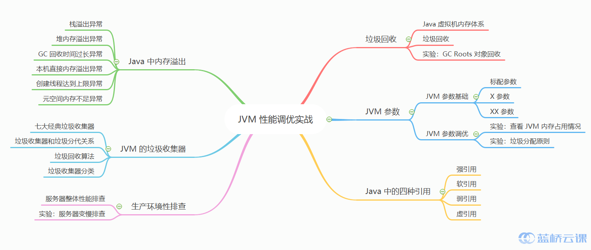

## Java 虚拟机内存体系

Java 虚拟机我们简称为 JVM（Java Virtual Machine）。

Java 虚拟机在执行 Java 程序的过程中，会管理几个不同的数据区域。如下图所示：

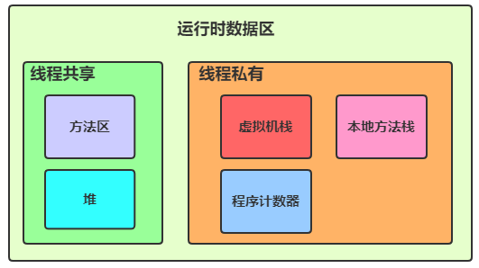

下面我会介绍这几个数据区的特点。

### 堆

堆区的几个特点：

- 线程共享。
- 启动时创建堆这个区。
- 基本上所有的对象实例都在这个区分配。
- 物理上不连接（大对象除外）。逻辑上不连接。
- 内存分为新生代和老年代。新生代分为 eden 区和两个大小一样的 survivor 区。

内存细分：

Java 7 及之前内存逻辑上分为三部分：新生区 + 老年代 + 永久代。

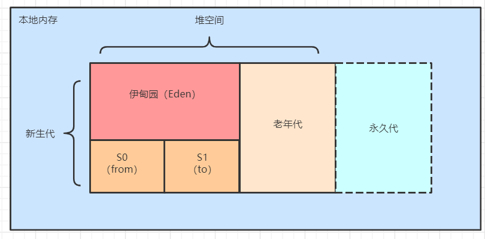

- 新生区，又被划分为 Eden 区和 Survivor 区。
- 老年代。
- 永久代实现了方法区。

Java 8 及之后内存逻辑上分为三部分：新生区 + 老年代 + 元空间。

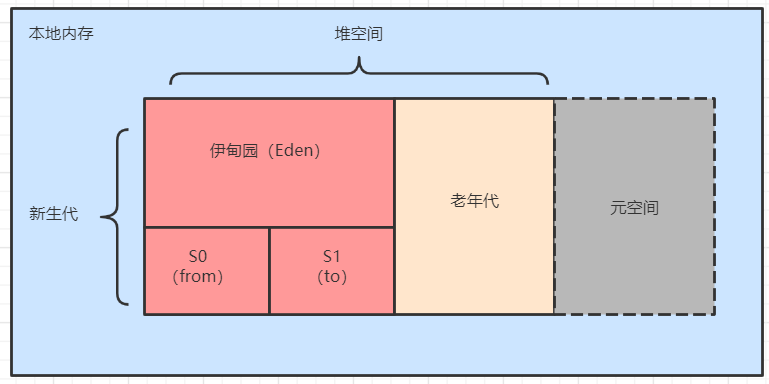

- 新生区，又被划分为 Eden 区和 Survivor 区。
- 老年代。
- 废弃了永久代，使用元空间，它属于本地内存。

#### 方法区

- 线程共享。
- 主要存储这几类信息。
  - 类型信息。
  - 常量。
  - 静态变量。
  - 即时编译器编译后的代码缓存。

#### 虚拟机栈

- 线程私有。
- 生命周期与线程相同。
- 一个线程中，每一个方法被执行的时候，创建一个栈帧。
- 栈帧 Stack Frame 的结构。
  - 存储局部变量表。
    - 基本数据类型。
    - 对象引用。
    - 返回地址（returnAddress）。
  - 操作数栈。
  - 动态连接。
  - 方法出口。

#### 本地方法栈

- 线程私有。
- 虚拟机使用到的本地（Native）方法服务。

#### 程序计数器

- 线程私有。
- 当前线程所执行的字节码的行号指示器。

我将这几个数据区的特点整理成了思维导图，供大家参考学习。点击图片，然后鼠标右键点击在新标签页中打开图片。

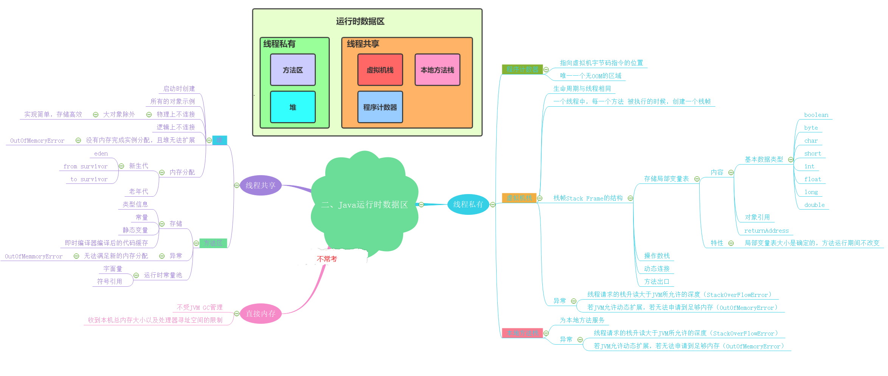

## 垃圾回收

### 垃圾回收区域

垃圾回收主要关注方法区和堆中的垃圾收集。如下图所示，方法区和堆被高亮显示，用来说明垃圾收集器关心的收集区域。

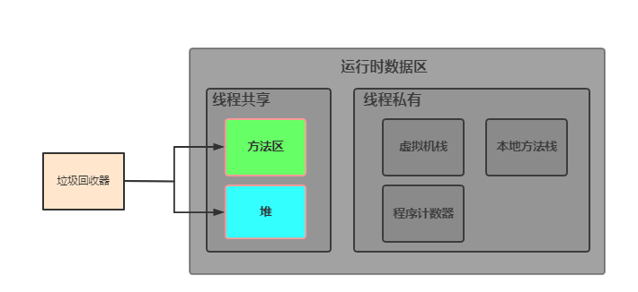

收集堆区域是垃圾收集器的工作重点。上面我们也讲到了堆空间的划分，包含新生代和老年代，而垃圾收集器会频繁收集新生代，较少收集老年代。

### 什么是垃圾

我们可以先想下现实生活中的垃圾，比如吃香蕉后的香蕉皮，我们不需要就扔到垃圾桶了，那么香蕉皮就属于垃圾，需要被环卫工人回收。 那 Java 虚拟机中，什么是垃圾呢？

垃圾是指在运行程序中没有任何指针指向的对象，这些对象被当作垃圾被垃圾收集器回收。

### 如何确定垃圾

有两种算法来确定哪些对象是垃圾：引用计数法和根节点可达性分析。

- 引用计数法

原理：给对象添加一个引用计数器，每当有一个地方引用它，计数器的值就加一。每当有一个引用失效，计数器的值就减一。当计数器值为零时，这个对象被认为没有其他对象引用，可当作垃圾回收。

缺点：需要维护引用计数器，有一定的消耗。且较难处理循环引用的问题。（现在基本没有地方使用这种算法了，了解即可）。

- 可达性分析算法

先想象一下生活中的场景，假设张三这个人有一条狗，狗被系着一条绳子。如下图所示：

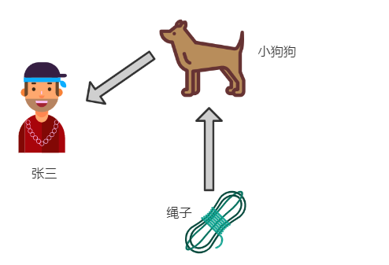

如果张三把狗遗弃了，那么这条狗和绳子就没有关联关系了，狗会被抓狗队抓起来送到宠物收容所。这里可以把张三当作 GC Roots，张三和狗之间断了联系，那么狗和绳子都会被回收。如下图所示：

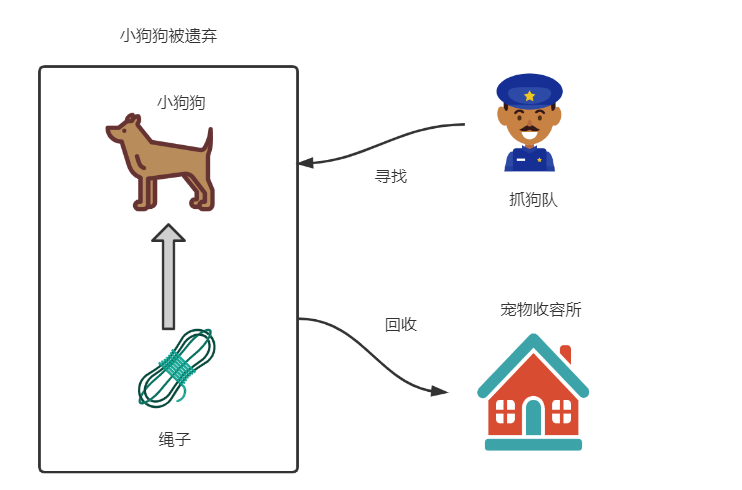

可达性分析算法原理：通过一系称为 `GC Roots` 的对象作为起始点，从 `GC Roots` 的对象出发，向下搜索，如果找到的对象和 `GC Roots` 有直接引用或间接引用关系，则说明这个对象不是垃圾，否则，这个对象就是垃圾。

### 哪些对象可以当作 GC Roots

- 虚拟机栈中的引用对象。
- 方法区中的类静态属性引用的对象。
- 方法区中常量引用的对象。
- 本地方法栈中的 `JNI`（Native 方法）引用的对象。

总结：除了堆空间外的一些结构，比如虚拟机栈、本地方法栈、方法区、字符串常量池等地方对堆空间进行引用的，都可以作为 `GC Roots` 进行可达性分析。

## 实验 GC Roots 对象回收

下面我们来用实验的方式讲解 GC Roots 根节点被回收的场景。

本次实验的内容如下：

- 创建一个 GCRootsDemo 类，定义了一个变量 bigSize 占用 2M 内存，定义一个类变量 gcRootsDemo 作为 GC Roots 指向 GCRootsDemo 类实例。
- 当主动调用垃圾回收后，GCRootsDemo 类实例不会被回收，我们只是看下第一次的内存情况。
- 将类变量 gcRootsDemo 与 GCRootsDemo 类实例的关联关系给断开，再次执行垃圾回收，看下内存情况，来观察类实例 GCRootsDemo 类实例是否作为垃圾被回收。期望结果：GCRootsDemo 类实例被回收。

实验步骤：

- 在 WebIDE 上右键单击菜单，选择 New File 创建新文件。

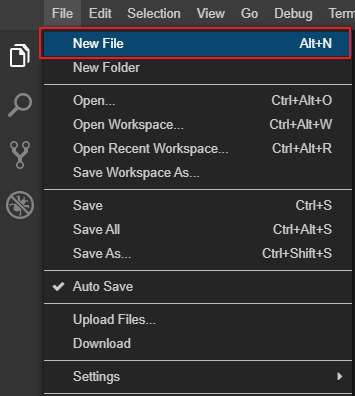

- 创建文件名为 `GCRootsDemo.java`。

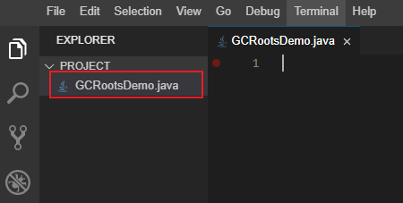

- 编写测试代码。

在 WebIDE 上编写 `GCRootsDemo.java` 代码。

```JAVA
public class GCRootsDemo {
    private static final int _1MB = 1024 * 1024;
    private byte[] bigSize = new byte[2 * _1MB];
    private static GCRootsDemo gcRootsDemo;

    public static void main(String[] args) throws InterruptedException {
        gcRootsDemo = new GCRootsDemo();
        //gcRootsDemo = null;
        System.gc();
    }
}
```

- 编译代码。

在 WebIDE 的控制台窗口编译 `GCRootsDemo.java` 代码。

```java
javac GCRootsDemo.java
```

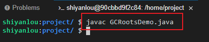

编译之后，会在当前文件夹产生我们所编写的 `GCRootsDemo` 类的 `GCRootsDemo.class` 字节码文件。

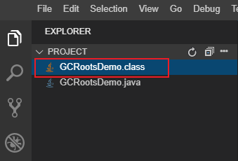

- 运行代码。

在 WebIDE 上运行 GCRootsDemo 代码。且带上打印 GC 日志的参数。当发生 GC 时会自动打印垃圾回收信息和堆内存信息。

```java
java -XX:+PrintGCDetails GCRootsDemo
```

程序运行结束后，打印出的 GC 日志如下图所示：

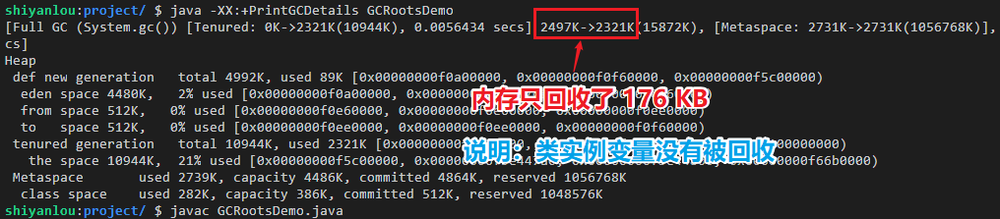

堆内存占用空间从 2497 KB 降到了 2321 KB。内存空间只回收了 176 KB。因类实例变量至少占用 2MB 内存空间，所以这里可以判断出回收的肯定不是类实例变量。

- 断开类实例引用。

我们改写一下代码，将 gcRootsDemo 变量的值设为 null，这样类实例 GCRootsDemo 就没有被任何 GC Roots 所引用。如果执行垃圾回收，是会被垃圾收集器回收掉的。

代码如下：

```java
public class GCRootsDemo {
  private static final int _1MB = 1024 * 1024;
  private byte[] bigSize = new byte[2 * _1MB];
  private static GCRootsDemo gcRootsDemo;

  public static void main(String[] args) throws InterruptedException {
    gcRootsDemo = new GCRootsDemo();
    gcRootsDemo = null;
    System.gc();
  }
}
```

- 再次编译、运行程序，并打印 GC 日志。

```java
javac GCRootsDemo.java

java -XX:+PrintGCDetails GCRootsDemo
```

实验结果如图所示：

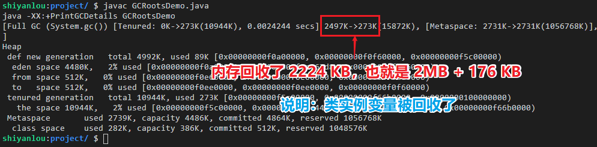

从上面的结果可以看出堆内存占用空间从 2497 KB 降到了 273 KB。内存空间回收了 2 MB + 176 KB，和第一次相比正好是相差 2 MB。所以是类实例占用的 2 MB 被回收了。

我们从实验中可以得出结论：对象和 GC Roots 没有引用关系时（这里引用关系可以是间接或直接引用），即对象不可达，将会被垃圾收集器标记为垃圾，后期被回收掉。

