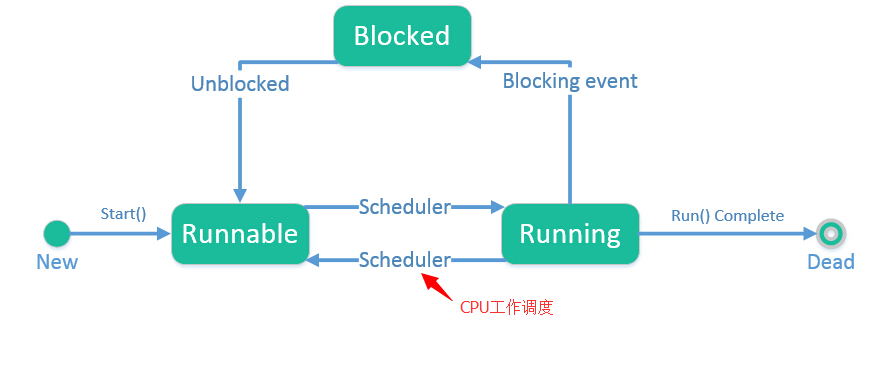
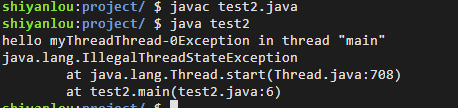
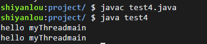
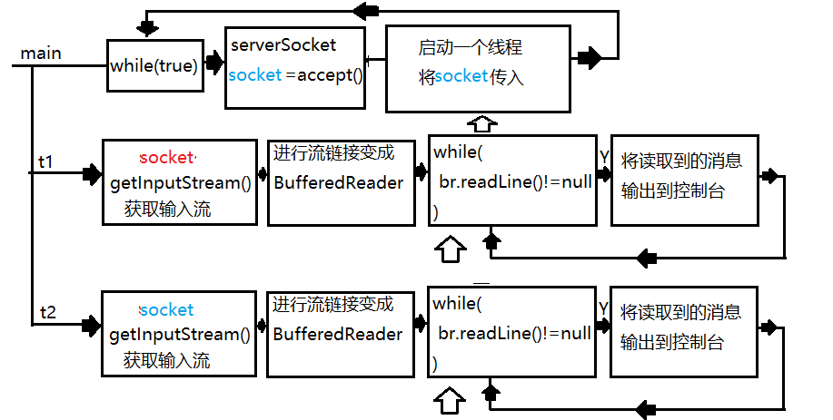
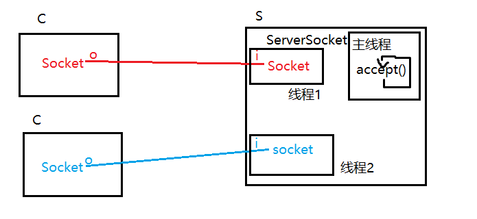

# 多线程
[[TOC]]

Java 给多线程编程提供了内置的支持。 一条线程指的是进程中一个单一顺序的控制流，一个进程中可以并发多个线程，每条线程并行执行不同的任务。多线程是多任务的一种特别的形式，但多线程使用了更小的资源开销。多线程能满足程序员编写高效率的程序来达到充分利用 CPU 的目的。

## 进程与线程

- 独立性：进程是系统中独立存在的实体，它可以拥有自己的独立的资源，每一个进程都拥有自己私有的地址空间。在没有经过进程本身允许的情况下，一个用户进程不可以直接访问其他进程的地址空间。
- 动态性：进程与程序的区别在于，程序只是一个静态的指令集合，而进程是一个正在系统中活动的指令集合。在进程中加入了时间的概念，进程具有自己的生命周期和各种不同的状态，这些概念在程序中都是不具备的。
- 并发性：多个进程可以在单个处理器上并发执行，多个进程之间不会互相影响。

线程（thread）是操作系统能够进行运算调度的最小单位。它被包含在进程之中，是进程中的实际运作单位。一个进程可以开启多个线程。
多线程扩展了多进程的概念，使得同一个进程可以同时并发处理多个任务。
简而言之，一个程序运行后至少一个进程，一个进程里包含多个线程。
如果一个进程只有一个线程，这种程序被称为单线程。
如果一个进程中有多条执行路径被称为多线程程序。

一个操作系统中可以有多个进程，一个进程中可以有多个线程，每个进程有自己独立的内存，每个线程共享一个进程中的内存，每个线程又有自己独立的内存。（记清这个关系，非常重要！）
所以想使用线程技术，得先有进程，进程的创建是OS创建的，你能实现吗？不能，一般都是c或者c++语言完成的。

## 什么是线程

> 线程：程序执行流的最小单元。它是进程内一个相对独立的、可调度的执行单元，是系统独立调度和分派 CPU 的基本单位。
>
> 线程:一个顺序的单一的程序执行流程就是一个线程。代码一句一句的有先后顺序的执行。

如同大自然中的万物，线程也有「生老病死」的过程，下图表示了一个线程从创建到消亡的过程，以及过程中的状态。




结合线程的生命周期来看看多线程的定义：

> 多线程：从软件或者硬件上实现多个线程并发执行的技术。在单个程序中同时运行多个线程完成不同的工作。
>
> 多线程:多个单一顺序执行的流程并发运行。造成"感官上同时运行"的效果。

在 Java 中，[垃圾回收机制](http://baike.baidu.com/view/159846.htm)就是通过一个线程在后台实现的，这样做的好处在于：开发者通常不需要为内存管理投入太多的精力。反映到我们现实生活中，在浏览网页时，浏览器能够同时下载多张图片；实验楼的服务器能够容纳多个用户同时进行在线实验，这些都是多线程带来的好处。

从专业的角度来看，多线程编程是为了最大限度地利用 CPU 资源——当处理某个线程不需要占用 CPU 而只需要利用 IO 资源时，允许其他的那些需要 CPU 资源的线程有机会利用 CPU。这或许就是多线程编程的最终目的。当然，你也可以进一步了解。

对于多线程和线程之间的关系，你可以这样理解：一个使用了多线程技术的程序，包含了两条或两条以上并发运行的线程（`Thread`）。

### 并发:

多个线程实际运行是走走停停的。线程调度程序会将CPU运行时间划分为若干个时间片段并尽可能均匀的分配给每个线程，拿到时间片的线程被CPU执行这段时间。当超时后线程调度程序会再次分配一个时间片段给一个线程使得CPU执行它。如此反复。由于CPU执行时间在纳秒级别，我们感觉不到切换线程运行的过程。所以微观上走走停停，宏观上感觉一起运行的现象成为并发运行!

#### 原子性

即一个操作或者多个操作 要么全部执行并且执行的过程不会被任何因素打断，要么就都不执行。


#### 可见性:

可见性是指当多个线程访问同一个变量时，一个线程修改了这个变量的值，其他线程能够立即看得到修改的值。

#### 有序性

程序执行的顺序按照代码的先后顺序执行。

### 用途:

- 当出现多个代码片段执行顺序有冲突时，希望它们各干各的时就应当放在不同线程上"同时"运行
- 一个线程可以运行，但是多个线程可以更快时，可以使用多线程运行

###  Java内存模型


Java内存模型规定所有的变量都是存在主存当中（类似于前面说的物理内存），每个线程都有自己的工作内存（类似于前面的高速缓存）。线程对变量的所有操作都必须在工作内存中进行，而不能直接对主存进行操作。并且每个线程不能访问其他线程的工作内存。

#### 原子性

只有简单的读取、赋值（而且必须是将数字赋值给某个变量，变量之间的相互赋值不是原子操作）才是原子操作。

Java内存模型只保证了基本读取和赋值是原子性操作，如果要实现更大范围操作的原子性，可以通过synchronized和Lock来实现。由于synchronized和Lock能够保证任一时刻只有一个线程执行该代码块，那么自然就不存在原子性问题了，从而保证了原子性。

#### 可见性

对于可见性，Java提供了volatile关键字来保证可见性。

当一个共享变量被volatile修饰时，它会保证修改的值会立即被更新到主存，当有其他线程需要读取时，它会去内存中读取新值。

而普通的共享变量不能保证可见性，因为普通共享变量被修改之后，什么时候被写入主存是不确定的，当其他线程去读取时，此时内存中可能还是原来的旧值，因此无法保证可见性。

另外，通过synchronized和Lock也能够保证可见性，synchronized和Lock能保证同一时刻只有一个线程获取锁然后执行同步代码，并且在释放锁之前会将对变量的修改刷新到主存当中。因此可以保证可见性。

#### 有序性

在Java内存模型中，允许编译器和处理器对指令进行重排序，但是重排序过程不会影响到单线程程序的执行，却会影响到多线程并发执行的正确性。

在Java里面，可以通过volatile关键字来保证一定的“有序性”。另外可以通过synchronized和Lock来保证有序性，很显然，synchronized和Lock保证每个时刻是有一个线程执行同步代码，相当于是让线程顺序执行同步代码，自然就保证了有序性。

另外，Java内存模型具备一些先天的“有序性”，即不需要通过任何手段就能够得到保证的有序性，这个通常也称为 happens-before 原则。如果两个操作的执行次序无法从happens-before原则推导出来，那么它们就不能保证它们的有序性，虚拟机可以随意地对它们进行重排序。

下面就来具体介绍下**happens-before原则**（先行发生原则）：

- 程序次序规则：一个线程内，按照代码顺序，书写在前面的操作先行发生于书写在后面的操作
- 锁定规则：一个unLock操作先行发生于后面对同一个锁额lock操作
- volatile变量规则：对一个变量的写操作先行发生于后面对这个变量的读操作
- 传递规则：如果操作A先行发生于操作B，而操作B又先行发生于操作C，则可以得出操作A先行发生于操作C
- 线程启动规则：Thread对象的start()方法先行发生于此线程的每个一个动作
- 线程中断规则：对线程interrupt()方法的调用先行发生于被中断线程的代码检测到中断事件的发生
- 线程终结规则：线程中所有的操作都先行发生于线程的终止检测，我们可以通过Thread.join()方法结束、Thread.isAlive()的返回值手段检测到线程已经终止执行
- 对象终结规则：一个对象的初始化完成先行发生于他的finalize()方法的开始

## 使用volatile关键字的场景

synchronized关键字是防止多个线程同时执行一段代码，那么就会很影响程序执行效率，而volatile关键字在某些情况下性能要优于synchronized，但是要注意volatile关键字是无法替代synchronized关键字的，因为volatile关键字无法保证操作的原子性。通常来说，使用volatile必须具备以下2个条件：

1. 对变量的写操作不依赖于当前值

　2. 该变量没有包含在具有其他变量的不变式中

实际上，这些条件表明，可以被写入 volatile 变量的这些有效值独立于任何程序的状态，包括变量的当前状态。

事实上，我的理解就是上面的2个条件需要保证操作是原子性操作，才能保证使用volatile关键字的程序在并发时能够正确执行。

### 1. 状态标记量

```java
volatile boolean inited = false;
//线程1:
context = loadContext();  
inited = true;            
 
//线程2:
while(!inited ){
sleep()
}
doSomethingwithconfig(context);
```

### 2. double check

```java
class Singleton{
    private volatile static Singleton instance = null;
     
    private Singleton() {
         
    }
     
    public static Singleton getInstance() {
        if(instance==null) {
            synchronized (Singleton.class) {
                if(instance==null)
                    instance = new Singleton();
            }
        }
        return instance;
    }
}
```


## 多线程实现

Java 中的 `Thread` 类就是专门用来创建线程和操作线程的类。

### 创建线程

创建线程的方法：

1. 继承 Thread 类并重写它的 `run()` 方法，然后用这个子类来创建对象并调用 `start()` 方法。

   > 定义一个线程类，重写run方法，在其中定义线程要执行的任务(希望和其他线程并发执行的任务)。
   >
   > 注:启动该线程要调用该线程的start方法，而不是run方法！！！
   >
   > 
   >
   > ```java
   > package thread;
   > 
   > /**
   >  * 第一种创建线程的方式:
   >  * 定义一个类继承自Thread，并重写run方法。在run方法中定义要与其他线程并发运行的任务
   >  * 启动线程时要使用start方法!
   >  */
   > public class ThreadDemo1 {
   >     public static void main(String[] args) {
   >         //1:实例化线程
   >         Thread t1 = new MyThread1();
   >         Thread t2 = new MyThread2();
   >         //2:启动线程,注意！不能直接调用run方法
   >         t1.start();//start方法调用后线程纳入线程调度程序控制。run会自动执行。
   >         t2.start();
   >     }
   > }
   > 
   > class MyThread1 extends Thread{
   >     public void run(){
   >         for(int i=0;i<1000;i++){
   >             System.out.println("你是谁啊?");
   >         }
   >     }
   > }
   > class MyThread2 extends Thread{
   >     public void run(){
   >         for(int i=0;i<1000;i++){
   >             System.out.println("开门，查水表的!");
   >         }
   >     }
   > }
   > ```
   >
   > 第一种创建线程的方式
   >
   > 优点:
   >
   > 在于结构简单，便于匿名内部类形式创建。
   >
   > 缺点:
   >
   >  * 1:直接继承线程，会导致不能在继承其他类去复用方法，这在实际开发中是非常不便的。
   >  * 2:定义线程的同时重写了run方法，会导致线程与线程任务绑定在了一起，不利于线程的重用。
   >
   > 

2. 定义一个类并实现 Runnable 接口，实现 `run()` 方法。

   > ```java
   > package thread;
   > 
   > /**
   >  * 第二种创建线程的方式
   >  * 实现Runnable接口单独定义线程任务
   >  */
   > public class ThreadDemo2 {
   >     public static void main(String[] args) {
   >         //1先实例化线程要执行的任务
   >         Runnable r1 = new MyRunnable1();
   >         Runnable r2 = new MyRunnable2();
   >         //2创建两个线程分别执行任务
   >         Thread t1 = new Thread(r1);
   >         Thread t2 = new Thread(r2);
   >         //3启动线程
   >         t1.start();
   >         t2.start();
   >     }
   > }
   > class MyRunnable1 implements Runnable{
   >     public void run(){
   >         for(int i=0;i<1000;i++){
   >             System.out.println("hello!姐!");
   >         }
   >     }
   > }
   > class MyRunnable2 implements Runnable{
   >     public void run(){
   >         for(int i=0;i<1000;i++){
   >             System.out.println("来了老弟!");
   >         }
   >     }
   > }
   > ```
   >
   > **使用匿名内部类形式创建**
   >
   > ```java
   > package thread;
   > 
   > /**
   >  * 以匿名内部类的形式完成线程的两种创建。
   >  */
   > public class ThreadDemo3 {
   >     public static void main(String[] args) {
   >         Thread t1 = new Thread(){
   >             public void run(){
   >                 System.out.println("hello");
   >             }
   >         };
   > //        Runnable r2 = new Runnable(){
   > //            public void run(){
   > //                System.out.println("hello");
   > //            }
   > //        };
   >         Runnable r2 = ()->System.out.println("hello");//Runnable可以用lambda
   >         Thread t2 = new Thread(r2);
   > 
   >         t1.start();
   >         t2.start();
   >     }
   > }
   > ```
   >
   > 

总的来说就是线程通过 `start()` 方法启动而不是 `run()` 方法，`run()` 方法的内容为我们要实现的业务逻辑。

```java
public class CreateThread {

    public static void main(String[] args) {
        Thread1 thread1 = new Thread1();
        //声明一个Thread1对象，这个Thread1类继承自Thread类的

        Thread thread2 = new Thread(new Thread2());
        //传递一个匿名对象作为参数

        thread1.start();
        thread2.start();
        //启动线程
    }
}

class Thread1 extends Thread {
    @Override
    public void run() {
        //在run()方法中放入线程要完成的工作

        //这里我们把两个线程各自的工作设置为打印100次信息
        for (int i = 0; i < 100; ++i) {
            System.out.println("Hello! This is " + i);
        }

        //在这个循环结束后，线程便会自动结束
    }
}

class Thread2 implements Runnable {
    //与Thread1不同，如果当一个线程已经继承了另一个类时，就建议你通过实现Runnable接口来构造

    @Override
    public void run() {
        for (int i = 0; i < 100; ++i) {
            System.out.println("Thanks. There is " + i);
        }
    }
}
```

#### 实现多线程返回值——实现 `Callable<V>`

通常意义上理解确实 Java 实现多线程的方式有继承 `Thread` 和实现 `Runnable`，但是如果想实现多线程并且具有返回值的情况下，需要实现 `Callable<V>` 接口，这个接口是 `JDK1.5` 版本以后才出现的接口。

##### 创建 `study2.java`

创建 `study2.java` 文件，利用实现 `Callable<V>` 进行返回，代码如下所示：

```java
import java.util.concurrent.Callable;

public class study2 {
    public static void main(String[] args) {
        MyCallable MyCallable = new MyCallable("张方兴");
        String call = null;
        try {
            call = MyCallable.call();
        } catch (Exception e) {
            e.printStackTrace();
        }
        System.out.println(call);
    }
}

class MyCallable implements Callable<String>{

    private String name;

    public MyCallable(String name) {
        this.name = name;
    }

    @Override
    public String call() throws Exception {
        return "call:" + name;
    }
}
```

##### study2 运行结果


##### `Callable<V>` 接口详解

一般继承 `Thread` 的类，含有 `.start()` 函数，所以直接可以使用 `.start()` 函数进行启动。

实现 `Runnable` 的类，需要通过 `new Thread(myRunnable).start();` 的方式进行启动，即实现 `Runnable` 的类只是做好了一段多线程所需执行的内容，自身并没有执行的能力，需要通过 `Thread` 类的 `.start()` 函数进行启动。

实现 `Callable<V>` 的接口，含有 `.call()` 函数，所以可以直接使用 `.call()` 函数进行启动，另外值得说明的是，`Callable<V>` 函数具有返回值，返回值为定义类时使用的 `<V>` 类型，其定义是其返回。`Callable<V>` 接口定义如下所示：

```java
@FunctionalInterface
public interface Callable<V> {
    /**
     * Computes a result, or throws an exception if unable to do so.
     *
     * @return computed result
     * @throws Exception if unable to compute a result
     */
    V call() throws Exception;
}
```

`Callable<V>` 用于指示接口类型声明是由 Java 语言规范定义的功能接口。从概念上讲，函数接口只有一个抽象方法。因为 `java.lang.reflect.Method#isDefault()default methods` 有一个实现，所以它们不是抽象的。如果接口声明一个抽象方法重写 `java.lang.Object` 的一个公共方法，则该方法也不计入接口的抽象方法计数，因为接口的任何实现都将具有来自 `java.lang.Object` 或其他位置的实现。

另外注意，函数接口的实例可以使用 lambda 表达式、方法引用或构造函数引用创建。

- `Callable<V>` 在需要使用返回值的情况下，程序是同步运行的
- `Callable<V>` 其它情况下，程序是异步运行的

在阅读 `Callable<V>` 接口的过程中，建议读者多做几个测试，查看相应返回、程序执行时间，看出异步与同步的区别，由于代码过于简单，只需要增加几个 `sleep()` 函数，在 `study2.java` 类中更改一下即可，所以这里略过不提。

#### `start()` 和 `run()` 之间的区别

##### `start()`

start() 函数 API 定义：

> 使该线程开始执行，Java 虚拟机调用该线程的 run 方法。结果是两个线程并发地运行；当前线程（从调用返回给 start 方法）和另一个线程（执行其 run 方法）。多次启动一个线程是非法的。特别是当线程已经结束执行后，不能再重新启动。

start() 函数启动线程执行以下任务：

> - 它统计了一个新线程
> - 线程从 New State 移动到 Runnable 状态。
> - 当线程有机会执行时，它的目标 `run()` 方法将运行。
> - start() 方法不能多次重复调用，否则抛出 java.lang.IllegalStateException 异常；

小结：

`start()` 函数用来启动线程，真正实现了多线程运行。这时无需等待 run 方法体代码执行完毕，可以直接继续执行下面的代码；通过调用 Thread 类的 `start()` 方法来启动一个线程， 这时此线程是处于就绪状态， 并没有运行。 然后通过此 Thread 类调用方法 `run()` 来完成其运行操作的， 这里方法 `run()` 称为线程体，它包含了要执行的这个线程的内容。 Run 方法运行结束， 此线程终止。然后 CPU 再调度其它线程。

##### `run()`

run() 函数 API 定义：

> 如果该线程是使用独立的 Runnable 运行对象构造的，则调用该 Runnable 对象的 run 方法；否则，该方法不执行任何操作并返回。Thread 的子类应该重写该方法。

run() 函数启动：

> 线程类的 `run()` 方法是 Runnable 接口的一个抽象函数，由 java 虚拟机直接调用的，不会创建的新线程。所以可以被多次调用，因为它只是一个抽象函数。

小结：

> run() 函数只是类的一个普通函数而已，如果直接调用 run 方法，程序中依然只有主线程这一个线程，其程序执行路径还是只有一条，还是要顺序执行，还是要等待 run 方法体执行完毕后才可继续执行下面的代码，这样就没有达到写线程的目的。

#### IllegalComponentStateException 异常概念

> IllegalComponentStateException 异常是 RuntimeException 异常的父类，指无效状态异常，在不合理或不正确时间内唤醒一方法时出现的异常信息。换句话说，即 Java 环境或 Java 应用不满足请求操作。

多线程就是分时利用 CPU，宏观上让所有线程一起执行 ，也叫并发。在真正工作及学习使用中，想要异步的情况下需尽可能使用 start() 函数。但是 start() 方法不能多次重复调用，否则抛出 java.lang.IllegalStateException 异常；

##### 重复调用 start() 报出 IllegalComponentStateException 异常

在 project 中创建 `test2.java` 文件

```java
public class test2{

    public static void main(String[] args){
        Thread MyThread = new MyThread();
        for(int i = 0; i < 2; i++){
            MyThread.start();
        }
    }
}

class MyThread extends Thread{
    @Override
    public void run(){
        System.out.println("hello myThread" + Thread.currentThread().getName());
    }
}
```

打开 terminal，输入命令编译并运行：

```bash
javac test2.java
java test2
```

运行结果将会抛出 IllegalComponentStateException 异常，如下所示：



##### 非重复调用 start() 不会报出异常

在 project 中创建 test3.java 文件

```java
public class test3{

    public static void main(String[] args){

        for(int i = 0; i < 2; i++){
            Thread MyThread = new MyThread();
            MyThread.start();
        }
    }
}

class MyThread extends Thread{
    @Override
    public void run(){
        System.out.println("hello myThread" + Thread.currentThread().getName());
    }
}
```

打开 terminal，输入命令编译并运行：

```java
javac test3.java
java test3
```

由于该实例每次都重新创建 MyThread 线程，而非在一个线程中频繁调用`start()`函数，所以运行结果将执行 2 次 Hello MyThread();


##### 重复调用 .run() 不会报出异常

在 project 中创建 `test4.java` 文件

```java
public class test4{

    public static void main(String[] args){
        Thread MyThread = new MyThread();
        for(int i = 0; i < 2; i++){

            MyThread.run();
        }
    }
}

class MyThread extends Thread{
    @Override
    public void run(){
        System.out.println("hello myThread" + Thread.currentThread().getName());
    }
}
```

打开 terminal，输入命令编译并运行：

```bash
javac test4.java
java test4
```

运行结果如下所示



> 此时便证明了，`run()` 函数只是一个普通的函数，而`start()` 函数才是真正意义上的创建了多线程。

### 使用多线程实现多客户端连接服务端

#### 执行流程图:






#### 服务端代码:

```java
package socket;

import java.io.BufferedReader;
import java.io.IOException;
import java.io.InputStream;
import java.io.InputStreamReader;
import java.net.ServerSocket;
import java.net.Socket;

/**
 * 聊天室服务端
 */
public class Server {
    /*
        运行在服务端的ServerSocket主要有两个作用
        1:向系统申请服务端口，客户端的Socket就是通过这个端口与服务端建立连接的。
        2:监听服务端口，一旦一个客户端通过该端口建立连接会自动创建一个Socket，服务端
          就可以通过这个Socket与客户端交互了。

        如果我们把Socket比喻为电话，那么ServerSocket相当于是某客服中心的总机。
     */
    private ServerSocket serverSocket;

    public Server(){
        try {
            System.out.println("正在启动服务端...");
            /*
                实例化是要指定服务端口，如果该端口被当前系统其他应用程序占用时，会
                抛出异常:java.net.BindException:address already in use
             */
            serverSocket = new ServerSocket(8088);
            System.out.println("服务端启动完毕");
        } catch (IOException e) {
            e.printStackTrace();
        }
    }

    public void start(){
        try {
            /*
                ServerSocket提供的方法:
                Socket accept()
                该方法是一个阻塞方法，调用后程序进入阻塞状态("卡住"),直到一个客户端
                实例化Socket与当前客户端建立连接，此时accept方法会立即返回一个Socket
                实例，服务端通过它就可以与客户端交互了。

                可以理解为这个动作相当于是总机的"接电话"操作。
             */
            while(true) {
                System.out.println("等待客户端连接...");
                Socket socket = serverSocket.accept();
                System.out.println("一个客户端连接了!");
                //启动一个线程来负责与该客户端交互
                //1创建线程任务
                ClientHandler handler = new ClientHandler(socket);
                //2创建一个线程并执行该任务
                Thread t = new Thread(handler);
                //3启动该线程
                t.start();
            }

        } catch (IOException e) {
            e.printStackTrace();
        }
    }

    public static void main(String[] args) {
        Server server = new Server();
        server.start();
    }

    /**
     * 该线程任务用于与指定的客户端进行交互。
     * 每个连接服务端的客户端都是通过该线程进行交互的。即:一个客户端靠一个该线程进行交互
     */
    private class ClientHandler implements Runnable{
        private Socket socket;

        public ClientHandler(Socket socket){
            this.socket = socket;
        }

        public void run(){
            try{
                /*
                    Socket提供的方法:
                    InputStream getInputStream()
                    通过该方法获取的字节输入流读取的是远端计算机发送过来的数据。

                    这里相当于是读取当前服务端中这个Socket对应的远端(客户端)那边Socket获取
                    的输出流写出的字节数据。
                 */
                InputStream in = socket.getInputStream();
                InputStreamReader isr = new InputStreamReader(in,"UTF-8");
                BufferedReader br = new BufferedReader(isr);

                String line;
                while((line = br.readLine()) != null) {
                    System.out.println("服务端说:"+line);
                }
            }catch(IOException e){
                e.printStackTrace();
            }
        }
    }
}
```

#### 练习题:多线程服务器

新建源代码文件 `Server.java` 和`Client.java`

你需要完成以下要求：

- Server 可以同时接受多个客户端的连接
- 每个线程负责一个连接
- 客户端发送消息给服务端，服务端再将客户端发送的消息发回客户端

```java
//client.java
import java.io.BufferedReader;
import java.io.IOException;
import java.io.InputStreamReader;
import java.io.PrintWriter;
import java.net.Socket;
import java.util.Scanner;

public class Client {
    public static void main(String[] args) {
        String hostname = "127.0.0.1";
        //socket端口
        int port = 1080;
        Scanner userIn = new Scanner(System.in);
        try {
            //建立socket连接
            Socket socket = new Socket(hostname, port);
            //获取socket输出流
            PrintWriter out = new PrintWriter(socket.getOutputStream(), true);
            //获取输入流
            BufferedReader in = new BufferedReader(new InputStreamReader(socket.getInputStream()));
            String userInput;
            System.out.println("请输入信息：");
            //当用户输入exit时退出
            while (!"exit".equals(userInput = userIn.nextLine())) {
                out.println(userInput);
                System.out.println("收到服务端回应:" + in.readLine());
            }
            //关闭socket
            socket.close();
        } catch (IOException e) {
            e.printStackTrace();
        }
    }
}

//server.java
import java.io.BufferedReader;
import java.io.IOException;
import java.io.InputStreamReader;
import java.io.PrintWriter;
import java.net.ServerSocket;
import java.net.Socket;


public class Server {
    public static void main(String[] args) {
        try {
            //服务端需要使用ServerSocket类
            ServerSocket serverSocket = new ServerSocket(1080);
            //阻塞 等待客户端连接
            while (true) {
                Thread thread = new Thread(new ServerThread(serverSocket.accept()));
                thread.start();
            }
        } catch (IOException e) {
            e.printStackTrace();
        }
    }

    static class ServerThread implements Runnable {
        Socket client;

        public ServerThread(Socket client) {
            this.client = client;
        }

        @Override
        public void run() {
            try {
                PrintWriter out = new PrintWriter(client.getOutputStream(), true);
                BufferedReader in = new BufferedReader(new InputStreamReader(client.getInputStream()));
                String userIn;
                while ((userIn = in.readLine()) != null) {
                    System.out.println("收到客户端消息：" + userIn);
                    //发回客户端
                    out.println(userIn);
                }
            } catch (IOException e) {
                e.printStackTrace();
            }
        }
    }
}
```


## 线程变量

ThreadLocal，即线程变量，是一个以 ThreadLocal 对象为键、任意对象为值的存储结构。这个结构被附带在线程上，也就是说一个线程可以根据一个 ThreadLocal 对象查询到绑定在这个线程上的一个值。 可以通过 `set(T)` 方法来设置一个值，在当前线程下再通过 `get()` 方法获取到原先设置的值。

```java
public class ThreadLocalDemo {

    public static void main(String[] args) {
        ThreadDemo threadDemo = new ThreadDemo();
        //启动2个线程
        new Thread(threadDemo).start();
        new Thread(threadDemo).start();

    }
}

class ThreadDemo implements Runnable {
    //使用ThreadLocal提供的静态方法创建一个线程变量 并且初始化值为0
    private static ThreadLocal<Integer> threadLocal = ThreadLocal.withInitial(() -> 0);

    @Override
    public void run() {
        for (int i = 0; i < 10; i++) {
            //get方法获取线程变量值
            Integer integer = threadLocal.get();
            integer += 1;
            //set方法设置线程变量值
            threadLocal.set(integer);
            System.out.println(integer);
        }
    }
}
```

通过控制台的结果可以看到，两个线程之间的变量互不干涉。

#### ThreadLocal

JDK 1.2的版本中就提供java.lang.ThreadLocal，ThreadLocal为解决多线程程序的并发问题提供了一种新的解决思路。使用这个工具类可以很简洁地编写出优美的多线程程序。这里注意线程锁是解决并发安全问题，而ThreadLocal是解决线程共享问题，何为共享呢？
例如：我们要使用一个对象，这个对象要在不同线程中传递，怎么保持一份呢？不是新对象呢？就需要使用ThreadLocal来保存和传递这个对象。

#### 结构

可以看到ThreadLocal内部由ThreadLocalMap本质就是一个Map结构。其内部保存Entry对象，Entry的key是弱引用（用完就释放），value是强引用（GC回收，如果有引用回收不了）。ThreadLocal被保存在各自的线程Thread中，线程底层由操作系统保证其隔离。相当于共享变量再每个线程中复制了一份。这样共享变量就不会有访问冲突了。其本质是线程私有了。当然不会造成冲突，从而间接的解决了线程安全问题。实际开发，特别框架中广泛用到。

#### 副本

数据保存在ThreadLocalMap集合中，这样数据就被每个线程所绑定，操作系统会维护线程的隔离，也就是不能互相访问，从而巧妙的避免线程安全问题，而它所消耗的资源几乎没有，多线程下也不会发生阻塞，性能非常好，框架底层广泛使用。

#### 弱引用强引用

使用ThreadLocal最大一个缺点就是其会发生内存泄漏，那什么原因造成它会发生内存泄漏呢？由于ThreadLocalMap的key是弱引用，而Value是强引用。
查看源码：

```java
static class ThreadLocalMap {
	static class Entry extends WeakReference<ThreadLocal<?>> {
	    /** The value associated with this ThreadLocal. */
	    Object value;
	
	    Entry(ThreadLocal<?> k, Object v) {
			super(k);
			value = v;
	    }
	}
}
1234567891011
```

那什么是弱引用？什么是强引用呢？要讨论ThreadLocal内存泄漏问题，先得了解什么是对象的弱引用，什么是对象的强引用？
这里我们不做深层探讨，要讨论它又要牵扯出GC java的垃圾回收机制，又是一大片概念，一旦展开同学们直接就晕倒了，所以这里我们就不展开了，大家记住java中对象有四种引用关系：强引用、弱引用、软引用、虚引用，大概了解概念即可。

强引用：默认的对象都是强引用，如：String s = “tony”; 由于对象被其他对象所调用，GC干不掉。
弱引用：弱引用生命周期很短，不论当前内存是否充足，都只能存活到下一次垃圾收集之前。也就是说GC时就会被干掉。

#### 内存泄漏

对象申请后不释放，积累多了就会发生内存泄漏。这种情况实际开发中非常常见，但非常难以监测。我们可以由很多现象的发生推测内存有泄漏的情况。例如：刚开始我们使用一款软件时操作非常流畅，但使用时间长了，软件开始卡顿，重启一下，又飞快如飞。这就是典型的内存泄漏。
ThreadLocalMap的key是弱引用，而Value是强引用。这就导致了一个问题，ThreadLocal在没有外部对象强引用时，发生GC时弱引用Key会被回收，而Value不会回收，如果创建ThreadLocal的线程一直持续运行，那么这个Entry对象中的value就有可能一直得不到回收，发生内存泄露。
如何避免泄漏？
既然Key是弱引用，那么我们要做的事，就是在调用ThreadLocal的get()、set()方法完成后再调用remove方法，将Entry节点和Map的引用关系移除，这样整个Entry对象在GC Roots分析后就变成不可达了，下次GC的时候就可以被回收。
如果使用ThreadLocal的set方法之后，没有显示的调用remove方法，就有可能发生内存泄露，所以养成良好的编程习惯十分重要，使用完ThreadLocal之后，记得调用remove方法。

```java
ThreadLocal<Session> threadLocal = new ThreadLocal<Session>();
try {
    threadLocal.set(new Session(1, “tony”));
    // 其它业务逻辑
} finally {
    threadLocal.remove();
}
1234567
```

#### 线程锁和ThreadLocal的区别

线程锁实现了线程的同步，线程排队按顺序执行。线程阻塞，前面没有执行完成，后面就只能等待，前面的执行完成，后面才能进行执行。
概括来说，对于多线程资源共享的问题，线程锁同步机制采用了“以时间换空间”的方式，而ThreadLocal采用了“以空间换时间”的方式。前者仅提供一份变量，让不同的线程排队访问，而后者为每一个线程都提供了一份变量，因此可以同时访问而互不影响。
ThreadLocal是解决线程安全问题一个很好的思路，它通过为每个线程提供一个独立的变量副本解决了变量并发访问的冲突问题。在很多情况下，ThreadLocal比直接使用synchronized同步机制解决线程安全问题更简单，更方便，且结果程序拥有更高的并发性。

#### 评价

【了解】ThreadLocal不好理解，但很好使用，几行代码搞定，get/set/remove方法。一般企业中初级程序员也接触不多，更多是中高级去使用他们。所以初学者不用担心，先学会其形式了解其概念即可。

#### 线程共享变量

如果我们去掉了 ThreadLocal，其他的流程都不改变，已经使用 2 个线程自增变量会如何呢？

修改 `ThreadLocalDemo.java`：

```JAVA
public class ThreadLocalDemo {

    public static void main(String[] args) {
        ThreadDemo threadDemo = new ThreadDemo();
        new Thread(threadDemo).start();
        new Thread(threadDemo).start();

    }
}

class ThreadDemo implements Runnable {
    private Integer integer = 0;

    @Override
    public void run() {
        for (int i = 0; i < 10; i++) {
            integer++;
            System.out.println(integer);
        }
    }
}
```

在没有加入 ThreadLocal 的情况下，发现 `integer` 变量的值增加到了 20，那是因为这个时候两个线程都是使用同一对象 `threadDemo` 的变量，这个时候的 `integer` 就变成了**线程共享变量**，如果同学们多运行几次，还有可能出现最后结果是 18 19 的情况，那是因为如果不做任何处理，线程共享变量都不是线程安全的，也就是说在多线程的情况下，共享变量有可能会出错。

## 线程API

### 获取线程相关信息的方法

```java
package thread;

/**
 * 获取线程相关信息的一组方法
 */
public class ThreadInfoDemo {
    public static void main(String[] args) {
        Thread main = Thread.currentThread();//获取主线程

        String name = main.getName();//获取线程的名字
        System.out.println("名字:"+name);

        long id = main.getId();//获取该线程的唯一标识
        System.out.println("id:"+id);

        int priority = main.getPriority();//获取该线程的优先级
        System.out.println("优先级:"+priority);

        boolean isAlive = main.isAlive();//该线程是否活着
        System.out.println("是否活着:"+isAlive);

        boolean isDaemon = main.isDaemon();//是否为守护线程
        System.out.println("是否为守护线程:"+isDaemon);

        boolean isInterrupted = main.isInterrupted();//是否被中断了
        System.out.println("是否被中断了:"+isInterrupted);

    }
}
```


#### 线程优先级

线程start后会纳入到线程调度器中统一管理,线程只能被动的被分配时间片并发运行,而无法主动索取时间片.线程调度器尽可能均匀的将时间片分配给每个线程.

线程有10个优先级,使用整数1-10表示

 * 1为最小优先级,10为最高优先级.5为默认值
 * 调整线程的优先级可以最大程度的干涉获取时间片的几率.优先级越高的线程获取时间片的次数越多,反之则越少.

```java
package thread;

public class PriorityDemo {
    public static void main(String[] args) {
        Thread max = new Thread(){
            public void run(){
                for(int i=0;i<10000;i++){
                    System.out.println("max");
                }
            }
        };
        Thread min = new Thread(){
            public void run(){
                for(int i=0;i<10000;i++){
                    System.out.println("min");
                }
            }
        };
        Thread norm = new Thread(){
            public void run(){
                for(int i=0;i<10000;i++){
                    System.out.println("nor");
                }
            }
        };
        min.setPriority(Thread.MIN_PRIORITY);
        max.setPriority(Thread.MAX_PRIORITY);
        min.start();
        norm.start();
        max.start();
    }
}
```


#### sleep阻塞

线程提供了一个静态方法:

 * static void sleep(long ms)
 * 使运行该方法的线程进入阻塞状态指定的毫秒,超时后线程会自动回到RUNNABLE状态等待再次获取时间片并发运行.

```java
package thread;

public class SleepDemo {
    public static void main(String[] args) {
        System.out.println("程序开始了!");
        try {
            Thread.sleep(5000);//主线程阻塞5秒钟
        } catch (InterruptedException e) {
            e.printStackTrace();
        }
        System.out.println("程序结束了!");
    }
}
```

sleep方法处理异常:InterruptedException.

当一个线程调用sleep方法处于睡眠阻塞的过程中,该线程的interrupt()方法被调用时,sleep方法会抛出该异常从而打断睡眠阻塞.

```java
package thread;

/**
 * sleep方法要求捕获中断异常:InterruptedException
 * 当一个线程调用sleep方法处于睡眠阻塞的过程中,该线程的interrupt()方法被调用,那么该
 * 线程会立即中断sleep阻塞,并抛出上述异常.
 */
public class SleepDemo2 {
    public static void main(String[] args) {
        Thread lin = new Thread(){
            public void run(){
                System.out.println("林:刚美完容,睡一会吧...");
                try {
                    Thread.sleep(50000000);
                } catch (InterruptedException e) {
                    System.out.println("林:干嘛呢!干嘛呢!干嘛呢!都破了相了!");
                }
                System.out.println("林:醒了!");
            }
        };

        Thread huang = new Thread(){
            public void run(){
                System.out.println("黄:大锤80,小锤40.开始砸墙!");
                for(int i=0;i<5;i++){
                    System.out.println("黄:80!");
                    try {
                        Thread.sleep(1000);
                    } catch (InterruptedException e) {
                    }
                }
                System.out.println("咣当!");
                System.out.println("黄:搞定!");
                //中断lin线程的睡眠阻塞
                lin.interrupt();
            }
        };
        lin.start();
        huang.start();
    }
}
```

#### 守护线程

守护线程也称为:后台线程

* 守护线程是通过**普通线程调用setDaemon(boolean on)方法**设置而来的,因此创建上与普通线程无异.
* 守护线程的结束时机上有一点与普通线程不同,即:进程的结束.
* 进程结束:当一个进程中的所有普通线程都结束时,进程就会结束,此时会杀掉所有正在运行的守护线程.

```java
package thread;

/**
 * 守护线程
 * 守护线程也称为:后台线程
 * 守护线程是通过普通线程调用setDaemon(boolean on)方法设置而来的,因此创建上与普通线程无异.
 * 守护线程的结束时机上有一点与普通线程不同,即:进程的结束.
 * 进程结束:当一个进程中的所有普通线程都结束时,进程就会结束,此时会杀掉所有正在运行的守护
 * 线程.
 */
public class DaemonThreadDemo {
    public static void main(String[] args) {
        Thread rose = new Thread(){
            public void run(){
                for(int i=0;i<5;i++) {
                    System.out.println("rose:let me go!");
                    try {
                        Thread.sleep(1000);
                    } catch (InterruptedException e) {
                    }
                }
                System.out.println("rose:啊啊啊啊啊啊啊啊AAAAAAAaaaaaaa.....");
                System.out.println("噗通!");
            }
        };

        Thread jack = new Thread(){
            public void run(){
                while(true){
                    System.out.println("jack:you jump!i jump!");
                    try {
                        Thread.sleep(1000);
                    } catch (InterruptedException e) {
                    }
                }
            }
        };
        rose.start();
        jack.setDaemon(true);//将jack设置为守护线程
        jack.start();
        
//主线程在这里死循环,只要有普通线程或者,进程就不会结束.jack就不会被杀掉
//        while(true);
    }
}
```

通常当我们不关心某个线程的任务什么时候停下来,它可以一直运行,但是程序主要的工作都结束时它应当跟着结束时,这样的任务就适合放在守护线程上执行.比如GC就是在守护线程上运行的.

## join方法(插队)

线程提供了一个方法:void join()

 * 该方法允许调用这个方法的线程在该方法所属线程上等待(阻塞),直到该方法所属线程结束后才会解除等待继续后续的工作.所以join方法可以用来协调线程的同步运行.
 * 同步运行:多个线程执行过程存在先后顺序进行.
 * 异步运行:多个线程各干各的.线程本来就是异步运行的.

```java
package thread;

/**
 * 线程提供了一个方法:
 * void join()
 * 该方法允许调用这个方法的线程在该方法所属线程上等待(阻塞),直到该方法所属线程结束后才会解
 * 除等待继续后续的工作.所以join方法可以用来协调线程的同步运行.
 *
 * 同步运行:多个线程执行过程存在先后顺序进行.
 * 异步运行:多个线程各干各的.线程本来就是异步运行的.
 *
 */
public class JoinDemo {
    private static boolean isFinish = false;//标示图片是否下载完毕

    public static void main(String[] args) {
        Thread download = new Thread(){
            public void run(){
                System.out.println("down:开始下载图片...");
                for(int i=1;i<=100;i++){
                    System.out.println("down:"+i+"%");
                    try {
                        Thread.sleep(50);
                    } catch (InterruptedException e) {
                    }
                }
                System.out.println("down:图片下载完毕!");
                isFinish = true;
            }
        };

        Thread show = new Thread(){
            public void run(){
                try {
                    System.out.println("show:开始显示文字...");
                    Thread.sleep(3000);
                    System.out.println("show:显示文字完毕!");

                    //将show线程阻塞,等待download线程执行完毕再继续后续操作
                    System.out.println("show:等待download下载图片...");
                    download.join();//show开始阻塞,直到download执行完毕!
                    System.out.println("show:等待完毕!");

                    System.out.println("show:开始显示图片...");
                    if(!isFinish){
                        //当一个线程的run方法抛出一个异常,则线程会结束
                        throw new RuntimeException("图片加载失败!");
                    }
                    System.out.println("show:图片显示完毕!");
                } catch (InterruptedException e) {
                    e.printStackTrace();
                }

            }
        };

        download.start();
        show.start();
    }
}
```


## 线程同步

当多个线程操作同一个对象时，就会出现线程安全问题，被多个线程同时操作的对象数据可能会发生错误。线程同步可以保证在同一个时刻该对象只被一个线程访问。


### Synchronized

关键字 synchronized 可以修饰方法或者以同步块的形式来进行使用，它确保多个线程在同一个时刻，只能有一个线程处于方法或者同步块中，保证了线程对变量访问的可见性和排他性。它有三种使用方法：

- 对普通方式使用，将会锁住当前实例对象。
- 对静态方法使用，将会锁住当前类的 Class 对象。
- 对代码块使用，将会锁住代码块中的对象。

#### 同步方法

**当一个方法使用synchronized修饰后,这个方法称为"同步方法",即:多个线程不能同时**
**在方法内部执行.只能有先后顺序的一个一个进行.**
将并发操作同一临界资源的过程改为同步执行就可以有效的解决并发安全问题.

```java
package thread;

/**
 * 多线程并发安全问题
 * 当多个线程并发操作同一临界资源,由于线程切换时机不确定,导致操作临界资源的顺序出现混乱
 * 严重时可能导致系统瘫痪.
 * 临界资源:操作该资源的全过程同时只能被单个线程完成.
 *
 * 相当于现实生活中多个人抢同一个东西导致的混乱.
 */
public class SyncDemo1 {
    public static void main(String[] args) {
        Table table = new Table();
        Thread t1 = new Thread(){
            public void run(){
                while(true){
                    int bean = table.getBean();
                    Thread.yield();//释放当前CPU执行权.(只能在本线程中使用)
                    System.out.println(getName()+":"+bean);
                }
            }
        };
        Thread t2 = new Thread(){
            public void run(){
                while(true){
                    int bean = table.getBean();
                    Thread.yield();
                    System.out.println(getName()+":"+bean);
                }
            }
        };
        t1.start();
        t2.start();
    }
}
class Table{
    private int beans = 20;//桌子上有20个豆子
	
    public synchronized int getBean(){
        if(beans==0){
            throw new RuntimeException("没有豆子了!");
        }
        Thread.yield();//让线程主动放弃CPU时间,模拟执行到这里没有时间发生线程切换
        return beans--;
    }
}
```


#### 同步块

有效的缩小同步范围可以在保证并发安全的前提下尽可能的提高并发效率.**同步块可以更准确的控制需要多个线程排队执行的代码片段.**

语法:

```
synchronized(同步监视器对象){//s
   需要多线程同步执行的代码片段
}
```

**同步监视器对象即上锁的对象,要想保证同步块中的代码被多个线程同步运行,则要求多个线程看到的同步监视器对象是同一个.**

```java
package thread;

/**
 * 同步块
 * 有效的缩小同步范围可以在保证并发安全的前提下尽可能的提高并发效率.
 * 同步块可以更准确的控制需要排队的代码片段.
 * 语法:
 * synchronized(同步监视器对象){
 *     需要多线程同步执行的代码片段
 * }
 */
public class SyncDemo2 {
    public static void main(String[] args) {
        Shop shop = new Shop();
        Thread t1 = new Thread(){
            public void run(){
                shop.buy();
            }
        };
        Thread t2 = new Thread(){
            public void run(){
                shop.buy();
            }
        };
        t1.start();
        t2.start();
    }
}
class Shop{
    /*
        在方法上使用synchronized时,锁对象就是当前方法所属对象this.
     */
//    public synchronized void buy(){
    public void buy(){
        try {
            Thread t = Thread.currentThread();//获取运行buy方法的线程
            System.out.println(t.getName()+":正在挑衣服...");
            Thread.sleep(5000);
            /*
                使用同步块时,要指定同步监视器对象,即:上锁的对象.这个对象可以是java
                中任何引用类型的实例.
                需要注意:多个需要排队执行的线程看到的该对象是同一个对象,否则没有效果!
             */
            synchronized (this) {
//            synchronized (new Object()) {//无效!多个线程看到的不是同一个锁对象
                System.out.println(t.getName() + ":正在试衣服...");
                Thread.sleep(5000);
            }

            System.out.println(t.getName()+":结账离开");

        } catch (InterruptedException e) {
            e.printStackTrace();
        }
    }
}
```


#### 静态方法

当在静态方法上使用synchronized后,该方法是一个同步方法.由于静态方法所属类,所以一定具有同步效果.

静态方法使用的同步监视器对象为当前类的类对象(Class的实例).

注:类对象会在反射知识点介绍.

```java
package thread;

/**
 * 当在静态方法上使用synchronized后,该方法是一个同步方法.由于静态方法所属类,所以一定
 * 具有同步效果.
 */
public class SyncDemo3 {
    public static void main(String[] args) {
        Thread t1 = new Thread(){
            public void run(){
                Foo.dosome();
            }
        };
        Thread t2 = new Thread(){
            public void run(){
                Foo.dosome();
            }
        };
        t1.start();
        t2.start();
    }
}
class Foo{
     /*
        静态方法上使用synchronized后,同步监视器对象为当前类的类对象(Class的实例)
        在JVM中,每个被加载的类都有且只有一个类对象(Class的实例)与之对应.每个Class
        的实例都可以描述其表示的类的信息.注:后期反射知识点会介绍Class.
        下面dosome方法的同步监视器对象就是Foo的类对象.
     */
    public synchronized static void dosome(){
        Thread t = Thread.currentThread();
        System.out.println(t.getName()+":正在执行dosome方法...");
        try {
            Thread.sleep(5000);
        } catch (InterruptedException e) {
        }
        System.out.println(t.getName()+":执行dosome方法完毕!");
    }
}
```


**静态方法中使用同步块时,指定的锁对象通常也是当前类的类对象**

```java
class Foo{  
    public static void dosome(){
        synchronized (Foo.class) {//静态块也指定当前类的类对象,获取方式:类名.class
            Thread t = Thread.currentThread();
            System.out.println(t.getName() + ":正在执行dosome方法...");
            try {
                Thread.sleep(5000);
            } catch (InterruptedException e) {
            }
            System.out.println(t.getName() + ":执行dosome方法完毕!");
        }
    }
}
```


#### 使用示例

在下面的代码中，演示了三种加锁方式。

```java
public class SynchronizedDemo {
    private static Object lock = new Object();

    public static void main(String[] args) {
        //同步代码块 锁住lock
        synchronized (lock) {
            //doSomething
        }
    }

    //静态同步方法  锁住当前类class对象
    public synchronized static void staticMethod(){

    }
    //普通同步方法  锁住当前实例对象
    public synchronized void memberMethod() {

    }
}
```


### java.util.concurrent

`java.util.concurrent` 包是 java5 开始引入的并发类库，提供了多种在并发编程中的适用工具类。包括原子操作类，线程池，阻塞队列，Fork/Join 框架，并发集合，线程同步锁等。

### Lock 与 Unlock

JUC 中的 ReentrantLock 是多线程编程中常用的加锁方式，ReentrantLock 加锁比 synchronized 加锁更加的灵活，提供了更加丰富的功能。

```JAVA

import java.util.concurrent.locks.ReentrantLock;

public class LockDemo {
    private static ReentrantLock lock = new ReentrantLock();

    public static void main(String[] args) {
        Thread thread1 = new Thread(() -> {
            lock.lock();
            try {
                //需要同步的代码块
                System.out.println("线程1加锁");
            }finally {
//                一定要在finally中解锁，否则可能造成死锁
                lock.unlock();
                System.out.println("线程1解锁");
            }
        });
        thread1.start();
        Thread thread2 = new Thread(() -> {
            lock.lock();
            try {
                System.out.println("线程2加锁");
            }finally {
                lock.unlock();
                System.out.println("线程2解锁");
            }
        });
        thread2.start();
    }

}	
```

### 互斥锁

当多个线程执行不同的代码片段,但是这些代码片段之间不能同时运行时就要设置为互斥的.

使用synchronized锁定多个代码片段,并且指定的同步监视器是同一个时,这些代码片段之间就是互斥的.

```java
package thread;

/**
 * 互斥锁
 * 互斥:当多个线程执行不同的代码片段,但是这些代码片段之间不能同时运行时就要设置为互斥的.
 *
 * 使用synchronized锁定多个代码片段,并且指定的同步监视器是同一个时,这些代码片段之间就是
 * 互斥的.
 */
public class SyncDemo4 {
    public static void main(String[] args) {
        Boo boo = new Boo();
        Thread t1 = new Thread(){
            public void run(){
                boo.methodA();
            }
        };
        Thread t2 = new Thread(){
            public void run(){
                boo.methodB();
            }
        };
        t1.start();
        t2.start();
    }
}
class Boo{
    public synchronized void methodA(){
        Thread t = Thread.currentThread();
        System.out.println(t+":正在执行A方法...");
        try {
            Thread.sleep(5000);
        } catch (InterruptedException e) {
        }
        System.out.println(t+":执行A方法完毕!");
    }
    public synchronized void methodB(){
        //synchronized(this) {//只要锁对象相同,就与methodA方法代码互斥
            Thread t = Thread.currentThread();
            System.out.println(t + ":正在执行B方法...");
            try {
                Thread.sleep(5000);
            } catch (InterruptedException e) {
            }
            System.out.println(t + ":执行B方法完毕!");
        //}
    }
}
```

### 悲观锁和乐观锁
- 悲观锁：还是像它的名字一样，对于并发间操作产生的线程安全问题持悲观状态，悲观锁认为竞争总是会发生，因此每次对某资源进行操作时，都会持有一个独占的锁，就像synchronized，不管三七二十一，直接上了锁就操作资源了。
-  乐观锁：就像它的名字一样，对于并发间操作产生的线程安全问题持乐观状态，乐观锁认为竞争不总是会发生，因此它不需要持有锁，将比较-替换这两个动作作为一个原子操作尝试去修改内存中的变量，如果失败则表示发生冲突，那么就应该有相应的重试逻辑。

#### 两种常见的锁

- Synchronized 互斥锁（悲观锁，有罪假设）
  
 采用synchronized修饰符实现的同步机制叫做互斥锁机制，它所获得的锁叫做互斥锁。每个对象都有一个monitor(锁标记)，当线程拥有这个锁标记时才能访问这个资源，没有锁标记便进入锁池。任何一个对象系统都会为其创建一个互斥锁，这个锁是为了分配给线程的，防止打断原子操作。每个对象的锁只能分配给一个线程，因此叫做互斥锁。

- ReentrantReadWriteLock 读写锁（乐观锁，无罪假设）
  
 ReentrantLock是排他锁，排他锁在同一时刻仅有一个线程可以进行访问，实际上独占锁是一种相对比较保守的锁策略，在这种情况下任何“读/读”、“读/写”、“写/写”操作都不能同时发生，这在一定程度上降低了吞吐量。然而读操作之间不存在数据竞争问题，如果”读/读”操作能够以共享锁的方式进行，那会进一步提升性能。因此引入了ReentrantReadWriteLock，顾名思义，ReentrantReadWriteLock是Reentrant（可重入）Read（读）Write（写）Lock（锁），我们下面称它为读写锁。

 读写锁内部又分为读锁和写锁，读锁可以在没有写锁的时候被多个线程同时持有，写锁是独占的。读锁和写锁分离从而提升程序性能，读写锁主要应用于读多写少的场景。

## 死锁

在多线程环境下，锁的使用非常频繁，但是它会带来一下问题，比如死锁。当死锁发生时，系统将会瘫痪。比如两个线程互相等待对方释放锁。

```JAVA

public class DeadLockDemo {
    private static Object lockA = new Object();
    private static Object lockB = new Object();

    public static void main(String[] args) {
        //这里使用lambda表达式创建了一个线程
        //线程  1
        new Thread(() -> {
            synchronized (lockA) {
                try {
                    //线程休眠一段时间  确保另外一个线程可以获取到b锁
                    Thread.sleep(1000);
                } catch (InterruptedException e) {
                    e.printStackTrace();
                }
                System.out.println("D");
                synchronized (lockB) {
                }
            }
        }).start();
        //线程 2
        new Thread(() -> {
            synchronized (lockB) {
                System.out.println("死锁...");
                synchronized (lockA) {
                }
            }
        }).start();
    }
}
```

在上面的编程实例中，线程 1 获取了 `lockA` 的锁后再去获取 `lockB` 的锁，而此时 `lockB` 已经被线程 2 获取，同时线程 2 也想获取 `lockA`，两个线程进这样僵持了下去，谁也不让，造成了死锁。在编程时，应该避免死锁的出现。

## 饥饿

饥饿是指一个可运行的进程尽管能继续执行，但被调度器无限期地忽视，而不能被调度执行的情况。

比如当前线程处于一个低优先级的情况下，操作系统每次都调用高优先级的线程运行，就会导致当前线程虽然可以运行，但是一直不能被运行的情况。

## 线程生命周期

线程的声明周期共有 6 种状态，分别是：新建 `New`、运行（可运行）`Runnable`、阻塞`Blocked`、计时等待`Timed Waiting`、等待`Waiting` 和终止`Terminate`。

1. 新建状态（New）：当线程对象对创建后，即进入了新建状态，如：Thread t = new MyThread()；
2. 就绪状态（Runnable）：当调用线程对象的start()方法（t.start();），线程即进入就绪状态。处于就绪状态的线程，只是说明此线程已经做好了准备，随时等待CPU调度执行，并不是说执行了t.start()此线程立即就会执行；
3. 运行状态（Running）：当CPU开始调度处于就绪状态的线程时，此时线程才得以真正执行，即进入到运行状态。注：就绪状态是进入到运行状态的唯一入口，也就是说，线程要想进入运行状态执行，首先必须处于就绪状态中；
4. 阻塞状态（Blocked）：处于运行状态中的线程由于某种原因，暂时放弃对CPU的使用权，停止执行，此时进入阻塞状态，直到其进入到就绪状态，才有机会再次被CPU调用以进入到运行状态；
5. 根据阻塞产生的原因不同，阻塞状态又可以分为三种：
   a) 等待阻塞：运行状态中的线程执行wait()方法，使本线程进入到等待阻塞状态；
   b) 同步阻塞：线程在获取synchronized同步锁失败(因为锁被其它线程所占用)，它会进入同步阻塞状态；
   c) 其他阻塞：通过调用线程的sleep()或join()或发出了I/O请求时，线程会进入到阻塞状态。当sleep()状态超时、join()等待线程终止或者超时、或者I/O处理完毕时，线程重新转入就绪状态。
6. 死亡状态（Dead）：线程执行完了或者因异常退出了run()方法，该线程结束生命周期。

> 当你声明一个线程对象时，线程处于新建状态，系统不会为它分配资源，它只是一个空的线程对象。

> 调用 `start()` 方法时，线程就成为了可运行状态，至于是否是运行状态，则要看系统的调度了。

> 调用了 `sleep()` 方法、调用 `wait()` 方法和 IO 阻塞时，线程处于等待、计时等待或阻塞状态。

> 当 `run()` 方法执行结束后，线程也就终止了。

我们通过一个例子来加深对于这些状态的理解。

```JAVA
public class ThreadState implements Runnable {

    public synchronized void waitForAMoment() throws InterruptedException {

        wait(500);
        //使用wait()方法使当前线程等待500毫秒
        //或者等待其他线程调用notify()或notifyAll()方法来唤醒
    }

    public synchronized void waitForever() throws InterruptedException {

        wait();
        //不填入时间就意味着使当前线程永久等待，
        //只能等到其他线程调用notify()或notifyAll()方法才能唤醒
    }

    public synchronized void notifyNow() throws InterruptedException {

        notify();
        //使用notify()方法来唤醒那些因为调用了wait()方法而进入等待状态的线程
    }

    @Override
    public void run() {

        //这里用异常处理是为了防止可能的中断异常
        //如果任何线程中断了当前线程，则抛出该异常

        try {
            waitForAMoment();
            // 在新线程中运行waitMoment()方法

            waitForever();
            // 在新线程中运行waitForever()方法

        } catch (InterruptedException e) {
            e.printStackTrace();
        }
    }
}
```

然后再新建一个测试类`ThreadTest`，用于输出这些状态。

接下来会用到 `sleep()` 方法，下面给出了这个方法的使用方法。

> `sleep()`，在指定的毫秒数内让当前正在执行的线程休眠（暂停执行），此操作受到系统计时器和调度程序精度和准确性的影响。填入的参数为休眠的时间（单位：毫秒）。

```JAVA
public class ThreadTest {
    public static void main(String[] args) throws InterruptedException {
        ThreadState state = new ThreadState();
        //声明并实例化一个ThreadState对象

        Thread thread = new Thread(state);
        //利用这个名为state的ThreadState对象来创建Thread对象

        System.out.println("Create new thread: " + thread.getState());
        //使用getState()方法来获得线程的状态，并进行输出

        thread.start();
        //使用thread对象的start()方法来启动新的线程

        System.out.println("Start the thread: " + thread.getState());
        //输出线程的状态

        Thread.sleep(100);
        //通过调用sleep()方法使当前这个线程休眠100毫秒，从而使新的线程运行waitForAMoment()方法

        System.out.println("Waiting for a moment (time): " + thread.getState());
        //输出线程的状态

        Thread.sleep(1000);
        //使当前这个线程休眠1000毫秒，从而使新的线程运行waitForever()方法

        System.out.println("Waiting for a moment: " + thread.getState());
        //输出线程的状态

        state.notifyNow();
        // 调用state的notifyNow()方法

        System.out.println("Wake up the thread: " + thread.getState());
        //输出线程的状态

        Thread.sleep(1000);
        //使当前线程休眠1000毫秒，使新线程结束

        System.out.println("Terminate the thread: " + thread.getState());
        //输出线程的状态
    }
}
```

## 顺序打印字母

你需要完成以下需求：

1. 创建三个线程输出 A、B、C 三个字符。
2. 要求 A、B、C 必须顺序输出，连续输出三次。

```java
import java.util.concurrent.locks.Condition;
import java.util.concurrent.locks.ReentrantLock;

public class ThreadTest {
    private static ReentrantLock lock = new ReentrantLock();
    private static int count = 0;
    private static Condition condition = lock.newCondition();

    public static void main(String[] args) {
        Thread A = new Thread(() -> {
        //加锁 一次只有一个线程输出
            lock.lock();
            try {
                while (true) {
                //因为只循环3次 所以到9的时候就结束循环
                    if (count == 9) {
                        break;
                    }
                    //当余数为0 就输出A
                    if (count % 3 == 0) {
                        count++;
                        System.out.println("A");
                        //唤醒其他等待线程
                        condition.signalAll();
                    } else {
                        try {
                        //等待
                            condition.await();
                        } catch (InterruptedException e) {
                            e.printStackTrace();
                        }
                    }
                }
            } finally {
                lock.unlock();
            }
        });
        Thread B = new Thread(() -> {
            lock.lock();
            try {
                while (true) {
                    if (count == 9) {
                        break;
                    }
                    if (count % 3 == 1) {
                        count++;
                        System.out.println("B");
                        condition.signalAll();
                    } else {
                        try {
                            condition.await();
                        } catch (InterruptedException e) {
                            e.printStackTrace();
                        }
                    }
                }
            } finally {
                lock.unlock();
            }
        });
        Thread C = new Thread(() -> {
            lock.lock();
            try {
                while (true) {
                    if (count == 9) {
                        break;
                    }
                    if (count % 3 == 2) {
                        count++;
                        System.out.println("C");
                        condition.signalAll();
                    } else {
                        try {
                            condition.await();
                        } catch (InterruptedException e) {
                            e.printStackTrace();
                        }
                    }
                }
            } finally {
                lock.unlock();
            }
        });

        A.start();
        B.start();
        C.start();

    }
}
```


## ArrayBlockingQueue

ArrayBlockingQueue 是由数组支持的有界阻塞队列。位于 `java.util.concurrent` 包下。

首先看看其构造方法：

| 构造方法                                                     | 描述                                               |
| ------------------------------------------------------------ | -------------------------------------------------- |
| public ArrayBlockingQueue(int capacity)                      | 构造大小为 capacity 的队列                         |
| public ArrayBlockingQueue(int capacity, boolean fair)        | 指定队列大小，以及内部实现是公平锁还是非公平锁     |
| public ArrayBlockingQueue(int capacity, boolean fair, Collection<? extends E> c) | 指定队列大小，以及锁实现，并且在初始化是加入集合 c |

入队常用方法：

| 入队方法 | 队列已满     | 队列未满   |
| -------- | ------------ | ---------- |
| add      | 抛出异常     | 返回 true  |
| offer    | 返回 false   | 返回 true  |
| put      | 阻塞直到插入 | 没有返回值 |

出队常用方法：

| 出队方法 | 队列为空     | 队列不为空     |
| -------- | ------------ | -------------- |
| remove   | 抛出异常     | 移出并返回队首 |
| poll     | 返回 null    | 移出并返回队首 |
| take     | 阻塞直到返回 | 移出并返回队首 |

```java
import java.util.concurrent.ArrayBlockingQueue;

public class ABQDemo {
    //构建大小为10的阻塞队列
    private static ArrayBlockingQueue<Integer> arrayBlockingQueue = new ArrayBlockingQueue<>(10);

    public static void main(String[] args) {
        Thread thread1 = new Thread(() -> {
            for (int i = 1; i <= 10; i++) {
                arrayBlockingQueue.add(i);
            }
        });
        thread1.start();
        try {
            //等待线程1执行完毕
            thread1.join();
        } catch (InterruptedException e) {
            e.printStackTrace();
        }
        new Thread(() -> {
            //如果插入失败
            if (!arrayBlockingQueue.offer(11)) {
                System.out.println("插入元素11失败");
            }
            try {
                //一直阻塞直到插入元素11，注意这里阻塞的不是主线程，main方法还是继续运行
                arrayBlockingQueue.put(11);
            } catch (InterruptedException e) {
                e.printStackTrace();
            }

        }).start();
        Thread thread2=new Thread(() -> {
            Integer element;
            System.out.println("开始出队:");
            //打印队列中的元素
            while ((element = arrayBlockingQueue.poll()) != null) {
                System.out.print("\t"+element);
            }
        });
        thread2.start();
    }
}
```


## 生产者消费者模式

生产者消费者模式是多线程编程中非常重要的设计模式，生产者负责生产数据，消费者负责消费数据。生产者消费者模式中间通常还有一个缓冲区，用于存放生产者生产的数据，而消费者则从缓冲区中获取，这样可以降低生产者和消费者之间的耦合度。

举个例子来说吧，比如有厂家，代理商，顾客，厂家就是生产者，顾客就是消费者，代理商就是缓冲区，顾客从代理商这里买东西，代理商负责从厂家处拿货，并且销售给顾客，顾客不用直接和厂家打交道，并且通过代理商，就可以直接获取商品，或者从代理商处知道货物不足，需要等待。

```java
import java.util.Random;
import java.util.concurrent.LinkedBlockingQueue;

public class PCModel {
    //阻塞队列
    private static LinkedBlockingQueue<Integer> queue = new LinkedBlockingQueue<>();

    public static void main(String[] args) {
        //生产者
        Thread provider = new Thread(() -> {
            Random random = new Random();
            for (int j = 0; j < 5; j++) {
                try {
                    int i = random.nextInt();
                    //注释直到插入数据
                    queue.put(i);
                    System.out.println("生产数据：" + i);
                    Thread.sleep(1000);
                } catch (InterruptedException e) {
                    e.printStackTrace();
                }
            }
        });
        //消费者
        Thread consumer = new Thread(() -> {
            Integer data;
            for (int i = 0; i < 5; i++) {
                try {
                    //阻塞直到取出数据
                    data = queue.take();
                    System.out.println("消费数据：" + data);
                    Thread.sleep(1000);
                } catch (InterruptedException e) {
                    e.printStackTrace();
                }
            }
        });
        //启动线程
        provider.start();
        consumer.start();
    }
}
```

### 练习

1. 参照编程实例，启动多个生产者和消费者生成和消费数据。

> **注意：**不要直接使用上面的编程实例直接使用多个 `provider.start()` 或者 `consumer.start()`，**会抛出异常报错**，应该重新实例化多个生产者和消费者，不能一个实例启动多次


## 线程池

> 线程池（英语：thread pool）：一种线程使用模式。线程过多会带来调度开销，进而影响缓存局部性和整体性能。而线程池维护着多个线程，等待着监督管理者分配可并发执行的任务。这避免了在处理短时间任务时创建与销毁线程的代价。线程池不仅能够保证内核的充分利用，还能防止过分调度。

由于 Java 创建和销毁线程都会带来资源上的销毁，所以**线程池可以帮助我们1.复用线程，2.减少资源消耗。**

Java 线程池可以通过 Executors 工具类创建，Executors 常用方法：

- `newFixedThreadPool(int nThreads)`: 创建一个固定大小为 `n` 的线程池
- `newSingleThreadExecutor()`: 创建只有一个线程的线程池
- `newCachedThreadPool()`: 创建一个根据需要创建新线程的线程池
- `execute(int Threads)`:执行一个线程
- `shudown()`:该方法调用后,线程不在接收新任务,如果此时还调用`execute()`则会抛出异常,并不会立即关闭 ，而是在线程池中的任务执行完毕后才关闭
- `shutdownNow()`:强制中断所有线程,来停止线程池


```java
//ThreadPoolDemo.java
/**
 *JUC?Java.util.concurrent这个包,java的并发包,里面都是与多线程相关的API.x
 */
import java.util.concurrent.ExecutorService;
import java.util.concurrent.Executors;

public class ThreadPoolDemo {
    //使用Executors 创建一个固定大小为5的线程池
    private static ExecutorService executorService = Executors.newFixedThreadPool(5);

    public static void main(String[] args) {
//        提交任务
        executorService.submit(() -> {
            for (int i = 0; i < 10; i++) {
                System.out.print(i + " ");
            }
        });
        //停止线程池 并不会立即关闭 ，而是在线程池中的任务执行完毕后才关闭
        executorService.shutdown();
    }
}


```

除了使用 Executors 工具类帮助我们创建之外，也可以直接创建线程池。

```java
//ThreadPoolDemo2.java

import java.util.concurrent.ExecutorService;
import java.util.concurrent.LinkedBlockingQueue;
import java.util.concurrent.ThreadPoolExecutor;
import java.util.concurrent.TimeUnit;

public class ThreadPoolDemo2 {
    private static ExecutorService executorService = new ThreadPoolExecutor(
            5, //核心线程数为5
            10,//最大线程数为10
            0L, TimeUnit.MILLISECONDS,//非核心线程存活时间
            new LinkedBlockingQueue<>());//任务队列

    public static void main(String[] args) {
        //提交任务
        executorService.submit(() -> {
            for (int i = 0; i < 10; i++) {
                System.out.print(i + " ");
            }
        });
        //关闭线程池
        executorService.shutdown();
    }
}
```

