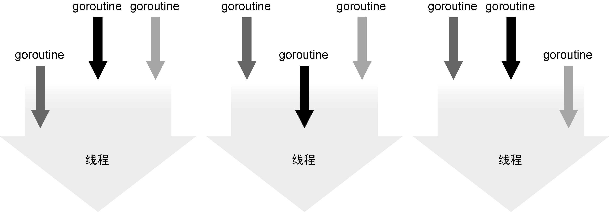
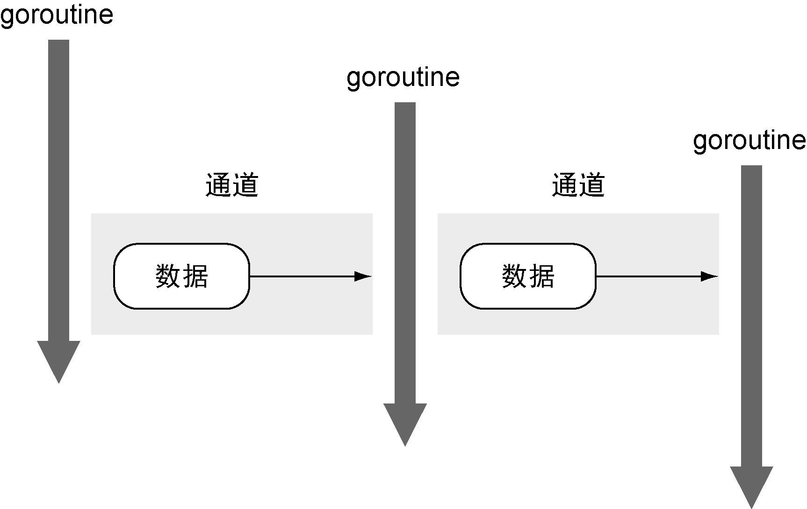
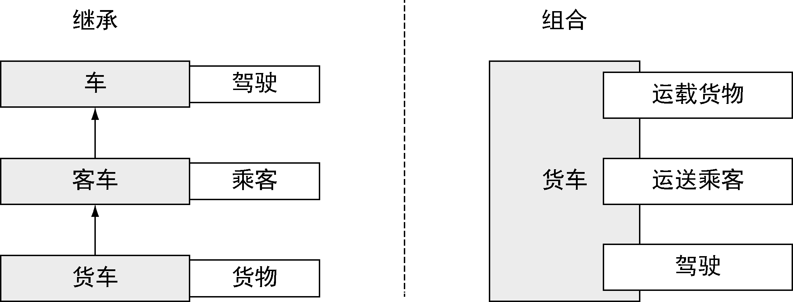
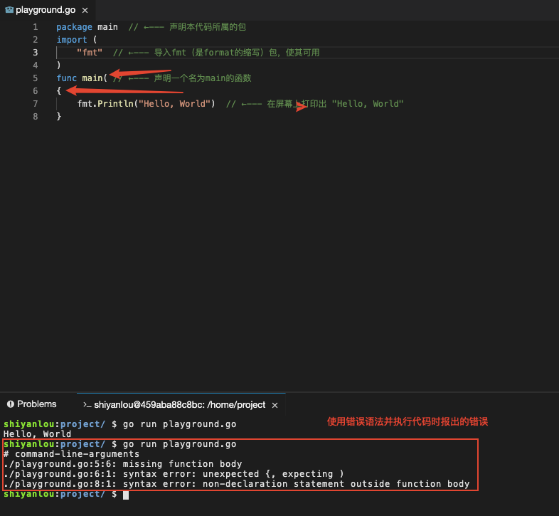

# Go 语言介绍
[[TOC]]

## Go 语言的起源

Go 语言起源 2007 年，并于 2009 年正式对外发布。它从 2009 年 9 月 21 日开始作为谷歌公司 20% 兼职项目，即相关员工利用 20% 的空余时间来参与 Go 语言的研发工作。该项目的三位领导者均是著名的计算机工程师：Robert Griesemer，参与开发 Java HotSpot 虚拟机；Rob Pike，Go 语言项目总负责人，贝尔实验室 Unix 团队成员，参与的项目包括 Plan 9，Inferno 操作系统和 Limbo 编程语言；Ken Thompson，贝尔实验室 Unix 团队成员，C 语言、Unix 和 Plan 9 的创始人之一，与 Rob Pike 共同开发了 UTF-8 字符集规范。2009 年 11 月 10 日，开发团队将 Go 语言项目以 BSD-style 授权（完全开源）正式公布了 Linux 和 Mac OS X 平台上的版本。Hector Chu 于同年 11 月 22 日公布了 Windows 版本。

作为一个开源项目，Go 语言借助开源社区的有生力量达到快速地发展，并吸引更多的开发者来使用并改善它。自该开源项目发布以来，超过 200 名非谷歌员工的贡献者对 Go 语言核心部分提交了超过 1000 个修改建议。在过去的 18 个月里，又有 150 开发者贡献了新的核心代码。这俨然形成了世界上最大的开源团队，并使该项目跻身 Ohloh 前 2% 的行列。大约在 2011 年 4 月 10 日，谷歌开始抽调员工进入全职开发 Go 语言项目。开源化的语言显然能够让更多的开发者参与其中并加速它的发展速度。

在 Go 语言在 2010 年 1 月 8 日被 [Tiobe](http://www.tiobe.com/)（闻名于它的编程语言流行程度排名）宣布为“2009 年年度语言”后，引起各界很大的反响。目前 Go 语言在这项排名中的最高记录是在 2010 年 2 月创下的第 13 名，流行程度 1.778%。

Go 语言开发团队花了很长时间来解决当今软件开发人员面对的问题。开发人员在为项目选择语言时，不得不在快速开发和性能之间做出选择。C 和 C++ 这类语言提供了很快的执行速度，而 Ruby 和 Python 这类语言则擅长快速开发。Go 语言在这两者间架起了桥梁，不仅提供了高性能的语言，同时也让开发更快速。

在探索 Go 语言的过程中，读者会看到精心设计的特性以及简洁的语法。**作为一门语言，Go 不仅定义了能做什么，还定义了不能做什么。Go 语言的语法简洁到只有几个关键字，便于记忆。**Go 语言的编译器速度非常快，有时甚至会让人感觉不到在编译。所以，Go 开发者能显著减少等待项目构建的时间。因为 Go 语言内置并发机制，所以不用被迫使用特定的线程库，就能让软件扩展，使用更多的资源。Go 语言的类型系统简单旦高效，不需要为面向对象开发付出额外的心智，让开发者能专注于代码复用。Go 语言还自带垃圾回收器，不需要用户自己管理内存。

Go 是一门为云计算而生的编程语言。包括亚马逊（Amazon）、苹果（Apple）、科能软件（Canonical）、雪佛龙（Chevron）、迪士尼（Disney）、脸书（Facebook）、通用电气（GE）、谷歌（Google）、Heroku、微软（Microsoft）、Twitch、威瑞森无线（Verizon）和沃尔玛（Walmart）在内的公司都使用了 Go 来开发重要的项目，并且由于诸如 CloudFlare、Cockroach Labs、DigitalOcean、Docker、InfluxData、Iron.io、Let’s Encrypt、Light Code Labs、Red Hat CoreOS、SendGrid 这样的公司以及云原生计算基金会（Cloud Native Computing Foundation）等组织的推动，许多 Web 底层基础设施正在陆续迁移至 Go 之上。

尽管 Go 正在数据中心大放异彩，但它的应用场景并不仅限于工作区域。例如，Ron Evans 和 Adrian Zankich 就创建了用于控制机器人和硬件的 Gobot 库，而 Alan Shreve 则创建了以学习 Go 为目的的开发工具 ngrok 项目，并将该项目转变成自己的全职事业。

为了像下图所示的那只无忧无虑的 Go 吉祥物表示敬意，社区中的 Go 拥护者通常会把自己称为 gopher（地鼠、囊地鼠）。虽然编程路上充满着各式各样的挑战，但通过使用 Go 并阅读本书，我们希望你能够从中发现编程的乐趣。


本章将展示一个运行在 Web 浏览器中的 Go 程序，并基于该程序进行一些实验。

> **请考虑这一点**
>
> 像英语这样的自然语言充斥着各式各样模棱两可的话。例如，当你向数字助理说出“Call me a cab”的时候，它是应该帮你致电出租车公司，还是应该假设你想要把自己的名字改成“a cab”？
>
> 清晰度对于编程语言永远都是最重要的。假如编程语言的语法或者句法允许歧义存在，那么计算机也许就无法完成人们指定的行为，这样一来编程工作将变得毫无意义。
>
> Go 并不是一门完美的语言，但它在清晰度方面所做的努力远超我们之前用过的所有语言。在学习本章内容的时候，你将会看到一些名词缩写以及行业术语。虽然一开始你可能会对某些内容感到陌生，但我们希望你可以多花些时间，字斟句酌，仔细体会 Go 是如何减少语言中的歧义的。

## 什么是Go

Go 是一门编译语言。**在运行程序之前，Go 首先需要使用编译器将用户编写的代码转换为计算机能够理解的 0 和 1。为了便于执行和分发，Go 编译器还会把所有代码整合并编译成一个单独的可执行文件。在编译的过程中，Go 编译器能够捕捉到程序中包括拼写错误在内的一些人为失误。**

并非所有编程语言都需要编译才能运行，如 Python、Ruby 和其他一些流行语言就选择了在程序运行的时候，通过解释器一条接一条地转化代码中的声明，但这也意味着 bug 可能会隐藏在测试尚未触及的代码当中。

不过换个角度来看，解释器不仅能够让开发过程变得迅速且具有交互性，还能够让语言本身变得灵活、轻松和令人愉快。相反，编译语言却常常因为像机器人一样顽固不化、墨守成规而广为人知，并且缓慢的编译速度也常常为人所诟病，然而实际上并非所有编译语言都是如此。

我们想要构造出这样一种语言，它不仅可以像 C++ 和 Java 这类静态编译语言一样安全、高效，还可以像 Python 这类动态类型解释语言一样轻巧且充满乐趣。-- Rob Pike，Geek of the Week

Go 在考虑软件开发的体验方面可谓煞费苦心。首先，即使是大型程序的编译也可以在极短的时间内完成，并且只需要用到一条命令。其次，Go 语言排除了那些可能会导致歧义的特性，鼓励可预测和简明易懂的代码。最后，Go 为 Java 等传统语言死板的数据结构提供了轻量级的替代品。

Java 避免了 C++ 当中许多不常见、难懂和令人迷惑的特性，根据我们的经验，这些特性带来的麻烦要比好处多得多。-- James Gosling，Java: an Overview

每一种新的编程语言都会对以往想法进行改良。与早期语言相比，在 Go 里面高效地使用内存将变得更为容易，出错的可能性也更低，并且 Go 还能利用多核机器上的每个核心获得额外的性能优势。很多成功案例都会把性能提升列举为转向 Go 的其中一个原因。例如，Iron.io 只用了 2 台 Go 服务器就替换了他们原来使用的 30 台 Ruby 服务器；而 Bitly 在使用 Go 重写原有的 Python 应用程序之后也获得了持续、可测量的性能提升，这导致他们在之后把自己的 C 应用程序也“更新换代”成了相应的 Go 版本。

Go 不仅像解释语言一样简单和有趣，还在性能和可靠性上占有优势，并且由于 Go 是一门只包含几种简单概念的小型语言，所以学习起来也相对较快。综上所述，我们得出以下 Go 箴言：

Go 是一门开源编程语言，使用它可以大规模地生产出简单、高效且可信赖的软件。-- Go 品牌手册

> **提示**
>
> 当你在互联网上搜索 Go 的相关话题时，可以使用关键字 golang 来代表 Go 语言。这种将 -lang 后缀添加到语言名字之后的做法也适用于其他编程语言，如 Ruby、Rust 等。

## Go 语言的特性

### 并发编程

作为程序员，要开发出能充分利用硬件资源的应用程序是—件很难的事情。现代计算机都拥有多个核，但是大部分编程语言都没有有效的工具让程序可以轻易利用这些资源。这些语言需要写大量的线程同步代码来利用多个核，很容易导致错误。

Go 语言对并发的支持是这门语言最重要的特性之一。 `goroutine` 很像线程，但是它占用的**内存远少于线程**，使用它需要的代码更少。通道（`channel`）是一种内置的数据结构，可以让用户在不同的 `goroutine` 间**同步发送具有类型的消息**。这让编程模型更倾向于在 `goroutine` 之间发送消息，而不是让多个 `goroutine` 争夺同一个数据的使用权。

#### 并发

`goroutine` 是可以与其他 `goroutine` 并行执行的函数，同时也会与主程序（程序的入口）并行执行。在其他编程语言中，你需要用线程来完成同样的事情，而在 Go 语言中会使用同一个线程来执行多个 `goroutine`。例如，用户在写一个 Web 服务器，希望同时处理不同的 Web 请求，如果使用 C 或者 Java，不得不写大量的额外代码来使用线程。在 Go 语言中，`net/http` 库直接使用了内置的 `goroutine`。每个接收到的请求都自动在其自己的 `goroutine` 里处理。`goroutine` 使用的内存比线程更少，Go 语言运行时会自动在配置的一组逻辑处理器上调度执行 `goroutine`。每个逻辑处理器绑定到一个操作系统线程上。这让用户的应用程序执行效率更高，而开发工作量显著减少。



如果想在执行一段代码的同时，并行去做另外一些事情，`goroutine` 是很好的选择。下面是一个简单的例子：

```go
func log(msg string){
    //记录日志
}

//代码里检测到错误
go log("发生了可怕的事情")
```

关键字 `go` 是唯一需要去编写的代码，调度 `log` 函数作为独立的 `goroutine` 去运行，以便与其他 `goroutine` 并行执行。这意味着应用程序的其余部分会与记录日志并行执行，通常这种并行能让最终用户觉得性能更好。就像之前说的，`goroutine` 占用的資源更少，所以常常能启动成千上万个 `goroutine`。

#### 通道

通道是一种数据结构，可以让 `goroutine`之间进行安全的数据通信。通道可以帮用户避免其他语言里常见的共享内存访问的问题。

并发的**最难的部分就是要确保其他并发运行的进程、线程或 `goroutine` 不会意外修改用户的数据。**当不同的线程在没有同步保护的情况下修改同一个数据时，总会发生灾难。在其他语言中，如果使用全局变量或者共享内存，必须使用复杂的锁规则来防止对同一个变量的不同步修改。

为了解决这个问题，通道提供了—种新模式，从而保证并发修改时的数据安全。**通道这一模式保证同一时刻只会有一个 `goroutine` 修改数据。**通道用于在几个运行的 `goroutine` 之间发送数据。在下图中可以看到数据是如何流动的示例。想象一个应用程序，有多个进程需要顺序读取或者修改某个数据，使用 `goroutine` 和通道，可以为这个过程建立安全的模型。



上图中有 3 个 `goroutine`，还有 2 个不带缓存的通道。第一个 `goroutine` 通过通道把数据传给已经在等待的第二个 `goroutine`。在两个 `goroutine` 间传输数据是同步的，一旦传输完成，两个 `goroutine` 都会知道数据已经完成传输。当第二个 `goroutine` 利用这个数据完成其任务后，将这个数据传给第三个正在等待的 `goroutine`。这次传输依旧是同步的，两个 `goroutine` 都会确认数据传输完成。这种在 `goroutine` 之间安全传输数据的方法不需要任何锁或者同步机制。

需要强调的是，通道并不提供跨 `goroutine` 的数据访问保护机制。如果通过通道传输数据的一份副本，那么每个 `goroutine` 都持有一份副本，各自对自己的副本做修改是安全的。当传输的是指向数据的指针时，如果读和写是由不同的 `goroutine` 完成的，每个 `goroutine` 依旧需要额外的同步动作。

Go 语言引入了 `goroutine`，它是 Go 实现快速高效的并发编程的关键。通过调用 `go` 关键字，我们就可以让函数以 goroutine 的方式进行运行，也就是以协程为单位进行运行。协程比线程更加的轻量级，也更节省系统资源，这使得我们可以创建大量的 goroutine，从而进行轻松且高质量的并发编程。同时，goroutine 内部采用管道 `channel` 进行消息传递，从而实现共享内存。在第五章我们还将对 Go 并发编程进行详细的讲解。

### 错误处理

Go 语言中的错误处理的哲学和 C 语言一样，函数通过返回错误类型 (`error`) 或者 `bool` 类型（不需要区分多种错误状态时）表明函数的执行结果，调用检查返回的错误类型值是否是 `nil` 来判断调用结果。并引入了 defer 关键字用于标准的错误处理流程，并提供了内置函数 `panic`、`recover` 完成异常的抛出与捕捉。

### 垃圾回收

不当的内存管理会导致程序崩溃或者内存泄漏，甚至让整个操作系统崩溃。Go 语言拥有现代化的垃圾回收机制，能帮你解决这个难题。在其他系统语言（如 C 或者 C++）中，使用内存前要先分配这段内存，而且使用完毕后要将其释放掉。哪怕只做错了一件事，都可能导致程序崩溃或者内存泄漏。可惜，追踪内存是否还被使用本身就是十分艰难的事情，而要想支持多线程和高并发，更是让这件事难上加难。虽然 Go 语言的垃圾回收会有一些额外的开销，但是编程时，能显著降低开发难度。Go 语言把无趣的内存管理交给专业的编译器去做，而让程序员专注于更有趣的事。

Go 语言自带垃圾自动回收的功能，让 Go 语言不需要 `delete` 关键字，也不需要 `free()` 来释放内存。因此开发者无需考虑何时需要释放之前分配的内存的问题，系统会自动帮我们判断，并在适当的时候进行垃圾处理。垃圾自动回收是 Go 语言的一个特点，也是一大亮点。

### 多返回值

Go 语言和 Python 一样也支持函数的多返回值功能，这个特性让开发者可以从原来用各种比较别扭的方式返回多个值得痛苦中解脱出来，**不需要为了一次返回多个值而专门定义一个结构体。**并且每个返回值都有自己的名字，开发者还可以选择具体需要返回的值，只需要使用下划线作为占位符来丢掉不要的返回值即可。

### 匿名函数

Go 语言支持常规的匿名函数和闭包，开发者可以随意对匿名函数变量进行传递和调用，下面就是一个匿名函数样例：

```go
f := func(x,y int) int {
    return x+y
}
```

### 开发速度

编译—个大型的 C 或者 C++ 项目所花费的时间甚至比去喝杯叻啡的时间还长。下图是 XKCD 中的一幅漫画，描述了在办公室里开小差的经典借囗。


Go 语言使用了更加智能的编译器，并简化了解决依赖的算法，最终提供了更快的编译速度。编译 Go 程序时，编译器只会关注那些直接被引用的库，而不是像 Java、C 和 C++那样，要遍历依赖链中所有依赖的库。因此，很多 Go 程序可以在 1 秒内编译完。在现代硬件上，编译整个 Go 语言的源码树只需要 20 秒。

因为没有从编译代码到执行代码的中间过程，用动态语言编写应用程序可以快速看到输出。代价是，**动态语言不提供静态语言提供的类型安全特性，不得不经常用大量的测试套件来避免在运行的时候出现类型错误这类 bug。** 想象一下，使用类似 JavaScript 这种动态语言开发一个大型应用程序，有一个函数期望接收一个叫作 10 的字段。这个参数应该是整数，是字符串，还是一个`UUID`？要想知道答案，只能去看源代码。可以尝试使用一个数字或者字符串来执行这个函数，看看会发生什么。在 Go 语言里，完全不用为这件事情操心，因为编译器就能帮用户捕获这种类型错误。

### 类型系统

Go 语言提供了灵活的、无继承的类型系统，无需降低运行性能就能最大程度上复用代码。这个类型系统依然支持面向对象开发，但避免了传统面向对象的问题。如果你曾经在复杂的 Java 和 C++程序上花数周时间考虑如何抽象类和接口，你就能意识到 Go 语言的类型系统有多么简单。Go 开发者使用组合（composition）设计模式，只需简单地将一个类型嵌入到另一个类型，就能复用所有的功能。其他语言也能使用组合，但是不得不和继承绑在一起使用，结果使整个用法非常复杂很难使用。在 Go 语言中，—个类型由其他更微小的类型组合而成，避免了传统的基于继承的模型。

另外，Go 语言还具有独特的接口实现机制，允许用户对行为进行建模，而不是对类型进行建模。在 Go 语言中，不需要声明某个类型实现了某个接口，编译器会判断一个类型的实例是否符合正在使用的接口。Go 标准库里的很多接口都非常简单，只开放几个函数。从实践上讲，尤其对那些使用类似 Java 的面向对象语言的人来说，需要一些时间才能习惯这个特性。

#### 类型

类型简单 Go 语言不仅有类似 `int` 和 `string` 这样的内置类型，还支持用户定义的类型。在 Go 语言中，用户定义的类型通常包含一组带类型的字段，用于存储数据。Go 语言的用户定义的类型看起来和 C 语言的结构很像，用起来也很相似。不过 Go 语言的类型可以声明操作该类型数据的方法。传统语言使用继承来扩展结构— `Client` 继承自 `User`，`User` 继承自 `Entity`，Go 语言与此不同，Go 开发者构建更小的类型— `Custome`和 `Admin`，然后把这些小类型组合成更大的类型。下图展示了继承和组合之间的不同。



#### 接口

接口用于描述类型的行为。如果一个类型的实例实现了—个接口，意味看这个实例可以执行一组特定的行为。你甚至不需要去声明这个实例实现某个接口，只需要实现这组行为就好。其他的语言把这个特性叫作鸭子类型——如果它叫起来像鸭子，那它就可能是只鸭子。Go 语言的接口也是这么做的。在 Go 语言中，如果—个类型实现了—个接口的所有方法，那么这个类型的实例就可以存储在这个接口类型的实例中，不需要额外声明。 在类似 Java 这种严格的面向对象语言中，所有的设计都围绕接口展开。在编码前，用户经常不得不思考一个庞大的继承链。下面是一个 Java 接口的例子：

```java
interface User {
    public void login();
    public void logout();
}
```

在 Java 中要实现这个接口，要求用户的类必须满足 `user` 接口里的所有约束，并且显式声明这个类实现了这个接口。而 Go 语言的接口一般只会描述一个单一的动作。在 Go 语言中，最常使用的接口之一是`io.reader`。这个接口提供了一个简单的方法，用来声明一个类型有数据可以读取。标准库内的其他函数都能理解这个接口。这个接口的定义如下：

```go
type Reader interface {
    Read(p []byte) (n int, err error)
}
```

为了实现 `io.Reader` 这个接口，你只需要实现一个 `Read` 方法，这个方法接受一个 `byte` 切片，返回一个整数和可能出现的错误。

这和传统的面向对象编程语言的接口系统有本质的区别。Go 语言的接口更小，只倾向于定义个单一的动作。实际使用中，这更有利于使用组合来复用代码。用户几乎可以给所有包含数据的类型实现 `io.Reader` 接口，然后把这个类型的实例传给任意个知道如何读取 `io.Reader` 函数。

Go 语言的整个网络库都使用了 `io.Reader` 接口，这样可以将程序的功能和不同网络的实现分离。这样的接口用起来有趣、优雅且自由。文件、缓冲区、套接字以及其他的数据源都实现了 `io.Reader` 接口。使用同一个接口，可以高效地操作数据，而不用考虑到底数据来自哪里。

## Go 语言可以做什么

Go 语言是谷歌发布的第二款开源编程语言。专门针对多处理器系统应用程序的编程进行了优化，使用 Go 编译的程序可以媲美 C 或 C++ 代码的速度，而且更加安全、支持并行进程。

Go 的目标是希望提升现有编程语言对程序库等依赖性 (dependency) 的管理，这些软件元素会被应用程序反复调用。由于存在并行编程模式，因此也被设计用来解决多处理器的任务。目前，已经有很多公司开始使用 Go 语言开发自己的服务，甚至完全转向 Go 开发，也诞生了很多基于 Go 的服务和应用，比如 `Dokcer`、`k8s` 等，现在我们看下，有哪些大公司在用 Go 语言了。

Google 对 Go 寄予厚望。旗下 App Engine 和其他部分产品已经开始使用 Go 语言来编写。作为开发 Go 语言的公司，当仁不让。

Facebook 也在用 GO，还专门在 GitHub 上建立了一个开源组织 Facebookgo，大家可以通过 GitHub 访问查看 Facebook 开源的项目，比如著名的——平滑升级的 grace。

此外，百度、阿里都在招 GO。京东云消息推送系统、云存储以及京东商城等都有使用 Go 做开发。

360 对 Golang 的使用主要是开源的日志搜索系统 Poseidon。而且，360 直播在招聘 Golang 开发工程师。

小米对 Golang 的支持，莫过于运维监控系统的开源，也就是 open-falcon 。此外，小米互娱、小米商城、小米视频、小米生态链等团队都在使用 Golang。


## 包和函数

当我们访问 [Go 官网](https://golang.org/) 时会看到代码清单 1-1 所示的代码，它作为学习 Go 语言的起点真的再合适不过了。

**代码清单 1-1**　与 Go Playground 的初次见面。新建 `playground.go` 文件，并编写以下的代码：

> 如无特殊说明，都默认在 `/home/project` 目录下创建文件，也就是打开 WebIDE 时默认的目录。执行命令时也是如此。

```go
package main  // ←--- 声明本代码所属的包
import (
    "fmt"  // ←--- 导入fmt（是format的缩写）包，使其可用
)
func main() {  // ←--- 声明一个名为main的函数
    fmt.Println("Hello, World")  // ←--- 在屏幕上打印出 "Hello, World"
}
```

尽管这段代码非常简短，但它引入了 `package`、`import` 和 `func` 这 3 个非常重要的关键字，这些保留的关键字都有它们各自的特殊目的。

`package` 关键字声明了代码所属的包，在本例中这个包的名字就是 `main`。所有用 Go 编写的代码都会被组织成各式各样的包，并且每个包都对应一个单独的构想，例如，Go 语言本身就提供了**一个面向数学、压缩、加密、图像处理等领域的标准库。**

在 `package` 关键字之后，代码使用了 `import` 关键字来导入自己将要用到的包。一个包可以包含任意数量的函数。例如，`math` 包提供了诸如 Sin、Cos、Tan 和 Sqrt 等函数，而此处用到的 `fmt` 包则提供了用于格式化输入和输出的函数。因为在屏幕上显示文本是一个非常常用的操作，所以 Go 使用了缩写 `fmt` 作为包名。gopher 通常把这个包的名字读作“FŌŌMT!”，给人的感觉仿佛这个库是使用漫画书上的大爆炸字体撰写的一样。

`func` 关键字用于声明函数，在本例中这个函数的名字就是 `main`。每个函数的体（body）都需要使用大括号 `{}` 包围，这样 Go 才能知道每个函数从何处开始，又在何处结束。

`main` 这一标识符（identifier）具有特殊意义。当我们运行一个 Go 程序的时候，它总是从 `main` 包的 `main` 函数开始运行。如果 `main` 不存在，那么 Go 编译器将报告一个错误，因为它无法得知程序应该从何处开始执行。

为了打印出一个由文本组成的行，例子中的代码使用了 `Println` 函数（其中 ln 为英文 line 的缩写）。每次用到被导入包中的某个函数时，我们都需要在函数的名字前面加上包的名字以及一个点号作为前缀。例如，代码清单 1-1 中的 `Println` 函数前面就带有 `fmt` 后跟一个点号作为前缀，这是因为 `Println` 函数就是由被导入的 `fmt` 包提供的。Go 的这一特性可以让用户在阅读代码的时候立即弄清楚各个函数分别来自哪个包。


当我们需要运行我们编写的代码时，只需在实验楼 WebIDE 终端中执行以下命令：

```bash
go run playground.go
```

代码中被引号包围的文本将输出至屏幕，最终使得文本“Hello, World”出现在实验楼 WebIDE 终端中。


对英语来说，即使缺少一个逗号也有可能使整个句子的意义变得完全不同。同样，标点符号对编程语言来说也是至关重要的。例如，Go 就需要依靠引号、圆括号和大括号等符号来理解用户输入的代码。

## 唯一允许的大括号

Go 对于大括号 `{}` 的摆放位置非常挑剔。在代码清单 1-1 中，左大括号 `{` 与 `func` 关键字位于同一行，而右大括号 `}` 则独占一行。这是 Go 语言唯一允许的大括号放置风格，除此之外的其他大括号放置风格都是不被允许的。

Go 之所以如此严格地限制大括号的放置风格，与这门语言刚刚诞生时出现的一些情况有关。在早期，使用 Go 编写的代码总是无一幸免地带有分号，它们就像迷路的小狗一样跟在每条单独的语句后面，例如：

```go
fmt.Println("Hello, fire hydrant");
```

到了 2009 年 12 月，一群「忍者」gopher 决定把分号从语言中驱逐出去。好吧，这么说也不太准确。实际上，Go 编译器将为你代劳，自动地插入那些可爱的分号。这种机制运行得非常完美，但它的代价就是要求用户必须遵守上面提到的唯一允许的大括号放置风格。


如果用户尝试将左大括号和 `func` 关键字放在不同的行里面，那么 Go 编译器将报告一个语法错误：

```go
func main(  // ←--- 函数体缺失
{  // ←--- 语法错误：在{之前发现了意料之外的分号或新行
}
```



出现这个问题并不是编译器有意刁难，而是由于分号被插到了错误的位置，导致编译器犯了点儿小迷糊，最终才不得不求助于你。

##  第一个 Go 程序

#### HelloWorld

第一个例子当然是 `HelloWorld` 了，让我们通过一个 Go 语言版本的 HelloWorld 来认识这门新语言的模样。

**注意**： `package main`是必须的，而且必须为`main`，负责编译报错。

在 /home/project 新建 `hello.go` 文件，输入以下代码保存：

```go
package main

import (
    "fmt" //导入fmt包，调用其中的Println()函数
)

func main() {
    fmt.Println("Hello，world！")
}
```

在实验楼 WebIDE 终端中运行：

```bash
go run hello.go
```

有时候我们想将我们的程序编译成二进制文件。我们可以通过 `go build` 命令来达到目的。

```bash
$ go build hello_world.go
$ ls
hello_world    hello_world.go
```

然后我们可以直接运行这个二进制文件。

```bash
$ ./hello_world
hello world
```

#### 参考文档

本课程的文档部分参考了以下文档。

- [Go 语言官方文档](http://golang.org/doc/)
- [Go 入门指南](https://github.com/Unknwon/the-way-to-go_ZH_CN)
- [Go web 编程](https://github.com/astaxie/build-web-application-with-golang/blob/master/LICENSE.md)

