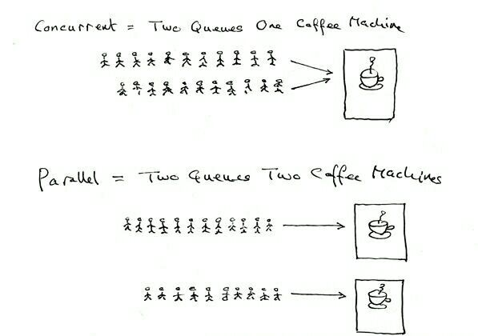

# 并发编程
[[TOC]]

Go 语言的核心——并发编程。其理念我们引用 Go 社区的一句话就是“不要通过共享内存来通信，而应该通过通信来共享内存”。

### 并发编程

你很可能从某种途径听说过 Go 语言。它越来越受欢迎，并且有充分的理由可以证明。 Go 快速、简单，有强大的社区支持。学习这门语言最令人兴奋的一点是它的并发模型。 Go 的并发原语使创建多线程并发程序变得简单而有趣。我们将通过本实验介绍，希望能点透相关概念以方便后续学习。

#### 并发与并行

并发指在同一时刻只能有一条指令执行，但多个进程指令被快速的轮换执行，使得在宏观上具有多个进程同时执行的效果，但在微观上并不是同时执行的，只是把时间分成若干段，通过 CPU 时间片轮转使多个进程快速交替的执行。而并行的关键是你有同时处理多个任务的能力。并发和并行都可以是很多个线程，就看这些线程能不能同时被（多个）CPU 执行，如果可以就说明是并行，而并发是多个线程被（一个）CPU 轮流切换着执行。一个经典且通俗易懂的例子这样解释并发与并行的区别：并发是两个队列，使用一台咖啡机；并行是两个队列，使用两台咖啡机。如果串行，一个队列使用一台咖啡机，那么哪怕前面那个人有事出去了半天，后面的人也只能等着他回来才能去接咖啡，这效率无疑是最低的。图解：



#### 协程

协程也叫轻量级线程。与传统的进程和线程相比，协程最大的优点就在于其足够“轻”，操作系统可以轻松创建上百万个协程而不会导致系统资源枯竭，而线程和进程通常最多不过近万个。而多数语言在语法层面上是不支持协程的，一般都是通过库的方式进行支持，但库的支持方式和功能不够完善，经常会引发阻塞等一系列问题，而 Go 语言在语法层面上支持协程，也叫 `goroutine`。这让协程变得非常简单，让轻量级线程的切换管理不再依赖于系统的进程和线程，也不依赖 CPU 的数量。

```go
// _Go 协程_ 在执行上来说是轻量级的线程。

package main

import "fmt"

func f(from string) {
    for i := 0; i < 3; i++ {
        fmt.Println(from, ":", i)
    }
}

func main() {

    // 假设我们有一个函数叫做 `f(s)`。我们使用一般的方式
    // 调并同时运行。
    f("direct")

    // 使用 `go f(s)` 在一个 Go 协程中调用这个函数。
    // 这个新的 Go 协程将会并行的执行这个函数调用。
    go f("goroutine")

    // 你也可以为匿名函数启动一个 Go 协程。
    go func(msg string) {
        fmt.Println(msg)
    }("going")

    // 现在这两个 Go 协程在独立的 Go 协程中异步的运行，所以
    // 我们需要等它们执行结束。这里的 `Scanln` 代码需要我们
    // 在程序退出前按下任意键结束。
    var input string
    fmt.Scanln(&input)
    fmt.Println("done")
}
```

**通道**

```go
// _通道_ 是连接多个 Go 协程的管道。你可以从一个 Go 协程
// 将值发送到通道，然后在别的 Go 协程中接收。

package main

import "fmt"

func main() {

    // 使用 `make(chan val-type)` 创建一个新的通道。
    // 通道类型就是他们需要传递值的类型。
    messages := make(chan string)

    // 使用 `channel <-` 语法 _发送_ 一个新的值到通道中。这里
    // 我们在一个新的 Go 协程中发送 `"ping"` 到上面创建的
    // `messages` 通道中。
    go func() { messages <- "ping" }()

    // 使用 `<-channel` 语法从通道中 _接收_ 一个值。这里
    // 将接收我们在上面发送的 `"ping"` 消息并打印出来。
    msg := <-messages
    fmt.Println(msg)
}
```


**通道缓冲**

```go
// 默认通道是 _无缓冲_ 的，这意味着只有在对应的接收（`<- chan`）
// 通道准备好接收时，才允许进行发送（`chan <-`）。_可缓存通道_
// 允许在没有对应接收方的情况下，缓存限定数量的值。

package main

import "fmt"

func main() {

    // 这里我们 `make` 了一个通道，最多允许缓存 2 个值。
    messages := make(chan string, 2)

    // 因为这个通道是有缓冲区的，即使没有一个对应的并发接收
    // 方，我们仍然可以发送这些值。
    messages <- "buffered"
    messages <- "channel"

    // 然后我们可以像前面一样接收这两个值。
    fmt.Println(<-messages)
    fmt.Println(<-messages)
}
```


**通道同步**

```go
// 我们可以使用通道来同步 Go 协程间的执行状态。这里是一个
// 使用阻塞的接受方式来等待一个 Go 协程的运行结束。

package main

import "fmt"
import "time"

// 这是一个我们将要在 Go 协程中运行的函数。`done` 通道
// 将被用于通知其他 Go 协程这个函数已经工作完毕。
func worker(done chan bool) {
    fmt.Print("working...")
    time.Sleep(time.Second)
    fmt.Println("done")

    // 发送一个值来通知我们已经完工啦。
    done <- true
}

func main() {

    // 运行一个 worker Go协程，并给予用于通知的通道。
    done := make(chan bool, 1)
    go worker(done)

    // 程序将在接收到通道中 worker 发出的通知前一直阻塞。
    <-done
}
```


**通道方向**

```go
// 当使用通道作为函数的参数时，你可以指定这个通道是不是
// 只用来发送或者接收值。这个特性提升了程序的类型安全性。

package main

import "fmt"

// `ping` 函数定义了一个只允许发送数据的通道。尝试使用这个通
// 道来接收数据将会得到一个编译时错误。
func ping(pings chan<- string, msg string) {
    pings <- msg
}

// `pong` 函数允许通道（`pings`）来接收数据，另一通道
// （`pongs`）来发送数据。
func pong(pings <-chan string, pongs chan<- string) {
    msg := <-pings
    pongs <- msg
}

func main() {
    pings := make(chan string, 1)
    pongs := make(chan string, 1)
    ping(pings, "passed message")
    pong(pings, pongs)
    fmt.Println(<-pongs)
}
```


**通道选择器**

```go
package main

import "time"
import "fmt"

func main() {

    // 在我们的例子中，我们将从两个通道中选择。
    c1 := make(chan string)
    c2 := make(chan string)

    // 各个通道将在若干时间后接收一个值，这个用来模拟例如
    // 并行的 Go 协程中阻塞的 RPC 操作
    go func() {
        time.Sleep(time.Second * 1)
        c1 <- "one"
    }()
    go func() {
        time.Sleep(time.Second * 2)
        c2 <- "two"
    }()

    // 我们使用 `select` 关键字来同时等待这两个值，并打
    // 印各自接收到的值。
    for i := 0; i < 2; i++ {
        select {
        case msg1 := <-c1:
            fmt.Println("received", msg1)
        case msg2 := <-c2:
            fmt.Println("received", msg2)
        }
    }
}
```


###  goroutine

`goroutine` 是 Go 语言并行设计的核心。`goroutine` 是一种比线程更轻量的实现，十几个 `goroutine` 可能在底层就是几个线程。 不同的是，Golang 在 runtime、系统调用等多方面对 `goroutine` 调度进行了封装和处理，当遇到长时间执行或者进行系统调用时，会主动把当前 `goroutine` 的 CPU (P) 转让出去，让其他 `goroutine` 能被调度并执行，也就是 Golang 从语言层面支持了协程。要使用 `goroutine` 只需要简单的在需要执行的函数前添加 `go` 关键字即可。当执行 `goroutine` 时候，Go 语言立即返回，接着执行剩余的代码，`goroutine` 不阻塞主线程。下面我们通过一小段代码来讲解 `go` 的使用：

```go
//首先我们先实现一个 Add()函数
func Add(a, b int) {
    c := a + b
    fmt.Println(c)
}

go Add(1, 2) //使用go关键字让函数并发执行
```

Go 的并发执行就是这么简单，当在一个函数前加上 `go` 关键字，该函数就会在一个新的 goroutine 中并发执行，当该函数执行完毕时，这个新的 goroutine 也就结束了。不过需要注意的是，如果该函数具有返回值，那么返回值会被丢弃。所以什么时候用 `go` 还需要酌情考虑。

接着我们通过一个案例来体验一下 Go 的并发到底是怎么样的。新建源文件 `goroutine.go`，输入以下代码：

```go
package main

import "fmt"

func Add(a, b int) {
    c := a + b
    fmt.Println(c)
}

func main() {
    for i := 0; i < 10; i++ {
        go Add(i, i)
    }
}
```

执行 `goroutine.go` 文件会发现屏幕上什么都没有，但程序并不会报错，这是什么原因呢？原来当主程序执行到 for 循环时启动了 10 个 `goroutine`，然后主程序就退出了，而启动的 10 个 `goroutine` 还没来得及执行 `Add()` 函数，所以程序不会有任何输出。也就是说主 `goroutine` 并不会等待其他 `goroutine` 执行结束。那么如何解决这个问题呢？Go 语言提供的信道（`channel`）就是专门解决并发通信问题的，下一节我们将详细介绍。

### channel

`channel` 是`goroutine` 之间互相通讯的东西。类似我们 Unix 上的管道（可以在进程间传递消息），用来 `goroutine` 之间发消息和接收消息。其实，就是在做 `goroutine` 之间的内存共享。`channel` 是类型相关的，也就是说一个 `channel` 只能传递一种类型的值，这个类型需要在 `channel` 声明时指定。

#### 声明与初始化

`channel` 的一般声明形式：**var** chanName **chan** ElementType。

与普通变量的声明不同的是在类型前面加了 `channel` 关键字，`ElementType` 则指定了这个 `channel` 所能传递的元素类型。示例：

```go
var a chan int //声明一个传递元素类型为int的channel
var b chan float64
var c chan string
```

初始化一个 `channel` 也非常简单，直接使用 Go 语言内置的 `make()` 函数，示例：

```go
a := make(chan int) //初始化一个int型的名为a的channel
b := make(chan float64)
c := make(chan string)
```

`channel` 最频繁的操作就是写入和读取，这两个操作也非常简单，示例：

```go
a := make(chan int)
a <- 1  //将数据写入channel
z := <-a  //从channel中读取数据
```

#### 通道遍历

在前面的例子中，我们讲过 `for` 和 `range`为基本的数据结构提供了迭代的功能。我们也可以使用这个语法来遍历从通道中取得的值。

```go
package main

import "fmt"

func main() {

    // 我们将遍历在 `queue` 通道中的两个值。
    queue := make(chan string, 2)
    queue <- "one"
    queue <- "two"
    close(queue)

    // 这个 `range` 迭代从 `queue` 中得到的每个值。因为我们
    // 在前面 `close` 了这个通道，这个迭代会在接收完 2 个值
    // 之后结束。如果我们没有 `close` 它，我们将在这个循环中
    // 继续阻塞执行，等待接收第三个值
    for elem := range queue {
        fmt.Println(elem)
    }
}
```


###  select

`select` 用于处理异步 IO 问题，它的语法与 `switch` 非常类似。由 `select` 开始一个新的选择块，每个选择条件由 `case` 语句来描述，并且每个 `case` 语句里必须是一个 `channel` 操作。它既可以用于 `channel` 的数据接收，也可以用于 `channel` 的数据发送。如果 `select` 的多个分支都满足条件，则会随机的选取其中一个满足条件的分支。

新建源文件 `channel.go`，输入以下代码：

```go
package main
import "time"
import "fmt"
func main() {
    c1 := make(chan string)
    c2 := make(chan string)
    go func() {
        time.Sleep(time.Second * 1)
        c1 <- "one"
    }()
    go func() {
        time.Sleep(time.Second * 2)
        c2 <- "two"
    }()
    for i := 0; i < 2; i++ {
        select {
        case msg1 := <-c1:
            fmt.Println("received", msg1)
        case msg2 := <-c2:
            fmt.Println("received", msg2)
        }
    }
}
```

以上代码先初始化两个 `channel` c1 和 c2，然后开启两个 `goroutine` 分别往 c1 和 c2 写入数据，再通过 `select` 监听两个 `channel`，从中读取数据并输出。

运行结果如下：

```bash
$ go run channel.go
received one
received two
```


### 超时机制

通过前面的内容我们了解到，`channel` 的读写操作非常简单，只需要通过 `<-` 操作符即可实现，但是 `channel` 的使用不当却会带来大麻烦。我们先来看之前的一段代码：

```go
a := make(chan int)
a <- 1
z := <-a
```

观察上面三行代码，第 2 行往 `channel` 内写入了数据，第 3 行从 `channel` 中读取了数据，如果程序运行正常当然不会出什么问题，可如果第二行数据写入失败，或者 `channel` 中没有数据，那么第 3 行代码会因为永远无法从 `a` 中读取到数据而一直处于阻塞状态。相反的，如果 `channel` 中的数据一直没有被读取，那么写入操作也会一直处于阻塞状态。如果不正确处理这个情况，很可能会导致整个 `goroutine` 锁死，这就是超时问题。Go 语言没有针对超时提供专门的处理机制，但是我们却可以利用 `select` 来巧妙地实现超时处理机制，下面看一个示例：

```go
t := make(chan bool)
go func {
    time.Sleep(1e9) //等待1秒
    t <- true
}

select {
    case <-ch:  //从ch中读取数据

    case <-t:  //如果1秒后没有从ch中读取到数据，那么从t中读取，并进行下一步操作
}
```

这样的方法就可以让程序在等待 1 秒后继续执行，而不会因为 ch 读取等待而导致程序停滞，从而巧妙地实现了超时处理机制，这种方法不仅简单，在实际项目开发中也是非常实用的。

超时对于一个连接外部资源，或者其它一些需要花费执行时间的操作的程序而言是很重要的。得益于通道和 `select`，在 Go 中实现超时操作是简洁而优雅的。

```go
package main

import "time"
import "fmt"

func main() {

    // 在我们的例子中，假如我们执行一个外部调用，并在 2 秒后
    // 通过通道 `c1` 返回它的执行结果。
    c1 := make(chan string, 1)
    go func() {
        time.Sleep(time.Second * 2)
        c1 <- "result 1"
    }()

    // 这里是使用 `select` 实现一个超时操作。
    // `res := <- c1` 等待结果，`<-Time.After` 等待超时
    // 时间 1 秒后发送的值。由于 `select` 默认处理第一个
    // 已准备好的接收操作，如果这个操作超过了允许的 1 秒
    // 的话，将会执行超时 case。
    select {
    case res := <-c1:
        fmt.Println(res)
    case <-time.After(time.Second * 1):
        fmt.Println("timeout 1")
    }

    // 如果我允许一个长一点的超时时间 3 秒，将会成功的从 `c2`
    // 接收到值，并且打印出结果。
    c2 := make(chan string, 1)
    go func() {
        time.Sleep(time.Second * 2)
        c2 <- "result 2"
    }()
    select {
    case res := <-c2:
        fmt.Println(res)
    case <-time.After(time.Second * 3):
        fmt.Println("timeout 2")
    }
}

// todo: cancellation?
```

常规的通过通道发送和接收数据是阻塞的。然而，我们可以使用带一个 `default` 子句的 `select` 来实现非阻塞的发送、接收，甚至是非阻塞的多路 `select`。

```go
package main

import "fmt"

func main() {
    messages := make(chan string)
    signals := make(chan bool)

    // 这里是一个非阻塞接收的例子。如果在 `messages` 中
    // 存在，然后 `select` 将这个值带入 `<-messages` `case`
    // 中。如果不是，就直接到 `default` 分支中。
    select {
    case msg := <-messages:
        fmt.Println("received message", msg)
    default:
        fmt.Println("no message received")
    }

    // 一个非阻塞发送的实现方法和上面一样。
    msg := "hi"
    select {
    case messages <- msg:
        fmt.Println("sent message", msg)
    default:
        fmt.Println("no message sent")
    }

    // 我们可以在 `default` 前使用多个 `case` 子句来实现
    // 一个多路的非阻塞的选择器。这里我们视图在 `messages`
    // 和 `signals` 上同时使用非阻塞的接受操作。
    select {
    case msg := <-messages:
        fmt.Println("received message", msg)
    case sig := <-signals:
        fmt.Println("received signal", sig)
    default:
        fmt.Println("no activity")
    }
}
```


#### channel 的关闭

`channel` 的关闭非常简单，使用 Go 语言内置的 `close()` 函数即可关闭 `channel`，示例：

```go
ch := make(chan int)
close(ch)
```

关闭了 `channel` 后如何查看 `channel` 是否关闭成功了呢？很简单，我们可以在读取 `channel` 时采用多重返回值的方式，示例：

```go
x, ok := <-ch
```

通过查看第二个返回值的 `bool` 值即可判断 `channel` 是否关闭，若为 `false` 则表示 `channel` 被关闭，反之则没有关闭。

关闭一个通道意味着不能再向这个通道发送值了。这个特性可以用来给这个通道的接收方传达工作已将完成的信息。

```go
package main

import "fmt"

// 在这个例子中，我们将使用一个 `jobs` 通道来传递 `main()` 中 Go
// 协程任务执行的结束信息到一个工作 Go 协程中。当我们没有多余的
// 任务给这个工作 Go 协程时，我们将 `close` 这个 `jobs` 通道。
func main() {
    jobs := make(chan int, 5)
    done := make(chan bool)

    // 这是工作 Go 协程。使用 `j, more := <- jobs` 循环的从
    // `jobs` 接收数据。在接收的这个特殊的二值形式的值中，
    // 如果 `jobs` 已经关闭了，并且通道中所有的值都已经接收
    // 完毕，那么 `more` 的值将是 `false`。当我们完成所有
    // 的任务时，将使用这个特性通过 `done` 通道去进行通知。
    go func() {
        for {
            j, more := <-jobs
            if more {
                fmt.Println("received job", j)
            } else {
                fmt.Println("received all jobs")
                done <- true
                return
            }
        }
    }()

    // 这里使用 `jobs` 发送 3 个任务到工作函数中，然后
    // 关闭 `jobs`。
    for j := 1; j <= 3; j++ {
        jobs <- j
        fmt.Println("sent job", j)
    }
    close(jobs)
    fmt.Println("sent all jobs")

    // 我们使用前面学到的[通道同步](../channel-synchronization/)
    // 方法等待任务结束。
    <-done
}
```

### 定时器

我们常常需要在后面一个时刻运行 Go 代码，或者在某段时间间隔内重复运行。Go 的内置 *定时器* 和 *打点器* 特性让这写很容易实现。我们将先学习定时器，然后再学习打点器。

```go
package main

import "time"
import "fmt"

func main() {

    // 定时器表示在未来某一时刻的独立事件。你告诉定时器
    // 需要等待的时间，然后它将提供一个用于通知的通道。
    // 这里的定时器将等待 2 秒。
    timer1 := time.NewTimer(time.Second * 2)

    // `<-timer1.C` 直到这个定时器的通道 `C` 明确的发送了
    // 定时器失效的值之前，将一直阻塞。
    <-timer1.C
    fmt.Println("Timer 1 expired")

    // 如果你需要的仅仅是单纯的等待，你需要使用 `time.Sleep`。
    // 定时器是有用原因之一就是你可以在定时器失效之前，取消这个
    // 定时器。这是一个例子
    timer2 := time.NewTimer(time.Second)
    go func() {
        <-timer2.C
        fmt.Println("Timer 2 expired")
    }()
    stop2 := timer2.Stop()
    if stop2 {
        fmt.Println("Timer 2 stopped")
    }
}
```

### 打点器

定时器是当你想要在未来某一刻执行一次时使用的 - *打点器* 则是当你想要在固定的时间间隔重复执行准备的。这里是一个打点器的例子，它将定时的执行，直到我们将它停止。

```go
package main

import "time"
import "fmt"

func main() {

    // 打点器和定时器的机制有点相似：一个通道用来发送数据。
    // 这里我们在这个通道上使用内置的 `range` 来迭代值每隔
    // 500ms 发送一次的值。
    ticker := time.NewTicker(time.Millisecond * 500)
    go func() {
        for t := range ticker.C {
            fmt.Println("Tick at", t)
        }
    }()

    // 打点器可以和定时器一样被停止。一旦一个打点停止了，
    // 将不能再从它的通道中接收到值。我们将在运行后 1500ms
    // 停止这个打点器。
    time.Sleep(time.Millisecond * 1500)
    ticker.Stop()
    fmt.Println("Ticker stopped")
}
```

### 工作池

```go
package main

import "fmt"
import "time"

// 这是我们将要在多个并发实例中支持的任务了。这些执行者
// 将从 `jobs` 通道接收任务，并且通过 `results` 发送对应
// 的结果。我们将让每个任务间隔 1s 来模仿一个耗时的任务。
func worker(id int, jobs <-chan int, results chan<- int) {
    for j := range jobs {
        fmt.Println("worker", id, "processing job", j)
        time.Sleep(time.Second)
        results <- j * 2
    }
}

func main() {

    // 为了使用 worker 工作池并且收集他们的结果，我们需要
    // 2 个通道。
    jobs := make(chan int, 100)
    results := make(chan int, 100)

    // 这里启动了 3 个 worker，初始是阻塞的，因为
    // 还没有传递任务。
    for w := 1; w <= 3; w++ {
        go worker(w, jobs, results)
    }

    // 这里我们发送 9 个 `jobs`，然后 `close` 这些通道
    // 来表示这些就是所有的任务了。

    for j := 1; j <= 9; j++ {
        jobs <- j
    }
    close(jobs)

    // 最后，我们收集所有这些任务的返回值。
    for a := 1; a <= 9; a++ {
        <-results
    }
}
```

### 原子计数器

Go 中最主要的状态管理方式是通过通道间的沟通来完成的，我们在 *工作池* 的例子中碰到过，但是还是有一些其他的方法来管理状态的。这里我们将看看如何使用 `sync/atomic`包在多个 Go 协程中进行 *原子计数* 。

```go
package main

import "fmt"
import "time"
import "sync/atomic"
import "runtime"

func main() {

    // 我们将使用一个无符号整形数来表示（永远是正整数）这个计数器。
    var ops uint64 = 0

    // 为了模拟并发更新，我们启动 50 个 Go 协程，对计数
    // 器每隔 1ms （译者注：应为非准确时间）进行一次加一操作。
    for i := 0; i < 50; i++ {
        go func() {
            for {
                // 使用 `AddUint64` 来让计数器自动增加，使用
                // `&` 语法来给出 `ops` 的内存地址。
                atomic.AddUint64(&ops, 1)

                // 允许其它 Go 协程的执行
                runtime.Gosched()
            }
        }()
    }

    // 等待一秒，让 ops 的自加操作执行一会。
    time.Sleep(time.Second)

    // 为了在计数器还在被其它 Go 协程更新时，安全的使用它，
    // 我们通过 `LoadUint64` 将当前值得拷贝提取到 `opsFinal`
    // 中。和上面一样，我们需要给这个函数所取值的内存地址 `&ops`
    opsFinal := atomic.LoadUint64(&ops)
    fmt.Println("ops:", opsFinal)
}
```

### 互斥锁

用原子操作来管理简单的计数器。对于更加复杂的情况，我们可以使用一个[互斥锁](http://zh.wikipedia.org/wiki/互斥锁)来在 Go 协程间安全的访问数据。

```go
package main

import (
    "fmt"
    "math/rand"
    "runtime"
    "sync"
    "sync/atomic"
    "time"
)

func main() {

    // 在我们的例子中，`state` 是一个 map。
    var state = make(map[int]int)

    // 这里的 `mutex` 将同步对 `state` 的访问。
    var mutex = &sync.Mutex{}

    // we'll see later, `ops` will count how many
    // operations we perform against the state.
    // 为了比较基于互斥锁的处理方式和我们后面将要看到的其他
    // 方式，`ops` 将记录我们对 state 的操作次数。
    var ops int64 = 0

    // 这里我们运行 100 个 Go 协程来重复读取 state。
    for r := 0; r < 100; r++ {
        go func() {
            total := 0
            for {

                // 每次循环读取，我们使用一个键来进行访问，
                // `Lock()` 这个 `mutex` 来确保对 `state` 的
                // 独占访问，读取选定的键的值，`Unlock()` 这个
                // mutex，并且 `ops` 值加 1。
                key := rand.Intn(5)
                mutex.Lock()
                total += state[key]
                mutex.Unlock()
                atomic.AddInt64(&ops, 1)

                // 为了确保这个 Go 协程不会再调度中饿死，我们
                // 在每次操作后明确的使用 `runtime.Gosched()`
                // 进行释放。这个释放一般是自动处理的，像例如
                // 每个通道操作后或者 `time.Sleep` 的阻塞调用后
                // 相似，但是在这个例子中我们需要手动的处理。
                runtime.Gosched()
            }
        }()
    }

    // 同样的，我们运行 10 个 Go 协程来模拟写入操作，使用
    // 和读取相同的模式。
    for w := 0; w < 10; w++ {
        go func() {
            for {
                key := rand.Intn(5)
                val := rand.Intn(100)
                mutex.Lock()
                state[key] = val
                mutex.Unlock()
                atomic.AddInt64(&ops, 1)
                runtime.Gosched()
            }
        }()
    }

    // 让这 10 个 Go 协程对 `state` 和 `mutex` 的操作
    // 运行 1 s。
    time.Sleep(time.Second)

    // 获取并输出最终的操作计数。
    opsFinal := atomic.LoadInt64(&ops)
    fmt.Println("ops:", opsFinal)

    // 对 `state` 使用一个最终的锁，显示它是如何结束的。
    mutex.Lock()
    fmt.Println("state:", state)
    mutex.Unlock()
}
```

### Go状态协程

用互斥锁进行了明确的锁定来让共享的 state 跨多个 Go 协程同步访问。另一个选择是使用内置的 Go 协程和通道的的同步特性来达到同样的效果。这个基于通道的方法和 Go 通过通信以及每个 Go 协程间通过通讯来共享内存，确保每块数据有单独的 Go 协程所有的思路是一致的。

```go
package main

import (
    "fmt"
    "math/rand"
    "sync/atomic"
    "time"
)

// 在这个例子中，state 将被一个单独的 Go 协程拥有。这就
// 能够保证数据在并行读取时不会混乱。为了对 state 进行
// 读取或者写入，其他的 Go 协程将发送一条数据到拥有的 Go
// 协程中，然后接收对应的回复。结构体 `readOp` 和 `writeOp`
// 封装这些请求，并且是拥有 Go 协程响应的一个方式。
type readOp struct {
    key  int
    resp chan int
}
type writeOp struct {
    key  int
    val  int
    resp chan bool
}

func main() {

    // 和前面一样，我们将计算我们执行操作的次数。
    var ops int64

    // `reads` 和 `writes` 通道分别将被其他 Go 协程用来发
    // 布读和写请求。
    reads := make(chan *readOp)
    writes := make(chan *writeOp)

    // 这个就是拥有 `state` 的那个 Go 协程，和前面例子中的
    // map一样，不过这里是被这个状态协程私有的。这个 Go 协程
    // 反复响应到达的请求。先响应到达的请求，然后返回一个值到
    // 响应通道 `resp` 来表示操作成功（或者是 `reads` 中请求的值）
    go func() {
        var state = make(map[int]int)
        for {
            select {
            case read := <-reads:
                read.resp <- state[read.key]
            case write := <-writes:
                state[write.key] = write.val
                write.resp <- true
            }
        }
    }()

    // 启动 100 个 Go 协程通过 `reads` 通道发起对 state 所有者
    // Go 协程的读取请求。每个读取请求需要构造一个 `readOp`，
    // 发送它到 `reads` 通道中，并通过给定的 `resp` 通道接收
    // 结果。
    for r := 0; r < 100; r++ {
        go func() {
            for {
                read := &readOp{
                    key:  rand.Intn(5),
                    resp: make(chan int)}
                reads <- read
                <-read.resp
                atomic.AddInt64(&ops, 1)
            }
        }()
    }

    // 用相同的方法启动 10 个写操作。
    for w := 0; w < 10; w++ {
        go func() {
            for {
                write := &writeOp{
                    key:  rand.Intn(5),
                    val:  rand.Intn(100),
                    resp: make(chan bool)}
                writes <- write
                <-write.resp
                atomic.AddInt64(&ops, 1)
            }
        }()
    }

    // 让 Go 协程们跑 1s。
    time.Sleep(time.Second)

    // 最后，获取并报告 `ops` 值。
    opsFinal := atomic.LoadInt64(&ops)
    fmt.Println("ops:", opsFinal)
}
```

