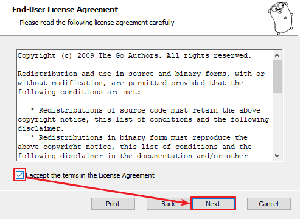
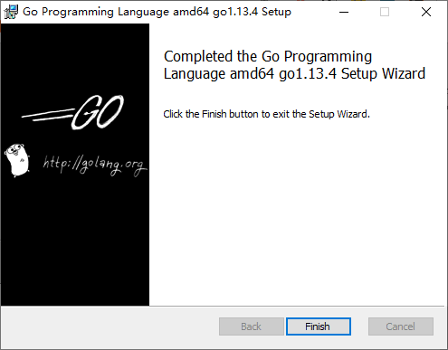
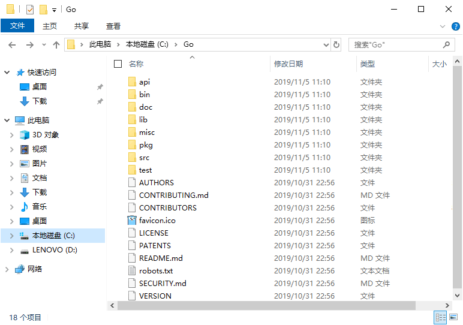

# IDE及环境配置
[[TOC]]

## Go 开发工具

### linux安装

#### GOROOT 与 GOPATH

在介绍常用 IDE 之前，我们先来了解一下 Go 的环境变量配置，实际上在之前的课程中我们已经有所介绍了。

**GOROOT**

就是 go 的安装路径。在 `~/.bash_profile` 中添加下面语句：

```bash
GOROOT=/usr/local/go
export GOROOT
```

当然，要执行 go 命令和 go 工具，就要配置 go 的可执行文件的路径。 操作如下：

在 `~/.bash_profile` 中配置如下：

```bash
export $PATH:$GOROOT/bin
```

**GOPATH**

GOPATH 是作为编译后二进制的存放目的地和 import 包时的搜索路径 （其实也是你的工作目录，你可以在 src 下创建你自己的 go 源文件，然后开始工作）。

GOPATH 之下主要包含三个目录：

- `bin`：目录主要存放可执行文件；
- `pkg`：目录存放编译好的库文件；
- `src`：目录下主要存放 Go 的源文件。

不要把 GOPATH 设置成 Go 的安装路径，可以自己在用户目录下面创建一个目录，如 gopath。操作如下：

```bash
cd ~
mkdir gopath

# 在 ~/.bash_profile 中添加如下语句:
GOPATH=/Users/username/gopath
```

### windows安装

#### 下载Go语言开发包

大家可以在Go语言官网（https://golang.google.cn/dl/）下载 Windows 系统下的Go语言开发包，如下图所示。


这里我们下载的是 64 位的开发包，如果读者的电脑是 32 位系统的话，则需要下载 32 位的开发包，在上图所示页面中向下滚动即可找到 32 位开发包的下载地址，如下图所示。


注意：下载 Windows 版本的Go语言开发包时尽量选择 MSI 格式，因为它可以直接安装到系统，不需要额外的操作。

#### 安装Go语言开发包

双击我们下载好的Go语言开发包即可启动安装程序，如下图所示，这是Go语言的用户许可协议，无需管它，直接勾选“I accept ...”然后点击“Next”即可。





在 Windows 系统下Go语言开发包会默认安装到 C 盘的 Go 目录下，推荐在这个目录下安装，使用起来较为方便。当然，你也可以选择其他的安装目录，确认无误后点击“Next”，如下图所示：


Go语言开发包的安装没有其他需要设置的选项，点击“Install”即可开始安装，如下图所示：


等待程序完成安装，然后点击“Finish”退出安装程序。




安装完成后，在我们所设置的安装目录下将生成一些目录和文件，如下图所示：





这个目录的结构遵守 GOPATH 规则，后面的章节会提到这个概念。目录中各个文件夹的含义如下表所示。


| 目录名 | 说明                                                         |
| ------ | ------------------------------------------------------------ |
| api    | 每个版本的 api 变更差异                                      |
| bin    | go 源码包编译出的编译器（go）、文档工具（godoc）、格式化工具（gofmt） |
| doc    | 英文版的 Go 文档                                             |
| lib    | 引用的一些库文件                                             |
| misc   | 杂项用途的文件，例如 [Android](http://c.biancheng.net/android/) 平台的编译、git 的提交钩子等 |
| pkg    | Windows 平台编译好的中间文件                                 |
| src    | 标准库的源码                                                 |
| test   | 测试用例                                                     |


开发时，无须关注这些目录。如果读者希望深度了解底层原理，可以通过上面的介绍继续探索。

#### 设置环境变量

开发包安装完成后，我们还需要配置一下`GOPATH `环境变量，之后才可以使用Go语言进行开发。GOPATH 是一个路径，用来存放开发中需要用到的代码包。

在桌面或者资源管理器右键“此电脑”（或者“我的电脑”）→“属性”→“高级系统设置”→“环境变量”，如下图所示。


在弹出的菜单里找到 GOPATH 对应的选项点击编辑之后就可以修改了，没有的话可以选择新建，并将变量名填写为 GOPATH，变量值设置为任意目录均可（尽量选择空目录），例如 D:\Go。


提示：填写完成后，每个打开的窗口都需要点击“确定”来保存设置。

其它的环境变量安装包均会进行自动设置。在默认情况下，Go 将会被安装在目录 c:\go 下，但如果你在安装过程中修改安装目录，则可能需要手动修改所有的环境变量的值。

环境变量设置好后，可以通过`go env `命令来进行测试。

```bash
C:\Users\Administrator>go env
set GO111MODULE=
set GOARCH=amd64
set GOBIN=
set GOCACHE=C:\Users\Administrator\AppData\Local\go-build
set GOENV=C:\Users\Administrator\AppData\Roaming\go\env
set GOEXE=.exe
set GOFLAGS=
set GOHOSTARCH=amd64
set GOHOSTOS=windows
set GONOPROXY=
set GONOSUMDB=
set GOOS=windows
set GOPATH=C:\Users\Administrator\go
set GOPRIVATE=
set GOPROXY=https://proxy.golang.org,direct
set GOROOT=c:\go
. . .
```

上面只显示了部分结果，如果执行`go env `命令后，出现类似上面的结果，说明我们的Go开发包已经安装成功了。

### 常用开发工具

Go 语言在刚推出时并没有专门针对 Go 语言开发的 IDE,不过还好 Go 提供的插件比较完善。开发者可以使用 IDEA、Eclipse 工具安装 Go 插件进行 Go 语言开发。直到 2017 年著名的捷克公司 JetBrains 才发布了第一款专门针对 Go 语言开发的 IDE：Goland。本节内容也着重为大家介绍 IDEA 与 Goland。这两款软件都来自 JetBrains 公司，大家可以在[官网](https://www.jetbrains.com/)下载。由于实验环境不支持安装这两款软件，大家可以自行在本地电脑进行安装。

**IDEA**：IntelliJ idea 是一款非常强大的 IDE，支持丰富的插件。安装配置都是非常简单的，主要需要安装插件 Go，也可以安装 Markdown 的插件，便于读写 Markdown 文件。

首先打开 IDEA，然后点击左上角”File->Settings->Plugins”；


然后点击 "Browse repositories"；然后在搜索栏搜索插件 `GO`；选择名为 `GO` 的插件进行安装。


插件安装完成后重启 IDEA, 再打开 `setting`，添加 `go sdk`。再点击 `GO` 对 `SDK` 进行设置，首先添加 `GOROOT` 也就是 GO 的安装路径，再设置 `GOPATH`。


 然后就可以在 `GOPATH` 下的 `src` 目录下新建源文件了。

**Goland**: Goland 是专门针对 Go 开发的一款 IDE，功能强大且整合了 IntelliJ 平台的有关 go 语言的编码辅助功能和工具集成特点。但是比较遗憾的是它没有免费社区版，想要使用它必须要购买注册码。

和 IDEA 一样，使用同样的方法进行下载安装，没有注册码的同学可以选择 30 天免费试用，然后打开设置，无需下载 GO 插件，直接进行添加 `GOROOT` 和 `GOPATH` 就可以新建项目进行开发了。对安装和配置步骤存在疑问的同学，可以在网上自行查阅相关教程。

