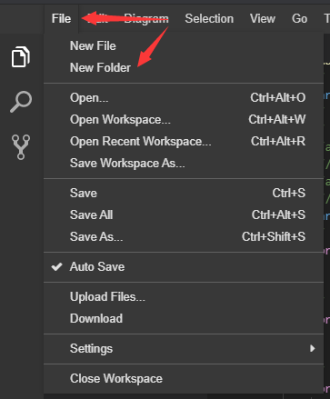
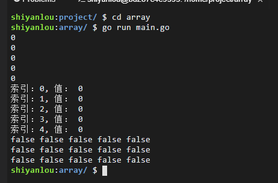
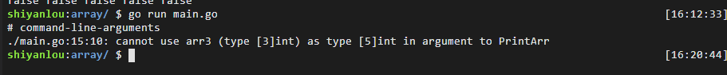
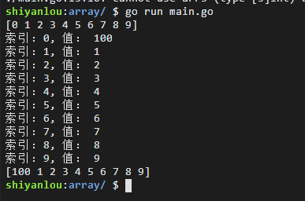
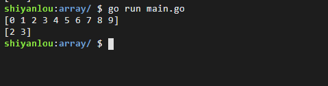
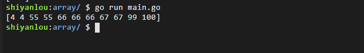
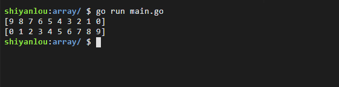
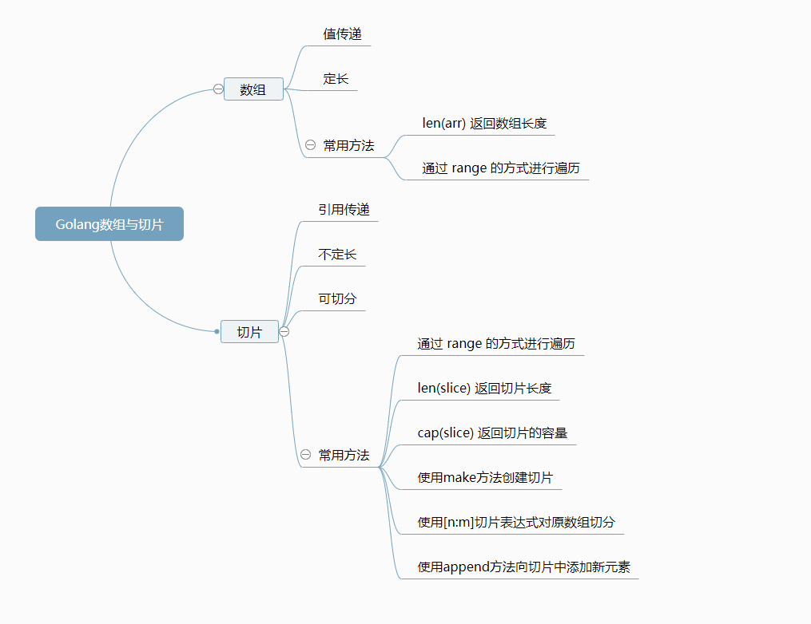

# 数组与切片
[[TOC]]

### Golang 数组基本操作

#### 数组的声明

Golang 中一个数组的声明方式主要有以下几种。

```go
package main

func main() {
    // 第一种，在初始化时只声明数组长度，不声明数组内容
    var arr1 [5]int
    // 第二种，知道数据很多，不想自己写长度的时候可以用这种方式
    // 声明之后由编译器自己推算数组长度
    arr2 :=  [...]int{1,3,5,7,9}
    // 第三种，声明的时候长度和初值一起声明
    arr3 := [3]int{2,4,6}
    // 二维数组的声明，其意义是三行五列
    var Block [3][5]int
}
```

这里值得一提的是 Golang 中的数组的初始值如果你不做声明的话默认是全部有初值的。 比如 `arr1` 这个数组虽然只声明了长度为 5，但是 Go 的编译器也会把这 5 个元素全都初始化为 0。而对于 `bool` 值类型的数组，如果不做赋值操作，则初始值全为 `false`。在接下来的数组遍历中我们会实际的验证它。

#### 数组的遍历

我们先在实验楼在线实验环境中新建新建一个名叫 `array` 的文件夹。如下图所示，先点击 File，然后点击 New Folder 创建名为 `array` 的文件夹。



然后我们右键点击 `array` 文件夹，选择 New File，创建一个叫 `main.go` 的文件，如下图所示。

![image-20220531164142074]./image-20220531164142074.png)

Go 的数组遍历主要有以下两种方式。首先键入以下代码：

```go
package main

import "fmt"

func main() {
    // 第一种，在初始化时只声明数组长度，不声明数组内容
    var arr1 [5]int
    // 第二种，知道数据很多，不想自己写长度的时候可以用这种方式
    // 声明之后由编译器自己推算数组长度
    //arr2 :=  [...]int{1,3,5,7,9}
    //// 第三种，声明的时候长度和初值一起声明
    //arr3 := [3]int{2,4,6}
    //// 二维数组的声明，其意义是三行五列
    var Block [3][5]bool
    // 第一种
    for i := 0 ; i<len(arr1); i++{
        fmt.Printf("%d\n",arr1[i])
    }
    // 第二种
    for index, value := range arr1 {
        fmt.Printf("索引：%d, 值： %d\n",index,value)
    }
    // 以第二种方式遍历二维数组,只取值，也就是取出一个数组
    for _,v := range Block {
        // 再对这个数组取值
        for _,value := range v {
            fmt.Printf("%v ",value)
        }
        fmt.Printf("\n")
    }

}
```

接下来，在终端执行：

```bash
cd array
go run main.go
```

结果如下：



其中 Go 语言官方更加提倡的是第二种以 `range` 的方式进行遍历，这样写会让代码更加优雅，而且绝对不会越界。

那么，如果我只想要数组里的 index 不想要 value 时怎么 range 呢？

答案其实很简单，`i := range arr` 就可以了。如果你只想要 value 不想要索引的时候就可以这样写 `_, value := range arr`, 注意这里的下划线不能省略。

#### 封装一个数组打印函数

现在咱们封装一个用来打印数组的函数并对其进行测试，代码如下:

```go
func PrintArr(arr [5]int) {
    // 第二种
    for index, value := range arr {
        fmt.Printf("索引：%d, 值： %d\n",index,value)
    }
}
```

我们分别将 arr1,2,3 传入打印，先猜测一下会发生什么结果呢？

```go
package main

import "fmt"

func main() {
    // 第一种，在初始化时只声明数组长度，不声明数组内容
    var arr1 [5]int
    // 第二种，知道数据很多，不想自己写长度的时候可以用这种方式
    // 声明之后由编译器自己推算数组长度
    arr2 :=  [...]int{1,3,5,7,9}
    //// 第三种，声明的时候长度和初值一起声明
    arr3 := [3]int{2,4,6}
    PrintArr(arr1)
    PrintArr(arr2)
    PrintArr(arr3)
}

func PrintArr(arr [5]int) {
    // 第二种
    for index, value := range arr {
        fmt.Printf("索引：%d, 值： %d\n",index,value)
    }
}
```

结果是程序在打印 arr3 时抛出了如下异常。



这个就要牵扯出一个概念了，Go 语言中数组是值类型。也就是说[3]int，和[5]int 在 go 中会认为是两个不同的数据类型。同样地，你在 PrintArr 中改变数组中的值也不会改变原数组的值。

到了这里你肯定觉得 go 的数组太难用了，又要数据类型统一又要长度统一才能传递。确实是这样的，在 go 中我们一般不直接使用数组。而是使用我们今天的主角，切片。

### Golang 切片的基本操作

一般而言，Go 语言的切片比数组更加灵活，强大而且方便。数组是按值传递的（即是传递的副本），而切片是引用类型，传递切片的成本非常小，而且是不定长的。而且数组是定长的，而切片可以调整长度。创建切片的语法如下：

- *make([ ]Type, length, capacity)*
- *make([ ]Type, length)*
- *[ ]Type{}*
- *[ ]Type{value1, value2, ..., valueN}*

内置函数 `make()` 用于创建切片、映射和通道。当用于创建一个切片时，它会创建一个隐藏的初始化为零值的数组，然后返回一个引用该隐藏数组的切片。该隐藏的数组与 Go 语言中的所有数组一样，都是固定长度，如果使用第一种语法创建，那么其长度为切片的容量 `capacity` ；如果是第二种语法，那么其长度记为切片的长度 `length` 。一个切片的容量即为隐藏数组的长度，而其长度则为不超过该容量的任意值。另外可以通过内置的函数 `append()` 来增加切片的容量。

我们来执行一下下面的程序：

```go
package main

import "fmt"

func main() {
    slice := make([]int,0)
    for i := 0 ;i < 10; i++ {
        // 动态的对切片进行扩容
        slice = append(slice, i)
    }
    fmt.Println(slice)

    // 调用PrintArr
    PrintArr(slice)
    // 看看是否切片的第一个元素改变了?
    fmt.Println(slice)
}

func PrintArr(arr []int) {
    arr[0] = 100
    for index, value := range arr {
        fmt.Printf("索引：%d, 值： %d\n",index,value)
    }
}
```

执行结果:



执行之后我们会发现 `slice[0]` 的值确实被改变了。因为切片是引用传递，也就是直接把切片在内存中的地址传递过去。这样我们在其他函数中对其进行修改也会影响原来的切片的数据。这样做的好处是传引用因为不用把原数据拷贝一份，所以对系统的开销比较小。

#### 切片的切割

切片最大的特色就是可以灵活的进行切分，比如下面的例子。

```go
package main

import "fmt"

func main() {
    slice := make([]int,0)
    for i := 0 ;i < 10; i++ {
        slice = append(slice, i)
    }
    fmt.Println(slice)
    s2 := slice[2:4]
    fmt.Println(s2)
}
```

执行结果:



这里的 2 可被称为起始索引，4 可被称为结束索引。那么 s2 的长度就是 4 减去 2，即 2。因此可以说，s2 中的索引从 0 到 1 指向的元素对应的是 slice 及其底层数组中索引从 2 到 3 的那 2 个元素。

到这里我们就可以推出 `[n:m]` 的意思是取区间 `[n,m)` 的数据赋值给新的切片。

#### 关于数组与切片两道常见面试题

- Golang 切片的扩容规则。

  一旦一个切片无法容纳更多的元素，Go 语言就会想办法扩容。但它并不会改变原来的切片，而是会生成一个容量更大的切片，然后将把原有的元素和新元素一并拷贝到新切片中。在一般的情况下，你可以简单地认为新切片的容量将会是原切片容量的 2 倍。

  但是，当原切片的长度大于或等于 1024 时，Go 语言将会以原容量的 1.25 倍作为新容量的基准。因为继续再乘以 2 的话切片容量增加的太快，很容易产生大量的浪费无意义的空间。

  不过，如果我们一次追加的元素过多，以至于使新长度比原容量的 2 倍还要大，那么新容量就会以新长度为基准。比如你现在的切片长度为 10，现在一下往里面添加了 30 个元素，那么 Golang 会直接创建一个新的长度为 40 的底层数组，然后把所有的数据拷贝进去。

- Golang 切片的底层数组在什么情况下会改变？

  其实这里的典型回答应该是永远不会改变。因为当切片需要扩容时，新的切片诞生的同时也会创建出新的底层数组，它只是把原数组的数据拷贝了进来，并未对其做任何的修改。

#### 一道思考题

现在我们已经学习了如何对数组进行“扩容”，那么你能否使用“扩容”的方式，把原切片进行缩容呢？请尝试写出代码，或查阅相关资料。

### 编程实验两道

现在有两个排序问题，第一道题目是假设试卷的成绩只有 0-100 的整数分布，你能否想出对试卷最速进行排序的方法呢？

第二道题：对初学者不太友好，但是是各类比赛，面试中常见的一种问题。请尝试实现快速排序，这一道题比较的困难，建议先查阅相关资料。其相关实现步骤如下。

- 从数列中随机挑出一个元素，称为 “基准”（pivot）；
- 重新排序数列，所有元素比基准值小的摆放在基准前面，所有元素比基准值大的摆在基准的后面（相同的数可以到任一边）。在这个分区退出之后，该基准就处于数列的中间位置。这个称为分区（partition）操作；
- 递归地（recursive）把小于基准值元素的子数列和大于基准值元素的子数列排序。

#### 成绩排序

我们现在已知试卷的成绩只有 0-100 的整数分布，然后就能联想到一个数组的索引也可以表示从 0-100 不间断的分布。那么对成绩排序只需要对每一个成绩往对应的索引里面装就行了（比如找到一个成绩为 100 的，那么就只需要让 `arr[100]++`），也就是说对成绩排序只需要遍历一次成绩数组就可以了。这种方法就叫做桶排序，它巧妙的利用了数组索引表示数据的方式进行排序。也是在满足应用条件时世界上最快的排序方法。

代码如下:

```go
package main

import "fmt"

func GradeSort(grade []int) {
    // 初始化出试卷范围[0-100]
    arr := make([]int,101)
    for _,v := range grade {
        // 每一个成绩装到对应的桶中
        arr[v]++
    }
    // 把成绩装回去
    index := 0
    for i,v := range arr {
        // 桶空了就继续下一个
        if v == 0 {
            continue
        }else {
            // 如果桶不为空,也就是说arr[i]不为空
            // 意思就是成绩为 i 的人有多少个
            // 所以我们把这些成绩装回grade数组中去
            for v != 0 {
                v--
                grade[index] = i
                index++
            }
        }
    }
}

func main() {
    grade := []int{4,66,66,67,55,55,66,99,100,4,67}
    GradeSort(grade)
    fmt.Println(grade)
}
```

执行结果:



#### 快速排序

将下面的代码与上文中的三个步骤进行对照，尝试自己用注释的方式将代码段与上述步骤一一对照的标注出来吧。

```go
package main

import (
    "fmt"
    "math/rand"
    "time"
)

// 对arr[l...r]部分进行partition操作
// 返回p, 使得arr[l...p-1] < arr[p] ; arr[p+1...r] > arr[p]
func partition (arr []int,l,r int) int {
    // 随机在arr[l...r]的范围中, 选择一个数值作为标定点pivot
    rand.Seed(time.Now().Unix())
    randIndex := rand.Int()%(r-l+1)+l
    arr[l],arr[randIndex] = arr[randIndex],arr[l]

    v := arr[l]
    j := l
    for i := l+1; i<=r; i++ {
        if arr[i] < v {
            j++
            arr[j],arr[i] = arr[i],arr[j]
        }
    }
    arr[l],arr[j] = arr[j],arr[l]
    return j
}

func QuickSort(arr []int,l,r int)  {
    if l >= r {
        return
    }
    p := partition(arr,l,r)
    QuickSort(arr,l,p-1)
    QuickSort(arr,p+1,r)
}

func main() {
    var arr []int
    for i:=9 ; i>=0;i--{
        arr = append(arr,i)
    }
    fmt.Println(arr)
    QuickSort(arr,0,len(arr)-1)
    fmt.Println(arr)
}
```

执行结果：



## 实验总结

