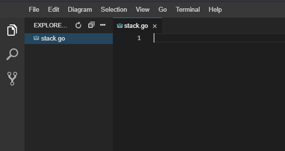

# 栈与栈的应用
[[TOC]]

## 栈的定义

栈是一种操作受限制的线性表，将允许进行插入、删除的一端称为栈顶，另一端称为栈底。看到这里你可能会觉得有点绕，其实数据结构很多的定义都很抽象，这是很正常的，下面我将类比一个生活中的常见实例帮助大家理解。

我们在日常生活中洗盘子的时候，摞起来的盘子就是一个典型的栈结构。不管取还是放，总是要放在盘子堆的最上面操作。如果你想从一堆盘子的中间强行取一个盘子，那就有可能酿成大祸。

###  Golang 定义栈的数据结构

我们首先还是在当前目录下去新建一个名叫 `stack.go` 的文件。



接下来我们来定义出栈的数据结构，还记得刚刚的洗盘子问题吗？我们在日常生活中，一摞盘子肯定有很多个而且是连续的，所以我们首先需要一个切片，并且我们日常生活中的盘子是不能无限的摞的，这点在计算机里也是同样的，计算机里也会有 `Stack Overflow` 的问题。 所以我们还需要一个容量的限制元素。 并且我们还需要频繁的对栈顶元素进行操作，所以我们还需要一个标记位 `top` 来标记栈顶元素的索引。

分析到这里，栈的数据结构已经呼之欲出了。我们就直接写出栈的数据结构和他的构造方法。

```go
package main

type Stack struct {
    // 用来装元素的切片
    container []int
    // 栈顶标记位
    top int
    // 容量限制
    size int
}

// 初始化时，要传入容量限制
func NewStack(size int) *Stack {
    return &Stack{
        container: make([]int,size),
        // 栈顶指针初始可以指向-1，也可以指向0，想一想为什么。
        top:       0,
        size:      size,
    }
}
```

初始化时要注意，我们这里返回的是一个 Stack 的指针，还记得我们上节学到过引用传递在系统中的开销比较小吗？

到这里，我们对于 Golang 栈的定义以及初始化操作以及完成了，下一小节中我们将学习栈的基本操作。

### 栈的基本操作

对于一个栈来说，其基本操作分为以下四种。

- Push(e E) , 将一个数据类型为 E 的元素 e 放到栈顶。
- Pop() , 将栈顶元素取出。
- IsFul() , 栈是否满了。
- IsEmpty() , 栈是否空了。

这里我们还是在 `stack.go` 中继续实验。实现其上述四个基本功能，并且在主函数中进行测试。代码如下：

```go
package main

import "fmt"

type Stack struct {
    // 用来装元素的切片
    container []int
    // 栈顶标记位
    top int
    // 容量限制
    size int
}

// 初始化时，要传入容量限制
func NewStack(size int) Stack {
    return Stack{
        container: make([]int, size),
        top:       0,
        size:      size,
    }
}

func (s *Stack) Push(e int) bool {
    if s.IsFull() {
        return false
    }
    // 把盘子摞上去
    s.container[s.top] = e
    // 下一个能摞盘子的位置
    s.top++
    return true
}

func (s *Stack) Pop() (flag bool, ret int) {
    // 如果栈空了，你就无法拿到新盘子，所以flag此时为false
    if s.IsEmpty() {
        return false, ret
    }
    // 取出盘子
    ret = s.container[s.top-1]
    // 下一个能取盘子的位置
    s.top--
    return true, ret
}

func (s *Stack) IsEmpty() bool {
    if s.top == 0 {
        return true
    }
    return false
}

func (s *Stack) IsFull() bool {
    if s.top == s.size {
        return true
    }
    return false
}

func main() {
    stack := NewStack(3)
    // 先测试栈为空的时候能否Pop
    fmt.Println(stack.Pop())
    // 测试Push是否正常
    stack.Push(1)
    stack.Push(2)
    stack.Push(3)
    // 如果栈为正常的，这里Pop打印顺序应该是3,2,1
    fmt.Println(stack.Pop())
    fmt.Println(stack.Pop())
    fmt.Println(stack.Pop())
}
```

我们输入 `go run stack.go` 查看执行结果。


各位同学在书写 Golang 代码时如果不知道 Golang 的代码风格规范，可以在写完代码后执行 `go fmt stack.go` 编译器会自动帮我们整理代码风格。

现在，我们已经实现了栈的基本操作，接下来我们将改造一下我们的栈，来解决实际的问题。

###  栈的常见应用

在这一小节中，我们将通过解决两个具体的实际问题来巩固栈的知识。

#### 浏览器中的前进后退

假设你现在是 N 年前的 Chrome 浏览器工程师， 你现在很苦恼，有的网页在打开下一个页面后就回不去上一级了，你现在急迫的想要一个后退的功能，请问要怎么样实现呢？

仔细分析之后不难发现，所谓的后退，撤销等操作，其实就是一个栈的 `Pop` 操作，我们每次点击的网址, 或者进行的操作，都是被程序 `Push` 到了一个栈中，所以一旦我们点击撤销或后退时，总是可以返回我们最近一次的操作。这就是栈的最广泛的应用。

我们新建一个名叫 `browser.go` 的文件。然后将我们在 `stack.go` 中实现的代码除主函数外全都拷贝进去， 并且因为浏览器的网址是字符串类型的，所以我们需要把除了 `top` 和 `size` 以外的 `int` 改为 `string` 。

代码如下：

```go
package main

import "fmt"

type Stack struct {
    // 用来装元素的切片
    container []string
    // 栈顶标记位
    top int
    // 容量限制
    size int
}

// 初始化时，要传入容量限制
func NewStack(size int) Stack {
    return Stack{
        container: make([]string, size),
        top:       0,
        size:      size,
    }
}

func (s *Stack) Push(e string) bool {
    if s.IsFull() {
        return false
    }
    s.container[s.top] = e
    s.top++
    return true
}

func (s *Stack) Pop() (flag bool, ret string) {
    // 如果栈是空的，那么就不能继续 Pop 了
    if s.IsEmpty() {
        return false, ret
    }
    ret = s.container[s.top-1]
    s.top--
    return true, ret
}

func (s *Stack) IsEmpty() bool {
    if s.top == 0 {
        return true
    }
    return false
}

func (s *Stack) IsFull() bool {
    if s.top == s.size {
        return true
    }
    return false
}

func main() {
    back := NewStack(3)
    // 模拟每次点击网页时，浏览器会自push你的网址到栈中
    back.Push("www.baidu.com")
    back.Push("www.bing.com")
    back.Push("www.goole.com")
    // 每次点击后退时，就相当于是从栈中Pop了一个网址
    fmt.Println(back.Pop())
    fmt.Println(back.Pop())
    fmt.Println(back.Pop())
}
```

执行结果:


下面关于这道题留下一个思考问题，我们的浏览器不光有后退操作，还是有前进操作的，其实前进也是一个栈，请尝试实现出完善的前进，后退功能。

#### 括号匹配

在现代的 IDE 中，我们的编辑器环境是十分智能的，比如下图:


我少打了一个括号，IDE 就自动给我画了一条红线。是不是非常的神奇。其实这个功能也是用栈实现的。下面来说一下思路：

若遇到左括号入栈，遇到右括号时将栈顶左括号出栈，则遍历完所有括号后 `stack` 仍然为空；如果遍历之后 `stack` 不为空，那么说明有多余的左括号。上图中就是这种情况。

我们新建一个名叫 `valid.go` 的文件，并且将 `stack.go` 中的代码拷贝进去。把除了 `top` 和 `size` 以外的 `int` 改为 `byte` 。

然后我们通过实现 isValid 函数去完成括号匹配的功能。完整代码与测试结果如下:

```go
package main

import "fmt"

type Stack struct {
    // 用来装元素的切片
    container []byte
    // 栈顶标记位
    top int
    // 容量限制
    size int
}

// 初始化时，要传入容量限制
func NewStack(size int) Stack {
    return Stack{
        container: make([]byte,size),
        top:       0,
        size:      size,
    }
}

func (s *Stack) Push (e byte) bool {
    if s.IsFull() {
        return false
    }
    s.container[s.top] = e
    s.top++
    return true
}


func (s *Stack) Pop () (flag bool,ret byte) {
    // 如果栈是空的，那么就不能继续 Pop 了
    if s.IsEmpty() {
        return false,ret
    }
    ret = s.container[s.top-1]
    s.top--
    return true,ret
}


func (s *Stack) IsEmpty () bool {
    if s.top == 0 {
        return true
    }
    return false
}


func (s *Stack) IsFull () bool {
    if s.top == s.size {
        return true
    }
    return false
}

func IsValid(s string) bool {
    stack := NewStack(100)
    // 遍历括号字符串
    for _,v := range s {
        if v == '(' {
            // 由于golang中的字符串默认是unicode编码，所以我们要做一个强制类型转换
            stack.Push(byte(v))
        }
        if v == ')' {
            // 如果flag不为true，说明栈已经到底了，可以直返回false
            if flag,top := stack.Pop(); flag == true &&top == '(' {
                continue
            } else {
                return false
            }
        }
    }
    // 字符串遍历完后如果栈也空了，说明括号匹配
    if stack.IsEmpty() {
        return true
    }
    // 如果栈不空，说明栈里还有多余的左括号
    return false
}

func main() {
    test1 := "()()())"
    test2 := "((()"
    test3 := "()()()()"
    fmt.Println(IsValid(test1))
    fmt.Println(IsValid(test2))
    fmt.Println(IsValid(test3))
}
```

测试结果:


现在我们就已经完成了小括号的匹配功能，下面请大家思考一下如果匹配小括号，中括号，大括号混合的字符串，那么我们的 `IsValid` 函数需要做什么样的修改呢？

