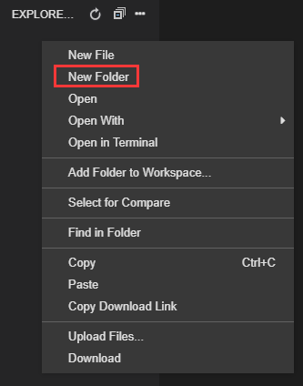
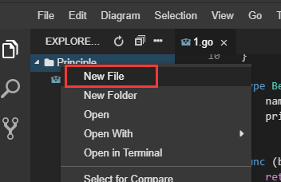
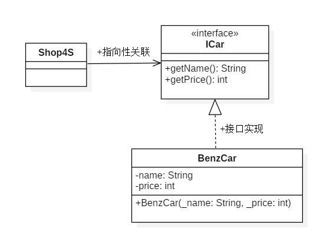
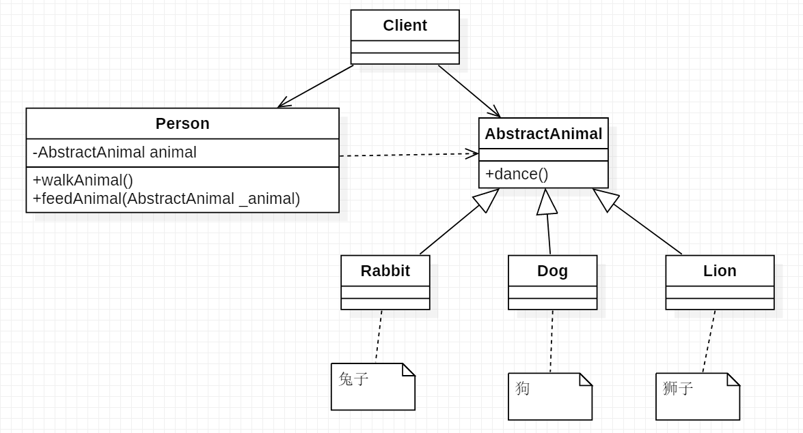
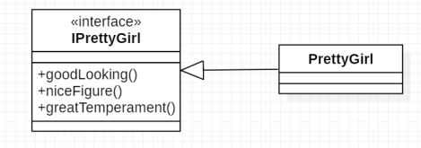
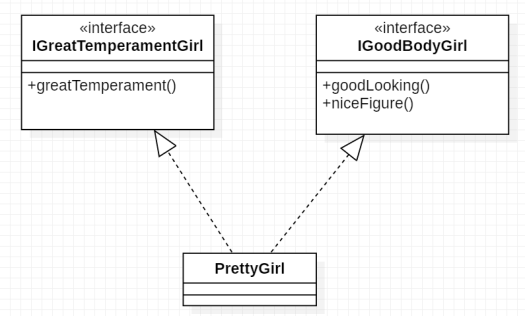
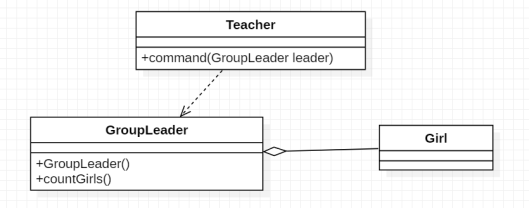

# 七大设计原则
[[TOC]]

### 准备工作

我们首先新建一个名为 Principle 的文件夹，然后在文件夹中去新建我们的 go 文件，文件名可自定义。如下图所示：





我们这里为了方便，就直接建立了一个 1.go 的文件。接下来，我们就可以去实现 Go 的代码了

### 开闭原则

> 开闭原则(Open Closed Principle，OCP) 由勃兰特.梅耶(Bertrand Meyer)提出，他在 1988 年的著作《面向对象软件构造》( Object Oriented Software Construction)中提出：软件实体应当对扩展开放，对修改关闭(Software entities should be open for extension, but closed for modification)，这就是开闭原则的经典定义。

**开闭原则是设计模式中的总原则，开闭原则就是说:对拓展开放、对修改关闭。**模块应该在尽可能不修改代码的前提下进行拓展，这就需要使用接口和抽象类来实现预期效果。 我们举例说明什么是开闭原则，以 4s 店销售汽车为例，其类图如图所示:



ICar 接口定义了汽车的两个属性：名称和价格。BenzCar 是一个奔驰车的实现类，代表奔驰车的总称。Shop4S 代表售卖的 4S 店，ICar 接口的代码清单如下：

```go
package main

import "fmt"

type ICar interface {
 // 车名
 GetName() string
 // 价格
 GetPrice() int
}
```

一般情况下 4S 店只出售一种品牌的车，这里用奔驰为例，代码清单如下

```go
type BenzCar struct {
    name string
    price int
}

func (b BenzCar) GetName() string {
    return b.name
}

func (b BenzCar) GetPrice() int {
    return b.price
}
```

这里我们模拟一下 4s 店售车记录：

```go
func main() {
    var (
        list []ICar
    )
    list = []ICar{}
    list = append(list,&BenzCar{"迈巴赫",130})
    list = append(list,&BenzCar{"AMG",343})
    list = append(list,&BenzCar{"V",60})
    for _,v := range list {
        fmt.Println("车名:",v.GetName(),"\t价格:",v.GetPrice())
    }
}
```

接下来，我们在命令行中输入 `cd Principle` 先切换到 go 文件所在目录下，然后执行 `go run 1.go` 来看我们的执行结果。如下图所示：


暂时来看，以上设计是没有啥问题的。但是，某一天，4s 店老板说奔驰轿车统一要收取一笔金融服务费，收取规则是价格在 100 万元以上的收取 5%，50~100 万元的收取 2%，其余不收取。为了应对这种需求变化，之前的设计又该如何呢?

目前，解决方案大致有如下三种:

- 修改 ICar 接口：在 ICar 接口上加一个 getPriceWithFinance 方法，专门获取加上金融服务费后的价格信息。这样的后果是，实现类 BenzCar 也要修改，业务类 Shop4S 也要做相应调整。ICar 接口一般应该是足够稳定的，不应频繁修改，否则就失去了接口锲约性了。
- 修改 BenzCar 实现类：直接修改 BenzCar 类的 getPrice 方法，添加金融服务费的处理。这样的一个直接后果就是，之前依赖 getPrice 的业务模块的业务逻辑就发生了改变了，price 也不是之前的 price 了。
- 使用子类拓展来实现：增加子类 FinanceBenzCar，覆写父类 BenzCar 的 getPrice 方法，实现金融服务费相关逻辑处理。这样的好处是：只需要调整 Shop4S 中的静态模块区中的代码，main 中的逻辑是不用做很大的修改的。

新增的 FinanceBenzCar 类代码清单如下:

```go
type FinanceBenzCar struct {
    BenzCar
}


func (b FinanceBenzCar) GetPrice() int {
    // 获取原价
    selfPrice := b.price
    var finance int
    if selfPrice >= 100 {
        finance = selfPrice + selfPrice*5/100
    } else if selfPrice >= 50 {
        finance = selfPrice + selfPrice*2/100
    } else {
        finance = selfPrice
    }
    return finance
}
```

主函数：

```go
func main() {
    var (
        list []ICar
    )
    list = []ICar{}
    list = append(list,&FinanceBenzCar{BenzCar{"迈巴赫",99}})
    list = append(list,&FinanceBenzCar{BenzCar{"AMG",200}})
    list = append(list,&FinanceBenzCar{BenzCar{"V",40}})
    for _,v := range list {
        fmt.Println("车名:",v.GetName(),"\t价格:",v.GetPrice())
    }
}
```

测试结果

```txt
=== RUN   TestBenzCar_GetName
车名: 迈巴赫     价格: 100
车名: AMG     价格: 210
车名: V     价格: 40
--- PASS: TestBenzCar_GetName (0.00s)
PASS
```

这样，在业务规则发生改变的情况下，我们通过拓展子类及修改持久层(高层次模块)便足以应对多变的需求。开闭原则要求我们尽可能通过拓展来实现变化，尽可能少地改变已有模块，特别是底层模块。

开闭原则总结:

- 提高代码复用性
- 提高代码的可维护性

### 单一职责原则

单一职责原则，简单来说就是保证设计类、接口、方法时做到**功能单一，权责明确**。比如：


这里我们定义“更新用户” 的接口， 倘若有一天新来的前端要求加一个修改用户密码的接口,后端直接说：“你去调 updateUser”接口吧，传入密码信息就行。updateUser 接口的粒度太粗，接口职责不够单一，所以应该将接口拆分为各个细分接口，比如修改如下:


这里很明显，我们看到分拆后的接口职责更加单一，权责更加清楚，日后维护开发也更加便捷。

**单一职责原则，指的是一个类或者模块有只有一个改变的原因。** 如果模块或类承担的职责过多，就等于这些职责耦合在一起， 这样一个模块的变快可能会削弱或抑制其它模块的能力， 这样的耦合是十分脆弱地。所以应该尽量保持单一职责原则，此原则的核心就是解耦和增强内聚性。

”我单纯，所以我快乐“用来形容单一职责原则再恰当不过了。

单一职责原则总结:

- 单一职责可以降低类的复杂性，提高代码可读性、可维护性。
- 但是用“职责”或“变化原因”来衡量接口或类设计得是否优良，但是“职责”和“变化原因”都是不可度量的，因目、环境而异；指责划分稍微不当，很容易造成资源浪费，代码量增多。

### 里式替换原则

里式替换原则的解释是，所有引用基类的地方必须能透明地使用其子类的对象。通俗来讲的话，就是说，只要父类能出现的地方子类就可以出现，并且使用子类替换掉父类的话，不会产性任何异常或错误，使用者可能根本就不需要知道是父类还是子类。反过来就不行了，有子类的地方不定能使用父类替换。

**里式替换原则是开闭原则的实现基础，它告诉我们设计程序的时候尽可能使用基类进行对象的定义及引用，具体运行时再决定基类对应的具体子类型。**

接下来举个例子，我们定义一个类 AbstractAnimal 对象，该对象声明内部方法” 跳舞”，其中，Rabbit、Dog、 Lion 分别继承该对象，另外声明一个 Person 类，该类负责喂养各种动物，Client 类负责逻辑调用，类图如下:



代码如下：

```go
package main

import "fmt"

type Animal interface {
    dance()
}

type Rabbit struct {

}

func (r Rabbit) dance()  {
    fmt.Println("兔子跳舞")
}

type Dog struct {

}

func (d Dog) dance()  {
    fmt.Println("狗跳舞")
}

type Lion struct {

}

func (l Lion) dance()  {
    fmt.Println("狮子跳舞")
}

type Person struct {
    ani Animal
}

func (p Person) WalkAnimal() {
    fmt.Println("人开始溜动物")
    p.ani.dance()
}
```

主函数的调用如下

```go
func main(){
    person := Person{ani:&Dog{}}
    person.WalkAnimal()
}
```

我们尝试执行这段代码，你可以选择新建一个 go 文件，也可以在之前的代码中做修改，结果如下：


这里，Person 类中本该出现的父类 AbstractAnimal 我们运行时使用具体子类代替，只要是父类能出现的地方子类就能出现，这就要求我们模块设计时尽量以基类进行对象的定义及应用。

里氏替换原则总结:

- 里氏替换可以提高代码复用性,子类继承父类时自然继承到了父类的属性和方法。
- 提高代码可拓展性，子类通过实现父类方法进行功能拓展，个性化定制。
- 里氏替换中的继承有侵入性。继承，就必然拥有父类的属性和方法。
- 增加了代码的耦合性。父类方法或属性的更改，要考虑子类所引发的变更。

### 依赖倒置原则

依赖倒置原则的定义：程序要依赖于抽象接口，不要依赖于具体实现。简单的说就是要求对抽象进行编程，不要对实现进行编程，这样就降低了客户与实现模块间的耦合。依赖倒置原则要求我们在程序代码中传递参数时或在关联关系中，尽量引用层次高的抽象层类，即使用接口和抽象类进行变量类型声明、参数类型声明、方法返回类型声明，以及数据类型的转换等，而不要用具体类来做这些事情。

依赖倒置原则，高层模块不应该依赖低层模块，都应该依赖抽象。抽象不应该依赖细节，细节应该依赖抽象。其核心思想是：要面向接口编程，不要面向实现编程。

举个例子，拿顾客商店购物来说，定义顾客类如下，包含一个 shopping 方法:

```go
type Customer struct {

}

func (c Customer) Shopping(shop DD)  {
    fmt.Println(shop.sell())
}
```

以上表示顾客在 DD 店进行购物，假如再加入一个新的店铺，AM。

```go
type Customer struct {

}

func (c Customer) Shopping(shop AM)  {
    fmt.Println(shop.sell())
}
```

这显然设计不合理，违背了开闭原则。同时，顾客类的设计和店铺类绑定了，违背了依赖倒置原则。解决办法很简单，将 Shop 抽象为具体接口，shopping 入参使用接口形式，顾客类面向接口编程，如下：

```go
type Shop interface {
   sell() string
}
type Customer struct {

}

func (c Customer) Shopping(shop Shop)  {
   fmt.Println(shop.sell())
}
```

类图：


依赖倒置原则总结:

- 高层模块不应该依赖低层模块，都应该依赖抽象(接口或抽象类)；
- 接口或抽象类不应该依赖于实现类；
- 实现类应该依赖于接口或抽象类。

这里的代码很简单，大家可以根据上面已给出的代码尝试按照类图进行一个相应的实现。

### 接口隔离原则

接口隔离原则（Interface Segregation Principle, ISP）的定义是客户端不应该依赖它不需要的接口，类间的依赖关系应该建立在最小的接口上。简单来说就是建立单一的接口， 不要建立臃肿庞大的接口。也就是接口尽量细化，同时接口中的方法尽量少，保持接口纯洁性。

我们所讲的接口主要分为两大类，一是实例接口，比如使用 new 关键字产生一种实例，被 new 的类就是实例类的接口。从这个角度出发的话，java 中的类其实也是一种接口。二是类接口，java 中常常使用 interface 关键字定义。

举个例子来说，我们使用接口 IPrettyGirl 来描述美女，刚开始类图可能描述如下:



但是发现该接口中包含对美女的外观描述、内在美描述等，几乎将美女的所有特性全部纳入，这显然不是一个很好的设计规范，比如在唐朝，在那个以丰腴为美的时代对美的理解就不同，就会出现单纯 goodLooking 过关就是美女的结果，所以这里我们需要将接口隔离拆分。将一个接口拓展为两个，增加系统灵活性及可维护性。



这里我们将美女接口拆分为内在美、外在美两个接口，系统灵活性提高了，另外接口间还能使用继承实现聚合，系统拓展性也得到了增强。

接口隔离原则总结:

- 接口尽量粒度化，保持接口纯洁性。
- 接口要高内聚，即减少对外交互。

### 迪米特法则

迪米特法则(Law of Demeter, LOD)，有时候也叫做最少知识原则(Least Knowledge Principle, LKP)，它的定义是: 一个软件实体应当尽可能少地与其它实体发生相互作用。迪米特法则的初衷在于降低类之间的耦合。

举个例子，拿教师点名来讲，体育老师需要清点班上学生人数，教师一般不是自己亲自去数，而是委托组长或班长等人去清点，即教师通过下达命令至班长要求清点人数:

```go
// 女学生
type Girl struct {

}
// 小组leader
type GroupLeader struct {
    girls []Girl
}

func (g GroupLeader) CountGirls ()  {
    fmt.Println("The sum of girls is ", len(g.girls))
}
// 教师
type Teacher struct {

}
// 教师委派leader去清点人数
func (t Teacher) Command(leader GroupLeader)  {
    leader.CountGirls()
}
```



如果去掉 GroupLeader 这个中间人角色，教师就会直接去清点人数，这样做会违反迪米特法则。

迪米特法则总结：

- 类定义时尽量内敛，少用 public 权限修饰符，尽量使用 private、protected。

### 合成复用原则

合成复用原则是通过将已有的对象纳入新对象中，作为新对象的成员对象来实现的,新对象可以调己有对象的功能，从而达到复用。原则是尽量首先使用合成/聚合的方式，而不是使用继承。

合成和聚合都是关联的特殊种类。合成是值的聚合(Aggregation by Value)，而复合是引用的聚合(Aggregation by Reference)。

我们都知道，类之有三种基本关系，分别是：关联(聚合和组合)、泛化(与继承同一概念)、依赖。

这里我们提一下关联关系，客观来讲，大千世界中的两个实体之间总是有着千丝万缕的关系，归纳到软件系统中就是两个类之间必然存在关联关系。如果一个类单向依赖另一个类，那么它们之间就是单向关联。如果彼此依赖，则为相互依赖，即双向关联。

关联关系包括两种特例:聚合和组合。聚合，用来表示整体与部分的关系或者“拥有”关系。其中，代表部分的对象可能会被代表多个整体的对象所拥有，但是并不一定会随着整体对象的销毁而销毁，部分的生命周期可能会超越整体。好比班级和学生，班级销毁或解散后学生还是存在的，学生可以继续存在某个培训机构或步入社会，生命周期不同于班级甚至大于班级。

合成，用来表示一种强得多的“拥有”关系。其中，部分和整体的生命周期是一致的，一个合成的新的对象完全拥有对其组成部分的支配权，包括创建和泯灭。好比人的各个器官组成人一样，一旦某个器官衰竭，人也不复存在，这是一种“强”关联。

合成复用原则总结:

- 新对象可以调用已有对象的功能，从而达到对象复用。

### 实验总结

各种原则要求的侧重点不同，总地来说:

1. 开闭原则是核心，对拓展开放对修改关闭是软件设计、后期拓展的基石。
2. 单一职责原则就要求我们设计接口，制定模块功能时保持模块或者接口功能单一，接口设计或功能设计尽量保持原子性，修改一处不能影响全局或其它模块。
3. 里氏替换原则和依赖倒置原则，按照笔者的理解，这俩原则总的是要求我们要面向接口、面向抽象编程，设计程序的时候尽可能使用基类或者接口进行对象的定义或引用，而不是具体的实现，否则实现一旦有变更，上层调用者就必须做出对应变更，这样一来，整个模块可能都需要重新调整，非常不利于后期拓展。
4. 接口隔离原则具体应用到程序中，比如我们在传统 mvc 开发时，service 层调用 dao 层一般会使用接口进行调用，各层之间尽量面向接口通信，其实也是一种降低模块耦合的方法。
5. 迪米特法则的初衷也是为了降低模块耦合，代码示例中我们引入了类似“中间人”的概念，上层模块不直接调用下层模块，而是引入第三方进行代办，这也是为了降低模块的耦合度。
6. 合成复用原则，我们介绍了聚合、组合的概念，聚合是一种弱关联，而组合是一种强关联，表现在 UML 类图上的话聚合是使用空心四边形加箭头表示，而组合是使用实心四边形加箭头表示，合成复用原则总的就是要求我们尽利用好已有对象，从而达到功能复用，具体是聚合还是组合，还是一般关联，就要看具体情况再定了。