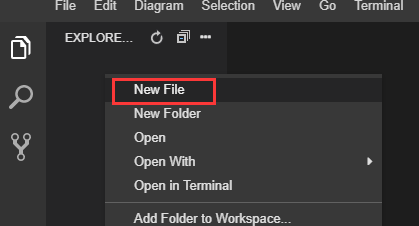
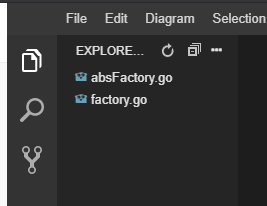
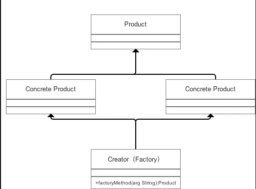
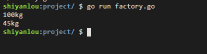
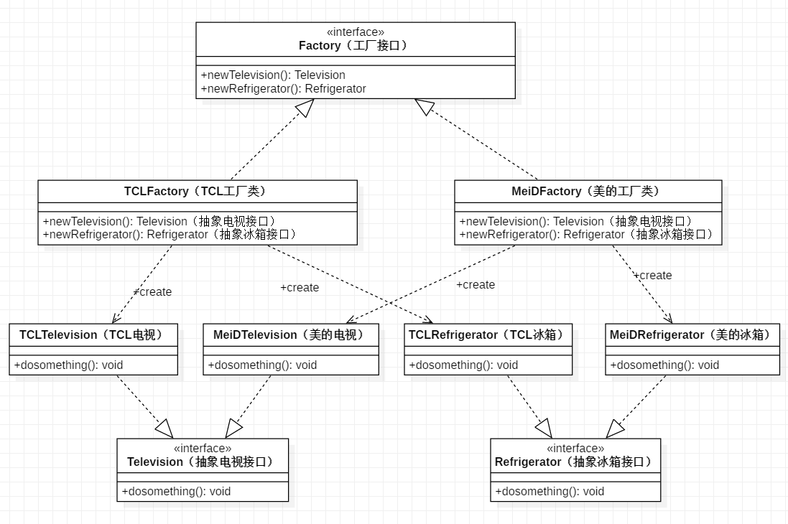
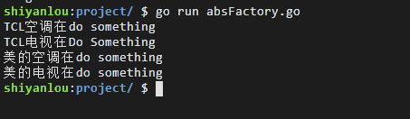
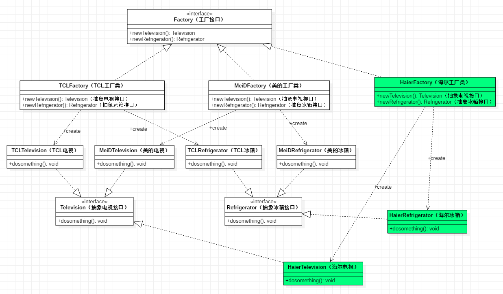

# 简单工厂与抽象工厂
[[TOC]]

## 准备工作

首先，我们先在实验环境中把文件创建好，如下图所示：



我们创建如下两个文件，分别进行简单工厂和抽象工厂的实现：



## 简单工厂模式

定义一个创建对象的接口，让其子类自己决定实例化哪一个工厂类，工厂模式使其创建过程延迟到子类进行。主要解决接口选择问题

### 类图



**返回的实例都实现同一接口。**

### 应用实例

```go
package main

import "fmt"

// 定义一个女孩的接口让下面的类隐式继承
type gril interface {
    weight()
}
type FatGril struct {}

func (FatGril) weight()  {
    fmt.Println("100kg")
}
type ThinGirl struct {}

func (ThinGirl) weight ()  {
    fmt.Println("45kg")
}
// 简单工厂
type GirlFactory struct {}

func (*GirlFactory) CreateGirl (like string) gril {
    switch like {
        case "fat":
            return &FatGril{}
        case "thin":
            return &ThinGirl{}
        default:
            return nil
    }
}
```

完整代码与测试结果：

```go
package main

import "fmt"

// 定义一个女孩的接口让下面的类隐式继承
type gril interface {
    weight()
}

type FatGril struct {}

func (FatGril) weight()  {
    fmt.Println("100kg")
}

type ThinGirl struct {}

func (ThinGirl) weight ()  {
    fmt.Println("45kg")
}

// 简单工厂
type GirlFactory struct {}

func (*GirlFactory) CreateGirl (like string) gril {
    switch like {
        case "fat":
            return &FatGril{}
        case "thin":
            return &ThinGirl{}
        default:
            return nil
    }
}

func main(){
    // 测试
    factor := &GirlFactory{}

    var g gril

    g = factor.CreateGirl("fat")
    g.weight()
    g = factor.CreateGirl("thin")
    g.weight()
}
```

执行结果：



简易工厂主要是用来解决对象“创建”的问题。这里我们可以看到，不管我们需要调用胖女孩还是瘦女孩的方法，他们的变量对外都可以表现为一个 gril 的接口类型。这样我们对外提供调用方法就有很强的灵活性，比如：我们要设计一个计算器的代码，一开始只有加减乘除的方法，现在要添加平方等方法，只需要在工厂里进行添加新方法，对外调用的时候只需要工厂把新方法生产出来我们就可以用了。

下面我们来看看抽象工厂。

## 抽象工厂模式

抽象工厂模式是工厂模式（简单工厂、工厂方法）中最具抽象和一般性的一种形态。抽象工厂模式可以向客户端提供一个接口， 使客户端在不必指定产品的具体的情况下，创建多个产品族中的产品对象。

抽象工厂模式的定义：为创建一组相关或相互依赖的对象提供一个接口，且无须指定它们的具体类。


同产品等级是同一类产品，同产品族的产品是由一个工厂生成的。

### 模式特点

抽象工厂模式使用时，一般具有如下特点:

- 系统中有多个产品族，每个具体工厂负责创建同一族但属于不同产品等级（产品种类）的产品。
- 系统一次只能消费某一族产品，即相同产品族的产品是一起被使用的当系统需要新增一个产品族时，只需要增加新的工厂类即可，无需修改源代码，但是如果需要产品族中增加一个新种类的产品时，则所有的工厂类都需要修改。

抽象工厂模式中的抽象工厂类的职责就是定义每个工厂要实现的功能，即定义多个产品族的产品的创建。这里，同一产品族下有多个产品时，对应的抽象工厂就会有多个抽象方法用来提供创建这些产品的接口。

### 抽象工厂的抽象类图与角色

抽象工厂一般包含四种角色，分别是:

- 抽象工厂(Abstract Factory)：提供了创建产品的接口，包含多个创建产品的方法，即包含多个类似 new Product 的方法。
- 具体工厂(Concrete Factory)：实现抽象工厂定义的接口，完成某个具体产品的创建。
- 抽象产品(Abstract Product)：抽象产品定义，一般有多少抽象产品，抽象工厂中就包含多少个创建产品的方法。
- 具体产品. (Concrete Product)：抽象产品的实现类。

实现抽象产品所定义的接口，和具体工厂是多对一的关系:


### 具体实例

美的和 TCL 都会生产 TV 和空调，这时候，美的和 TCL 就是两个产品族，TV 和空调就是两个产品等级，按照上面的类图照葫芦画瓢就能得到如下的类图。



接下来我们在代码中具体实现：

```go
package main

import "fmt"
// 最抽象的一个工厂接口
type Factory interface {
    NewTV() Television
    NewRefrigerator() Refrigerator
}
// 两个工厂都有的产品的接口
type Television interface {
    DoSomething()
}

type Refrigerator interface {
    DoSomething()
}
// TCL 工厂
type TCLTV struct {
}

func (TCLTV) DoSomething ()  {
    fmt.Println("TCL电视在Do Something")
}

type TCLRef struct {
}

func (TCLRef) DoSomething ()  {
    fmt.Println("TCL空调在do something")
}

type TCLFactory struct {
}

func (TCLFactory) NewTV () Television {
    return TCLTV{}
}

func (TCLFactory)NewRefrigerator () Refrigerator  {
    return TCLRef{}
}
// 美的工厂

type MediaTV struct {
}

func (MediaTV)DoSomething()  {
    fmt.Println("美的电视在do something")
}

type MediaRef struct{}

func (MediaRef)DoSomething()  {
    fmt.Println("美的空调在do something")
}

type MediaFactory struct {
}

func (MediaFactory) NewTV () Television {
    return MediaTV{}
}

func (MediaFactory)NewRefrigerator () Refrigerator  {
    return MediaRef{}
}
//主函数:用于测试：
func main(){
    var (
        factory Factory
    )
    // 这里不管是TCL工厂还是美的工厂，因为他们都实现了Factory的接口，
    // 所以这两个类都可以直接当做Factory对象来直接使用。
    factory = &TCLFactory{}
    ref := factory.NewRefrigerator()
    ref.DoSomething()
    tv := factory.NewTV()
    tv.DoSomething()

    factory = MediaFactory{}
    ref = factory.NewRefrigerator()
    ref.DoSomething()
    tv = factory.NewTV()
    tv.DoSomething()
}
```

执行结果：



假如某天，需要加入海尔的 TV 和空调，请尝试画出对应的类图或者在代码中进行相应的实现。下一小节会有对应的图片，请大家先尝试自己画图解决。

## 参考图



### 总结

我们来看一下简单工厂和抽象工厂的一些区别，优缺点，以及他的应用场景：

- 抽象工厂新增一种产品类时，只需要增加相应的具体产品类和相应的工厂子类即可。

  简单工厂模式需要修改工厂类的判断逻辑。

- 抽象工厂每个具体工厂类只负责创建对应的产品。

  简单工厂中的工厂类存在复杂的 switch 逻辑判断。

- 抽象工厂不使用静态工厂方法，可以形成基于继承的等级结构。

  简单工厂模式的工厂类使用静态工厂方法。

**缺点**：

抽象工厂模式很难支持新种类产品的变化。

这是因为抽象工厂接口中已经确定了可以被创建的产品集合，如果需要添加新产品，此时就必须去修改抽象工厂的接口，这样就涉及到抽象工厂类的以及所有子类的改变。比如，刚刚我们新建一个海尔工厂，让他也生产电视和空调是很简单的。但是如果让你新增洗衣机这一个新的产品等级，我们要做的修改就很多了。

在了解其缺点后，我们来看一下抽象工厂的应用场景：

当需要创建的对象是一系列相互关联或相互依赖的产品族时，便可以使用抽象工厂模式。说的更明白一点，就是一个继承体系中，如果存在着多个等级结构（即存在着多个抽象类），并且分属各个等级结构中的实现类之间存在着一定的关联或者约束，就可以使用抽象工厂模式。假如各个等级结构中的实现类之间不存在关联或约束，则使用多个独立的工厂来对产品进行创建，则更合适一点。