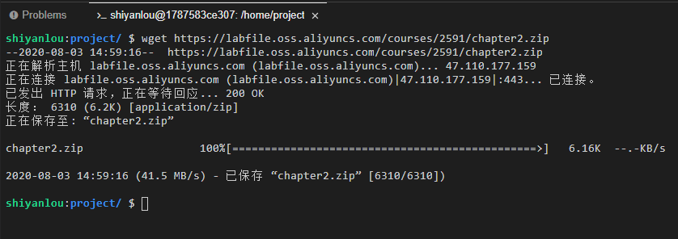
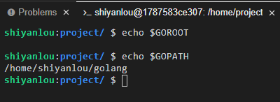
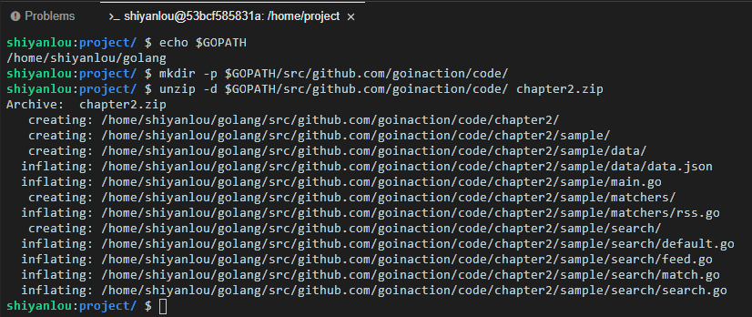
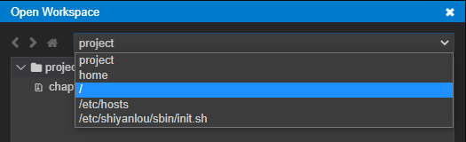
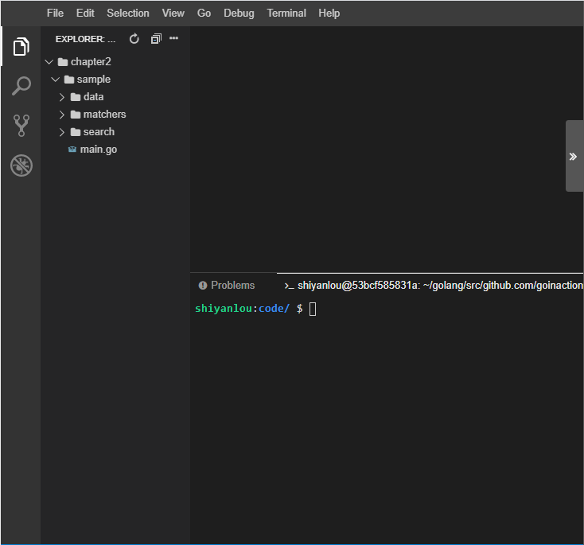
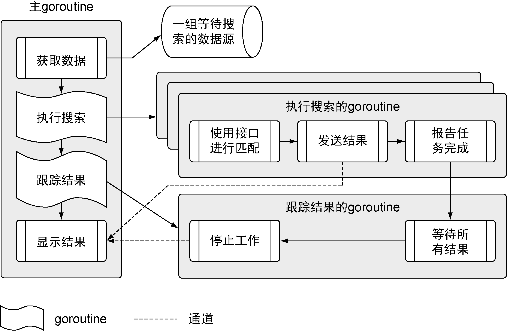
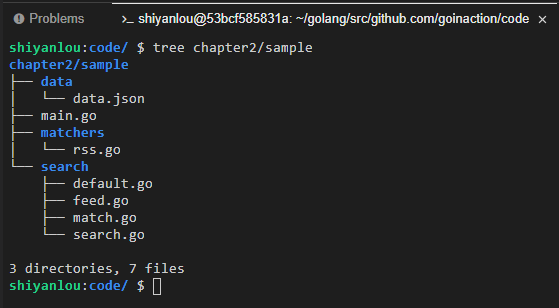
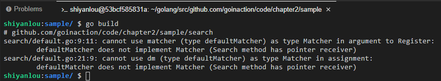
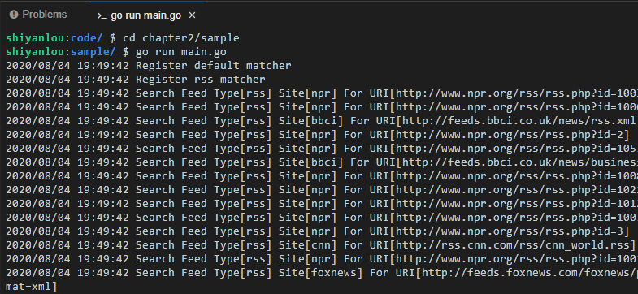
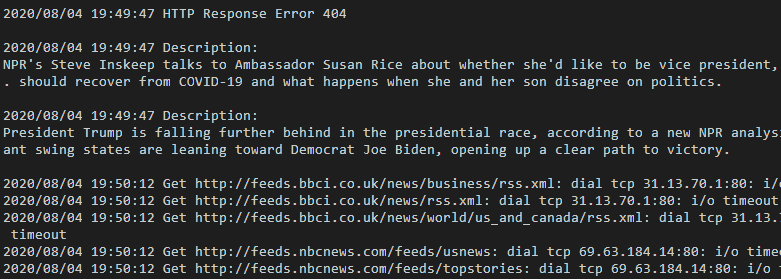

# 快速开始一个Go程序
[[TOC]]

## 课程准备

为了能更高效地使用语言进行编码，Go 语言有自己的晢学和编程习惯。Go 语言的设计者们从编程效率出发设计了这门语言，但又不会丢掉访问底层程序结构的能力。设计者们通过一组最少的关键字、内置的方法和语法，最终平衡了这两方面。Go 语言也提供了完善的标准库。标准库提供了构建实际的基于 Web 和基于网络的程序所需的所有核心库。

让我们通过一个完整的 Go 语言程序，来看看 Go 语言是如何实现这些功能的。这个程序实现的功能很常见，能在很多现在开发的 Go 程序里发现类似的功能。这个程序从不同的数据源拉取数据，将数据内容与一组搜索项做对比，然后将匹配的内容显示在终端窗口。这个程序会读取文本文件，进行网络调用，解码 XML 和 JSON 成为结构化类型数据，并且利用 Go 语言的并发机制保证这些操作的速度。

在终端中输入以下命令下载源代码：

```bash
wget https://labfile.oss.aliyuncs.com/courses/2591/chapter2.zip
```

下载成功时可以在终端看到如下输出:



同时可以在工作目录下看到下载的文件：


从标准库中导入代码时，只需要给出要导入的包名。而第三方包不同，编译器查找包的时候，总是会到 `GOROOT` 和 `GOPATH` 环境变量引用的位置去查找，你可以用 `echo` 命令查看环境变量。

```bash
echo $GOROOT
echo $GOPATH
```



为了使代码能够被正确导入，我们需要将代码解压到正确的路径下。

例如 `main.go` 中导入了 `github.com/goinaction/code/chapter2/sample/search`，我们只需要将 `chapter2.zip` 解压到 `$GOPATH/src/github.com/goinaction/code/` 下，编译器就能成功找到导入的包。

首先需要在终端中输入以下命令创建路径：

```bash
mkdir -p $GOPATH/src/github.com/goinaction/code/
```

然后在终端中输入以下命令解压：

```bash
unzip -d $GOPATH/src/github.com/goinaction/code/ chapter2.zip
```

解压成功时可以在终端看到如下输出：



然后我们需要切换 WebIDE 的工作路径，点击导航栏的 `File`->`Open Workspace...`


将路径切换到 `/`，并按照路径 `/home/shiyanlou/golang/src/github.com/goinaction/code/` 依此点击文件夹，并点击 `Open`。



可以看到新的工作目录。



## 程序架构

在深入代码之前，让我们看一下程序的架构，看看如何在所有不同的数据源中搜索数据。



这个程序分成多个不同步骤，在多个不同的 `goroutine` 里运行。我们会根据流程展示代码，从主 `goroutine` 开始，一直到执行搜索的 `goroutine` 和跟踪结果的 `goroutine`，最后回到主 `goroutine`。 我们可以在终端输入以下命令查看目录结构：

```bash
tree chapter2/sample
```



```txt
- sample
    - data
        data.json    -- 包含一组数据源
    - matchers
        rss.go        -- 搜索rs源的匹配器
    - search
        default.go    -- 搜索数据用的默认匹配器
        feed.go        -- 用于读取json文件
        match.go    -- 用于支持不同匹配器的接口
        search.go    -- 执行搜索的主控制逻辑
    main.go            -- 程序的入口
```

这个应用的代码使用了 4 个文件夹，按字母顺序列出。文件夹 `data` 中有一个 JSON 文档，其内容是程序要拉取和处理的数据源。文件夹 `matchers` 中包含程序里用于支持搜索不同数据源的代码。目前程序只完成了支持处理 RSS 类型的数据源的匹配器。文件夹 `search` 中包含使用不同匹配器进行搜索的业务逻辑。最后，父级文件夹 `sample` 中有个 `main.go` 文件，这是整个程序的入口。

## `main` 包

程序的主入口可以在 `main.go` 文件里找到，请在 WebIDE 中打开 `chapter2/sample/main.go`，虽然这个文件只有 21 行代码，依然有几点需要注意。

每个可执行的 Go 程序都有两个明显的特征。一个特征是第 18 行声明的名为 `main` 的函数。构建程序在构建可执行文件时，需要找到这个已经声明的 `main` 函数，把它作为程序的入口。第二个特征是程序的第 01 行的包名 `main`。

可以看到， `main` 函数保存在名为 `main` 的包里。如果 `main` 函数不在 `main` 包里，构建工具就不会生成可执行的文件。

Go 语言的每个代码文件都属于一个包， `main.go` 也不例外。一个包定义一组编译过的代码，包的名字类似命名空间，可以用来间接访问包内声明的标识符。这个特性可以把不同包中定义的同名标识符区别开。

关键字 `import` 就是导入一段代码，让用户可以访问其中的标识符，如类型、函数、常量和接口。在这个例子中，`main.go` 里的代码就可以引用 `search` 包里的 `Run` 函数。`main.go` 还导入了标准库里的 `log` 和 `os` 包。

所有处于同一个文件夹里的代码文件，必须使用同一个包名。按照惯例，包和文件夹同名。一个包定义一组编译后的代码，每段代码都描述包的一部分。你可以看看 `import` 是如何指定那个项目里名叫 `search` 的文件夹的。

你可能注意到 07 行导入 `matchers` 包的时候，导入的路径前面有一个下划线，这是为了让 Go 语言对包做初始化操作，但是并不使用包里的标识符。为了让程序的可读性更强 Go 编译器不允许声明导入某个包却不使用。下划线让编译器接受这类导入，并且调用对应包内的所有代码文件里定义的`init`函数。对这个程序来说，这样做的目的是调用 `matchers`包中的 `rss.go` 代码文件里的 `init` 函数，注册 RSS 匹配器，以便后用。我们后面会展示具体的工作方式。

代码文件 `main.go` 里也有—个 `init` 函数。程序中每个代码文件里的 `init` 函数都会在 `main` 函数执行前调用。这个 `init` 函数将标准库里日志类的输出，从默认的标准错误( `stderr` )，设置为标准输出( `stdout` )设备。

`main` 函数里调用了 `search` 包里的 `Run` 函数。这个函数包含程序的核心业务逻辑，需要传入个字符串作为搜索项。一旦 `Run` 函数退出，程序就会终止。

## `search` 包

这个程序使用的框架和业务逻辑都在 `search`包里。这个包由 4 个不同的代码文件组成，每个文件对应一个独立的职责。我们会逐步分析这个程序的逻辑，到时再说明各个代码文件的作用。

由于整个程序都围绕匹配器来运作，我们先简单介绍一下什么是匹配器。这个程序里的匹配器，是指包含特定信息、用于处理某类数据源的实例。在这个示例程序中有两个匹配器。框架本身实现了一个无法获取任何信息的默认匹配器，而在 `matchers`包里实现了 RSS 匹配器。RSS 匹配器知道如何获取、读入并查找 RSS 数据源。随后我们会扩展这个程序，加入能读取 JSON 文档或 CSV 文件的匹配器。我们后面会再讨论如何实现匹配器。

## `search.go`

请在 WebIDE 中打开 `chapter2/sample/search/search.go`， `main.go` 中调用的 `Run` 函数就在这个文件里。

可以看到，每个代码文件都以 `package` 关键字开头，随后跟着包的名字。文件夹 `search` 下的每个代码文件都使用 `search` 作为包名。第 03 行到第 06 行代码导入标准库的 `log` 和 `sync` 包。

`log`包提供打印日志信息到标准输出( `stdout`)、标准错误( `stderr`)或者自定义设备的功能。 `sync` 包提供同步 `goroutine` 的功能。这个示例程序需要用到同步功能。

`matchers` 是全书第一次声明的变量，这个变量没有定义在任何函数作用域内，所以会被当成包级变量。这个变量使用关键字 `var` 声明，而且声明为 `Matcher` 类型的映射( `map` )，这个映射以 `string` 类型值作为键， `Matcher` 类型值作为映射后的值。 `Matcher` 类型在代码文件 `matcher.go` 中声明，后面再讲这个类型的用途。这个变量声明还有一个地方要强调一下：变量名 `matchers` 是以小写字母开头的。

当代码导入了一个包时，程序可以直接访问这个包中任意一个公开的标识符，这些标识符以大写字母开头。以小写字母开头的标识符是不公开的，不能被其他包中的代码直接访问。但是，其他包可以间接访问不公开的标识符。例如，一个函数可以返回一个未公开类型的值，那么这个函数的任何调用者，哪怕调用者不是在这个包里声明的，都可以访问这个值。

这行变量声明还使用赋值运算符和特殊的内置函数 `make` 初始化了变量。

`map` 是 Go 语言里的一个引用类型，需要使用 `make` 来构造。如果不先构造 `map` 并将构造后的值赋值给变量，会在试图使用这个 `map` 变量时收到出错信息。这是因为 `map` 变量默认的零值是 `nil` 。

在 Go 语言中，所有变量都被初始化为其零值。对于数值类型，零值是 0；对于字符串类型，零值是空字符串；对于布尔类型，零值是 `false` ；对于指针，零值是 `nil` 。对于引用类型来说，所引用的底层数据结构会被初始化为对应的零值。但是被声明为其零值的引用类型的变量，会返回 `nil` 作为其值。

现在，让我们看看之前在 `main` 函数中调用的 `Run` 函数的内容，如 `search.go` 代码第 11 行到第 57 行。

`Run`函数包括了这个程序最主要的控制逻辑。这段代码很好地展示了如何组织 Go 程序的代码，以便正确地并发启动和同步 `goroutine` 。先来步一步考察整个逻辑，再考察每步实现代码的细节。

先来看看 Run 函数是怎么定义的，如代码第 11 到第 12 行所示。Go 语言使用关键字 `func` 声明函数，关键字后面紧跟着函数名、参数以及返回值。对于 `Run` 这个函数来说，只有一个参数，是 `string` 类型的，名叫 `searchTerm` 。这个参数是 `Run` 函数要搜索的搜索项，如果回头看看 `main` 函数，在代码 `main.go` 第 17 行到第 21 行可以看到如何传递这个搜索项。

`Run` 函数做的第一件事情就是获取数据源 `feeds` 列表。这些数据源从互联网上抓取数据，之后对数据使用特定的搜索项进行匹配，如 `search/search.go` 代码第 13 行到第 17 行所示。

这里有几个值得注意的重要概念。`Run` 函数调用了 `search` 包的 `RetrieveFeeds` 函数。这个函数返回两个值。第—个返回值是一组 `Feed` 类型的切片。切片是一种实现了一个动态数组的引用类型。在 Go 语言里可以用切片来操作一组数据。第二个返回值是一个错误值。随后检查返回的值是不是真的是一个错误。如果真的发生错误了，就会调用 `log` 包里的 `Fatal` 函数。 `Fatal` 函数接受这个错误的值，并将这个错误在终端窗口里输出，随后终止程序。

不仅仅是 Go 语言，很多语言都允许一个函数返回多个值。一般会像 `RetrieveFeeds` 函数这样声明一个函数返回个值和一个错误值。如果发生了错误，永远不要使用该函数返回的另一个值。(这个说法并不严格成立，Go 标准库中的 `io Reader.Read` 方法就允许同时返回数据和错误。但是，如果是自己实现的函数，要尽量遵守这个原则，保持含义足够明确。)这时必须忽略另个值，否则程序会产生更多的错误，甚至崩溃。

让我们仔细看看从函数返回的值是如何赋值给变量的，如代码第 13 行到第 14 行所示。

`Run`函数中使用简化的变量声明运算符( `:=`)将函数返回的值赋值给变量。这个运算符用于声明个变量，同时给这个变量赋予初始值。编译器使用函数返回值的类型来确定每个变量的类型。简化变量声明运算符只是一种简化记法，让代码可读性更髙。这个运算符声明的变量和其他使用关键字 `νar` 声明的变量没有任何区别。

至此，我们得到了数据源列表，进入到后面的代码，如代码第 19 行到第 20 行所示。

在第 20 行，我们使用内置的 `make` 函数创建了一个无缓冲的通道。我们使用简化变量声明运算符，在调用 `make` 的同时声明并初始化该通道变量。根据经验，如果需要声明初始值为零值的变量，应该使用 `var` 关键字声明变量；如果提供确切的非零值初始化变量或者使用函数返回值创建变量，应该使用简化变量声明运算符。

在 Go 语言中，通道( `channel` )和映射( `map` )与切片( `slice` )一样，也是引用类型，不过通道本身实现的是一组带类型的值，这组值用于在 `goroutine` 之间传递数据。通道内置同步机制，从而保证通信安全。之后两行是为了防止程序在全部搜索执行完之前终止，如代码第 22 行到第 27 行所示。

在 Go 语言中，如果 `main` 函数返回，整个程序也就终止了。Go 程序终止时，还会关闭所有之前启动且不在运行的 `goroutine` 。写并发程序的时候，最佳做法是，在 `main` 函数返回前，清理并终止所有之前启动的 `goroutine` 。编写启动和终止时的状态都很清晰的程序，有助減少 `bug` ，防止资源异常。

这个程序使用 `sync` 包的 `WaitGroup` 跟踪所有启动的 `goroutine` 。非常推荐使用 `WaitGroup` 来跟踪 `goroutine` 的工作是否完成。 `WaitGroup` 是一个计数信号量，我们可以利用它来统计所有的 `goroutine` 是不是都完成了工作。

在第 23 行我们声明了—个 `sync` 包里的 `WaitGroup` 类型的变量。我们将 `waitGroup` 变量的值设置为将要启动的 `goroutine` 的数量。马上就能看到，我们为每个数据源都启动了一个 `goroutine` 来处理数据。每个 `goroutine` 完成其工作后，就会递减 `waitGroup` 变量的计数值，当这个值递减到 0 时，我们就知道所有的工作都做完了。

现在让我们来看看为每个数据源启动 `goroutine` 的代码，如代码第 29 行到第 42 行所示。

第 30 行到第 42 行迭代之前获得的 `feeds`，为每个 `feed`启动一个 `goroutine` 。我们使用关键字 `for range` 对 `feeds` 切片做迭代。关键字 `range` 可以用于迭代数组、字符串、切片、映射和通道。使用迭代切片时，每次迭代会返回两个值。第一个值是迭代的元素在切片里的索引位置，第二个值是元素值的一个副本。

如果仔细看一下第 30 行的 `for range`语句，会发现再次使用了下划线标识符，如代码第 29 行到第 30 行所示。

这是第二次看到使用了下划线标识符。第一次是在 `main go` 里导入 `matchers` 包的时候。这次，下划线标识符的作用是占位符，占据了保存 `range` 调用返回的索引值的变量的位置。如果要调用的函数返回多个值，而又不需要其中的某个值，就可以使用下划线标识符将其忽略。在我们的例子里，我们不需要使用返回的索引值，所以就使用下划线标识符把它忽略掉。

在循环中，我们首先通过 `map` 查找到一个可用于处理特定数据源类型的数据的 `Matcher` 值，如代码第 31 行到第 35 行所示。

随后我们检查 `map` 是否含有符合数据源类型的值。查找 `map` 里的键时，可以赋值给一个变量，为了精确查找，也可以赋值给两个变量。赋值给两个变量时第一个值和赋值给一个变量时的值一样，是 `map` 查找的结果值。如果指定了第二个值，就会返回一个布尔标志，来表示查找的键是否存在于 `map` 里。如果这个键不存在， `map` 会返回其值类型的零值作为返回值，如果这个键存在， `map` 会返回键所对应值的副本。

在 `Run` 函数中我们检查这个键是否存在于 `map` 里。如果不存在，使用默认匹配器。这样程序在不知道对应数据源的具体类型时，也可以执行，而不会中断。之后，启动一个 `goroutine` 来执行搜索，如代码第 37 行到第 41 行所示。

一个 `goroutine` 是—个独立于其他函数运行的函数。使用关键字`go`启动一个 `goroutine` ，并对这个 `goroutine` 做并发调度。我们使用关键字 `go` 启动了一个匿名函数作为 `goroutine` 。**匿名函数**是指没有明确声明名字的函数。在 `for range`循环里，我们为每个数据源，以 `goroutine` 的方式启动了一个匿名函数。这样可以并发地独立处理每个数据源。

数据匿名函数也可以接受声明时指定的参数。在第 38 行，我们指定匿名函数要接受两个参数，一个类型为 `Matcher` ，另一个是指向一个 `Feed` 类型值的指针。这意味着变量 `feed` 是一个**指针变量**。指针变量可以方便地在函数之间共享数据。使用指针变量可以让函数访问并修改一个变量的状态，而这个变量可以在其他函数甚至是其他 `goroutine` 的作用域里声明。

在第 41 行，`matcher` 和 `feed` 两个变量的值被传入匿名函数。在 Go 语言中，所有的变量都以值的方式传递。因为指针变量的值是所指向的内存地址，在函数间传递指针变量，是在传递这个地址值，所以依旧被看作以值的方式在传递。

在第 39 行到第 40 行，可以看到每个 `goroutine` 是如何工作的，如代码第 39 行到第 40 行所示。

`goroutine` 做的第一件事是调用一个叫 `Match` 的函数，这个函数可以在 `match.go` 文件里找到。 `Match`函数的参数是一个 `Matcher` 类型的值、一个指向 `Feed` 类型值的指针、搜索项以及输出结果的通道。 `Match` 函数会搜索数据源的数据，并将匹配结果输出到 `results` 通道。

一旦 `Match` 函数调用完毕，就会递减 `waitGroup` 的计数。如果所有 `goroutine` 都执行调用 `Match` 函数和 `Done` 方法，程序就知道每个数据源都处理完成。调用 `Done` 方法这一行还有一个值得注意的细节： `waitGroup` 的值没有作为参数传入匿名函数，但是匿名函数依旧访问到了这个值。

Go 语言支持闭包，这里就应用了闭包。所谓“闭包”，就是在构造函数体内定义另外的函数作为目标对象的方法函数，而这个对象的方法函数反过来引用外层函数体中的临时变量。实际上，在匿名函数内访问 `searchTerm` 和 `results` 变量，就是通过闭包的形式访问的。因为有了闭包，函数可以直接访问到那些没有作为参数传入的变量。匿名函数并没有拿到这些变量的副本，而是直接访问外层函数作用域中声明的这些变量本身。因为 `matcher` 和 `feed` 变量每次调用时值不相同，所以并没有使用闭包的方式访问这两个变量，如代码第 29 行到第 32 行所示。

可以看到，变量`feed`和 `matcher`的值会随着循环的迭代而改变。如果我们使用闭包访问这些变量，随着外层函数里变量值的改变，内层的匿名函数也会感知到这些改变。所有的 `goroutine`都会因为闭包共享同样的变量。除非我们以函数参数的形式传值给函数，否则绝大部分 `goroutine`最终都会使用同一个 `matcher` 来处理同一个 `feed` ，这个值很有可能是 `feeds` 切片的最后一个值。

随着每个 `goroutine` 搜索工作的运行，将结果发送到 `results` 通道，并递减 `waitGroup` 的计数，我们需要种方法来显示所有的结果，并让 `main` 函数持续工作，直到完成所有的操作，如代码第 44 行到第 57 行所示。

第 45 行到第 56 行的代码等我们学习了 `search` 包里的其他代码后再来解释。我们现在只解释表面的语法，随后再来解释底层的机制。我们以 `goroutine`的方式启动了另一个匿名函数。这个匿名函数没有输入参数，使用闭包访问了 `waitGroup` 和 `results` 变量。这个 `goroutine` 里面调用了 `WaitGroup` 的 `Wait` 方法。这个方法会导致 `goroutine` 阻塞，直到 `WaitGroup` 内部的计数到达 0。之后，`goroutine` 调用了内置的 `close` 函数，关闭了通道，最终导致程序终止。

`Run` 函数的最后一段代码调用了 `match.go` 文件里的 `Display` 函数。一旦这个函数返回，程序就会终止。而之前的代码保证了所有 `results` 通道里的数据被处理之前， `Display` 函数不会返回。

## `feed.go`

现在已经看过了 `Run` 函数，让我们继续看看 `search.go` 文件的 `RetrieveFeeds` 函数调用背后的代码。这个函数读取 `data.json` 文件并返回数据源的切片。这些数据源会输出内容，随后使用各自的匹配器进行搜索。

请在 WebIDE 中打开 `chapter2/sample/search/feed.go`，这个代码文件在 `search` 文件夹里，所以第 01 行声明了包的名字为 `search` 。第 03 行到第 06 行导入了标准库中的两个包。 `json` 包提供编解码 JSON 的功能， `os` 包提供访问操作系统的功能，如读文件。

你可能注意到了导入 `json` 包的时候需要指定 `encoding` 路径。不考虑这个路径的话，我们导入包的名字叫作 `json` 。不管标准库的路径是什么样的，并不会改变包名。我们在访问 `json` 包内的函数时依旧是指定 `json` 这个名字。

在第 08 行，我们声明了一个叫作 `dataFile` 的常量，使用内容是磁盘上根据相对路径指定的数据文件名的字符串做初始化。因为 Go 编译器可以根据赋值运算符右边的值来推导类型，声明常量的时候不需要指定类型。此外，这个常量的名称使用小写字母开头，表示它只能在 `search` 包内的代码里直接访问，而不暴露到包外。

接着我们来看看 `data.json` 数据文件的部分内容，请在 WebIDE 中打开 `chapter2/sample/data/data.json`。

数据文件包括一个 JSON 文档数组。数组的每一项都是一个 JSON 文档，包含获取数据的网站名、数据的链接以及我们期望获得的数据类型。

这些数据文档需要解码到一个结构组成的切片里，以便我们能在程序里使用这些数据。请在 WebIDE 中打开 `chapter2/sample/search/feed.go`，来看看用于解码数据文档的结构类型，如代码第 10 行到第 15 行所示。

在第 11 行到第 15 行，我们声明了一个名叫 `Feed` 的结构类型。这个类型会对外暴露。这个类型里面声明了 3 个字段，每个字段的类型都是字符串，对应于数据文件中各个文档的不同字段。每个字段的声明最后 **`** 引号里的部分被称作标记( `tag`)。这个标记里描述了 JSON 解码的元数据，用于创建`Feed` 类型值的切片。每个标记将结构类型里字段对应到 JSON 文档里指定名字的字段。

现在可以看看 `search.go` 代码文件中调用的 `RetrieveFeeds` 函数了。这个函数读取数据文件，并将每个 JSON 文档解码，存入一个 `Feed` 类型值的切片里，如代码第 17 行到第 36 行所示。

让我们从第 18 行的函数声明开始。这个函数没有参数，会返回两个值。第一个返回值是一个切片，其中每一项指向一个 `Feed` 类型的值。第二个返回值是个 `error` 类型的值，用来表示函数是否调用成功。在这个代码示例里，会经常看到返回 `error` 类型值来表示函数是否调用成功。这种用法在标准库里也很常见。

现在让我们看看第 20 行到第 23 行。在这几行里，我们使用 `os` 包打开了数据文件。我们使用相对路径调用 `Open` 方法，并得到两个返回值。第一个返回值是一个指针，指向 `File` 类型的值，第二个返回值是 `error` 类型的值，检查 `Open` 调用是否成功。紧接着检查了返回的 `error` 类型错误值，如果打开文件真的有问题，就把这个错误值返回给调用者。

如果成功打开了文件，会进入到第 27 行。这里使用了关键字 `defer` ，如代码第 25 行到第 27 行所示。

关键字 `defer` 会安排随后的函数调用在函数返回时才执行。在使用完文件后，需要主动关闭文件用关键字 `defer` 来安排调用 `Close` 方法，可以保证这个函数一定会被调用。哪怕函数意外崩溃终止，也能保证关键字 `defer` 安排调用的函数会被执行。关键字 `defer` 可以缩短打开文件和关闭文件之间间隔的码行数，有助提高代码可读性，减少错误。

现在可以看看这个函数的最后几行，如代码第 29 行到第 36 行所示。

在第 31 行我们声明了一个名字叫 `feeds` ，值为 `nil` 的切片，这个切片包含一组指向 `Feed` 类型值的指针。之后在第 32 行我们调用 `json` 包的 `NewDecoder` 函数，然后在其返回值上调用 `Decode` 方法。我们使用之前调用 `Open` 返回的文件句柄调用 `DeCoder` 函数，并得到一个指向 `Decoder` 类型的值的指针。之后再调用这个指针的 `Decode` 方法，传入切片的地址。之后 `Decode` 方法会解码数据文件，并将解码后的值以 Fed 类型值的形式存入切片里。

根据 `Decode` 方法的声明，该方法可以接受任何类型的值，如以下代码所示。

```go
func (dec *Decoder) Decode(v interface{}) error
```

`Decode` 方法接受一个类型为 `interface{}` 的值作为参数。这个类型在 Go 语言里很特殊，一般会配合 `reflect` 包里提供的反射功能一起使用。

`Decode` 方法给函数的调用者返回了切片和错误值。在这个例子里，不需要对 `Decode` 调用之后的错误做检查。函数执行结束，这个函数的调用者可以检查这个错误值，并决定后续如何处理。

## `match.go` / `default.go`

请在 WebIDE 中打开 `chapter2/sample/search/search.json`。

`match.go` 代码文件包含创建不同类型匹配器的代码，这些匹配器用于在 `run` 函数里对数据进行搜索。让我们回头看看 `Run` 函数里使用不同匹配器执行搜索的代码，如代码第 29 行到第 42 行。

代码的第 32 行，根据数据源类型查找一个匹配器值。这个匹配器值随后会用于在特定的数据源里处理搜索。之后在第 38 行到第 41 行启动了一个 `goroutine` ，让匹配器对数据源的数据进行搜索。让这段代码起作用的关键是这个架构使用—个接口类型来匹配并执行具有特定实现的匹配器。这样，就能使用这段代码，以一致且通用的方法，来处理不同类型的匹配器值。让我们看一下 `match.go` 里的代码，看看如何才能实现这一功能。请在 WebIDE 中打开 `chapter2/sample/search/match.json`。

让我们看一下第 15 行到第 17 行，这里声明了一个名为 `Matcher` 的接口类型。之前，我们只见过声明结构类型，而现在看到如何声明一个 `interface` (接口)类型。 `interface` 关键字声明了一个接口，这个接口声明了结构类型或者具名类型需要实现的行为。

个接口的行为最终由在这个接口类型中声明的方法决定对于 `Matcher` 这个接口来说，只声明了一个 `Search` 方法，这个方法输入一个指向 `Feed` 类型值的指针和一个 `string` 类型的搜索项。这个方法返回两个值：一个指向 `Result` 类型值的指针的切片，另一个是错误值。

命名接口的时候，也需要遵守 Go 语言的命名惯例。如果接口类型只包含一个方法，那么这个类型的名字以 `er` 结尾。我们的例子里就是这么做的，所以这个接口的名字叫作 `Matcher` 。如果接口类型内部声明了多个方法，其名字需要与其行为关联如果要让个用户定义的类型实现一个接口，这个用户定义的类型要实现接口类型里声明的所有方法。

让我们切换到 `default.go` 代码文件，看看默认匹配器是如何实现 `Matcher` 接口的，如 `defalut.go` 代码第 01 行到第 15 行所示。

在第 04 行，我们使用一个空结构声明了一个名叫 `defaultMatcher` 的结构类型。空结构在创建实例时，不会分配任何内存。这种结构很适合创建没有任何状态的类型。对于默认匹配器来说，不需要维护任何状态，所以我们只要实现对应的接口就行。

在第 13 行到第 15 行，可以看到 `defaultMatcher` 类型实现 `Matcher` 接口的代码。实现接口的方法 `Search` 只返回两个 `nil` 值。其他的实现，如 RSS 匹配器的实现，会在这个方法里使用特定的业务逻辑规则来处理搜索。

`Search` 方法的声明也声明了 `defaultMatcher` 类型的值的接收者，如代码第 13 行所示。

如果声明函数的时候带有接收者，则意味着声明了一个方法。这个方法会和指定的接收者的类型绑在一起。在我们的例子里， `Search` 方法与 `defaultMatcher` 类型的值绑在一起。这意味着我们可以使用 `defaultMatcher` 类型的值或者指向这个类型值的指针来调用 `Search` 方法。无论我们是使用接收者类型的值来调用这个方法，还是使用接收者类型值的指针来调用这个方法，编译器都会正确地引用或者解引用对应的值，作为接收者传递给 `Search` 方法，例如：

```go
//方法声明为使用 defaultMatcher类型的值作为接收者
func(m defaultMatcher) Search(feed *Feed, searchTerm string)

//声明一个指向 defaultMatcher类型值的指针
dm:= new(defaultMatcher)

//编译器会解开m指针的引用,使用对应的值调用方法
dm.Search(feed, "test")

//方法声明为使用指向 defaultMatcher类型值的指针作为接收者
func (m *defaultMatcher) Search(feed *Feed, searchTerm string)

//声明一个 defaultMatcher类型的值
var dm defaultMatcher

//编译器会自动生成指针引用dm值,使用指针调用方法
dm.Search(feed,"test")
```

因为大部分方法在被调用后都需要维护接收者的值的状态，所以，一个最佳实践是，将方法的接收者声明为指针。对于 `defaultMatcher` 类型来说，使用值作为接收者是因为创建个 `defaultMatcher` 类型的值不需要分配内存。由于 `defaultMatcher` 不需要维护状态，所以不需要指针形式的接收者。

与直接通过值或者指针调用方法不同，如果通过接口类型的值调用方法，规则有很大不同。使用指针作为接收者声明的方法，只能在接口类型的值是一个指针的时候被调用。使用值作为接收者声明的方法，在接口类型的值为值或者指针时，都可以被调用。

接下来，我们将分别尝试使用值来调用接口方法和使用指针来调用接口方法来进行验证，请在 WebIDE 中打开 `chapter2/sample/search/default.go`。

#### 使用指针来调用接口方法

修改代码第 13 行的方法声明，使用指向 `defaultMatcher` 类型值的指针作为接收者。

```go
//方法声明为使用指向 defaultMatcher类型值的指针作为接收者
func (m *defaultMatcher) Search(feed *Feed, searchTerm string)
```

然后在文件末尾添加如下代码：

```go
func call(){
    //通过 interface类型的值来调用方法
    var dm defaultMatcher
    var matcher Matcher=dm            //将值赋值给接口类型
    matcher.Search(nil,"test")    //使用值来调用接口方法
}
```

在终端输入如下代码进行编译：

```bash
go build
```

可以在终端得到如下输出：



#### 使用值来调用接口方法

修改代码第 13 行的方法声明，使用指向 `defaultMatcher` 类型值作为接收者。

```go
//方法声明为使用指向 defaultMatcher类型值的指针作为接收者
func (m defaultMatcher) Search(feed *Feed, searchTerm string)
```

然后在文件末尾的 `call` 函数替换为如下代码：

```go
func call(){
    //通过 interface类型的值来调用方法
    var dm defaultMatcher
    var matcher Matcher = &dm    // 将指针赋值给接口类型
    matcher.Search(nil, "test") // 使用指针来调用接口方法
}
```

在终端输入如下代码进行编译：

```bash
go build
```

编译没有报错说明编译成功。

除了 `Search` 方法， `defaultMatcher` 类型不需要为实现接口做更多的事情了。从这段代码之后，不论是 `defaultMatcher` 类型的值还是指针，都满足 `Matcher` 接口，都可以作为 `Matcher` 类型的值使用。这是代码可以工作的关键。 `defaultMatcher` 类型的值和指针现在还可以作为 `Matcher` 的值，赋值或者传递给接受 `Matcher` 类型值的函数。

请在 WebIDE 中打开 `chapter2/sample/search/match.go`，让我们看看 `match.go` 代码文件里实现 `Match` 函数的代码，如代码第 19 行到第 33 行所示。这个函数在 `search.go` 代码文件的第 39 行中由 `Run` 函数调用。

这个函数使用实现了 `Matcher` 接口的值或者指针，进行真正的搜索。这个函数接受 `Matcher` 类型的值作为第—个参数。只有实现了 `Matcher` 接口的值或者指针能被接受。因为 `defaultMatcher` 类型使用值作为接收者，实现了这个接口，所以 `defaultMatche` 类型的值或者指针可以传入这个函数。

在第 23 行，调用了传入函数的 `Match` 函数中调用了传入函数的 `Matcher` 类型值的 `Search` 方法。这里执行了 `Matcher` 变量中特定的`Search` 方法。 `Search` 方法返回后，在第 24 行检测返回的错误值是否真的是一个错误。如果是一个错误函数通过 `log` 输出错误信息并返回。如果搜索并没有返回错误，而是返回了搜索结果，则把结果写入通道，以便正在监听通道的`main` 函数就能收到这些结果。

`match.go` 中的最后部分代码就是`main` 函数调用的 `Display` 函数，如 `match.go` 代码第 35 行到第 43 行所示。这个函数会阻止程序终止，直到接收并输出了搜索 `goroutine` 返回的所有结果。

当通道被关闭时，通道和关键字 `range` 的行为，使这个函数在处理完所有结果后才会返回。让我们再来简单看一下 `Run` 函数的代码，特别是关闭 `results` 通道并调用 `Display` 函数那段，如 `search.go` 代码第 44 行到第 57 行所示。

`Run` 函数中定义的 `goroutine` 会等待 `waitGroup` ，直到搜索 `goroutine` 调用了 `Done` 方法。一旦最后一个搜索 `goroutine` 调用了 `Done` 和 `Wait` 方法会返回，之后会关闭 `results` 通道。一旦通道关闭， `goroutine` 就会终止，不再工作。 在 `match.go` 代码中，搜索结果会被写入通道，如 `match.go` 代码第 29 行到第 32 行所示。

如果回头看看 `match.go` 代码文件的第 40 行到第 42 行的 `for range` 循环，我们就能把写入结果、关闭通道和处理结果这些流程串在一起。

`match.go` 代码文件的 `for range`循环会一直阻塞，直到有结果写入通道。在某个搜索 `goroutine` 向通道写入结果后（如在 `match.go` 代码文件中第 31 行所示）， `for range` 循环被唤醒，读出这些结果。之后，结果会立刻写到日志中。看上去这个 `for range` 循环会无限循环下去，但其实不然。一旦 `search.go` 代码文件第 51 行关闭了通道， `for range` 循环就会终止， `Display` 函数也会返回。

在我们去看 RSS 匹配器的实现之前，再看一下程序开始执行时，如何初始化不同的匹配器。为此，我们需要先回头看看 `default.go` 代码文件的第 07 行到第 10 行。

在代码文件 `default.go` 里有一个特殊的函数，名叫 `init` 。在 `main.go` 代码文件里也能看到同名的函数。 我们之前说过，程序里所有的 `init` 方法都会在 `main` 函数启动前被调用。

让我们再看看 `main.go` 代码文件导入了哪些代码，如 `main.go` 代码第 07 行到第 08 行所示。

第 8 行导入了 `search` 包，让编译器可以找到 `default.go` 代码文件里的 `init` 函数。一旦编译器发现 `init` 函数，它就会给这个函数优先执行的权限，保证其在 `main` 函数之前被调用。

代码文件 `default.go` 里的 `init` 函数执行个特殊的任务。这个函数会创建个 `defaultMatcher` 类型的值，并将这个值传递给 `search.go` 代码文件里的 `Register` 函数，如 `search.go` 代码第 59 行到第 67 行所示。

这个函数的职责是，将一个 `Matcher` 值加入到保存注册匹配器的映射中。所有这种注册都应该在 `main` 函数被调用前完成。使用 `init` 函数可以非常完美地完成这种初始化时注册的任务。

## RSS 匹配器

RSS（Really Simple Syndication），中文译作简易信息聚合，是一种消息来源格式规范，用以聚合经常发布更新数据的网站，例如博客文章、新闻、音频或视频的网摘。RSS 文件（或称做摘要、网络摘要、或频更新，提供到频道）包含全文或是节录的文字，再加上发布者所订阅之网摘数据和授权的元数据。简单来说 RSS 能够让用户订阅个人网站个人博客，当订阅的网站有新文章是能够获得通知。

最后要看的一部分代码是 RSS 匹配器的实现代码。我们之前看到的代码搭建了一个框架，以便能够实现不同的匹配器来搜索内容。RSS 匹配器的结构与默认匹配器的结构很类似。每个匹配器为了匹配接口 `Search` 方法的实现都不同，因此匹配器之间无法互相替换。

以下是 RSS 文档是—个例子。当我们访问数据源列表里 RSS 数据源的链接时，期望获得的数据就和下面的例子类似。

```html
<rss xmlns:npr="http://www.npr.org/rss/" xmins:nprml=http://api"
    <channel>
        <title>News</title>
        <link>...</link>
        <description>...</description>

        <language>en</language>
        <copyright>Copyright 2014 NPR- For Personal Use
        <image>...</image>
        <item>
            <titley>
                Putin Says He'll Respect Ukraine Vote But U.S.
            </title>
        <description>
            The white House and State Department have called on the
        </description>
```

如果用浏览器打开代码中的任意一个链接，就能看到期望的 RSS 文档的完整内容。RSS 匹配器的实现会下载这些 RSS 文档，使用搜索项来搜索标题和描述域，并将结果发送给 `results` 通道。请在 WebIDE 中打开 `chapter2/sample/matchers/rss.go`，让我们先看看 `rss.go` 代码文件的前 12 行代码。

和其他代码文件一样，第 1 行定义了包名。这个代码文件处于名叫 `matchers` 的文件夹中，所以包名也叫 `matchers` 。之后，我们从标准库中导入了 6 个库，还导入了 `search` 包。再一次，我们看到有些标准库的包是从标准库所在的子文件夹导入的，如 `xml` 和 `http` 。就像 `json` 包一样，路径里最后一个文件夹的名字代表包的名字。 为了让程序可以使用文档里的数据，解码 RSS 文档的时候需要用到以下 4 个结构类型，如代码第 14 行到第 58 行所示。

如果把这些结构与任意一个数据源的 RSS 文档对比，就能发现它们的对应关系。解码 ⅩML 的方法与我们在 `feed.go` 代码文件里解码 `JSON` 文档一样。接下来我们可以看看 `rssMatcher` 类型的声明，如代码第 60 行到第 61 行所示。

再说明一次，这个声明与 `defaultMatcher` 类型的声明很像。因为不需要维护任何状态，所以我们使用了一个空结构来实现 `Matcher` 接口。接下来看看匹配器 `init` 函数的实现，如代码第 63 行到第 67 行所示。

就像在默认匹配器里看到的一样， `init` 函数将 `rssMatcher` 类型的值注册到程序里，以备后用。让我们再看一次 `main.go` 代码文件里的导入部分，如 `main.go` 代码第 07 行到第 08 行所示。

`main.go` 代码文件里的代码并没有直接使用任何 `matchers` 包里的标识符。不过，我们依旧需要编译器安排调用 `rss.go` 代码文件里的 `init` 函数。在第 07 行，我们使用下划线标识符作为别名导入 `matchers` 包，完成了这个调用。这种方法可以让编译器在导入未被引用的包时不报错，而且依旧会定位到包内的 `init` 函数。我们已经看过了所有的导入、类型和初始化函数，现在来看看最后两个用于实现 `Matcher` 接口的方法，如 `rss.go` 代码第 114 行到第 140 行所示。

方法 `retrieve` 并没有对外暴露，其执行的逻辑是从 RSS 数据源的链接拉取 RSS 文档。在第 121 行，可以看到调用了 `http` 包的 `Get` 方法。使用 `http` 包，Go 语言可以很容易地进行网络请求。当 `Get` 方法返回后，我们可以得到个指向 `Response` 类型值的指针。之后会监测网络请求是否出错，并安排函数返回时调用 `close` 方法。

在第 131 行，我们检测了 `Response` 值的 `Statuscode` 字段，确保收到的响应是 `200` ，任何不是 `200` 的请求都需要作为错误处理。如果响应值不是 `200` ，我们使用 `fmt` 包里的 `Errorf` 函数返回一个自定义的错误。最后 3 行代码很像之前解码 JSON 数据文件的代码。只是这次使用 `xml` 包并调用了同样叫作 `NewDecoder` 的函数。这个函数会返回一个指向 `Decoder` 值的指针。之后调用这个指针的 `Decode` 方法，传入 `rssDocument` 类型的局部变量 `document` 的地址。最后返回这个局部变量的地址和 `Decode` 方法调用返回的错误值。

最后我们来看看实现了 `Matcher` 接口的方法，如代码第 69 行到第 112 行所示。

我们从第 71 行 `results` 变量的声明开始分析，如代码第 71 行所示，这个变量用于保存并返回找到结果。

我们使用关键字 `val` 声明了一个值为 `nil` 的切片，切片每一项都是指向 `Result` 类型值的指针。 `Result` 类型的声明在之前 `match.go` 代码文件中可以找到。之后我们使用刚刚看过的 `retrieve` 方法进行网络调用，如代码第 75 行到第 79 行所示。

调用 `retrieve` 方法返回了一个指向 `rssDocument` 类型值的指针以及一个错误值。之后，像已经多次看过的代码一样，检查错误值，如果真的是一个错误，直接返回。如果没有错误发生，之后会依次检查得到的 RSS 文档的每一项的标题和描述，如果与搜索项匹配，就将其作为结果保存，如代码第 81 行到第 86 行所示。

既然 `document.Channel.Item` 是一个 `item` 类型值的切片，我们在第 81 行对其使用 `for range` 循环，依次访问其内部的每一项。我们使用 `regexp` 包里的 `MatchString` 函数，对 `channelItem` 值里的 `Title` 字段进行搜索，查找是否有匹配的搜索项。之后检查错误，如果没有错误，就会在第 89 行到第 94 行检查匹配的结果。

如果调用 `MatchString` 方法返回的 `matched` 的值为真，我们使用内置的 `append` 函数，将搜索结果加入到 `results` 切片里。 `append` 这个内置函数会根据切片需要，决定是否要增加切片的长度和容量。这个函数的第一个参数是希望追加到的切片，第二个参数是要追加的值。在这个例子里，追加到切片的值是一个指向 `Result` 类型值的指针。这个值直接使用字面声明的方式，初始化为 `result` 类型的值。之后使用取地址运算符（ `&` ），获得这个新值的地址。最终将这个指针存入了切片。

在检查标题是否匹配后使用同样的逻辑检查 `Description` 字段。最后 `Search` 方法返回了 `results` 作为函数调用的结果。

## 运行

经过了详细的讲解，我们最后来运行程序验证一下程序的功能。

首先需要在终端中输入以下命令进入目录 `chapter2/sample/`：

```bash
cd chapter2/sample
```

然后在终端中输入以下命令编译 `main.go` 并运行：

```bash
go run main.go
```

可以在终端看到如下输出：





我们成功地从数据源搜索到了匹配的 RSS 推送并打印。

## 实验总结

- 每个代码文件都属于—个包，而包名应该与代码文件所在的文件夹同名。
- Go 语言提倛了多种声明和初始化变量的方式。如果变量的值没有显式初始化，编译器会将变量初始化为零值。
- 使用指针可以在函数间或者 `goroutine` 间共享数据。
- 通过启动 `goroutine` 和使用通道完成并发和同步。
- Go 语言提供了内置函数来支持 Go 语言内部的数据结构。
- 标准库包含很多包，能做很多很有用的事情。
- 使用 Go 接口可以编写通用的代码和框架。- 标准库包含很多包，能做很多很有用的事情。
- 使用 Go 接口可以编写通用的代码和框架。