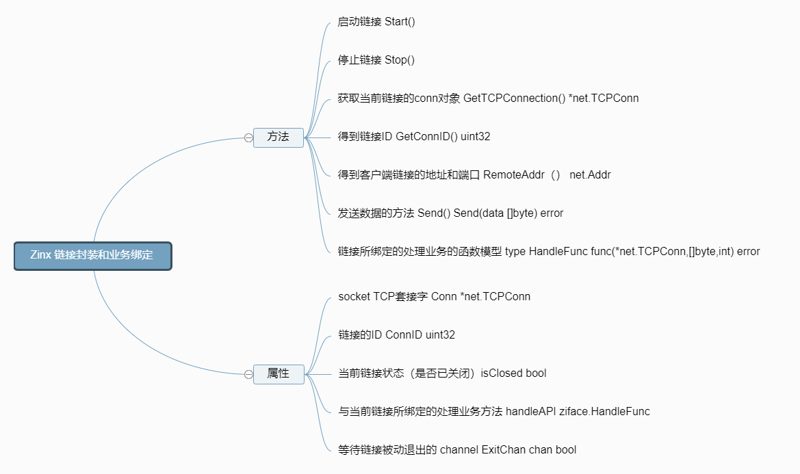
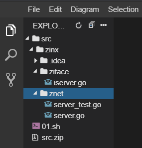
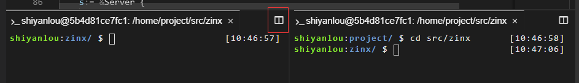
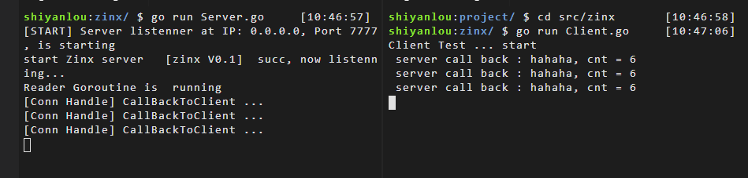

# 实现链路封装业务与业务绑定
[[TOC]]
## 实验介绍

本节实验中，我们将完成 Zinx 框架的链接封装与业务绑定的模块。如下面的思维导图中所表示的这些功能。



## 准备工作

V0.1 版本我们已经实现了一个基础的 Server 框架，现在我们需要对客户端链接和不同的客户端链接所处理的不同业务再做一层接口封装，当然我们先是把架构搭建起来。

这里我们需要先在命令行中运行如下代码：

```bash
wget https://labfile.oss.aliyuncs.com/courses/1639/01.sh && /bin/bash 01.sh
```

运行之后，我们的项目目录应该如图所示：



现在在`ziface`下创建一个属于链接的接口文件`iconnection.go`，当然他的实现文件我们放在`znet`下的`connection.go`中。

下面我们就开始实现 Zinx V0.2。

### ziface 创建 iconnection.go

zinx/ziface/iconnection.go

因为接口中只定义方法，我们在实验介绍中的接口方法中，已经声明了这些方法。所以我们来直接看一下它的实现：

```go
package ziface
import "net"
//定义连接接口
type IConnection interface {
    //启动连接，让当前连接开始工作
    Start()
    //停止连接，结束当前连接状态M
    Stop()
    //从当前连接获取原始的socket TCPConn
    GetTCPConnection() *net.TCPConn
    //获取当前连接ID
    GetConnID() uint32
    //获取远程客户端地址信息
    RemoteAddr() net.Addr
}
//定义一个统一处理链接业务的接口
type HandFunc func(*net.TCPConn, []byte, int) error
```

该接口的一些基础方法，代码注释已经介绍的很清楚，这里先简单说明一个 HandFunc 这个函数类型，这个是所有 conn 链接在处理业务的函数接口，第一参数是 socket 原生链接，第二个参数是客户端请求的数据，第三个参数是客户端请求的数据长度。这样，如果我们想要指定一个 conn 的处理业务，只要定义一个 HandFunc 类型的函数，然后和该链接绑定就可以了。 这里，你可以把这个函数理解为定义成了一个变量，这也是 Golang 中的一大特色，函数作为一等公民。你可以把函数当做一个变量来使用。

### znet 创建 connection.go

zinx/znet/connection.go

我们这里再 Connection 中去实现接口中的方法。

```go
package znet
import (
    "fmt"
    "net"
    "zinx/ziface"
)
type Connection struct {
    //当前连接的socket TCP套接字
    Conn *net.TCPConn
    //当前连接的ID 也可以称作为SessionID，ID全局唯一
    ConnID uint32
    //当前连接的关闭状态
    isClosed bool
    //该连接的处理方法api
    handleAPI ziface.HandFunc
    //告知该链接已经退出/停止的channel
    ExitBuffChan chan bool
}
//创建连接的方法
func NewConntion(conn *net.TCPConn, connID uint32, callback_api ziface.HandFunc) *Connection{
    c := &Connection{
        Conn:     conn,
        ConnID:   connID,
        isClosed: false,
        handleAPI: callback_api,
        ExitBuffChan: make(chan bool, 1),
    }
    return c
}
/* 处理conn读数据的Goroutine */
func (c *Connection) StartReader() {
    fmt.Println("Reader Goroutine is  running")
    defer fmt.Println(c.RemoteAddr().String(), " conn reader exit!")
    defer c.Stop()
    for  {
        //读取我们最大的数据到buf中
        buf := make([]byte, 512)
        cnt, err := c.Conn.Read(buf)
        if err != nil {
            fmt.Println("recv buf err ", err)
            c.ExitBuffChan <- true
            continue
        }
        //调用当前链接业务(这里执行的是当前conn的绑定的handle方法)
        if err := c.handleAPI(c.Conn, buf, cnt); err !=nil {
            fmt.Println("connID ", c.ConnID, " handle is error")
            c.ExitBuffChan <- true
            return
        }
    }
}
//启动连接，让当前连接开始工作
func (c *Connection) Start() {
    //开启处理该链接读取到客户端数据之后的请求业务
    go c.StartReader()
    for {
        select {
        case <- c.ExitBuffChan:
            //得到退出消息，不再阻塞
            return
        }
    }
}
//停止连接，结束当前连接状态M
func (c *Connection) Stop() {
    //1. 如果当前链接已经关闭
    if c.isClosed == true {
        return
    }
    c.isClosed = true
    //TODO Connection Stop() 如果用户注册了该链接的关闭回调业务，那么在此刻应该显示调用
    // 关闭socket链接
    c.Conn.Close()
    //通知从缓冲队列读数据的业务，该链接已经关闭
    c.ExitBuffChan <- true
    //关闭该链接全部管道
    close(c.ExitBuffChan)
}
//从当前连接获取原始的socket TCPConn
func (c *Connection) GetTCPConnection() *net.TCPConn {
    return c.Conn
}
//获取当前连接ID
func (c *Connection) GetConnID() uint32{
    return c.ConnID
}
//获取远程客户端地址信息
func (c *Connection) RemoteAddr() net.Addr {
    return c.Conn.RemoteAddr()
}
```

### 重新更正一下 Server.go 中 处理 conn 的连接业务

这里，同学们可以对比一下我们之前的 0.1 版本，哪里出现了不同。

```go
package znet
import (
    "errors"
    "fmt"
    "net"
    "time"
    "zinx/ziface"
)
//iServer 接口实现，定义一个Server服务类
type Server struct {
    //服务器的名称
    Name string
    //tcp4 or other
    IPVersion string
    //服务绑定的IP地址
    IP string
    //服务绑定的端口
    Port int
}
//============== 定义当前客户端链接的handle api ===========
func CallBackToClient(conn *net.TCPConn, data []byte, cnt int) error {
    //回显业务
    fmt.Println("[Conn Handle] CallBackToClient ... ")
    if _, err := conn.Write(data[:cnt]); err !=nil {
        fmt.Println("write back buf err ", err)
        return errors.New("CallBackToClient error")
    }
    return nil
}
//============== 实现 ziface.IServer 里的全部接口方法 ========
//开启网络服务
func (s *Server) Start() {
    fmt.Printf("[START] Server listenner at IP: %s, Port %d, is starting\n", s.IP, s.Port)
    //开启一个go去做服务端Linster业务
    go func() {
        //1 获取一个TCP的Addr
        addr, err := net.ResolveTCPAddr(s.IPVersion, fmt.Sprintf("%s:%d", s.IP, s.Port))
        if err != nil {
            fmt.Println("resolve tcp addr err: ", err)
            return
        }
        //2 监听服务器地址
        listenner, err:= net.ListenTCP(s.IPVersion, addr)
        if err != nil {
            fmt.Println("listen", s.IPVersion, "err", err)
            return
        }
        //已经监听成功
        fmt.Println("start Zinx server  ", s.Name, " succ, now listenning...")
        //TODO server.go 应该有一个自动生成ID的方法
        var cid uint32
        cid = 0
        //3 启动server网络连接业务
        for {
            //3.1 阻塞等待客户端建立连接请求
            conn, err := listenner.AcceptTCP()
            if err != nil {
                fmt.Println("Accept err ", err)
                continue
            }
            //3.2 TODO Server.Start() 设置服务器最大连接控制,如果超过最大连接，那么则关闭此新的连接
            //3.3 处理该新连接请求的 业务 方法， 此时应该有 handler 和 conn是绑定的
            dealConn := NewConntion(conn, cid, CallBackToClient)
            cid ++
            //3.4 启动当前链接的处理业务
            go dealConn.Start()
        }
    }()
}
func (s *Server) Stop() {
    fmt.Println("[STOP] Zinx server , name " , s.Name)
    //TODO  Server.Stop() 将其他需要清理的连接信息或者其他信息 也要一并停止或者清理
}
func (s *Server) Serve() {
    s.Start()
    //TODO Server.Serve() 是否在启动服务的时候 还要处理其他的事情呢 可以在这里添加
    //阻塞,否则主Go退出， listenner的go将会退出
    for {
        time.Sleep(10*time.Second)
    }
}
/*
  创建一个服务器句柄
 */
func NewServer (name string) ziface.IServer {
    s:= &Server {
        Name :name,
        IPVersion:"tcp4",
        IP:"0.0.0.0",
        Port:7777,
    }
    return s
}
```

相信你已经发现了，我们的修改在 3.3 和 3.4 处。

```go
            //3.3 处理该新连接请求的 业务 方法， 此时应该有 handler 和 conn是绑定的
            dealConn := NewConntion(conn, cid, CallBackToClient)
            cid ++
            //3.4 启动当前链接的处理业务
            go dealConn.Start()
```

`CallBackToClient` 是我们给当前客户端 conn 对象绑定的 handle 方法，当然目前是 server 端强制绑定的回显业务，我们之后会丰富框架，让这个用户可以让用户自定义指定 handle。

## 测试

进行测试之前，我们这一次选择不使用 `go test` 的方式进行，这里我们使用两个 go 文件，一个叫做 Server.go 一个叫做 Client.go ，这样分别启动两个文件来模拟客户端请求服务器的过程。当然你也可以选择继续使用 go test 的方式进行测试。这里只是做演示，表示测试也是有多种方法的。

我们在 zinx 文件夹下新建 Server.go 和 Client.go 的文件。 实际上，目前 Zinx 框架的对外接口并未改变，所以 V0.1 的测试依然有效。 所以，我们只是将 Server 和 Client 的功能进行拆分了。

Server.go:

```go
package main
import (
    "zinx/znet"
)
//Server 模块的测试函数
func main() {
    //1 创建一个server 句柄 s
    s := znet.NewServer("[zinx V0.1]")
    //2 开启服务
    s.Serve()
}
```

Client.go:

```go
package main
import (
    "fmt"
    "net"
    "time"
)
func main() {
    fmt.Println("Client Test ... start")
    //3秒之后发起测试请求，给服务端开启服务的机会
    time.Sleep(3 * time.Second)
    conn,err := net.Dial("tcp", "127.0.0.1:7777")
    if err != nil {
        fmt.Println("client start err, exit!")
        return
    }
    for {
        _, err := conn.Write([]byte("hahaha"))
        if err !=nil {
            fmt.Println("write error err ", err)
            return
        }
        buf :=make([]byte, 512)
        cnt, err := conn.Read(buf)
        if err != nil {
            fmt.Println("read buf error ")
            return
        }
        fmt.Printf(" server call back : %s, cnt = %d\n", buf,  cnt)
        time.Sleep(1*time.Second)
    }
}
```

这里，我们先点击红框内的这个按钮，将命令行变为两个，并且另一个命令行也进入 zinx 文件夹下，如下图所示：



然后我们先启动 Server `go run Server.go` 再启动 Client `go run Client.go`。

我们可以看到，经过本次完善后，现在服务端就已经开始有回显数据的功能了。



## 实验总结

现在我们已经简单实现了 Zinx 的雏形，但是目前离我们真正的框架还很远，接下来我们来改进 zinx 框架。