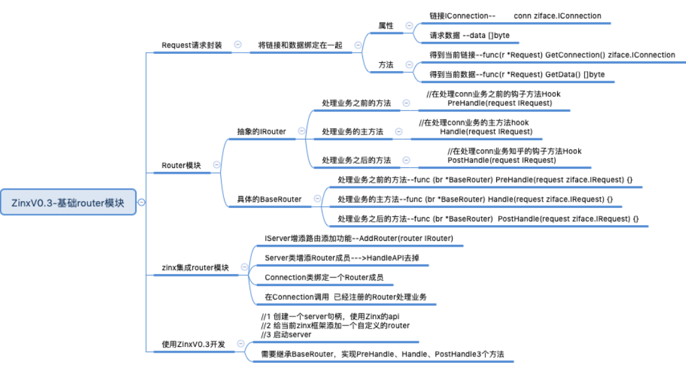
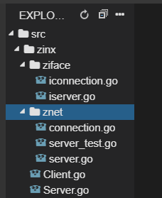
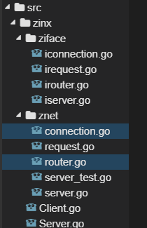
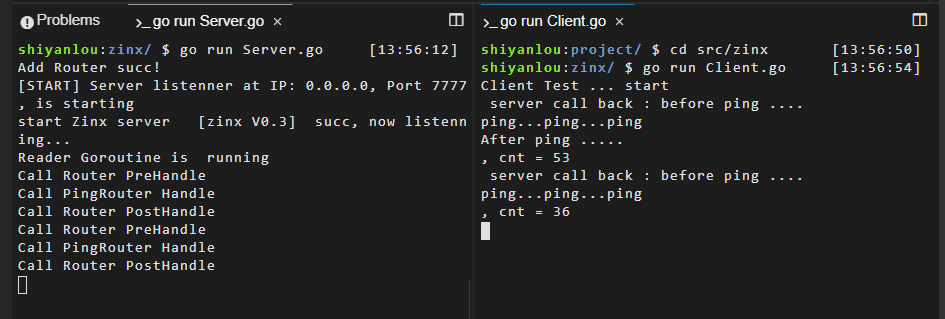

# 实现基础路由模块
[[TOC]]

## 实验介绍

本节实验中，我们将完成 Zinx 框架的基础路由的模块。如下面的思维导图中所表示的这些功能。



## 准备工作

首先我们执行如下代码：

```bash
wget https://labfile.oss.aliyuncs.com/courses/1639/02.sh && /bin/bash 02.sh
```

执行后我们的项目目录如下图所示：



现在我们就给用户提供一个自定义的 conn 处理业务的接口吧，很显然，我们不能把业务处理业务的方法绑死在`type HandFunc func(*net.TCPConn, []byte, int) error`这种格式中，我们需要定一些`interface{}`来让用户填写任意格式的连接处理业务方法。

那么，很显然 func 是满足不了我们需求的，我们需要再做几个抽象的接口类。

### IRequest 消息请求抽象类

我们现在需要把客户端请求的连接信息和请求的数据，放在一个叫 Request 的请求类里，这样的好处是我们可以从 Request 里得到全部客户端的请求信息，也为我们之后拓展框架有一定的作用，一旦客户端有额外的含义的数据信息，都可以放在这个 Request 里。可以理解为每次客户端的全部请求数据，Zinx 都会把它们一起放到一个 Request 结构体里。

#### 创建抽象 IRequest 层

在 ziface 下创建新文件 irequest.go。

zinx/ziface/irequest.go

```go
package ziface
/*
    IRequest 接口：
    实际上是把客户端请求的链接信息 和 请求的数据 包装到了 Request里
*/
type IRequest interface{
    GetConnection() IConnection    //获取请求连接信息
    GetData() []byte            //获取请求消息的数据
}
```

不难看出，当前的抽象层只提供了两个 Getter 方法，所以有个成员应该是必须的，一个是客户端连接，一个是客户端传递进来的数据，当然随着 Zinx 框架的功能丰富，这里面还应该继续添加新的成员。

#### 实现 Request 类

在 znet 下创建 IRequest 抽象接口的一个实例类文件 request.go

zinx/znet/request.go

```go
package znet

import "zinx/ziface"

type Request struct {
    conn ziface.IConnection //已经和客户端建立好的 链接
    data []byte //客户端请求的数据
}
//获取请求连接信息
func(r *Request) GetConnection() ziface.IConnection {
    return r.conn
}
//获取请求消息的数据
func(r *Request) GetData() []byte {
    return r.data
}
```

好了现在我们 Request 类创建好了，稍后我们会用到它。

### IRouter 路由配置抽象类

现在我们来给 Zinx 实现一个非常简单基础的路由功能，目的当然就是为了快速的让 Zinx 步入到路由的阶段。后续我们会不断的完善路由功能。

#### 创建抽象的 IRouter 层

在`ziface`下创建`irouter.go`文件

zinx/ziface/irouter.go

我们知道 router 实际上的作用就是，服务端应用可以给 Zinx 框架配置当前链接的处理业务方法，之前的 Zinx-V0.2 我们的 Zinx 框架处理链接请求的方法是固定的，现在是可以自定义，并且有 3 种接口可以重写。

Handle：是处理当前链接的主业务函数

PreHandle：如果需要在主业务函数之前有前置业务，可以重写这个方法

PostHandle:如果需要在主业务函数之后又后置业务，可以重写这个方法

当然每个方法都有一个唯一的形参 IRequest 对象，也就是客户端请求过来的连接和请求数据，作为我们业务方法的输入数据。

```go
package ziface
/*
    路由接口， 这里面路由是 使用框架者给该链接自定的 处理业务方法
    路由里的IRequest 则包含用该链接的链接信息和该链接的请求数据信息
*/
type IRouter interface{
    PreHandle(request IRequest)  //在处理conn业务之前的钩子方法
    Handle(request IRequest)     //处理conn业务的方法
    PostHandle(request IRequest) //处理conn业务之后的钩子方法
}
```

#### 实现 Router 类

在 znet 下创建 router.go 文件

```go
package znet

import "zinx/ziface"

//实现router时，先嵌入这个基类，然后根据需要对这个基类的方法进行重写
type BaseRouter struct {}
//这里之所以BaseRouter的方法都为空，
// 是因为有的Router不希望有PreHandle或PostHandle
// 所以Router全部继承BaseRouter的好处是，不需要实现PreHandle和PostHandle也可以实例化
func (br *BaseRouter)PreHandle(req ziface.IRequest){}
func (br *BaseRouter)Handle(req ziface.IRequest){}
func (br *BaseRouter)PostHandle(req ziface.IRequest){}
```

我们当前的 Zinx 目录结构应该如下：



### Zinx-V0.3-集成简单路由功能

#### IServer 增添路由添加功能

我们需要给 IServer 类，增加一个抽象方法 AddRouter,目的也是让 Zinx 框架使用者，可以自定一个 Router 处理业务方法。

zinx/ziface/iserver.go

```go
package ziface
//定义服务器接口
type IServer interface{
    //启动服务器方法
    Start()
    //停止服务器方法
    Stop()
    //开启业务服务方法
    Serve()
    //路由功能：给当前服务注册一个路由业务方法，供客户端链接处理使用
    AddRouter(router IRouter)
}
```

#### Server 类增添 Router 成员

有了抽象的方法，自然 Server 就要实现，并且还要添加一个 Router 成员.

zinx/znet/server.go

```go
//iServer 接口实现，定义一个Server服务类
type Server struct {
    //服务器的名称
    Name string
    //tcp4 or other
    IPVersion string
    //服务绑定的IP地址
    IP string
    //服务绑定的端口
    Port int
    //当前Server由用户绑定的回调router,也就是Server注册的链接对应的处理业务
    Router ziface.IRouter
}
```

然后`NewServer()`方法， 初始化 Server 对象的方法也要加一个初始化成员

```go
/*
  创建一个服务器句柄
 */
func NewServer (name string) ziface.IServer {
    s:= &Server {
        Name :name,
        IPVersion:"tcp4",
        IP:"0.0.0.0",
        Port:7777,
        Router: nil,
    }
    return s
}
```

#### Connection 类绑定一个 Router 成员

zinx/znet/connection.go

```go
type Connection struct {
    //当前连接的socket TCP套接字
    Conn *net.TCPConn
    //当前连接的ID 也可以称作为SessionID，ID全局唯一
    ConnID uint32
    //当前连接的关闭状态
    isClosed bool
    //该连接的处理方法router
    Router  ziface.IRouter
    //告知该链接已经退出/停止的channel
    ExitBuffChan chan bool
}
```

#### 在 Connection 调用注册的 Router 处理业务

zinx/znet/connection.go

这里我们在 conn 读取完客户端数据之后，将数据和 conn 封装到一个 Request 中，作为 Router 的输入数据。

然后我们开启一个 goroutine 去调用给 Zinx 框架注册好的路由业务。

```go
func (c *Connection) StartReader() {
    fmt.Println("Reader Goroutine is  running")
    defer fmt.Println(c.RemoteAddr().String(), " conn reader exit!")
    defer c.Stop()
    for  {
        //读取我们最大的数据到buf中
        buf := make([]byte, 512)
        _, err := c.Conn.Read(buf)
        if err != nil {
            fmt.Println("recv buf err ", err)
            c.ExitBuffChan <- true
            continue
        }
        //得到当前客户端请求的Request数据
        req := Request{
            conn:c,
            data:buf,
        }
        //从路由Routers 中找到注册绑定Conn的对应Handle
        go func (request ziface.IRequest) {
            //执行注册的路由方法
            c.Router.PreHandle(request)
            c.Router.Handle(request)
            c.Router.PostHandle(request)
        }(&req)
    }
}
```

### Zinx-V0.3 代码实现

zinx/znet/server.go

这里我们的 server 类要实现添加路由的方法 AddRouter

```go
package znet
import (
    "fmt"
    "net"
    "time"
    "zinx/ziface"
)
//iServer 接口实现，定义一个Server服务类
type Server struct {
    //服务器的名称
    Name string
    //tcp4 or other
    IPVersion string
    //服务绑定的IP地址
    IP string
    //服务绑定的端口
    Port int
    //当前Server由用户绑定的回调router,也就是Server注册的链接对应的处理业务
    Router ziface.IRouter
}
/*
  创建一个服务器句柄
 */
func NewServer (name string) ziface.IServer {
    s:= &Server {
        Name :name,
        IPVersion:"tcp4",
        IP:"0.0.0.0",
        Port:7777,
        Router: nil,
    }
    return s
}
//============== 实现 ziface.IServer 里的全部接口方法 ========
//开启网络服务
func (s *Server) Start() {
    fmt.Printf("[START] Server listenner at IP: %s, Port %d, is starting\n", s.IP, s.Port)
    //开启一个go去做服务端Linster业务
    go func() {
        //1 获取一个TCP的Addr
        addr, err := net.ResolveTCPAddr(s.IPVersion, fmt.Sprintf("%s:%d", s.IP, s.Port))
        if err != nil {
            fmt.Println("resolve tcp addr err: ", err)
            return
        }
        //2 监听服务器地址
        listenner, err:= net.ListenTCP(s.IPVersion, addr)
        if err != nil {
            fmt.Println("listen", s.IPVersion, "err", err)
            return
        }
        //已经监听成功
        fmt.Println("start Zinx server  ", s.Name, " succ, now listenning...")
        //TODO server.go 应该有一个自动生成ID的方法
        var cid uint32
        cid = 0
        //3 启动server网络连接业务
        for {
            //3.1 阻塞等待客户端建立连接请求
            conn, err := listenner.AcceptTCP()
            if err != nil {
                fmt.Println("Accept err ", err)
                continue
            }
            //3.2 TODO Server.Start() 设置服务器最大连接控制,如果超过最大连接，那么则关闭此新的连接
            //3.3 处理该新连接请求的 业务 方法， 此时应该有 handler 和 conn是绑定的
            dealConn := NewConntion(conn, cid, s.Router)
            cid ++
            //3.4 启动当前链接的处理业务
            go dealConn.Start()
        }
    }()
}
func (s *Server) Stop() {
    fmt.Println("[STOP] Zinx server , name " , s.Name)
    //TODO  Server.Stop() 将其他需要清理的连接信息或者其他信息 也要一并停止或者清理
}
func (s *Server) Serve() {
    s.Start()
    //TODO Server.Serve() 是否在启动服务的时候 还要处理其他的事情呢 可以在这里添加
    //阻塞,否则主Go退出， listenner的go将会退出
    for {
        time.Sleep(10*time.Second)
    }
}
//路由功能：给当前服务注册一个路由业务方法，供客户端链接处理使用
func (s *Server)AddRouter(router ziface.IRouter) {
    s.Router = router
    fmt.Println("Add Router succ! " )
}
```

zinx/znet/conneciont.go

connection 同样要加上相应的路由对应的方法

```go
package znet
import (
    "fmt"
    "net"
    "zinx/ziface"
)
type Connection struct {
    //当前连接的socket TCP套接字
    Conn *net.TCPConn
    //当前连接的ID 也可以称作为SessionID，ID全局唯一
    ConnID uint32
    //当前连接的关闭状态
    isClosed bool
    //该连接的处理方法router
    Router  ziface.IRouter
    //告知该链接已经退出/停止的channel
    ExitBuffChan chan bool
}
//创建连接的方法
func NewConntion(conn *net.TCPConn, connID uint32, router ziface.IRouter) *Connection{
    c := &Connection{
        Conn:     conn,
        ConnID:   connID,
        isClosed: false,
        Router: router,
        ExitBuffChan: make(chan bool, 1),
    }
    return c
}
func (c *Connection) StartReader() {
    fmt.Println("Reader Goroutine is  running")
    defer fmt.Println(c.RemoteAddr().String(), " conn reader exit!")
    defer c.Stop()
    for  {
        //读取我们最大的数据到buf中
        buf := make([]byte, 512)
        _, err := c.Conn.Read(buf)
        if err != nil {
            fmt.Println("recv buf err ", err)
            c.ExitBuffChan <- true
            continue
        }
        //得到当前客户端请求的Request数据
        req := Request{
            conn:c,
            data:buf,
        }
        //从路由Routers 中找到注册绑定Conn的对应Handle
        go func (request ziface.IRequest) {
            //执行注册的路由方法
            c.Router.PreHandle(request)
            c.Router.Handle(request)
            c.Router.PostHandle(request)
        }(&req)
    }
}
//启动连接，让当前连接开始工作
func (c *Connection) Start() {
    //开启处理该链接读取到客户端数据之后的请求业务
    go c.StartReader()
    for {
        select {
        case <- c.ExitBuffChan:
            //得到退出消息，不再阻塞
            return
        }
    }
}
//停止连接，结束当前连接状态M
func (c *Connection) Stop() {
    //1. 如果当前链接已经关闭
    if c.isClosed == true {
        return
    }
    c.isClosed = true
    //TODO Connection Stop() 如果用户注册了该链接的关闭回调业务，那么在此刻应该显示调用
    // 关闭socket链接
    c.Conn.Close()
    //通知从缓冲队列读数据的业务，该链接已经关闭
    c.ExitBuffChan <- true
    //关闭该链接全部管道
    close(c.ExitBuffChan)
}
//从当前连接获取原始的socket TCPConn
func (c *Connection) GetTCPConnection() *net.TCPConn {
    return c.Conn
}
//获取当前连接ID
func (c *Connection) GetConnID() uint32{
    return c.ConnID
}
//获取远程客户端地址信息
func (c *Connection) RemoteAddr() net.Addr {
    return c.Conn.RemoteAddr()
}
```

### 使用 Zinx-V0.3 完成应用程序

接下来我们在基于 Zinx 写服务器，就可以配置一个简单的路由功能了。

#### 测试基于 Zinx 完成的服务端应用

Server.go

我们这里自定义了一个类似 Ping 操作的路由，就是当客户端发送数据，我们的处理业务就是返回给客户端"ping..ping..ping..", 为了测试，当前路由也同时实现了 PreHandle 和 PostHandle 两个方法。实际上 Zinx 会利用模板的设计模式，依次在框架中调用`PreHandle`、`Handle`、`PostHandle`三个方法。

```go
package main
import (
    "fmt"
    "zinx/ziface"
    "zinx/znet"
)
//ping test 自定义路由
type PingRouter struct {
    znet.BaseRouter //一定要先基础BaseRouter
}
//Test PreHandle
func (this *PingRouter) PreHandle(request ziface.IRequest) {
    fmt.Println("Call Router PreHandle")
    _, err := request.GetConnection().GetTCPConnection().Write([]byte("before ping ....\n"))
    if err !=nil {
        fmt.Println("call back ping ping ping error")
    }
}
//Test Handle
func (this *PingRouter) Handle(request ziface.IRequest) {
    fmt.Println("Call PingRouter Handle")
    _, err := request.GetConnection().GetTCPConnection().Write([]byte("ping...ping...ping\n"))
    if err !=nil {
        fmt.Println("call back ping ping ping error")
    }
}
//Test PostHandle
func (this *PingRouter) PostHandle(request ziface.IRequest) {
    fmt.Println("Call Router PostHandle")
    _, err := request.GetConnection().GetTCPConnection().Write([]byte("After ping .....\n"))
    if err !=nil {
        fmt.Println("call back ping ping ping error")
    }
}
func main(){
    //创建一个server句柄
    s := znet.NewServer("[zinx V0.3]")
    s.AddRouter(&PingRouter{})
    //2 开启服务
    s.Serve()
}
```

#### 客户端应用测试程序

和之前的 Client.go 一样 没有改变 。

这里我们进行测试的时候，和上一节一样，大家再测试的时候千万别忘了，启动的时候先启动 Server 再启动 Client。关闭的时候也是先关闭 Server 再关闭 Client。

执行结果如下：



## 实验总结

现在 Zinx 框架已经有路由功能了，虽然说目前只能配置一个，不过不要着急，很快我们会增加配置多路由的能力。