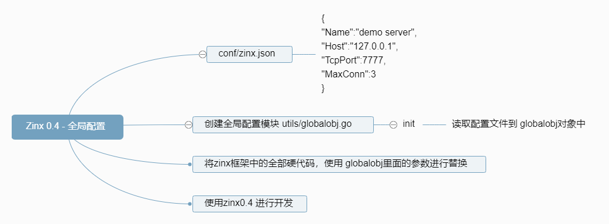
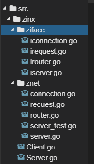
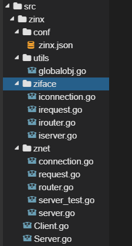
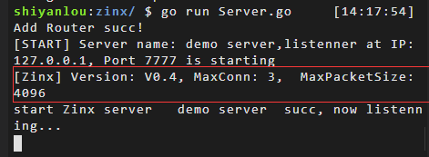

# 全局配置
[[TOC]]

## 实验介绍

本节实验中，我们将完成 Zinx 框架的全局配置模块。如下面的思维导图中所表示的这些功能。



## 准备工作

首先我们执行如下代码：

```bash
wget https://labfile.oss.aliyuncs.com/courses/1639/03.sh && /bin/bash 03.sh
```

执行后我们的项目目录如下图所示：



## Zinx 的全局配置

随着架构逐步的变大，参数就会越来越多，为了省去我们后续大频率修改参数的麻烦，接下来 Zinx 需要做一个加载配置的模块，和一个全局获取 Zinx 参数的对象。 这样也方便了我们以后的维护操作，试想一下，如果你的项目里每个类的配置都写在自己的类方法里，后续出现需要更改配置的时候再去修改配置就会很麻烦。所以，通常我们都会用一个全局的配置功能来方便后续维护。

#### Zinx-V0.4 增添全局配置代码实现

我们先做一个简单的加载配置模块，要加载的配置文件的文本格式，就选择比较通用的`json`格式，配置信息暂时如下:

我们先在 zinx 文件夹下新建 conf 文件夹，然后再 conf 文件夹下新建 zinx.json 文件。

配置信息如下：

```json
{
  "Name": "demo server",
  "Host": "127.0.0.1",
  "TcpPort": 7777,
  "MaxConn": 3
}
```

这里需要大家注意一下 json 的书写规范如下：

1. 数组或对象之中的字符串必须使用双引号，不能使用单引号。
2. 对象的成员名称必须使用双引号。
3. 数组或对象最后一个成员的后面，不能加逗号 。
4. 数组或对象的每个成员的值，可以是简单值，也可以是复合值。简单值分为四种：字符串、数值（必须以十进制表示）、布尔值和 null（NaN, Infinity, -Infinity 和 undefined 都会被转为 null）。复合值分为两种：符合 JSON 格式的对象和符合 JSON 格式的数组。

现在我们需要建立一个全局配置信息的对象。

#### 创建全局参数文件

创建`zinx/utils`文件夹，在下面创建`globalobj.go`文件,暂时编写如下。

```go
package utils
import (
    "encoding/json"
    "io/ioutil"
    "zinx/ziface"
)
/*
    存储一切有关Zinx框架的全局参数，供其他模块使用
    一些参数也可以通过 用户根据 zinx.json来配置
*/
type GlobalObj struct {
    TcpServer ziface.IServer //当前Zinx的全局Server对象
    Host      string         //当前服务器主机IP
    TcpPort   int            //当前服务器主机监听端口号
    Name      string         //当前服务器名称
    Version   string         //当前Zinx版本号
    MaxPacketSize uint32 //都需数据包的最大值
    MaxConn       int    //当前服务器主机允许的最大链接个数
}
/*
    定义一个全局的对象
*/
var GlobalObject *GlobalObj
```

我们在全局定义了一个`GlobalObject`对象，目的就是让其他模块都能访问到里面的参数。

#### 提供 init 初始化方法

然后我们提供一个`init()`方法，目的是初始化`GlobalObject`对象，和加载服务端应用配置文件`conf/zinx.json`

```go
package utils
import (
    "encoding/json"
    "io/ioutil"
    "zinx/ziface"
)
/*
    存储一切有关Zinx框架的全局参数，供其他模块使用
    一些参数也可以通过 用户根据 zinx.json来配置
*/
type GlobalObj struct {
    TcpServer ziface.IServer //当前Zinx的全局Server对象
    Host      string         //当前服务器主机IP
    TcpPort   int            //当前服务器主机监听端口号
    Name      string         //当前服务器名称
    Version   string         //当前Zinx版本号
    MaxPacketSize uint32 //都需数据包的最大值
    MaxConn       int    //当前服务器主机允许的最大链接个数
}
/*
    定义一个全局的对象
*/
var GlobalObject *GlobalObj
//读取用户的配置文件
func (g *GlobalObj) Reload() {
    data, err := ioutil.ReadFile("conf/zinx.json")
    if err != nil {
        panic(err)
    }
    //将json数据解析到struct中
    //fmt.Printf("json :%s\n", data)
    err = json.Unmarshal(data, &GlobalObject)
    if err != nil {
        panic(err)
    }
}
/*
    提供init方法，默认加载
*/
func init() {
    //初始化GlobalObject变量，设置一些默认值
    GlobalObject = &GlobalObj{
        Name:    "ZinxServerApp",
        Version: "V0.4",
        TcpPort: 7777,
        Host:    "0.0.0.0",
        MaxConn: 12000,
        MaxPacketSize:4096,
    }
    //从配置文件中加载一些用户配置的参数
    GlobalObject.Reload()
}
```

这里的 init 方法其实是 Golang 的一个特性，在执行 Go 语言程序时，Golang 会先看各个包里有没有 init 方法，如果有就先执行初始化。初始化方法全都运行完之后才会执行主函数。

#### 硬参数替换与 Server 初始化参数配置

我们这里来修改 znet/server.go 文件的 NewServer 方法。

```go
// 这里别忘了在头部 import "zinx/utils"

/*
  创建一个服务器句柄
 */
func NewServer () ziface.IServer {
    //先初始化全局配置文件
    utils.GlobalObject.Reload()
    s:= &Server {
        Name :utils.GlobalObject.Name,//从全局参数获取
        IPVersion:"tcp4",
        IP:utils.GlobalObject.Host,//从全局参数获取
        Port:utils.GlobalObject.TcpPort,//从全局参数获取
        Router: nil,
    }
    return s
}
```

我们未来方便验证我们的参数已经成功被加载，在`Server.Start()`方法中加入几行调试信息

```go
func (s *Server) Start() {
    // 如果我们的方法正确，运行时就会打印出Version: V0.4, MaxConn: 3,  MaxPacketSize: 4096
    fmt.Printf("[START] Server name: %s,listenner at IP: %s, Port %d is starting\n", s.Name, s.IP, s.Port)
    fmt.Printf("[Zinx] Version: %s, MaxConn: %d,  MaxPacketSize: %d\n",
        utils.GlobalObject.Version,
        utils.GlobalObject.MaxConn,
        utils.GlobalObject.MaxPacketSize)
    // 以上是添加进来的调试信息
    //开启一个go去做服务端Linster业务
    go func() {
        //1 获取一个TCP的Addr
        addr, err := net.ResolveTCPAddr(s.IPVersion, fmt.Sprintf("%s:%d", s.IP, s.Port))
        if err != nil {
            fmt.Println("resolve tcp addr err: ", err)
            return
        }
        //2 监听服务器地址
        listenner, err:= net.ListenTCP(s.IPVersion, addr)
        if err != nil {
            fmt.Println("listen", s.IPVersion, "err", err)
            return
        }
        //已经监听成功
        fmt.Println("start Zinx server  ", s.Name, " succ, now listenning...")
        //TODO server.go 应该有一个自动生成ID的方法
        var cid uint32
        cid = 0
        //3 启动server网络连接业务
        for {
            //3.1 阻塞等待客户端建立连接请求
            conn, err := listenner.AcceptTCP()
            if err != nil {
                fmt.Println("Accept err ", err)
                continue
            }
            //3.2 TODO Server.Start() 设置服务器最大连接控制,如果超过最大连接，那么则关闭此新的连接
            //3.3 处理该新连接请求的 业务 方法， 此时应该有 handler 和 conn是绑定的
            dealConn := NewConntion(conn, cid, s.Router)
            cid ++
            //3.4 启动当前链接的处理业务
            go dealConn.Start()
        }
    }()
}
```

当然还有一些其他的之前写死的数值，均可以在配置文件配置，用全局参数替换，这里不列举，大家可以尝试自己将其修改过来。

当前 zinx 框架目录结构：



### 使用 Zinx-V0.4 完成应用程序

我们来修改 Server.go 文件。

```go
package main
import (
    "fmt"
    "zinx/ziface"
    "zinx/znet"
)
//ping test 自定义路由
type PingRouter struct {
    znet.BaseRouter
}
//Test Handle
func (this *PingRouter) Handle(request ziface.IRequest) {
    fmt.Println("Call PingRouter Handle")
    _, err := request.GetConnection().GetTCPConnection().Write([]byte("ping...ping...ping\n"))
    if err != nil {
        fmt.Println("call back ping ping ping error")
    }
}
func main() {
    //创建一个server句柄
    s := znet.NewServer()
    //配置路由
    s.AddRouter(&PingRouter{})
    //开启服务
    s.Serve()
}
```

在控制台切换到 zinx 文件夹下，执行 `go run Server.go` 命令来查询结果。



还记得我们在上面 server 中做的修改，添加的调试信息吗，这里可以正常把参数打印，就说明我们的配置文件成功的被读取进来了。

## 实验总结

我们今天完成了对我们框架进行全局配置的实现。同时使用到了 json 反序列化的方式使配置文件变成了配置对象，来方便我们对其进行操作。