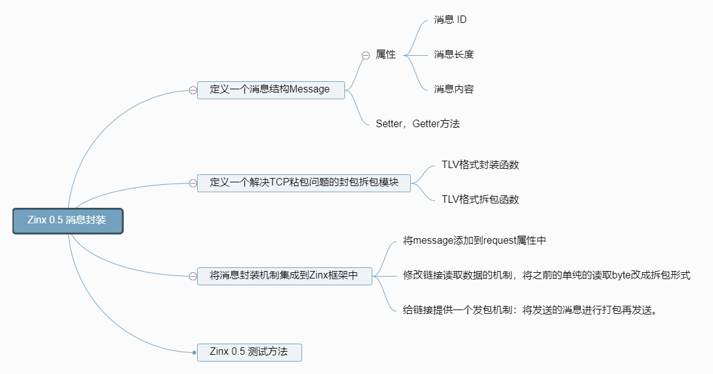
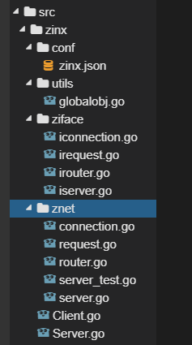
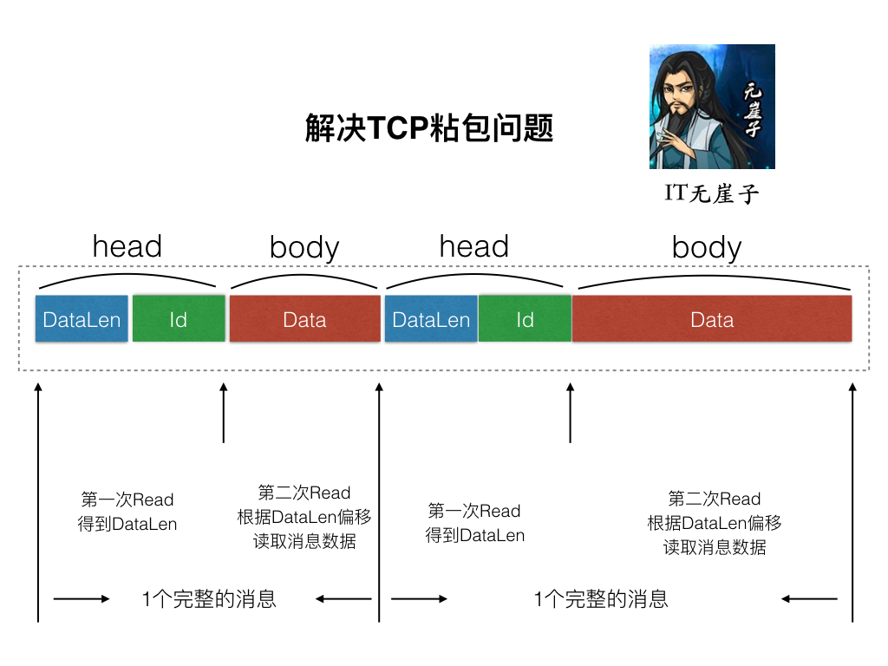
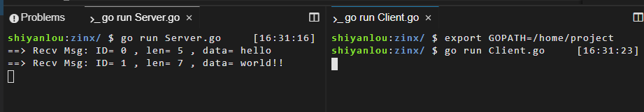

# 消息封装
[[TOC]]

## 实验介绍

本节实验中，我们将完成 Zinx 框架的消息封装模块。如下面的思维导图中所表示的这些功能。



## 准备工作

首先我们执行如下代码：

```bash
wget https://labfile.oss.aliyuncs.com/courses/1639/04.sh && /bin/bash 04.sh
```

执行后我们的项目目录如下图所示：



## Zinx 的消息封装

接下来我们再对 Zinx 做一个简单的升级，现在我们把服务器的全部数据都放在一个 Request 里，当前的 Request 结构如下：

```go
type Request struct {
    conn ziface.IConnection //已经和客户端建立好的链接
    data []byte             //客户端请求的数据
}
```

很明显，现在是用一个`[]byte`来接受全部数据，又没有长度，又没有消息类型，这不科学。怎么办呢？我们现在就要自定义一种消息类型，把全部的消息都放在这种消息类型里。

### 创建消息封装类型

在`zinx/ziface/`下创建`imessage.go`文件: 将请求的一个消息封装到 message 中，定义抽象层接口，定义好 Getter 方法和 Setter 方法。

zinx/ziface/imessage.go

```go
package ziface
/*
    将请求的一个消息封装到message中，定义抽象层接口
 */
type IMessage interface {
    GetDataLen() uint32    //获取消息数据段长度
    GetMsgId() uint32    //获取消息ID
    GetData() []byte    //获取消息内容
    SetMsgId(uint32)    //设置消息ID
    SetData([]byte)        //设置消息内容
    SetDataLen(uint32)    //设置消息数据段长度
}
```

同时创建实例 message 类，在`zinx/znet/`下，创建`message.go`文件。

整理一个基本的 message 包，会包含**消息 ID**，**数据**，**数据长度**三个成员，提供基本的 setter 和 getter 方法，目的是为了以后做封装优化的作用。同时也提供了一个创建一个 message 包的初始化方法`NewMegPackage`。

这里我们只需要要实现 Message 类，写出构造函数，实现接口中对应的方法，比较的简单，大家可以试试先自己尝试实现。

```go
package znet
type Message struct {
    Id      uint32 //消息的ID
    DataLen uint32 //消息的长度
    Data    []byte //消息的内容
}
//创建一个Message消息包
func NewMsgPackage(id uint32, data []byte) *Message {
    return &Message{
        Id:     id,
        DataLen: uint32(len(data)),
        Data:   data,
    }
}
//获取消息数据段长度
func (msg *Message) GetDataLen() uint32 {
    return msg.DataLen
}
//获取消息ID
func (msg *Message) GetMsgId() uint32 {
    return msg.Id
}
//获取消息内容
func (msg *Message) GetData() []byte {
    return msg.Data
}
//设置消息数据段长度
func (msg *Message) SetDataLen(len uint32) {
    msg.DataLen = len
}
//设计消息ID
func (msg *Message) SetMsgId(msgId uint32) {
    msg.Id = msgId
}
//设计消息内容
func (msg *Message) SetData(data []byte) {
    msg.Data = data
}
```

### 消息的封包与拆包

我们这里就是采用经典的 TLV(Type-Len-Value)封包格式来解决 TCP 粘包问题吧。



图片来源于 zinx 作者。

由于 Zinx 也是 TCP 流的形式传播数据，难免会出现消息 1 和消息 2 一同发送，那么 zinx 就需要有能力区分两个消息的边界，所以 Zinx 此时应该提供一个统一的拆包和封包的方法。在发包之前打包成如上图这种格式的有 head 和 body 的两部分的包，在收到数据的时候分两次进行读取，先读取固定长度的 head 部分，得到后续 Data 的长度，再根据 DataLen 读取之后的 body。这样就能够解决粘包的问题了。

#### 创建拆包封包抽象类

在`zinx/ziface`下，创建`idatapack.go`文件

我们需要三个方法：

- 封包数据。
- 拆包数据。
- 得到头部长度。

```go
package ziface
/*
    封包数据和拆包数据
    直接面向TCP连接中的数据流,为传输数据添加头部信息，用于处理TCP粘包问题。
 */
type IDataPack interface{
    GetHeadLen() uint32                    //获取包头长度方法
    Pack(msg IMessage)([]byte, error)    //封包方法
    Unpack([]byte)(IMessage, error)        //拆包方法
}
```

#### 实现拆包封包类

在`zinx/znet/`下，创建`datapack.go`文件.

```go
package znet
import (
    "bytes"
    "encoding/binary"
    "errors"
    "zinx/utils"
    "zinx/ziface"
)
//封包拆包类实例，暂时不需要成员
type DataPack struct {}
//封包拆包实例初始化方法
func NewDataPack() *DataPack {
    return &DataPack{}
}
//获取包头长度方法
func(dp *DataPack) GetHeadLen() uint32 {
    //Id uint32(4字节) +  DataLen uint32(4字节)
    return 8
}
//封包方法(压缩数据)
func(dp *DataPack) Pack(msg ziface.IMessage)([]byte, error) {
    //创建一个存放bytes字节的缓冲
    dataBuff := bytes.NewBuffer([]byte{})
    //写dataLen
    if err := binary.Write(dataBuff, binary.LittleEndian, msg.GetDataLen()); err != nil {
        return nil, err
    }
    //写msgID
    if err := binary.Write(dataBuff, binary.LittleEndian, msg.GetMsgId()); err != nil {
        return nil, err
    }
    //写data数据
    if err := binary.Write(dataBuff, binary.LittleEndian, msg.GetData()); err != nil {
        return nil ,err
    }
    return dataBuff.Bytes(), nil
}
//拆包方法(解压数据)
func(dp *DataPack) Unpack(binaryData []byte)(ziface.IMessage, error) {
    //创建一个从输入二进制数据的ioReader
    dataBuff := bytes.NewReader(binaryData)
    //只解压head的信息，得到dataLen和msgID
    msg := &Message{}
    //读dataLen
    if err := binary.Read(dataBuff, binary.LittleEndian, &msg.DataLen); err != nil {
        return nil, err
    }
    //读msgID
    if err := binary.Read(dataBuff, binary.LittleEndian, &msg.Id); err != nil {
        return nil, err
    }
    //判断dataLen的长度是否超出我们允许的最大包长度
    if (utils.GlobalObject.MaxPacketSize > 0 && msg.DataLen > utils.GlobalObject.MaxPacketSize) {
        return nil, errors.New("Too large msg data recieved")
    }
    //这里只需要把head的数据拆包出来就可以了，然后再通过head的长度，再从conn读取一次数据
    return msg, nil
}
```

需要注意的是整理的`Unpack`方法，因为我们从上图可以知道，我们进行拆包的时候是分两次过程的，第二次是依赖第一次的 dataLen 结果，所以`Unpack`只能解压出包头 head 的内容，得到 msgId 和 dataLen。之后调用者再根据 dataLen 继续从 io 流中读取 body 中的数据。

#### 测试拆包封包功能

为了容易理解，我们先不用集成 zinx 框架来测试，而是使用 Server 和 Client 来测试一下封包拆包的功能。

Server.go

```go
package main
import (
    "fmt"
    "io"
    "net"
    "zinx/znet"
)
//只是负责测试datapack拆包，封包功能
func main() {
    //创建socket TCP Server
    listener, err := net.Listen("tcp", "127.0.0.1:7777")
    if err != nil {
        fmt.Println("server listen err:", err)
        return
    }
    //创建服务器gotoutine，负责从客户端goroutine读取粘包的数据，然后进行解析
    for {
        conn, err := listener.Accept()
        if err != nil {
            fmt.Println("server accept err:", err)
        }
        //处理客户端请求
        go func(conn net.Conn) {
            //创建封包拆包对象dp
            dp := znet.NewDataPack()
            for {
                //1 先读出流中的head部分
                headData := make([]byte, dp.GetHeadLen())
                _, err := io.ReadFull(conn, headData) //ReadFull 会把msg填充满为止
                if err != nil {
                    fmt.Println("read head error")
                    break
                }
                //将headData字节流 拆包到msg中
                msgHead, err := dp.Unpack(headData)
                if err != nil {
                    fmt.Println("server unpack err:", err)
                    return
                }
                if msgHead.GetDataLen() > 0 {
                    //msg 是有data数据的，需要再次读取data数据
                    msg := msgHead.(*znet.Message)
                    msg.Data = make([]byte, msg.GetDataLen())
                    //根据dataLen从io中读取字节流
                    _, err := io.ReadFull(conn, msg.Data)
                    if err != nil {
                        fmt.Println("server unpack data err:", err)
                        return
                    }
                    fmt.Println("==> Recv Msg: ID=", msg.Id, ", len=", msg.DataLen, ", data=", string(msg.Data))
                }
            }
        }(conn)
    }
}
```

Client.go

```go
package main
import (
    "fmt"
    "net"
    "zinx/znet"
)
func main() {
    //客户端goroutine，负责模拟粘包的数据，然后进行发送
    conn, err := net.Dial("tcp", "127.0.0.1:7777")
    if err != nil {
        fmt.Println("client dial err:", err)
        return
    }
    //创建一个封包对象 dp
    dp := znet.NewDataPack()
    //封装一个msg1包
    msg1 := &znet.Message{
        Id:      0,
        DataLen: 5,
        Data:    []byte{'h', 'e', 'l', 'l', 'o'},
    }
    sendData1, err := dp.Pack(msg1)
    if err != nil {
        fmt.Println("client pack msg1 err:", err)
        return
    }
    msg2 := &znet.Message{
        Id:      1,
        DataLen: 7,
        Data:    []byte{'w', 'o', 'r', 'l', 'd', '!', '!'},
    }
    sendData2, err := dp.Pack(msg2)
    if err != nil {
        fmt.Println("client temp msg2 err:", err)
        return
    }
    //将sendData1，和 sendData2 拼接一起，组成粘包
    sendData1 = append(sendData1, sendData2...)
    //向服务器端写数据
    conn.Write(sendData1)
    //客户端阻塞
    select {}
}
```



同学们打开另一个窗口执行代码的时候，别忘了先执行 `export GOPATH=/home/project` 设置一下 Golang 的环境变量。

这里，我们的消息封装模块就完成了，下面我们将其集成到 zinx 中。

### Zinx-V0.5 代码实现

#### Request 字段修改

首先我们要将我们之前的 Request 中的`[]byte`类型的 data 字段改成 Message 类型.。并且我们需要把 irequest 的方法新增一个 GetMsgID。

```go
package znet
import "zinx/ziface"
type Request struct {
    conn ziface.IConnection //已经和客户端建立好的 链接
    msg ziface.IMessage     //客户端请求的数据
}
//获取请求连接信息
func(r *Request) GetConnection() ziface.IConnection {
    return r.conn
}
//获取请求消息的数据
func(r *Request) GetData() []byte {
    return r.msg.GetData()
}
//获取请求的消息的ID
func (r *Request) GetMsgID() uint32 {
    return r.msg.GetMsgId()
}
package ziface
/*
   IRequest 接口：
   实际上是把客户端请求的链接信息 和 请求的数据 包装到了 Request里
*/
type IRequest interface{
    GetConnection() IConnection    //获取请求连接信息
    GetData() []byte            //获取请求消息的数据
    GetMsgID() uint32           //hu获取消息的id
}
```

#### 集成拆包过程

接下来我们需要在 Connection 的`StartReader()`方法中,修改之前的读取客户端的这段代码：

```go
func (c *Connection) StartReader() {
    //...
    for  {
        //读取我们最大的数据到buf中
        buf := make([]byte, utils.GlobalObject.MaxPacketSize)
        _, err := c.Conn.Read(buf)
        if err != nil {
            fmt.Println("recv buf err ", err)
            c.ExitBuffChan <- true
            continue
        }
        //...
    }
}
```

将这个函数做出如下改造：

```go
func (c *Connection) StartReader() {
    fmt.Println("Reader Goroutine is  running")
    defer fmt.Println(c.RemoteAddr().String(), " conn reader exit!")
    defer c.Stop()
    for  {
        // 创建拆包解包的对象
        dp := NewDataPack()
        //读取客户端的Msg head
        headData := make([]byte, dp.GetHeadLen())
        if _, err := io.ReadFull(c.GetTCPConnection(), headData); err != nil {
            fmt.Println("read msg head error ", err)
            c.ExitBuffChan <- true
            continue
        }
        //拆包，得到msgid 和 datalen 放在msg中
        msg , err := dp.Unpack(headData)
        if err != nil {
            fmt.Println("unpack error ", err)
            c.ExitBuffChan <- true
            continue
        }
        //根据 dataLen 读取 data，放在msg.Data中
        var data []byte
        if msg.GetDataLen() > 0 {
            data = make([]byte, msg.GetDataLen())
            if _, err := io.ReadFull(c.GetTCPConnection(), data); err != nil {
                fmt.Println("read msg data error ", err)
                c.ExitBuffChan <- true
                continue
            }
        }
        msg.SetData(data)
        //得到当前客户端请求的Request数据
        req := Request{
            conn:c,
            msg:msg, //将之前的buf 改成 msg
        }
        //从路由Routers 中找到注册绑定Conn的对应Handle
        go func (request ziface.IRequest) {
            //执行注册的路由方法
            c.Router.PreHandle(request)
            c.Router.Handle(request)
            c.Router.PostHandle(request)
        }(&req)
    }
}
```

#### 提供封包方法

现在我们已经将拆包的功能集成到 Zinx 中了，但是使用 Zinx 的时候，如果我们希望给用户返回一个 TLV 格式的数据，总不能每次都经过这么繁琐的过程，所以我们应该给 Zinx 提供一个封包的接口，供 Zinx 发包使用。 我们在 iconnection.go 中新增 SendMsg()方法。

```go
package ziface
import "net"
//定义连接接口
type IConnection interface {
    //启动连接，让当前连接开始工作
    Start()
    //停止连接，结束当前连接状态M
    Stop()
    //从当前连接获取原始的socket TCPConn
    GetTCPConnection() *net.TCPConn
    //获取当前连接ID
    GetConnID() uint32
    //获取远程客户端地址信息
    RemoteAddr() net.Addr
    //直接将Message数据发送数据给远程的TCP客户端
    SendMsg(msgId uint32, data []byte) error
}
```

然后，我们到 connection.go 中实现这个方法。

```go
//直接将Message数据发送数据给远程的TCP客户端
func (c *Connection) SendMsg(msgId uint32, data []byte) error {
    if c.isClosed == true {
        return errors.New("Connection closed when send msg")
    }
    //将data封包，并且发送
    dp := NewDataPack()
    msg, err := dp.Pack(NewMsgPackage(msgId, data))
    if err != nil {
        fmt.Println("Pack error msg id = ", msgId)
        return  errors.New("Pack error msg ")
    }
    //写回客户端
    if _, err := c.Conn.Write(msg); err != nil {
        fmt.Println("Write msg id ", msgId, " error ")
        c.ExitBuffChan <- true
        return errors.New("conn Write error")
    }
    return nil
}
```

注意，做出修改后，我们需要在 connection.go 中将 io 和 errors 包引入进来。

现在我们所需要的方法就全部完成了，下面我们来编写功能测试模块。

### 使用 Zinx-V0.5 完成应用程序

我们这里测试依然继续使用 Server.go 和 Client.go 的方法。

当前 Server 端是先把客户端发送来 Msg 解析，然后返回一个 MsgId 为 1 的消息，消息内容是"ping...ping...ping"

Server.go:

```go
package main
import (
    "fmt"
    "zinx/ziface"
    "zinx/znet"
)
//ping test 自定义路由
type PingRouter struct {
    znet.BaseRouter
}
//Test Handle
func (this *PingRouter) Handle(request ziface.IRequest) {
    fmt.Println("Call PingRouter Handle")
    //先读取客户端的数据，再回写ping...ping...ping
    fmt.Println("recv from client : msgId=", request.GetMsgID(), ", data=", string(request.GetData()))
    //回写数据
    err := request.GetConnection().SendMsg(1, []byte("ping...ping...ping"))
    if err != nil {
        fmt.Println(err)
    }
}
func main() {
    //创建一个server句柄
    s := znet.NewServer()
    //配置路由
    s.AddRouter(&PingRouter{})
    //开启服务
    s.Serve()
}
```

这里 Client 客户端，模拟一个 MsgId 为 0 的"Zinx V0.5 Client Test Message"消息，然后把服务端返回的数据打印出来。

Client.go:

```go
package main
import (
    "fmt"
    "io"
    "net"
    "time"
    "zinx/znet"
)
/*
    模拟客户端
 */
func main() {
    fmt.Println("Client Test ... start")
    //3秒之后发起测试请求，给服务端开启服务的机会
    time.Sleep(3 * time.Second)
    conn,err := net.Dial("tcp", "127.0.0.1:7777")
    if err != nil {
        fmt.Println("client start err, exit!")
        return
    }
    for {
        //发封包message消息
        dp := znet.NewDataPack()
        msg, _ := dp.Pack(znet.NewMsgPackage(0,[]byte("Zinx V0.5 Client Test Message")))
        _, err := conn.Write(msg)
        if err !=nil {
            fmt.Println("write error err ", err)
            return
        }
        //先读出流中的head部分
        headData := make([]byte, dp.GetHeadLen())
        _, err = io.ReadFull(conn, headData) //ReadFull 会把msg填充满为止
        if err != nil {
            fmt.Println("read head error")
            break
        }
        //将headData字节流 拆包到msg中
        msgHead, err := dp.Unpack(headData)
        if err != nil {
            fmt.Println("server unpack err:", err)
            return
        }
        if msgHead.GetDataLen() > 0 {
            //msg 是有data数据的，需要再次读取data数据
            msg := msgHead.(*znet.Message)
            msg.Data = make([]byte, msg.GetDataLen())
            //根据dataLen从io中读取字节流
            _, err := io.ReadFull(conn, msg.Data)
            if err != nil {
                fmt.Println("server unpack data err:", err)
                return
            }
            fmt.Println("==> Recv Msg: ID=", msg.Id, ", len=", msg.DataLen, ", data=", string(msg.Data))
        }
        time.Sleep(1*time.Second)
    }
}
```

测试结果:


## 实验总结

到这一节，我们的 Zinx 已经成功的集成消息的封装功能了，这样我们就有 Zinx 的通信的基本协议标准了。