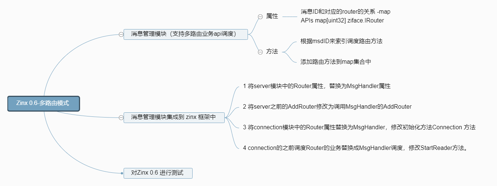
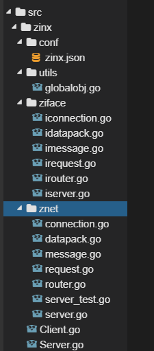

# 多路由模式
[[TOC]]

## 实验介绍

本节实验中，我们将完成 Zinx 框架的多路由模块。如下面的思维导图中所表示的这些功能。



## 准备工作

我们先逐行运行如下代码：

```bash
wget https://labfile.oss.aliyuncs.com/courses/1639/src05.zip && unzip src05.zip
export GOPATH=/home/project
```

执行后我们的文件目录如下：



我们之前在已经给 Zinx 配置了路由模式，但是很惨，之前的 Zinx 好像只能绑定一个路由的处理业务方法。显然这是无法满足基本的服务器需求的，那么现在我们要在之前的基础上，给 Zinx 添加多路由的方式。

既然是多路由的模式，我们这里就需要给 MsgId 和对应的处理逻辑进行捆绑。所以我们需要一个 Map。

```go
Apis map[uint32] ziface.IRouter
```

这里起名字是`Apis`，其中 key 就是 msgId， value 就是对应的 Router，里面应是使用者重写的 Handle 等方法。

那么这个 Apis 应该放在哪呢。

下面，我们再定义一个消息管理模块来进行维护这个`Apis`。

## 创建消息管理模块

#### 创建消息管理模块

##### 创建消息管理模块抽象类

在`zinx/ziface`下创建`imsghandler.go`文件， 定义出我们之前图片中的方法。

```go
package ziface
/*
    消息管理抽象层
 */
type IMsgHandle interface{
    DoMsgHandler(request IRequest)            //马上以非阻塞方式处理消息
    AddRouter(msgId uint32, router IRouter)    //为消息添加具体的处理逻辑
}
```

这里面有两个方法，`AddRouter()`就是添加一个 msgId 和一个路由关系到 Apis 中，那么`DoMsgHandler()`则是调用 Router 中具体`Handle()`等方法的接口。

##### 实现消息管理模块

在`zinx/znet`下创建`msghandler.go`文件。

```go
package znet
import (
    "fmt"
    "strconv"
    "zinx/ziface"
)
type MsgHandle struct{
    Apis map[uint32] ziface.IRouter //存放每个MsgId 所对应的处理方法的map属性
}
func NewMsgHandle() *MsgHandle {
    return &MsgHandle {
        Apis:make(map[uint32]ziface.IRouter),
    }
}
//马上以非阻塞方式处理消息
func (mh *MsgHandle) DoMsgHandler(request ziface.IRequest)    {
    handler, ok := mh.Apis[request.GetMsgID()]
    if !ok {
        fmt.Println("api msgId = ", request.GetMsgID(), " is not FOUND!")
        return
    }
    //执行对应处理方法
    handler.PreHandle(request)
    handler.Handle(request)
    handler.PostHandle(request)
}
//为消息添加具体的处理逻辑
func (mh *MsgHandle) AddRouter(msgId uint32, router ziface.IRouter) {
    //1 判断当前msg绑定的API处理方法是否已经存在
    if _, ok := mh.Apis[msgId]; ok {
        panic("repeated api , msgId = " + strconv.Itoa(int(msgId)))
    }
    //2 添加msg与api的绑定关系
    mh.Apis[msgId] = router
    fmt.Println("Add api msgId = ", msgId)
}
```

### Zinx-V0.6 代码实现

首先`iserver`的`AddRouter()`的接口要稍微改一下，增添 MsgId 参数.

iserver.go:

```go
package ziface
//定义服务器接口
type IServer interface{
    //启动服务器方法
    Start()
    //停止服务器方法
    Stop()
    //开启业务服务方法
    Serve()
    //路由功能：给当前服务注册一个路由业务方法，供客户端链接处理使用
    AddRouter(msgId uint32, router IRouter)
}
```

其次，`Server`类中 之前有一个`Router`成员 ，代表唯一的处理方法，现在应该替换成`MsgHandler`成员。

> zinx/znet/server.go

```go
type Server struct {
    //服务器的名称
    Name string
    //tcp4 or other
    IPVersion string
    //服务绑定的IP地址
    IP string
    //服务绑定的端口
    Port int
    //当前Server的消息管理模块，用来绑定MsgId和对应的处理方法
    msgHandler ziface.IMsgHandle
}
```

初始化 Server 自然也要更正，增加 msgHandler 初始化。

```go
/*
  创建一个服务器句柄
 */
func NewServer () ziface.IServer {
    utils.GlobalObject.Reload()
    s:= &Server {
        Name :utils.GlobalObject.Name,
        IPVersion:"tcp4",
        IP:utils.GlobalObject.Host,
        Port:utils.GlobalObject.TcpPort,
        msgHandler: NewMsgHandle(), //msgHandler 初始化
    }
    return s
}
```

然后当 Server 在处理 conn 请求业务的时候，创建 conn 的时候也需要把 msgHandler 作为参数传递给 Connection 对象。也就是在我们 server.go 的 Start() 方法中的 3.3 注释下进行如下修改：

```go
//...
dealConn := NewConntion(conn, cid, s.msgHandler)
//...
```

最后，我们的 AddRouter 方法做了修改，所以要重新实现接口方法：

```go
//路由功能：给当前服务注册一个路由业务方法，供客户端链接处理使用
func (s *Server)AddRouter(msgId uint32, router ziface.IRouter) {
    s.msgHandler.AddRouter(msgId,router)
}
```

那么接下来就是 Connection 对象了。固然在 Connection 对象中应该有 MsgHandler 的成员，来查找消息对应的回调路由方法。

> zinx/znet/connection.go

```go
type Connection struct {
    //当前连接的socket TCP套接字
    Conn *net.TCPConn
    //当前连接的ID 也可以称作为SessionID，ID全局唯一
    ConnID uint32
    //当前连接的关闭状态
    isClosed bool
    //消息管理MsgId和对应处理方法的消息管理模块
    MsgHandler ziface.IMsgHandle
    //告知该链接已经退出/停止的channel
    ExitBuffChan chan bool
}
//创建连接的方法
func NewConntion(conn *net.TCPConn, connID uint32, msgHandler ziface.IMsgHandle) *Connection{
    c := &Connection{
        Conn:     conn,
        ConnID:   connID,
        isClosed: false,
        MsgHandler: msgHandler,
        ExitBuffChan: make(chan bool, 1),
    }
    return c
}
```

最后，在 conn 已经拆包之后，需要调用路由业务的时候，我们只需要让 conn 调用 MsgHandler 中的`DoMsgHander()`方法就好了。

> zinx/znet/connection.go

```go
func (c *Connection) StartReader() {
    fmt.Println("[Reader Goroutine is running]")
    defer fmt.Println(c.RemoteAddr().String(), "[conn Reader exit!]")
    defer c.Stop()
    for  {
        // 创建拆包解包的对象
        dp := NewDataPack()
        //读取客户端的Msg head
        headData := make([]byte, dp.GetHeadLen())
        if _, err := io.ReadFull(c.GetTCPConnection(), headData); err != nil {
            fmt.Println("read msg head error ", err)
            break
        }
        //拆包，得到msgid 和 datalen 放在msg中
        msg , err := dp.Unpack(headData)
        if err != nil {
            fmt.Println("unpack error ", err)
            break
        }
        //根据 dataLen 读取 data，放在msg.Data中
        var data []byte
        if msg.GetDataLen() > 0 {
            data = make([]byte, msg.GetDataLen())
            if _, err := io.ReadFull(c.GetTCPConnection(), data); err != nil {
                fmt.Println("read msg data error ", err)
                continue
            }
        }
        msg.SetData(data)
        //得到当前客户端请求的Request数据
        req := Request{
            conn:c,
            msg:msg,
        }
        //从绑定好的消息和对应的处理方法中执行对应的Handle方法
        go c.MsgHandler.DoMsgHandler(&req)
    }
}
```

好了，大功告成，我们来测试一下 Zinx 的多路由设置功能吧。

### 使用 Zinx-V0.6 完成应用程序

这里我们既然完成了多路由模式，那么就可以进行一个服务端，多个客户端的方式进行测试我们的功能模块了。

我们这里在 zinx 文件夹下新建 Client01.go 文件。

我们在 Server 端设置 2 个路由，一个是 MsgId 为 0 的消息会执行 PingRouter{}重写的`Handle()`方法，一个是 MsgId 为 1 的消息会执行 HelloZinxRouter{}重写的`Handle()`方法。

```go
package main
import (
    "fmt"
    "zinx/ziface"
    "zinx/znet"
)
//ping test 自定义路由
type PingRouter struct {
    znet.BaseRouter
}
//Ping Handle
func (this *PingRouter) Handle(request ziface.IRequest) {
    fmt.Println("Call PingRouter Handle")
    //先读取客户端的数据，再回写ping...ping...ping
    fmt.Println("recv from client : msgId=", request.GetMsgID(), ", data=", string(request.GetData()))
    err := request.GetConnection().SendMsg(0, []byte("ping...ping...ping"))
    if err != nil {
        fmt.Println(err)
    }
}
//HelloZinxRouter Handle
type HelloZinxRouter struct {
    znet.BaseRouter
}
func (this *HelloZinxRouter) Handle(request ziface.IRequest) {
    fmt.Println("Call HelloZinxRouter Handle")
    //先读取客户端的数据，再回写ping...ping...ping
    fmt.Println("recv from client : msgId=", request.GetMsgID(), ", data=", string(request.GetData()))
    err := request.GetConnection().SendMsg(1, []byte("Hello Zinx Router V0.6"))
    if err != nil {
        fmt.Println(err)
    }
}
func main() {
    //创建一个server句柄
    s := znet.NewServer()
    //配置路由
    s.AddRouter(0, &PingRouter{})
    s.AddRouter(1, &HelloZinxRouter{})
    //开启服务
    s.Serve()
}
```

我们现在写两个客户端，分别发送 0 消息和 1 消息来进行测试 Zinx 是否能够处理 2 个不同的消息业务。

Client.go:

```go
package main
import (
    "fmt"
    "io"
    "net"
    "time"
    "zinx/znet"
)
/*
    模拟客户端
 */
func main() {
    fmt.Println("Client Test ... start")
    //3秒之后发起测试请求，给服务端开启服务的机会
    time.Sleep(3 * time.Second)
    conn,err := net.Dial("tcp", "127.0.0.1:7777")
    if err != nil {
        fmt.Println("client start err, exit!")
        return
    }
    for {
        //发封包message消息
        dp := znet.NewDataPack()
        msg, _ := dp.Pack(znet.NewMsgPackage(0,[]byte("Zinx V0.6 Client0 Test Message")))
        _, err := conn.Write(msg)
        if err !=nil {
            fmt.Println("write error err ", err)
            return
        }
        //先读出流中的head部分
        headData := make([]byte, dp.GetHeadLen())
        _, err = io.ReadFull(conn, headData) //ReadFull 会把msg填充满为止
        if err != nil {
            fmt.Println("read head error")
            break
        }
        //将headData字节流 拆包到msg中
        msgHead, err := dp.Unpack(headData)
        if err != nil {
            fmt.Println("server unpack err:", err)
            return
        }
        if msgHead.GetDataLen() > 0 {
            //msg 是有data数据的，需要再次读取data数据
            msg := msgHead.(*znet.Message)
            msg.Data = make([]byte, msg.GetDataLen())
            //根据dataLen从io中读取字节流
            _, err := io.ReadFull(conn, msg.Data)
            if err != nil {
                fmt.Println("server unpack data err:", err)
                return
            }
            fmt.Println("==> Recv Msg: ID=", msg.Id, ", len=", msg.DataLen, ", data=", string(msg.Data))
        }
        time.Sleep(1*time.Second)
    }
}
```

Client01.go:

```go
package main
import (
    "fmt"
    "io"
    "net"
    "time"
    "zinx/znet"
)
/*
    模拟客户端
 */
func main() {
    fmt.Println("Client Test ... start")
    //3秒之后发起测试请求，给服务端开启服务的机会
    time.Sleep(3 * time.Second)
    conn,err := net.Dial("tcp", "127.0.0.1:7777")
    if err != nil {
        fmt.Println("client start err, exit!")
        return
    }
    for {
        //发封包message消息
        dp := znet.NewDataPack()
        msg, _ := dp.Pack(znet.NewMsgPackage(1,[]byte("Zinx V0.6 Client1 Test Message")))
        _, err := conn.Write(msg)
        if err !=nil {
            fmt.Println("write error err ", err)
            return
        }
        //先读出流中的head部分
        headData := make([]byte, dp.GetHeadLen())
        _, err = io.ReadFull(conn, headData) //ReadFull 会把msg填充满为止
        if err != nil {
            fmt.Println("read head error")
            break
        }
        //将headData字节流 拆包到msg中
        msgHead, err := dp.Unpack(headData)
        if err != nil {
            fmt.Println("server unpack err:", err)
            return
        }
        if msgHead.GetDataLen() > 0 {
            //msg 是有data数据的，需要再次读取data数据
            msg := msgHead.(*znet.Message)
            msg.Data = make([]byte, msg.GetDataLen())
            //根据dataLen从io中读取字节流
            _, err := io.ReadFull(conn, msg.Data)
            if err != nil {
                fmt.Println("server unpack data err:", err)
                return
            }
            fmt.Println("==> Recv Msg: ID=", msg.Id, ", len=", msg.DataLen, ", data=", string(msg.Data))
        }
        time.Sleep(1*time.Second)
    }
}
```

然后我们点击命令行右上角的分隔按钮，启动三个命令行窗口。值得注意的是，每启动一个窗口，都需要在里面先执行 `export GOPATH=/home/project` 这道命令。

测试结果：


## 实验总结

今天我们完成了 zinx 框架的多路由模式，使得其有了对多个客户端提供服务的功能，下一小节中，我们将继续实现 zinx 的读写分离模块。