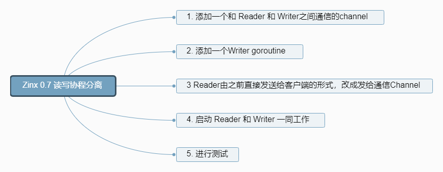
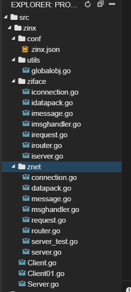
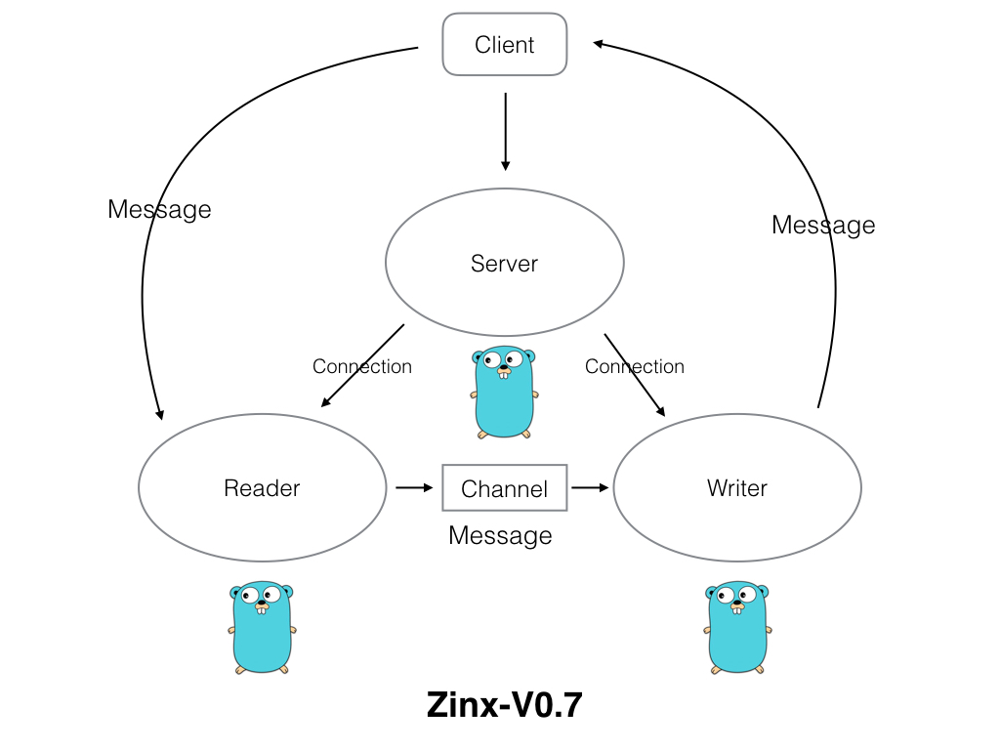
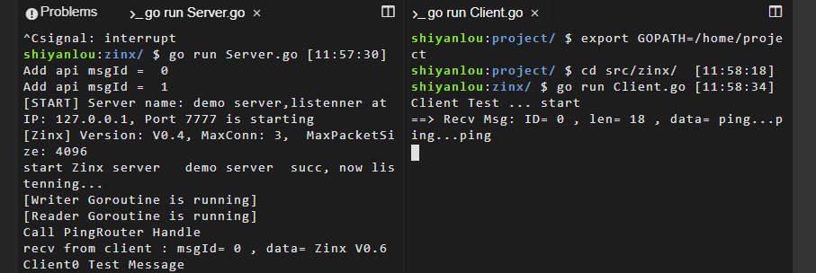

# 读写分离
[[TOC]]

## 实验介绍

接下来我们就要对 Zinx 做一个小小的改变，就是与客户端进修数据交互的 Gouroutine 由一个变成两个，一个专门负责从客户端读取数据，一个专门负责向客户端写数据。这么设计有什么好处，当然是目的就是高内聚，模块的功能单一，对于我们今后扩展功能更加方便。



## 准备工作

我们先把之前写好的代码复制下来。

```bash
wget https://labfile.oss.aliyuncs.com/courses/1639/src06.zip && unzip src06.zip
export GOPATH=/home/project
```

执行后我们的项目目录如下图：



我们希望 Zinx 在升级到 V0.7 版本的时候，架构是下面这样的：



Server 依然是处理客户端的响应，主要关键的几个方法是 Listen、Accept 等。当建立与客户端的套接字后，那么就会开启两个 Goroutine 分别处理读数据业务和写数据业务，读写数据之间的消息通过一个 Channel 传递。下面我们就开始进行实际的实现。

下面我们就开始实现 Zinx V0.7。

### 添加读写模块交互数据的管道

我们给`Connection`新增一个管道成员`msgChan`,作用是用于读写两个 go 的通信。

> zinx/znet/connection.go

```go
type Connection struct {
    //当前连接的socket TCP套接字
    Conn *net.TCPConn
    //当前连接的ID 也可以称作为SessionID，ID全局唯一
    ConnID uint32
    //当前连接的关闭状态
    isClosed bool
    //消息管理MsgId和对应处理方法的消息管理模块
    MsgHandler ziface.IMsgHandle
    //告知该链接已经退出/停止的channel
    ExitBuffChan chan bool
    //无缓冲管道，用于读、写两个goroutine之间的消息通信
    msgChan        chan []byte
}
//创建连接的方法
func NewConntion(conn *net.TCPConn, connID uint32, msgHandler ziface.IMsgHandle) *Connection{
    c := &Connection{
        Conn:     conn,
        ConnID:   connID,
        isClosed: false,
        MsgHandler: msgHandler,
        ExitBuffChan: make(chan bool, 1),
        msgChan:make(chan []byte), //msgChan初始化
    }
    return c
}
```

### 创建 Writer Goroutine

> zinx/znet/connection.go

```go
/*
    写消息Goroutine， 用户将数据发送给客户端
 */
 func (c *Connection) StartWriter() {
    fmt.Println("[Writer Goroutine is running]")
    defer fmt.Println(c.RemoteAddr().String(), "[conn Writer exit!]")
     for {
         select {
             case data := <-c.msgChan:
                 //有数据要写给客户端
                 if _, err := c.Conn.Write(data); err != nil {
                     fmt.Println("Send Data error:, ", err, " Conn Writer exit")
                     return
                }
             case <- c.ExitBuffChan:
                 //conn已经关闭
                 return
        }
    }
 }
```

关于 for select 和 channel 的用法：

select 语句只能与通道联用，它一般由若干个分支组成。每次执行这种语句的时候，一般只有一个分支中的代码会被运行。select 语句的分支分为两种，一种叫做候选分支，另一种叫做默认分支。候选分支总是以关键字 case 开头，后跟一个 case 表达式和一个冒号，然后我们可以从下一行开始写入当分支被选中时需要执行的语句。

由于 select 语句是专为通道而设计的，所以每个 case 表达式中都只能包含操作通道的表达式，比如接收表达式。使用一个接收值可以接收通道里的值，使用两个接收值可以判断通道是否已经关闭了。

对于 select 语句的执行规则如下：

- 每个 case 都必须是一个通信。
- 所有 Channel 表达式都会被求值。
- 所有被发送的表达式都会被求值。
- 如果任意某个通信可以进行，它就执行，其他被忽略。
- 如果有多个 case 都可以运行，Select 会随机公平地选出一个执行。其他不会执行。 否则：
- 如果有 default 子句，则执行该语句。
- 如果没有 default 子句，select 将阻塞，直到某个通信可以运行；Go 不会重新对 Channel 或值进行求值。

注意这里是和 switch 的操作是不一样的，switch 操作中，只要从上到下有一个满足条件了，就会执行相应的那一个 case，select 中，我们是全部计算一遍，然后再从可满足条件的 case 中公平的执行其中一个。这是为了防止有些通道长期得不到执行。

### Reader 将发送客户端的数据改为发送至 Channel

修改 Reader 调用的`SendMsg()`方法

> zinx/znet/connection.go

```go
//直接将Message数据发送数据给远程的TCP客户端
func (c *Connection) SendMsg(msgId uint32, data []byte) error {
    if c.isClosed == true {
        return errors.New("Connection closed when send msg")
    }
    //将data封包，并且发送
    dp := NewDataPack()
    msg, err := dp.Pack(NewMsgPackage(msgId, data))
    if err != nil {
        fmt.Println("Pack error msg id = ", msgId)
        return  errors.New("Pack error msg ")
    }
    //写回客户端
    c.msgChan <- msg   //将之前直接回写给conn.Write的方法 改为 发送给Channel 供Writer读取
    return nil
}
```

### 启动 Reader 和 Writer

> zinx/znet/connection.go

```go
//启动连接，让当前连接开始工作
func (c *Connection) Start() {
    //1 开启用户从客户端读取数据流程的Goroutine
    go c.StartReader()
    //2 开启用于写回客户端数据流程的Goroutine
    go c.StartWriter()
    for {
        select {
        case <- c.ExitBuffChan:
            //得到退出消息，不再阻塞
            return
        }
    }
}
```

## Zinx 0.7 测试

这里我们的测试代码不需要做任何修改，大家可以想一想为什么。我们这里的测试步骤也和上一节保持一致。测试结果如下：



## 实验总结

我们今天通过 Channel 实现了 Goroutine 的读写分离，关于 Channel 是 Golang 的一个特色机制，大家可以在课下多找一些资料了解其详情。