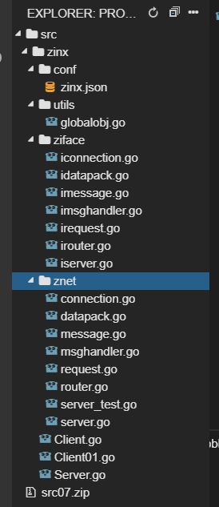
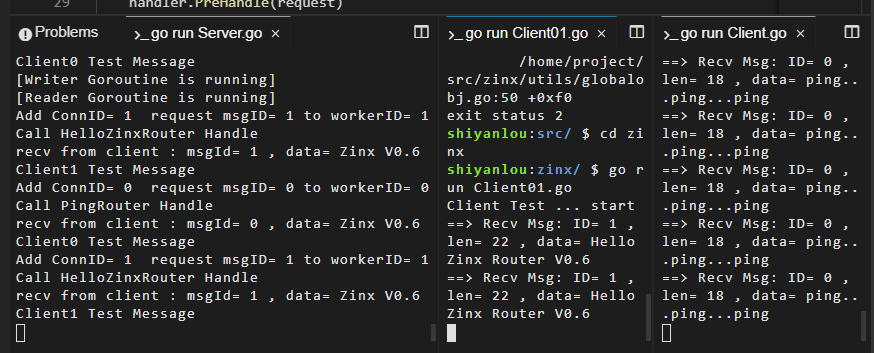

# 实现工作池
[[TOC]]

## 实验介绍

我们现在就需要给 Zinx 添加消息队列和多任务 Worker 机制了。 本节思维导图比较大，建议同学们右键保存到本地放大查看。


## 准备工作

我们先把之前写好的代码复制下来。

```bash
wget https://labfile.oss.aliyuncs.com/courses/1639/src07.zip && unzip src07.zip
export GOPATH=/home/project
```

执行后我们的项目目录如下图：



我们可以通过 worker 的数量来限定处理业务的固定 goroutine 数量，而不是无限制的开辟 Goroutine，虽然我们知道 go 的调度算法已经做的很极致了，但是大数量的 Goroutine 依然会带来一些不必要的环境切换成本，这些本应该是服务器应该节省掉的成本。我们可以用消息队列来缓冲 worker 工作的数据。

初步我们的设计结构如下图：


## 创建消息队列

首先，处理消息队列的部分，我们应该集成到`MsgHandler`模块下，因为属于我们消息模块范畴内的。

> zinx/znet/msghandler.go

```go
type MsgHandle struct {
    Apis           map[uint32]ziface.IRouter  //存放每个MsgId 所对应的处理方法的map属性
    WorkerPoolSize uint32                     //业务工作Worker池的数量
    TaskQueue      []chan ziface.IRequest     //Worker负责取任务的消息队列
}
func NewMsgHandle() *MsgHandle {
    return &MsgHandle{
        Apis: make(map[uint32]ziface.IRouter),
        WorkerPoolSize:utils.GlobalObject.WorkerPoolSize,
        //一个worker对应一个queue
        TaskQueue:make([]chan ziface.IRequest, utils.GlobalObject.WorkerPoolSize),
    }
}
```

这里添加两个成员:

- `WokerPoolSize`:作为工作池的数量，因为 TaskQueue 中的每个队列应该是和一个 Worker 对应的，所以我们在创建 TaskQueue 中队列数量要和 Worker 的数量一致。
- `TaskQueue`真是一个 Request 请求信息的 channel 集合。用来缓冲提供 worker 调用的 Request 请求信息，worker 会从对应的队列中获取客户端的请求数据并且处理掉。

当然`WorkerPoolSize`最好也可以从`GlobalObject`获取，并且`zinx.json`配置文件可以手动配置。

> zinx/utils/globalobj.go

```go
/*
    存储一切有关Zinx框架的全局参数，供其他模块使用
    一些参数也可以通过 用户根据 zinx.json来配置
*/
type GlobalObj struct {
    /*
        Server
    */
    TcpServer ziface.IServer //当前Zinx的全局Server对象
    Host      string         //当前服务器主机IP
    TcpPort   int            //当前服务器主机监听端口号
    Name      string         //当前服务器名称
    /*
        Zinx
    */
    Version          string //当前Zinx版本号
    MaxPacketSize    uint32 //都需数据包的最大值
    MaxConn          int    //当前服务器主机允许的最大链接个数
    WorkerPoolSize   uint32 //业务工作Worker池的数量
    MaxWorkerTaskLen uint32 //业务工作Worker对应负责的任务队列最大任务存储数量
    /*
        config file path
    */
    ConfFilePath string
}
//...
//...
/*
    提供init方法，默认加载
*/
func init() {
    //初始化GlobalObject变量，设置一些默认值
    GlobalObject = &GlobalObj{
        Name:          "ZinxServerApp",
        Version:       "V0.4",
        TcpPort:       7777,
        Host:          "0.0.0.0",
        MaxConn:       12000,
        MaxPacketSize: 4096,
        ConfFilePath:  "conf/zinx.json",
        WorkerPoolSize: 10,
        MaxWorkerTaskLen: 1024,
    }
    //从配置文件中加载一些用户配置的参数
    GlobalObject.Reload()
}
```

## 创建及启动 Worker 工作池

现在添加 Worker 工作池，先定义一些启动工作池的接口。

> zinx/ziface/imsghandler.go

```go
/*
    消息管理抽象层
 */
type IMsgHandle interface{
    DoMsgHandler(request IRequest)            //马上以非阻塞方式处理消息
    AddRouter(msgId uint32, router IRouter)    //为消息添加具体的处理逻辑
    StartWorkerPool()                        //启动worker工作池
    SendMsgToTaskQueue(request IRequest)    //将消息交给TaskQueue,由worker进行处理
}
```

> zinx/znet/msghandler.go

```go
// 注意，头文件中要引入 zinx/utils
//启动一个Worker工作流程
func (mh *MsgHandle) StartOneWorker(workerID int, taskQueue chan ziface.IRequest) {
    fmt.Println("Worker ID = ", workerID, " is started.")
    //不断的等待队列中的消息
    for {
        select {
            //有消息则取出队列的Request，并执行绑定的业务方法
            case request := <-taskQueue:
                mh.DoMsgHandler(request)
        }
    }
}
//启动worker工作池
func (mh *MsgHandle) StartWorkerPool() {
    //遍历需要启动worker的数量，依此启动
    for i:= 0; i < int(mh.WorkerPoolSize); i++ {
        //一个worker被启动
        //给当前worker对应的任务队列开辟空间
        mh.TaskQueue[i] = make(chan ziface.IRequest, utils.GlobalObject.MaxWorkerTaskLen)
        //启动当前Worker，阻塞的等待对应的任务队列是否有消息传递进来
        go mh.StartOneWorker(i, mh.TaskQueue[i])
    }
}
```

`StartWorkerPool()`方法是启动 Worker 工作池，这里根据用户配置好的`WorkerPoolSize`的数量来启动，然后分别给每个 Worker 分配一个`TaskQueue`，然后用一个 goroutine 来承载一个 Worker 的工作业务。

`StartOneWorker()`方法就是一个 Worker 的工作业务，每个 worker 是不会退出的(目前没有设定 worker 的停止工作机制)，会永久的从对应的 TaskQueue 中等待消息，并处理。

## 发送消息给消息队列

现在，worker 工作池已经准备就绪了，那么就需要有一个给到 worker 工作池消息的入口，我们再定义一个方法

> zinx/znet/msghandler.go

```go
//将消息交给TaskQueue,由worker进行处理
func (mh *MsgHandle)SendMsgToTaskQueue(request ziface.IRequest) {
    //根据ConnID来分配当前的连接应该由哪个worker负责处理
    //轮询的平均分配法则
    //得到需要处理此条连接的workerID
    workerID := request.GetConnection().GetConnID() % mh.WorkerPoolSize
    fmt.Println("Add ConnID=", request.GetConnection().GetConnID()," request msgID=", request.GetMsgID(), "to workerID=", workerID)
    //将请求消息发送给任务队列
    mh.TaskQueue[workerID] <- request
}
```

`SendMsgToTaskQueue()`作为工作池的数据入口，这里面采用的是轮询的分配机制，因为不同链接信息都会调用这个入口，那么到底应该由哪个 worker 处理该链接的请求处理，整理用的是一个简单的求模运算。用余数和 workerID 的匹配来进行分配。

最终将 request 请求数据发送给对应 worker 的 TaskQueue，那么对应的 worker 的 Goroutine 就会处理该链接请求了。

## Zinx-V0.8 代码实现

好了，现在需要将消息队列和多任务 worker 机制集成到我们 Zinx 的中了。我们在 Server 的`Start()`方法中，在服务端 Accept 之前，启动 Worker 工作池。

> zinx/znet/server.go

```go
//开启网络服务,只需要修改这里所提到的部分，对于打了 //... 的部分的意思是原来的代码不需要做修改
func (s *Server) Start() {
    //...
    //开启一个go去做服务端Linster业务
    go func() {
        //0 启动worker工作池机制
        s.msgHandler.StartWorkerPool()
        //1 获取一个TCP的Addr
        addr, err := net.ResolveTCPAddr(s.IPVersion, fmt.Sprintf("%s:%d", s.IP, s.Port))
        if err != nil {
            fmt.Println("resolve tcp addr err: ", err)
            return
        }
        //...
        //...
        }
    }()
}
```

其次，当我们已经得到客户端的连接请求过来数据的时候，我们应该将数据发送给 Worker 工作池进行处理。

所以应该在 Connection 的`StartReader()`方法中修改：

> zinx/znet/connection.go

```go
// 注意，头文件中要引入 zinx/utils
/*
    读消息Goroutine，用于从客户端中读取数据
 */
func (c *Connection) StartReader() {
    fmt.Println("Reader Goroutine is  running")
    defer fmt.Println(c.RemoteAddr().String(), " conn reader exit!")
    defer c.Stop()
    for  {
        //...
        req := Request{
            conn:c,
            msg:msg,
        }
        if utils.GlobalObject.WorkerPoolSize > 0 {
            //已经启动工作池机制，将消息交给Worker处理
            c.MsgHandler.SendMsgToTaskQueue(&req)
        } else {
            //从绑定好的消息和对应的处理方法中执行对应的Handle方法
            go c.MsgHandler.DoMsgHandler(&req)
        }
    }
}
```

这里并没有强制使用多任务 Worker 机制，而是判断用户配置`WorkerPoolSize`的个数，如果大于 0，那么我就启动多任务机制处理链接请求消息，如果=0 或者<0 那么，我们依然只是之前的开启一个临时的 Goroutine 处理客户端请求消息。

## 测试

测试代码和 V0.6、V0.7 的代码一样。因为 Zinx 框架对外接口没有发生改变。

我们分别启动 Server、Client。请一定要注意，我们开启新命令行之后一定要先执行 `export GOPATH=/home/project` 来修改环境变量。

测试结果：



## 实验总结

我们今天实现了 Zinx 框架的工作池，同时解答了上一节中为什么我们的测试代码无需修改。我们的 Zinx 对外提供服务的接口没有改变，所以测试文件不需要修改。